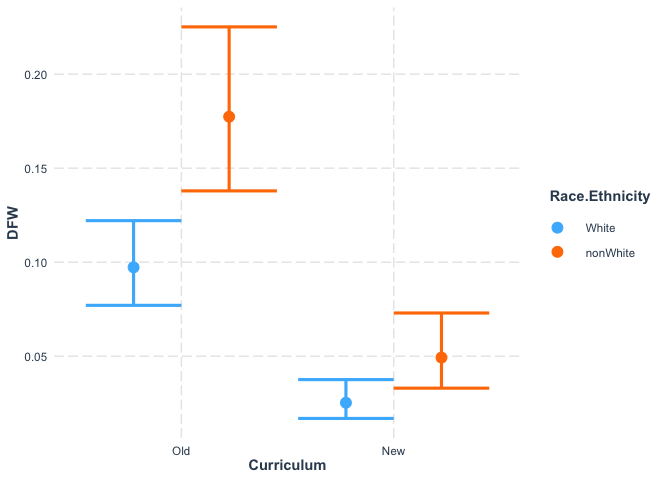
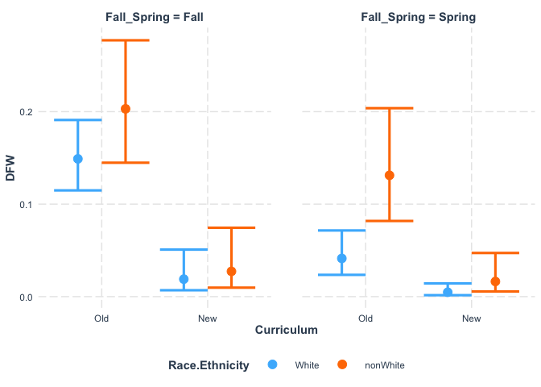
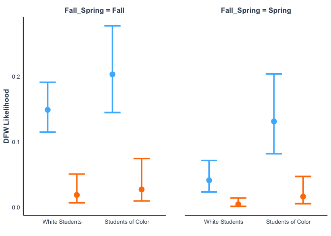
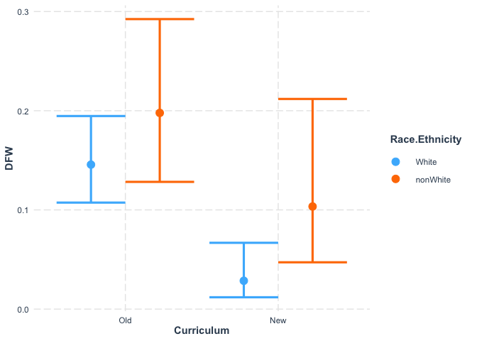
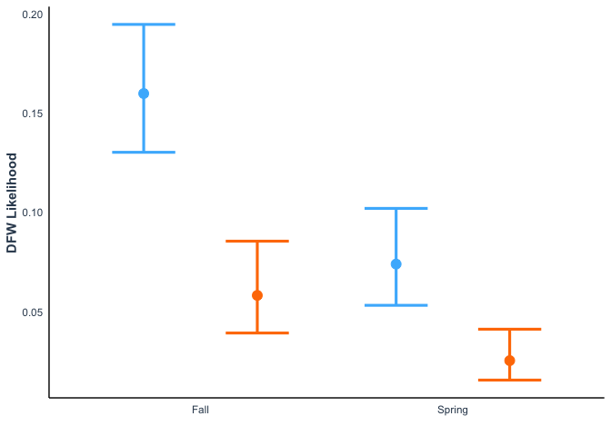

IMPORTANT NOTE

This Rmd uses the deidentified results and is safe to share.


We wish to determine if the new core classes (CURE Lab and BIO Seminar) are helping students to succeed academically.

## Loading Results

I asked the registrar to help me answer the following questions:
1. What was the DFW rate for first-year students in BIOL 205 and 206 from SP 2017 to FA 2019?
2. What was the DFW rate for all students in BIOL 201 and 202 from FA 2021 to SP 2024?

They sent us the files located in the "Grade Outcomes" folder.
I have removed any identifying information for the students and instructors.

Note that the analysis 205 and 206 only includes first-year students in these Biology classes, even though there are other students in these classes.
This is to make it more comparable to 201 and 202 which are not taken by nearly as broad a spectrum of students.

Importing data for 205 and 206.


```
## Warning: There was 1 warning in `mutate()`.
## ℹ In argument: `across(Grade, str_replace, "D|F|W", "DFW")`.
## Caused by warning:
## ! The `...` argument of `across()` is deprecated as of dplyr 1.1.0.
## Supply arguments directly to `.fns` through an anonymous function instead.
## 
##   # Previously
##   across(a:b, mean, na.rm = TRUE)
## 
##   # Now
##   across(a:b, \(x) mean(x, na.rm = TRUE))
```

```
## [1] "Semester"                   "Course"                    
## [3] "Gender"                     "First-Generation Indicator"
## [5] "Grade"                      "Race.Ethnicity"            
## [7] "Curriculum"
```

```
## BIOL205 BIOL206 
##     470     390
```

```
##  DFW Pass 
##  104  756
```

```
##   Fall Term 2017-2018   Fall Term 2018-2019   Fall Term 2019-2020 
##                   149                   159                   162 
## Spring Term 2016-2017 Spring Term 2017-2018 Spring Term 2018-2019 
##                   119                   123                   148
```

```
## Female   Male 
##    633    227
```

```
## nonWhite    White 
##      254      606
```

Importing data from 201 and 202.
The spreadsheets have a very awkward format and were checked carefully. 
Before I imported the data, I consolidated it within excel to make the three years have a consistent format.


Converting Totals into Passes by subtracting each D, F, or W.


```
##  [1] "Course"                "Semester"              "D_Male_White"         
##  [4] "F_Female_White"        "W_Female_White"        "W_Male_White"         
##  [7] "Female_Total_White"    "Male_Total_White"      "D_Male_nonWhite"      
## [10] "F_Female_nonWhite"     "W_Female_nonWhite"     "W_Male_nonWhite"      
## [13] "Female_Total_nonWhite" "Male_Total_nonWhite"
```

```
##  [1] "Course"                "Semester"              "D_Female_White"       
##  [4] "F_Female_White"        "W_Female_White"        "W_Male_White"         
##  [7] "Female_Total_White"    "Male_Total_White"      "D_Female_nonWhite"    
## [10] "F_Female_nonWhite"     "W_Female_nonWhite"     "W_Male_nonWhite"      
## [13] "Female_Total_nonWhite" "Male_Total_nonWhite"
```

```
##  [1] "Course"                "Semester"              "D_Female_White"       
##  [4] "D_Male_White"          "F_Female_White"        "F_Male_White"         
##  [7] "W_Female_White"        "Female_Total_White"    "Male_Total_White"     
## [10] "D_Female_nonWhite"     "D_Male_nonWhite"       "F_Female_nonWhite"    
## [13] "F_Male_nonWhite"       "W_Female_nonWhite"     "Female_Total_nonWhite"
## [16] "Male_Total_nonWhite"
```

Now pivoting the table and splitting the categories


``` r
names(DFW_21_22)
```

```
##  [1] "Course"               "Semester"             "D_Male_White"        
##  [4] "F_Female_White"       "W_Female_White"       "W_Male_White"        
##  [7] "D_Male_nonWhite"      "F_Female_nonWhite"    "W_Female_nonWhite"   
## [10] "W_Male_nonWhite"      "Pass_Female_White"    "Pass_Male_White"     
## [13] "Pass_Female_nonWhite" "Pass_Male_nonWhite"
```

``` r
DFW_21_22_long <- DFW_21_22 %>%
  pivot_longer(cols = D_Male_White:Pass_Male_nonWhite, 
               names_to = "Group", values_to = "Count") %>%
  separate_wider_delim(Group, delim = "_", names = c("Grade", "Gender", "Race.Ethnicity")) %>%
  mutate(across(Grade, str_replace, 'D|F|W', 'DFW')) %>%
  uncount(weights = Count) 
summary(as.factor(DFW_21_22_long$Grade))
```

```
##  DFW Pass 
##    9  320
```

``` r
names(DFW_22_23)
```

```
##  [1] "Course"               "Semester"             "D_Female_White"      
##  [4] "F_Female_White"       "W_Female_White"       "W_Male_White"        
##  [7] "D_Female_nonWhite"    "F_Female_nonWhite"    "W_Female_nonWhite"   
## [10] "W_Male_nonWhite"      "Pass_Female_White"    "Pass_Male_White"     
## [13] "Pass_Female_nonWhite" "Pass_Male_nonWhite"
```

``` r
DFW_22_23_long <- DFW_22_23 %>%
  pivot_longer(cols = D_Female_White:Pass_Male_nonWhite, 
               names_to = "Group", values_to = "Count") %>%
  separate_wider_delim(Group, delim = "_", names = c("Grade", "Gender", "Race.Ethnicity")) %>%
  mutate(across(Grade, str_replace, 'D|F|W', 'DFW')) %>%
  uncount(weights = Count) 
summary(as.factor(DFW_22_23_long$Grade))
```

```
##  DFW Pass 
##   10  272
```

``` r
names(DFW_23_24)
```

```
##  [1] "Course"               "Semester"             "D_Female_White"      
##  [4] "D_Male_White"         "F_Female_White"       "F_Male_White"        
##  [7] "W_Female_White"       "D_Female_nonWhite"    "D_Male_nonWhite"     
## [10] "F_Female_nonWhite"    "F_Male_nonWhite"      "W_Female_nonWhite"   
## [13] "Pass_Female_White"    "Pass_Male_White"      "Pass_Female_nonWhite"
## [16] "Pass_Male_nonWhite"
```

``` r
DFW_23_24_long <- DFW_23_24 %>%
  pivot_longer(cols = D_Female_White:Pass_Male_nonWhite, 
               names_to = "Group", values_to = "Count") %>%
  separate_wider_delim(Group, delim = "_", names = c("Grade", "Gender", "Race.Ethnicity")) %>%
  mutate(across(Grade, str_replace, 'D|F|W', 'DFW')) %>%
  uncount(weights = Count) 
summary(as.factor(DFW_23_24_long$Grade))
```

```
##  DFW Pass 
##   10  258
```

``` r
DFW_201_202 <- DFW_21_22_long %>%
  add_row(DFW_22_23_long) %>%
  add_row(DFW_23_24_long) %>%
  mutate(Curriculum = "New")
```

Combining the two datasets


``` r
All_DFW <- BIOL205_206 %>%
  select(names(DFW_201_202)) %>%
  add_row(DFW_201_202) %>%
  mutate_if(is.character, as.factor) %>%
  mutate(Curriculum = fct_relevel(Curriculum, c("Old", "New"))) %>%
  mutate(`Race.Ethnicity` = fct_relevel(`Race.Ethnicity`, c("White", "nonWhite")))

Only202_DFW <- All_DFW %>%
  filter(Course != "BIOL201")

summary(All_DFW)
```

```
##      Course                   Semester    Grade         Gender    
##  BIOL201:569   Spring 2022        :180   DFW : 133   Female:1251  
##  BIOL202:310   Fall Term 2019-2020:162   Pass:1606   Male  : 488  
##  BIOL205:470   Fall Term 2018-2019:159                            
##  BIOL206:390   Fall 2021          :149                            
##                Fall 2022          :149                            
##                Fall Term 2017-2018:149                            
##                (Other)            :791                            
##   Race.Ethnicity Curriculum
##  White   :1202   Old:860   
##  nonWhite: 537   New:879   
##                            
##                            
##                            
##                            
## 
```

``` r
summary(Only202_DFW)
```

```
##      Course                     Semester    Grade         Gender   
##  BIOL201:  0   Fall Term 2019-2020  :162   DFW : 108   Female:850  
##  BIOL202:310   Fall Term 2018-2019  :159   Pass:1062   Male  :320  
##  BIOL205:470   Fall Term 2017-2018  :149                           
##  BIOL206:390   Spring Term 2018-2019:148                           
##                Spring Term 2017-2018:123                           
##                Spring Term 2016-2017:119                           
##                (Other)              :310                           
##   Race.Ethnicity Curriculum
##  White   :832    Old:860   
##  nonWhite:338    New:310   
##                            
##                            
##                            
##                            
## 
```

``` r
All_DFW %>%
  filter(Course == "BIOL202") |>
  group_by(`Race.Ethnicity`) %>%
  summarise(n = n())
```

```
## # A tibble: 2 × 2
##   Race.Ethnicity     n
##   <fct>          <int>
## 1 White            226
## 2 nonWhite          84
```

``` r
All_DFW %>%
  group_by(Curriculum, Grade) %>%
  summarise(n = n())
```

```
## `summarise()` has regrouped the output.
## ℹ Summaries were computed grouped by Curriculum and Grade.
## ℹ Output is grouped by Curriculum.
## ℹ Use `summarise(.groups = "drop_last")` to silence this message.
## ℹ Use `summarise(.by = c(Curriculum, Grade))` for per-operation grouping
##   (`?dplyr::dplyr_by`) instead.
```

```
## # A tibble: 4 × 3
## # Groups:   Curriculum [2]
##   Curriculum Grade     n
##   <fct>      <fct> <int>
## 1 Old        DFW     104
## 2 Old        Pass    756
## 3 New        DFW      29
## 4 New        Pass    850
```

``` r
Only202_DFW %>%
  group_by(Curriculum, Grade) %>%
  summarise(n = n())
```

```
## `summarise()` has regrouped the output.
## ℹ Summaries were computed grouped by Curriculum and Grade.
## ℹ Output is grouped by Curriculum.
## ℹ Use `summarise(.groups = "drop_last")` to silence this message.
## ℹ Use `summarise(.by = c(Curriculum, Grade))` for per-operation grouping
##   (`?dplyr::dplyr_by`) instead.
```

```
## # A tibble: 4 × 3
## # Groups:   Curriculum [2]
##   Curriculum Grade     n
##   <fct>      <fct> <int>
## 1 Old        DFW     104
## 2 Old        Pass    756
## 3 New        DFW       4
## 4 New        Pass    306
```

``` r
Only202_DFW %>%
  group_by(Course, Grade) %>%
  summarise(n = n())
```

```
## `summarise()` has regrouped the output.
## ℹ Summaries were computed grouped by Course and Grade.
## ℹ Output is grouped by Course.
## ℹ Use `summarise(.groups = "drop_last")` to silence this message.
## ℹ Use `summarise(.by = c(Course, Grade))` for per-operation grouping
##   (`?dplyr::dplyr_by`) instead.
```

```
## # A tibble: 6 × 3
## # Groups:   Course [3]
##   Course  Grade     n
##   <fct>   <fct> <int>
## 1 BIOL202 DFW       4
## 2 BIOL202 Pass    306
## 3 BIOL205 DFW      77
## 4 BIOL205 Pass    393
## 5 BIOL206 DFW      27
## 6 BIOL206 Pass    363
```

## Modeling results with a binomial glm

Note that originally a negative binomial glm was performed, but a binomial is more appropriate now that DFW grades have been aggregated.

### Both 201 and 202


```
## 
## Call:
## glm.nb(formula = DFW ~ Curriculum, data = All_DFW, init.theta = 1340.369534, 
##     link = log)
## 
## Coefficients:
##               Estimate Std. Error z value Pr(>|z|)    
## (Intercept)   -2.11254    0.09806 -21.543  < 2e-16 ***
## CurriculumNew -1.29895    0.21000  -6.185 6.19e-10 ***
## ---
## Signif. codes:  0 '***' 0.001 '**' 0.01 '*' 0.05 '.' 0.1 ' ' 1
## 
## (Dispersion parameter for Negative Binomial(1340.37) family taken to be 1)
## 
##     Null deviance: 683.72  on 1738  degrees of freedom
## Residual deviance: 637.19  on 1737  degrees of freedom
## AIC: 909.29
## 
## Number of Fisher Scoring iterations: 1
## 
## 
##               Theta:  1340 
##           Std. Err.:  7261 
## Warning while fitting theta: iteration limit reached 
## 
##  2 x log-likelihood:  -903.285
```

```
## 
## Call:
## glm.nb(formula = DFW ~ Curriculum * Gender * Race.Ethnicity, 
##     data = All_DFW, init.theta = 1122.190149, link = log)
## 
## Coefficients:
##                                                 Estimate Std. Error z value
## (Intercept)                                     -2.29604    0.14745 -15.572
## CurriculumNew                                   -1.80068    0.40571  -4.438
## GenderMale                                       0.06468    0.29025   0.223
## Race.EthnicitynonWhite                           0.38365    0.24537   1.564
## CurriculumNew:GenderMale                         0.47669    0.65354   0.729
## CurriculumNew:Race.EthnicitynonWhite             0.91477    0.53517   1.709
## GenderMale:Race.EthnicitynonWhite                0.26358    0.43038   0.612
## CurriculumNew:GenderMale:Race.EthnicitynonWhite -0.85157    0.90080  -0.945
##                                                 Pr(>|z|)    
## (Intercept)                                      < 2e-16 ***
## CurriculumNew                                   9.07e-06 ***
## GenderMale                                        0.8236    
## Race.EthnicitynonWhite                            0.1179    
## CurriculumNew:GenderMale                          0.4658    
## CurriculumNew:Race.EthnicitynonWhite              0.0874 .  
## GenderMale:Race.EthnicitynonWhite                 0.5402    
## CurriculumNew:GenderMale:Race.EthnicitynonWhite   0.3445    
## ---
## Signif. codes:  0 '***' 0.001 '**' 0.01 '*' 0.05 '.' 0.1 ' ' 1
## 
## (Dispersion parameter for Negative Binomial(1122.19) family taken to be 1)
## 
##     Null deviance: 683.70  on 1738  degrees of freedom
## Residual deviance: 621.19  on 1731  degrees of freedom
## AIC: 905.3
## 
## Number of Fisher Scoring iterations: 1
## 
## 
##               Theta:  1122 
##           Std. Err.:  5328 
## Warning while fitting theta: iteration limit reached 
## 
##  2 x log-likelihood:  -887.304
```

```
## 
## Call:
## glm(formula = DFW ~ Curriculum, family = "binomial", data = All_DFW)
## 
## Coefficients:
##               Estimate Std. Error z value Pr(>|z|)    
## (Intercept)    -1.9837     0.1046 -18.967  < 2e-16 ***
## CurriculumNew  -1.3943     0.2159  -6.459 1.05e-10 ***
## ---
## Signif. codes:  0 '***' 0.001 '**' 0.01 '*' 0.05 '.' 0.1 ' ' 1
## 
## (Dispersion parameter for binomial family taken to be 1)
## 
##     Null deviance: 939.37  on 1738  degrees of freedom
## Residual deviance: 889.19  on 1737  degrees of freedom
## AIC: 893.19
## 
## Number of Fisher Scoring iterations: 6
```

```
## 
## Call:
## glm(formula = DFW ~ Curriculum * Gender * Race.Ethnicity, family = "binomial", 
##     data = All_DFW)
## 
## Coefficients:
##                                                 Estimate Std. Error z value
## (Intercept)                                     -2.18995    0.15547 -14.086
## CurriculumNew                                   -1.89000    0.41156  -4.592
## GenderMale                                       0.07219    0.30691   0.235
## Race.EthnicitynonWhite                           0.43741    0.26325   1.662
## CurriculumNew:GenderMale                         0.48140    0.66730   0.721
## CurriculumNew:Race.EthnicitynonWhite             0.90709    0.55068   1.647
## GenderMale:Race.EthnicitynonWhite                0.32580    0.46685   0.698
## CurriculumNew:GenderMale:Race.EthnicitynonWhite -0.92896    0.93281  -0.996
##                                                 Pr(>|z|)    
## (Intercept)                                      < 2e-16 ***
## CurriculumNew                                   4.38e-06 ***
## GenderMale                                        0.8140    
## Race.EthnicitynonWhite                            0.0966 .  
## CurriculumNew:GenderMale                          0.4706    
## CurriculumNew:Race.EthnicitynonWhite              0.0995 .  
## GenderMale:Race.EthnicitynonWhite                 0.4853    
## CurriculumNew:GenderMale:Race.EthnicitynonWhite   0.3193    
## ---
## Signif. codes:  0 '***' 0.001 '**' 0.01 '*' 0.05 '.' 0.1 ' ' 1
## 
## (Dispersion parameter for binomial family taken to be 1)
## 
##     Null deviance: 939.37  on 1738  degrees of freedom
## Residual deviance: 871.83  on 1731  degrees of freedom
## AIC: 887.83
## 
## Number of Fisher Scoring iterations: 6
```


```
## Start:  AIC=887.83
## DFW ~ Curriculum * Gender * Race.Ethnicity
## 
##                                    Df Deviance    AIC
## - Curriculum:Gender:Race.Ethnicity  1   872.83 886.83
## <none>                                  871.83 887.83
## 
## Step:  AIC=886.83
## DFW ~ Curriculum + Gender + Race.Ethnicity + Curriculum:Gender + 
##     Curriculum:Race.Ethnicity + Gender:Race.Ethnicity
## 
##                             Df Deviance    AIC
## - Curriculum:Gender          1   872.83 884.83
## - Gender:Race.Ethnicity      1   872.88 884.88
## - Curriculum:Race.Ethnicity  1   874.64 886.64
## <none>                           872.83 886.83
## 
## Step:  AIC=884.83
## DFW ~ Curriculum + Gender + Race.Ethnicity + Curriculum:Race.Ethnicity + 
##     Gender:Race.Ethnicity
## 
##                             Df Deviance    AIC
## - Gender:Race.Ethnicity      1   872.88 882.88
## - Curriculum:Race.Ethnicity  1   874.64 884.64
## <none>                           872.83 884.83
## 
## Step:  AIC=882.88
## DFW ~ Curriculum + Gender + Race.Ethnicity + Curriculum:Race.Ethnicity
## 
##                             Df Deviance    AIC
## - Gender                     1   873.98 881.98
## - Curriculum:Race.Ethnicity  1   874.71 882.71
## <none>                           872.88 882.88
## 
## Step:  AIC=881.98
## DFW ~ Curriculum + Race.Ethnicity + Curriculum:Race.Ethnicity
## 
##                             Df Deviance    AIC
## - Curriculum:Race.Ethnicity  1   875.75 881.75
## <none>                           873.98 881.98
## 
## Step:  AIC=881.75
## DFW ~ Curriculum + Race.Ethnicity
## 
##                  Df Deviance    AIC
## <none>                875.75 881.75
## - Race.Ethnicity  1   889.19 893.19
## - Curriculum      1   927.79 931.79
```

```
## 
## Call:
## glm(formula = DFW ~ Curriculum + Race.Ethnicity, family = "binomial", 
##     data = All_DFW)
## 
## Coefficients:
##                        Estimate Std. Error z value Pr(>|z|)    
## (Intercept)             -2.2279     0.1301 -17.124  < 2e-16 ***
## CurriculumNew           -1.4253     0.2168  -6.573 4.94e-11 ***
## Race.EthnicitynonWhite   0.6936     0.1863   3.723 0.000197 ***
## ---
## Signif. codes:  0 '***' 0.001 '**' 0.01 '*' 0.05 '.' 0.1 ' ' 1
## 
## (Dispersion parameter for binomial family taken to be 1)
## 
##     Null deviance: 939.37  on 1738  degrees of freedom
## Residual deviance: 875.75  on 1736  degrees of freedom
## AIC: 881.75
## 
## Number of Fisher Scoring iterations: 6
```

A very big effect of the new curriculum and a smaller but significant effect of Race.Ethnicity.

The interaction between curriculum and Race.Ethnicity is not retained in the model, suggesting that the new curriculum is not signficantly better or worse at this metric for students of color. 


```
##          1          2          3          4 
## 0.09727426 0.02525469 0.17736928 0.04928693
```

```
## 
## Call:  glm(formula = DFW ~ Curriculum + Race.Ethnicity, family = "binomial", 
##     data = All_DFW)
## 
## Coefficients:
##            (Intercept)           CurriculumNew  Race.EthnicitynonWhite  
##                -2.2279                 -1.4253                  0.6936  
## 
## Degrees of Freedom: 1738 Total (i.e. Null);  1736 Residual
## Null Deviance:	    939.4 
## Residual Deviance: 875.8 	AIC: 881.8
```

```
## # Overdispersion test (using simulated residuals)
## 
##  dispersion ratio = 0.997
##           p-value =     1
```

```
## No overdispersion detected.
```

```
## # Indices of model performance
## 
## AIC   |  AICc |   BIC | Tjur's R2 |  RMSE | Sigma | Log_loss | Score_log
## ------------------------------------------------------------------------
## 881.8 | 881.8 | 898.1 |     0.036 | 0.261 |     1 |    0.252 |   -10.592
## 
## AIC   | Score_spherical |   PCP
## -------------------------------
## 881.8 |           0.014 | 0.864
```

```
## 
## Call:
## glm(formula = DFW ~ Curriculum + Race.Ethnicity, family = "binomial", 
##     data = All_DFW)
## 
## Coefficients:
##                        Estimate Std. Error z value Pr(>|z|)    
## (Intercept)             -2.2279     0.1301 -17.124  < 2e-16 ***
## CurriculumNew           -1.4253     0.2168  -6.573 4.94e-11 ***
## Race.EthnicitynonWhite   0.6936     0.1863   3.723 0.000197 ***
## ---
## Signif. codes:  0 '***' 0.001 '**' 0.01 '*' 0.05 '.' 0.1 ' ' 1
## 
## (Dispersion parameter for binomial family taken to be 1)
## 
##     Null deviance: 939.37  on 1738  degrees of freedom
## Residual deviance: 875.75  on 1736  degrees of freedom
## AIC: 881.75
## 
## Number of Fisher Scoring iterations: 6
```


```
## [1] 0.1077545
```

```
## [1] 0.1227139
```

```
## [1] 0.09461871
```


```
## [1] 4.159105
```

```
## [1] 3.348458
```

```
## [1] 5.166007
```

The model indicates that students under the old curriculum were 4.2-fold (3.5 - 5.2) more likely to earn a DFW in the first two Biology courses (p = 4.94e-11). 


```
## [1] 2.000906
```

```
## [1] 2.410659
```

```
## [1] 1.660801
```

Students of color were 2.0-fold (1.7 - 2.4) more likely to earn a DFW than white students in both curricula (p = 0.000197)


```
## Warning: Curriculum and Race.Ethnicity are not included in an interaction with one
## another in the model.
```

<!-- -->

### Only 201 and 202 by Semester

We want to see how much of the difference between 201 and 202 can be explained by the semester that they are more 
likely to be offered. 


```
## 
## Call:
## glm(formula = DFW ~ FallSpring * Course, family = "binomial", 
##     data = Only201202_DFW_Semester)
## 
## Coefficients:
##                                Estimate Std. Error z value Pr(>|z|)    
## (Intercept)                     -2.8936     0.2492 -11.614   <2e-16 ***
## FallSpringSpring                -0.4950     0.4374  -1.132    0.258    
## CourseBIOL202                   -0.7527     0.6357  -1.184    0.236    
## FallSpringSpring:CourseBIOL202  -1.1110     1.2399  -0.896    0.370    
## ---
## Signif. codes:  0 '***' 0.001 '**' 0.01 '*' 0.05 '.' 0.1 ' ' 1
## 
## (Dispersion parameter for binomial family taken to be 1)
## 
##     Null deviance: 254.90  on 878  degrees of freedom
## Residual deviance: 244.26  on 875  degrees of freedom
## AIC: 252.26
## 
## Number of Fisher Scoring iterations: 7
```

```
## Start:  AIC=252.26
## DFW ~ FallSpring * Course
## 
##                     Df Deviance    AIC
## - FallSpring:Course  1   245.15 251.15
## <none>                   244.26 252.26
## 
## Step:  AIC=251.15
## DFW ~ FallSpring + Course
## 
##              Df Deviance    AIC
## <none>            245.15 251.15
## - FallSpring  1   247.89 251.89
## - Course      1   250.61 254.61
```

```
## 
## Call:
## glm(formula = DFW ~ FallSpring + Course, family = "binomial", 
##     data = Only201202_DFW_Semester)
## 
## Coefficients:
##                  Estimate Std. Error z value Pr(>|z|)    
## (Intercept)       -2.8429     0.2376 -11.965   <2e-16 ***
## FallSpringSpring  -0.6597     0.4116  -1.603    0.109    
## CourseBIOL202     -1.1375     0.5482  -2.075    0.038 *  
## ---
## Signif. codes:  0 '***' 0.001 '**' 0.01 '*' 0.05 '.' 0.1 ' ' 1
## 
## (Dispersion parameter for binomial family taken to be 1)
## 
##     Null deviance: 254.90  on 878  degrees of freedom
## Residual deviance: 245.15  on 876  degrees of freedom
## AIC: 251.15
## 
## Number of Fisher Scoring iterations: 7
```

This demonstrates that the DFW rates are signficantly lower in BIOL202 than BIOL201, 
after accounting for the effect of Fall versus Spring.

That is not surprising given the different objectives of these courses.


### Only 202

Adding Fall vs Spring to the full model.


```
## 
## Call:
## glm(formula = DFW ~ Curriculum, family = "binomial", data = Only202_DFW)
## 
## Coefficients:
##               Estimate Std. Error z value Pr(>|z|)    
## (Intercept)    -1.9837     0.1046 -18.967  < 2e-16 ***
## CurriculumNew  -2.3536     0.5140  -4.579 4.67e-06 ***
## ---
## Signif. codes:  0 '***' 0.001 '**' 0.01 '*' 0.05 '.' 0.1 ' ' 1
## 
## (Dispersion parameter for binomial family taken to be 1)
## 
##     Null deviance: 720.36  on 1169  degrees of freedom
## Residual deviance: 677.04  on 1168  degrees of freedom
## AIC: 681.04
## 
## Number of Fisher Scoring iterations: 7
```

```
## 
## Call:
## glm(formula = DFW ~ Fall_Spring * Curriculum * Gender * Race.Ethnicity, 
##     family = "binomial", data = Only202_DFW)
## 
## Coefficients:
##                                                                    Estimate
## (Intercept)                                                         -1.7690
## Fall_SpringSpring                                                   -1.3017
## CurriculumNew                                                       -2.1430
## GenderMale                                                           0.1595
## Race.EthnicitynonWhite                                               0.3689
## Fall_SpringSpring:CurriculumNew                                    -13.3524
## Fall_SpringSpring:GenderMale                                        -0.2098
## CurriculumNew:GenderMale                                           -14.8136
## Fall_SpringSpring:Race.EthnicitynonWhite                             0.4374
## CurriculumNew:Race.EthnicitynonWhite                                 0.3651
## GenderMale:Race.EthnicitynonWhite                                   -0.1998
## Fall_SpringSpring:CurriculumNew:GenderMale                          14.8638
## Fall_SpringSpring:CurriculumNew:Race.EthnicitynonWhite              13.8684
## Fall_SpringSpring:GenderMale:Race.EthnicitynonWhite                  1.2823
## CurriculumNew:GenderMale:Race.EthnicitynonWhite                     15.7293
## Fall_SpringSpring:CurriculumNew:GenderMale:Race.EthnicitynonWhite  -31.8515
##                                                                   Std. Error
## (Intercept)                                                           0.1779
## Fall_SpringSpring                                                     0.3846
## CurriculumNew                                                         1.0255
## GenderMale                                                            0.3521
## Race.EthnicitynonWhite                                                0.3176
## Fall_SpringSpring:CurriculumNew                                     633.5356
## Fall_SpringSpring:GenderMale                                          0.7670
## CurriculumNew:GenderMale                                           1171.5010
## Fall_SpringSpring:Race.EthnicitynonWhite                              0.5959
## CurriculumNew:Race.EthnicitynonWhite                                  1.4706
## GenderMale:Race.EthnicitynonWhite                                     0.5750
## Fall_SpringSpring:CurriculumNew:GenderMale                         1700.9943
## Fall_SpringSpring:CurriculumNew:Race.EthnicitynonWhite              633.5374
## Fall_SpringSpring:GenderMale:Race.EthnicitynonWhite                   1.0571
## CurriculumNew:GenderMale:Race.EthnicitynonWhite                    1171.5020
## Fall_SpringSpring:CurriculumNew:GenderMale:Race.EthnicitynonWhite  2483.1559
##                                                                   z value
## (Intercept)                                                        -9.946
## Fall_SpringSpring                                                  -3.385
## CurriculumNew                                                      -2.090
## GenderMale                                                          0.453
## Race.EthnicitynonWhite                                              1.161
## Fall_SpringSpring:CurriculumNew                                    -0.021
## Fall_SpringSpring:GenderMale                                       -0.274
## CurriculumNew:GenderMale                                           -0.013
## Fall_SpringSpring:Race.EthnicitynonWhite                            0.734
## CurriculumNew:Race.EthnicitynonWhite                                0.248
## GenderMale:Race.EthnicitynonWhite                                  -0.348
## Fall_SpringSpring:CurriculumNew:GenderMale                          0.009
## Fall_SpringSpring:CurriculumNew:Race.EthnicitynonWhite              0.022
## Fall_SpringSpring:GenderMale:Race.EthnicitynonWhite                 1.213
## CurriculumNew:GenderMale:Race.EthnicitynonWhite                     0.013
## Fall_SpringSpring:CurriculumNew:GenderMale:Race.EthnicitynonWhite  -0.013
##                                                                   Pr(>|z|)    
## (Intercept)                                                        < 2e-16 ***
## Fall_SpringSpring                                                 0.000713 ***
## CurriculumNew                                                     0.036638 *  
## GenderMale                                                        0.650425    
## Race.EthnicitynonWhite                                            0.245486    
## Fall_SpringSpring:CurriculumNew                                   0.983185    
## Fall_SpringSpring:GenderMale                                      0.784433    
## CurriculumNew:GenderMale                                          0.989911    
## Fall_SpringSpring:Race.EthnicitynonWhite                          0.462990    
## CurriculumNew:Race.EthnicitynonWhite                              0.803936    
## GenderMale:Race.EthnicitynonWhite                                 0.728212    
## Fall_SpringSpring:CurriculumNew:GenderMale                        0.993028    
## Fall_SpringSpring:CurriculumNew:Race.EthnicitynonWhite            0.982535    
## Fall_SpringSpring:GenderMale:Race.EthnicitynonWhite               0.225113    
## CurriculumNew:GenderMale:Race.EthnicitynonWhite                   0.989287    
## Fall_SpringSpring:CurriculumNew:GenderMale:Race.EthnicitynonWhite 0.989766    
## ---
## Signif. codes:  0 '***' 0.001 '**' 0.01 '*' 0.05 '.' 0.1 ' ' 1
## 
## (Dispersion parameter for binomial family taken to be 1)
## 
##     Null deviance: 720.36  on 1169  degrees of freedom
## Residual deviance: 636.31  on 1154  degrees of freedom
## AIC: 668.31
## 
## Number of Fisher Scoring iterations: 17
```

Fall_Spring is playing a bigger role than Curriculum. 
We need to account for that.


```
## Start:  AIC=668.31
## DFW ~ Fall_Spring * Curriculum * Gender * Race.Ethnicity
```

```
##                                                Df Deviance    AIC
## - Fall_Spring:Curriculum:Gender:Race.Ethnicity  1   636.31 666.31
## <none>                                              636.31 668.31
```

```
## 
## Step:  AIC=666.31
## DFW ~ Fall_Spring + Curriculum + Gender + Race.Ethnicity + Fall_Spring:Curriculum + 
##     Fall_Spring:Gender + Curriculum:Gender + Fall_Spring:Race.Ethnicity + 
##     Curriculum:Race.Ethnicity + Gender:Race.Ethnicity + Fall_Spring:Curriculum:Gender + 
##     Fall_Spring:Curriculum:Race.Ethnicity + Fall_Spring:Gender:Race.Ethnicity + 
##     Curriculum:Gender:Race.Ethnicity
```

```
##                                         Df Deviance    AIC
## - Fall_Spring:Curriculum:Race.Ethnicity  1   637.29 665.29
## - Curriculum:Gender:Race.Ethnicity       1   637.72 665.72
## - Fall_Spring:Gender:Race.Ethnicity      1   637.82 665.82
## - Fall_Spring:Curriculum:Gender          1   638.00 666.00
## <none>                                       636.31 666.31
```

```
## 
## Step:  AIC=665.29
## DFW ~ Fall_Spring + Curriculum + Gender + Race.Ethnicity + Fall_Spring:Curriculum + 
##     Fall_Spring:Gender + Curriculum:Gender + Fall_Spring:Race.Ethnicity + 
##     Curriculum:Race.Ethnicity + Gender:Race.Ethnicity + Fall_Spring:Curriculum:Gender + 
##     Fall_Spring:Gender:Race.Ethnicity + Curriculum:Gender:Race.Ethnicity
```

```
##                                     Df Deviance    AIC
## - Curriculum:Gender:Race.Ethnicity   1   638.27 664.27
## - Fall_Spring:Curriculum:Gender      1   638.49 664.49
## - Fall_Spring:Gender:Race.Ethnicity  1   638.57 664.57
## <none>                                   637.29 665.29
## 
## Step:  AIC=664.27
## DFW ~ Fall_Spring + Curriculum + Gender + Race.Ethnicity + Fall_Spring:Curriculum + 
##     Fall_Spring:Gender + Curriculum:Gender + Fall_Spring:Race.Ethnicity + 
##     Curriculum:Race.Ethnicity + Gender:Race.Ethnicity + Fall_Spring:Curriculum:Gender + 
##     Fall_Spring:Gender:Race.Ethnicity
## 
##                                     Df Deviance    AIC
## - Fall_Spring:Curriculum:Gender      1   639.22 663.22
## - Fall_Spring:Gender:Race.Ethnicity  1   639.41 663.41
## <none>                                   638.27 664.27
## - Curriculum:Race.Ethnicity          1   640.42 664.42
## 
## Step:  AIC=663.22
## DFW ~ Fall_Spring + Curriculum + Gender + Race.Ethnicity + Fall_Spring:Curriculum + 
##     Fall_Spring:Gender + Curriculum:Gender + Fall_Spring:Race.Ethnicity + 
##     Curriculum:Race.Ethnicity + Gender:Race.Ethnicity + Fall_Spring:Gender:Race.Ethnicity
## 
##                                     Df Deviance    AIC
## - Curriculum:Gender                  1   639.48 661.48
## - Fall_Spring:Curriculum             1   639.68 661.68
## - Fall_Spring:Gender:Race.Ethnicity  1   640.18 662.18
## - Curriculum:Race.Ethnicity          1   641.13 663.13
## <none>                                   639.22 663.22
## 
## Step:  AIC=661.48
## DFW ~ Fall_Spring + Curriculum + Gender + Race.Ethnicity + Fall_Spring:Curriculum + 
##     Fall_Spring:Gender + Fall_Spring:Race.Ethnicity + Curriculum:Race.Ethnicity + 
##     Gender:Race.Ethnicity + Fall_Spring:Gender:Race.Ethnicity
## 
##                                     Df Deviance    AIC
## - Fall_Spring:Curriculum             1   640.00 660.00
## - Fall_Spring:Gender:Race.Ethnicity  1   640.44 660.44
## - Curriculum:Race.Ethnicity          1   641.40 661.40
## <none>                                   639.48 661.48
## 
## Step:  AIC=660
## DFW ~ Fall_Spring + Curriculum + Gender + Race.Ethnicity + Fall_Spring:Gender + 
##     Fall_Spring:Race.Ethnicity + Curriculum:Race.Ethnicity + 
##     Gender:Race.Ethnicity + Fall_Spring:Gender:Race.Ethnicity
## 
##                                     Df Deviance    AIC
## - Fall_Spring:Gender:Race.Ethnicity  1   640.96 658.96
## - Curriculum:Race.Ethnicity          1   641.67 659.67
## <none>                                   640.00 660.00
## 
## Step:  AIC=658.96
## DFW ~ Fall_Spring + Curriculum + Gender + Race.Ethnicity + Fall_Spring:Gender + 
##     Fall_Spring:Race.Ethnicity + Curriculum:Race.Ethnicity + 
##     Gender:Race.Ethnicity
## 
##                              Df Deviance    AIC
## - Gender:Race.Ethnicity       1   641.19 657.19
## - Fall_Spring:Gender          1   641.48 657.48
## - Curriculum:Race.Ethnicity   1   642.63 658.63
## <none>                            640.96 658.96
## - Fall_Spring:Race.Ethnicity  1   644.23 660.23
## 
## Step:  AIC=657.19
## DFW ~ Fall_Spring + Curriculum + Gender + Race.Ethnicity + Fall_Spring:Gender + 
##     Fall_Spring:Race.Ethnicity + Curriculum:Race.Ethnicity
## 
##                              Df Deviance    AIC
## - Fall_Spring:Gender          1   641.82 655.82
## - Curriculum:Race.Ethnicity   1   642.87 656.87
## <none>                            641.19 657.19
## - Fall_Spring:Race.Ethnicity  1   644.53 658.53
## 
## Step:  AIC=655.82
## DFW ~ Fall_Spring + Curriculum + Gender + Race.Ethnicity + Fall_Spring:Race.Ethnicity + 
##     Curriculum:Race.Ethnicity
## 
##                              Df Deviance    AIC
## - Gender                      1   642.57 654.57
## - Curriculum:Race.Ethnicity   1   643.55 655.55
## <none>                            641.82 655.82
## - Fall_Spring:Race.Ethnicity  1   645.26 657.26
## 
## Step:  AIC=654.57
## DFW ~ Fall_Spring + Curriculum + Race.Ethnicity + Fall_Spring:Race.Ethnicity + 
##     Curriculum:Race.Ethnicity
## 
##                              Df Deviance    AIC
## - Curriculum:Race.Ethnicity   1   644.24 654.24
## <none>                            642.57 654.57
## - Fall_Spring:Race.Ethnicity  1   645.87 655.87
## 
## Step:  AIC=654.24
## DFW ~ Fall_Spring + Curriculum + Race.Ethnicity + Fall_Spring:Race.Ethnicity
## 
##                              Df Deviance    AIC
## <none>                            644.24 654.24
## - Fall_Spring:Race.Ethnicity  1   647.73 655.73
## - Curriculum                  1   679.55 687.55
```

```
## 
## Call:
## glm(formula = DFW ~ Fall_Spring + Curriculum + Race.Ethnicity + 
##     Fall_Spring:Race.Ethnicity, family = "binomial", data = Only202_DFW)
## 
## Coefficients:
##                                          Estimate Std. Error z value Pr(>|z|)
## (Intercept)                               -1.7429     0.1525 -11.429  < 2e-16
## Fall_SpringSpring                         -1.4015     0.3314  -4.229 2.35e-05
## CurriculumNew                             -2.2056     0.5162  -4.273 1.93e-05
## Race.EthnicitynonWhite                     0.3754     0.2567   1.463   0.1436
## Fall_SpringSpring:Race.EthnicitynonWhite   0.8783     0.4734   1.855   0.0636
##                                             
## (Intercept)                              ***
## Fall_SpringSpring                        ***
## CurriculumNew                            ***
## Race.EthnicitynonWhite                      
## Fall_SpringSpring:Race.EthnicitynonWhite .  
## ---
## Signif. codes:  0 '***' 0.001 '**' 0.01 '*' 0.05 '.' 0.1 ' ' 1
## 
## (Dispersion parameter for binomial family taken to be 1)
## 
##     Null deviance: 720.36  on 1169  degrees of freedom
## Residual deviance: 644.24  on 1165  degrees of freedom
## AIC: 654.24
## 
## Number of Fisher Scoring iterations: 7
```


```
## 
## Call:  glm(formula = DFW ~ Fall_Spring + Curriculum + Race.Ethnicity + 
##     Fall_Spring:Race.Ethnicity, family = "binomial", data = Only202_DFW)
## 
## Coefficients:
##                              (Intercept)  
##                                  -1.7429  
##                        Fall_SpringSpring  
##                                  -1.4015  
##                            CurriculumNew  
##                                  -2.2056  
##                   Race.EthnicitynonWhite  
##                                   0.3754  
## Fall_SpringSpring:Race.EthnicitynonWhite  
##                                   0.8783  
## 
## Degrees of Freedom: 1169 Total (i.e. Null);  1165 Residual
## Null Deviance:	    720.4 
## Residual Deviance: 644.2 	AIC: 654.2
```

```
## # Overdispersion test (using simulated residuals)
## 
##  dispersion ratio = 1.002
##           p-value = 0.936
```

```
## No overdispersion detected.
```

```
## # Indices of model performance
## 
## AIC   |  AICc |   BIC | Tjur's R2 |  RMSE | Sigma | Log_loss | Score_log
## ------------------------------------------------------------------------
## 654.2 | 654.3 | 679.6 |     0.056 | 0.281 |     1 |    0.275 |   -10.522
## 
## AIC   | Score_spherical |   PCP
## -------------------------------
## 654.2 |           0.013 | 0.842
```

```
## 
## Call:
## glm(formula = DFW ~ Fall_Spring + Curriculum + Race.Ethnicity + 
##     Fall_Spring:Race.Ethnicity, family = "binomial", data = Only202_DFW)
## 
## Coefficients:
##                                          Estimate Std. Error z value Pr(>|z|)
## (Intercept)                               -1.7429     0.1525 -11.429  < 2e-16
## Fall_SpringSpring                         -1.4015     0.3314  -4.229 2.35e-05
## CurriculumNew                             -2.2056     0.5162  -4.273 1.93e-05
## Race.EthnicitynonWhite                     0.3754     0.2567   1.463   0.1436
## Fall_SpringSpring:Race.EthnicitynonWhite   0.8783     0.4734   1.855   0.0636
##                                             
## (Intercept)                              ***
## Fall_SpringSpring                        ***
## CurriculumNew                            ***
## Race.EthnicitynonWhite                      
## Fall_SpringSpring:Race.EthnicitynonWhite .  
## ---
## Signif. codes:  0 '***' 0.001 '**' 0.01 '*' 0.05 '.' 0.1 ' ' 1
## 
## (Dispersion parameter for binomial family taken to be 1)
## 
##     Null deviance: 720.36  on 1169  degrees of freedom
## Residual deviance: 644.24  on 1165  degrees of freedom
## AIC: 654.24
## 
## Number of Fisher Scoring iterations: 7
```

Fall semester:


```
## [1] 0.1750121
```

```
## [1] 0.2038441
```

```
## [1] 0.1502582
```

Spring semester:


```
## [1] 0.06788773
```

```
## [1] 0.09456196
```

```
## [1] 0.04873782
```

Curriculum effect:


```
## [1] 0.1101844
```

```
## [1] 0.1846303
```

```
## [1] 0.06575629
```

```
## [1] 9.075695
```

```
## [1] 5.41623
```

```
## [1] 15.20767
```

The model indicates that students in CURE Lab were 9.1-fold (5.4 - 15.2) less likely to earn a DFW than in first two Biology courses of the prior curriculum (p = 1.93e-05), after controlling for the effect of semester. There was no significant interaction between curriculum and either Race.Ethnicity or gender identity.


```
## Warning: Curriculum and Race.Ethnicity and Fall_Spring are not included in an
## interaction with one another in the model.
```

<!-- -->


#### Figure 8


```
## Warning: Race.Ethnicity and Curriculum and Fall_Spring are not included in an
## interaction with one another in the model.
```

<!-- -->

### Only 201


```
##      Course                   Semester    Grade         Gender    
##  BIOL201:569   Spring 2022        :180   DFW : 133   Female:1251  
##  BIOL202:310   Fall Term 2019-2020:162   Pass:1606   Male  : 488  
##  BIOL205:470   Fall Term 2018-2019:159                            
##  BIOL206:390   Fall 2021          :149                            
##                Fall 2022          :149                            
##                Fall Term 2017-2018:149                            
##                (Other)            :791                            
##   Race.Ethnicity Curriculum    DFW         
##  White   :1202   Old:860    Mode :logical  
##  nonWhite: 537   New:879    FALSE:1606     
##                             TRUE :133      
##                                            
##                                            
##                                            
## 
```

```
##      Course                     Semester    Grade         Gender    
##  BIOL201:569   Fall Term 2019-2020  :162   DFW : 129   Female:1034  
##  BIOL202:  0   Fall Term 2018-2019  :159   Pass:1300   Male  : 395  
##  BIOL205:470   Fall Term 2017-2018  :149                            
##  BIOL206:390   Spring Term 2018-2019:148                            
##                Spring Term 2017-2018:123                            
##                Spring 2022          :119                            
##                (Other)              :569                            
##   Race.Ethnicity Curriculum    DFW             Fall_Spring  
##  White   :976    Old:860    Mode :logical   Length   :1429  
##  nonWhite:453    New:569    FALSE:1300      N.unique :   2  
##                             TRUE :129       N.blank  :   0  
##                                             Min.nchar:   4  
##                                             Max.nchar:   6  
##                                                             
## 
```

```
## `summarise()` has regrouped the output.
## ℹ Summaries were computed grouped by Curriculum and Grade.
## ℹ Output is grouped by Curriculum.
## ℹ Use `summarise(.groups = "drop_last")` to silence this message.
## ℹ Use `summarise(.by = c(Curriculum, Grade))` for per-operation grouping
##   (`?dplyr::dplyr_by`) instead.
```

```
## # A tibble: 4 × 3
## # Groups:   Curriculum [2]
##   Curriculum Grade     n
##   <fct>      <fct> <int>
## 1 Old        DFW     104
## 2 Old        Pass    756
## 3 New        DFW      29
## 4 New        Pass    850
```

```
## `summarise()` has regrouped the output.
## ℹ Summaries were computed grouped by Curriculum and Grade.
## ℹ Output is grouped by Curriculum.
## ℹ Use `summarise(.groups = "drop_last")` to silence this message.
## ℹ Use `summarise(.by = c(Curriculum, Grade))` for per-operation grouping
##   (`?dplyr::dplyr_by`) instead.
```

```
## # A tibble: 4 × 3
## # Groups:   Curriculum [2]
##   Curriculum Grade     n
##   <fct>      <fct> <int>
## 1 Old        DFW     104
## 2 Old        Pass    756
## 3 New        DFW      25
## 4 New        Pass    544
```

```
## `summarise()` has regrouped the output.
## ℹ Summaries were computed grouped by Course and Grade.
## ℹ Output is grouped by Course.
## ℹ Use `summarise(.groups = "drop_last")` to silence this message.
## ℹ Use `summarise(.by = c(Course, Grade))` for per-operation grouping
##   (`?dplyr::dplyr_by`) instead.
```

```
## # A tibble: 6 × 3
## # Groups:   Course [3]
##   Course  Grade     n
##   <fct>   <fct> <int>
## 1 BIOL201 DFW      25
## 2 BIOL201 Pass    544
## 3 BIOL205 DFW      77
## 4 BIOL205 Pass    393
## 5 BIOL206 DFW      27
## 6 BIOL206 Pass    363
```

```
## 
## Call:
## glm(formula = DFW ~ Curriculum, family = "binomial", data = Only201_DFW)
## 
## Coefficients:
##               Estimate Std. Error z value Pr(>|z|)    
## (Intercept)    -1.9837     0.1046 -18.967  < 2e-16 ***
## CurriculumNew  -1.0964     0.2297  -4.773 1.81e-06 ***
## ---
## Signif. codes:  0 '***' 0.001 '**' 0.01 '*' 0.05 '.' 0.1 ' ' 1
## 
## (Dispersion parameter for binomial family taken to be 1)
## 
##     Null deviance: 866.46  on 1428  degrees of freedom
## Residual deviance: 839.43  on 1427  degrees of freedom
## AIC: 843.43
## 
## Number of Fisher Scoring iterations: 5
```

```
## 
## Call:
## glm(formula = DFW ~ Fall_Spring * Curriculum * Gender * Race.Ethnicity, 
##     family = "binomial", data = Only201_DFW)
## 
## Coefficients:
##                                                                     Estimate
## (Intercept)                                                       -1.769e+00
## Fall_SpringSpring                                                 -1.302e+00
## CurriculumNew                                                     -1.757e+00
## GenderMale                                                         1.595e-01
## Race.EthnicitynonWhite                                             3.689e-01
## Fall_SpringSpring:CurriculumNew                                    3.507e-01
## Fall_SpringSpring:GenderMale                                      -2.098e-01
## CurriculumNew:GenderMale                                          -4.768e-04
## Fall_SpringSpring:Race.EthnicitynonWhite                           4.374e-01
## CurriculumNew:Race.EthnicitynonWhite                               9.980e-01
## GenderMale:Race.EthnicitynonWhite                                 -1.998e-01
## Fall_SpringSpring:CurriculumNew:GenderMale                         1.865e+00
## Fall_SpringSpring:CurriculumNew:Race.EthnicitynonWhite            -2.581e-01
## Fall_SpringSpring:GenderMale:Race.EthnicitynonWhite                1.282e+00
## CurriculumNew:GenderMale:Race.EthnicitynonWhite                    2.907e-01
## Fall_SpringSpring:CurriculumNew:GenderMale:Race.EthnicitynonWhite -1.682e+01
##                                                                   Std. Error
## (Intercept)                                                        1.779e-01
## Fall_SpringSpring                                                  3.846e-01
## CurriculumNew                                                      4.874e-01
## GenderMale                                                         3.521e-01
## Race.EthnicitynonWhite                                             3.176e-01
## Fall_SpringSpring:CurriculumNew                                    1.168e+00
## Fall_SpringSpring:GenderMale                                       7.670e-01
## CurriculumNew:GenderMale                                           9.204e-01
## Fall_SpringSpring:Race.EthnicitynonWhite                           5.959e-01
## CurriculumNew:Race.EthnicitynonWhite                               7.019e-01
## GenderMale:Race.EthnicitynonWhite                                  5.750e-01
## Fall_SpringSpring:CurriculumNew:GenderMale                         1.637e+00
## Fall_SpringSpring:CurriculumNew:Race.EthnicitynonWhite             1.422e+00
## Fall_SpringSpring:GenderMale:Race.EthnicitynonWhite                1.057e+00
## CurriculumNew:GenderMale:Race.EthnicitynonWhite                    1.236e+00
## Fall_SpringSpring:CurriculumNew:GenderMale:Race.EthnicitynonWhite  4.310e+02
##                                                                   z value
## (Intercept)                                                        -9.946
## Fall_SpringSpring                                                  -3.385
## CurriculumNew                                                      -3.606
## GenderMale                                                          0.453
## Race.EthnicitynonWhite                                              1.161
## Fall_SpringSpring:CurriculumNew                                     0.300
## Fall_SpringSpring:GenderMale                                       -0.274
## CurriculumNew:GenderMale                                           -0.001
## Fall_SpringSpring:Race.EthnicitynonWhite                            0.734
## CurriculumNew:Race.EthnicitynonWhite                                1.422
## GenderMale:Race.EthnicitynonWhite                                  -0.348
## Fall_SpringSpring:CurriculumNew:GenderMale                          1.140
## Fall_SpringSpring:CurriculumNew:Race.EthnicitynonWhite             -0.182
## Fall_SpringSpring:GenderMale:Race.EthnicitynonWhite                 1.213
## CurriculumNew:GenderMale:Race.EthnicitynonWhite                     0.235
## Fall_SpringSpring:CurriculumNew:GenderMale:Race.EthnicitynonWhite  -0.039
##                                                                   Pr(>|z|)    
## (Intercept)                                                        < 2e-16 ***
## Fall_SpringSpring                                                 0.000713 ***
## CurriculumNew                                                     0.000311 ***
## GenderMale                                                        0.650425    
## Race.EthnicitynonWhite                                            0.245486    
## Fall_SpringSpring:CurriculumNew                                   0.764073    
## Fall_SpringSpring:GenderMale                                      0.784433    
## CurriculumNew:GenderMale                                          0.999587    
## Fall_SpringSpring:Race.EthnicitynonWhite                          0.462990    
## CurriculumNew:Race.EthnicitynonWhite                              0.155077    
## GenderMale:Race.EthnicitynonWhite                                 0.728212    
## Fall_SpringSpring:CurriculumNew:GenderMale                        0.254423    
## Fall_SpringSpring:CurriculumNew:Race.EthnicitynonWhite            0.855949    
## Fall_SpringSpring:GenderMale:Race.EthnicitynonWhite               0.225113    
## CurriculumNew:GenderMale:Race.EthnicitynonWhite                   0.814002    
## Fall_SpringSpring:CurriculumNew:GenderMale:Race.EthnicitynonWhite 0.968863    
## ---
## Signif. codes:  0 '***' 0.001 '**' 0.01 '*' 0.05 '.' 0.1 ' ' 1
## 
## (Dispersion parameter for binomial family taken to be 1)
## 
##     Null deviance: 866.46  on 1428  degrees of freedom
## Residual deviance: 792.46  on 1413  degrees of freedom
## AIC: 824.46
## 
## Number of Fisher Scoring iterations: 15
```


```
## Start:  AIC=824.46
## DFW ~ Fall_Spring * Curriculum * Gender * Race.Ethnicity
## 
##                                                Df Deviance    AIC
## <none>                                              792.46 824.46
## - Fall_Spring:Curriculum:Gender:Race.Ethnicity  1   798.08 828.08
```

```
## 
## Call:
## glm(formula = DFW ~ Fall_Spring * Curriculum * Gender * Race.Ethnicity, 
##     family = "binomial", data = Only201_DFW)
## 
## Coefficients:
##                                                                     Estimate
## (Intercept)                                                       -1.769e+00
## Fall_SpringSpring                                                 -1.302e+00
## CurriculumNew                                                     -1.757e+00
## GenderMale                                                         1.595e-01
## Race.EthnicitynonWhite                                             3.689e-01
## Fall_SpringSpring:CurriculumNew                                    3.507e-01
## Fall_SpringSpring:GenderMale                                      -2.098e-01
## CurriculumNew:GenderMale                                          -4.768e-04
## Fall_SpringSpring:Race.EthnicitynonWhite                           4.374e-01
## CurriculumNew:Race.EthnicitynonWhite                               9.980e-01
## GenderMale:Race.EthnicitynonWhite                                 -1.998e-01
## Fall_SpringSpring:CurriculumNew:GenderMale                         1.865e+00
## Fall_SpringSpring:CurriculumNew:Race.EthnicitynonWhite            -2.581e-01
## Fall_SpringSpring:GenderMale:Race.EthnicitynonWhite                1.282e+00
## CurriculumNew:GenderMale:Race.EthnicitynonWhite                    2.907e-01
## Fall_SpringSpring:CurriculumNew:GenderMale:Race.EthnicitynonWhite -1.682e+01
##                                                                   Std. Error
## (Intercept)                                                        1.779e-01
## Fall_SpringSpring                                                  3.846e-01
## CurriculumNew                                                      4.874e-01
## GenderMale                                                         3.521e-01
## Race.EthnicitynonWhite                                             3.176e-01
## Fall_SpringSpring:CurriculumNew                                    1.168e+00
## Fall_SpringSpring:GenderMale                                       7.670e-01
## CurriculumNew:GenderMale                                           9.204e-01
## Fall_SpringSpring:Race.EthnicitynonWhite                           5.959e-01
## CurriculumNew:Race.EthnicitynonWhite                               7.019e-01
## GenderMale:Race.EthnicitynonWhite                                  5.750e-01
## Fall_SpringSpring:CurriculumNew:GenderMale                         1.637e+00
## Fall_SpringSpring:CurriculumNew:Race.EthnicitynonWhite             1.422e+00
## Fall_SpringSpring:GenderMale:Race.EthnicitynonWhite                1.057e+00
## CurriculumNew:GenderMale:Race.EthnicitynonWhite                    1.236e+00
## Fall_SpringSpring:CurriculumNew:GenderMale:Race.EthnicitynonWhite  4.310e+02
##                                                                   z value
## (Intercept)                                                        -9.946
## Fall_SpringSpring                                                  -3.385
## CurriculumNew                                                      -3.606
## GenderMale                                                          0.453
## Race.EthnicitynonWhite                                              1.161
## Fall_SpringSpring:CurriculumNew                                     0.300
## Fall_SpringSpring:GenderMale                                       -0.274
## CurriculumNew:GenderMale                                           -0.001
## Fall_SpringSpring:Race.EthnicitynonWhite                            0.734
## CurriculumNew:Race.EthnicitynonWhite                                1.422
## GenderMale:Race.EthnicitynonWhite                                  -0.348
## Fall_SpringSpring:CurriculumNew:GenderMale                          1.140
## Fall_SpringSpring:CurriculumNew:Race.EthnicitynonWhite             -0.182
## Fall_SpringSpring:GenderMale:Race.EthnicitynonWhite                 1.213
## CurriculumNew:GenderMale:Race.EthnicitynonWhite                     0.235
## Fall_SpringSpring:CurriculumNew:GenderMale:Race.EthnicitynonWhite  -0.039
##                                                                   Pr(>|z|)    
## (Intercept)                                                        < 2e-16 ***
## Fall_SpringSpring                                                 0.000713 ***
## CurriculumNew                                                     0.000311 ***
## GenderMale                                                        0.650425    
## Race.EthnicitynonWhite                                            0.245486    
## Fall_SpringSpring:CurriculumNew                                   0.764073    
## Fall_SpringSpring:GenderMale                                      0.784433    
## CurriculumNew:GenderMale                                          0.999587    
## Fall_SpringSpring:Race.EthnicitynonWhite                          0.462990    
## CurriculumNew:Race.EthnicitynonWhite                              0.155077    
## GenderMale:Race.EthnicitynonWhite                                 0.728212    
## Fall_SpringSpring:CurriculumNew:GenderMale                        0.254423    
## Fall_SpringSpring:CurriculumNew:Race.EthnicitynonWhite            0.855949    
## Fall_SpringSpring:GenderMale:Race.EthnicitynonWhite               0.225113    
## CurriculumNew:GenderMale:Race.EthnicitynonWhite                   0.814002    
## Fall_SpringSpring:CurriculumNew:GenderMale:Race.EthnicitynonWhite 0.968863    
## ---
## Signif. codes:  0 '***' 0.001 '**' 0.01 '*' 0.05 '.' 0.1 ' ' 1
## 
## (Dispersion parameter for binomial family taken to be 1)
## 
##     Null deviance: 866.46  on 1428  degrees of freedom
## Residual deviance: 792.46  on 1413  degrees of freedom
## AIC: 824.46
## 
## Number of Fisher Scoring iterations: 15
```


```
## 
## Call:  glm(formula = DFW ~ Fall_Spring * Curriculum * Gender * Race.Ethnicity, 
##     family = "binomial", data = Only201_DFW)
## 
## Coefficients:
##                                                       (Intercept)  
##                                                        -1.769e+00  
##                                                 Fall_SpringSpring  
##                                                        -1.302e+00  
##                                                     CurriculumNew  
##                                                        -1.757e+00  
##                                                        GenderMale  
##                                                         1.595e-01  
##                                            Race.EthnicitynonWhite  
##                                                         3.689e-01  
##                                   Fall_SpringSpring:CurriculumNew  
##                                                         3.507e-01  
##                                      Fall_SpringSpring:GenderMale  
##                                                        -2.098e-01  
##                                          CurriculumNew:GenderMale  
##                                                        -4.768e-04  
##                          Fall_SpringSpring:Race.EthnicitynonWhite  
##                                                         4.374e-01  
##                              CurriculumNew:Race.EthnicitynonWhite  
##                                                         9.980e-01  
##                                 GenderMale:Race.EthnicitynonWhite  
##                                                        -1.998e-01  
##                        Fall_SpringSpring:CurriculumNew:GenderMale  
##                                                         1.865e+00  
##            Fall_SpringSpring:CurriculumNew:Race.EthnicitynonWhite  
##                                                        -2.581e-01  
##               Fall_SpringSpring:GenderMale:Race.EthnicitynonWhite  
##                                                         1.282e+00  
##                   CurriculumNew:GenderMale:Race.EthnicitynonWhite  
##                                                         2.907e-01  
## Fall_SpringSpring:CurriculumNew:GenderMale:Race.EthnicitynonWhite  
##                                                        -1.682e+01  
## 
## Degrees of Freedom: 1428 Total (i.e. Null);  1413 Residual
## Null Deviance:	    866.5 
## Residual Deviance: 792.5 	AIC: 824.5
```

```
## # Overdispersion test (using simulated residuals)
## 
##  dispersion ratio = 0.996
##           p-value =  0.92
```

```
## No overdispersion detected.
```

```
## # Indices of model performance
## 
## AIC   |  AICc |   BIC | Tjur's R2 |  RMSE | Sigma | Log_loss | Score_log
## ------------------------------------------------------------------------
## 824.5 | 824.8 | 908.7 |     0.050 | 0.279 |     1 |    0.277 |   -12.271
## 
## AIC   | Score_spherical |   PCP
## -------------------------------
## 824.5 |           0.007 | 0.844
```

```
## 
## Call:
## glm(formula = DFW ~ Fall_Spring * Curriculum * Gender * Race.Ethnicity, 
##     family = "binomial", data = Only201_DFW)
## 
## Coefficients:
##                                                                     Estimate
## (Intercept)                                                       -1.769e+00
## Fall_SpringSpring                                                 -1.302e+00
## CurriculumNew                                                     -1.757e+00
## GenderMale                                                         1.595e-01
## Race.EthnicitynonWhite                                             3.689e-01
## Fall_SpringSpring:CurriculumNew                                    3.507e-01
## Fall_SpringSpring:GenderMale                                      -2.098e-01
## CurriculumNew:GenderMale                                          -4.768e-04
## Fall_SpringSpring:Race.EthnicitynonWhite                           4.374e-01
## CurriculumNew:Race.EthnicitynonWhite                               9.980e-01
## GenderMale:Race.EthnicitynonWhite                                 -1.998e-01
## Fall_SpringSpring:CurriculumNew:GenderMale                         1.865e+00
## Fall_SpringSpring:CurriculumNew:Race.EthnicitynonWhite            -2.581e-01
## Fall_SpringSpring:GenderMale:Race.EthnicitynonWhite                1.282e+00
## CurriculumNew:GenderMale:Race.EthnicitynonWhite                    2.907e-01
## Fall_SpringSpring:CurriculumNew:GenderMale:Race.EthnicitynonWhite -1.682e+01
##                                                                   Std. Error
## (Intercept)                                                        1.779e-01
## Fall_SpringSpring                                                  3.846e-01
## CurriculumNew                                                      4.874e-01
## GenderMale                                                         3.521e-01
## Race.EthnicitynonWhite                                             3.176e-01
## Fall_SpringSpring:CurriculumNew                                    1.168e+00
## Fall_SpringSpring:GenderMale                                       7.670e-01
## CurriculumNew:GenderMale                                           9.204e-01
## Fall_SpringSpring:Race.EthnicitynonWhite                           5.959e-01
## CurriculumNew:Race.EthnicitynonWhite                               7.019e-01
## GenderMale:Race.EthnicitynonWhite                                  5.750e-01
## Fall_SpringSpring:CurriculumNew:GenderMale                         1.637e+00
## Fall_SpringSpring:CurriculumNew:Race.EthnicitynonWhite             1.422e+00
## Fall_SpringSpring:GenderMale:Race.EthnicitynonWhite                1.057e+00
## CurriculumNew:GenderMale:Race.EthnicitynonWhite                    1.236e+00
## Fall_SpringSpring:CurriculumNew:GenderMale:Race.EthnicitynonWhite  4.310e+02
##                                                                   z value
## (Intercept)                                                        -9.946
## Fall_SpringSpring                                                  -3.385
## CurriculumNew                                                      -3.606
## GenderMale                                                          0.453
## Race.EthnicitynonWhite                                              1.161
## Fall_SpringSpring:CurriculumNew                                     0.300
## Fall_SpringSpring:GenderMale                                       -0.274
## CurriculumNew:GenderMale                                           -0.001
## Fall_SpringSpring:Race.EthnicitynonWhite                            0.734
## CurriculumNew:Race.EthnicitynonWhite                                1.422
## GenderMale:Race.EthnicitynonWhite                                  -0.348
## Fall_SpringSpring:CurriculumNew:GenderMale                          1.140
## Fall_SpringSpring:CurriculumNew:Race.EthnicitynonWhite             -0.182
## Fall_SpringSpring:GenderMale:Race.EthnicitynonWhite                 1.213
## CurriculumNew:GenderMale:Race.EthnicitynonWhite                     0.235
## Fall_SpringSpring:CurriculumNew:GenderMale:Race.EthnicitynonWhite  -0.039
##                                                                   Pr(>|z|)    
## (Intercept)                                                        < 2e-16 ***
## Fall_SpringSpring                                                 0.000713 ***
## CurriculumNew                                                     0.000311 ***
## GenderMale                                                        0.650425    
## Race.EthnicitynonWhite                                            0.245486    
## Fall_SpringSpring:CurriculumNew                                   0.764073    
## Fall_SpringSpring:GenderMale                                      0.784433    
## CurriculumNew:GenderMale                                          0.999587    
## Fall_SpringSpring:Race.EthnicitynonWhite                          0.462990    
## CurriculumNew:Race.EthnicitynonWhite                              0.155077    
## GenderMale:Race.EthnicitynonWhite                                 0.728212    
## Fall_SpringSpring:CurriculumNew:GenderMale                        0.254423    
## Fall_SpringSpring:CurriculumNew:Race.EthnicitynonWhite            0.855949    
## Fall_SpringSpring:GenderMale:Race.EthnicitynonWhite               0.225113    
## CurriculumNew:GenderMale:Race.EthnicitynonWhite                   0.814002    
## Fall_SpringSpring:CurriculumNew:GenderMale:Race.EthnicitynonWhite 0.968863    
## ---
## Signif. codes:  0 '***' 0.001 '**' 0.01 '*' 0.05 '.' 0.1 ' ' 1
## 
## (Dispersion parameter for binomial family taken to be 1)
## 
##     Null deviance: 866.46  on 1428  degrees of freedom
## Residual deviance: 792.46  on 1413  degrees of freedom
## AIC: 824.46
## 
## Number of Fisher Scoring iterations: 15
```

That is very messy.
Let's just add semester to the simple model.


```
## 
## Call:
## glm(formula = DFW ~ Fall_Spring * Curriculum, family = "binomial", 
##     data = Only201_DFW)
## 
## Coefficients:
##                                 Estimate Std. Error z value Pr(>|z|)    
## (Intercept)                      -1.6300     0.1246 -13.079  < 2e-16 ***
## Fall_SpringSpring                -0.9686     0.2352  -4.118 3.82e-05 ***
## CurriculumNew                    -1.2636     0.2786  -4.536 5.74e-06 ***
## Fall_SpringSpring:CurriculumNew   0.4736     0.4966   0.954     0.34    
## ---
## Signif. codes:  0 '***' 0.001 '**' 0.01 '*' 0.05 '.' 0.1 ' ' 1
## 
## (Dispersion parameter for binomial family taken to be 1)
## 
##     Null deviance: 866.46  on 1428  degrees of freedom
## Residual deviance: 819.28  on 1425  degrees of freedom
## AIC: 827.28
## 
## Number of Fisher Scoring iterations: 6
```

```
## Start:  AIC=827.28
## DFW ~ Fall_Spring * Curriculum
## 
##                          Df Deviance    AIC
## - Fall_Spring:Curriculum  1   820.16 826.16
## <none>                        819.28 827.28
## 
## Step:  AIC=826.16
## DFW ~ Fall_Spring + Curriculum
## 
##               Df Deviance    AIC
## <none>             820.16 826.16
## - Fall_Spring  1   839.43 843.43
## - Curriculum   1   848.47 852.47
```

```
## 
## Call:
## glm(formula = DFW ~ Fall_Spring + Curriculum, family = "binomial", 
##     data = Only201_DFW)
## 
## Coefficients:
##                   Estimate Std. Error z value Pr(>|z|)    
## (Intercept)        -1.6586     0.1222 -13.576  < 2e-16 ***
## Fall_SpringSpring  -0.8695     0.2073  -4.194 2.75e-05 ***
## CurriculumNew      -1.1271     0.2309  -4.882 1.05e-06 ***
## ---
## Signif. codes:  0 '***' 0.001 '**' 0.01 '*' 0.05 '.' 0.1 ' ' 1
## 
## (Dispersion parameter for binomial family taken to be 1)
## 
##     Null deviance: 866.46  on 1428  degrees of freedom
## Residual deviance: 820.16  on 1426  degrees of freedom
## AIC: 826.16
## 
## Number of Fisher Scoring iterations: 5
```


```
## [1] 3.086692
```

```
## [1] 2.450274
```

```
## [1] 3.888409
```

The model indicates that students in BIOL 201 were 3.1-fold (2.4 - 3.9) less likely to earn a DFW than in first two Biology courses of the prior curriculum (p = 1.05e-06), after controlling for the effect of semester.


```
## [1] 1.742986
```

```
## [1] 2.082356
```

```
## [1] 1.458925
```

<!-- -->


#### Figure 8 201 version


```
## Warning: Fall_Spring and Curriculum are not included in an interaction with one
## another in the model.
```

<!-- -->

## First-gen status

One of the studies of COVID impacts demonstrated that first-gen students were more highly impacted than other students.
We would like to see how that factor translates to our outcomes.


```
##      Course                     Semester      Gender    
##  BIOL201:514   Fall Term 2019-2020  :162   Female:1214  
##  BIOL202:310   Fall Term 2018-2019  :159   Male  : 470  
##  BIOL205:470   Fall Term 2017-2018  :149                
##  BIOL206:390   Fall Term 2021-2022  :149                
##                Fall Term 2022-2023  :148                
##                Spring Term 2018-2019:148                
##                (Other)              :769                
##  First-Generation Indicator  Grade      Curriculum Fall_Spring     DFW         
##  N:1466                     DFW : 132   Old:860    Fall  :911   Mode :logical  
##  Y: 218                     Pass:1552   New:824    Spring:773   FALSE:1552     
##                                                                 TRUE :132      
##                                                                                
##                                                                                
##                                                                                
## 
```

```
##      Course                     Semester      Gender   
##  BIOL201:  0   Fall Term 2019-2020  :162   Female:850  
##  BIOL202:310   Fall Term 2018-2019  :159   Male  :320  
##  BIOL205:470   Fall Term 2017-2018  :149               
##  BIOL206:390   Spring Term 2018-2019:148               
##                Spring Term 2017-2018:123               
##                Spring Term 2016-2017:119               
##                (Other)              :310               
##  First-Generation Indicator  Grade      Curriculum Fall_Spring     DFW         
##  N:1028                     DFW : 108   Old:860    Fall  :588   Mode :logical  
##  Y: 142                     Pass:1062   New:310    Spring:582   FALSE:1062     
##                                                                 TRUE :108      
##                                                                                
##                                                                                
##                                                                                
## 
```

```
## `summarise()` has regrouped the output.
## ℹ Summaries were computed grouped by Curriculum and Grade.
## ℹ Output is grouped by Curriculum.
## ℹ Use `summarise(.groups = "drop_last")` to silence this message.
## ℹ Use `summarise(.by = c(Curriculum, Grade))` for per-operation grouping
##   (`?dplyr::dplyr_by`) instead.
```

```
## # A tibble: 4 × 3
## # Groups:   Curriculum [2]
##   Curriculum Grade     n
##   <fct>      <fct> <int>
## 1 Old        DFW     104
## 2 Old        Pass    756
## 3 New        DFW      28
## 4 New        Pass    796
```

```
## `summarise()` has regrouped the output.
## ℹ Summaries were computed grouped by Curriculum and Grade.
## ℹ Output is grouped by Curriculum.
## ℹ Use `summarise(.groups = "drop_last")` to silence this message.
## ℹ Use `summarise(.by = c(Curriculum, Grade))` for per-operation grouping
##   (`?dplyr::dplyr_by`) instead.
```

```
## # A tibble: 4 × 3
## # Groups:   Curriculum [2]
##   Curriculum Grade     n
##   <fct>      <fct> <int>
## 1 Old        DFW     104
## 2 Old        Pass    756
## 3 New        DFW       4
## 4 New        Pass    306
```

```
## `summarise()` has regrouped the output.
## ℹ Summaries were computed grouped by Course and Grade.
## ℹ Output is grouped by Course.
## ℹ Use `summarise(.groups = "drop_last")` to silence this message.
## ℹ Use `summarise(.by = c(Course, Grade))` for per-operation grouping
##   (`?dplyr::dplyr_by`) instead.
```

```
## # A tibble: 6 × 3
## # Groups:   Course [3]
##   Course  Grade     n
##   <fct>   <fct> <int>
## 1 BIOL202 DFW       4
## 2 BIOL202 Pass    306
## 3 BIOL205 DFW      77
## 4 BIOL205 Pass    393
## 5 BIOL206 DFW      27
## 6 BIOL206 Pass    363
```

```
## `summarise()` has regrouped the output.
## ℹ Summaries were computed grouped by Curriculum, Grade, and First-Generation
##   Indicator.
## ℹ Output is grouped by Curriculum and Grade.
## ℹ Use `summarise(.groups = "drop_last")` to silence this message.
## ℹ Use `summarise(.by = c(Curriculum, Grade, First-Generation Indicator))` for
##   per-operation grouping (`?dplyr::dplyr_by`) instead.
```

```
## # A tibble: 7 × 4
## # Groups:   Curriculum, Grade [4]
##   Curriculum Grade `First-Generation Indicator`     n
##   <fct>      <fct> <fct>                        <int>
## 1 Old        DFW   N                               86
## 2 Old        DFW   Y                               18
## 3 Old        Pass  N                              672
## 4 Old        Pass  Y                               84
## 5 New        DFW   N                                4
## 6 New        Pass  N                              266
## 7 New        Pass  Y                               40
```


```
## 
## Call:
## glm(formula = DFW ~ `First-Generation Indicator` * Curriculum, 
##     family = "binomial", data = Only202_DFW_Firstgen)
## 
## Coefficients:
##                                             Estimate Std. Error z value
## (Intercept)                                  -2.0559     0.1145 -17.952
## `First-Generation Indicator`Y                 0.5155     0.2839   1.816
## CurriculumNew                                -2.1413     0.5166  -4.145
## `First-Generation Indicator`Y:CurriculumNew -13.8843   625.5273  -0.022
##                                             Pr(>|z|)    
## (Intercept)                                  < 2e-16 ***
## `First-Generation Indicator`Y                 0.0694 .  
## CurriculumNew                                3.4e-05 ***
## `First-Generation Indicator`Y:CurriculumNew   0.9823    
## ---
## Signif. codes:  0 '***' 0.001 '**' 0.01 '*' 0.05 '.' 0.1 ' ' 1
## 
## (Dispersion parameter for binomial family taken to be 1)
## 
##     Null deviance: 720.36  on 1169  degrees of freedom
## Residual deviance: 672.88  on 1166  degrees of freedom
## AIC: 680.88
## 
## Number of Fisher Scoring iterations: 16
```

```
## 
## Call:
## glm(formula = DFW ~ `First-Generation Indicator` * Fall_Spring * 
##     Curriculum, family = "binomial", data = Only202_DFW_Firstgen)
## 
## Coefficients:
##                                                                 Estimate
## (Intercept)                                                     -1.70190
## `First-Generation Indicator`Y                                    0.52918
## Fall_SpringSpring                                               -0.97850
## CurriculumNew                                                   -1.81461
## `First-Generation Indicator`Y:Fall_SpringSpring                  0.02298
## `First-Generation Indicator`Y:CurriculumNew                    -14.57874
## Fall_SpringSpring:CurriculumNew                                 -0.61094
## `First-Generation Indicator`Y:Fall_SpringSpring:CurriculumNew    1.56645
##                                                               Std. Error
## (Intercept)                                                      0.13592
## `First-Generation Indicator`Y                                    0.34526
## Fall_SpringSpring                                                0.25893
## CurriculumNew                                                    0.60142
## `First-Generation Indicator`Y:Fall_SpringSpring                  0.62577
## `First-Generation Indicator`Y:CurriculumNew                   1057.33389
## Fall_SpringSpring:CurriculumNew                                  1.19010
## `First-Generation Indicator`Y:Fall_SpringSpring:CurriculumNew 1311.46167
##                                                               z value Pr(>|z|)
## (Intercept)                                                   -12.521  < 2e-16
## `First-Generation Indicator`Y                                   1.533 0.125351
## Fall_SpringSpring                                              -3.779 0.000157
## CurriculumNew                                                  -3.017 0.002551
## `First-Generation Indicator`Y:Fall_SpringSpring                 0.037 0.970701
## `First-Generation Indicator`Y:CurriculumNew                    -0.014 0.988999
## Fall_SpringSpring:CurriculumNew                                -0.513 0.607704
## `First-Generation Indicator`Y:Fall_SpringSpring:CurriculumNew   0.001 0.999047
##                                                                  
## (Intercept)                                                   ***
## `First-Generation Indicator`Y                                    
## Fall_SpringSpring                                             ***
## CurriculumNew                                                 ** 
## `First-Generation Indicator`Y:Fall_SpringSpring                  
## `First-Generation Indicator`Y:CurriculumNew                      
## Fall_SpringSpring:CurriculumNew                                  
## `First-Generation Indicator`Y:Fall_SpringSpring:CurriculumNew    
## ---
## Signif. codes:  0 '***' 0.001 '**' 0.01 '*' 0.05 '.' 0.1 ' ' 1
## 
## (Dispersion parameter for binomial family taken to be 1)
## 
##     Null deviance: 720.36  on 1169  degrees of freedom
## Residual deviance: 651.69  on 1162  degrees of freedom
## AIC: 667.69
## 
## Number of Fisher Scoring iterations: 16
```


```
## Start:  AIC=667.69
## DFW ~ `First-Generation Indicator` * Fall_Spring * Curriculum
## 
##                                                       Df Deviance    AIC
## - `First-Generation Indicator`:Fall_Spring:Curriculum  1   651.69 665.69
## <none>                                                     651.69 667.69
## 
## Step:  AIC=665.69
## DFW ~ `First-Generation Indicator` + Fall_Spring + Curriculum + 
##     `First-Generation Indicator`:Fall_Spring + `First-Generation Indicator`:Curriculum + 
##     Fall_Spring:Curriculum
## 
##                                            Df Deviance    AIC
## - `First-Generation Indicator`:Fall_Spring  1   651.69 663.69
## - Fall_Spring:Curriculum                    1   651.97 663.97
## - `First-Generation Indicator`:Curriculum   1   653.37 665.37
## <none>                                          651.69 665.69
## 
## Step:  AIC=663.69
## DFW ~ `First-Generation Indicator` + Fall_Spring + Curriculum + 
##     `First-Generation Indicator`:Curriculum + Fall_Spring:Curriculum
## 
##                                           Df Deviance    AIC
## - Fall_Spring:Curriculum                   1   651.98 661.98
## - `First-Generation Indicator`:Curriculum  1   653.37 663.37
## <none>                                         651.69 663.69
## 
## Step:  AIC=661.98
## DFW ~ `First-Generation Indicator` + Fall_Spring + Curriculum + 
##     `First-Generation Indicator`:Curriculum
## 
##                                           Df Deviance    AIC
## - `First-Generation Indicator`:Curriculum  1   653.69 661.69
## <none>                                         651.98 661.98
## - Fall_Spring                              1   672.88 680.88
## 
## Step:  AIC=661.69
## DFW ~ `First-Generation Indicator` + Fall_Spring + Curriculum
## 
##                                Df Deviance    AIC
## <none>                              653.69 661.69
## - `First-Generation Indicator`  1   656.27 662.27
## - Fall_Spring                   1   674.61 680.61
## - Curriculum                    1   689.92 695.92
```

```
## 
## Call:
## glm(formula = DFW ~ `First-Generation Indicator` + Fall_Spring + 
##     Curriculum, family = "binomial", data = Only202_DFW_Firstgen)
## 
## Coefficients:
##                               Estimate Std. Error z value Pr(>|z|)    
## (Intercept)                    -1.6855     0.1309 -12.873  < 2e-16 ***
## `First-Generation Indicator`Y   0.4747     0.2849   1.666   0.0957 .  
## Fall_SpringSpring              -1.0022     0.2310  -4.339 1.43e-05 ***
## CurriculumNew                  -2.2235     0.5158  -4.310 1.63e-05 ***
## ---
## Signif. codes:  0 '***' 0.001 '**' 0.01 '*' 0.05 '.' 0.1 ' ' 1
## 
## (Dispersion parameter for binomial family taken to be 1)
## 
##     Null deviance: 720.36  on 1169  degrees of freedom
## Residual deviance: 653.69  on 1166  degrees of freedom
## AIC: 661.69
## 
## Number of Fisher Scoring iterations: 7
```


``` r
# First gen
exp(0.4747)
```

```
## [1] 1.607532
```

``` r
exp(0.4747-0.2849)
```

```
## [1] 1.209008
```

``` r
exp(0.4747+0.2849)
```

```
## [1] 2.137421
```

``` r
# Race.Ethnicity (from earlier 202 model)
exp(0.3754)
```

```
## [1] 1.455574
```

``` r
exp(0.3754-0.2567)
```

```
## [1] 1.126032
```

``` r
exp(0.3754+0.2567)
```

```
## [1] 1.881558
```


That analysis showed that including first-generation status marginally improved the model, but it was very minor compared to semester and curriculum. This was true for both the effect size and the significance.

The effect size of first-gen status (1.61 (1.21-2.13)) and significance (p = 0.0957) was similar to the effect of Race.Ethnicity in the earlier model, (1.46 (1.12-1.88), p = 0.1436), after accounting for the effects of semester and curriculum.

