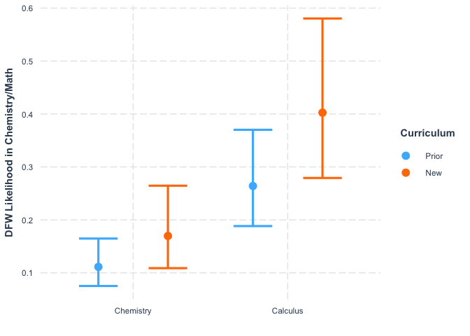

IMPORTANT NOTE

This Rmd uses the deidentified results and is safe to share.


We wish to determine if the new core classes (CURE Lab and BIO Seminar) are helping students to succeed academically in other STEM classes (Chemistry and Math).

## Loading Results

I asked the registrar to help me answer the following questions:
3. What was the DFW rate for BS Biology majors in CHEM 205, CHEM 211, MATH 201, and MATH 202 from SP 2017 to FA 2019?
4. What was the DFW rate for BS Biology majors in CHEM 205, CHEM 211, MATH 201, and MATH 202 from FA 2021 to SP 2022?

They sent us the files located in the "Grade Outcomes" folder.

## Chemistry and Math

Only including data for semesters with at least 10 students (i.e. leaving out all of the Math 202 data).
This data is for BS BIOL majors (undeclared BAs are too hard to identify). 


```r
Chem_Math_DFW <- tibble(Class = "CHEM205", Year = "17-18", Semester = "Fall", DFW = 3+1+5, Total = 63)
Chem_Math_DFW <- Chem_Math_DFW %>%
  add_row(Class = "CHEM205", Year = "18-19", Semester = "Fall", DFW = 4, Total = 55) %>%
  add_row(Class = "CHEM205", Year = "19-20", Semester = "Fall", DFW = 3+1, Total = 48) %>%
  add_row(Class = "CHEM205", Year = "21-22", Semester = "Fall", DFW = 3+2+7, Total = 62) %>%
  add_row(Class = "CHEM211", Year = "17-18", Semester = "Spring", DFW = 3+1+4, Total = 60) %>%
  add_row(Class = "CHEM211", Year = "18-19", Semester = "Spring", DFW = 3+3+8, Total = 65) %>%
  add_row(Class = "CHEM211", Year = "21-22", Semester = "Spring", DFW = 1+4, Total = 51) %>%
  add_row(Class = "MATH201", Year = "17-18", Semester = "Fall", DFW = 1+1+4, Total = 37) %>%
  add_row(Class = "MATH201", Year = "18-19", Semester = "Fall", DFW = 2+2+5, Total = 32) %>%
  add_row(Class = "MATH201", Year = "19-20", Semester = "Fall", DFW = 0+2+5, Total = 29) %>%
  add_row(Class = "MATH201", Year = "21-22", Semester = "Fall", DFW = 3+5+16, Total = 50) 
Chem_Math_DFW <- Chem_Math_DFW %>%
  mutate(Pass = Total - DFW) %>%
  mutate(`DFW Rate (%)` = DFW / Total * 100)
```

Summarize results:


```r
Chem_Math_DFW %>%
  group_by(Class) %>%
  summarise(`Mean DFW Rate (%)` = mean(`DFW Rate (%)`), 
            Sd = sd(`DFW Rate (%)`))
```

```
## # A tibble: 3 × 3
##   Class   `Mean DFW Rate (%)`    Sd
##   <chr>                 <dbl> <dbl>
## 1 CHEM205                12.3  5.62
## 2 CHEM211                14.9  6.02
## 3 MATH201                29.1 13.5
```

```r
Chem_Math_DFW %>%
  group_by(Year) %>%
  summarise(`Mean DFW Rate (%)` = mean(`DFW Rate (%)`), 
            Sd = sd(`DFW Rate (%)`))
```

```
## # A tibble: 4 × 3
##   Year  `Mean DFW Rate (%)`    Sd
##   <chr>               <dbl> <dbl>
## 1 17-18                14.6  1.47
## 2 18-19                19.0 10.7 
## 3 19-20                16.2 11.2 
## 4 21-22                25.7 19.9
```

```r
# Fall Semester
Chem_Math_DFW %>%
  filter(Semester == "Fall") %>%
  group_by(Class) %>%
  summarise(DFW = mean(DFW), Enrollment = mean(Total), 
            `Mean DFW Rate (%)` = mean(`DFW Rate (%)`), 
            Sd = sd(`DFW Rate (%)`))
```

```
## # A tibble: 2 × 5
##   Class     DFW Enrollment `Mean DFW Rate (%)`    Sd
##   <chr>   <dbl>      <dbl>               <dbl> <dbl>
## 1 CHEM205  7.25         57                12.3  5.62
## 2 MATH201 11.5          37                29.1 13.5
```

```r
# Spring Semester
Chem_Math_DFW %>%
  filter(Semester == "Spring") %>%
  group_by(Class) %>%
  summarise(DFW = mean(DFW), Enrollment = mean(Total),
            `Mean DFW Rate (%)` = mean(`DFW Rate (%)`), 
            Sd = sd(`DFW Rate (%)`))
```

```
## # A tibble: 1 × 5
##   Class     DFW Enrollment `Mean DFW Rate (%)`    Sd
##   <chr>   <dbl>      <dbl>               <dbl> <dbl>
## 1 CHEM211     9       58.7                14.9  6.02
```

Well, I don't need to do any statistics to see that things haven't improved in the last year. 
The DFW rates for BS Biology majors are higher in 21-22 than in the previous years tested. 
I will actually run the test anyway to see if they are significantly higher.


```r
Old_Chem_Math_DFW <- Chem_Math_DFW %>%
  filter(Year != "21-22") %>%
  select(`DFW Rate (%)`)
New_Chem_Math_DFW <- Chem_Math_DFW %>%
  filter(Year == "21-22") %>%
  select(`DFW Rate (%)`)

shapiro.test(Old_Chem_Math_DFW$`DFW Rate (%)`)
```

```
## 
## 	Shapiro-Wilk normality test
## 
## data:  Old_Chem_Math_DFW$`DFW Rate (%)`
## W = 0.95241, p-value = 0.7355
```

```r
shapiro.test(New_Chem_Math_DFW$`DFW Rate (%)`)
```

```
## 
## 	Shapiro-Wilk normality test
## 
## data:  New_Chem_Math_DFW$`DFW Rate (%)`
## W = 0.92311, p-value = 0.4634
```

```r
t.test(Old_Chem_Math_DFW$`DFW Rate (%)`, New_Chem_Math_DFW$`DFW Rate (%)`)
```

```
## 
## 	Welch Two Sample t-test
## 
## data:  Old_Chem_Math_DFW$`DFW Rate (%)` and New_Chem_Math_DFW$`DFW Rate (%)`
## t = -0.76996, df = 2.2128, p-value = 0.515
## alternative hypothesis: true difference in means is not equal to 0
## 95 percent confidence interval:
##  -55.32341  37.19491
## sample estimates:
## mean of x mean of y 
##  16.65534  25.71959
```

The Shapiro-Wilk normality tests demonstrated no evidence that the distributions were
different from normal.

The Welch Two Sample t-test demonstrated that the DFW rates for Biology majors in their
Chemistry and Math classes are not significantly different in the old and new curricula.

This is probably due to confounding effects of the pandemic and other factors. 

To make this comparison equivalent to the Biology analysis, I should convert to a negative binomial glm.


```r
summary(Chem_Math_DFW)
```

```
##     Class               Year             Semester              DFW        
##  Length:11          Length:11          Length:11          Min.   : 4.000  
##  Class :character   Class :character   Class :character   1st Qu.: 5.500  
##  Mode  :character   Mode  :character   Mode  :character   Median : 8.000  
##                                                           Mean   : 9.273  
##                                                           3rd Qu.:10.500  
##                                                           Max.   :24.000  
##      Total            Pass        DFW Rate (%)   
##  Min.   :29.00   Min.   :22.00   Min.   : 7.273  
##  1st Qu.:42.50   1st Qu.:28.50   1st Qu.:11.569  
##  Median :51.00   Median :46.00   Median :16.216  
##  Mean   :50.18   Mean   :40.91   Mean   :19.127  
##  3rd Qu.:61.00   3rd Qu.:51.00   3rd Qu.:22.838  
##  Max.   :65.00   Max.   :54.00   Max.   :48.000
```

```r
Chem_Math_DFW_selected <- Chem_Math_DFW %>%
  select(-Pass, -`DFW Rate (%)`) %>%
  mutate(Curriculum = Year) %>%
  mutate(across(Curriculum, str_replace, '17-18|18-19|19-20', 'Prior')) %>%
  mutate(across(Curriculum, str_replace, '21-22', 'New')) %>%
  mutate(across(Curriculum, factor, levels = c("Prior", "New"))) %>%
  mutate(across(Class, str_replace, 'CHEM205|CHEM211', 'Chemistry')) %>%
  mutate(across(Class, str_replace, 'MATH201', 'Calculus'))
```

```
## Warning: There was 1 warning in `mutate()`.
## ℹ In argument: `across(Curriculum, str_replace, "17-18|18-19|19-20", "Prior")`.
## Caused by warning:
## ! The `...` argument of `across()` is deprecated as of dplyr 1.1.0.
## Supply arguments directly to `.fns` through an anonymous function instead.
## 
##   # Previously
##   across(a:b, mean, na.rm = TRUE)
## 
##   # Now
##   across(a:b, \(x) mean(x, na.rm = TRUE))
```

```r
Chem_Math_DFW_binary_dat <- pmap_dfr(Chem_Math_DFW_selected, 
                      function(Class, Year, Semester, Curriculum, DFW, Total) {
                           data.frame(Class = as.factor(Class),
                                      Year = as.factor(Year),
                                      Semester = as.factor(Semester),
                                      Curriculum = Curriculum,
                                      DFW = c( rep(1, DFW),
                                               rep(0, Total - DFW) ) )
                      }
)
summary(Chem_Math_DFW_binary_dat)
```

```
##        Class        Year       Semester   Curriculum       DFW        
##  Chemistry:404   17-18:160   Fall  :376   Prior:389   Min.   :0.0000  
##  Calculus :148   18-19:152   Spring:176   New  :163   1st Qu.:0.0000  
##                  19-20: 77                            Median :0.0000  
##                  21-22:163                            Mean   :0.1848  
##                                                       3rd Qu.:0.0000  
##                                                       Max.   :1.0000
```

```r
Chem_Math.glm <- glm.nb(DFW ~ Curriculum + Semester + Class, data = Chem_Math_DFW_binary_dat) 
```

```
## Warning in theta.ml(Y, mu, sum(w), w, limit = control$maxit, trace =
## control$trace > : iteration limit reached
```

```
## Warning in theta.ml(Y, mu, sum(w), w, limit = control$maxit, trace =
## control$trace > : iteration limit reached
```

```r
summary(Chem_Math.glm)
```

```
## 
## Call:
## glm.nb(formula = DFW ~ Curriculum + Semester + Class, data = Chem_Math_DFW_binary_dat, 
##     init.theta = 4137.110688, link = log)
## 
## Deviance Residuals: 
##     Min       1Q   Median       3Q      Max  
## -0.8972  -0.6372  -0.5161  -0.4718   1.6165  
## 
## Coefficients:
##                Estimate Std. Error z value Pr(>|z|)    
## (Intercept)     -2.1954     0.1997 -10.994  < 2e-16 ***
## CurriculumNew    0.4216     0.2024   2.083 0.037254 *  
## SemesterSpring   0.1793     0.2675   0.670 0.502748    
## ClassCalculus    0.8637     0.2376   3.635 0.000278 ***
## ---
## Signif. codes:  0 '***' 0.001 '**' 0.01 '*' 0.05 '.' 0.1 ' ' 1
## 
## (Dispersion parameter for Negative Binomial(4137.111) family taken to be 1)
## 
##     Null deviance: 344.45  on 551  degrees of freedom
## Residual deviance: 324.12  on 548  degrees of freedom
## AIC: 538.15
## 
## Number of Fisher Scoring iterations: 1
## 
## 
##               Theta:  4137 
##           Std. Err.:  29823 
## Warning while fitting theta: iteration limit reached 
## 
##  2 x log-likelihood:  -528.149
```

```r
cat_plot(Chem_Math.glm, pred = Class, modx = Curriculum,  
         interval = TRUE, errorbar.width = 0.5, 
         x.label = "", y.label = "DFW Likelihood in Chemistry/Math")
```

```
## Warning: Class and Curriculum are not included in an interaction with one another in
## the model.
```

<!-- -->


```r
exp(-2.1954)
```

```
## [1] 0.111314
```

```r
exp(-2.1954+0.8637)
```

```
## [1] 0.264028
```

```r
exp(0.4216)
```

```
## [1] 1.524399
```

```r
exp(0.4216+0.2024)
```

```
## [1] 1.866379
```

```r
exp(0.4216-0.2024)
```

```
## [1] 1.24508
```


This analysis is more clear than the previous one. 
It shows that our First-year Biology (and affiliated) majors had 1.52-fold (SE 1.24 - 1.86) higher rates of DFW in their Chemistry and Math courses during the new curriculum than in prior semesters (p = 0.037254). 

This does not support the hypothesis that changing our Biology curriculum enabled our students to have greater success in these other classes.

But rather it probably indicates that this cohort of students had other factors that contributed to academic struggles, obviously the effects of COVID-19 played a major role. 

Conclusion: the observation that we had lower DFW rates in biology classes for this group of students is a major success for this approach because this cohort of students had significantly higher DFW rates in their chemistry and math classes.
