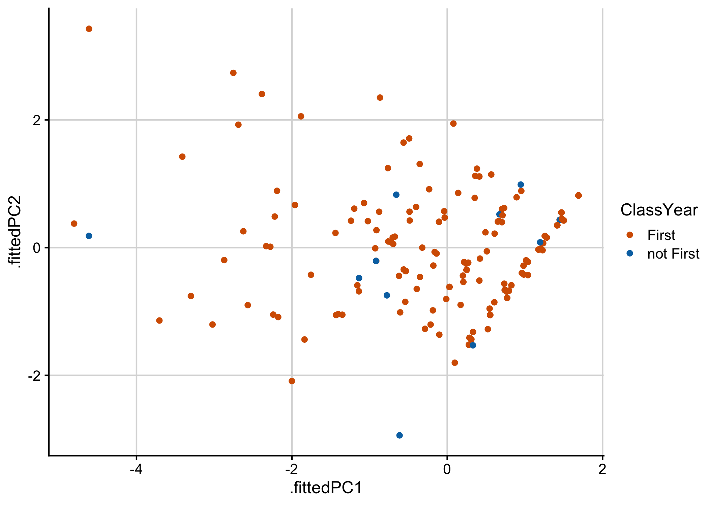
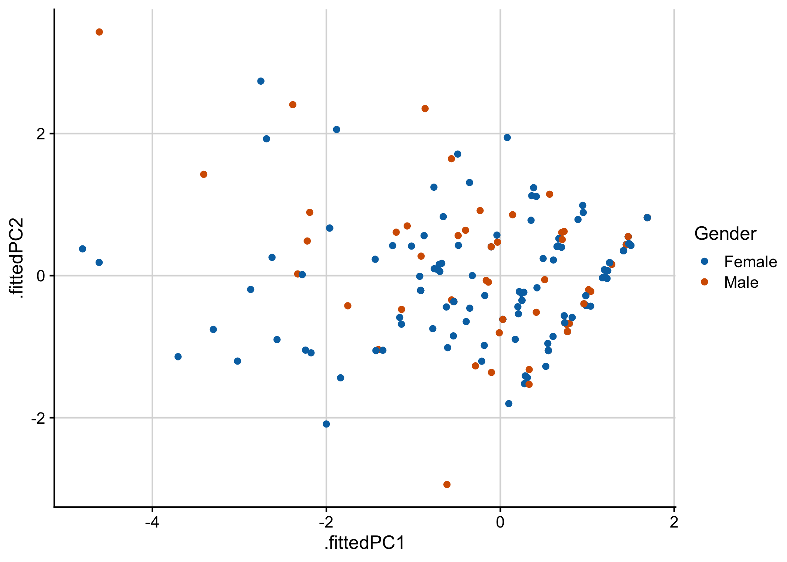
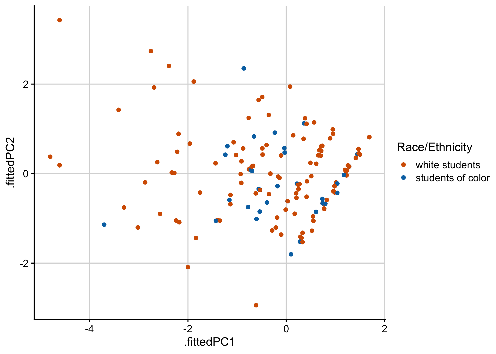

IMPORTANT NOTE

This Rmd uses the deidentified results and is safe to share.


## Preliminary Analysis

Prior to conducting this analysis, exploration of the data found that some of these questions showed a correlation to
Instructor that was stronger than the correlations found to demographics, semester, or rookie status of the instructor.
However, we decided that it was more useful to use these questions to assess the impacts on diverse student groups than 
to look at the effect of instructor for two reasons. First, the differences between instructor approaches are already 
extensively addressed in our analysis of Question 10 (Figures 2-5). Second, it is a major goal of this course to 
increase student engagement of our non-modal students and these questions directly address this question.

## Loading Results

Loading the data with demographics info.


```
## Rows: 85 Columns: 156
## ── Column specification ────────────────────────────────────────────────────────
## Delimiter: "\t"
## chr (146): ResponseId_pre, Semester_pre, Q1_pre, Q8_pre, Q9_1_pre, Q9_2_pre,...
## dbl  (10): Q19_1_pre, Q19_2_pre, Q19_3_pre, Q19_4_pre, Q19_5_pre, Q19_6_pre,...
## 
## ℹ Use `spec()` to retrieve the full column specification for this data.
## ℹ Specify the column types or set `show_col_types = FALSE` to quiet this message.
## Rows: 77 Columns: 156
## ── Column specification ────────────────────────────────────────────────────────
## Delimiter: "\t"
## chr (146): ResponseId_pre, Semester, Q1_pre, Q8_pre, Q9_1_pre, Q9_2_pre, Q9_...
## dbl  (10): Q19_1_pre, Q19_2_pre, Q19_3_pre, Q19_4_pre, Q19_5_pre, Q19_6_pre,...
## 
## ℹ Use `spec()` to retrieve the full column specification for this data.
## ℹ Specify the column types or set `show_col_types = FALSE` to quiet this message.
## Rows: 63 Columns: 156
## ── Column specification ────────────────────────────────────────────────────────
## Delimiter: "\t"
## chr (146): ResponseId_pre, Semester, Q1_pre, Q8_pre, Q9_1_pre, Q9_2_pre, Q9_...
## dbl  (10): Q19_1_pre, Q19_2_pre, Q19_3_pre, Q19_4_pre, Q19_5_pre, Q19_6_pre,...
## 
## ℹ Use `spec()` to retrieve the full column specification for this data.
## ℹ Specify the column types or set `show_col_types = FALSE` to quiet this message.
## Rows: 156 Columns: 2
## ── Column specification ────────────────────────────────────────────────────────
## Delimiter: "\t"
## chr (2): value, Question
## 
## ℹ Use `spec()` to retrieve the full column specification for this data.
## ℹ Specify the column types or set `show_col_types = FALSE` to quiet this message.
```

Removing any student who did not agree with the informed consent question:


Factoring the Semester variable to make sure things are in order


```
##   Fall 2021 Spring 2022   Fall 2022 Spring 2023   Fall 2023 Spring 2024 
##          34          51          37          39          30          33
```

```
##   Fall Spring 
##    101    123
```

```
##     First not First 
##       209        15
```

## Intended Majors


```
##                  
##                   Animal Behavior Biochemistry Biology Neuroscience Other
##   Animal Behavior              31            0       0            0     1
##   Biology                       0            2     146            1     6
##   Neuroscience                  0            0       1            0     0
##   Other                         0            0       1            0     2
##   Undeclared                    0            0       8            0     2
##                  
##                   Undeclared
##   Animal Behavior          0
##   Biology                  8
##   Neuroscience             0
##   Other                    0
##   Undeclared              10
```

Note the columns are the post-survey response and the rows are the pre-survey response.

## Attitudes about Science

According to the analysis of this survey by Grinnell, 5 questions were found to correlate with engagement.

Specifically, they found:
"In exploratory factor analysis these 5 items load on a factor that we have named "engagement". Engagement scores, whether pre-course or
post-course, have correlated in our first findings with higher reported learning gains and a greater likelihood to declare a science
major."

These questions are Q13_1_post, Q13_3_post, Q13_10_post, Q13_13_post, and Q13_18_post.

Q13_1_post  Even if I forget the facts, I'll still be able to use the thinking skills I learn in science
Q13_3_post  The process of writing in science is helpful for understanding scientific ideas             
Q13_10_post I get personal satisfaction when I solve a scientific problem by figuring it out myself     
Q13_13_post I can do well in science courses                                                            
Q13_18_post Explaining science ideas to others has helped me understand the ideas better  

https://www.grinnell.edu/sites/default/files/docs/2019-07/CUREBenchmarkStatistics2015-2108.pdf


```
## [1] "In the pretest you responded to questions about science. Below the questions are posed again. Your answers will help us decide between two hypotheses, that the opinions are reliable over time (test-retest reliability) or that the opinions change as a result of your experience. For each item below please rate your agreement with the item - Even if I forget the facts, I'll still be able to use the thinking skills I learn in science"
```

```
##  [1] "Even if I forget the facts, I'll still be able to use the thinking skills I learn in science"          
##  [2] "You can rely on scientific results to be true and correct"                                             
##  [3] "The process of writing in science is helpful for understanding scientific ideas"                       
##  [4] "When scientific results conflict with my personal experience, I follow my experience in making choices"
##  [5] "Students who do not major/concentrate in science should not have to take science courses"              
##  [6] "I wish science instructors would just tell us what we need to now so we can learn it"                  
##  [7] "Creativity does not play a role in science"                                                            
##  [8] "Science is not connected to non-science fields such as history, literature, economics, or art"         
##  [9] "When experts disagree on a science question, it's because they don't know all the facts yet"           
## [10] "I get personal satisfaction when I solve a scientific problem by figuring it out myself"               
## [11] "Since nothing in science is known for certain, all theories are equally valid"                         
## [12] "Science is essentially an accumulation of facts, rules, and formulas"                                  
## [13] "I can do well in science courses"                                                                      
## [14] "Real scientists don't follow the scientific method in a straight line"                                 
## [15] "There is too much emphasis in science classes on figuring things out for yourself"                     
## [16] "Only scientific experts are qualified to make judgments on scientific issues"                          
## [17] "Scientists know what the results of their experiments will be before they start"                       
## [18] "Explaining science ideas to others has helped me understand the ideas better"                          
## [19] "The main job of the instructor is to structure the work so that we can learn it ourselves"             
## [20] "Scientists play with statistics to support their own ideas"                                            
## [21] "Lab experiments are used to confirm information studied in science class"                              
## [22] "If an experiment shows that something doesn't work, the experiment was a failure"
```

```
## # A tibble: 5 × 2
##   value       Question                                                          
##   <chr>       <chr>                                                             
## 1 Q13_1_post  Even if I forget the facts, I'll still be able to use the thinkin…
## 2 Q13_3_post  The process of writing in science is helpful for understanding sc…
## 3 Q13_10_post I get personal satisfaction when I solve a scientific problem by …
## 4 Q13_13_post I can do well in science courses                                  
## 5 Q13_18_post Explaining science ideas to others has helped me understand the i…
```

We are also interested in the overall evaluation questions (at least the first 3 of them).

- Q11_1_post: "This course was a good way of learning about the subject matter"                
- Q11_2_post: "This course was a good way of learning about the process of scientific research"
- Q11_3_post: "This course had a positive effect on my interest in science"                    
- Q11_4_post: "I was able to ask questions in this class and get helpful responses" 


```
## [1] "For each item below please rate your own agreement with the item. - This course was a good way of learning about the subject matter"
```

```
## [1] "This course was a good way of learning about the subject matter"                
## [2] "This course was a good way of learning about the process of scientific research"
## [3] "This course had a positive effect on my interest in science"
```

Now to compare the pre and post responses for those questions:


```
## # A tibble: 6 × 13
##   Semester  FallSpring ClassYear Gender Q11_1_post     Q11_2_post     Q11_3_post
##   <fct>     <fct>      <fct>     <fct>  <chr>          <chr>          <chr>     
## 1 Fall 2021 Fall       First     Female Agree          Strongly agree Agree     
## 2 Fall 2021 Fall       First     Female Agree          Strongly agree Strongly …
## 3 Fall 2021 Fall       First     Female Agree          Agree          Agree     
## 4 Fall 2021 Fall       First     Female Strongly agree Strongly agree Strongly …
## 5 Fall 2021 Fall       First     Female Agree          Agree          Agree     
## 6 Fall 2021 Fall       First     Female Agree          Agree          Agree     
## # ℹ 6 more variables: Q13_1_post <chr>, Q13_3_post <chr>, Q13_10_post <chr>,
## #   Q13_13_post <chr>, Q13_18_post <chr>, `Race/Ethnicity` <fct>
```

```
## Warning: `funs()` was deprecated in dplyr 0.8.0.
## ℹ Please use a list of either functions or lambdas:
## 
## # Simple named list: list(mean = mean, median = median)
## 
## # Auto named with `tibble::lst()`: tibble::lst(mean, median)
## 
## # Using lambdas list(~ mean(., trim = .2), ~ median(., na.rm = TRUE))
## Call `lifecycle::last_lifecycle_warnings()` to see where this warning was
## generated.
```

```
##    Semester FallSpring ClassYear Gender    Race/Ethnicity Q11_1 Q11_2 Q11_3
## 1 Fall 2021       Fall     First Female    white students     1     2     1
## 2 Fall 2021       Fall     First Female    white students     1     2     2
## 3 Fall 2021       Fall     First Female    white students     1     1     1
## 4 Fall 2021       Fall     First Female    white students     2     2     2
## 5 Fall 2021       Fall     First Female students of color     1     1     1
## 6 Fall 2021       Fall     First Female    white students     1     1     1
##   Q13_1 Q13_3 Q13_10 Q13_13 Q13_18
## 1     1     2      1      1      1
## 2     2     1      1      1      1
## 3     1     1      1      1      1
## 4     2     2      2      2      2
## 5     2     1      1      1      1
## 6     1     1      2      2      0
```

Pivoting the table into long format for analysis.


``` r
Q11Long <- Q11Recoded %>%
  pivot_longer(cols = Q11_1:Q13_18, 
               names_to = "Question", 
               values_to = "Answer")
```

First let's just look at the contingency tables to see if everything looks right.
Note that our data exploration showed very high correlation between 11_1 and 11_3.


```
## [1] "Rows represents pre-survey response, Columns represent post-survey response."
```

```
## [1] "First for All sections then for then for Fall 2021, Spring 2022."
```

```
## [1] "This course was a good way of learning about the subject matter"
```

```
##                    
##                     Strongly disagree Disagree Neutral Agree Strongly agree
##   Strongly disagree                 1        0       1     0              0
##   Disagree                          1        4       1     3              0
##   Neutral                           0        2       7     8              3
##   Agree                             0        1       9    44             29
##   Strongly agree                    0        0       0    11             90
```

```
## [1] "By Semester"
```

```
## [1] "This course was a good way of learning about the subject matter"
```

```
## , ,  = Fall 2021
## 
##                    
##                     Strongly disagree Disagree Neutral Agree Strongly agree
##   Strongly disagree                 0        0       0     0              0
##   Disagree                          0        0       0     0              0
##   Neutral                           0        0       1     0              1
##   Agree                             0        0       0     7              5
##   Strongly agree                    0        0       0     2             17
## 
## , ,  = Spring 2022
## 
##                    
##                     Strongly disagree Disagree Neutral Agree Strongly agree
##   Strongly disagree                 0        0       1     0              0
##   Disagree                          1        2       1     2              0
##   Neutral                           0        0       2     3              0
##   Agree                             0        1       1    12              6
##   Strongly agree                    0        0       0     3             14
## 
## , ,  = Fall 2022
## 
##                    
##                     Strongly disagree Disagree Neutral Agree Strongly agree
##   Strongly disagree                 1        0       0     0              0
##   Disagree                          0        1       0     1              0
##   Neutral                           0        0       1     2              0
##   Agree                             0        0       3     5              7
##   Strongly agree                    0        0       0     2             13
## 
## , ,  = Spring 2023
## 
##                    
##                     Strongly disagree Disagree Neutral Agree Strongly agree
##   Strongly disagree                 0        0       0     0              0
##   Disagree                          0        0       0     0              0
##   Neutral                           0        0       1     2              1
##   Agree                             0        0       1     6              1
##   Strongly agree                    0        0       0     3             22
## 
## , ,  = Fall 2023
## 
##                    
##                     Strongly disagree Disagree Neutral Agree Strongly agree
##   Strongly disagree                 0        0       0     0              0
##   Disagree                          0        0       0     0              0
##   Neutral                           0        0       0     0              0
##   Agree                             0        0       2     5              4
##   Strongly agree                    0        0       0     1             17
## 
## , ,  = Spring 2024
## 
##                    
##                     Strongly disagree Disagree Neutral Agree Strongly agree
##   Strongly disagree                 0        0       0     0              0
##   Disagree                          0        1       0     0              0
##   Neutral                           0        2       2     1              1
##   Agree                             0        0       2     9              6
##   Strongly agree                    0        0       0     0              7
```

Setting up some visualizations


```
##                    Q11_3_post
## Q11_1_post          Strongly disagree Disagree Neutral Agree Strongly agree Sum
##   Strongly disagree                 1        0       1     0              0   2
##   Disagree                          1        4       1     3              0   9
##   Neutral                           0        2       7     8              3  20
##   Agree                             0        1       9    44             29  83
##   Strongly agree                    0        0       0    11             90 101
##   Sum                               2        7      18    66            122 215
```

```
##                    
##                     Strongly disagree Disagree Neutral Agree Strongly agree Sum
##   Strongly disagree                 1        0       1     0              0   2
##   Disagree                          1        4       1     3              0   9
##   Neutral                           0        2       7     8              3  20
##   Agree                             0        1       9    44             29  83
##   Strongly agree                    0        0       0    11             90 101
##   Sum                               2        7      18    66            122 215
```

```
## , , Semester = Fall 2021
## 
##                    Q11_3_post
## Q11_1_post          Strongly disagree Disagree Neutral Agree Strongly agree
##   Strongly disagree                 0        0       0     0              0
##   Disagree                          0        0       0     0              0
##   Neutral                           0        0       1     0              1
##   Agree                             0        0       0     7              5
##   Strongly agree                    0        0       0     2             17
## 
## , , Semester = Spring 2022
## 
##                    Q11_3_post
## Q11_1_post          Strongly disagree Disagree Neutral Agree Strongly agree
##   Strongly disagree                 0        0       1     0              0
##   Disagree                          1        2       1     2              0
##   Neutral                           0        0       2     3              0
##   Agree                             0        1       1    12              6
##   Strongly agree                    0        0       0     3             14
## 
## , , Semester = Fall 2022
## 
##                    Q11_3_post
## Q11_1_post          Strongly disagree Disagree Neutral Agree Strongly agree
##   Strongly disagree                 1        0       0     0              0
##   Disagree                          0        1       0     1              0
##   Neutral                           0        0       1     2              0
##   Agree                             0        0       3     5              7
##   Strongly agree                    0        0       0     2             13
## 
## , , Semester = Spring 2023
## 
##                    Q11_3_post
## Q11_1_post          Strongly disagree Disagree Neutral Agree Strongly agree
##   Strongly disagree                 0        0       0     0              0
##   Disagree                          0        0       0     0              0
##   Neutral                           0        0       1     2              1
##   Agree                             0        0       1     6              1
##   Strongly agree                    0        0       0     3             22
## 
## , , Semester = Fall 2023
## 
##                    Q11_3_post
## Q11_1_post          Strongly disagree Disagree Neutral Agree Strongly agree
##   Strongly disagree                 0        0       0     0              0
##   Disagree                          0        0       0     0              0
##   Neutral                           0        0       0     0              0
##   Agree                             0        0       2     5              4
##   Strongly agree                    0        0       0     1             17
## 
## , , Semester = Spring 2024
## 
##                    Q11_3_post
## Q11_1_post          Strongly disagree Disagree Neutral Agree Strongly agree
##   Strongly disagree                 0        0       0     0              0
##   Disagree                          0        1       0     0              0
##   Neutral                           0        2       2     1              1
##   Agree                             0        0       2     9              6
##   Strongly agree                    0        0       0     0              7
```

```
##                    Q11_3_post
## Q11_1_post          Strongly disagree Disagree Neutral Agree Strongly agree
##   Strongly disagree                 1        0       1     0              0
##   Disagree                          1        4       1     3              0
##   Neutral                           0        2       7     8              3
##   Agree                             0        1       9    44             29
##   Strongly agree                    0        0       0    11             90
```

## PCA 

First, I am going to use a PCA to determine if all 8 of these questions are similar or if there are any significant sub-groupings.

<!-- --><!-- --><!-- -->

```
## # A tibble: 64 × 3
##    column    PC   value
##    <chr>  <dbl>   <dbl>
##  1 Q11_1      1  0.523 
##  2 Q11_1      2 -0.439 
##  3 Q11_1      3 -0.0805
##  4 Q11_1      4 -0.0374
##  5 Q11_1      5  0.215 
##  6 Q11_1      6  0.307 
##  7 Q11_1      7  0.618 
##  8 Q11_1      8 -0.0635
##  9 Q11_2      1  0.380 
## 10 Q11_2      2 -0.158 
## # ℹ 54 more rows
```

```
## Warning: Removed 2 rows containing missing values or values outside the scale range
## (`geom_segment()`).
```

```
## Warning: Removed 2 rows containing missing values or values outside the scale range
## (`geom_text()`).
```

<!-- -->

```
## # A tibble: 8 × 4
##      PC std.dev percent cumulative
##   <dbl>   <dbl>   <dbl>      <dbl>
## 1     1   1.33   0.463       0.463
## 2     2   0.864  0.195       0.659
## 3     3   0.551  0.0795      0.738
## 4     4   0.502  0.0661      0.804
## 5     5   0.469  0.0576      0.862
## 6     6   0.460  0.0555      0.917
## 7     7   0.426  0.0475      0.965
## 8     8   0.367  0.0353      1
```

<!-- -->

This PCA demonstrated that all of the questions except Q11_2 are grouped together in PC1 and PC2, which, together, represent 66% of the variation in responses.

## Fig 1 Question Correlation


```
## Warning: Removed 2 rows containing missing values or values outside the scale range
## (`geom_segment()`).
```

```
## Warning: Removed 2 rows containing missing values or values outside the scale range
## (`geom_text()`).
```

<!-- -->

```
## Warning: Removed 2 rows containing missing values or values outside the scale range
## (`geom_segment()`).
```

<!-- --><!-- -->

Interesting. There is a strong correlation between all three Q11 questions, even though the PCA shows that question 11_2 is different. 
I will plan on showing the PCA for Figure 1, then the two appropriate correlation plots.

Q11_2 is "This course was a good way of learning about the process of scientific research" 
while the other two questions on the overall evaluation are "This course was a good way of learning about the subject matter" 
and "This course had a positive effect on my interest in science".

I will next explore how the various metadata factors correlate with Q11_2 responses (and then address the other questions).

## Demographics-Survey Correlation

<!-- -->

As expected from the PCA, these questions all showed correlation with each other. 

Questions 11_1 and 11_3 showed some negative correlation with semester, having lower responses in the Spring.

But we can analyze this more completely using a glm approach. 
Given the high degree of correlation between 11_1 and 11_3, we will only look at Q11_1 and Q11_2 and the Q13 questions.


## Figure 1C

<!-- -->

## Summary Statistics


Table: Data summary

|                         |           |
|:------------------------|:----------|
|Name                     |Piped data |
|Number of rows           |1720       |
|Number of columns        |7          |
|_______________________  |           |
|Column type frequency:   |           |
|numeric                  |1          |
|________________________ |           |
|Group variables          |Question   |


**Variable type: numeric**

|skim_variable |Question | n_missing| complete_rate| mean|   sd| p0| p25| p50| p75| p100|hist  |
|:-------------|:--------|---------:|-------------:|----:|----:|--:|---:|---:|---:|----:|:-----|
|Response      |Q11_1    |         0|             1| 4.27| 0.86|  1|   4|   4|   5|    5|▁▁▂▆▇ |
|Response      |Q11_2    |         1|             1| 4.62| 0.64|  1|   4|   5|   5|    5|▁▁▁▃▇ |
|Response      |Q11_3    |         0|             1| 4.39| 0.85|  1|   4|   5|   5|    5|▁▁▁▅▇ |
|Response      |Q13_1    |         0|             1| 4.28| 0.58|  3|   4|   4|   5|    5|▁▁▇▁▅ |
|Response      |Q13_10   |         0|             1| 4.39| 0.61|  2|   4|   4|   5|    5|▁▁▁▇▇ |
|Response      |Q13_13   |         0|             1| 4.29| 0.66|  2|   4|   4|   5|    5|▁▁▁▇▆ |
|Response      |Q13_18   |         1|             1| 4.16| 0.68|  2|   4|   4|   5|    5|▁▂▁▇▅ |
|Response      |Q13_3    |         0|             1| 4.28| 0.61|  3|   4|   4|   5|    5|▁▁▇▁▅ |

