IMPORTANT NOTE

This Rmd uses the deidentified results and is safe to share.


## Loading Results

Loading in the results without instructor information:


```r
NoInstructor <- read_delim("Deidentified Surveys/NoInstructor.tsv", 
    delim = "\t", escape_double = FALSE, 
    trim_ws = TRUE)
```

```
## Rows: 85 Columns: 156
## ── Column specification ────────────────────────────────────────────────────────
## Delimiter: "\t"
## chr (146): ResponseId_pre, Semester_pre, Q1_pre, Q8_pre, Q9_1_pre, Q9_2_pre,...
## dbl  (10): Q19_1_pre, Q19_2_pre, Q19_3_pre, Q19_4_pre, Q19_5_pre, Q19_6_pre,...
## 
## ℹ Use `spec()` to retrieve the full column specification for this data.
## ℹ Specify the column types or set `show_col_types = FALSE` to quiet this message.
```

```r
NoInstructorQuestions <- read_delim("Deidentified Surveys/NoInstructorQuestions.tsv", 
    delim = "\t", escape_double = FALSE, 
    trim_ws = TRUE)
```

```
## Rows: 156 Columns: 2
## ── Column specification ────────────────────────────────────────────────────────
## Delimiter: "\t"
## chr (2): value, Question
## 
## ℹ Use `spec()` to retrieve the full column specification for this data.
## ℹ Specify the column types or set `show_col_types = FALSE` to quiet this message.
```

## Opinion change

Comparing the responses to Pre11 and Post13:


```r
PreQ11 <- NoInstructor %>%
  select(Semester = Semester_pre, starts_with("Q11")) %>%
  select(Semester, ends_with("_pre"))
Q11Text <- NoInstructorQuestions %>%
  filter(startsWith(value, "Q11")) %>%
  filter(endsWith(value, "_pre"))
Q11Text$Question[1]
```

```
## [1] "It has become common to say that no student is an empty bucket, waiting for a teacher to pour in knowledge. Research on learning acknowledges that students approach a course with well-formed opinions of themselves and of the subject matter. In this section we present questions about science and questions about you. These will help us put learning in context. For each item below please rate your agreement with the item - Even if I forget the facts, I'll still be able to use the thinking skills I learn in science"
```

```r
Q11TextClean <- Q11Text %>%
  mutate(Question = str_remove(Q11Text$Question, "It has become common to say that no student is an empty bucket, waiting for a teacher to pour in knowledge. Research on learning acknowledges that students approach a course with well-formed opinions of themselves and of the subject matter. In this section we present questions about science and questions about you. These will help us put learning in context. For each item below please rate your agreement with the item - "))
Q11TextClean$Question
```

```
##  [1] "Even if I forget the facts, I'll still be able to use the thinking skills I learn in science"          
##  [2] "You can rely on scientific results to be true and correct"                                             
##  [3] "The process of writing in science is helpful for understanding scientific ideas"                       
##  [4] "When scientific results conflict with my personal experience, I follow my experience in making choices"
##  [5] "Students who do not major/concentrate in science should not have to take science courses"              
##  [6] "I wish science instructors would just tell us what we need to now so we can learn it"                  
##  [7] "Creativity does not play a role in science"                                                            
##  [8] "Science is not connected to non-science fields such as history, literature, economics, or art"         
##  [9] "When experts disagree on a science question, it's because they don't know all the facts yet"           
## [10] "I get personal satisfaction when I solve a scientific problem by figuring it out myself"               
## [11] "Since nothing in science is known for certain, all theories are equally valid"                         
## [12] "Science is essentially an accumulation of facts, rules, and formulas"                                  
## [13] "I can do well in science courses"                                                                      
## [14] "Real scientists don't follow the scientific method in a straight line"                                 
## [15] "There is too much emphasis in science classes on figuring things out for yourself"                     
## [16] "Only scientific experts are qualified to make judgments on scientific issues"                          
## [17] "Scientists know what the results of their experiments will be before they start"                       
## [18] "Explaining science ideas to others has helped me understand the ideas better"                          
## [19] "The main job of the instructor is to structure the work so that we can learn it ourselves"             
## [20] "Scientists play with statistics to support their own ideas"                                            
## [21] "Lab experiments are used to confirm information studied in science class"                              
## [22] "If an experiment shows that something doesn't work, the experiment was a failure"
```


```r
PostQ13 <- NoInstructor %>%
  select(Semester = Semester_pre, starts_with("Q13")) %>%
  select(Semester, ends_with("_post"))

Q13Text <- NoInstructorQuestions %>%
  filter(startsWith(value, "Q13")) %>%
  filter(endsWith(value, "_post"))
Q13Text$Question[1]
```

```
## [1] "In the pretest you responded to questions about science. Below the questions are posed again. Your answers will help us decide between two hypotheses, that the opinions are reliable over time (test-retest reliability) or that the opinions change as a result of your experience. For each item below please rate your agreement with the item - Even if I forget the facts, I'll still be able to use the thinking skills I learn in science"
```

```r
Q13TextClean <- Q13Text %>%
  mutate(Question = str_remove(Q13Text$Question, "In the pretest you responded to questions about science. Below the questions are posed again. Your answers will help us decide between two hypotheses, that the opinions are reliable over time \\(test-retest reliability\\) or that the opinions change as a result of your experience. For each item below please rate your agreement with the item - "))
Q13TextClean$Question
```

```
##  [1] "Even if I forget the facts, I'll still be able to use the thinking skills I learn in science"          
##  [2] "You can rely on scientific results to be true and correct"                                             
##  [3] "The process of writing in science is helpful for understanding scientific ideas"                       
##  [4] "When scientific results conflict with my personal experience, I follow my experience in making choices"
##  [5] "Students who do not major/concentrate in science should not have to take science courses"              
##  [6] "I wish science instructors would just tell us what we need to now so we can learn it"                  
##  [7] "Creativity does not play a role in science"                                                            
##  [8] "Science is not connected to non-science fields such as history, literature, economics, or art"         
##  [9] "When experts disagree on a science question, it's because they don't know all the facts yet"           
## [10] "I get personal satisfaction when I solve a scientific problem by figuring it out myself"               
## [11] "Since nothing in science is known for certain, all theories are equally valid"                         
## [12] "Science is essentially an accumulation of facts, rules, and formulas"                                  
## [13] "I can do well in science courses"                                                                      
## [14] "Real scientists don't follow the scientific method in a straight line"                                 
## [15] "There is too much emphasis in science classes on figuring things out for yourself"                     
## [16] "Only scientific experts are qualified to make judgments on scientific issues"                          
## [17] "Scientists know what the results of their experiments will be before they start"                       
## [18] "Explaining science ideas to others has helped me understand the ideas better"                          
## [19] "The main job of the instructor is to structure the work so that we can learn it ourselves"             
## [20] "Scientists play with statistics to support their own ideas"                                            
## [21] "Lab experiments are used to confirm information studied in science class"                              
## [22] "If an experiment shows that something doesn't work, the experiment was a failure"
```

```r
Q11TextClean$Question == Q13TextClean$Question
```

```
##  [1] TRUE TRUE TRUE TRUE TRUE TRUE TRUE TRUE TRUE TRUE TRUE TRUE TRUE TRUE TRUE
## [16] TRUE TRUE TRUE TRUE TRUE TRUE TRUE
```

Now to compare the pre and post responses for those questions:


```r
MergedQ11 <- bind_cols(PreQ11, PostQ13) %>%
  rename(Semester = `Semester...1`) %>%
  select(-`Semester...24`)
```

```
## New names:
## • `Semester` -> `Semester...1`
## • `Semester` -> `Semester...24`
```

```r
head(MergedQ11)
```

```
## # A tibble: 6 × 45
##   Semester Q11_1_pre Q11_2_pre Q11_3_pre Q11_4_pre Q11_5_pre Q11_6_pre Q11_7_pre
##   <chr>    <chr>     <chr>     <chr>     <chr>     <chr>     <chr>     <chr>    
## 1 Fall 20… Agree     Agree     Agree     Strongly… Agree     Neutral   Strongly…
## 2 Fall 20… Strongly… Agree     Agree     Strongly… Disagree  Agree     Strongly…
## 3 Fall 20… Agree     Agree     Agree     Disagree  Agree     Agree     Disagree 
## 4 Fall 20… Neutral   Disagree  Agree     Disagree  Strongly… Strongly… Strongly…
## 5 Fall 20… Agree     Neutral   Agree     Agree     Neutral   Neutral   Strongly…
## 6 Fall 20… Strongly… Agree     Strongly… Neutral   Disagree  Strongly… Strongly…
## # ℹ 37 more variables: Q11_8_pre <chr>, Q11_9_pre <chr>, Q11_10_pre <chr>,
## #   Q11_11_pre <chr>, Q11_12_pre <chr>, Q11_13_pre <chr>, Q11_14_pre <chr>,
## #   Q11_15_pre <chr>, Q11_16_pre <chr>, Q11_17_pre <chr>, Q11_18_pre <chr>,
## #   Q11_19_pre <chr>, Q11_20_pre <chr>, Q11_21_pre <chr>, Q11_22_pre <chr>,
## #   Q13_1_post <chr>, Q13_2_post <chr>, Q13_3_post <chr>, Q13_4_post <chr>,
## #   Q13_5_post <chr>, Q13_6_post <chr>, Q13_7_post <chr>, Q13_8_post <chr>,
## #   Q13_9_post <chr>, Q13_10_post <chr>, Q13_11_post <chr>, …
```

```r
Q11Factors <- MergedQ11 %>%
  select(starts_with("Q")) %>%
  mutate_all(funs(ordered(.,(levels = c("Strongly disagree", "Disagree", 
                                       "Neutral", "Agree", "Strongly agree"))))) 
```

```
## Warning: `funs()` was deprecated in dplyr 0.8.0.
## ℹ Please use a list of either functions or lambdas:
## 
## # Simple named list: list(mean = mean, median = median)
## 
## # Auto named with `tibble::lst()`: tibble::lst(mean, median)
## 
## # Using lambdas list(~ mean(., trim = .2), ~ median(., na.rm = TRUE))
## Call `lifecycle::last_lifecycle_warnings()` to see where this warning was
## generated.
```

```r
Q11Clean <- MergedQ11 %>%
  select(-starts_with("Q")) %>%
  cbind(Q11Factors)
```

First let's just look at the contingency tables to see if everything looks right.


```r
print("Rows represents pre-survey response, Columns represent post-survey response.")
```

```
## [1] "Rows represents pre-survey response, Columns represent post-survey response."
```

```r
print("First for All sections then for then for Fall 2021, Spring 2022.")
```

```
## [1] "First for All sections then for then for Fall 2021, Spring 2022."
```

```r
Q11TextClean$Question[1]
```

```
## [1] "Even if I forget the facts, I'll still be able to use the thinking skills I learn in science"
```

```r
table(Q11Clean$Q11_1_pre, Q11Clean$Q13_1_post)
```

```
##                    
##                     Strongly disagree Disagree Neutral Agree Strongly agree
##   Strongly disagree                 0        0       0     0              0
##   Disagree                          0        0       0     1              0
##   Neutral                           0        0       1     4              5
##   Agree                             0        0       7    29             15
##   Strongly agree                    0        0       0     9             14
```

```r
print("By Semester")
```

```
## [1] "By Semester"
```

```r
Q11TextClean$Question[1]
```

```
## [1] "Even if I forget the facts, I'll still be able to use the thinking skills I learn in science"
```

```r
table(Q11Clean$Q11_1_pre, Q11Clean$Q13_1_post, Q11Clean$Semester)
```

```
## , ,  = Fall 2021
## 
##                    
##                     Strongly disagree Disagree Neutral Agree Strongly agree
##   Strongly disagree                 0        0       0     0              0
##   Disagree                          0        0       0     0              0
##   Neutral                           0        0       0     2              4
##   Agree                             0        0       1     6              9
##   Strongly agree                    0        0       0     3              9
## 
## , ,  = Spring 2022
## 
##                    
##                     Strongly disagree Disagree Neutral Agree Strongly agree
##   Strongly disagree                 0        0       0     0              0
##   Disagree                          0        0       0     1              0
##   Neutral                           0        0       1     2              1
##   Agree                             0        0       6    23              6
##   Strongly agree                    0        0       0     6              5
```

Experimenting with some other visualizations


```r
addmargins(xtabs(~Q11_1_pre+Q13_1_post, data=Q11Clean))
```

```
##                    Q13_1_post
## Q11_1_pre           Strongly disagree Disagree Neutral Agree Strongly agree Sum
##   Strongly disagree                 0        0       0     0              0   0
##   Disagree                          0        0       0     1              0   1
##   Neutral                           0        0       1     4              5  10
##   Agree                             0        0       7    29             15  51
##   Strongly agree                    0        0       0     9             14  23
##   Sum                               0        0       8    43             34  85
```

```r
addmargins(table(Q11Clean$Q11_1_pre, Q11Clean$Q13_1_post))
```

```
##                    
##                     Strongly disagree Disagree Neutral Agree Strongly agree Sum
##   Strongly disagree                 0        0       0     0              0   0
##   Disagree                          0        0       0     1              0   1
##   Neutral                           0        0       1     4              5  10
##   Agree                             0        0       7    29             15  51
##   Strongly agree                    0        0       0     9             14  23
##   Sum                               0        0       8    43             34  85
```

```r
Q11Clean %>%
  select(Q11_1_pre, Q13_1_post, Semester) %>%
  table() 
```

```
## , , Semester = Fall 2021
## 
##                    Q13_1_post
## Q11_1_pre           Strongly disagree Disagree Neutral Agree Strongly agree
##   Strongly disagree                 0        0       0     0              0
##   Disagree                          0        0       0     0              0
##   Neutral                           0        0       0     2              4
##   Agree                             0        0       1     6              9
##   Strongly agree                    0        0       0     3              9
## 
## , , Semester = Spring 2022
## 
##                    Q13_1_post
## Q11_1_pre           Strongly disagree Disagree Neutral Agree Strongly agree
##   Strongly disagree                 0        0       0     0              0
##   Disagree                          0        0       0     1              0
##   Neutral                           0        0       1     2              1
##   Agree                             0        0       6    23              6
##   Strongly agree                    0        0       0     6              5
```

```r
Q11Clean %>%
  select(Q11_1_pre, Q13_1_post) %>%
  table()
```

```
##                    Q13_1_post
## Q11_1_pre           Strongly disagree Disagree Neutral Agree Strongly agree
##   Strongly disagree                 0        0       0     0              0
##   Disagree                          0        0       0     1              0
##   Neutral                           0        0       1     4              5
##   Agree                             0        0       7    29             15
##   Strongly agree                    0        0       0     9             14
```

```r
# Colors are set up to be white for no change, blue for increase, red for decrease. 
# Dark colors are for changes of 2 or more categories.
# Palette came from https://www.schemecolor.com/red-white-blue-gradient.php (Happy Independence Day!)

# colorcolumn = c("#FFFEFE", "#DB7A7B", "#BB0103", "#BB0103", "#BB0103", 
#                 "#8F88D2", "#FFFEFE", "#DB7A7B", "#BB0103", "#BB0103",
#                 "#1207A3", "#8F88D2", "#FFFEFE", "#DB7A7B", "#BB0103",
#                 "#1207A3", "#1207A3", "#8F88D2", "#FFFEFE", "#DB7A7B",
#                 "#1207A3", "#1207A3", "#1207A3", "#8F88D2", "#FFFEFE")

colorcolumn = c("No Change", "Disagree +1", "Disagree >1", "Disagree >1", "Disagree >1", 
                "Agree +1", "No Change", "Disagree +1", "Disagree >1", "Disagree >1",
                "Agree >1", "Agree +1", "No Change", "Disagree +1", "Disagree >1",
                "Agree >1", "Agree >1", "Agree +1", "No Change", "Disagree +1",
                "Agree >1", "Agree >1", "Agree >1", "Agree +1", "No Change")

colorcolumn <- factor(colorcolumn, 
                         levels = c("Agree >1", "Agree +1", "No Change", "Disagree +1", "Disagree >1"))
```


```r
Q11Clean %>%
  select(Q11_1_pre, Q13_1_post) %>%
  table() %>%
  as.data.frame() %>%
  add_column(colorcolumn = colorcolumn)
```

```
##            Q11_1_pre        Q13_1_post Freq colorcolumn
## 1  Strongly disagree Strongly disagree    0   No Change
## 2           Disagree Strongly disagree    0 Disagree +1
## 3            Neutral Strongly disagree    0 Disagree >1
## 4              Agree Strongly disagree    0 Disagree >1
## 5     Strongly agree Strongly disagree    0 Disagree >1
## 6  Strongly disagree          Disagree    0    Agree +1
## 7           Disagree          Disagree    0   No Change
## 8            Neutral          Disagree    0 Disagree +1
## 9              Agree          Disagree    0 Disagree >1
## 10    Strongly agree          Disagree    0 Disagree >1
## 11 Strongly disagree           Neutral    0    Agree >1
## 12          Disagree           Neutral    0    Agree +1
## 13           Neutral           Neutral    1   No Change
## 14             Agree           Neutral    7 Disagree +1
## 15    Strongly agree           Neutral    0 Disagree >1
## 16 Strongly disagree             Agree    0    Agree >1
## 17          Disagree             Agree    1    Agree >1
## 18           Neutral             Agree    4    Agree +1
## 19             Agree             Agree   29   No Change
## 20    Strongly agree             Agree    9 Disagree +1
## 21 Strongly disagree    Strongly agree    0    Agree >1
## 22          Disagree    Strongly agree    0    Agree >1
## 23           Neutral    Strongly agree    5    Agree >1
## 24             Agree    Strongly agree   15    Agree +1
## 25    Strongly agree    Strongly agree   14   No Change
```

```r
Q11Clean %>%
  select(Q11_1_pre, Q13_1_post) %>%
  table() %>%
  as.data.frame() %>%
  add_column(Change = colorcolumn) %>%
  ggballoonplot(x = "Q11_1_pre", y = "Q13_1_post", size = "Freq", 
                ggtheme = theme_gray(), fill = "Change", size.range = c(0, 20), 
                title = paste(strwrap(Q11TextClean$Question[1], 72), collapse = "\n")) + 
  fill_palette(c( "#1207A3","#8F88D2","#FFFEFE", "#DB7A7B","#BB0103" ))
```

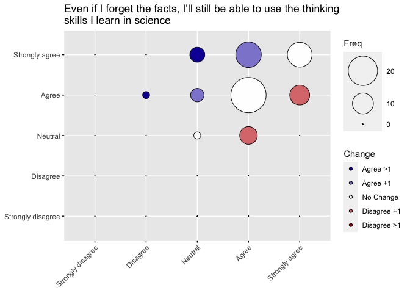<!-- -->

The stated goal of this series of questions, according to the survey itself, is to decide between two hypotheses, that the opinions are reliable over time (test-retest reliability) or that the opinions change as a result of your experience.

According to some quick review of the statistics literature, at least two alternatives can be considered:

1.  "Chronbach's Alpha is a way to measure the internal consistency of a questionnaire or survey." <https://www.statology.org/cronbachs-alpha-in-r/>

2.  "For measuring reliability for two tests, use the Pearson Correlation Coefficient. One disadvantage: it overestimates the true relationship for small samples (under 15)." <https://www.statisticshowto.com/test-retest-reliability/>

Other alternatives that we might want to consider are intraclass correlation (might be useful to look at different demographic groups) <https://www.statisticshowto.com/intraclass-correlation/> or this newer test-retest reliability package: <https://www.ncbi.nlm.nih.gov/pmc/articles/PMC6536112/> <https://github.com/mathesong/relfeas>

I will use Chronbach's Alpha for my analysis because it appears well-suited for this type of measurement. 
After discussing the preliminary results with some of the other authors, we decided to use a cutoff of 0.7 or higher for support of the null hypothesis (corresponding to Acceptable, Good, or Excellent consistency between the pre- and post- surveys). 
Support for the alternative hypothesis, that the experience in the course influenced the survey results, will be inferred from an alpha value less than 0.5 (Unacceptable). 
Alpha values between 0.5 and 0.7 will be inconclusive. 


```r
Q11Clean %>%
  select(Q11_1_pre, Q13_1_post) %>%
  cronbach.alpha(CI = TRUE)
```

```
## 
## Cronbach's alpha for the '.' data-set
## 
## Items: 2
## Sample units: 85
## alpha: 0.32
## 
## Bootstrap 95% CI based on 1000 samples
##  2.5% 97.5% 
##  0.01  0.54
```

```r
my_skim <-skim_with(numeric = sfl(median, iqr = IQR))

Q11Clean %>%
  transmute(Q11_1_pre = as.numeric(Q11_1_pre), 
            Q13_1_post = as.numeric(Q13_1_post), 
            Difference = Q13_1_post - Q11_1_pre) %>%
  my_skim()
```


Table: Data summary

|                         |           |
|:------------------------|:----------|
|Name                     |Piped data |
|Number of rows           |85         |
|Number of columns        |3          |
|_______________________  |           |
|Column type frequency:   |           |
|numeric                  |3          |
|________________________ |           |
|Group variables          |None       |


**Variable type: numeric**

|skim_variable | n_missing| complete_rate| mean|   sd| p0| p25| p50| p75| p100|hist  | median| iqr|
|:-------------|---------:|-------------:|----:|----:|--:|---:|---:|---:|----:|:-----|------:|---:|
|Q11_1_pre     |         0|             1| 4.13| 0.65|  2|   4|   4|   5|    5|▁▂▁▇▃ |      4|   1|
|Q13_1_post    |         0|             1| 4.31| 0.64|  3|   4|   4|   5|    5|▂▁▇▁▆ |      4|   1|
|Difference    |         0|             1| 0.18| 0.82| -1|   0|   0|   1|    2|▃▇▁▃▁ |      0|   1|


## Cronbach's Alpha

The following table describes how different values of Cronbach's Alpha are usually interpreted:

| Cronbach's Alpha | Internal consistency |
|------------------|----------------------|
| 0.9 ≤ α          | Excellent            |
| 0.8 ≤ α \< 0.9   | Good                 |
| 0.7 ≤ α \< 0.8   | Acceptable           |
| 0.6 ≤ α \< 0.7   | Questionable         |
| 0.5 ≤ α \< 0.6   | Poor                 |
| α \< 0.5         | Unacceptable         |

The conclusion is that the internal consistency of the survey result for question 1 is Unacceptable (alpha: 0.32), supporting the alternative hypothesis that the students experiences influenced their responses to this question.

Student perception changed by 0.1764706	+/- 0.8190655 on the survey.


```r
Q11Clean %>%
  select(Q11_2_pre, Q13_2_post) %>%
  table() %>%
  as.data.frame() %>%
  add_column(Change = colorcolumn) %>%
  ggballoonplot(x = "Q11_2_pre", y = "Q13_2_post", size = "Freq", 
                ggtheme = theme_gray(), fill = "Change", size.range = c(0, 20), 
                title = paste(strwrap(Q11TextClean$Question[2], 72), collapse = "\n")) + 
 fill_palette(c( "#1207A3","#8F88D2","#FFFEFE", "#DB7A7B","#BB0103" ))
```

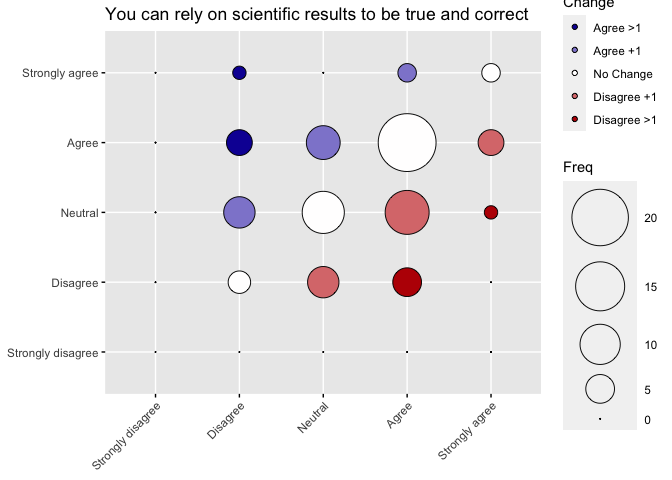<!-- -->

```r
Q11Clean %>%
  select(Q11_2_pre, Q13_2_post) %>%
  cronbach.alpha(CI = TRUE)
```

```
## 
## Cronbach's alpha for the '.' data-set
## 
## Items: 2
## Sample units: 85
## alpha: 0.457
## 
## Bootstrap 95% CI based on 1000 samples
##  2.5% 97.5% 
## 0.140 0.664
```

```r
Q11Clean %>%
  transmute(Q11_2_pre = as.numeric(Q11_2_pre), 
            Q13_2_post = as.numeric(Q13_2_post), 
            Difference = Q13_2_post - Q11_2_pre) %>%
  my_skim()
```


Table: Data summary

|                         |           |
|:------------------------|:----------|
|Name                     |Piped data |
|Number of rows           |85         |
|Number of columns        |3          |
|_______________________  |           |
|Column type frequency:   |           |
|numeric                  |3          |
|________________________ |           |
|Group variables          |None       |


**Variable type: numeric**

|skim_variable | n_missing| complete_rate|  mean|   sd| p0| p25| p50| p75| p100|hist  | median| iqr|
|:-------------|---------:|-------------:|-----:|----:|--:|---:|---:|---:|----:|:-----|------:|---:|
|Q11_2_pre     |         0|             1|  3.47| 0.87|  2|   3|   4|   4|    5|▃▅▁▇▂ |      4|   1|
|Q13_2_post    |         0|             1|  3.38| 0.83|  2|   3|   3|   4|    5|▃▇▁▇▁ |      3|   1|
|Difference    |         0|             1| -0.09| 1.01| -2|  -1|   0|   0|    3|▆▇▃▁▁ |      0|   1|

The conclusion is that the internal consistency of the survey result for question 2 is Unacceptable (alpha: 0.457), supporting the alternative hypothesis that the students experiences influenced their responses to this question.

Student perception increased by an average -0.09411765 +/- 1.0073956 on the survey.
	


```r
Q11Clean %>%
  select(Q11_3_pre, Q13_3_post) %>%
  table() %>%
  as.data.frame() %>%
  add_column(Change = colorcolumn) %>%
  ggballoonplot(x = "Q11_3_pre", y = "Q13_3_post", size = "Freq", 
                ggtheme = theme_gray(), fill = "Change", size.range = c(0, 20), 
                title = paste(strwrap(Q11TextClean$Question[3], 72), collapse = "\n")) + 
  fill_palette(c( "#1207A3","#8F88D2","#FFFEFE", "#DB7A7B","#BB0103" ))
```

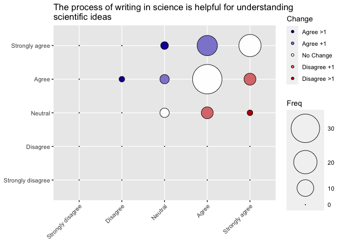<!-- -->

```r
Q11Clean %>%
  select(Q11_3_pre, Q13_3_post) %>%
  cronbach.alpha(CI = TRUE)
```

```
## 
## Cronbach's alpha for the '.' data-set
## 
## Items: 2
## Sample units: 85
## alpha: 0.565
## 
## Bootstrap 95% CI based on 1000 samples
##  2.5% 97.5% 
## 0.338 0.729
```

```r
Q11Clean %>%
  transmute(Q11_3_pre = as.numeric(Q11_3_pre), 
            Q13_3_post = as.numeric(Q13_3_post), 
            Difference = Q13_3_post - Q11_3_pre) %>%
  my_skim()
```


Table: Data summary

|                         |           |
|:------------------------|:----------|
|Name                     |Piped data |
|Number of rows           |85         |
|Number of columns        |3          |
|_______________________  |           |
|Column type frequency:   |           |
|numeric                  |3          |
|________________________ |           |
|Group variables          |None       |


**Variable type: numeric**

|skim_variable | n_missing| complete_rate| mean|   sd| p0| p25| p50| p75| p100|hist  | median| iqr|
|:-------------|---------:|-------------:|----:|----:|--:|---:|---:|---:|----:|:-----|------:|---:|
|Q11_3_pre     |         0|             1| 4.16| 0.63|  2|   4|   4|   5|    5|▁▁▁▇▃ |      4|   1|
|Q13_3_post    |         0|             1| 4.31| 0.66|  3|   4|   4|   5|    5|▂▁▇▁▇ |      4|   1|
|Difference    |         0|             1| 0.14| 0.71| -2|   0|   0|   0|    2|▁▂▇▃▁ |      0|   0|

The conclusion is that the internal consistency of the survey result for question 3 is Poor (alpha: 0.565), providing inconclusive support that the students experiences influenced their responses to this question.

Student perception increased by an average 0.1411765 +/- 0.7096770 on the survey.


```r
Q11Clean %>%
  select(Q11_4_pre, Q13_4_post) %>%
  table() %>%
  as.data.frame() %>%
  add_column(Change = colorcolumn) %>%
  ggballoonplot(x = "Q11_4_pre", y = "Q13_4_post", size = "Freq", 
                ggtheme = theme_gray(), fill = "Change", size.range = c(0, 20), 
                title = paste(strwrap(Q11TextClean$Question[4], 60), collapse = "\n")) + 
  fill_palette(c( "#1207A3","#8F88D2","#FFFEFE", "#DB7A7B","#BB0103" ))
```

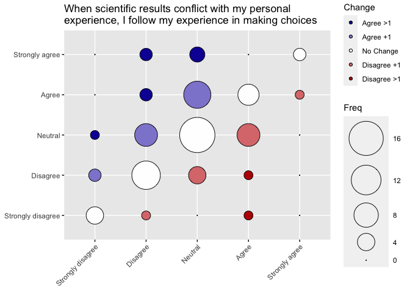<!-- -->

```r
Q11Clean %>%
  select(Q11_4_pre, Q13_4_post) %>%
  na.omit() %>%
  cronbach.alpha(CI = TRUE)
```

```
## 
## Cronbach's alpha for the '.' data-set
## 
## Items: 2
## Sample units: 82
## alpha: 0.663
## 
## Bootstrap 95% CI based on 1000 samples
##  2.5% 97.5% 
## 0.427 0.808
```

```r
Q11Clean %>%
  transmute(Q11_4_pre = as.numeric(Q11_4_pre), Q13_4_post = as.numeric(Q13_4_post) ) %>%
  na.omit() %>%
  mutate(Difference = Q13_4_post - Q11_4_pre) %>%
  my_skim()
```


Table: Data summary

|                         |           |
|:------------------------|:----------|
|Name                     |Piped data |
|Number of rows           |82         |
|Number of columns        |3          |
|_______________________  |           |
|Column type frequency:   |           |
|numeric                  |3          |
|________________________ |           |
|Group variables          |None       |


**Variable type: numeric**

|skim_variable | n_missing| complete_rate| mean|   sd| p0| p25| p50| p75| p100|hist  | median| iqr|
|:-------------|---------:|-------------:|----:|----:|--:|---:|---:|---:|----:|:-----|------:|---:|
|Q11_4_pre     |         0|             1| 2.80| 0.96|  1|   2|   3|   3|    5|▂▆▇▃▁ |      3|   1|
|Q13_4_post    |         0|             1| 3.04| 1.05|  1|   2|   3|   4|    5|▂▅▇▅▂ |      3|   2|
|Difference    |         0|             1| 0.23| 1.01| -3|   0|   0|   1|    3|▁▂▇▃▂ |      0|   1|

The conclusion is that the internal consistency of the survey result for question 4 is Questionable (alpha: 0.663), providing inconclusive support that the students experiences influenced their responses to this question.

Student perception changed by an average 0.2317073 +/- 1.0098133 on the survey.


```r
Q11Clean %>%
  select(Q11_5_pre, Q13_5_post) %>%
  table() %>%
  as.data.frame() %>%
  add_column(Change = colorcolumn) %>%
  ggballoonplot(x = "Q11_5_pre", y = "Q13_5_post", size = "Freq", 
                ggtheme = theme_gray(), fill = "Change", size.range = c(0, 20), 
                title = paste(strwrap(Q11TextClean$Question[5], 60), collapse = "\n")) + 
  fill_palette(c( "#1207A3","#8F88D2","#FFFEFE", "#DB7A7B","#BB0103" ))
```

<!-- -->

```r
Q11Clean %>%
  select(Q11_5_pre, Q13_5_post) %>%
  na.omit() %>%
  cronbach.alpha(CI = TRUE)
```

```
## 
## Cronbach's alpha for the '.' data-set
## 
## Items: 2
## Sample units: 85
## alpha: 0.621
## 
## Bootstrap 95% CI based on 1000 samples
##  2.5% 97.5% 
## 0.348 0.778
```

```r
Q11Clean %>%
  transmute(Q11_5_pre = as.numeric(Q11_5_pre), Q13_5_post = as.numeric(Q13_5_post) ) %>%
  na.omit() %>%
  mutate(Difference = Q13_5_post - Q11_5_pre) %>%
  my_skim()
```


Table: Data summary

|                         |           |
|:------------------------|:----------|
|Name                     |Piped data |
|Number of rows           |85         |
|Number of columns        |3          |
|_______________________  |           |
|Column type frequency:   |           |
|numeric                  |3          |
|________________________ |           |
|Group variables          |None       |


**Variable type: numeric**

|skim_variable | n_missing| complete_rate| mean|   sd| p0| p25| p50| p75| p100|hist  | median| iqr|
|:-------------|---------:|-------------:|----:|----:|--:|---:|---:|---:|----:|:-----|------:|---:|
|Q11_5_pre     |         0|             1| 2.05| 0.96|  1|   1|   2|   2|    5|▅▇▂▁▁ |      2|   1|
|Q13_5_post    |         0|             1| 2.19| 1.10|  1|   1|   2|   2|    5|▅▇▂▁▁ |      2|   1|
|Difference    |         0|             1| 0.14| 1.08| -3|   0|   0|   1|    3|▁▂▇▃▂ |      0|   1|

The conclusion is that the internal consistency of the survey result for question 5 is Questionable (alpha: 0.621), providing inconclusive support that the students experiences influenced their responses to this question.

Student perception changed by an average 0.1411765 +/- 1.0818078 on the survey.


```r
Q11Clean %>%
  select(Q11_6_pre, Q13_6_post) %>%
  table() %>%
  as.data.frame() %>%
  add_column(Change = colorcolumn) %>%
  ggballoonplot(x = "Q11_6_pre", y = "Q13_6_post", size = "Freq", 
                ggtheme = theme_gray(), fill = "Change", size.range = c(0, 20), 
                title = paste(strwrap(Q11TextClean$Question[6], 60), collapse = "\n")) + 
  fill_palette(c( "#1207A3","#8F88D2","#FFFEFE", "#DB7A7B","#BB0103" ))
```

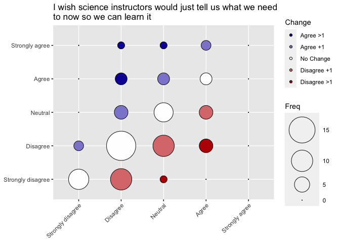<!-- -->

```r
Q11Clean %>%
  select(Q11_6_pre, Q13_6_post) %>%
  na.omit() %>%
  cronbach.alpha(CI = TRUE)
```

```
## 
## Cronbach's alpha for the '.' data-set
## 
## Items: 2
## Sample units: 84
## alpha: 0.698
## 
## Bootstrap 95% CI based on 1000 samples
##  2.5% 97.5% 
## 0.544 0.810
```

```r
Q11Clean %>%
  transmute(Q11_6_pre = as.numeric(Q11_6_pre), Q13_6_post = as.numeric(Q13_6_post) ) %>%
  na.omit() %>%
  mutate(Difference = Q13_6_post - Q11_6_pre) %>%
  my_skim()
```


Table: Data summary

|                         |           |
|:------------------------|:----------|
|Name                     |Piped data |
|Number of rows           |84         |
|Number of columns        |3          |
|_______________________  |           |
|Column type frequency:   |           |
|numeric                  |3          |
|________________________ |           |
|Group variables          |None       |


**Variable type: numeric**

|skim_variable | n_missing| complete_rate|  mean|   sd| p0| p25| p50| p75| p100|hist  | median| iqr|
|:-------------|---------:|-------------:|-----:|----:|--:|---:|---:|---:|----:|:-----|------:|---:|
|Q11_6_pre     |         0|             1|  2.45| 0.91|  1|   2|   2|   3|    4|▂▇▁▅▃ |      2|   1|
|Q13_6_post    |         0|             1|  2.31| 1.10|  1|   2|   2|   3|    5|▅▇▃▂▁ |      2|   1|
|Difference    |         0|             1| -0.14| 0.97| -2|  -1|   0|   0|    3|▆▇▂▁▁ |      0|   1|

The conclusion is that the internal consistency of the survey result for question 6 is Questionable (alpha: 0.698), providing inconclusive support that the students experiences influenced their responses to this question.

Student perception changed by an average -0.1428571 +/- 0.9711856 on the survey.


```r
Q11Clean %>%
  select(Q11_7_pre, Q13_7_post) %>%
  table() %>%
  as.data.frame() %>%
  add_column(Change = colorcolumn) %>%
  ggballoonplot(x = "Q11_7_pre", y = "Q13_7_post", size = "Freq", 
                ggtheme = theme_gray(), fill = "Change", size.range = c(0, 20), 
                title = paste(strwrap(Q11TextClean$Question[7], 60), collapse = "\n")) + 
  fill_palette(c( "#1207A3","#8F88D2","#FFFEFE", "#DB7A7B","#BB0103" ))
```

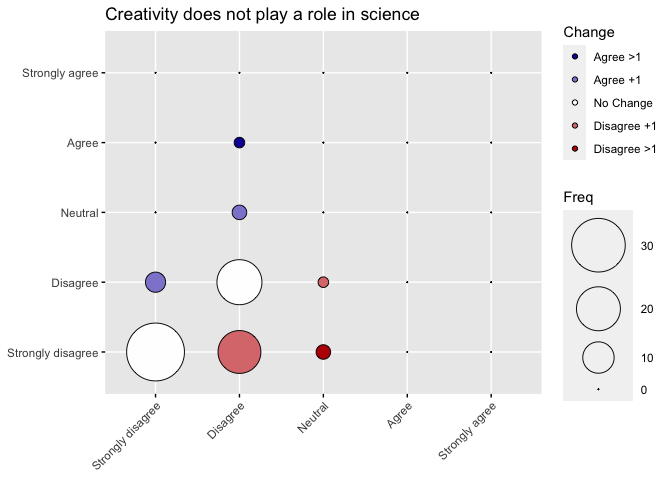<!-- -->

```r
Q11Clean %>%
  select(Q11_7_pre, Q13_7_post) %>%
  na.omit() %>%
  cronbach.alpha(CI = TRUE)
```

```
## 
## Cronbach's alpha for the '.' data-set
## 
## Items: 2
## Sample units: 85
## alpha: 0.557
## 
## Bootstrap 95% CI based on 1000 samples
##  2.5% 97.5% 
## 0.368 0.711
```

```r
Q11Clean %>%
  transmute(Q11_7_pre = as.numeric(Q11_7_pre), Q13_7_post = as.numeric(Q13_7_post) ) %>%
  na.omit() %>%
  mutate(Difference = Q13_7_post - Q11_7_pre) %>%
  my_skim()
```


Table: Data summary

|                         |           |
|:------------------------|:----------|
|Name                     |Piped data |
|Number of rows           |85         |
|Number of columns        |3          |
|_______________________  |           |
|Column type frequency:   |           |
|numeric                  |3          |
|________________________ |           |
|Group variables          |None       |


**Variable type: numeric**

|skim_variable | n_missing| complete_rate|  mean|   sd| p0| p25| p50| p75| p100|hist  | median| iqr|
|:-------------|---------:|-------------:|-----:|----:|--:|---:|---:|---:|----:|:-----|------:|---:|
|Q11_7_pre     |         0|             1|  1.58| 0.56|  1|   1|   2|   2|    3|▇▁▇▁▁ |      2|   1|
|Q13_7_post    |         0|             1|  1.39| 0.60|  1|   1|   1|   2|    4|▇▃▁▁▁ |      1|   1|
|Difference    |         0|             1| -0.19| 0.65| -2|  -1|   0|   0|    2|▁▃▇▁▁ |      0|   1|

The conclusion is that the internal consistency of the survey result for question 7 is Poor (alpha: 0.557), providing inconclusive support that the students experiences influenced their responses to this question.

Student perception changed by an average -0.1882353 +/- 0.6453887 on the survey.


```r
Q11Clean %>%
  select(Q11_8_pre, Q13_8_post) %>%
  table() %>%
  as.data.frame() %>%
  add_column(Change = colorcolumn) %>%
  ggballoonplot(x = "Q11_8_pre", y = "Q13_8_post", size = "Freq", 
                ggtheme = theme_gray(), fill = "Change", size.range = c(0, 20), 
                title = paste(strwrap(Q11TextClean$Question[8], 60), collapse = "\n")) + 
  fill_palette(c( "#1207A3","#8F88D2","#FFFEFE", "#DB7A7B","#BB0103" ))
```

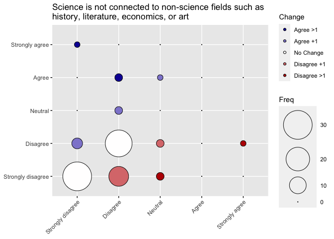<!-- -->

```r
Q11Clean %>%
  select(Q11_8_pre, Q13_8_post) %>%
  na.omit() %>%
  cronbach.alpha(CI = TRUE)
```

```
## 
## Cronbach's alpha for the '.' data-set
## 
## Items: 2
## Sample units: 85
## alpha: 0.501
## 
## Bootstrap 95% CI based on 1000 samples
##  2.5% 97.5% 
## 0.228 0.709
```

```r
Q11Clean %>%
  transmute(Q11_8_pre = as.numeric(Q11_8_pre), Q13_8_post = as.numeric(Q13_8_post) ) %>%
  na.omit() %>%
  mutate(Difference = Q13_8_post - Q11_8_pre) %>%
  my_skim()
```


Table: Data summary

|                         |           |
|:------------------------|:----------|
|Name                     |Piped data |
|Number of rows           |85         |
|Number of columns        |3          |
|_______________________  |           |
|Column type frequency:   |           |
|numeric                  |3          |
|________________________ |           |
|Group variables          |None       |


**Variable type: numeric**

|skim_variable | n_missing| complete_rate|  mean|   sd| p0| p25| p50| p75| p100|hist  | median| iqr|
|:-------------|---------:|-------------:|-----:|----:|--:|---:|---:|---:|----:|:-----|------:|---:|
|Q11_8_pre     |         0|             1|  1.68| 0.69|  1|   1|   2|   2|    5|▆▇▁▁▁ |      2|   1|
|Q13_8_post    |         0|             1|  1.59| 0.81|  1|   1|   1|   2|    5|▇▆▁▁▁ |      1|   1|
|Difference    |         0|             1| -0.09| 0.87| -3|   0|   0|   0|    4|▁▂▇▁▁ |      0|   0|

The conclusion is that the internal consistency of the survey result for question 8 is Poor (alpha: 0.501), providing inconclusive support that the students experiences influenced their responses to this question.

Student perception changed by an average -0.09411765 +/- 0.8677218 on the survey.


```r
Q11Clean %>%
  select(Q11_9_pre, Q13_9_post) %>%
  table() %>%
  as.data.frame() %>%
  add_column(Change = colorcolumn) %>%
  ggballoonplot(x = "Q11_9_pre", y = "Q13_9_post", size = "Freq", 
                ggtheme = theme_gray(), fill = "Change", size.range = c(0, 20), 
                title = paste(strwrap(Q11TextClean$Question[9], 60), collapse = "\n")) + 
  fill_palette(c( "#1207A3","#8F88D2","#FFFEFE", "#DB7A7B","#BB0103" ))
```

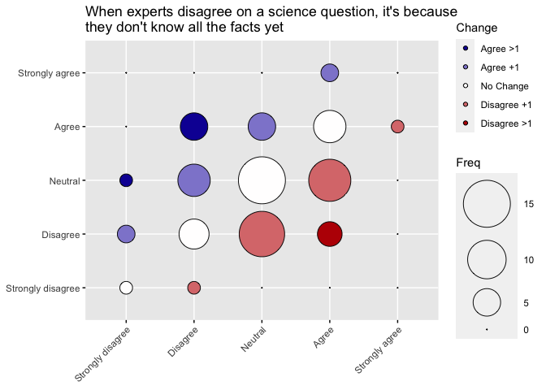<!-- -->

```r
Q11Clean %>%
  select(Q11_9_pre, Q13_9_post) %>%
  na.omit() %>%
  cronbach.alpha(CI = TRUE)
```

```
## 
## Cronbach's alpha for the '.' data-set
## 
## Items: 2
## Sample units: 83
## alpha: 0.49
## 
## Bootstrap 95% CI based on 1000 samples
##  2.5% 97.5% 
## 0.205 0.671
```

```r
Q11Clean %>%
  transmute(Q11_9_pre = as.numeric(Q11_9_pre), Q13_9_post = as.numeric(Q13_9_post) ) %>%
  na.omit() %>%
  mutate(Difference = Q13_9_post - Q11_9_pre) %>%
  my_skim()
```


Table: Data summary

|                         |           |
|:------------------------|:----------|
|Name                     |Piped data |
|Number of rows           |83         |
|Number of columns        |3          |
|_______________________  |           |
|Column type frequency:   |           |
|numeric                  |3          |
|________________________ |           |
|Group variables          |None       |


**Variable type: numeric**

|skim_variable | n_missing| complete_rate| mean|   sd| p0| p25| p50| p75| p100|hist  | median| iqr|
|:-------------|---------:|-------------:|----:|----:|--:|---:|---:|---:|----:|:-----|------:|---:|
|Q11_9_pre     |         0|             1|  3.0| 0.88|  1|   2|   3|   4|    5|▁▅▇▆▁ |      3|   2|
|Q13_9_post    |         0|             1|  2.9| 0.85|  1|   2|   3|   3|    5|▁▆▇▅▁ |      3|   1|
|Difference    |         0|             1| -0.1| 1.01| -2|  -1|   0|   1|    2|▁▇▇▅▂ |      0|   2|

The conclusion is that the internal consistency of the survey result for question 9 is Unacceptable (alpha: 0.49), supporting the alternative hypothesis that the students experiences influenced their responses to this question.

Student perception changed by an average -0.09638554 +/- 1.0074655 on the survey.


```r
Q11Clean %>%
  select(Q11_10_pre, Q13_10_post) %>%
  table() %>%
  as.data.frame() %>%
  add_column(Change = colorcolumn) %>%
  ggballoonplot(x = "Q11_10_pre", y = "Q13_10_post", size = "Freq", 
                ggtheme = theme_gray(), fill = "Change", size.range = c(0, 20), 
                title = paste(strwrap(Q11TextClean$Question[10], 60), collapse = "\n")) + 
  fill_palette(c( "#1207A3","#8F88D2","#FFFEFE", "#DB7A7B","#BB0103" ))
```

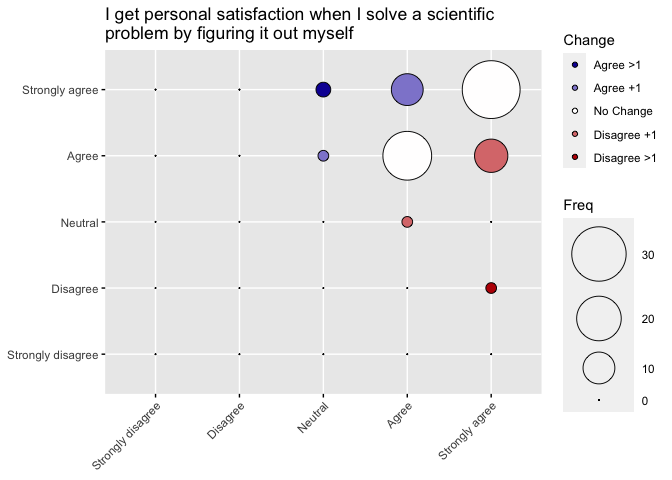<!-- -->

```r
Q11Clean %>%
  select(Q11_10_pre, Q13_10_post) %>%
  na.omit() %>%
  cronbach.alpha(CI = TRUE)
```

```
## 
## Cronbach's alpha for the '.' data-set
## 
## Items: 2
## Sample units: 84
## alpha: 0.444
## 
## Bootstrap 95% CI based on 1000 samples
##  2.5% 97.5% 
##  0.12  0.69
```

```r
Q11Clean %>%
  transmute(Q11_10_pre = as.numeric(Q11_10_pre), Q13_10_post = as.numeric(Q13_10_post) ) %>%
  na.omit() %>%
  mutate(Difference = Q13_10_post - Q11_10_pre) %>%
  my_skim()
```


Table: Data summary

|                         |           |
|:------------------------|:----------|
|Name                     |Piped data |
|Number of rows           |84         |
|Number of columns        |3          |
|_______________________  |           |
|Column type frequency:   |           |
|numeric                  |3          |
|________________________ |           |
|Group variables          |None       |


**Variable type: numeric**

|skim_variable | n_missing| complete_rate| mean|   sd| p0| p25| p50| p75| p100|hist  | median| iqr|
|:-------------|---------:|-------------:|----:|----:|--:|---:|---:|---:|----:|:-----|------:|---:|
|Q11_10_pre    |         0|             1| 4.51| 0.57|  3|   4|   5|   5|    5|▁▁▆▁▇ |      5|   1|
|Q13_10_post   |         0|             1| 4.51| 0.59|  2|   4|   5|   5|    5|▁▁▁▆▇ |      5|   1|
|Difference    |         0|             1| 0.00| 0.69| -3|   0|   0|   0|    2|▁▂▇▂▁ |      0|   0|

The conclusion is that the internal consistency of the survey result for question 10 is Unacceptable (alpha: 0.444), supporting the alternative hypothesis that the students experiences influenced their responses to this question.

Student perception changed by an average 0.000000 +/- 0.6942101 on the survey.


```r
Q11Clean %>%
  select(Q11_11_pre, Q13_11_post) %>%
  table() %>%
  as.data.frame() %>%
  add_column(Change = colorcolumn) %>%
  ggballoonplot(x = "Q11_11_pre", y = "Q13_11_post", size = "Freq", 
                ggtheme = theme_gray(), fill = "Change", size.range = c(0, 20), 
                title = paste(strwrap(Q11TextClean$Question[11], 60), collapse = "\n")) + 
  fill_palette(c( "#1207A3","#8F88D2","#FFFEFE", "#DB7A7B","#BB0103" ))
```

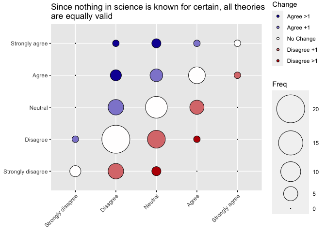<!-- -->

```r
Q11Clean %>%
  select(Q11_11_pre, Q13_11_post) %>%
  na.omit() %>%
  cronbach.alpha(CI = TRUE)
```

```
## 
## Cronbach's alpha for the '.' data-set
## 
## Items: 2
## Sample units: 84
## alpha: 0.719
## 
## Bootstrap 95% CI based on 1000 samples
##  2.5% 97.5% 
## 0.573 0.828
```

```r
Q11Clean %>%
  transmute(Q11_11_pre = as.numeric(Q11_11_pre), Q13_11_post = as.numeric(Q13_11_post) ) %>%
  na.omit() %>%
  mutate(Difference = Q13_11_post - Q11_11_pre) %>%
  my_skim()
```


Table: Data summary

|                         |           |
|:------------------------|:----------|
|Name                     |Piped data |
|Number of rows           |84         |
|Number of columns        |3          |
|_______________________  |           |
|Column type frequency:   |           |
|numeric                  |3          |
|________________________ |           |
|Group variables          |None       |


**Variable type: numeric**

|skim_variable | n_missing| complete_rate|  mean|   sd| p0| p25| p50| p75| p100|hist  | median| iqr|
|:-------------|---------:|-------------:|-----:|----:|--:|---:|---:|---:|----:|:-----|------:|---:|
|Q11_11_pre    |         0|             1|  2.69| 0.89|  1|   2|   3|   3|    5|▁▇▆▃▁ |      3|   1|
|Q13_11_post   |         0|             1|  2.68| 1.10|  1|   2|   3|   3|    5|▃▇▆▃▁ |      3|   1|
|Difference    |         0|             1| -0.01| 0.94| -2|  -1|   0|   0|    3|▅▇▂▁▁ |      0|   1|

The conclusion is that the internal consistency of the survey result for question 11 is Acceptable (alpha: 0.719), not supporting the alternative hypothesis that the students experiences influenced their responses to this question.


```r
Q11Clean %>%
  select(Q11_12_pre, Q13_12_post) %>%
  table() %>%
  as.data.frame() %>%
  add_column(Change = colorcolumn) %>%
  ggballoonplot(x = "Q11_12_pre", y = "Q13_12_post", size = "Freq", 
                ggtheme = theme_gray(), fill = "Change", size.range = c(0, 20), 
                title = paste(strwrap(Q11TextClean$Question[12], 60), collapse = "\n")) + 
  fill_palette(c( "#1207A3","#8F88D2","#FFFEFE", "#DB7A7B","#BB0103" ))
```

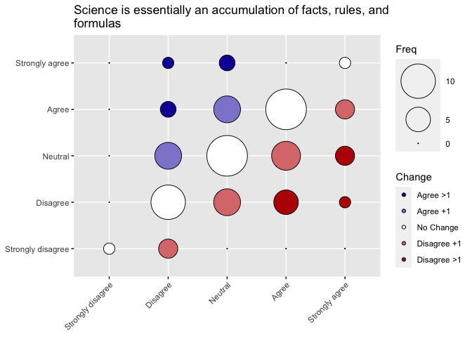<!-- -->

```r
Q11Clean %>%
  select(Q11_12_pre, Q13_12_post) %>%
  na.omit() %>%
  cronbach.alpha(CI = TRUE)
```

```
## 
## Cronbach's alpha for the '.' data-set
## 
## Items: 2
## Sample units: 85
## alpha: 0.578
## 
## Bootstrap 95% CI based on 1000 samples
##  2.5% 97.5% 
## 0.305 0.746
```

```r
Q11Clean %>%
  transmute(Q11_12_pre = as.numeric(Q11_12_pre), Q13_12_post = as.numeric(Q13_12_post) ) %>%
  na.omit() %>%
  mutate(Difference = Q13_12_post - Q11_12_pre) %>%
  my_skim()
```


Table: Data summary

|                         |           |
|:------------------------|:----------|
|Name                     |Piped data |
|Number of rows           |85         |
|Number of columns        |3          |
|_______________________  |           |
|Column type frequency:   |           |
|numeric                  |3          |
|________________________ |           |
|Group variables          |None       |


**Variable type: numeric**

|skim_variable | n_missing| complete_rate|  mean|   sd| p0| p25| p50| p75| p100|hist  | median| iqr|
|:-------------|---------:|-------------:|-----:|----:|--:|---:|---:|---:|----:|:-----|------:|---:|
|Q11_12_pre    |         0|             1|  3.21| 0.98|  1|   2|   3|   4|    5|▁▆▇▇▂ |      3|   2|
|Q13_12_post   |         0|             1|  3.04| 0.97|  1|   2|   3|   4|    5|▁▆▇▇▁ |      3|   2|
|Difference    |         0|             1| -0.18| 1.06| -3|  -1|   0|   0|    3|▂▃▇▂▁ |      0|   1|

The conclusion is that the internal consistency of the survey result for question 12 is Poor (alpha: 0.578), providing inconclusive support that the students experiences influenced their responses to this question.

Student perception changed by an average -0.1764706 +/- 1.0598346 on the survey.


```r
Q11Clean %>%
  select(Q11_13_pre, Q13_13_post) %>%
  table() %>%
  as.data.frame() %>%
  add_column(Change = colorcolumn) %>%
  ggballoonplot(x = "Q11_13_pre", y = "Q13_13_post", size = "Freq", 
                ggtheme = theme_gray(), fill = "Change", size.range = c(0, 20), 
                title = paste(strwrap(Q11TextClean$Question[13], 60), collapse = "\n")) + 
  fill_palette(c( "#1207A3","#8F88D2","#FFFEFE", "#DB7A7B","#BB0103" ))
```

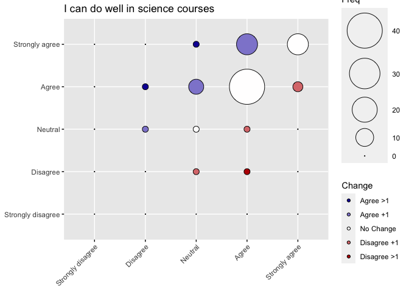<!-- -->

```r
Q11Clean %>%
  select(Q11_13_pre, Q13_13_post) %>%
  na.omit() %>%
  cronbach.alpha(CI = TRUE)
```

```
## 
## Cronbach's alpha for the '.' data-set
## 
## Items: 2
## Sample units: 85
## alpha: 0.665
## 
## Bootstrap 95% CI based on 1000 samples
##  2.5% 97.5% 
## 0.495 0.784
```

```r
Q11Clean %>%
  transmute(Q11_13_pre = as.numeric(Q11_13_pre), Q13_13_post = as.numeric(Q13_13_post) ) %>%
  na.omit() %>%
  mutate(Difference = Q13_13_post - Q11_13_pre) %>%
  my_skim()
```


Table: Data summary

|                         |           |
|:------------------------|:----------|
|Name                     |Piped data |
|Number of rows           |85         |
|Number of columns        |3          |
|_______________________  |           |
|Column type frequency:   |           |
|numeric                  |3          |
|________________________ |           |
|Group variables          |None       |


**Variable type: numeric**

|skim_variable | n_missing| complete_rate| mean|   sd| p0| p25| p50| p75| p100|hist  | median| iqr|
|:-------------|---------:|-------------:|----:|----:|--:|---:|---:|---:|----:|:-----|------:|---:|
|Q11_13_pre    |         0|             1| 4.04| 0.64|  2|   4|   4|   4|    5|▁▂▁▇▂ |      4|   0|
|Q13_13_post   |         0|             1| 4.26| 0.64|  2|   4|   4|   5|    5|▁▁▁▇▅ |      4|   1|
|Difference    |         0|             1| 0.22| 0.64| -2|   0|   0|   1|    2|▁▁▇▃▁ |      0|   1|

The conclusion is that the internal consistency of the survey result for question 13 is Questionable (alpha: 0.665), providing inconclusive support that the students experiences influenced their responses to this question.

Student perception changed by an average 0.2235294 +/- 0.6432150 on the survey.


```r
Q11Clean %>%
  select(Q11_14_pre, Q13_14_post) %>%
  table() %>%
  as.data.frame() %>%
  add_column(Change = colorcolumn) %>%
  ggballoonplot(x = "Q11_14_pre", y = "Q13_14_post", size = "Freq", 
                ggtheme = theme_gray(), fill = "Change", size.range = c(0, 20), 
                title = paste(strwrap(Q11TextClean$Question[14], 60), collapse = "\n")) + 
  fill_palette(c( "#1207A3","#8F88D2","#FFFEFE", "#DB7A7B","#BB0103" ))
```

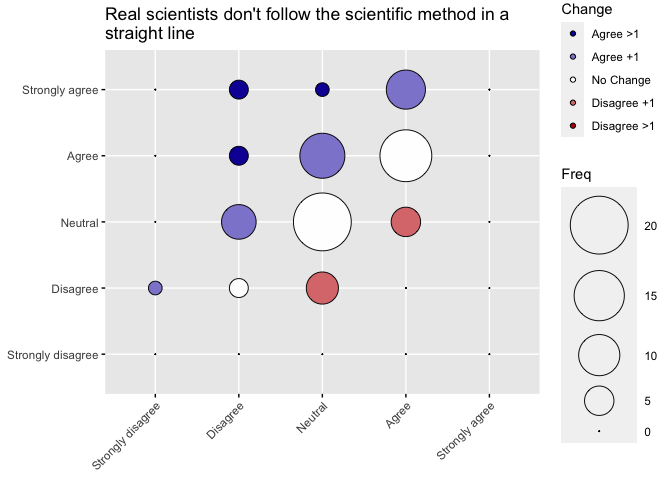<!-- -->

```r
Q11Clean %>%
  select(Q11_14_pre, Q13_14_post) %>%
  na.omit() %>%
  cronbach.alpha(CI = TRUE)
```

```
## 
## Cronbach's alpha for the '.' data-set
## 
## Items: 2
## Sample units: 83
## alpha: 0.617
## 
## Bootstrap 95% CI based on 1000 samples
##  2.5% 97.5% 
## 0.403 0.756
```

```r
Q11Clean %>%
  transmute(Q11_14_pre = as.numeric(Q11_14_pre), Q13_14_post = as.numeric(Q13_14_post) ) %>%
  na.omit() %>%
  mutate(Difference = Q13_14_post - Q11_14_pre) %>%
  my_skim()
```


Table: Data summary

|                         |           |
|:------------------------|:----------|
|Name                     |Piped data |
|Number of rows           |83         |
|Number of columns        |3          |
|_______________________  |           |
|Column type frequency:   |           |
|numeric                  |3          |
|________________________ |           |
|Group variables          |None       |


**Variable type: numeric**

|skim_variable | n_missing| complete_rate| mean|   sd| p0| p25| p50| p75| p100|hist  | median| iqr|
|:-------------|---------:|-------------:|----:|----:|--:|---:|---:|---:|----:|:-----|------:|---:|
|Q11_14_pre    |         0|             1| 3.18| 0.73|  1|   3|   3|   4|    4|▁▂▁▇▆ |      3|   1|
|Q13_14_post   |         0|             1| 3.54| 0.87|  2|   3|   4|   4|    5|▂▇▁▇▃ |      4|   1|
|Difference    |         0|             1| 0.36| 0.85| -1|   0|   0|   1|    3|▂▇▆▁▁ |      0|   1|

The conclusion is that the internal consistency of the survey result for question 14 is Questionable (alpha: 0.617), providing inconclusive support that the students experiences influenced their responses to this question.

Student perception changed by an average 0.3614458 +/- 0.8493658 on the survey.


```r
Q11Clean %>%
  select(Q11_15_pre, Q13_15_post) %>%
  table() %>%
  as.data.frame() %>%
  add_column(Change = colorcolumn) %>%
  ggballoonplot(x = "Q11_15_pre", y = "Q13_15_post", size = "Freq", 
                ggtheme = theme_gray(), fill = "Change", size.range = c(0, 20), 
                title = paste(strwrap(Q11TextClean$Question[15], 60), collapse = "\n")) + 
  fill_palette(c( "#1207A3","#8F88D2","#FFFEFE", "#DB7A7B","#BB0103" ))
```

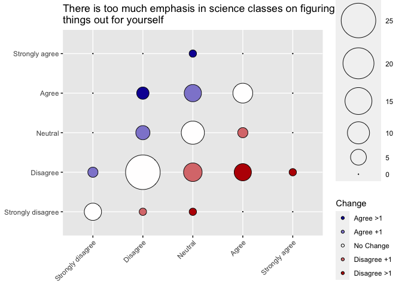<!-- -->

```r
Q11Clean %>%
  select(Q11_15_pre, Q13_15_post) %>%
  na.omit() %>%
  cronbach.alpha(CI = TRUE)
```

```
## 
## Cronbach's alpha for the '.' data-set
## 
## Items: 2
## Sample units: 84
## alpha: 0.671
## 
## Bootstrap 95% CI based on 1000 samples
##  2.5% 97.5% 
## 0.488 0.804
```

```r
Q11Clean %>%
  transmute(Q11_15_pre = as.numeric(Q11_15_pre), Q13_15_post = as.numeric(Q13_15_post) ) %>%
  na.omit() %>%
  mutate(Difference = Q13_15_post - Q11_15_pre) %>%
  my_skim()
```


Table: Data summary

|                         |           |
|:------------------------|:----------|
|Name                     |Piped data |
|Number of rows           |84         |
|Number of columns        |3          |
|_______________________  |           |
|Column type frequency:   |           |
|numeric                  |3          |
|________________________ |           |
|Group variables          |None       |


**Variable type: numeric**

|skim_variable | n_missing| complete_rate|  mean|   sd| p0| p25| p50| p75| p100|hist  | median| iqr|
|:-------------|---------:|-------------:|-----:|----:|--:|---:|---:|---:|----:|:-----|------:|---:|
|Q11_15_pre    |         0|             1|  2.63| 0.94|  1|   2|   3|   3|    5|▂▇▆▃▁ |      3|   1|
|Q13_15_post   |         0|             1|  2.55| 0.96|  1|   2|   2|   3|    5|▂▇▃▃▁ |      2|   1|
|Difference    |         0|             1| -0.08| 0.95| -3|   0|   0|   0|    2|▁▂▇▂▁ |      0|   0|

The conclusion is that the internal consistency of the survey result for question 15 is Questionable (alpha: 0.671), supporting inconclusive support that the students experiences influenced their responses to this question.

Student perception changed by an average -0.08333333 +/- 0.9468824 on the survey.


```r
Q11Clean %>%
  select(Q11_16_pre, Q13_16_post) %>%
  table() %>%
  as.data.frame() %>%
  add_column(Change = colorcolumn) %>%
  ggballoonplot(x = "Q11_16_pre", y = "Q13_16_post", size = "Freq", 
                ggtheme = theme_gray(), fill = "Change", size.range = c(0, 20), 
                title = paste(strwrap(Q11TextClean$Question[16], 60), collapse = "\n")) + 
  fill_palette(c( "#1207A3","#8F88D2","#FFFEFE", "#DB7A7B","#BB0103" ))
```

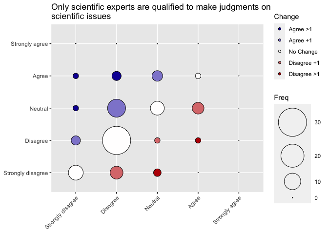<!-- -->

```r
Q11Clean %>%
  select(Q11_16_pre, Q13_16_post) %>%
  na.omit() %>%
  cronbach.alpha(CI = TRUE)
```

```
## 
## Cronbach's alpha for the '.' data-set
## 
## Items: 2
## Sample units: 85
## alpha: 0.622
## 
## Bootstrap 95% CI based on 1000 samples
##  2.5% 97.5% 
## 0.404 0.767
```

```r
Q11Clean %>%
  transmute(Q11_16_pre = as.numeric(Q11_16_pre), Q13_16_post = as.numeric(Q13_16_post) ) %>%
  na.omit() %>%
  mutate(Difference = Q13_16_post - Q11_16_pre) %>%
  my_skim()
```


Table: Data summary

|                         |           |
|:------------------------|:----------|
|Name                     |Piped data |
|Number of rows           |85         |
|Number of columns        |3          |
|_______________________  |           |
|Column type frequency:   |           |
|numeric                  |3          |
|________________________ |           |
|Group variables          |None       |


**Variable type: numeric**

|skim_variable | n_missing| complete_rate| mean|   sd| p0| p25| p50| p75| p100|hist  | median| iqr|
|:-------------|---------:|-------------:|----:|----:|--:|---:|---:|---:|----:|:-----|------:|---:|
|Q11_16_pre    |         0|             1| 2.18| 0.79|  1|   2|   2|   2|    4|▂▇▁▂▁ |      2|   0|
|Q13_16_post   |         0|             1| 2.32| 0.90|  1|   2|   2|   3|    4|▃▇▁▆▂ |      2|   1|
|Difference    |         0|             1| 0.14| 0.89| -2|   0|   0|   1|    3|▂▇▃▁▁ |      0|   1|

The conclusion is that the internal consistency of the survey result for question 16 is Questionable (alpha: 0.622), providing inconclusive support that the students experiences influenced their responses to this question.

Student perception changed by an average 0.1411765 +/- 0.8884569 on the survey.


```r
Q11Clean %>%
  select(Q11_17_pre, Q13_17_post) %>%
  table() %>%
  as.data.frame() %>%
  add_column(Change = colorcolumn) %>%
  ggballoonplot(x = "Q11_17_pre", y = "Q13_17_post", size = "Freq", 
                ggtheme = theme_gray(), fill = "Change", size.range = c(0, 20), 
                title = paste(strwrap(Q11TextClean$Question[17], 60), collapse = "\n")) + 
  fill_palette(c( "#1207A3","#8F88D2","#FFFEFE", "#DB7A7B","#BB0103" ))
```

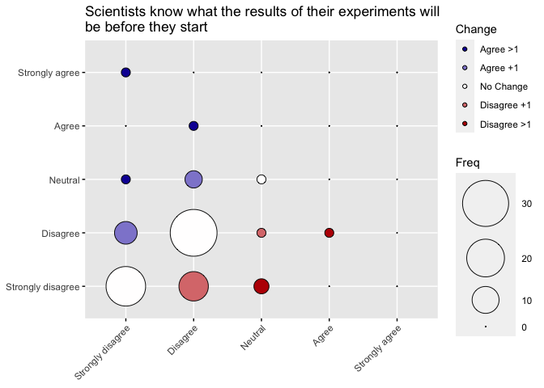<!-- -->

```r
Q11Clean %>%
  select(Q11_17_pre, Q13_17_post) %>%
  na.omit() %>%
  cronbach.alpha(CI = TRUE)
```

```
## 
## Cronbach's alpha for the '.' data-set
## 
## Items: 2
## Sample units: 85
## alpha: 0.351
## 
## Bootstrap 95% CI based on 1000 samples
##   2.5%  97.5% 
## -0.030  0.647
```

```r
Q11Clean %>%
  transmute(Q11_17_pre = as.numeric(Q11_17_pre), Q13_17_post = as.numeric(Q13_17_post) ) %>%
  na.omit() %>%
  mutate(Difference = Q13_17_post - Q11_17_pre) %>%
  my_skim()
```


Table: Data summary

|                         |           |
|:------------------------|:----------|
|Name                     |Piped data |
|Number of rows           |85         |
|Number of columns        |3          |
|_______________________  |           |
|Column type frequency:   |           |
|numeric                  |3          |
|________________________ |           |
|Group variables          |None       |


**Variable type: numeric**

|skim_variable | n_missing| complete_rate|  mean|   sd| p0| p25| p50| p75| p100|hist  | median| iqr|
|:-------------|---------:|-------------:|-----:|----:|--:|---:|---:|---:|----:|:-----|------:|---:|
|Q11_17_pre    |         0|             1|  1.72| 0.63|  1|   1|   2|   2|    4|▅▇▁▁▁ |      2|   1|
|Q13_17_post   |         0|             1|  1.69| 0.76|  1|   1|   2|   2|    5|▇▇▁▁▁ |      2|   1|
|Difference    |         0|             1| -0.02| 0.87| -2|   0|   0|   0|    4|▂▇▂▁▁ |      0|   0|

The conclusion is that the internal consistency of the survey result for question 17 is Unacceptable (alpha: 0.351), supporting the alternative hypothesis that the students experiences influenced their responses to this question.

Student perception changed by an average -0.02352941 +/- 0.8725506 on the survey.


```r
Q11Clean %>%
  select(Q11_18_pre, Q13_18_post) %>%
  table() %>%
  as.data.frame() %>%
  add_column(Change = colorcolumn) %>%
  ggballoonplot(x = "Q11_18_pre", y = "Q13_18_post", size = "Freq", 
                ggtheme = theme_gray(), fill = "Change", size.range = c(0, 20), 
                title = paste(strwrap(Q11TextClean$Question[18], 60), collapse = "\n")) + 
  fill_palette(c( "#1207A3","#8F88D2","#FFFEFE", "#DB7A7B","#BB0103" ))
```

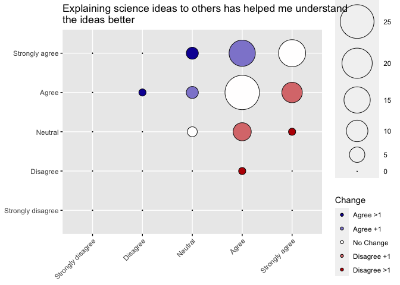<!-- -->

```r
Q11Clean %>%
  select(Q11_18_pre, Q13_18_post) %>%
  na.omit() %>%
  cronbach.alpha(CI = TRUE)
```

```
## 
## Cronbach's alpha for the '.' data-set
## 
## Items: 2
## Sample units: 84
## alpha: 0.405
## 
## Bootstrap 95% CI based on 1000 samples
##  2.5% 97.5% 
## 0.136 0.609
```

```r
Q11Clean %>%
  transmute(Q11_18_pre = as.numeric(Q11_18_pre), Q13_18_post = as.numeric(Q13_18_post) ) %>%
  na.omit() %>%
  mutate(Difference = Q13_18_post - Q11_18_pre) %>%
  my_skim()
```


Table: Data summary

|                         |           |
|:------------------------|:----------|
|Name                     |Piped data |
|Number of rows           |84         |
|Number of columns        |3          |
|_______________________  |           |
|Column type frequency:   |           |
|numeric                  |3          |
|________________________ |           |
|Group variables          |None       |


**Variable type: numeric**

|skim_variable | n_missing| complete_rate| mean|   sd| p0| p25| p50| p75| p100|hist  | median| iqr|
|:-------------|---------:|-------------:|----:|----:|--:|---:|---:|---:|----:|:-----|------:|---:|
|Q11_18_pre    |         0|             1| 4.19| 0.65|  2|   4|   4|   5|    5|▁▁▁▇▅ |      4|   1|
|Q13_18_post   |         0|             1| 4.26| 0.71|  2|   4|   4|   5|    5|▁▂▁▇▇ |      4|   1|
|Difference    |         0|             1| 0.07| 0.83| -2|   0|   0|   1|    2|▁▃▇▃▁ |      0|   1|

The conclusion is that the internal consistency of the survey result for question 18 is Unacceptable (alpha: 0.405), supporting the alternative hypothesis that the students experiences influenced their responses to this question.

Student perception changed by an average 0.07142857 +/- 0.8328455 on the survey.


```r
Q11Clean %>%
  select(Q11_19_pre, Q13_19_post) %>%
  table() %>%
  as.data.frame() %>%
  add_column(Change = colorcolumn) %>%
  ggballoonplot(x = "Q11_19_pre", y = "Q13_19_post", size = "Freq", 
                ggtheme = theme_gray(), fill = "Change", size.range = c(0, 20), 
                title = paste(strwrap(Q11TextClean$Question[19], 60), collapse = "\n")) + 
  fill_palette(c( "#1207A3","#8F88D2","#FFFEFE", "#DB7A7B","#BB0103" ))
```

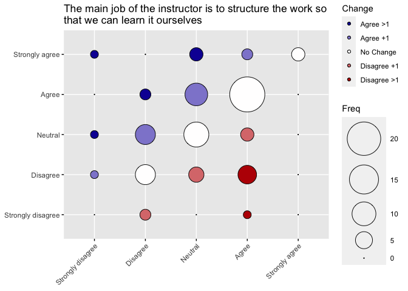<!-- -->

```r
Q11Clean %>%
  select(Q11_19_pre, Q13_19_post) %>%
  na.omit() %>%
  cronbach.alpha(CI = TRUE)
```

```
## 
## Cronbach's alpha for the '.' data-set
## 
## Items: 2
## Sample units: 85
## alpha: 0.562
## 
## Bootstrap 95% CI based on 1000 samples
##  2.5% 97.5% 
## 0.282 0.751
```

```r
Q11Clean %>%
  transmute(Q11_19_pre = as.numeric(Q11_19_pre), Q13_19_post = as.numeric(Q13_19_post) ) %>%
  na.omit() %>%
  mutate(Difference = Q13_19_post - Q11_19_pre) %>%
  my_skim()
```


Table: Data summary

|                         |           |
|:------------------------|:----------|
|Name                     |Piped data |
|Number of rows           |85         |
|Number of columns        |3          |
|_______________________  |           |
|Column type frequency:   |           |
|numeric                  |3          |
|________________________ |           |
|Group variables          |None       |


**Variable type: numeric**

|skim_variable | n_missing| complete_rate| mean|   sd| p0| p25| p50| p75| p100|hist  | median| iqr|
|:-------------|---------:|-------------:|----:|----:|--:|---:|---:|---:|----:|:-----|------:|---:|
|Q11_19_pre    |         0|             1| 3.19| 0.93|  1|   3|   3|   4|    5|▁▅▆▇▁ |      3|   1|
|Q13_19_post   |         0|             1| 3.32| 1.04|  1|   3|   3|   4|    5|▁▅▅▇▂ |      3|   1|
|Difference    |         0|             1| 0.13| 1.09| -3|   0|   0|   1|    4|▁▁▇▁▁ |      0|   1|

The conclusion is that the internal consistency of the survey result for question 19 is Poor (alpha: 0.562), providing inconclusive support that the students experiences influenced their responses to this question.

Student perception changed by an average 0.1294118 +/- 1.0887765 on the survey.


```r
Q11Clean %>%
  select(Q11_20_pre, Q13_20_post) %>%
  table() %>%
  as.data.frame() %>%
  add_column(Change = colorcolumn) %>%
  ggballoonplot(x = "Q11_20_pre", y = "Q13_20_post", size = "Freq", 
                ggtheme = theme_gray(), fill = "Change", size.range = c(0, 20), 
                title = paste(strwrap(Q11TextClean$Question[20], 60), collapse = "\n")) + 
  fill_palette(c( "#1207A3","#8F88D2","#FFFEFE", "#DB7A7B","#BB0103" ))
```

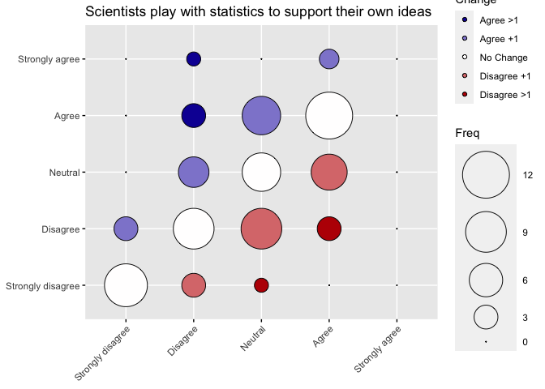<!-- -->

```r
Q11Clean %>%
  select(Q11_20_pre, Q13_20_post) %>%
  na.omit() %>%
  cronbach.alpha(CI = TRUE)
```

```
## 
## Cronbach's alpha for the '.' data-set
## 
## Items: 2
## Sample units: 84
## alpha: 0.772
## 
## Bootstrap 95% CI based on 1000 samples
##  2.5% 97.5% 
## 0.652 0.862
```

```r
Q11Clean %>%
  transmute(Q11_20_pre = as.numeric(Q11_20_pre), Q13_20_post = as.numeric(Q13_20_post) ) %>%
  na.omit() %>%
  mutate(Difference = Q13_20_post - Q11_20_pre) %>%
  my_skim()
```


Table: Data summary

|                         |           |
|:------------------------|:----------|
|Name                     |Piped data |
|Number of rows           |84         |
|Number of columns        |3          |
|_______________________  |           |
|Column type frequency:   |           |
|numeric                  |3          |
|________________________ |           |
|Group variables          |None       |


**Variable type: numeric**

|skim_variable | n_missing| complete_rate| mean|   sd| p0| p25| p50| p75| p100|hist  | median| iqr|
|:-------------|---------:|-------------:|----:|----:|--:|---:|---:|---:|----:|:-----|------:|---:|
|Q11_20_pre    |         0|             1| 2.73| 1.05|  1|   2|   3|   4|    4|▃▆▁▇▇ |      3|   2|
|Q13_20_post   |         0|             1| 2.73| 1.14|  1|   2|   3|   4|    5|▅▇▇▇▁ |      3|   2|
|Difference    |         0|             1| 0.00| 0.94| -2|  -1|   0|   1|    3|▅▇▃▁▁ |      0|   2|

The conclusion is that the internal consistency of the survey result for question 20 is Acceptable (alpha: 0.772), not supporting the alternative hypothesis that the students experiences influenced their responses to this question.


```r
Q11Clean %>%
  select(Q11_21_pre, Q13_21_post) %>%
  table() %>%
  as.data.frame() %>%
  add_column(Change = colorcolumn) %>%
  ggballoonplot(x = "Q11_21_pre", y = "Q13_21_post", size = "Freq", 
                ggtheme = theme_gray(), fill = "Change", size.range = c(0, 20), 
                title = paste(strwrap(Q11TextClean$Question[21], 60), collapse = "\n")) + 
  fill_palette(c( "#1207A3","#8F88D2","#FFFEFE", "#DB7A7B","#BB0103" ))
```

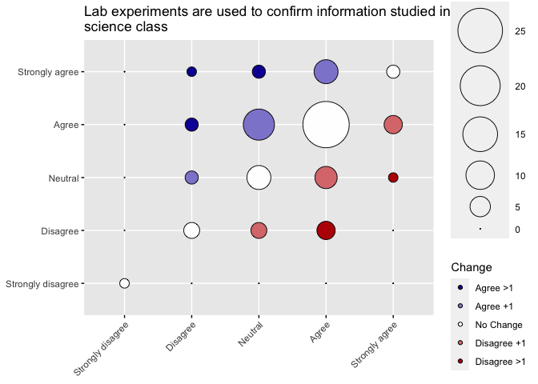<!-- -->

```r
Q11Clean %>%
  select(Q11_21_pre, Q13_21_post) %>%
  na.omit() %>%
  cronbach.alpha(CI = TRUE)
```

```
## 
## Cronbach's alpha for the '.' data-set
## 
## Items: 2
## Sample units: 84
## alpha: 0.546
## 
## Bootstrap 95% CI based on 1000 samples
##  2.5% 97.5% 
## 0.242 0.739
```

```r
Q11Clean %>%
  transmute(Q11_21_pre = as.numeric(Q11_21_pre), Q13_21_post = as.numeric(Q13_21_post) ) %>%
  na.omit() %>%
  mutate(Difference = Q13_21_post - Q11_21_pre) %>%
  my_skim()
```


Table: Data summary

|                         |           |
|:------------------------|:----------|
|Name                     |Piped data |
|Number of rows           |84         |
|Number of columns        |3          |
|_______________________  |           |
|Column type frequency:   |           |
|numeric                  |3          |
|________________________ |           |
|Group variables          |None       |


**Variable type: numeric**

|skim_variable | n_missing| complete_rate| mean|   sd| p0| p25| p50| p75| p100|hist  | median| iqr|
|:-------------|---------:|-------------:|----:|----:|--:|---:|---:|---:|----:|:-----|------:|---:|
|Q11_21_pre    |         0|             1| 3.57| 0.83|  1|   3|   4|   4|    5|▁▂▅▇▁ |      4|   1|
|Q13_21_post   |         0|             1| 3.68| 0.91|  1|   3|   4|   4|    5|▁▂▃▇▂ |      4|   1|
|Difference    |         0|             1| 0.11| 0.97| -2|   0|   0|   1|    3|▃▇▅▁▁ |      0|   1|

The conclusion is that the internal consistency of the survey result for question 21 is Poor (alpha: 0.546), providing inconclusive support that the students experiences influenced their responses to this question.

Student perception changed by an average 0.1071429 +/- 0.9696336 on the survey.


```r
Q11Clean %>%
  select(Q11_22_pre, Q13_22_post) %>%
  table() %>%
  as.data.frame() %>%
  add_column(Change = colorcolumn) %>%
  ggballoonplot(x = "Q11_22_pre", y = "Q13_22_post", size = "Freq", 
                ggtheme = theme_gray(), fill = "Change", size.range = c(0, 20), 
                title = paste(strwrap(Q11TextClean$Question[22], 60), collapse = "\n")) + 
  fill_palette(c( "#1207A3","#8F88D2","#FFFEFE", "#DB7A7B","#BB0103" ))
```

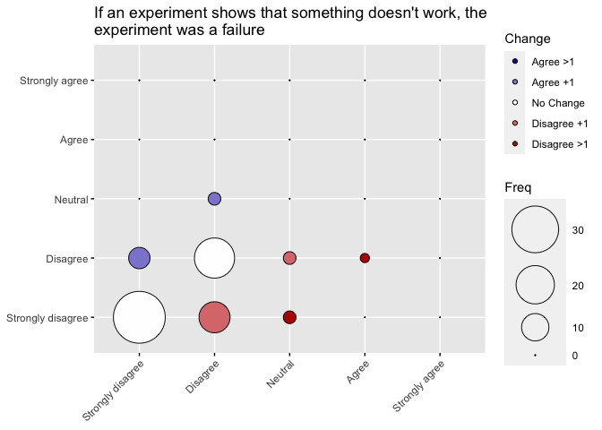<!-- -->

```r
Q11Clean %>%
  select(Q11_22_pre, Q13_22_post) %>%
  na.omit() %>%
  cronbach.alpha(CI = TRUE)
```

```
## 
## Cronbach's alpha for the '.' data-set
## 
## Items: 2
## Sample units: 85
## alpha: 0.616
## 
## Bootstrap 95% CI based on 1000 samples
##  2.5% 97.5% 
## 0.431 0.757
```

```r
Q11Clean %>%
  transmute(Q11_22_pre = as.numeric(Q11_22_pre), Q13_22_post = as.numeric(Q13_22_post) ) %>%
  na.omit() %>%
  mutate(Difference = Q13_22_post - Q11_22_pre) %>%
  my_skim()
```


Table: Data summary

|                         |           |
|:------------------------|:----------|
|Name                     |Piped data |
|Number of rows           |85         |
|Number of columns        |3          |
|_______________________  |           |
|Column type frequency:   |           |
|numeric                  |3          |
|________________________ |           |
|Group variables          |None       |


**Variable type: numeric**

|skim_variable | n_missing| complete_rate|  mean|   sd| p0| p25| p50| p75| p100|hist  | median| iqr|
|:-------------|---------:|-------------:|-----:|----:|--:|---:|---:|---:|----:|:-----|------:|---:|
|Q11_22_pre    |         0|             1|  1.56| 0.64|  1|   1|   1|   2|    4|▇▇▁▁▁ |      1|   1|
|Q13_22_post   |         0|             1|  1.41| 0.54|  1|   1|   1|   2|    3|▇▁▅▁▁ |      1|   1|
|Difference    |         0|             1| -0.15| 0.63| -2|   0|   0|   0|    1|▁▂▁▇▁ |      0|   0|

The conclusion is that the internal consistency of the survey result for question 22 is Questionable (alpha: 0.616), providing inconclusive support that the students experiences influenced their responses to this question.

Student perception changed by an average -0.1529412 +/- 0.6268949 on the survey.

## Combined Figure

To show some of these figures together, I will make a facet plot so that they are all on the same scale. 

We want to combine 1, 2, 9, 10, 17, and 18.

### Final Figure 1


```r
pre_q <- Q11Clean %>%
  select(Q01=Q11_1_pre, 
         Q02=Q11_2_pre, 
         Q09=Q11_9_pre, 
         Q10=Q11_10_pre, 
         Q17=Q11_17_pre, 
         Q18=Q11_18_pre)

pre_q_long <- pre_q %>% 
    pivot_longer(cols= `Q01`:`Q18`,
                 names_to = c("Question"), 
               values_to = "Pre")

post_q <- Q11Clean %>%
  select(Q01=Q13_1_post, 
         Q02=Q13_2_post, 
         Q09=Q13_9_post, 
         Q10=Q13_10_post, 
         Q17=Q13_17_post, 
         Q18=Q13_18_post)

post_q_long <- post_q %>% 
    pivot_longer(cols= `Q01`:`Q18`,
                 names_to = c("Question"), 
               values_to = "Post")
combined_q_long <- pre_q_long %>%
  cbind(select(post_q_long, "Post")) %>%
  na.omit()

combined_q_long %>%
  table() %>%
  as.data.frame() %>%
  add_column(Change = rep(colorcolumn, each = 6)) %>%
  ggballoonplot(x = "Pre", y = "Post", size = "Freq", 
                ggtheme = theme_gray(), facet.by = "Question",
                fill = "Change", 
                size.range = c(0, 6)) + 
  fill_palette(c("#1207A3","#8F88D2","#FFFEFE", "#DB7A7B","#BB0103" )) +
  scale_x_discrete(guide = guide_axis(angle=45))
```

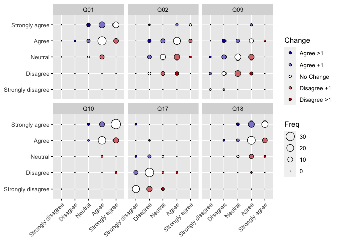<!-- -->

