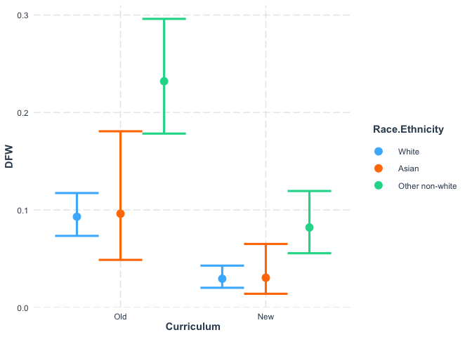
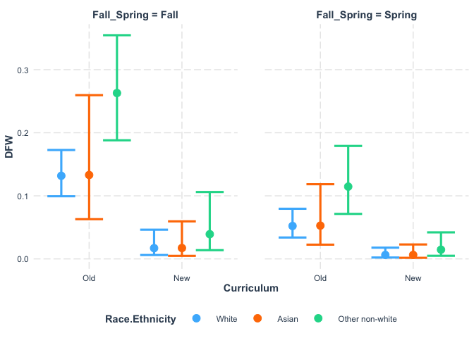
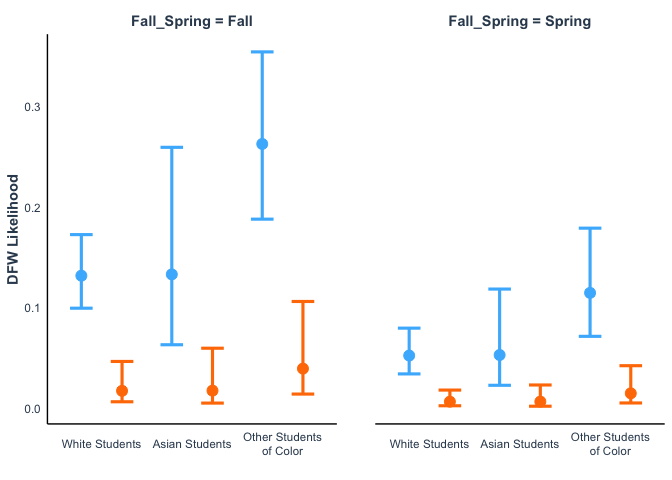
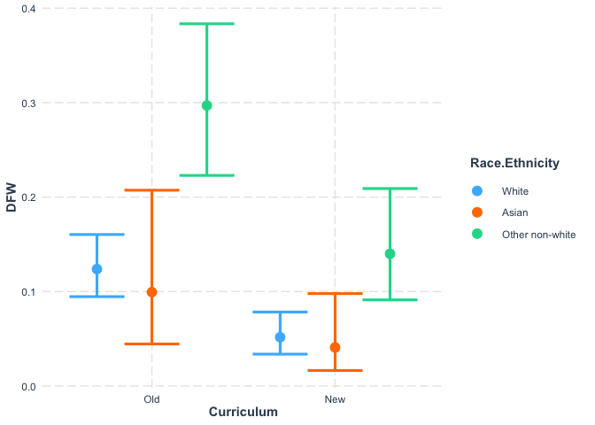
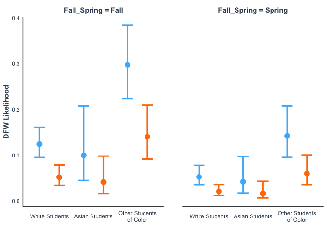

IMPORTANT NOTE

This Rmd uses the deidentified results and is safe to share.


We wish to determine if the new core classes (CURE Lab and BIO Seminar) are helping students to succeed academically.

## Loading Results

I asked the registrar to help me answer the following questions:
1. What was the DFW rate for first-year students in BIOL 205 and 206 from SP 2017 to FA 2019?
2. What was the DFW rate for all students in BIOL 201 and 202 from FA 2021 to SP 2024?

They sent us the files located in the "Grade Outcomes" folder.
I have removed any identifying information for the students and instructors.

Note that the analysis 205 and 206 only includes first-year students in these Biology classes, even though there are other students in these classes.
This is to make it more comparable to 201 and 202 which are not taken by nearly as broad a spectrum of students.

Importing data for 205 and 206.

Note that for this analysis, we have separated non-white students into Asian students and Other non-white students.

Prior to transformation, the Ethnicity data looked like:
                 Asian Black/African American        Hispanic/Latino         Multiple Races       U.S. Nonresident                  White 
                    67                     38                     71                     51                     27                    606
                    
To be consistent, we will remove the U.S. Nonresident students and combine the Black/African American, Hispanic/Latino, and Multiple Races students into the non-white category.                    


```
## Warning: There was 1 warning in `mutate()`.
## ℹ In argument: `across(Grade, str_replace, "D|F|W", "DFW")`.
## Caused by warning:
## ! The `...` argument of `across()` is deprecated as of dplyr 1.1.0.
## Supply arguments directly to `.fns` through an anonymous function instead.
## 
##   # Previously
##   across(a:b, mean, na.rm = TRUE)
## 
##   # Now
##   across(a:b, \(x) mean(x, na.rm = TRUE))
```

```
## [1] "Semester"                   "Course"                    
## [3] "Gender"                     "First-Generation Indicator"
## [5] "Grade"                      "Race.Ethnicity"            
## [7] "Curriculum"
```

```
## BIOL205 BIOL206 
##     454     379
```

```
##  DFW Pass 
##  100  733
```

```
##   Fall Term 2017-2018   Fall Term 2018-2019   Fall Term 2019-2020 
##                   147                   155                   152 
## Spring Term 2016-2017 Spring Term 2017-2018 Spring Term 2018-2019 
##                   115                   121                   143
```

```
## Female   Male 
##    614    219
```

```
##           Asian Other non-white           White 
##              67             160             606
```

Importing data from 201 and 202.
The spreadsheets have a very awkward format and were checked carefully. 
Before I imported the data, I consolidated it within excel to make the three years have a consistent format.


Converting Totals into Passes by subtracting each D, F, or W.


```
##  [1] "Course"                "Semester"              "D_Male_White"         
##  [4] "F_Female_White"        "W_Female_White"        "W_Male_White"         
##  [7] "Female_Total_White"    "Male_Total_White"      "D_Male_nonWhite"      
## [10] "F_Female_nonWhite"     "W_Female_nonWhite"     "W_Male_nonWhite"      
## [13] "Female_Total_nonWhite" "Male_Total_nonWhite"   "D_Male_Asian"         
## [16] "F_Female_Asian"        "W_Female_Asian"        "W_Male_Asian"         
## [19] "Female_Total_Asian"    "Male_Total_Asian"
```

```
##  [1] "Course"                "Semester"              "D_Female_White"       
##  [4] "F_Female_White"        "W_Female_White"        "W_Male_White"         
##  [7] "Female_Total_White"    "Male_Total_White"      "D_Female_nonWhite"    
## [10] "F_Female_nonWhite"     "W_Female_nonWhite"     "W_Male_nonWhite"      
## [13] "Female_Total_nonWhite" "Male_Total_nonWhite"   "D_Female_Asian"       
## [16] "F_Female_Asian"        "W_Female_Asian"        "W_Male_Asian"         
## [19] "Female_Total_Asian"    "Male_Total_Asian"
```

```
##  [1] "Course"                "Semester"              "D_Female_White"       
##  [4] "D_Male_White"          "F_Female_White"        "F_Male_White"         
##  [7] "W_Female_White"        "Female_Total_White"    "Male_Total_White"     
## [10] "D_Female_nonWhite"     "D_Male_nonWhite"       "F_Female_nonWhite"    
## [13] "F_Male_nonWhite"       "W_Female_nonWhite"     "Female_Total_nonWhite"
## [16] "Male_Total_nonWhite"   "D_Female_Asian"        "D_Male_Asian"         
## [19] "F_Female_Asian"        "F_Male_Asian"          "W_Female_Asian"       
## [22] "Female_Total_Asian"    "Male_Total_Asian"
```

Now pivoting the table and splitting the categories


``` r
names(DFW_21_22)
```

```
##  [1] "Course"               "Semester"             "D_Male_White"        
##  [4] "F_Female_White"       "W_Female_White"       "W_Male_White"        
##  [7] "D_Male_nonWhite"      "F_Female_nonWhite"    "W_Female_nonWhite"   
## [10] "W_Male_nonWhite"      "D_Male_Asian"         "F_Female_Asian"      
## [13] "W_Female_Asian"       "W_Male_Asian"         "Pass_Female_White"   
## [16] "Pass_Male_White"      "Pass_Female_nonWhite" "Pass_Male_nonWhite"  
## [19] "Pass_Female_Asian"    "Pass_Male_Asian"
```

``` r
DFW_21_22_long <- DFW_21_22 %>%
  pivot_longer(cols = D_Male_White:Pass_Male_Asian, 
               names_to = "Group", values_to = "Count") %>%
  separate_wider_delim(Group, delim = "_", names = c("Grade", "Gender", "Race.Ethnicity")) %>%
  mutate(across(Grade, str_replace, 'D|F|W', 'DFW')) %>%
  uncount(weights = Count) 
summary(as.factor(DFW_21_22_long$Grade))
```

```
##  DFW Pass 
##    9  284
```

``` r
names(DFW_22_23)
```

```
##  [1] "Course"               "Semester"             "D_Female_White"      
##  [4] "F_Female_White"       "W_Female_White"       "W_Male_White"        
##  [7] "D_Female_nonWhite"    "F_Female_nonWhite"    "W_Female_nonWhite"   
## [10] "W_Male_nonWhite"      "D_Female_Asian"       "F_Female_Asian"      
## [13] "W_Female_Asian"       "W_Male_Asian"         "Pass_Female_White"   
## [16] "Pass_Male_White"      "Pass_Female_nonWhite" "Pass_Male_nonWhite"  
## [19] "Pass_Female_Asian"    "Pass_Male_Asian"
```

``` r
DFW_22_23_long <- DFW_22_23 %>%
  pivot_longer(cols = D_Female_White:Pass_Male_Asian, 
               names_to = "Group", values_to = "Count") %>%
  separate_wider_delim(Group, delim = "_", names = c("Grade", "Gender", "Race.Ethnicity")) %>%
  mutate(across(Grade, str_replace, 'D|F|W', 'DFW')) %>%
  uncount(weights = Count) 
summary(as.factor(DFW_22_23_long$Grade))
```

```
##  DFW Pass 
##   14  258
```

``` r
names(DFW_23_24)
```

```
##  [1] "Course"               "Semester"             "D_Female_White"      
##  [4] "D_Male_White"         "F_Female_White"       "F_Male_White"        
##  [7] "W_Female_White"       "D_Female_nonWhite"    "D_Male_nonWhite"     
## [10] "F_Female_nonWhite"    "F_Male_nonWhite"      "W_Female_nonWhite"   
## [13] "D_Female_Asian"       "D_Male_Asian"         "F_Female_Asian"      
## [16] "F_Male_Asian"         "W_Female_Asian"       "Pass_Female_White"   
## [19] "Pass_Male_White"      "Pass_Female_nonWhite" "Pass_Male_nonWhite"  
## [22] "Pass_Female_Asian"    "Pass_Male_Asian"
```

``` r
DFW_23_24_long <- DFW_23_24 %>%
  pivot_longer(cols = D_Female_White:Pass_Male_Asian, 
               names_to = "Group", values_to = "Count") %>%
  separate_wider_delim(Group, delim = "_", names = c("Grade", "Gender", "Race.Ethnicity")) %>%
  mutate(across(Grade, str_replace, 'D|F|W', 'DFW')) %>%
  uncount(weights = Count) 
summary(as.factor(DFW_23_24_long$Grade))
```

```
##  DFW Pass 
##   10  241
```

``` r
DFW_201_202 <- DFW_21_22_long %>%
  add_row(DFW_22_23_long) %>%
  add_row(DFW_23_24_long) %>%
  mutate(Race.Ethnicity = case_when(
    Race.Ethnicity == "nonWhite" ~ "Other non-white",
    TRUE ~ Race.Ethnicity
  )) %>%
  mutate(Curriculum = "New")
```

Combining the two datasets


``` r
All_DFW <- BIOL205_206 %>%
  select(names(DFW_201_202)) %>%
  add_row(DFW_201_202) %>%
  mutate_if(is.character, as.factor) %>%
  mutate(Curriculum = fct_relevel(Curriculum, c("Old", "New"))) %>%
  mutate(`Race.Ethnicity` = fct_relevel(`Race.Ethnicity`, c("White", "Asian", "Other non-white")))

Only202_DFW <- All_DFW %>%
  filter(Course != "BIOL201")

summary(All_DFW)
```

```
##      Course                   Semester    Grade         Gender    
##  BIOL201:519   Fall Term 2018-2019:155   DFW : 133   Female:1179  
##  BIOL202:297   Fall Term 2019-2020:152   Pass:1516   Male  : 470  
##  BIOL205:454   Fall 2021          :147                            
##  BIOL206:379   Fall Term 2017-2018:147                            
##                Spring 2022        :146                            
##                Fall 2022          :143                            
##                (Other)            :759                            
##          Race.Ethnicity Curriculum
##  White          :1202   Old:833   
##  Asian          : 118   New:816   
##  Other non-white: 329             
##                                   
##                                   
##                                   
## 
```

``` r
summary(Only202_DFW)
```

```
##      Course                     Semester    Grade         Gender   
##  BIOL201:  0   Fall Term 2018-2019  :155   DFW : 104   Female:823  
##  BIOL202:297   Fall Term 2019-2020  :152   Pass:1026   Male  :307  
##  BIOL205:454   Fall Term 2017-2018  :147                           
##  BIOL206:379   Spring Term 2018-2019:143                           
##                Spring Term 2017-2018:121                           
##                Spring Term 2016-2017:115                           
##                (Other)              :297                           
##          Race.Ethnicity Curriculum
##  White          :832    Old:833   
##  Asian          : 87    New:297   
##  Other non-white:211              
##                                   
##                                   
##                                   
## 
```

``` r
All_DFW %>%
  filter(Course == "BIOL202") |>
  group_by(`Race.Ethnicity`) %>%
  summarise(n = n())
```

```
## # A tibble: 3 × 2
##   Race.Ethnicity      n
##   <fct>           <int>
## 1 White             226
## 2 Asian              20
## 3 Other non-white    51
```

``` r
All_DFW %>%
  group_by(Curriculum, Grade) %>%
  summarise(n = n())
```

```
## `summarise()` has regrouped the output.
## ℹ Summaries were computed grouped by Curriculum and Grade.
## ℹ Output is grouped by Curriculum.
## ℹ Use `summarise(.groups = "drop_last")` to silence this message.
## ℹ Use `summarise(.by = c(Curriculum, Grade))` for per-operation grouping
##   (`?dplyr::dplyr_by`) instead.
```

```
## # A tibble: 4 × 3
## # Groups:   Curriculum [2]
##   Curriculum Grade     n
##   <fct>      <fct> <int>
## 1 Old        DFW     100
## 2 Old        Pass    733
## 3 New        DFW      33
## 4 New        Pass    783
```

``` r
Only202_DFW %>%
  group_by(Curriculum, Grade) %>%
  summarise(n = n())
```

```
## `summarise()` has regrouped the output.
## ℹ Summaries were computed grouped by Curriculum and Grade.
## ℹ Output is grouped by Curriculum.
## ℹ Use `summarise(.groups = "drop_last")` to silence this message.
## ℹ Use `summarise(.by = c(Curriculum, Grade))` for per-operation grouping
##   (`?dplyr::dplyr_by`) instead.
```

```
## # A tibble: 4 × 3
## # Groups:   Curriculum [2]
##   Curriculum Grade     n
##   <fct>      <fct> <int>
## 1 Old        DFW     100
## 2 Old        Pass    733
## 3 New        DFW       4
## 4 New        Pass    293
```

``` r
Only202_DFW %>%
  group_by(Course, Grade) %>%
  summarise(n = n())
```

```
## `summarise()` has regrouped the output.
## ℹ Summaries were computed grouped by Course and Grade.
## ℹ Output is grouped by Course.
## ℹ Use `summarise(.groups = "drop_last")` to silence this message.
## ℹ Use `summarise(.by = c(Course, Grade))` for per-operation grouping
##   (`?dplyr::dplyr_by`) instead.
```

```
## # A tibble: 6 × 3
## # Groups:   Course [3]
##   Course  Grade     n
##   <fct>   <fct> <int>
## 1 BIOL202 DFW       4
## 2 BIOL202 Pass    293
## 3 BIOL205 DFW      74
## 4 BIOL205 Pass    380
## 5 BIOL206 DFW      26
## 6 BIOL206 Pass    353
```

## Modeling results with a binomial glm

Note that originally a negative binomial glm was performed, but a binomial is more appropriate now that DFW grades have been aggregated.

### Both 201 and 202


```
## 
## Call:
## glm.nb(formula = DFW ~ Curriculum, data = All_DFW, init.theta = 1526.818198, 
##     link = log)
## 
## Coefficients:
##               Estimate Std. Error z value Pr(>|z|)    
## (Intercept)    -2.1199     0.1000  -21.20  < 2e-16 ***
## CurriculumNew  -1.0880     0.2008   -5.42 5.97e-08 ***
## ---
## Signif. codes:  0 '***' 0.001 '**' 0.01 '*' 0.05 '.' 0.1 ' ' 1
## 
## (Dispersion parameter for Negative Binomial(1526.818) family taken to be 1)
## 
##     Null deviance: 669.59  on 1648  degrees of freedom
## Residual deviance: 635.62  on 1647  degrees of freedom
## AIC: 907.7
## 
## Number of Fisher Scoring iterations: 1
## 
## 
##               Theta:  1527 
##           Std. Err.:  8892 
## Warning while fitting theta: iteration limit reached 
## 
##  2 x log-likelihood:  -901.703
```

```
## 
## Call:
## glm.nb(formula = DFW ~ Curriculum + Gender + Race.Ethnicity, 
##     data = All_DFW, init.theta = 1577.290506, link = log)
## 
## Coefficients:
##                               Estimate Std. Error z value Pr(>|z|)    
## (Intercept)                   -2.41154    0.13588 -17.747  < 2e-16 ***
## CurriculumNew                 -1.11130    0.20115  -5.525 3.30e-08 ***
## GenderMale                     0.10562    0.18980   0.557    0.578    
## Race.EthnicityAsian            0.02199    0.37303   0.059    0.953    
## Race.EthnicityOther non-white  0.93743    0.18217   5.146 2.66e-07 ***
## ---
## Signif. codes:  0 '***' 0.001 '**' 0.01 '*' 0.05 '.' 0.1 ' ' 1
## 
## (Dispersion parameter for Negative Binomial(1577.29) family taken to be 1)
## 
##     Null deviance: 669.60  on 1648  degrees of freedom
## Residual deviance: 610.32  on 1644  degrees of freedom
## AIC: 888.4
## 
## Number of Fisher Scoring iterations: 1
## 
## 
##               Theta:  1577 
##           Std. Err.:  8683 
## Warning while fitting theta: iteration limit reached 
## 
##  2 x log-likelihood:  -876.405
```

```
## 
## Call:
## glm(formula = DFW ~ Curriculum, family = "binomial", data = All_DFW)
## 
## Coefficients:
##               Estimate Std. Error z value Pr(>|z|)    
## (Intercept)    -1.9920     0.1066 -18.686  < 2e-16 ***
## CurriculumNew  -1.1746     0.2072  -5.668 1.44e-08 ***
## ---
## Signif. codes:  0 '***' 0.001 '**' 0.01 '*' 0.05 '.' 0.1 ' ' 1
## 
## (Dispersion parameter for binomial family taken to be 1)
## 
##     Null deviance: 924.65  on 1648  degrees of freedom
## Residual deviance: 887.83  on 1647  degrees of freedom
## AIC: 891.83
## 
## Number of Fisher Scoring iterations: 6
```

```
## 
## Call:
## glm(formula = DFW ~ Curriculum + Gender + Race.Ethnicity, family = "binomial", 
##     data = All_DFW)
## 
## Coefficients:
##                               Estimate Std. Error z value Pr(>|z|)    
## (Intercept)                    -2.3064     0.1422 -16.213  < 2e-16 ***
## CurriculumNew                  -1.2246     0.2099  -5.835 5.38e-09 ***
## GenderMale                      0.1194     0.2031   0.588    0.557    
## Race.EthnicityAsian             0.0214     0.3896   0.055    0.956    
## Race.EthnicityOther non-white   1.0751     0.1978   5.436 5.45e-08 ***
## ---
## Signif. codes:  0 '***' 0.001 '**' 0.01 '*' 0.05 '.' 0.1 ' ' 1
## 
## (Dispersion parameter for binomial family taken to be 1)
## 
##     Null deviance: 924.65  on 1648  degrees of freedom
## Residual deviance: 859.11  on 1644  degrees of freedom
## AIC: 869.11
## 
## Number of Fisher Scoring iterations: 6
```

```
## Analysis of Deviance Table (Type III tests)
## 
## Response: DFW
## Error estimate based on Pearson residuals 
## 
##                 Sum Sq   Df F values    Pr(>F)    
## Curriculum       39.08    1  40.5683 2.458e-10 ***
## Gender            0.34    1   0.3544    0.5517    
## Race.Ethnicity   28.20    2  14.6358 5.008e-07 ***
## Residuals      1583.62 1644                       
## ---
## Signif. codes:  0 '***' 0.001 '**' 0.01 '*' 0.05 '.' 0.1 ' ' 1
```


A very big effect of the new curriculum and a smaller but significant effect of Race.Ethnicity.

Removing gender from the model as it does not appear to be significant.


```
## 
## Call:
## glm(formula = DFW ~ Curriculum + Race.Ethnicity, family = "binomial", 
##     data = All_DFW)
## 
## Coefficients:
##                               Estimate Std. Error z value Pr(>|z|)    
## (Intercept)                   -2.27619    0.13190 -17.257  < 2e-16 ***
## CurriculumNew                 -1.21777    0.20946  -5.814 6.11e-09 ***
## Race.EthnicityAsian            0.03566    0.38874   0.092    0.927    
## Race.EthnicityOther non-white  1.07947    0.19762   5.462 4.70e-08 ***
## ---
## Signif. codes:  0 '***' 0.001 '**' 0.01 '*' 0.05 '.' 0.1 ' ' 1
## 
## (Dispersion parameter for binomial family taken to be 1)
## 
##     Null deviance: 924.65  on 1648  degrees of freedom
## Residual deviance: 859.45  on 1645  degrees of freedom
## AIC: 867.45
## 
## Number of Fisher Scoring iterations: 6
```

```
## Analysis of Deviance Table (Type III tests)
## 
## Response: DFW
## Error estimate based on Pearson residuals 
## 
##                 Sum Sq   Df F values    Pr(>F)    
## Curriculum       38.78    1   40.247 2.886e-10 ***
## Race.Ethnicity   28.38    2   14.724 4.591e-07 ***
## Residuals      1585.22 1645                       
## ---
## Signif. codes:  0 '***' 0.001 '**' 0.01 '*' 0.05 '.' 0.1 ' ' 1
```

```
##          1          2          3          4          5          6 
## 0.09311419 0.02948457 0.09616957 0.03052233 0.23205901 0.08207431
```

```
## 
## Call:  glm(formula = DFW ~ Curriculum + Race.Ethnicity, family = "binomial", 
##     data = All_DFW)
## 
## Coefficients:
##                   (Intercept)                  CurriculumNew  
##                      -2.27619                       -1.21777  
##           Race.EthnicityAsian  Race.EthnicityOther non-white  
##                       0.03566                        1.07947  
## 
## Degrees of Freedom: 1648 Total (i.e. Null);  1645 Residual
## Null Deviance:	    924.6 
## Residual Deviance: 859.4 	AIC: 867.4
```

```
## # Overdispersion test
## 
##  dispersion ratio = 1.005
##           p-value = 0.936
```

```
## No overdispersion detected.
```

```
## # Indices of model performance
## 
## AIC   |  AICc |   BIC | Tjur's R2 |  RMSE | Sigma | Log_loss | Score_log
## ------------------------------------------------------------------------
## 867.4 | 867.5 | 889.1 |     0.042 | 0.267 |     1 |    0.261 |   -11.244
## 
## AIC   | Score_spherical |   PCP
## -------------------------------
## 867.4 |           0.014 | 0.858
```

```
## 
## Call:
## glm(formula = DFW ~ Curriculum + Race.Ethnicity, family = "binomial", 
##     data = All_DFW)
## 
## Coefficients:
##                               Estimate Std. Error z value Pr(>|z|)    
## (Intercept)                   -2.27619    0.13190 -17.257  < 2e-16 ***
## CurriculumNew                 -1.21777    0.20946  -5.814 6.11e-09 ***
## Race.EthnicityAsian            0.03566    0.38874   0.092    0.927    
## Race.EthnicityOther non-white  1.07947    0.19762   5.462 4.70e-08 ***
## ---
## Signif. codes:  0 '***' 0.001 '**' 0.01 '*' 0.05 '.' 0.1 ' ' 1
## 
## (Dispersion parameter for binomial family taken to be 1)
## 
##     Null deviance: 924.65  on 1648  degrees of freedom
## Residual deviance: 859.45  on 1645  degrees of freedom
## AIC: 867.45
## 
## Number of Fisher Scoring iterations: 6
```


```
## [1] 0.1077545
```

```
## [1] 0.1227139
```

```
## [1] 0.09461871
```


```
## [1] 3.387188
```

```
## [1] 2.745601
```

```
## [1] 4.178699
```

The model indicates that students under the old curriculum were 3.4-fold (2.7 - 4.2) more likely to earn a DFW in the first two Biology courses (p = 6.11e-9). 


```
## [1] 2.94468
```

```
## [1] 3.59664
```

```
## [1] 2.4109
```

Students of color (excluding Asian students) were 2.9-fold (2.4 - 3.6) more likely to earn a DFW than white students in both curricula (p = 4.70e-08)


```
## Warning: Curriculum and Race.Ethnicity are not included in an interaction with one
## another in the model.
```

<!-- -->

### Only 201 and 202 by Semester

We want to see how much of the difference between 201 and 202 can be explained by the semester that they are more 
likely to be offered. 


```
## 
## Call:
## glm(formula = DFW ~ FallSpring * Course, family = "binomial", 
##     data = Only201202_DFW_Semester)
## 
## Coefficients:
##                                Estimate Std. Error z value Pr(>|z|)    
## (Intercept)                     -2.6254     0.2260 -11.618   <2e-16 ***
## FallSpringSpring                -0.5935     0.4255  -1.395    0.163    
## CourseBIOL202                   -0.9765     0.6273  -1.557    0.120    
## FallSpringSpring:CourseBIOL202  -1.0141     1.2361  -0.820    0.412    
## ---
## Signif. codes:  0 '***' 0.001 '**' 0.01 '*' 0.05 '.' 0.1 ' ' 1
## 
## (Dispersion parameter for binomial family taken to be 1)
## 
##     Null deviance: 276.37  on 815  degrees of freedom
## Residual deviance: 261.68  on 812  degrees of freedom
## AIC: 269.68
## 
## Number of Fisher Scoring iterations: 7
```

```
## Start:  AIC=269.68
## DFW ~ FallSpring * Course
## 
##                     Df Deviance    AIC
## - FallSpring:Course  1   262.43 268.43
## <none>                   261.69 269.69
## 
## Step:  AIC=268.43
## DFW ~ FallSpring + Course
## 
##              Df Deviance    AIC
## <none>            262.43 268.43
## - FallSpring  1   266.06 270.06
## - Course      1   270.18 274.18
```

```
## 
## Call:
## glm(formula = DFW ~ FallSpring + Course, family = "binomial", 
##     data = Only201202_DFW_Semester)
## 
## Coefficients:
##                  Estimate Std. Error z value Pr(>|z|)    
## (Intercept)       -2.5870     0.2177 -11.882   <2e-16 ***
## FallSpringSpring  -0.7359     0.4027  -1.827   0.0677 .  
## CourseBIOL202     -1.3153     0.5443  -2.416   0.0157 *  
## ---
## Signif. codes:  0 '***' 0.001 '**' 0.01 '*' 0.05 '.' 0.1 ' ' 1
## 
## (Dispersion parameter for binomial family taken to be 1)
## 
##     Null deviance: 276.37  on 815  degrees of freedom
## Residual deviance: 262.43  on 813  degrees of freedom
## AIC: 268.43
## 
## Number of Fisher Scoring iterations: 7
```

This demonstrates that the DFW rates are signficantly lower in BIOL202 than BIOL201, 
after accounting for the effect of Fall versus Spring.

That is not surprising given the different objectives of these courses.


### Only 202

Adding Fall vs Spring to the full model.


```
## 
## Call:
## glm(formula = DFW ~ Curriculum, family = "binomial", data = Only202_DFW)
## 
## Coefficients:
##               Estimate Std. Error z value Pr(>|z|)    
## (Intercept)    -1.9920     0.1066 -18.686  < 2e-16 ***
## CurriculumNew  -2.3019     0.5146  -4.473  7.7e-06 ***
## ---
## Signif. codes:  0 '***' 0.001 '**' 0.01 '*' 0.05 '.' 0.1 ' ' 1
## 
## (Dispersion parameter for binomial family taken to be 1)
## 
##     Null deviance: 694.32  on 1129  degrees of freedom
## Residual deviance: 653.86  on 1128  degrees of freedom
## AIC: 657.86
## 
## Number of Fisher Scoring iterations: 7
```

```
## 
## Call:
## glm(formula = DFW ~ Fall_Spring + Curriculum + Gender + Race.Ethnicity, 
##     family = "binomial", data = Only202_DFW)
## 
## Coefficients:
##                               Estimate Std. Error z value Pr(>|z|)    
## (Intercept)                   -1.88565    0.16244 -11.608  < 2e-16 ***
## Fall_SpringSpring             -1.01378    0.23656  -4.286 1.82e-05 ***
## CurriculumNew                 -2.16878    0.51727  -4.193 2.76e-05 ***
## GenderMale                     0.18763    0.23506   0.798 0.424746    
## Race.EthnicityAsian            0.01147    0.42554   0.027 0.978489    
## Race.EthnicityOther non-white  0.85498    0.23672   3.612 0.000304 ***
## ---
## Signif. codes:  0 '***' 0.001 '**' 0.01 '*' 0.05 '.' 0.1 ' ' 1
## 
## (Dispersion parameter for binomial family taken to be 1)
## 
##     Null deviance: 694.32  on 1129  degrees of freedom
## Residual deviance: 620.43  on 1124  degrees of freedom
## AIC: 632.43
## 
## Number of Fisher Scoring iterations: 7
```

Fall_Spring is playing a smaller, but significant, role compared to Curriculum. 
We need to account for that.


```
## Start:  AIC=632.43
## DFW ~ Fall_Spring + Curriculum + Gender + Race.Ethnicity
## 
##                  Df Deviance    AIC
## - Gender          1   621.05 631.05
## <none>                620.43 632.43
## - Race.Ethnicity  2   632.92 640.92
## - Fall_Spring     1   640.83 650.83
## - Curriculum      1   653.74 663.74
## 
## Step:  AIC=631.05
## DFW ~ Fall_Spring + Curriculum + Race.Ethnicity
## 
##                  Df Deviance    AIC
## <none>                621.05 631.05
## - Race.Ethnicity  2   633.63 639.63
## - Fall_Spring     1   641.45 649.45
## - Curriculum      1   654.07 662.07
```

```
## 
## Call:
## glm(formula = DFW ~ Fall_Spring + Curriculum + Race.Ethnicity, 
##     family = "binomial", data = Only202_DFW)
## 
## Coefficients:
##                               Estimate Std. Error z value Pr(>|z|)    
## (Intercept)                   -1.83747    0.14946 -12.294  < 2e-16 ***
## Fall_SpringSpring             -1.01361    0.23651  -4.286 1.82e-05 ***
## CurriculumNew                 -2.15975    0.51712  -4.177 2.96e-05 ***
## Race.EthnicityAsian            0.04232    0.42337   0.100 0.920379    
## Race.EthnicityOther non-white  0.86017    0.23651   3.637 0.000276 ***
## ---
## Signif. codes:  0 '***' 0.001 '**' 0.01 '*' 0.05 '.' 0.1 ' ' 1
## 
## (Dispersion parameter for binomial family taken to be 1)
## 
##     Null deviance: 694.32  on 1129  degrees of freedom
## Residual deviance: 621.05  on 1125  degrees of freedom
## AIC: 631.05
## 
## Number of Fisher Scoring iterations: 7
```


```
## 
## Call:  glm(formula = DFW ~ Fall_Spring + Curriculum + Race.Ethnicity, 
##     family = "binomial", data = Only202_DFW)
## 
## Coefficients:
##                   (Intercept)              Fall_SpringSpring  
##                      -1.83747                       -1.01361  
##                 CurriculumNew            Race.EthnicityAsian  
##                      -2.15975                        0.04232  
## Race.EthnicityOther non-white  
##                       0.86017  
## 
## Degrees of Freedom: 1129 Total (i.e. Null);  1125 Residual
## Null Deviance:	    694.3 
## Residual Deviance: 621.1 	AIC: 631.1
```

```
## # Overdispersion test
## 
##  dispersion ratio = 0.998
##           p-value = 0.968
```

```
## No overdispersion detected.
```

```
## # Indices of model performance
## 
## AIC   |  AICc |   BIC | Tjur's R2 |  RMSE | Sigma | Log_loss | Score_log
## ------------------------------------------------------------------------
## 632.4 | 632.5 | 662.6 |     0.062 | 0.280 |     1 |    0.275 |   -10.149
## 
## AIC   | Score_spherical |   PCP
## -------------------------------
## 632.4 |           0.013 | 0.843
```

```
## 
## Call:
## glm(formula = DFW ~ Fall_Spring + Curriculum + Gender + Race.Ethnicity, 
##     family = "binomial", data = Only202_DFW)
## 
## Coefficients:
##                               Estimate Std. Error z value Pr(>|z|)    
## (Intercept)                   -1.88565    0.16244 -11.608  < 2e-16 ***
## Fall_SpringSpring             -1.01378    0.23656  -4.286 1.82e-05 ***
## CurriculumNew                 -2.16878    0.51727  -4.193 2.76e-05 ***
## GenderMale                     0.18763    0.23506   0.798 0.424746    
## Race.EthnicityAsian            0.01147    0.42554   0.027 0.978489    
## Race.EthnicityOther non-white  0.85498    0.23672   3.612 0.000304 ***
## ---
## Signif. codes:  0 '***' 0.001 '**' 0.01 '*' 0.05 '.' 0.1 ' ' 1
## 
## (Dispersion parameter for binomial family taken to be 1)
## 
##     Null deviance: 694.32  on 1129  degrees of freedom
## Residual deviance: 620.43  on 1124  degrees of freedom
## AIC: 632.43
## 
## Number of Fisher Scoring iterations: 7
```

```
## Analysis of Deviance Table (Type III tests)
## 
## Response: DFW
## Error estimate based on Pearson residuals 
## 
##                 Sum Sq   Df F values    Pr(>F)    
## Fall_Spring      20.40    1  20.7419 5.828e-06 ***
## Curriculum       33.31    1  33.8778 7.649e-09 ***
## Gender            0.63    1   0.6364  0.425182    
## Race.Ethnicity   12.50    2   6.3531  0.001805 ** 
## Residuals      1105.32 1124                       
## ---
## Signif. codes:  0 '***' 0.001 '**' 0.01 '*' 0.05 '.' 0.1 ' ' 1
```


Curriculum effect:


```
## [1] 8.758284
```

```
## [1] 5.222624
```

```
## [1] 14.68755
```

The model indicates that students in CURE Lab were 8.8-fold (5.2 - 14.7) less likely to earn a DFW than in first two Biology courses of the prior curriculum (p = 2.76e-05), after controlling for the effect of semester. 


```
## Warning: Curriculum and Race.Ethnicity and Fall_Spring are not included in an
## interaction with one another in the model.
```

<!-- -->

Power analysis to justify including the interaction.

$$\text{Adjusted } \alpha = \frac{0.05}{21} \approx 0.00238$$

Total of 12 dummy variables ($u = 12$)

Harmonic mean of groups:

$$n_h = \frac{6}{\frac{1}{878} + \frac{1}{76} + \frac{1}{225} + \frac{1}{324} + \frac{1}{42} + \frac{1}{104}} \approx 108.6$$

Effective sample size: 

$$75.62 \times 6 = \mathbf{454}$$

454 - 12 - 1 = 441


``` r
table(Only202_DFW$Gender, Only202_DFW$Race.Ethnicity)
```

```
##         
##          White Asian Other non-white
##   Female   614    54             155
##   Male     218    33              56
```

``` r
pwr.f2.test(u = 12, v = 441, f2 = 0.15, sig.level = 0.05/21)
```

```
## 
##      Multiple regression power calculation 
## 
##               u = 12
##               v = 441
##              f2 = 0.15
##       sig.level = 0.002380952
##           power = 0.9996791
```


``` r
model_interact_202 <- glm(DFW ~ Fall_Spring + Curriculum * Gender * `Race.Ethnicity`, 
                          data = Only202_DFW,  family = "binomial")
summary(model_interact_202)
```

```
## 
## Call:
## glm(formula = DFW ~ Fall_Spring + Curriculum * Gender * Race.Ethnicity, 
##     family = "binomial", data = Only202_DFW)
## 
## Coefficients:
##                                                          Estimate Std. Error
## (Intercept)                                              -1.84272    0.16876
## Fall_SpringSpring                                        -0.99115    0.23729
## CurriculumNew                                            -2.65282    1.01708
## GenderMale                                                0.10353    0.31005
## Race.EthnicityAsian                                      -1.42902    1.02727
## Race.EthnicityOther non-white                             0.82538    0.28439
## CurriculumNew:GenderMale                                -13.71314  771.31546
## CurriculumNew:Race.EthnicityAsian                         3.72951    1.77885
## CurriculumNew:Race.EthnicityOther non-white               0.55516    1.45672
## GenderMale:Race.EthnicityAsian                            1.80207    1.19589
## GenderMale:Race.EthnicityOther non-white                  0.05214    0.53536
## CurriculumNew:GenderMale:Race.EthnicityAsian             12.55228  771.31781
## CurriculumNew:GenderMale:Race.EthnicityOther non-white   -1.40059 2003.74909
##                                                        z value Pr(>|z|)    
## (Intercept)                                            -10.919  < 2e-16 ***
## Fall_SpringSpring                                       -4.177 2.95e-05 ***
## CurriculumNew                                           -2.608   0.0091 ** 
## GenderMale                                               0.334   0.7385    
## Race.EthnicityAsian                                     -1.391   0.1642    
## Race.EthnicityOther non-white                            2.902   0.0037 ** 
## CurriculumNew:GenderMale                                -0.018   0.9858    
## CurriculumNew:Race.EthnicityAsian                        2.097   0.0360 *  
## CurriculumNew:Race.EthnicityOther non-white              0.381   0.7031    
## GenderMale:Race.EthnicityAsian                           1.507   0.1318    
## GenderMale:Race.EthnicityOther non-white                 0.097   0.9224    
## CurriculumNew:GenderMale:Race.EthnicityAsian             0.016   0.9870    
## CurriculumNew:GenderMale:Race.EthnicityOther non-white  -0.001   0.9994    
## ---
## Signif. codes:  0 '***' 0.001 '**' 0.01 '*' 0.05 '.' 0.1 ' ' 1
## 
## (Dispersion parameter for binomial family taken to be 1)
## 
##     Null deviance: 694.32  on 1129  degrees of freedom
## Residual deviance: 609.36  on 1117  degrees of freedom
## AIC: 635.36
## 
## Number of Fisher Scoring iterations: 17
```

``` r
Anova(model_interact_202, type = "3", test.statistic = "F")
```

```
## Analysis of Deviance Table (Type III tests)
## 
## Response: DFW
## Error estimate based on Pearson residuals 
## 
##                                  Sum Sq   Df F values    Pr(>F)    
## Fall_Spring                       19.33    1  21.9243 3.184e-06 ***
## Curriculum                        16.74    1  18.9945 1.432e-05 ***
## Gender                             0.11    1   0.1249  0.723876    
## Race.Ethnicity                    12.21    2   6.9234  0.001027 ** 
## Curriculum:Gender                  0.87    1   0.9888  0.320259    
## Curriculum:Race.Ethnicity          3.97    2   2.2530  0.105556    
## Gender:Race.Ethnicity              2.84    2   1.6088  0.200590    
## Curriculum:Gender:Race.Ethnicity   0.41    2   0.2321  0.792884    
## Residuals                        984.65 1117                       
## ---
## Signif. codes:  0 '***' 0.001 '**' 0.01 '*' 0.05 '.' 0.1 ' ' 1
```

So the interactions do not meet our thresholds after all. 
Going to stick with the model without interactions for the manuscript.

#### Figure 8

**Now modified to separate Asian students**


```
## Warning: Race.Ethnicity and Curriculum and Fall_Spring are not included in an
## interaction with one another in the model.
```

<!-- -->

### Only 201


```
##      Course                   Semester    Grade         Gender    
##  BIOL201:519   Fall Term 2018-2019:155   DFW : 133   Female:1179  
##  BIOL202:297   Fall Term 2019-2020:152   Pass:1516   Male  : 470  
##  BIOL205:454   Fall 2021          :147                            
##  BIOL206:379   Fall Term 2017-2018:147                            
##                Spring 2022        :146                            
##                Fall 2022          :143                            
##                (Other)            :759                            
##          Race.Ethnicity Curriculum    DFW         
##  White          :1202   Old:833    Mode :logical  
##  Asian          : 118   New:816    FALSE:1516     
##  Other non-white: 329              TRUE :133      
##                                                   
##                                                   
##                                                   
## 
```

```
##      Course                     Semester    Grade         Gender   
##  BIOL201:519   Fall Term 2018-2019  :155   DFW : 129   Female:970  
##  BIOL202:  0   Fall Term 2019-2020  :152   Pass:1223   Male  :382  
##  BIOL205:454   Fall Term 2017-2018  :147                           
##  BIOL206:379   Spring Term 2018-2019:143                           
##                Spring Term 2017-2018:121                           
##                Spring Term 2016-2017:115                           
##                (Other)              :519                           
##          Race.Ethnicity Curriculum    DFW             Fall_Spring  
##  White          :976    Old:833    Mode :logical   Length   :1352  
##  Asian          : 98    New:519    FALSE:1223      N.unique :   2  
##  Other non-white:278               TRUE :129       N.blank  :   0  
##                                                    Min.nchar:   4  
##                                                    Max.nchar:   6  
##                                                                    
## 
```

```
## `summarise()` has regrouped the output.
## ℹ Summaries were computed grouped by Curriculum and Grade.
## ℹ Output is grouped by Curriculum.
## ℹ Use `summarise(.groups = "drop_last")` to silence this message.
## ℹ Use `summarise(.by = c(Curriculum, Grade))` for per-operation grouping
##   (`?dplyr::dplyr_by`) instead.
```

```
## # A tibble: 4 × 3
## # Groups:   Curriculum [2]
##   Curriculum Grade     n
##   <fct>      <fct> <int>
## 1 Old        DFW     100
## 2 Old        Pass    733
## 3 New        DFW      33
## 4 New        Pass    783
```

```
## `summarise()` has regrouped the output.
## ℹ Summaries were computed grouped by Curriculum and Grade.
## ℹ Output is grouped by Curriculum.
## ℹ Use `summarise(.groups = "drop_last")` to silence this message.
## ℹ Use `summarise(.by = c(Curriculum, Grade))` for per-operation grouping
##   (`?dplyr::dplyr_by`) instead.
```

```
## # A tibble: 4 × 3
## # Groups:   Curriculum [2]
##   Curriculum Grade     n
##   <fct>      <fct> <int>
## 1 Old        DFW     100
## 2 Old        Pass    733
## 3 New        DFW      29
## 4 New        Pass    490
```

```
## `summarise()` has regrouped the output.
## ℹ Summaries were computed grouped by Course and Grade.
## ℹ Output is grouped by Course.
## ℹ Use `summarise(.groups = "drop_last")` to silence this message.
## ℹ Use `summarise(.by = c(Course, Grade))` for per-operation grouping
##   (`?dplyr::dplyr_by`) instead.
```

```
## # A tibble: 6 × 3
## # Groups:   Course [3]
##   Course  Grade     n
##   <fct>   <fct> <int>
## 1 BIOL201 DFW      29
## 2 BIOL201 Pass    490
## 3 BIOL205 DFW      74
## 4 BIOL205 Pass    380
## 5 BIOL206 DFW      26
## 6 BIOL206 Pass    353
```

```
## 
## Call:
## glm(formula = DFW ~ Curriculum, family = "binomial", data = Only201_DFW)
## 
## Coefficients:
##               Estimate Std. Error z value Pr(>|z|)    
## (Intercept)    -1.9920     0.1066 -18.686  < 2e-16 ***
## CurriculumNew  -0.8351     0.2188  -3.816 0.000135 ***
## ---
## Signif. codes:  0 '***' 0.001 '**' 0.01 '*' 0.05 '.' 0.1 ' ' 1
## 
## (Dispersion parameter for binomial family taken to be 1)
## 
##     Null deviance: 851.46  on 1351  degrees of freedom
## Residual deviance: 835.11  on 1350  degrees of freedom
## AIC: 839.11
## 
## Number of Fisher Scoring iterations: 5
```

```
## 
## Call:
## glm(formula = DFW ~ Fall_Spring + Curriculum + Gender + Race.Ethnicity, 
##     family = "binomial", data = Only201_DFW)
## 
## Coefficients:
##                               Estimate Std. Error z value Pr(>|z|)    
## (Intercept)                    -1.9571     0.1538 -12.725  < 2e-16 ***
## Fall_SpringSpring              -0.9367     0.2122  -4.414 1.02e-05 ***
## CurriculumNew                  -0.9534     0.2236  -4.264 2.01e-05 ***
## GenderMale                      0.1523     0.2094   0.727    0.467    
## Race.EthnicityAsian            -0.2473     0.4444  -0.556    0.578    
## Race.EthnicityOther non-white   1.0954     0.2038   5.376 7.62e-08 ***
## ---
## Signif. codes:  0 '***' 0.001 '**' 0.01 '*' 0.05 '.' 0.1 ' ' 1
## 
## (Dispersion parameter for binomial family taken to be 1)
## 
##     Null deviance: 851.46  on 1351  degrees of freedom
## Residual deviance: 785.47  on 1346  degrees of freedom
## AIC: 797.47
## 
## Number of Fisher Scoring iterations: 5
```


```
## [1] 2.551547
```

```
## [1] 2.063699
```

```
## [1] 3.154721
```

The model indicates that students in BIOL 201 were 2.6-fold (2.1 - 3.1) less likely to earn a DFW than in first two Biology courses of the prior curriculum (p = 2.01e-05), after controlling for the effect of semester.


```
## [1] 1.742986
```

```
## [1] 2.082356
```

```
## [1] 1.458925
```


```
## Warning: Curriculum and Race.Ethnicity are not included in an interaction with one
## another in the model.
```

<!-- -->


#### Figure 8 201 version


```
## Warning: Race.Ethnicity and Curriculum and Fall_Spring are not included in an
## interaction with one another in the model.
```

<!-- -->

## First-gen status

One of the studies of COVID impacts demonstrated that first-gen students were more highly impacted than other students.
We would like to see how that factor translates to our outcomes.


```
##      Course                   Semester      Gender    
##  BIOL201:514   Fall Term 2018-2019:155   Female:1195  
##  BIOL202:310   Fall Term 2019-2020:152   Male  : 462  
##  BIOL205:454   Fall Term 2021-2022:149                
##  BIOL206:379   Fall Term 2022-2023:148                
##                Fall Term 2017-2018:147                
##                Fall Term 2023-2024:144                
##                (Other)            :762                
##  First-Generation Indicator  Grade      Curriculum Fall_Spring     DFW         
##  N:1445                     DFW : 128   Old:833    Fall  :895   Mode :logical  
##  Y: 212                     Pass:1529   New:824    Spring:762   FALSE:1529     
##                                                                 TRUE :128      
##                                                                                
##                                                                                
##                                                                                
## 
```

```
##      Course                     Semester      Gender   
##  BIOL201:  0   Fall Term 2018-2019  :155   Female:831  
##  BIOL202:310   Fall Term 2019-2020  :152   Male  :312  
##  BIOL205:454   Fall Term 2017-2018  :147               
##  BIOL206:379   Spring Term 2018-2019:143               
##                Spring Term 2017-2018:121               
##                Spring Term 2016-2017:115               
##                (Other)              :310               
##  First-Generation Indicator  Grade      Curriculum Fall_Spring     DFW         
##  N:1007                     DFW : 104   Old:833    Fall  :572   Mode :logical  
##  Y: 136                     Pass:1039   New:310    Spring:571   FALSE:1039     
##                                                                 TRUE :104      
##                                                                                
##                                                                                
##                                                                                
## 
```

```
## `summarise()` has regrouped the output.
## ℹ Summaries were computed grouped by Curriculum and Grade.
## ℹ Output is grouped by Curriculum.
## ℹ Use `summarise(.groups = "drop_last")` to silence this message.
## ℹ Use `summarise(.by = c(Curriculum, Grade))` for per-operation grouping
##   (`?dplyr::dplyr_by`) instead.
```

```
## # A tibble: 4 × 3
## # Groups:   Curriculum [2]
##   Curriculum Grade     n
##   <fct>      <fct> <int>
## 1 Old        DFW     100
## 2 Old        Pass    733
## 3 New        DFW      28
## 4 New        Pass    796
```

```
## `summarise()` has regrouped the output.
## ℹ Summaries were computed grouped by Curriculum and Grade.
## ℹ Output is grouped by Curriculum.
## ℹ Use `summarise(.groups = "drop_last")` to silence this message.
## ℹ Use `summarise(.by = c(Curriculum, Grade))` for per-operation grouping
##   (`?dplyr::dplyr_by`) instead.
```

```
## # A tibble: 4 × 3
## # Groups:   Curriculum [2]
##   Curriculum Grade     n
##   <fct>      <fct> <int>
## 1 Old        DFW     100
## 2 Old        Pass    733
## 3 New        DFW       4
## 4 New        Pass    306
```

```
## `summarise()` has regrouped the output.
## ℹ Summaries were computed grouped by Course and Grade.
## ℹ Output is grouped by Course.
## ℹ Use `summarise(.groups = "drop_last")` to silence this message.
## ℹ Use `summarise(.by = c(Course, Grade))` for per-operation grouping
##   (`?dplyr::dplyr_by`) instead.
```

```
## # A tibble: 6 × 3
## # Groups:   Course [3]
##   Course  Grade     n
##   <fct>   <fct> <int>
## 1 BIOL202 DFW       4
## 2 BIOL202 Pass    306
## 3 BIOL205 DFW      74
## 4 BIOL205 Pass    380
## 5 BIOL206 DFW      26
## 6 BIOL206 Pass    353
```

```
## `summarise()` has regrouped the output.
## ℹ Summaries were computed grouped by Curriculum, Grade, and First-Generation
##   Indicator.
## ℹ Output is grouped by Curriculum and Grade.
## ℹ Use `summarise(.groups = "drop_last")` to silence this message.
## ℹ Use `summarise(.by = c(Curriculum, Grade, First-Generation Indicator))` for
##   per-operation grouping (`?dplyr::dplyr_by`) instead.
```

```
## # A tibble: 7 × 4
## # Groups:   Curriculum, Grade [4]
##   Curriculum Grade `First-Generation Indicator`     n
##   <fct>      <fct> <fct>                        <int>
## 1 Old        DFW   N                               83
## 2 Old        DFW   Y                               17
## 3 Old        Pass  N                              654
## 4 Old        Pass  Y                               79
## 5 New        DFW   N                                4
## 6 New        Pass  N                              266
## 7 New        Pass  Y                               40
```


```
## 
## Call:
## glm(formula = DFW ~ `First-Generation Indicator` * Curriculum, 
##     family = "binomial", data = Only202_DFW_Firstgen)
## 
## Coefficients:
##                                             Estimate Std. Error z value
## (Intercept)                                  -2.0643     0.1165 -17.716
## `First-Generation Indicator`Y                 0.5280     0.2916   1.811
## CurriculumNew                                -2.1329     0.5170  -4.125
## `First-Generation Indicator`Y:CurriculumNew -13.8969   625.5273  -0.022
##                                             Pr(>|z|)    
## (Intercept)                                  < 2e-16 ***
## `First-Generation Indicator`Y                 0.0702 .  
## CurriculumNew                                3.7e-05 ***
## `First-Generation Indicator`Y:CurriculumNew   0.9823    
## ---
## Signif. codes:  0 '***' 0.001 '**' 0.01 '*' 0.05 '.' 0.1 ' ' 1
## 
## (Dispersion parameter for binomial family taken to be 1)
## 
##     Null deviance: 696.82  on 1142  degrees of freedom
## Residual deviance: 650.07  on 1139  degrees of freedom
## AIC: 658.07
## 
## Number of Fisher Scoring iterations: 16
```

```
## 
## Call:
## glm(formula = DFW ~ `First-Generation Indicator` * Fall_Spring * 
##     Curriculum, family = "binomial", data = Only202_DFW_Firstgen)
## 
## Coefficients:
##                                                                Estimate
## (Intercept)                                                     -1.7018
## `First-Generation Indicator`Y                                    0.4978
## Fall_SpringSpring                                               -1.0031
## CurriculumNew                                                   -1.8147
## `First-Generation Indicator`Y:Fall_SpringSpring                  0.1529
## `First-Generation Indicator`Y:CurriculumNew                    -14.5474
## Fall_SpringSpring:CurriculumNew                                 -0.5864
## `First-Generation Indicator`Y:Fall_SpringSpring:CurriculumNew    1.4365
##                                                               Std. Error
## (Intercept)                                                       0.1381
## `First-Generation Indicator`Y                                     0.3569
## Fall_SpringSpring                                                 0.2643
## CurriculumNew                                                     0.6019
## `First-Generation Indicator`Y:Fall_SpringSpring                   0.6355
## `First-Generation Indicator`Y:CurriculumNew                    1057.3339
## Fall_SpringSpring:CurriculumNew                                   1.1913
## `First-Generation Indicator`Y:Fall_SpringSpring:CurriculumNew  1311.4617
##                                                               z value Pr(>|z|)
## (Intercept)                                                   -12.323  < 2e-16
## `First-Generation Indicator`Y                                   1.395 0.163090
## Fall_SpringSpring                                              -3.795 0.000148
## CurriculumNew                                                  -3.015 0.002571
## `First-Generation Indicator`Y:Fall_SpringSpring                 0.241 0.809854
## `First-Generation Indicator`Y:CurriculumNew                    -0.014 0.989023
## Fall_SpringSpring:CurriculumNew                                -0.492 0.622563
## `First-Generation Indicator`Y:Fall_SpringSpring:CurriculumNew   0.001 0.999126
##                                                                  
## (Intercept)                                                   ***
## `First-Generation Indicator`Y                                    
## Fall_SpringSpring                                             ***
## CurriculumNew                                                 ** 
## `First-Generation Indicator`Y:Fall_SpringSpring                  
## `First-Generation Indicator`Y:CurriculumNew                      
## Fall_SpringSpring:CurriculumNew                                  
## `First-Generation Indicator`Y:Fall_SpringSpring:CurriculumNew    
## ---
## Signif. codes:  0 '***' 0.001 '**' 0.01 '*' 0.05 '.' 0.1 ' ' 1
## 
## (Dispersion parameter for binomial family taken to be 1)
## 
##     Null deviance: 696.82  on 1142  degrees of freedom
## Residual deviance: 629.42  on 1135  degrees of freedom
## AIC: 645.42
## 
## Number of Fisher Scoring iterations: 16
```


```
## Start:  AIC=645.42
## DFW ~ `First-Generation Indicator` * Fall_Spring * Curriculum
## 
##                                                       Df Deviance    AIC
## - `First-Generation Indicator`:Fall_Spring:Curriculum  1   629.42 643.42
## <none>                                                     629.42 645.42
## 
## Step:  AIC=643.42
## DFW ~ `First-Generation Indicator` + Fall_Spring + Curriculum + 
##     `First-Generation Indicator`:Fall_Spring + `First-Generation Indicator`:Curriculum + 
##     Fall_Spring:Curriculum
## 
##                                            Df Deviance    AIC
## - `First-Generation Indicator`:Fall_Spring  1   629.48 641.48
## - Fall_Spring:Curriculum                    1   629.68 641.68
## - `First-Generation Indicator`:Curriculum   1   631.11 643.11
## <none>                                          629.42 643.42
## 
## Step:  AIC=641.48
## DFW ~ `First-Generation Indicator` + Fall_Spring + Curriculum + 
##     `First-Generation Indicator`:Curriculum + Fall_Spring:Curriculum
## 
##                                           Df Deviance    AIC
## - Fall_Spring:Curriculum                   1   629.77 639.77
## - `First-Generation Indicator`:Curriculum  1   631.17 641.17
## <none>                                         629.48 641.48
## 
## Step:  AIC=639.77
## DFW ~ `First-Generation Indicator` + Fall_Spring + Curriculum + 
##     `First-Generation Indicator`:Curriculum
## 
##                                           Df Deviance    AIC
## - `First-Generation Indicator`:Curriculum  1   631.48 639.48
## <none>                                         629.77 639.77
## - Fall_Spring                              1   650.07 658.07
## 
## Step:  AIC=639.48
## DFW ~ `First-Generation Indicator` + Fall_Spring + Curriculum
## 
##                                Df Deviance    AIC
## <none>                              631.48 639.48
## - `First-Generation Indicator`  1   633.98 639.98
## - Fall_Spring                   1   651.82 657.82
## - Curriculum                    1   667.23 673.23
```

```
## 
## Call:
## glm(formula = DFW ~ `First-Generation Indicator` + Fall_Spring + 
##     Curriculum, family = "binomial", data = Only202_DFW_Firstgen)
## 
## Coefficients:
##                               Estimate Std. Error z value Pr(>|z|)    
## (Intercept)                    -1.6908     0.1333 -12.684  < 2e-16 ***
## `First-Generation Indicator`Y   0.4796     0.2926   1.639    0.101    
## Fall_SpringSpring              -1.0058     0.2352  -4.277 1.89e-05 ***
## CurriculumNew                  -2.2178     0.5163  -4.296 1.74e-05 ***
## ---
## Signif. codes:  0 '***' 0.001 '**' 0.01 '*' 0.05 '.' 0.1 ' ' 1
## 
## (Dispersion parameter for binomial family taken to be 1)
## 
##     Null deviance: 696.82  on 1142  degrees of freedom
## Residual deviance: 631.48  on 1139  degrees of freedom
## AIC: 639.48
## 
## Number of Fisher Scoring iterations: 7
```


``` r
# First gen
exp(0.4747)
```

```
## [1] 1.607532
```

``` r
exp(0.4747-0.2849)
```

```
## [1] 1.209008
```

``` r
exp(0.4747+0.2849)
```

```
## [1] 2.137421
```

``` r
# Race.Ethnicity (from earlier 202 model)
exp(0.3754)
```

```
## [1] 1.455574
```

``` r
exp(0.3754-0.2567)
```

```
## [1] 1.126032
```

``` r
exp(0.3754+0.2567)
```

```
## [1] 1.881558
```


That analysis showed that including first-generation status marginally improved the model, but it was very minor compared to semester and curriculum. This was true for both the effect size and the significance.

The effect size of first-gen status (1.61 (1.21-2.13)) and significance (p = 0.0957) was similar to the effect of Race.Ethnicity in the earlier model, (1.46 (1.12-1.88), p = 0.1436), after accounting for the effects of semester and curriculum.

