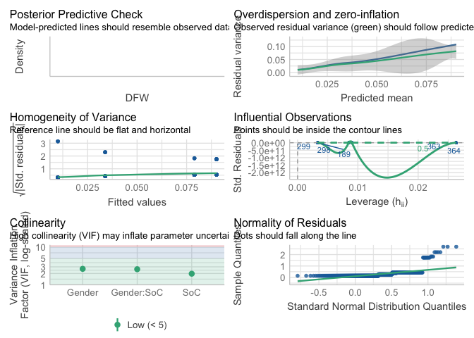
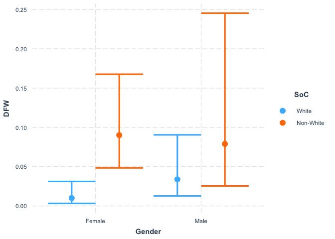
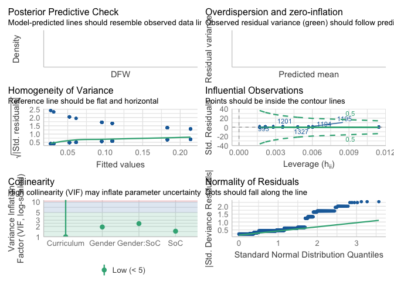
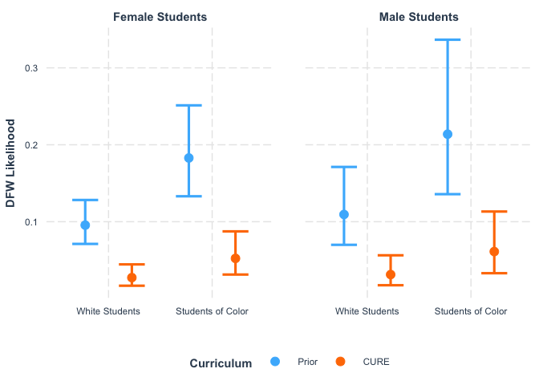
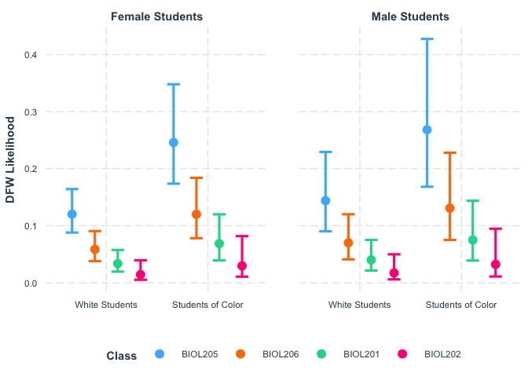
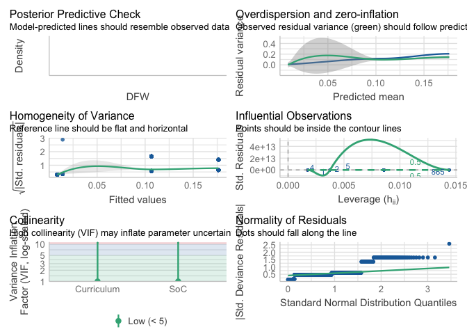
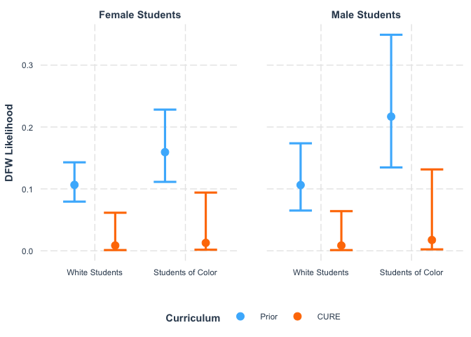
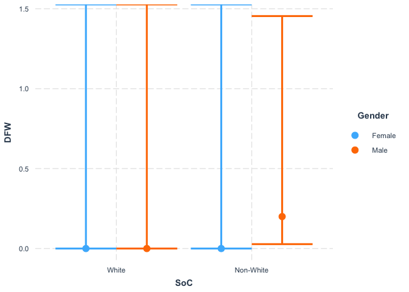

IMPORTANT NOTE

This Rmd uses the deidentified results and is safe to share.


We wish to determine if the new core classes (CURE Lab and BIO Seminar) are helping students to succeed academically.

## Loading Results

I asked the registrar to help me answer the following questions:
1. What was the DFW rate for first-year students in BIOL 205 and 206 from SP 2017 to FA 2019?
2. What was the DFW rate for first-year students in BIOL 201 and 202 from FA 2021 to SP 2022?

They sent us the files located in the "Grade Outcomes" folder.

Note that this analysis only includes first-year students in the Biology classes, even though there are other students in these classes.

I began working on reading those files in using pdf_text, but that looked like it was going to be a nightmare, so I am going to enter the results in manually.
I later got all the results in excel form and could have imported them more easily, but it was too late.


```r
DFW <- tibble(Class = "BIOL201", Year = "21-22", Semester = "Fall", DFW = 6, Total = 103)
DFW <- DFW %>%
  add_row(Class = "BIOL202", Year = "21-22", Semester = "Fall", DFW = 1, Total = 43) %>%
  add_row(Class = "BIOL201", Year = "21-22", Semester = "Spring", DFW = 0, Total = 64) %>%
  add_row(Class = "BIOL202", Year = "21-22", Semester = "Spring", DFW = 0, Total = 60) %>%
  add_row(Class = "BIOL205", Year = "17-18", Semester = "Fall", DFW = 4+19, Total = 149) %>%
  add_row(Class = "BIOL205", Year = "18-19", Semester = "Fall", DFW = 9+6+22, Total = 160) %>%
  add_row(Class = "BIOL205", Year = "19-20", Semester = "Fall", DFW = 7+3+7, Total = 162) %>%
  add_row(Class = "BIOL206", Year = "16-17", Semester = "Spring", DFW = 1+1+3, Total = 119) %>%
  add_row(Class = "BIOL206", Year = "17-18", Semester = "Spring", DFW = 5+1+9, Total = 123) %>%
  add_row(Class = "BIOL206", Year = "18-19", Semester = "Spring", DFW = 1+2+4, Total = 149)
DFW <- DFW %>%
  mutate(Pass = Total - DFW) %>%
  mutate(`DFW Rate (%)` = DFW / Total * 100)
```

Summarizing Results


```r
DFW %>%
  group_by(Class) %>%
  summarise(`Mean DFW Rate (%)` = mean(`DFW Rate (%)`), 
            Sd = sd(`DFW Rate (%)`))
```

```
## # A tibble: 4 × 3
##   Class   `Mean DFW Rate (%)`    Sd
##   <chr>                 <dbl> <dbl>
## 1 BIOL201                2.91  4.12
## 2 BIOL202                1.16  1.64
## 3 BIOL205               16.4   6.37
## 4 BIOL206                7.03  4.48
```

```r
DFW %>%
  group_by(Year) %>%
  summarise(`Mean DFW Rate (%)` = mean(`DFW Rate (%)`), 
            Sd = sd(`DFW Rate (%)`))
```

```
## # A tibble: 5 × 3
##   Year  `Mean DFW Rate (%)`    Sd
##   <chr>               <dbl> <dbl>
## 1 16-17                4.20 NA   
## 2 17-18               13.8   2.29
## 3 18-19               13.9  13.0 
## 4 19-20               10.5  NA   
## 5 21-22                2.04  2.75
```

```r
# Fall Semester
DFW %>%
  filter(Semester == "Fall") %>%
  group_by(Class) %>%
  summarise(DFW = mean(DFW), Enrollment = mean(Total), 
            `Mean DFW Rate (%)` = mean(`DFW Rate (%)`), 
            Sd = sd(`DFW Rate (%)`))
```

```
## # A tibble: 3 × 5
##   Class     DFW Enrollment `Mean DFW Rate (%)`    Sd
##   <chr>   <dbl>      <dbl>               <dbl> <dbl>
## 1 BIOL201   6          103                5.83 NA   
## 2 BIOL202   1           43                2.33 NA   
## 3 BIOL205  25.7        157               16.4   6.37
```

```r
# Spring Semester
DFW %>%
  filter(Semester == "Spring") %>%
  group_by(Class) %>%
  summarise(DFW = mean(DFW), Enrollment = mean(Total),
            `Mean DFW Rate (%)` = mean(`DFW Rate (%)`), 
            Sd = sd(`DFW Rate (%)`))
```

```
## # A tibble: 3 × 5
##   Class     DFW Enrollment `Mean DFW Rate (%)`    Sd
##   <chr>   <dbl>      <dbl>               <dbl> <dbl>
## 1 BIOL201     0        64                 0    NA   
## 2 BIOL202     0        60                 0    NA   
## 3 BIOL206     9       130.                7.03  4.48
```

Initial data exploration:
Although the sample size is quite low, I am going to try a one-sample T test to 
provide some measure of confidence in the difference between the new and old classes.


```r
Fall_DFW <- DFW %>%
  filter(Semester == "Fall", Class == "BIOL205") %>%
  select(`DFW Rate (%)`)
t.test(Fall_DFW$`DFW Rate (%)`, mu = 5.82)
```

```
## 
## 	One Sample t-test
## 
## data:  Fall_DFW$`DFW Rate (%)`
## t = 2.8658, df = 2, p-value = 0.1032
## alternative hypothesis: true mean is not equal to 5.82
## 95 percent confidence interval:
##   0.5397744 32.1636048
## sample estimates:
## mean of x 
##  16.35169
```

```r
t.test(Fall_DFW$`DFW Rate (%)`, mu = 2.32)
```

```
## 
## 	One Sample t-test
## 
## data:  Fall_DFW$`DFW Rate (%)`
## t = 3.8182, df = 2, p-value = 0.06226
## alternative hypothesis: true mean is not equal to 2.32
## 95 percent confidence interval:
##   0.5397744 32.1636048
## sample estimates:
## mean of x 
##  16.35169
```

In the Fall: 

For BIOL201, p = 0.1032

For BIOL202, p = 0.06226


```r
Spring_DFW <- DFW %>%
  filter(Semester == "Spring", Class == "BIOL206") %>%
  select(`DFW Rate (%)`)
t.test(Spring_DFW$`DFW Rate (%)`, mu = 0)
```

```
## 
## 	One Sample t-test
## 
## data:  Spring_DFW$`DFW Rate (%)`
## t = 2.7194, df = 2, p-value = 0.1128
## alternative hypothesis: true mean is not equal to 0
## 95 percent confidence interval:
##  -4.093923 18.157116
## sample estimates:
## mean of x 
##  7.031596
```

In the Spring

p = 0.1128

This applies equally to BIOL 201 and 202 because both had a DFW Rate of 0 in the Spring.

However, this is really count data and should be handled by a negative binomial GLM. 

## First year affiliated majors only

Including only first-year students who are undeclared, Biology, Animal Behavior, Cell Biology/Biochemistry, Biophysics, and Neuroscience. 


```r
Majors_DFW <- tibble(Class = "BIOL205", Year = "17-18", Semester = "Fall", DFW = 21, Total = 124+21)
Majors_DFW <- Majors_DFW %>%
  add_row(Class = "BIOL205", Year = "18-19", Semester = "Fall", DFW = 37, Total = 122+37) %>%
  add_row(Class = "BIOL205", Year = "19-20", Semester = "Fall", DFW = 17, Total = 137+17) %>%
  add_row(Class = "BIOL206", Year = "16-17", Semester = "Spring", DFW = 4, Total = 111+4) %>%
  add_row(Class = "BIOL206", Year = "17-18", Semester = "Spring", DFW = 13, Total = 106+13) %>%
  add_row(Class = "BIOL206", Year = "18-19", Semester = "Spring", DFW = 5, Total = 139+5) 
Majors_DFW <- Majors_DFW %>%
  mutate(Pass = Total - DFW) %>%
  mutate(`DFW Rate (%)` = DFW / Total * 100)
```


```r
Majors_DFW %>%
  group_by(Class) %>%
  summarise(`Mean DFW Rate (%)` = mean(`DFW Rate (%)`), 
            Sd = sd(`DFW Rate (%)`))
```

```
## # A tibble: 2 × 3
##   Class   `Mean DFW Rate (%)`    Sd
##   <chr>                 <dbl> <dbl>
## 1 BIOL205               16.3   6.31
## 2 BIOL206                5.96  4.30
```

Going to compare BIOL205 to BIOL201/202 Fall and BIOL206 to BIOL201/202 Spring.


```r
DFW_205 <- Majors_DFW %>%
  filter(Class == "BIOL205") %>%
  select(`DFW Rate (%)`)
DFW_Fall <- DFW %>%
  filter(Class %in% c("BIOL201", "BIOL202")) %>%
  filter(Semester == "Fall") 
DFW_Fall
```

```
## # A tibble: 2 × 7
##   Class   Year  Semester   DFW Total  Pass `DFW Rate (%)`
##   <chr>   <chr> <chr>    <dbl> <dbl> <dbl>          <dbl>
## 1 BIOL201 21-22 Fall         6   103    97           5.83
## 2 BIOL202 21-22 Fall         1    43    42           2.33
```

```r
t.test(DFW_205$`DFW Rate (%)`, mu = (6 + 1)/(103+43) * 100)
```

```
## 
## 	One Sample t-test
## 
## data:  DFW_205$`DFW Rate (%)`
## t = 3.1497, df = 2, p-value = 0.08774
## alternative hypothesis: true mean is not equal to 4.794521
## 95 percent confidence interval:
##   0.5958524 31.9322542
## sample estimates:
## mean of x 
##  16.26405
```


```r
DFW_206 <- Majors_DFW %>%
  filter(Class == "BIOL206") %>%
  select(`DFW Rate (%)`)
DFW_Spring <- DFW %>%
  filter(Class %in% c("BIOL201", "BIOL202")) %>%
  filter(Semester == "Spring") 
DFW_Spring
```

```
## # A tibble: 2 × 7
##   Class   Year  Semester   DFW Total  Pass `DFW Rate (%)`
##   <chr>   <chr> <chr>    <dbl> <dbl> <dbl>          <dbl>
## 1 BIOL201 21-22 Spring       0    64    64              0
## 2 BIOL202 21-22 Spring       0    60    60              0
```

```r
t.test(DFW_206$`DFW Rate (%)`, mu = 0)
```

```
## 
## 	One Sample t-test
## 
## data:  DFW_206$`DFW Rate (%)`
## t = 2.3996, df = 2, p-value = 0.1385
## alternative hypothesis: true mean is not equal to 0
## 95 percent confidence interval:
##  -4.725389 16.641958
## sample estimates:
## mean of x 
##  5.958284
```

This is a better comparison than I did initially, but the results are quite similar.

Comparing 205 to Fall 201/202: t = 3.1497, df = 2, p-value = 0.08774

Comparing 206 to Spring 201/202: t = 2.3996, df = 2, p-value = 0.1385

## Modeling results with negative binomial glm

First I need to convert the summarized results into individual counts. 

https://www.r-bloggers.com/2019/10/expanding-binomial-counts-to-binary-0-1-with-purrrpmap/


```r
dat = structure(list(plot = structure(1:8, .Label = c("plot1", "plot2", 
"plot3", "plot4", "plot5", "plot6", "plot7", "plot8"), class = "factor"), 
    group = structure(c(1L, 1L, 1L, 1L, 2L, 2L, 2L, 2L), .Label = c("g1", 
    "g2"), class = "factor"), num_dead = c(4L, 6L, 6L, 5L, 1L, 4L, 
    3L, 2L), total = c(5L, 7L, 9L, 7L, 8L, 10L, 10L, 7L)), class = "data.frame", row.names = c(NA, 
-8L))

dat
```

```
##    plot group num_dead total
## 1 plot1    g1        4     5
## 2 plot2    g1        6     7
## 3 plot3    g1        6     9
## 4 plot4    g1        5     7
## 5 plot5    g2        1     8
## 6 plot6    g2        4    10
## 7 plot7    g2        3    10
## 8 plot8    g2        2     7
```

```r
binary_dat = pmap_dfr(dat, 
                      function(group, plot, num_dead, total) {
                           data.frame(plot = plot,
                                      group = group,
                                      dead = c( rep(1, num_dead),
                                                rep(0, total - num_dead) ) )
                      }
)
head(binary_dat)
```

```
##    plot group dead
## 1 plot1    g1    1
## 2 plot1    g1    1
## 3 plot1    g1    1
## 4 plot1    g1    1
## 5 plot1    g1    0
## 6 plot2    g1    1
```

Now to try with the DFW data. 
First, I will select just the data that we need.


```r
Old_DFW_dat <- Majors_DFW %>%
  select(Class:Total) %>%
  mutate(Curriculum = "Old")
New_DFW_dat <- DFW %>%
  select(Class:Total) %>%
  filter(Class %in% c("BIOL201", "BIOL202")) %>%
  mutate(Curriculum = "New")
DFW_dat <- rbind(Old_DFW_dat, New_DFW_dat)
DFW_binary_dat = pmap_dfr(DFW_dat, 
                      function(Class, Year, Semester, DFW, Total, Curriculum) {
                           data.frame(Class = Class,
                                      Year = Year,
                                      Semester = Semester,
                                      Curriculum = Curriculum,
                                      DFW = c( rep(1, DFW),
                                                rep(0, Total - DFW) ) )
                      }
)
```

That worked. Now to use that dataframe for a glm.


```r
model1 <- glm.nb(DFW ~ Curriculum, data = DFW_binary_dat)
```

```
## Warning in theta.ml(Y, mu, sum(w), w, limit = control$maxit, trace =
## control$trace > : iteration limit reached

## Warning in theta.ml(Y, mu, sum(w), w, limit = control$maxit, trace =
## control$trace > : iteration limit reached
```

```r
summary(model1)
```

```
## 
## Call:
## glm.nb(formula = DFW ~ Curriculum, data = DFW_binary_dat, init.theta = 1585.949365, 
##     link = log)
## 
## Coefficients:
##               Estimate Std. Error z value Pr(>|z|)    
## (Intercept)    -3.6525     0.3780  -9.664  < 2e-16 ***
## CurriculumOld   1.4986     0.3914   3.829 0.000129 ***
## ---
## Signif. codes:  0 '***' 0.001 '**' 0.01 '*' 0.05 '.' 0.1 ' ' 1
## 
## (Dispersion parameter for Negative Binomial(1585.949) family taken to be 1)
## 
##     Null deviance: 491.68  on 1105  degrees of freedom
## Residual deviance: 468.94  on 1104  degrees of freedom
## AIC: 683
## 
## Number of Fisher Scoring iterations: 1
## 
## 
##               Theta:  1586 
##           Std. Err.:  10166 
## Warning while fitting theta: iteration limit reached 
## 
##  2 x log-likelihood:  -677.002
```

```r
model_full <- glm.nb(DFW ~ Class * Year * Semester * Curriculum, data = DFW_binary_dat)
```

```
## Warning: glm.fit: algorithm did not converge

## Warning: iteration limit reached
```

```
## Warning: glm.fit: algorithm did not converge
```

```
## Warning in theta.ml(Y, mu, sum(w), w, limit = control$maxit, trace =
## control$trace > : iteration limit reached
```

```
## Warning: glm.fit: algorithm did not converge
```

```
## Warning in theta.ml(Y, mu, sum(w), w, limit = control$maxit, trace =
## control$trace > : iteration limit reached
```

```
## Warning: glm.fit: algorithm did not converge
```

```
## Warning in theta.ml(Y, mu, sum(w), w, limit = control$maxit, trace =
## control$trace > : iteration limit reached
```

```
## Warning: glm.fit: algorithm did not converge
```

```
## Warning in theta.ml(Y, mu, sum(w), w, limit = control$maxit, trace =
## control$trace > : iteration limit reached
```

```
## Warning: glm.fit: algorithm did not converge
```

```
## Warning in theta.ml(Y, mu, sum(w), w, limit = control$maxit, trace =
## control$trace > : iteration limit reached
```

```
## Warning: glm.fit: algorithm did not converge
```

```
## Warning in theta.ml(Y, mu, sum(w), w, limit = control$maxit, trace =
## control$trace > : iteration limit reached
```

```
## Warning: glm.fit: algorithm did not converge
```

```
## Warning in theta.ml(Y, mu, sum(w), w, limit = control$maxit, trace =
## control$trace > : iteration limit reached
```

```
## Warning: glm.fit: algorithm did not converge
```

```
## Warning in theta.ml(Y, mu, sum(w), w, limit = control$maxit, trace =
## control$trace > : iteration limit reached
```

```
## Warning: glm.fit: algorithm did not converge
```

```
## Warning in theta.ml(Y, mu, sum(w), w, limit = control$maxit, trace =
## control$trace > : iteration limit reached
```

```
## Warning: glm.fit: algorithm did not converge
```

```
## Warning in theta.ml(Y, mu, sum(w), w, limit = control$maxit, trace =
## control$trace > : iteration limit reached
```

```
## Warning: glm.fit: algorithm did not converge
```

```
## Warning in theta.ml(Y, mu, sum(w), w, limit = control$maxit, trace =
## control$trace > : iteration limit reached
```

```
## Warning: glm.fit: algorithm did not converge
```

```
## Warning in theta.ml(Y, mu, sum(w), w, limit = control$maxit, trace =
## control$trace > : iteration limit reached
```

```
## Warning: glm.fit: algorithm did not converge
```

```
## Warning in theta.ml(Y, mu, sum(w), w, limit = control$maxit, trace =
## control$trace > : iteration limit reached
```

```
## Warning: glm.fit: algorithm did not converge
```

```
## Warning in theta.ml(Y, mu, sum(w), w, limit = control$maxit, trace =
## control$trace > : iteration limit reached
```

```
## Warning: glm.fit: algorithm did not converge
```

```
## Warning in theta.ml(Y, mu, sum(w), w, limit = control$maxit, trace =
## control$trace > : iteration limit reached
```

```
## Warning: glm.fit: algorithm did not converge
```

```
## Warning in theta.ml(Y, mu, sum(w), w, limit = control$maxit, trace =
## control$trace > : iteration limit reached
```

```
## Warning: glm.fit: algorithm did not converge
```

```
## Warning in theta.ml(Y, mu, sum(w), w, limit = control$maxit, trace =
## control$trace > : iteration limit reached
```

```
## Warning: glm.fit: algorithm did not converge
```

```
## Warning in theta.ml(Y, mu, sum(w), w, limit = control$maxit, trace =
## control$trace > : iteration limit reached
```

```
## Warning: glm.fit: algorithm did not converge
```

```
## Warning in theta.ml(Y, mu, sum(w), w, limit = control$maxit, trace =
## control$trace > : iteration limit reached
```

```
## Warning: glm.fit: algorithm did not converge
```

```
## Warning in theta.ml(Y, mu, sum(w), w, limit = control$maxit, trace =
## control$trace > : iteration limit reached
```

```
## Warning: glm.fit: algorithm did not converge
```

```
## Warning in theta.ml(Y, mu, sum(w), w, limit = control$maxit, trace =
## control$trace > : iteration limit reached
```

```
## Warning: glm.fit: algorithm did not converge
```

```
## Warning in theta.ml(Y, mu, sum(w), w, limit = control$maxit, trace =
## control$trace > : iteration limit reached
```

```
## Warning: glm.fit: algorithm did not converge
```

```
## Warning in theta.ml(Y, mu, sum(w), w, limit = control$maxit, trace =
## control$trace > : iteration limit reached
```

```
## Warning: glm.fit: algorithm did not converge
```

```
## Warning in theta.ml(Y, mu, sum(w), w, limit = control$maxit, trace =
## control$trace > : iteration limit reached
```

```
## Warning: glm.fit: algorithm did not converge
```

```
## Warning in theta.ml(Y, mu, sum(w), w, limit = control$maxit, trace =
## control$trace > : iteration limit reached
```

```
## Warning in glm.nb(DFW ~ Class * Year * Semester * Curriculum, data =
## DFW_binary_dat): alternation limit reached
```

```r
summary(model_full)
```

```
## 
## Call:
## glm.nb(formula = DFW ~ Class * Year * Semester * Curriculum, 
##     data = DFW_binary_dat, init.theta = 2118.886891, link = log)
## 
## Coefficients: (69 not defined because of singularities)
##                                                       Estimate Std. Error
## (Intercept)                                         -1.986e+00  3.462e-01
## ClassBIOL202                                        -1.362e+00  9.067e-01
## ClassBIOL205                                         5.613e-01  7.188e-01
## ClassBIOL206                                        -2.612e+14  1.262e+14
## Year17-18                                            1.134e+00  5.261e-01
## Year18-19                                           -1.463e-03  6.156e-01
## Year19-20                                           -7.459e-01  6.781e-01
## Year21-22                                                   NA         NA
## SemesterSpring                                       2.612e+14  1.262e+14
## CurriculumOld                                               NA         NA
## ClassBIOL202:Year17-18                                      NA         NA
## ClassBIOL205:Year17-18                              -1.642e+00  5.533e-01
## ClassBIOL206:Year17-18                                      NA         NA
## ClassBIOL202:Year18-19                                      NA         NA
## ClassBIOL205:Year18-19                                      NA         NA
## ClassBIOL206:Year18-19                                      NA         NA
## ClassBIOL202:Year19-20                                      NA         NA
## ClassBIOL205:Year19-20                                      NA         NA
## ClassBIOL206:Year19-20                                      NA         NA
## ClassBIOL202:Year21-22                                      NA         NA
## ClassBIOL205:Year21-22                                      NA         NA
## ClassBIOL206:Year21-22                                      NA         NA
## ClassBIOL202:SemesterSpring                         -2.050e+00  1.206e+07
## ClassBIOL205:SemesterSpring                                 NA         NA
## ClassBIOL206:SemesterSpring                                 NA         NA
## Year17-18:SemesterSpring                                    NA         NA
## Year18-19:SemesterSpring                                    NA         NA
## Year19-20:SemesterSpring                                    NA         NA
## Year21-22:SemesterSpring                            -2.612e+14  1.262e+14
## ClassBIOL202:CurriculumOld                                  NA         NA
## ClassBIOL205:CurriculumOld                                  NA         NA
## ClassBIOL206:CurriculumOld                                  NA         NA
## Year17-18:CurriculumOld                                     NA         NA
## Year18-19:CurriculumOld                                     NA         NA
## Year19-20:CurriculumOld                                     NA         NA
## Year21-22:CurriculumOld                                     NA         NA
## SemesterSpring:CurriculumOld                                NA         NA
## ClassBIOL202:Year17-18:SemesterSpring                       NA         NA
## ClassBIOL205:Year17-18:SemesterSpring                       NA         NA
## ClassBIOL206:Year17-18:SemesterSpring                       NA         NA
## ClassBIOL202:Year18-19:SemesterSpring                       NA         NA
## ClassBIOL205:Year18-19:SemesterSpring                       NA         NA
## ClassBIOL206:Year18-19:SemesterSpring                       NA         NA
## ClassBIOL202:Year19-20:SemesterSpring                       NA         NA
## ClassBIOL205:Year19-20:SemesterSpring                       NA         NA
## ClassBIOL206:Year19-20:SemesterSpring                       NA         NA
## ClassBIOL202:Year21-22:SemesterSpring                       NA         NA
## ClassBIOL205:Year21-22:SemesterSpring                       NA         NA
## ClassBIOL206:Year21-22:SemesterSpring                       NA         NA
## ClassBIOL202:Year17-18:CurriculumOld                        NA         NA
## ClassBIOL205:Year17-18:CurriculumOld                        NA         NA
## ClassBIOL206:Year17-18:CurriculumOld                        NA         NA
## ClassBIOL202:Year18-19:CurriculumOld                        NA         NA
## ClassBIOL205:Year18-19:CurriculumOld                        NA         NA
## ClassBIOL206:Year18-19:CurriculumOld                        NA         NA
## ClassBIOL202:Year19-20:CurriculumOld                        NA         NA
## ClassBIOL205:Year19-20:CurriculumOld                        NA         NA
## ClassBIOL206:Year19-20:CurriculumOld                        NA         NA
## ClassBIOL202:Year21-22:CurriculumOld                        NA         NA
## ClassBIOL205:Year21-22:CurriculumOld                        NA         NA
## ClassBIOL206:Year21-22:CurriculumOld                        NA         NA
## ClassBIOL202:SemesterSpring:CurriculumOld                   NA         NA
## ClassBIOL205:SemesterSpring:CurriculumOld                   NA         NA
## ClassBIOL206:SemesterSpring:CurriculumOld                   NA         NA
## Year17-18:SemesterSpring:CurriculumOld                      NA         NA
## Year18-19:SemesterSpring:CurriculumOld                      NA         NA
## Year19-20:SemesterSpring:CurriculumOld                      NA         NA
## Year21-22:SemesterSpring:CurriculumOld                      NA         NA
## ClassBIOL202:Year17-18:SemesterSpring:CurriculumOld         NA         NA
## ClassBIOL205:Year17-18:SemesterSpring:CurriculumOld         NA         NA
## ClassBIOL206:Year17-18:SemesterSpring:CurriculumOld         NA         NA
## ClassBIOL202:Year18-19:SemesterSpring:CurriculumOld         NA         NA
## ClassBIOL205:Year18-19:SemesterSpring:CurriculumOld         NA         NA
## ClassBIOL206:Year18-19:SemesterSpring:CurriculumOld         NA         NA
## ClassBIOL202:Year19-20:SemesterSpring:CurriculumOld         NA         NA
## ClassBIOL205:Year19-20:SemesterSpring:CurriculumOld         NA         NA
## ClassBIOL206:Year19-20:SemesterSpring:CurriculumOld         NA         NA
## ClassBIOL202:Year21-22:SemesterSpring:CurriculumOld         NA         NA
## ClassBIOL205:Year21-22:SemesterSpring:CurriculumOld         NA         NA
## ClassBIOL206:Year21-22:SemesterSpring:CurriculumOld         NA         NA
##                                                     z value Pr(>|z|)    
## (Intercept)                                          -5.737 9.64e-09 ***
## ClassBIOL202                                         -1.502   0.1330    
## ClassBIOL205                                          0.781   0.4348    
## ClassBIOL206                                         -2.070   0.0385 *  
## Year17-18                                             2.156   0.0311 *  
## Year18-19                                            -0.002   0.9981    
## Year19-20                                            -1.100   0.2714    
## Year21-22                                                NA       NA    
## SemesterSpring                                        2.070   0.0385 *  
## CurriculumOld                                            NA       NA    
## ClassBIOL202:Year17-18                                   NA       NA    
## ClassBIOL205:Year17-18                               -2.968   0.0030 ** 
## ClassBIOL206:Year17-18                                   NA       NA    
## ClassBIOL202:Year18-19                                   NA       NA    
## ClassBIOL205:Year18-19                                   NA       NA    
## ClassBIOL206:Year18-19                                   NA       NA    
## ClassBIOL202:Year19-20                                   NA       NA    
## ClassBIOL205:Year19-20                                   NA       NA    
## ClassBIOL206:Year19-20                                   NA       NA    
## ClassBIOL202:Year21-22                                   NA       NA    
## ClassBIOL205:Year21-22                                   NA       NA    
## ClassBIOL206:Year21-22                                   NA       NA    
## ClassBIOL202:SemesterSpring                           0.000   1.0000    
## ClassBIOL205:SemesterSpring                              NA       NA    
## ClassBIOL206:SemesterSpring                              NA       NA    
## Year17-18:SemesterSpring                                 NA       NA    
## Year18-19:SemesterSpring                                 NA       NA    
## Year19-20:SemesterSpring                                 NA       NA    
## Year21-22:SemesterSpring                             -2.070   0.0385 *  
## ClassBIOL202:CurriculumOld                               NA       NA    
## ClassBIOL205:CurriculumOld                               NA       NA    
## ClassBIOL206:CurriculumOld                               NA       NA    
## Year17-18:CurriculumOld                                  NA       NA    
## Year18-19:CurriculumOld                                  NA       NA    
## Year19-20:CurriculumOld                                  NA       NA    
## Year21-22:CurriculumOld                                  NA       NA    
## SemesterSpring:CurriculumOld                             NA       NA    
## ClassBIOL202:Year17-18:SemesterSpring                    NA       NA    
## ClassBIOL205:Year17-18:SemesterSpring                    NA       NA    
## ClassBIOL206:Year17-18:SemesterSpring                    NA       NA    
## ClassBIOL202:Year18-19:SemesterSpring                    NA       NA    
## ClassBIOL205:Year18-19:SemesterSpring                    NA       NA    
## ClassBIOL206:Year18-19:SemesterSpring                    NA       NA    
## ClassBIOL202:Year19-20:SemesterSpring                    NA       NA    
## ClassBIOL205:Year19-20:SemesterSpring                    NA       NA    
## ClassBIOL206:Year19-20:SemesterSpring                    NA       NA    
## ClassBIOL202:Year21-22:SemesterSpring                    NA       NA    
## ClassBIOL205:Year21-22:SemesterSpring                    NA       NA    
## ClassBIOL206:Year21-22:SemesterSpring                    NA       NA    
## ClassBIOL202:Year17-18:CurriculumOld                     NA       NA    
## ClassBIOL205:Year17-18:CurriculumOld                     NA       NA    
## ClassBIOL206:Year17-18:CurriculumOld                     NA       NA    
## ClassBIOL202:Year18-19:CurriculumOld                     NA       NA    
## ClassBIOL205:Year18-19:CurriculumOld                     NA       NA    
## ClassBIOL206:Year18-19:CurriculumOld                     NA       NA    
## ClassBIOL202:Year19-20:CurriculumOld                     NA       NA    
## ClassBIOL205:Year19-20:CurriculumOld                     NA       NA    
## ClassBIOL206:Year19-20:CurriculumOld                     NA       NA    
## ClassBIOL202:Year21-22:CurriculumOld                     NA       NA    
## ClassBIOL205:Year21-22:CurriculumOld                     NA       NA    
## ClassBIOL206:Year21-22:CurriculumOld                     NA       NA    
## ClassBIOL202:SemesterSpring:CurriculumOld                NA       NA    
## ClassBIOL205:SemesterSpring:CurriculumOld                NA       NA    
## ClassBIOL206:SemesterSpring:CurriculumOld                NA       NA    
## Year17-18:SemesterSpring:CurriculumOld                   NA       NA    
## Year18-19:SemesterSpring:CurriculumOld                   NA       NA    
## Year19-20:SemesterSpring:CurriculumOld                   NA       NA    
## Year21-22:SemesterSpring:CurriculumOld                   NA       NA    
## ClassBIOL202:Year17-18:SemesterSpring:CurriculumOld      NA       NA    
## ClassBIOL205:Year17-18:SemesterSpring:CurriculumOld      NA       NA    
## ClassBIOL206:Year17-18:SemesterSpring:CurriculumOld      NA       NA    
## ClassBIOL202:Year18-19:SemesterSpring:CurriculumOld      NA       NA    
## ClassBIOL205:Year18-19:SemesterSpring:CurriculumOld      NA       NA    
## ClassBIOL206:Year18-19:SemesterSpring:CurriculumOld      NA       NA    
## ClassBIOL202:Year19-20:SemesterSpring:CurriculumOld      NA       NA    
## ClassBIOL205:Year19-20:SemesterSpring:CurriculumOld      NA       NA    
## ClassBIOL206:Year19-20:SemesterSpring:CurriculumOld      NA       NA    
## ClassBIOL202:Year21-22:SemesterSpring:CurriculumOld      NA       NA    
## ClassBIOL205:Year21-22:SemesterSpring:CurriculumOld      NA       NA    
## ClassBIOL206:Year21-22:SemesterSpring:CurriculumOld      NA       NA    
## ---
## Signif. codes:  0 '***' 0.001 '**' 0.01 '*' 0.05 '.' 0.1 ' ' 1
## 
## (Dispersion parameter for Negative Binomial(2356.27) family taken to be 1)
## 
##     Null deviance: 491.70  on 1105  degrees of freedom
## Residual deviance: 430.16  on 1095  degrees of freedom
## AIC: 662.21
## 
## Number of Fisher Scoring iterations: 25
## 
## 
##               Theta:  2119 
##           Std. Err.:  13525 
## Warning while fitting theta: alternation limit reached 
## 
##  2 x log-likelihood:  -638.207
```

The full model has too many interacting variables to be useful. 
Even with the interactions removed, the model does not converge properly.
I will stick with Model 1 for further exploration.


```r
newdata <- data.frame(Curriculum = c("Old", "New"))
newdata
```

```
##   Curriculum
## 1        Old
## 2        New
```

```r
predict.glm(model1, newdata=newdata, type="response")
```

```
##          1          2 
## 0.11602871 0.02592593
```

```r
model1
```

```
## 
## Call:  glm.nb(formula = DFW ~ Curriculum, data = DFW_binary_dat, init.theta = 1585.949365, 
##     link = log)
## 
## Coefficients:
##   (Intercept)  CurriculumOld  
##        -3.653          1.499  
## 
## Degrees of Freedom: 1105 Total (i.e. Null);  1104 Residual
## Null Deviance:	    491.7 
## Residual Deviance: 468.9 	AIC: 683
```

```r
check_zeroinflation(model1)
```

```
## # Check for zero-inflation
## 
##    Observed zeros: 1002
##   Predicted zeros: 1008
##             Ratio: 1.01
```

```
## Model seems ok, ratio of observed and predicted zeros is within the
##   tolerance range.
```

```r
check_overdispersion(model1)
```

```
## # Overdispersion test
## 
##        dispersion ratio =    0.908
##   Pearson's Chi-Squared = 1001.942
##                 p-value =    0.987
```

```
## No overdispersion detected.
```

```r
performance(model1)
```

```
## # Indices of model performance
## 
## AIC     |    AICc |     BIC | Nagelkerke's R2 |  RMSE | Sigma | Score_log | Score_spherical
## -------------------------------------------------------------------------------------------
## 683.002 | 683.024 | 698.028 |           0.057 | 0.289 | 1.000 |    -0.308 |           0.029
```

```r
summary(model1)
```

```
## 
## Call:
## glm.nb(formula = DFW ~ Curriculum, data = DFW_binary_dat, init.theta = 1585.949365, 
##     link = log)
## 
## Coefficients:
##               Estimate Std. Error z value Pr(>|z|)    
## (Intercept)    -3.6525     0.3780  -9.664  < 2e-16 ***
## CurriculumOld   1.4986     0.3914   3.829 0.000129 ***
## ---
## Signif. codes:  0 '***' 0.001 '**' 0.01 '*' 0.05 '.' 0.1 ' ' 1
## 
## (Dispersion parameter for Negative Binomial(1585.949) family taken to be 1)
## 
##     Null deviance: 491.68  on 1105  degrees of freedom
## Residual deviance: 468.94  on 1104  degrees of freedom
## AIC: 683
## 
## Number of Fisher Scoring iterations: 1
## 
## 
##               Theta:  1586 
##           Std. Err.:  10166 
## Warning while fitting theta: iteration limit reached 
## 
##  2 x log-likelihood:  -677.002
```


```r
exp(1.4986)
```

```
## [1] 4.475419
```

```r
exp(1.4986+0.3914)
```

```
## [1] 6.619369
```

```r
exp(1.4986-0.3914)
```

```
## [1] 3.025874
```

The model indicates that students under the old curriculum were 4.5-fold (3.0 - 6.6) more likely to earn a DFW in the first two Biology courses (p = 0.000129).

## Adding results from second year of new curriculum


```r
Newer_DFW_dat <- New_DFW_dat %>%
  rbind(c("BIOL201", "22-23", "Fall", 3, 107, "New")) %>%
  rbind(c("BIOL201", "22-23", "Spring", 4, 70, "New")) %>%
  rbind(c("BIOL202", "22-23", "Fall", 2, 42, "New")) %>%
  rbind(c("BIOL201", "22-23", "Spring", 1, 63, "New"))
Newer_DFW_dat <- Newer_DFW_dat %>%
  mutate(DFW = as.numeric(DFW)) %>%
  mutate(Total = as.numeric(Total))
DFW_dat2 <- rbind(Old_DFW_dat, Newer_DFW_dat)
DFW_binary_dat2 <- pmap_dfr(DFW_dat2, 
                      function(Class, Year, Semester, DFW, Total, Curriculum) {
                           data.frame(Class = Class,
                                      Year = Year,
                                      Semester = Semester,
                                      Curriculum = Curriculum,
                                      DFW = c( rep(1, DFW),
                                                rep(0, Total - DFW) ) )
                      }
)
new_model1 <- glm.nb(DFW ~ Curriculum, data = DFW_binary_dat2)
```

```
## Warning in theta.ml(Y, mu, sum(w), w, limit = control$maxit, trace =
## control$trace > : iteration limit reached

## Warning in theta.ml(Y, mu, sum(w), w, limit = control$maxit, trace =
## control$trace > : iteration limit reached
```

```r
summary(new_model1)
```

```
## 
## Call:
## glm.nb(formula = DFW ~ Curriculum, data = DFW_binary_dat2, init.theta = 1416.040361, 
##     link = log)
## 
## Coefficients:
##               Estimate Std. Error z value Pr(>|z|)    
## (Intercept)    -3.4803     0.2425 -14.350  < 2e-16 ***
## CurriculumOld   1.3264     0.2629   5.045 4.54e-07 ***
## ---
## Signif. codes:  0 '***' 0.001 '**' 0.01 '*' 0.05 '.' 0.1 ' ' 1
## 
## (Dispersion parameter for Negative Binomial(1416.04) family taken to be 1)
## 
##     Null deviance: 569.79  on 1387  degrees of freedom
## Residual deviance: 536.12  on 1386  degrees of freedom
## AIC: 770.2
## 
## Number of Fisher Scoring iterations: 1
## 
## 
##               Theta:  1416 
##           Std. Err.:  8452 
## Warning while fitting theta: iteration limit reached 
## 
##  2 x log-likelihood:  -764.2
```

```r
check_zeroinflation(new_model1)
```

```
## # Check for zero-inflation
## 
##    Observed zeros: 1274
##   Predicted zeros: 1280
##             Ratio: 1.00
```

```
## Model seems ok, ratio of observed and predicted zeros is within the
##   tolerance range.
```

That looks good. And I am glad to have checked the zero-inflated model even though we don't need it.


```r
exp(1.3256)
```

```
## [1] 3.764443
```

```r
exp(1.3256+0.2690)
```

```
## [1] 4.926358
```

```r
exp(1.3256-0.2690)
```

```
## [1] 2.876574
```

The model including the second year data indicates that students under the old curriculum were 3.8-fold (2.9 - 4.9) more likely to earn a DFW in the first two Biology courses (p = 0.000000835).

How does it look with just the old data, but with the zero-inflated model?
However, I determined that the data does not actually have a zero-inflation problem so this was not needed.


```r
zero_model1 <- zeroinfl(DFW ~ Curriculum, data = DFW_binary_dat)
summary(zero_model1)
```

```
## 
## Call:
## zeroinfl(formula = DFW ~ Curriculum, data = DFW_binary_dat)
## 
## Pearson residuals:
##     Min      1Q  Median      3Q     Max 
## -0.3406 -0.3406 -0.3406 -0.1610  6.0495 
## 
## Count model coefficients (poisson with log link):
##               Estimate Std. Error z value Pr(>|z|)    
## (Intercept)    -3.6520     0.3852   -9.48  < 2e-16 ***
## CurriculumOld   1.4981     0.3984    3.76  0.00017 ***
## 
## Zero-inflation model coefficients (binomial with logit link):
##               Estimate Std. Error z value Pr(>|z|)
## (Intercept)     -7.576    145.325  -0.052    0.958
## CurriculumOld   -6.788    552.695  -0.012    0.990
## ---
## Signif. codes:  0 '***' 0.001 '**' 0.01 '*' 0.05 '.' 0.1 ' ' 1 
## 
## Number of iterations in BFGS optimization: 48 
## Log-likelihood: -338.5 on 4 Df
```


```r
exp(1.4981)
```

```
## [1] 4.473182
```

```r
exp(1.4981+0.3984)
```

```
## [1] 6.662535
```

```r
exp(1.4981-0.3984)
```

```
## [1] 3.003265
```

That is almost identical. And we see that the zero inflation coefficients have very high p values.

## Effect of race/ethnicity and gender

First looking at the old curriculum. 


```r
Old_FullDFW <- tibble(Class = "BIOL205", Year = "17-18", Semester = "Fall", Gender = "Female", SoC = "Non-White", 
                      DFW = 5, Total = 30)
Old_FullDFW <- Old_FullDFW %>%
  add_row(Class = "BIOL205", Year = "17-18", Semester = "Fall", Gender = "Female", SoC = "White", DFW = 11, Total = 76) %>%
  add_row(Class = "BIOL205", Year = "17-18", Semester = "Fall", Gender = "Male", SoC = "Non-White", DFW = 4, Total = 15) %>%
  add_row(Class = "BIOL205", Year = "17-18", Semester = "Fall", Gender = "Male", SoC = "White", DFW = 3, Total = 28) %>%
  add_row(Class = "BIOL205", Year = "18-19", Semester = "Fall", Gender = "Female", SoC = "Non-White", DFW = 10, Total = 37) %>%
  add_row(Class = "BIOL205", Year = "18-19", Semester = "Fall", Gender = "Female", SoC = "White", DFW = 19, Total = 89) %>%
  add_row(Class = "BIOL205", Year = "18-19", Semester = "Fall", Gender = "Male", SoC = "Non-White", DFW = 3, Total = 9) %>%
  add_row(Class = "BIOL205", Year = "18-19", Semester = "Fall", Gender = "Male", SoC = "White", DFW = 5, Total = 25) %>%
  add_row(Class = "BIOL205", Year = "19-20", Semester = "Fall", Gender = "Female", SoC = "Non-White", DFW = 3, Total = 25) %>%
  add_row(Class = "BIOL205", Year = "19-20", Semester = "Fall", Gender = "Female", SoC = "White", DFW = 7, Total = 89) %>%
  add_row(Class = "BIOL205", Year = "19-20", Semester = "Fall", Gender = "Male", SoC = "Non-White", DFW = 2, Total = 23) %>%
  add_row(Class = "BIOL205", Year = "19-20", Semester = "Fall", Gender = "Male", SoC = "White", DFW = 5, Total = 25) %>%
  add_row(Class = "BIOL206", Year = "16-17", Semester = "Spring", Gender = "Female", SoC = "Non-White", DFW = 5, Total = 30) %>%
  add_row(Class = "BIOL206", Year = "16-17", Semester = "Spring", Gender = "Female", SoC = "White", DFW = 1, Total = 21) %>%
  add_row(Class = "BIOL206", Year = "16-17", Semester = "Spring", Gender = "Male", SoC = "Non-White", DFW = 2, Total = 11) %>%
  add_row(Class = "BIOL206", Year = "16-17", Semester = "Spring", Gender = "Male", SoC = "White", DFW = 0, Total = 26) %>%
  add_row(Class = "BIOL206", Year = "17-18", Semester = "Spring", Gender = "Female", SoC = "Non-White", DFW = 4, Total = 27) %>%
  add_row(Class = "BIOL206", Year = "17-18", Semester = "Spring", Gender = "Female", SoC = "White", DFW = 4, Total = 61) %>%
  add_row(Class = "BIOL206", Year = "17-18", Semester = "Spring", Gender = "Male", SoC = "Non-White", DFW = 4, Total = 13) %>%
  add_row(Class = "BIOL206", Year = "17-18", Semester = "Spring", Gender = "Male", SoC = "White", DFW = 3, Total = 22) %>%
  add_row(Class = "BIOL206", Year = "18-19", Semester = "Spring", Gender = "Female", SoC = "Non-White", DFW = 3, Total = 38) %>%
  add_row(Class = "BIOL206", Year = "18-19", Semester = "Spring", Gender = "Female", SoC = "White", DFW = 3, Total = 81) %>%
  add_row(Class = "BIOL206", Year = "18-19", Semester = "Spring", Gender = "Male", SoC = "Non-White", DFW = 1, Total = 7) %>%
  add_row(Class = "BIOL206", Year = "18-19", Semester = "Spring", Gender = "Male", SoC = "White", DFW = 0, Total = 23)
summary(Old_FullDFW)
```

```
##     Class               Year             Semester            Gender         
##  Length:24          Length:24          Length:24          Length:24         
##  Class :character   Class :character   Class :character   Class :character  
##  Mode  :character   Mode  :character   Mode  :character   Mode  :character  
##                                                                             
##                                                                             
##                                                                             
##      SoC                 DFW             Total      
##  Length:24          Min.   : 0.000   Min.   : 7.00  
##  Class :character   1st Qu.: 2.750   1st Qu.:21.75  
##  Mode  :character   Median : 3.500   Median :25.50  
##                     Mean   : 4.458   Mean   :34.62  
##                     3rd Qu.: 5.000   3rd Qu.:37.25  
##                     Max.   :19.000   Max.   :89.00
```

```r
Old_FullDFW_binary_dat <- pmap_dfr(Old_FullDFW, 
                      function(Class, Year, Semester, Gender, SoC, DFW, Total) {
                           data.frame(Class = as.factor(Class),
                                      Year = as.factor(Year),
                                      Semester = as.factor(Semester),
                                      Gender = as.factor(Gender),
                                      SoC = as.factor(SoC),
                                      DFW = c( rep(1, DFW),
                                                rep(0, Total - DFW) ) )
                      }
)
Old_FullDFW_binary_dat <- Old_FullDFW_binary_dat %>%
  mutate(SoC = factor(SoC, levels = c("White", "Non-White")))
summary(Old_FullDFW_binary_dat)
```

```
##      Class        Year       Semester      Gender           SoC     
##  BIOL205:471   17-18:272   Fall  :471   Female:604   White    :566  
##  BIOL206:360   18-19:309   Spring:360   Male  :227   Non-White:265  
##                19-20:162                                            
##                16-17: 88                                            
##                                                                     
##                                                                     
##       DFW        
##  Min.   :0.0000  
##  1st Qu.:0.0000  
##  Median :0.0000  
##  Mean   :0.1288  
##  3rd Qu.:0.0000  
##  Max.   :1.0000
```

Now for the model.


```r
glm_model_old_full <- glm.nb(DFW ~ Gender * SoC, data = Old_FullDFW_binary_dat)
```

```
## Warning in theta.ml(Y, mu, sum(w), w, limit = control$maxit, trace =
## control$trace > : iteration limit reached

## Warning in theta.ml(Y, mu, sum(w), w, limit = control$maxit, trace =
## control$trace > : iteration limit reached
```

```r
summary(glm_model_old_full)
```

```
## 
## Call:
## glm.nb(formula = DFW ~ Gender * SoC, data = Old_FullDFW_binary_dat, 
##     init.theta = 2980.644102, link = log)
## 
## Coefficients:
##                          Estimate Std. Error z value Pr(>|z|)    
## (Intercept)             -2.226424   0.149074 -14.935   <2e-16 ***
## GenderMale              -0.004934   0.291076  -0.017   0.9865    
## SoCNon-White             0.396512   0.235708   1.682   0.0925 .  
## GenderMale:SoCNon-White  0.250725   0.424929   0.590   0.5552    
## ---
## Signif. codes:  0 '***' 0.001 '**' 0.01 '*' 0.05 '.' 0.1 ' ' 1
## 
## (Dispersion parameter for Negative Binomial(2980.644) family taken to be 1)
## 
##     Null deviance: 438.63  on 830  degrees of freedom
## Residual deviance: 432.24  on 827  degrees of freedom
## AIC: 656.27
## 
## Number of Fisher Scoring iterations: 1
## 
## 
##               Theta:  2981 
##           Std. Err.:  23128 
## Warning while fitting theta: iteration limit reached 
## 
##  2 x log-likelihood:  -646.273
```

This is consistent with my original analysis. 
Neither Race/ethnicity nor Gender had a major effect on DFW rates in the old curriculum. 
Students of color did have a higher rate, but the p value was marginal (0.0925).

Now to look at the data for 201 and 202.


```r
New_FullDFW <- tibble(Class = "BIOL201", Year = "22-23", Semester = "Fall", Gender = "Female", SoC = "Non-White", 
                      DFW = 3, Total = 25)
New_FullDFW <- New_FullDFW %>%
  add_row(Class = "BIOL201", Year = "22-23", Semester = "Fall", Gender = "Female", SoC = "White", DFW = 0, Total = 57) %>%
  add_row(Class = "BIOL201", Year = "22-23", Semester = "Fall", Gender = "Male", SoC = "Non-White", DFW = 0, Total = 8) %>%
  add_row(Class = "BIOL201", Year = "22-23", Semester = "Fall", Gender = "Male", SoC = "White", DFW = 0, Total = 17) %>%
  add_row(Class = "BIOL201", Year = "22-23", Semester = "Spring", Gender = "Female", SoC = "Non-White", DFW = 3, Total = 18) %>%
  add_row(Class = "BIOL201", Year = "22-23", Semester = "Spring", Gender = "Female", SoC = "White", DFW = 0, Total = 29) %>%
  add_row(Class = "BIOL201", Year = "22-23", Semester = "Spring", Gender = "Male", SoC = "Non-White", DFW = 0, Total = 7) %>%
  add_row(Class = "BIOL201", Year = "22-23", Semester = "Spring", Gender = "Male", SoC = "White", DFW = 1, Total = 16) %>%
  add_row(Class = "BIOL202", Year = "22-23", Semester = "Fall", Gender = "Female", SoC = "Non-White", DFW = 1, Total = 11) %>%
  add_row(Class = "BIOL202", Year = "22-23", Semester = "Fall", Gender = "Female", SoC = "White", DFW = 1, Total = 15) %>%
  add_row(Class = "BIOL202", Year = "22-23", Semester = "Fall", Gender = "Male", SoC = "Non-White", DFW = 0, Total = 4) %>%
  add_row(Class = "BIOL202", Year = "22-23", Semester = "Fall", Gender = "Male", SoC = "White", DFW = 0, Total = 12) %>%
  add_row(Class = "BIOL202", Year = "22-23", Semester = "Spring", Gender = "Female", SoC = "Non-White", DFW = 1, Total = 16) %>%
  add_row(Class = "BIOL202", Year = "22-23", Semester = "Spring", Gender = "Female", SoC = "White", DFW = 0, Total = 33) %>%
  add_row(Class = "BIOL202", Year = "22-23", Semester = "Spring", Gender = "Male", SoC = "Non-White", DFW = 0, Total = 3) %>%
  add_row(Class = "BIOL202", Year = "22-23", Semester = "Spring", Gender = "Male", SoC = "White", DFW = 0, Total = 11) %>%
  add_row(Class = "BIOL201", Year = "21-22", Semester = "Fall", Gender = "Female", SoC = "Non-White", DFW = 2, Total = 15) %>%
  add_row(Class = "BIOL201", Year = "21-22", Semester = "Fall", Gender = "Female", SoC = "White", DFW = 2, Total = 65) %>%
  add_row(Class = "BIOL201", Year = "21-22", Semester = "Fall", Gender = "Male", SoC = "Non-White", DFW = 2, Total = 7) %>%
  add_row(Class = "BIOL201", Year = "21-22", Semester = "Fall", Gender = "Male", SoC = "White", DFW = 3, Total = 26) %>%
  add_row(Class = "BIOL201", Year = "21-22", Semester = "Spring", Gender = "Female", SoC = "Non-White", DFW = 0, Total = 11) %>%
  add_row(Class = "BIOL201", Year = "21-22", Semester = "Spring", Gender = "Female", SoC = "White", DFW = 0, Total = 35) %>%
  add_row(Class = "BIOL201", Year = "21-22", Semester = "Spring", Gender = "Male", SoC = "Non-White", DFW = 0, Total = 4) %>%
  add_row(Class = "BIOL201", Year = "21-22", Semester = "Spring", Gender = "Male", SoC = "White", DFW = 0, Total = 17) %>%
  add_row(Class = "BIOL202", Year = "21-22", Semester = "Fall", Gender = "Female", SoC = "Non-White", DFW = 0, Total = 8) %>%
  add_row(Class = "BIOL202", Year = "21-22", Semester = "Fall", Gender = "Female", SoC = "White", DFW = 0, Total = 25) %>%
  add_row(Class = "BIOL202", Year = "21-22", Semester = "Fall", Gender = "Male", SoC = "Non-White", DFW = 1, Total = 3) %>%
  add_row(Class = "BIOL202", Year = "21-22", Semester = "Fall", Gender = "Male", SoC = "White", DFW = 0, Total = 7) %>%
  add_row(Class = "BIOL202", Year = "21-22", Semester = "Spring", Gender = "Female", SoC = "Non-White", DFW = 0, Total = 7) %>%
  add_row(Class = "BIOL202", Year = "21-22", Semester = "Spring", Gender = "Female", SoC = "White", DFW = 0, Total = 40) %>%
  add_row(Class = "BIOL202", Year = "21-22", Semester = "Spring", Gender = "Male", SoC = "Non-White", DFW = 0, Total = 2) %>%
  add_row(Class = "BIOL202", Year = "21-22", Semester = "Spring", Gender = "Male", SoC = "White", DFW = 0, Total = 12)
summary(New_FullDFW)
```

```
##     Class               Year             Semester            Gender         
##  Length:32          Length:32          Length:32          Length:32         
##  Class :character   Class :character   Class :character   Class :character  
##  Mode  :character   Mode  :character   Mode  :character   Mode  :character  
##                                                                             
##                                                                             
##                                                                             
##      SoC                 DFW            Total      
##  Length:32          Min.   :0.000   Min.   : 2.00  
##  Class :character   1st Qu.:0.000   1st Qu.: 7.00  
##  Mode  :character   Median :0.000   Median :13.50  
##                     Mean   :0.625   Mean   :17.69  
##                     3rd Qu.:1.000   3rd Qu.:25.00  
##                     Max.   :3.000   Max.   :65.00
```

```r
New_FullDFW_binary_dat <- pmap_dfr(New_FullDFW, 
                      function(Class, Year, Semester, Gender, SoC, DFW, Total) {
                           data.frame(Class = as.factor(Class),
                                      Year = as.factor(Year),
                                      Semester = as.factor(Semester),
                                      Gender = as.factor(Gender),
                                      SoC = as.factor(SoC),
                                      DFW = c( rep(1, DFW),
                                                rep(0, Total - DFW) ) )
                      }
)
New_FullDFW_binary_dat <- New_FullDFW_binary_dat %>%
  mutate(SoC = factor(SoC, levels = c("White", "Non-White")))
summary(New_FullDFW_binary_dat)
```

```
##      Class        Year       Semester      Gender           SoC     
##  BIOL201:357   22-23:282   Fall  :305   Female:410   White    :417  
##  BIOL202:209   21-22:284   Spring:261   Male  :156   Non-White:149  
##                                                                     
##                                                                     
##                                                                     
##                                                                     
##       DFW         
##  Min.   :0.00000  
##  1st Qu.:0.00000  
##  Median :0.00000  
##  Mean   :0.03534  
##  3rd Qu.:0.00000  
##  Max.   :1.00000
```


```r
glm_model_new_full <- glm.nb(DFW ~ Gender * SoC, data = New_FullDFW_binary_dat)
```

```
## Warning in theta.ml(Y, mu, sum(w), w, limit = control$maxit, trace =
## control$trace > : iteration limit reached

## Warning in theta.ml(Y, mu, sum(w), w, limit = control$maxit, trace =
## control$trace > : iteration limit reached
```

```r
summary(glm_model_new_full)
```

```
## 
## Call:
## glm.nb(formula = DFW ~ Gender * SoC, data = New_FullDFW_binary_dat, 
##     init.theta = 501.9293108, link = log)
## 
## Coefficients:
##                         Estimate Std. Error z value Pr(>|z|)    
## (Intercept)              -4.6018     0.5774  -7.971 1.58e-15 ***
## GenderMale                1.2174     0.7638   1.594 0.110942    
## SoCNon-White              2.1949     0.6583   3.334 0.000856 ***
## GenderMale:SoCNon-White  -1.3495     1.0083  -1.338 0.180798    
## ---
## Signif. codes:  0 '***' 0.001 '**' 0.01 '*' 0.05 '.' 0.1 ' ' 1
## 
## (Dispersion parameter for Negative Binomial(501.9293) family taken to be 1)
## 
##     Null deviance: 133.68  on 565  degrees of freedom
## Residual deviance: 118.02  on 562  degrees of freedom
## AIC: 168.06
## 
## Number of Fisher Scoring iterations: 1
## 
## 
##               Theta:  502 
##           Std. Err.:  5362 
## Warning while fitting theta: iteration limit reached 
## 
##  2 x log-likelihood:  -158.061
```

```r
logLik(glm_model_new_full)
```

```
## 'log Lik.' -79.03073 (df=5)
```

```r
performance(glm_model_new_full)
```

```
## # Indices of model performance
## 
## AIC     |    AICc |     BIC | Nagelkerke's R2 |  RMSE | Sigma | Score_log | Score_spherical
## -------------------------------------------------------------------------------------------
## 168.061 | 168.169 | 189.754 |           0.130 | 0.182 | 1.000 |    -0.140 |           0.041
```

```r
check_zeroinflation(glm_model_new_full)
```

```
## # Check for zero-inflation
## 
##    Observed zeros: 546
##   Predicted zeros: 547
##             Ratio: 1.00
```

```
## Model seems ok, ratio of observed and predicted zeros is within the
##   tolerance range.
```

```r
check_model(glm_model_new_full)
```

<!-- -->


```r
cat_plot(glm_model_new_full, pred = Gender, modx = SoC, interval = TRUE)
```

<!-- -->


```r
New_FullDFW_binary_dat <- New_FullDFW_binary_dat %>%
  mutate(Curriculum = "New")
Old_FullDFW_binary_dat <- Old_FullDFW_binary_dat %>%
  mutate(Curriculum = "Old")
FullDFW_binary_dat <- rbind(Old_FullDFW_binary_dat, New_FullDFW_binary_dat) %>%
  mutate(Curriculum = factor(Curriculum, levels = c("Old", "New")))
glm_model_all <- glm.nb(DFW ~ Curriculum * Gender * SoC, data = FullDFW_binary_dat)
```

```
## Warning in theta.ml(Y, mu, sum(w), w, limit = control$maxit, trace =
## control$trace > : iteration limit reached

## Warning in theta.ml(Y, mu, sum(w), w, limit = control$maxit, trace =
## control$trace > : iteration limit reached
```

```r
summary(glm_model_all)
```

```
## 
## Call:
## glm.nb(formula = DFW ~ Curriculum * Gender * SoC, data = FullDFW_binary_dat, 
##     init.theta = 1009.899621, link = log)
## 
## Coefficients:
##                                        Estimate Std. Error z value Pr(>|z|)    
## (Intercept)                           -2.226424   0.149079 -14.935  < 2e-16 ***
## CurriculumNew                         -2.375408   0.596290  -3.984 6.79e-05 ***
## GenderMale                            -0.004934   0.291086  -0.017   0.9865    
## SoCNon-White                           0.396512   0.235719   1.682   0.0925 .  
## CurriculumNew:GenderMale               1.222375   0.817359   1.496   0.1348    
## CurriculumNew:SoCNon-White             1.798374   0.699220   2.572   0.0101 *  
## GenderMale:SoCNon-White                0.250725   0.424950   0.590   0.5552    
## CurriculumNew:GenderMale:SoCNon-White -1.600195   1.094210  -1.462   0.1436    
## ---
## Signif. codes:  0 '***' 0.001 '**' 0.01 '*' 0.05 '.' 0.1 ' ' 1
## 
## (Dispersion parameter for Negative Binomial(1009.9) family taken to be 1)
## 
##     Null deviance: 608.95  on 1396  degrees of freedom
## Residual deviance: 550.22  on 1389  degrees of freedom
## AIC: 822.34
## 
## Number of Fisher Scoring iterations: 1
## 
## 
##               Theta:  1010 
##           Std. Err.:  4371 
## Warning while fitting theta: iteration limit reached 
## 
##  2 x log-likelihood:  -804.343
```

```r
glm_model_full <- glm.nb(DFW ~ Curriculum + Gender * SoC, data = FullDFW_binary_dat)
```

```
## Warning in theta.ml(Y, mu, sum(w), w, limit = control$maxit, trace =
## control$trace > : iteration limit reached

## Warning in theta.ml(Y, mu, sum(w), w, limit = control$maxit, trace =
## control$trace > : iteration limit reached
```

```r
summary(glm_model_full)
```

```
## 
## Call:
## glm.nb(formula = DFW ~ Curriculum + Gender * SoC, data = FullDFW_binary_dat, 
##     init.theta = 1776.211873, link = log)
## 
## Coefficients:
##                         Estimate Std. Error z value Pr(>|z|)    
## (Intercept)             -2.34852    0.15020 -15.636  < 2e-16 ***
## CurriculumNew           -1.25119    0.24399  -5.128 2.93e-07 ***
## GenderMale               0.13604    0.26618   0.511  0.60928    
## SoCNon-White             0.64942    0.21418   3.032  0.00243 ** 
## GenderMale:SoCNon-White  0.02028    0.38543   0.053  0.95803    
## ---
## Signif. codes:  0 '***' 0.001 '**' 0.01 '*' 0.05 '.' 0.1 ' ' 1
## 
## (Dispersion parameter for Negative Binomial(1776.212) family taken to be 1)
## 
##     Null deviance: 609.0  on 1396  degrees of freedom
## Residual deviance: 558.5  on 1392  degrees of freedom
## AIC: 824.57
## 
## Number of Fisher Scoring iterations: 1
## 
## 
##               Theta:  1776 
##           Std. Err.:  10335 
## Warning while fitting theta: iteration limit reached 
## 
##  2 x log-likelihood:  -812.569
```

```r
stepAIC(glm_model_full, direction = "backward")
```

```
## Start:  AIC=822.57
## DFW ~ Curriculum + Gender * SoC
```

```
## Warning in theta.ml(Y, mu, sum(w), w, limit = control$maxit, trace =
## control$trace > : iteration limit reached

## Warning in theta.ml(Y, mu, sum(w), w, limit = control$maxit, trace =
## control$trace > : iteration limit reached

## Warning in theta.ml(Y, mu, sum(w), w, limit = control$maxit, trace =
## control$trace > : iteration limit reached

## Warning in theta.ml(Y, mu, sum(w), w, limit = control$maxit, trace =
## control$trace > : iteration limit reached
```

```
##              Df    AIC
## - Gender:SoC  1 820.57
## <none>          822.57
## - Curriculum  1 854.51
```

```
## Warning in theta.ml(Y, mu, sum(w), w, limit = control$maxit, trace =
## control$trace > : iteration limit reached

## Warning in theta.ml(Y, mu, sum(w), w, limit = control$maxit, trace =
## control$trace > : iteration limit reached
```

```
## 
## Step:  AIC=820.57
## DFW ~ Curriculum + Gender + SoC
```

```
## Warning in theta.ml(Y, mu, sum(w), w, limit = control$maxit, trace =
## control$trace > : iteration limit reached

## Warning in theta.ml(Y, mu, sum(w), w, limit = control$maxit, trace =
## control$trace > : iteration limit reached

## Warning in theta.ml(Y, mu, sum(w), w, limit = control$maxit, trace =
## control$trace > : iteration limit reached

## Warning in theta.ml(Y, mu, sum(w), w, limit = control$maxit, trace =
## control$trace > : iteration limit reached

## Warning in theta.ml(Y, mu, sum(w), w, limit = control$maxit, trace =
## control$trace > : iteration limit reached

## Warning in theta.ml(Y, mu, sum(w), w, limit = control$maxit, trace =
## control$trace > : iteration limit reached
```

```
##              Df    AIC
## - Gender      1 819.13
## <none>          820.57
## - SoC         1 831.68
## - Curriculum  1 852.56
```

```
## Warning in theta.ml(Y, mu, sum(w), w, limit = control$maxit, trace =
## control$trace > : iteration limit reached

## Warning in theta.ml(Y, mu, sum(w), w, limit = control$maxit, trace =
## control$trace > : iteration limit reached
```

```
## 
## Step:  AIC=819.13
## DFW ~ Curriculum + SoC
```

```
## Warning in theta.ml(Y, mu, sum(w), w, limit = control$maxit, trace =
## control$trace > : iteration limit reached

## Warning in theta.ml(Y, mu, sum(w), w, limit = control$maxit, trace =
## control$trace > : iteration limit reached

## Warning in theta.ml(Y, mu, sum(w), w, limit = control$maxit, trace =
## control$trace > : iteration limit reached

## Warning in theta.ml(Y, mu, sum(w), w, limit = control$maxit, trace =
## control$trace > : iteration limit reached
```

```
##              Df    AIC
## <none>          819.13
## - SoC         1 830.38
## - Curriculum  1 851.18
```

```
## 
## Call:  glm.nb(formula = DFW ~ Curriculum + SoC, data = FullDFW_binary_dat, 
##     init.theta = 1744.962722, link = log)
## 
## Coefficients:
##   (Intercept)  CurriculumNew   SoCNon-White  
##        -2.310         -1.252          0.659  
## 
## Degrees of Freedom: 1396 Total (i.e. Null);  1394 Residual
## Null Deviance:	    609 
## Residual Deviance: 559.1 	AIC: 821.1
```

```r
glm_model_selected <- glm.nb(DFW ~ Curriculum + SoC, data = FullDFW_binary_dat)
```

```
## Warning in theta.ml(Y, mu, sum(w), w, limit = control$maxit, trace =
## control$trace > : iteration limit reached

## Warning in theta.ml(Y, mu, sum(w), w, limit = control$maxit, trace =
## control$trace > : iteration limit reached
```

```r
summary(glm_model_selected)
```

```
## 
## Call:
## glm.nb(formula = DFW ~ Curriculum + SoC, data = FullDFW_binary_dat, 
##     init.theta = 1744.971653, link = log)
## 
## Coefficients:
##               Estimate Std. Error z value Pr(>|z|)    
## (Intercept)    -2.3102     0.1285 -17.981  < 2e-16 ***
## CurriculumNew  -1.2522     0.2439  -5.134 2.83e-07 ***
## SoCNon-White    0.6590     0.1781   3.699 0.000216 ***
## ---
## Signif. codes:  0 '***' 0.001 '**' 0.01 '*' 0.05 '.' 0.1 ' ' 1
## 
## (Dispersion parameter for Negative Binomial(1744.972) family taken to be 1)
## 
##     Null deviance: 609.00  on 1396  degrees of freedom
## Residual deviance: 559.06  on 1394  degrees of freedom
## AIC: 821.13
## 
## Number of Fisher Scoring iterations: 1
## 
## 
##               Theta:  1745 
##           Std. Err.:  10089 
## Warning while fitting theta: iteration limit reached 
## 
##  2 x log-likelihood:  -813.134
```


```r
1/exp(-1.2522)
```

```
## [1] 3.49803
```

```r
1/exp(-1.2522+0.2439)
```

```
## [1] 2.740937
```

```r
1/exp(-1.2522-0.2439)
```

```
## [1] 4.464245
```

```r
exp(0.6590)
```

```
## [1] 1.932859
```

```r
exp(0.6590+0.1781)
```

```
## [1] 2.309659
```

```r
exp(0.6590-0.1781)
```

```
## [1] 1.61753
```


```r
check_model(glm_model_full)
```

<!-- -->

```r
cat_plot(glm_model_full, pred = SoC, modx = Curriculum, mod2 = Gender, 
         interval = TRUE, errorbar.width = 0.5, 
         pred.labels = c("White Students","Students of Color"),
         mod2.labels = c("Female Students", "Male Students"),
         modx.labels = c("Prior", "CURE"),
         x.label = "", y.label = "DFW Likelihood")
```

```
## Warning: SoC and Curriculum and Gender are not included in an interaction with one
## another in the model.
```

<!-- -->

And using the selected model, that shows only curriculum and SoC are critical:


```r
cat_plot(glm_model_selected, pred = SoC, modx = Curriculum, 
         interval = TRUE, errorbar.width = 0.5, 
         pred.labels = c("White Students","Students of Color"),
         modx.labels = c("Prior", "BIO Seminar/CURE Lab"),
         x.label = "", y.label = "DFW Likelihood")
```

```
## Warning: SoC and Curriculum are not included in an interaction with one another in
## the model.
```

<!-- -->

Compare by class instead of old vs new curriculum:


```r
glm_model_full2 <- glm.nb(DFW ~ Class + Gender * SoC, data = FullDFW_binary_dat)
```

```
## Warning in theta.ml(Y, mu, sum(w), w, limit = control$maxit, trace =
## control$trace > : iteration limit reached

## Warning in theta.ml(Y, mu, sum(w), w, limit = control$maxit, trace =
## control$trace > : iteration limit reached
```

```r
summary(glm_model_full2)
```

```
## 
## Call:
## glm.nb(formula = DFW ~ Class + Gender * SoC, data = FullDFW_binary_dat, 
##     init.theta = 1661.564727, link = log)
## 
## Coefficients:
##                         Estimate Std. Error z value Pr(>|z|)    
## (Intercept)              -2.1181     0.1589 -13.328  < 2e-16 ***
## ClassBIOL206             -0.7178     0.2161  -3.321 0.000896 ***
## ClassBIOL201             -1.2748     0.2751  -4.634 3.59e-06 ***
## ClassBIOL202             -2.1157     0.5131  -4.123 3.74e-05 ***
## GenderMale                0.1798     0.2665   0.674 0.500001    
## SoCNon-White              0.7151     0.2149   3.328 0.000873 ***
## GenderMale:SoCNon-White  -0.0927     0.3867  -0.240 0.810518    
## ---
## Signif. codes:  0 '***' 0.001 '**' 0.01 '*' 0.05 '.' 0.1 ' ' 1
## 
## (Dispersion parameter for Negative Binomial(1661.565) family taken to be 1)
## 
##     Null deviance: 609.00  on 1396  degrees of freedom
## Residual deviance: 543.83  on 1390  degrees of freedom
## AIC: 813.91
## 
## Number of Fisher Scoring iterations: 1
## 
## 
##               Theta:  1662 
##           Std. Err.:  9069 
## Warning while fitting theta: iteration limit reached 
## 
##  2 x log-likelihood:  -797.907
```

```r
cat_plot(glm_model_full2, pred = SoC, modx = Class, mod2 = Gender,
         interval = TRUE, errorbar.width = 0.5, 
         pred.labels = c("White Students","Students of Color"),
         mod2.labels = c("Female Students", "Male Students"),
         x.label = "", y.label = "DFW Likelihood")
```

```
## Warning: SoC and Class and Gender are not included in an interaction with one
## another in the model.
```

<!-- -->

## Figure 8

Let's look at just the first year of the CURE (for the paper).


```r
summary(FullDFW_binary_dat)
```

```
##      Class        Year       Semester      Gender            SoC     
##  BIOL205:471   17-18:272   Fall  :776   Female:1014   White    :983  
##  BIOL206:360   18-19:309   Spring:621   Male  : 383   Non-White:414  
##  BIOL201:357   19-20:162                                             
##  BIOL202:209   16-17: 88                                             
##                22-23:282                                             
##                21-22:284                                             
##       DFW          Curriculum
##  Min.   :0.00000   Old:831   
##  1st Qu.:0.00000   New:566   
##  Median :0.00000             
##  Mean   :0.09091             
##  3rd Qu.:0.00000             
##  Max.   :1.00000
```

```r
FullDFW_binary_dat %>% 
  filter(Year != "22-23") %>%
  filter(Class != "BIOL201") -> filtered_binary_dat
summary(filtered_binary_dat)
```

```
##      Class        Year       Semester      Gender           SoC     
##  BIOL205:471   17-18:272   Fall  :514   Female:684   White    :650  
##  BIOL206:360   18-19:309   Spring:421   Male  :251   Non-White:285  
##  BIOL201:  0   19-20:162                                            
##  BIOL202:104   16-17: 88                                            
##                22-23:  0                                            
##                21-22:104                                            
##       DFW         Curriculum
##  Min.   :0.0000   Old:831   
##  1st Qu.:0.0000   New:104   
##  Median :0.0000             
##  Mean   :0.1155             
##  3rd Qu.:0.0000             
##  Max.   :1.0000
```

```r
Just1year202.glm <- glm.nb(DFW ~ Curriculum + SoC, data = filtered_binary_dat) 
```

```
## Warning in theta.ml(Y, mu, sum(w), w, limit = control$maxit, trace =
## control$trace > : iteration limit reached

## Warning in theta.ml(Y, mu, sum(w), w, limit = control$maxit, trace =
## control$trace > : iteration limit reached
```

```r
summary(Just1year202.glm)
```

```
## 
## Call:
## glm.nb(formula = DFW ~ Curriculum + SoC, data = filtered_binary_dat, 
##     init.theta = 1999.204506, link = log)
## 
## Coefficients:
##               Estimate Std. Error z value Pr(>|z|)    
## (Intercept)    -2.2395     0.1286 -17.417  < 2e-16 ***
## CurriculumNew  -2.5235     1.0051  -2.511  0.01205 *  
## SoCNon-White    0.5039     0.1942   2.595  0.00945 ** 
## ---
## Signif. codes:  0 '***' 0.001 '**' 0.01 '*' 0.05 '.' 0.1 ' ' 1
## 
## (Dispersion parameter for Negative Binomial(1999.205) family taken to be 1)
## 
##     Null deviance: 466.17  on 934  degrees of freedom
## Residual deviance: 441.37  on 932  degrees of freedom
## AIC: 665.43
## 
## Number of Fisher Scoring iterations: 1
## 
## 
##               Theta:  1999 
##           Std. Err.:  12746 
## Warning while fitting theta: iteration limit reached 
## 
##  2 x log-likelihood:  -657.427
```

```r
check_overdispersion(Just1year202.glm)
```

```
## # Overdispersion test
## 
##        dispersion ratio =   0.854
##   Pearson's Chi-Squared = 796.368
##                 p-value =       1
```

```
## No overdispersion detected.
```

```r
check_zeroinflation(Just1year202.glm)
```

```
## # Check for zero-inflation
## 
##    Observed zeros: 827
##   Predicted zeros: 834
##             Ratio: 1.01
```

```
## Model seems ok, ratio of observed and predicted zeros is within the
##   tolerance range.
```

```r
check_model(Just1year202.glm)
```

<!-- -->

```r
cat_plot(Just1year202.glm, pred = SoC, modx = Curriculum, 
         interval = TRUE, errorbar.width = 0.5, 
         pred.labels = c("White Students","Students of Color"),
         modx.labels = c("Prior", "CURE"),
         x.label = "", y.label = "DFW Likelihood")
```

```
## Warning: SoC and Curriculum are not included in an interaction with one another in
## the model.
```

<!-- -->


```r
1/exp(-2.5235)
```

```
## [1] 12.47217
```

```r
1/exp(-2.5235+1.0051)
```

```
## [1] 4.564915
```

```r
1/exp(-2.5235-1.0051)
```

```
## [1] 34.07623
```

```r
exp(0.5039)
```

```
## [1] 1.655164
```

```r
exp(0.5039+0.1942)
```

```
## [1] 2.00993
```

```r
exp(0.5039-0.1942)
```

```
## [1] 1.363016
```


How does it look if we compare by class instead of just curriculum?


```r
Just1year202.glm2 <- glm.nb(DFW ~ Class + Gender * SoC, data = filtered_binary_dat) 
```

```
## Warning in theta.ml(Y, mu, sum(w), w, limit = control$maxit, trace =
## control$trace > : iteration limit reached

## Warning in theta.ml(Y, mu, sum(w), w, limit = control$maxit, trace =
## control$trace > : iteration limit reached
```

```r
summary(Just1year202.glm2)
```

```
## 
## Call:
## glm.nb(formula = DFW ~ Class + Gender * SoC, data = filtered_binary_dat, 
##     init.theta = 2224.711295, link = log)
## 
## Coefficients:
##                         Estimate Std. Error z value Pr(>|z|)    
## (Intercept)             -2.02009    0.15850 -12.745  < 2e-16 ***
## ClassBIOL206            -0.69746    0.21624  -3.225  0.00126 ** 
## ClassBIOL202            -2.76249    1.00686  -2.744  0.00608 ** 
## GenderMale               0.05169    0.29146   0.177  0.85925    
## SoCNon-White             0.47791    0.23669   2.019  0.04348 *  
## GenderMale:SoCNon-White  0.18457    0.42202   0.437  0.66185    
## ---
## Signif. codes:  0 '***' 0.001 '**' 0.01 '*' 0.05 '.' 0.1 ' ' 1
## 
## (Dispersion parameter for Negative Binomial(2224.711) family taken to be 1)
## 
##     Null deviance: 466.17  on 934  degrees of freedom
## Residual deviance: 429.06  on 929  degrees of freedom
## AIC: 659.11
## 
## Number of Fisher Scoring iterations: 1
## 
## 
##               Theta:  2225 
##           Std. Err.:  14452 
## Warning while fitting theta: iteration limit reached 
## 
##  2 x log-likelihood:  -645.108
```

```r
cat_plot(Just1year202.glm2, pred = SoC, modx = Class, mod2 = Gender, 
         interval = TRUE, errorbar.width = 0.5, 
         pred.labels = c("White Students","Students of Color"),
         mod2.labels = c("Female Students", "Male Students"),
         x.label = "", y.label = "DFW Likelihood")
```

```
## Warning: SoC and Class and Gender are not included in an interaction with one
## another in the model.
```

<!-- -->

And now let's isolate just BIOL202 to see if SoC and/or gender effect DFW rates.


```r
filtered_binary_dat %>%
  filter(Class == "BIOL202") -> only202year1_binary_dat
summary(only202year1_binary_dat)
```

```
##      Class        Year       Semester     Gender          SoC    
##  BIOL205:  0   17-18:  0   Fall  :43   Female:80   White    :84  
##  BIOL206:  0   18-19:  0   Spring:61   Male  :24   Non-White:20  
##  BIOL201:  0   19-20:  0                                         
##  BIOL202:104   16-17:  0                                         
##                22-23:  0                                         
##                21-22:104                                         
##       DFW           Curriculum
##  Min.   :0.000000   Old:  0   
##  1st Qu.:0.000000   New:104   
##  Median :0.000000             
##  Mean   :0.009615             
##  3rd Qu.:0.000000             
##  Max.   :1.000000
```

```r
table(only202year1_binary_dat$Gender, only202year1_binary_dat$SoC)
```

```
##         
##          White Non-White
##   Female    65        15
##   Male      19         5
```

```r
only202year1.glm <- glm.nb(DFW ~ Gender * SoC, data = only202year1_binary_dat) 
```

```
## Warning in theta.ml(Y, mu, sum(w), w, limit = control$maxit, trace =
## control$trace > : iteration limit reached

## Warning in theta.ml(Y, mu, sum(w), w, limit = control$maxit, trace =
## control$trace > : iteration limit reached
```

```r
summary(only202year1.glm)
```

```
## 
## Call:
## glm.nb(formula = DFW ~ Gender * SoC, data = only202year1_binary_dat, 
##     init.theta = 15764.85151, link = log)
## 
## Coefficients:
##                           Estimate Std. Error z value Pr(>|z|)
## (Intercept)             -2.430e+01  1.424e+04  -0.002    0.999
## GenderMale              -6.846e-13  2.995e+04   0.000    1.000
## SoCNon-White            -7.996e-10  3.290e+04   0.000    1.000
## GenderMale:SoCNon-White  2.269e+01  4.215e+04   0.001    1.000
## 
## (Dispersion parameter for Negative Binomial(15764.85) family taken to be 1)
## 
##     Null deviance: 9.2887  on 103  degrees of freedom
## Residual deviance: 3.2188  on 100  degrees of freedom
## AIC: 15.219
## 
## Number of Fisher Scoring iterations: 1
## 
## 
##               Theta:  15765 
##           Std. Err.:  2409492 
## Warning while fitting theta: iteration limit reached 
## 
##  2 x log-likelihood:  -5.219
```

```r
cat_plot(only202year1.glm, pred = SoC, modx = Gender, interval = TRUE)
```

<!-- -->

Well that is an ugly graphic because the numbers of DFWs are so low, but the model does confirm that there is no significant effect of Gender or Race/ethnicity on DFW rates in the first year of BIOL 202.
