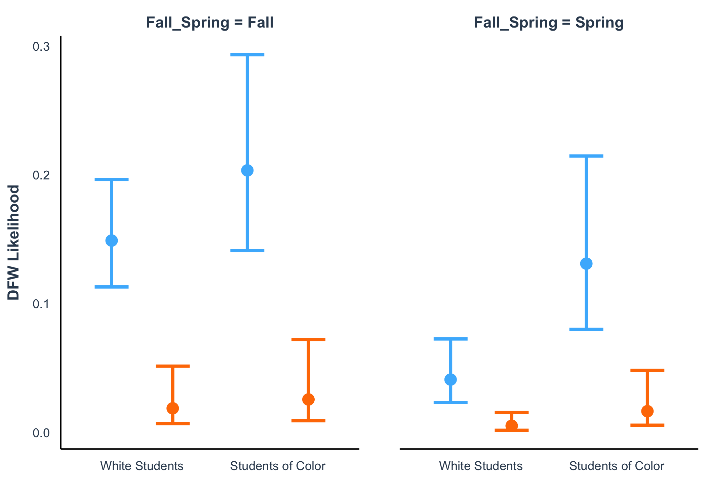
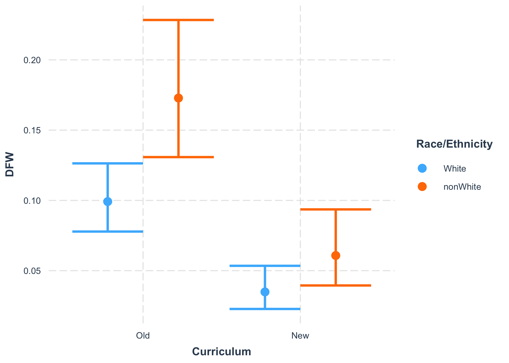
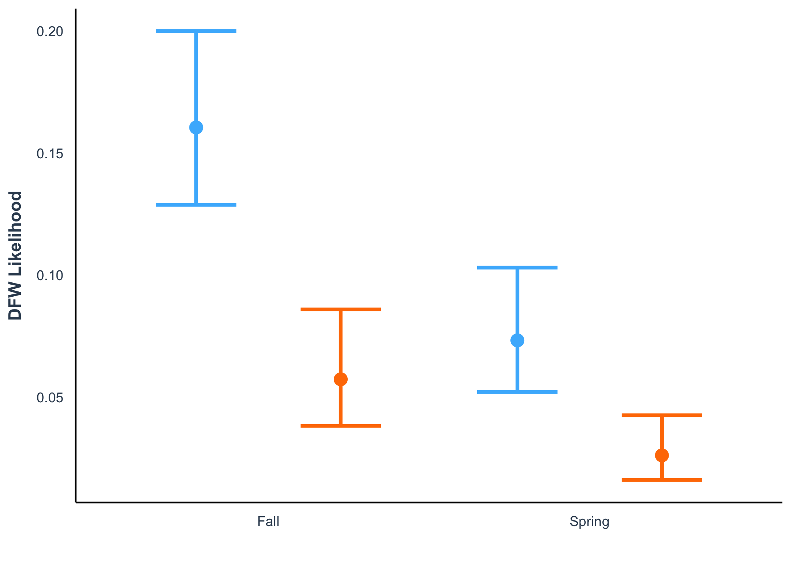

IMPORTANT NOTE

This Rmd uses the deidentified results and is safe to share.


We wish to determine if the new core classes (CURE Lab and BIO Seminar) are helping students to succeed academically.

## Loading Results

I asked the registrar to help me answer the following questions:
1. What was the DFW rate for first-year students in BIOL 205 and 206 from SP 2017 to FA 2019?
2. What was the DFW rate for all students in BIOL 201 and 202 from FA 2021 to SP 2024?

They sent us the files located in the "Grade Outcomes" folder.
I have removed any identifying information for the students and instructors.

Note that the analysis 205 and 206 only includes first-year students in these Biology classes, even though there are other students in these classes.
This is to make it more comparable to 201 and 202 which are not taken by nearly as broad a spectrum of students.

Importing data for 205 and 206.


```
## Warning: There was 1 warning in `mutate()`.
## ℹ In argument: `across(Grade, str_replace, "D|F|W", "DFW")`.
## Caused by warning:
## ! The `...` argument of `across()` is deprecated as of dplyr 1.1.0.
## Supply arguments directly to `.fns` through an anonymous function instead.
## 
##   # Previously
##   across(a:b, mean, na.rm = TRUE)
## 
##   # Now
##   across(a:b, \(x) mean(x, na.rm = TRUE))
```

```
## [1] "Semester"       "Course"         "Gender"         "Grade"         
## [5] "Race/Ethnicity" "Curriculum"
```

```
## BIOL205 BIOL206 
##     470     390
```

```
##  DFW Pass 
##  104  756
```

```
##   Fall Term 2017-2018   Fall Term 2018-2019   Fall Term 2019-2020 
##                   149                   159                   162 
## Spring Term 2016-2017 Spring Term 2017-2018 Spring Term 2018-2019 
##                   119                   123                   148
```

```
## Female   Male 
##    633    227
```

```
## nonWhite    White 
##      254      606
```

Importing data from 201 and 202.
The spreadsheets have a very awkward format and were checked carefully. 
Before I imported the data, I consolidated it within excel to make the three years have a consistent format.


Converting Totals into Passes by subtracting each D, F, or W.


```
##  [1] "Course"                "Semester"              "D_Male_White"         
##  [4] "F_Female_White"        "W_Female_White"        "W_Male_White"         
##  [7] "Female_Total_White"    "Male_Total_White"      "D_Male_nonWhite"      
## [10] "F_Female_nonWhite"     "W_Female_nonWhite"     "W_Male_nonWhite"      
## [13] "Female_Total_nonWhite" "Male_Total_nonWhite"
```

```
##  [1] "Course"                "Semester"              "D_Female_White"       
##  [4] "F_Female_White"        "W_Female_White"        "W_Male_White"         
##  [7] "Female_Total_White"    "Male_Total_White"      "D_Female_nonWhite"    
## [10] "F_Female_nonWhite"     "W_Female_nonWhite"     "W_Male_nonWhite"      
## [13] "Female_Total_nonWhite" "Male_Total_nonWhite"
```

```
##  [1] "Course"                "Semester"              "D_Female_White"       
##  [4] "D_Male_White"          "F_Female_White"        "F_Male_White"         
##  [7] "W_Female_White"        "Female_Total_White"    "Male_Total_White"     
## [10] "D_Female_nonWhite"     "D_Male_nonWhite"       "F_Female_nonWhite"    
## [13] "F_Male_nonWhite"       "W_Female_nonWhite"     "Female_Total_nonWhite"
## [16] "Male_Total_nonWhite"
```

Now pivoting the table and splitting the categories


``` r
names(DFW_21_22)
```

```
##  [1] "Course"               "Semester"             "D_Male_White"        
##  [4] "F_Female_White"       "W_Female_White"       "W_Male_White"        
##  [7] "D_Male_nonWhite"      "F_Female_nonWhite"    "W_Female_nonWhite"   
## [10] "W_Male_nonWhite"      "Pass_Female_White"    "Pass_Male_White"     
## [13] "Pass_Female_nonWhite" "Pass_Male_nonWhite"
```

``` r
DFW_21_22_long <- DFW_21_22 %>%
  pivot_longer(cols = D_Male_White:Pass_Male_nonWhite, 
               names_to = "Group", values_to = "Count") %>%
  separate_wider_delim(Group, delim = "_", names = c("Grade", "Gender", "Race/Ethnicity")) %>%
  mutate(across(Grade, str_replace, 'D|F|W', 'DFW')) %>%
  uncount(weights = Count) 
summary(as.factor(DFW_21_22_long$Grade))
```

```
##  DFW Pass 
##    9  320
```

``` r
names(DFW_22_23)
```

```
##  [1] "Course"               "Semester"             "D_Female_White"      
##  [4] "F_Female_White"       "W_Female_White"       "W_Male_White"        
##  [7] "D_Female_nonWhite"    "F_Female_nonWhite"    "W_Female_nonWhite"   
## [10] "W_Male_nonWhite"      "Pass_Female_White"    "Pass_Male_White"     
## [13] "Pass_Female_nonWhite" "Pass_Male_nonWhite"
```

``` r
DFW_22_23_long <- DFW_22_23 %>%
  pivot_longer(cols = D_Female_White:Pass_Male_nonWhite, 
               names_to = "Group", values_to = "Count") %>%
  separate_wider_delim(Group, delim = "_", names = c("Grade", "Gender", "Race/Ethnicity")) %>%
  mutate(across(Grade, str_replace, 'D|F|W', 'DFW')) %>%
  uncount(weights = Count) 
summary(as.factor(DFW_22_23_long$Grade))
```

```
##  DFW Pass 
##   10  272
```

``` r
names(DFW_23_24)
```

```
##  [1] "Course"               "Semester"             "D_Female_White"      
##  [4] "D_Male_White"         "F_Female_White"       "F_Male_White"        
##  [7] "W_Female_White"       "D_Female_nonWhite"    "D_Male_nonWhite"     
## [10] "F_Female_nonWhite"    "F_Male_nonWhite"      "W_Female_nonWhite"   
## [13] "Pass_Female_White"    "Pass_Male_White"      "Pass_Female_nonWhite"
## [16] "Pass_Male_nonWhite"
```

``` r
DFW_23_24_long <- DFW_23_24 %>%
  pivot_longer(cols = D_Female_White:Pass_Male_nonWhite, 
               names_to = "Group", values_to = "Count") %>%
  separate_wider_delim(Group, delim = "_", names = c("Grade", "Gender", "Race/Ethnicity")) %>%
  mutate(across(Grade, str_replace, 'D|F|W', 'DFW')) %>%
  uncount(weights = Count) 
summary(as.factor(DFW_23_24_long$Grade))
```

```
##  DFW Pass 
##   10  258
```

``` r
DFW_201_202 <- DFW_21_22_long %>%
  add_row(DFW_22_23_long) %>%
  add_row(DFW_23_24_long) %>%
  mutate(Curriculum = "New")
```

Combining the two datasets


``` r
All_DFW <- BIOL205_206 %>%
  select(names(DFW_201_202)) %>%
  add_row(DFW_201_202) %>%
  mutate_if(is.character, as.factor) %>%
  mutate(Curriculum = fct_relevel(Curriculum, c("Old", "New"))) %>%
  mutate(`Race/Ethnicity` = fct_relevel(`Race/Ethnicity`, c("White", "nonWhite")))

Only202_DFW <- All_DFW %>%
  filter(Course != "BIOL201")

summary(All_DFW)
```

```
##      Course                   Semester    Grade         Gender    
##  BIOL201:569   Spring 2022        :180   DFW : 133   Female:1251  
##  BIOL202:310   Fall Term 2019-2020:162   Pass:1606   Male  : 488  
##  BIOL205:470   Fall Term 2018-2019:159                            
##  BIOL206:390   Fall 2021          :149                            
##                Fall 2022          :149                            
##                Fall Term 2017-2018:149                            
##                (Other)            :791                            
##   Race/Ethnicity Curriculum
##  White   :1202   Old:860   
##  nonWhite: 537   New:879   
##                            
##                            
##                            
##                            
## 
```

``` r
summary(Only202_DFW)
```

```
##      Course                     Semester    Grade         Gender   
##  BIOL201:  0   Fall Term 2019-2020  :162   DFW : 108   Female:850  
##  BIOL202:310   Fall Term 2018-2019  :159   Pass:1062   Male  :320  
##  BIOL205:470   Fall Term 2017-2018  :149                           
##  BIOL206:390   Spring Term 2018-2019:148                           
##                Spring Term 2017-2018:123                           
##                Spring Term 2016-2017:119                           
##                (Other)              :310                           
##   Race/Ethnicity Curriculum
##  White   :832    Old:860   
##  nonWhite:338    New:310   
##                            
##                            
##                            
##                            
## 
```

``` r
All_DFW %>%
  group_by(Curriculum, Grade) %>%
  summarise(n = n())
```

```
## `summarise()` has grouped output by 'Curriculum'. You can override using the
## `.groups` argument.
```

```
## # A tibble: 4 × 3
## # Groups:   Curriculum [2]
##   Curriculum Grade     n
##   <fct>      <fct> <int>
## 1 Old        DFW     104
## 2 Old        Pass    756
## 3 New        DFW      29
## 4 New        Pass    850
```

``` r
Only202_DFW %>%
  group_by(Curriculum, Grade) %>%
  summarise(n = n())
```

```
## `summarise()` has grouped output by 'Curriculum'. You can override using the
## `.groups` argument.
```

```
## # A tibble: 4 × 3
## # Groups:   Curriculum [2]
##   Curriculum Grade     n
##   <fct>      <fct> <int>
## 1 Old        DFW     104
## 2 Old        Pass    756
## 3 New        DFW       4
## 4 New        Pass    306
```

``` r
Only202_DFW %>%
  group_by(Course, Grade) %>%
  summarise(n = n())
```

```
## `summarise()` has grouped output by 'Course'. You can override using the
## `.groups` argument.
```

```
## # A tibble: 6 × 3
## # Groups:   Course [3]
##   Course  Grade     n
##   <fct>   <fct> <int>
## 1 BIOL202 DFW       4
## 2 BIOL202 Pass    306
## 3 BIOL205 DFW      77
## 4 BIOL205 Pass    393
## 5 BIOL206 DFW      27
## 6 BIOL206 Pass    363
```

## Modeling results with negative binomial glm

### Both 201 and 202


```
## Warning in theta.ml(Y, mu, sum(w), w, limit = control$maxit, trace =
## control$trace > : iteration limit reached
## Warning in theta.ml(Y, mu, sum(w), w, limit = control$maxit, trace =
## control$trace > : iteration limit reached
```

```
## 
## Call:
## glm.nb(formula = DFW ~ Curriculum, data = All_DFW, init.theta = 1340.369534, 
##     link = log)
## 
## Coefficients:
##               Estimate Std. Error z value Pr(>|z|)    
## (Intercept)   -2.11254    0.09806 -21.543  < 2e-16 ***
## CurriculumNew -1.29895    0.21000  -6.185 6.19e-10 ***
## ---
## Signif. codes:  0 '***' 0.001 '**' 0.01 '*' 0.05 '.' 0.1 ' ' 1
## 
## (Dispersion parameter for Negative Binomial(1340.37) family taken to be 1)
## 
##     Null deviance: 683.72  on 1738  degrees of freedom
## Residual deviance: 637.19  on 1737  degrees of freedom
## AIC: 909.29
## 
## Number of Fisher Scoring iterations: 1
## 
## 
##               Theta:  1340 
##           Std. Err.:  7261 
## Warning while fitting theta: iteration limit reached 
## 
##  2 x log-likelihood:  -903.285
```

```
## Warning in theta.ml(Y, mu, sum(w), w, limit = control$maxit, trace =
## control$trace > : iteration limit reached
## Warning in theta.ml(Y, mu, sum(w), w, limit = control$maxit, trace =
## control$trace > : iteration limit reached
```

```
## 
## Call:
## glm.nb(formula = DFW ~ Curriculum * Gender * `Race/Ethnicity`, 
##     data = All_DFW, init.theta = 1122.190149, link = log)
## 
## Coefficients:
##                                                   Estimate Std. Error z value
## (Intercept)                                       -2.29604    0.14745 -15.572
## CurriculumNew                                     -1.80068    0.40571  -4.438
## GenderMale                                         0.06468    0.29025   0.223
## `Race/Ethnicity`nonWhite                           0.38365    0.24537   1.564
## CurriculumNew:GenderMale                           0.47669    0.65354   0.729
## CurriculumNew:`Race/Ethnicity`nonWhite             0.91477    0.53517   1.709
## GenderMale:`Race/Ethnicity`nonWhite                0.26358    0.43038   0.612
## CurriculumNew:GenderMale:`Race/Ethnicity`nonWhite -0.85157    0.90080  -0.945
##                                                   Pr(>|z|)    
## (Intercept)                                        < 2e-16 ***
## CurriculumNew                                     9.07e-06 ***
## GenderMale                                          0.8236    
## `Race/Ethnicity`nonWhite                            0.1179    
## CurriculumNew:GenderMale                            0.4658    
## CurriculumNew:`Race/Ethnicity`nonWhite              0.0874 .  
## GenderMale:`Race/Ethnicity`nonWhite                 0.5402    
## CurriculumNew:GenderMale:`Race/Ethnicity`nonWhite   0.3445    
## ---
## Signif. codes:  0 '***' 0.001 '**' 0.01 '*' 0.05 '.' 0.1 ' ' 1
## 
## (Dispersion parameter for Negative Binomial(1122.19) family taken to be 1)
## 
##     Null deviance: 683.70  on 1738  degrees of freedom
## Residual deviance: 621.19  on 1731  degrees of freedom
## AIC: 905.3
## 
## Number of Fisher Scoring iterations: 1
## 
## 
##               Theta:  1122 
##           Std. Err.:  5328 
## Warning while fitting theta: iteration limit reached 
## 
##  2 x log-likelihood:  -887.304
```

Very interesting. 


``` r
selected_model <- model_full %>%
  stepAIC(direction = "backward")
```

```
## Start:  AIC=903.3
## DFW ~ Curriculum * Gender * `Race/Ethnicity`
```

```
## Warning in theta.ml(Y, mu, sum(w), w, limit = control$maxit, trace =
## control$trace > : iteration limit reached
## Warning in theta.ml(Y, mu, sum(w), w, limit = control$maxit, trace =
## control$trace > : iteration limit reached
```

```
##                                      Df   AIC
## - Curriculum:Gender:`Race/Ethnicity`  1 902.2
## <none>                                  903.3
```

```
## Warning in theta.ml(Y, mu, sum(w), w, limit = control$maxit, trace =
## control$trace > : iteration limit reached
## Warning in theta.ml(Y, mu, sum(w), w, limit = control$maxit, trace =
## control$trace > : iteration limit reached
```

```
## 
## Step:  AIC=902.2
## DFW ~ Curriculum + Gender + `Race/Ethnicity` + Curriculum:Gender + 
##     Curriculum:`Race/Ethnicity` + Gender:`Race/Ethnicity`
```

```
## Warning in theta.ml(Y, mu, sum(w), w, limit = control$maxit, trace =
## control$trace > : iteration limit reached
## Warning in theta.ml(Y, mu, sum(w), w, limit = control$maxit, trace =
## control$trace > : iteration limit reached
## Warning in theta.ml(Y, mu, sum(w), w, limit = control$maxit, trace =
## control$trace > : iteration limit reached
## Warning in theta.ml(Y, mu, sum(w), w, limit = control$maxit, trace =
## control$trace > : iteration limit reached
## Warning in theta.ml(Y, mu, sum(w), w, limit = control$maxit, trace =
## control$trace > : iteration limit reached
## Warning in theta.ml(Y, mu, sum(w), w, limit = control$maxit, trace =
## control$trace > : iteration limit reached
```

```
##                               Df    AIC
## - Curriculum:Gender            1 900.20
## - Gender:`Race/Ethnicity`      1 900.23
## <none>                           902.20
## - Curriculum:`Race/Ethnicity`  1 902.34
```

```
## Warning in theta.ml(Y, mu, sum(w), w, limit = control$maxit, trace =
## control$trace > : iteration limit reached
## Warning in theta.ml(Y, mu, sum(w), w, limit = control$maxit, trace =
## control$trace > : iteration limit reached
```

```
## 
## Step:  AIC=900.2
## DFW ~ Curriculum + Gender + `Race/Ethnicity` + Curriculum:`Race/Ethnicity` + 
##     Gender:`Race/Ethnicity`
```

```
## Warning in theta.ml(Y, mu, sum(w), w, limit = control$maxit, trace =
## control$trace > : iteration limit reached
## Warning in theta.ml(Y, mu, sum(w), w, limit = control$maxit, trace =
## control$trace > : iteration limit reached
## Warning in theta.ml(Y, mu, sum(w), w, limit = control$maxit, trace =
## control$trace > : iteration limit reached
## Warning in theta.ml(Y, mu, sum(w), w, limit = control$maxit, trace =
## control$trace > : iteration limit reached
```

```
##                               Df    AIC
## - Gender:`Race/Ethnicity`      1 898.24
## <none>                           900.20
## - Curriculum:`Race/Ethnicity`  1 900.35
```

```
## Warning in theta.ml(Y, mu, sum(w), w, limit = control$maxit, trace =
## control$trace > : iteration limit reached
## Warning in theta.ml(Y, mu, sum(w), w, limit = control$maxit, trace =
## control$trace > : iteration limit reached
```

```
## 
## Step:  AIC=898.24
## DFW ~ Curriculum + Gender + `Race/Ethnicity` + Curriculum:`Race/Ethnicity`
```

```
## Warning in theta.ml(Y, mu, sum(w), w, limit = control$maxit, trace =
## control$trace > : iteration limit reached
## Warning in theta.ml(Y, mu, sum(w), w, limit = control$maxit, trace =
## control$trace > : iteration limit reached
## Warning in theta.ml(Y, mu, sum(w), w, limit = control$maxit, trace =
## control$trace > : iteration limit reached
## Warning in theta.ml(Y, mu, sum(w), w, limit = control$maxit, trace =
## control$trace > : iteration limit reached
```

```
##                               Df    AIC
## - Gender                       1 897.22
## <none>                           898.24
## - Curriculum:`Race/Ethnicity`  1 898.40
```

```
## Warning in theta.ml(Y, mu, sum(w), w, limit = control$maxit, trace =
## control$trace > : iteration limit reached
## Warning in theta.ml(Y, mu, sum(w), w, limit = control$maxit, trace =
## control$trace > : iteration limit reached
```

```
## 
## Step:  AIC=897.22
## DFW ~ Curriculum + `Race/Ethnicity` + Curriculum:`Race/Ethnicity`
```

```
## Warning in theta.ml(Y, mu, sum(w), w, limit = control$maxit, trace =
## control$trace > : iteration limit reached
## Warning in theta.ml(Y, mu, sum(w), w, limit = control$maxit, trace =
## control$trace > : iteration limit reached
```

```
##                               Df    AIC
## <none>                           897.22
## - Curriculum:`Race/Ethnicity`  1 897.31
```

``` r
summary(selected_model)
```

```
## 
## Call:
## glm.nb(formula = DFW ~ Curriculum + `Race/Ethnicity` + Curriculum:`Race/Ethnicity`, 
##     data = All_DFW, init.theta = 1155.721611, link = log)
## 
## Coefficients:
##                                        Estimate Std. Error z value Pr(>|z|)    
## (Intercept)                             -2.2797     0.1270 -17.950  < 2e-16 ***
## CurriculumNew                           -1.6256     0.3154  -5.154 2.54e-07 ***
## `Race/Ethnicity`nonWhite                 0.4801     0.1999   2.402   0.0163 *  
## CurriculumNew:`Race/Ethnicity`nonWhite   0.6130     0.4267   1.437   0.1509    
## ---
## Signif. codes:  0 '***' 0.001 '**' 0.01 '*' 0.05 '.' 0.1 ' ' 1
## 
## (Dispersion parameter for Negative Binomial(1155.722) family taken to be 1)
## 
##     Null deviance: 683.7  on 1738  degrees of freedom
## Residual deviance: 623.1  on 1735  degrees of freedom
## AIC: 899.22
## 
## Number of Fisher Scoring iterations: 1
## 
## 
##               Theta:  1156 
##           Std. Err.:  5607 
## Warning while fitting theta: iteration limit reached 
## 
##  2 x log-likelihood:  -889.217
```


```
##          1          2          3          4 
## 0.10231023 0.02013423 0.16535433 0.06007067
```

```
## 
## Call:  glm.nb(formula = DFW ~ Curriculum + `Race/Ethnicity` + Curriculum:`Race/Ethnicity`, 
##     data = All_DFW, init.theta = 1155.721611, link = log)
## 
## Coefficients:
##                            (Intercept)                           CurriculumNew  
##                                -2.2797                                 -1.6256  
##               `Race/Ethnicity`nonWhite  CurriculumNew:`Race/Ethnicity`nonWhite  
##                                 0.4801                                  0.6130  
## 
## Degrees of Freedom: 1738 Total (i.e. Null);  1735 Residual
## Null Deviance:	    683.7 
## Residual Deviance: 623.1 	AIC: 899.2
```

```
## # Check for zero-inflation
## 
##    Observed zeros: 1606
##   Predicted zeros: 1614
##             Ratio: 1.01
```

```
## Model seems ok, ratio of observed and predicted zeros is within the
##   tolerance range (p = 0.512).
```

```
## # Overdispersion test
## 
##  dispersion ratio = 0.902
##           p-value = 0.312
```

```
## No overdispersion detected.
```

```
## # Indices of model performance
## 
## AIC     |    AICc |     BIC | Nagelkerke's R2 |  RMSE | Sigma | Score_log | Score_spherical
## -------------------------------------------------------------------------------------------
## 899.217 | 899.251 | 926.522 |           0.105 | 0.261 | 1.000 |    -0.257 |           0.023
```

```
## 
## Call:
## glm.nb(formula = DFW ~ Curriculum + `Race/Ethnicity` + Curriculum:`Race/Ethnicity`, 
##     data = All_DFW, init.theta = 1155.721611, link = log)
## 
## Coefficients:
##                                        Estimate Std. Error z value Pr(>|z|)    
## (Intercept)                             -2.2797     0.1270 -17.950  < 2e-16 ***
## CurriculumNew                           -1.6256     0.3154  -5.154 2.54e-07 ***
## `Race/Ethnicity`nonWhite                 0.4801     0.1999   2.402   0.0163 *  
## CurriculumNew:`Race/Ethnicity`nonWhite   0.6130     0.4267   1.437   0.1509    
## ---
## Signif. codes:  0 '***' 0.001 '**' 0.01 '*' 0.05 '.' 0.1 ' ' 1
## 
## (Dispersion parameter for Negative Binomial(1155.722) family taken to be 1)
## 
##     Null deviance: 683.7  on 1738  degrees of freedom
## Residual deviance: 623.1  on 1735  degrees of freedom
## AIC: 899.22
## 
## Number of Fisher Scoring iterations: 1
## 
## 
##               Theta:  1156 
##           Std. Err.:  5607 
## Warning while fitting theta: iteration limit reached 
## 
##  2 x log-likelihood:  -889.217
```


```
## [1] 0.1023149
```

```
## [1] 0.140254
```

```
## [1] 0.07463841
```


```
## [1] 0.1967936
```

```
## [1] 0.2234428
```

```
## [1] 0.1733227
```

```
## [1] 5.081467
```

```
## [1] 4.475419
```

```
## [1] 5.769584
```

The model indicates that students under the old curriculum were 5.1-fold (4.4 - 5.8) more likely to earn a DFW in the first two Biology courses (p = 2.54e-07).

<!-- -->

### Only 202


```
## Warning in theta.ml(Y, mu, sum(w), w, limit = control$maxit, trace =
## control$trace > : iteration limit reached
## Warning in theta.ml(Y, mu, sum(w), w, limit = control$maxit, trace =
## control$trace > : iteration limit reached
```

```
## 
## Call:
## glm.nb(formula = DFW ~ Curriculum, data = Only202_DFW, init.theta = 1072.208091, 
##     link = log)
## 
## Coefficients:
##               Estimate Std. Error z value Pr(>|z|)    
## (Intercept)   -2.11254    0.09806 -21.543  < 2e-16 ***
## CurriculumNew -2.23774    0.50953  -4.392 1.12e-05 ***
## ---
## Signif. codes:  0 '***' 0.001 '**' 0.01 '*' 0.05 '.' 0.1 ' ' 1
## 
## (Dispersion parameter for Negative Binomial(1072.208) family taken to be 1)
## 
##     Null deviance: 514.56  on 1169  degrees of freedom
## Residual deviance: 474.12  on 1168  degrees of freedom
## AIC: 696.22
## 
## Number of Fisher Scoring iterations: 1
## 
## 
##               Theta:  1072 
##           Std. Err.:  5378 
## Warning while fitting theta: iteration limit reached 
## 
##  2 x log-likelihood:  -690.223
```

```
## Warning in theta.ml(Y, mu, sum(w), w, limit = control$maxit, trace =
## control$trace > : iteration limit reached
## Warning in theta.ml(Y, mu, sum(w), w, limit = control$maxit, trace =
## control$trace > : iteration limit reached
## Warning in theta.ml(Y, mu, sum(w), w, limit = control$maxit, trace =
## control$trace > : iteration limit reached
## Warning in theta.ml(Y, mu, sum(w), w, limit = control$maxit, trace =
## control$trace > : iteration limit reached
## Warning in theta.ml(Y, mu, sum(w), w, limit = control$maxit, trace =
## control$trace > : iteration limit reached
## Warning in theta.ml(Y, mu, sum(w), w, limit = control$maxit, trace =
## control$trace > : iteration limit reached
## Warning in theta.ml(Y, mu, sum(w), w, limit = control$maxit, trace =
## control$trace > : iteration limit reached
## Warning in theta.ml(Y, mu, sum(w), w, limit = control$maxit, trace =
## control$trace > : iteration limit reached
## Warning in theta.ml(Y, mu, sum(w), w, limit = control$maxit, trace =
## control$trace > : iteration limit reached
## Warning in theta.ml(Y, mu, sum(w), w, limit = control$maxit, trace =
## control$trace > : iteration limit reached
## Warning in theta.ml(Y, mu, sum(w), w, limit = control$maxit, trace =
## control$trace > : iteration limit reached
## Warning in theta.ml(Y, mu, sum(w), w, limit = control$maxit, trace =
## control$trace > : iteration limit reached
## Warning in theta.ml(Y, mu, sum(w), w, limit = control$maxit, trace =
## control$trace > : iteration limit reached
## Warning in theta.ml(Y, mu, sum(w), w, limit = control$maxit, trace =
## control$trace > : iteration limit reached
## Warning in theta.ml(Y, mu, sum(w), w, limit = control$maxit, trace =
## control$trace > : iteration limit reached
## Warning in theta.ml(Y, mu, sum(w), w, limit = control$maxit, trace =
## control$trace > : iteration limit reached
## Warning in theta.ml(Y, mu, sum(w), w, limit = control$maxit, trace =
## control$trace > : iteration limit reached
## Warning in theta.ml(Y, mu, sum(w), w, limit = control$maxit, trace =
## control$trace > : iteration limit reached
## Warning in theta.ml(Y, mu, sum(w), w, limit = control$maxit, trace =
## control$trace > : iteration limit reached
## Warning in theta.ml(Y, mu, sum(w), w, limit = control$maxit, trace =
## control$trace > : iteration limit reached
## Warning in theta.ml(Y, mu, sum(w), w, limit = control$maxit, trace =
## control$trace > : iteration limit reached
## Warning in theta.ml(Y, mu, sum(w), w, limit = control$maxit, trace =
## control$trace > : iteration limit reached
## Warning in theta.ml(Y, mu, sum(w), w, limit = control$maxit, trace =
## control$trace > : iteration limit reached
## Warning in theta.ml(Y, mu, sum(w), w, limit = control$maxit, trace =
## control$trace > : iteration limit reached
## Warning in theta.ml(Y, mu, sum(w), w, limit = control$maxit, trace =
## control$trace > : iteration limit reached
## Warning in theta.ml(Y, mu, sum(w), w, limit = control$maxit, trace =
## control$trace > : iteration limit reached
```

```
## Warning in glm.nb(DFW ~ Curriculum * Gender * `Race/Ethnicity`, data =
## Only202_DFW): alternation limit reached
```

```
## 
## Call:
## glm.nb(formula = DFW ~ Curriculum * Gender * `Race/Ethnicity`, 
##     data = Only202_DFW, init.theta = 1013.870275, link = log)
## 
## Coefficients:
##                                                     Estimate Std. Error z value
## (Intercept)                                       -2.296e+00  1.474e-01 -15.572
## CurriculumNew                                     -2.760e+00  1.011e+00  -2.731
## GenderMale                                         6.468e-02  2.903e-01   0.223
## `Race/Ethnicity`nonWhite                           3.836e-01  2.454e-01   1.564
## CurriculumNew:GenderMale                          -3.201e+01  8.079e+06   0.000
## CurriculumNew:`Race/Ethnicity`nonWhite             1.271e+00  1.249e+00   1.018
## GenderMale:`Race/Ethnicity`nonWhite                2.636e-01  4.304e-01   0.612
## CurriculumNew:GenderMale:`Race/Ethnicity`nonWhite  3.190e+01  8.079e+06   0.000
##                                                   Pr(>|z|)    
## (Intercept)                                        < 2e-16 ***
## CurriculumNew                                      0.00632 ** 
## GenderMale                                         0.82365    
## `Race/Ethnicity`nonWhite                           0.11792    
## CurriculumNew:GenderMale                           1.00000    
## CurriculumNew:`Race/Ethnicity`nonWhite             0.30875    
## GenderMale:`Race/Ethnicity`nonWhite                0.54025    
## CurriculumNew:GenderMale:`Race/Ethnicity`nonWhite  1.00000    
## ---
## Signif. codes:  0 '***' 0.001 '**' 0.01 '*' 0.05 '.' 0.1 ' ' 1
## 
## (Dispersion parameter for Negative Binomial(1013.87) family taken to be 1)
## 
##     Null deviance: 514.55  on 1169  degrees of freedom
## Residual deviance: 462.76  on 1162  degrees of freedom
## AIC: 696.86
## 
## Number of Fisher Scoring iterations: 1
## 
## 
##               Theta:  1014 
##           Std. Err.:  4768 
## Warning while fitting theta: alternation limit reached 
## 
##  2 x log-likelihood:  -678.862
```

Very interesting. 


``` r
selected_model_202 <- model_full_202 %>%
  stepAIC(direction = "backward")
```

```
## Start:  AIC=694.86
## DFW ~ Curriculum * Gender * `Race/Ethnicity`
```

```
## Warning in theta.ml(Y, mu, sum(w), w, limit = control$maxit, trace =
## control$trace > : iteration limit reached
## Warning in theta.ml(Y, mu, sum(w), w, limit = control$maxit, trace =
## control$trace > : iteration limit reached
```

```
##                                      Df    AIC
## - Curriculum:Gender:`Race/Ethnicity`  1 693.46
## <none>                                  694.86
```

```
## Warning in theta.ml(Y, mu, sum(w), w, limit = control$maxit, trace =
## control$trace > : iteration limit reached
## Warning in theta.ml(Y, mu, sum(w), w, limit = control$maxit, trace =
## control$trace > : iteration limit reached
```

```
## 
## Step:  AIC=693.46
## DFW ~ Curriculum + Gender + `Race/Ethnicity` + Curriculum:Gender + 
##     Curriculum:`Race/Ethnicity` + Gender:`Race/Ethnicity`
```

```
## Warning in theta.ml(Y, mu, sum(w), w, limit = control$maxit, trace =
## control$trace > : iteration limit reached
## Warning in theta.ml(Y, mu, sum(w), w, limit = control$maxit, trace =
## control$trace > : iteration limit reached
## Warning in theta.ml(Y, mu, sum(w), w, limit = control$maxit, trace =
## control$trace > : iteration limit reached
## Warning in theta.ml(Y, mu, sum(w), w, limit = control$maxit, trace =
## control$trace > : iteration limit reached
## Warning in theta.ml(Y, mu, sum(w), w, limit = control$maxit, trace =
## control$trace > : iteration limit reached
## Warning in theta.ml(Y, mu, sum(w), w, limit = control$maxit, trace =
## control$trace > : iteration limit reached
```

```
##                               Df    AIC
## - Curriculum:Gender            1 691.64
## - Gender:`Race/Ethnicity`      1 691.97
## <none>                           693.46
## - Curriculum:`Race/Ethnicity`  1 693.77
```

```
## Warning in theta.ml(Y, mu, sum(w), w, limit = control$maxit, trace =
## control$trace > : iteration limit reached
## Warning in theta.ml(Y, mu, sum(w), w, limit = control$maxit, trace =
## control$trace > : iteration limit reached
```

```
## 
## Step:  AIC=691.64
## DFW ~ Curriculum + Gender + `Race/Ethnicity` + Curriculum:`Race/Ethnicity` + 
##     Gender:`Race/Ethnicity`
```

```
## Warning in theta.ml(Y, mu, sum(w), w, limit = control$maxit, trace =
## control$trace > : iteration limit reached
## Warning in theta.ml(Y, mu, sum(w), w, limit = control$maxit, trace =
## control$trace > : iteration limit reached
## Warning in theta.ml(Y, mu, sum(w), w, limit = control$maxit, trace =
## control$trace > : iteration limit reached
## Warning in theta.ml(Y, mu, sum(w), w, limit = control$maxit, trace =
## control$trace > : iteration limit reached
```

```
##                               Df    AIC
## - Gender:`Race/Ethnicity`      1 690.09
## <none>                           691.64
## - Curriculum:`Race/Ethnicity`  1 691.89
```

```
## Warning in theta.ml(Y, mu, sum(w), w, limit = control$maxit, trace =
## control$trace > : iteration limit reached
## Warning in theta.ml(Y, mu, sum(w), w, limit = control$maxit, trace =
## control$trace > : iteration limit reached
```

```
## 
## Step:  AIC=690.09
## DFW ~ Curriculum + Gender + `Race/Ethnicity` + Curriculum:`Race/Ethnicity`
```

```
## Warning in theta.ml(Y, mu, sum(w), w, limit = control$maxit, trace =
## control$trace > : iteration limit reached
## Warning in theta.ml(Y, mu, sum(w), w, limit = control$maxit, trace =
## control$trace > : iteration limit reached
## Warning in theta.ml(Y, mu, sum(w), w, limit = control$maxit, trace =
## control$trace > : iteration limit reached
## Warning in theta.ml(Y, mu, sum(w), w, limit = control$maxit, trace =
## control$trace > : iteration limit reached
```

```
##                               Df    AIC
## - Gender                       1 688.71
## <none>                           690.09
## - Curriculum:`Race/Ethnicity`  1 690.36
```

```
## Warning in theta.ml(Y, mu, sum(w), w, limit = control$maxit, trace =
## control$trace > : iteration limit reached
## Warning in theta.ml(Y, mu, sum(w), w, limit = control$maxit, trace =
## control$trace > : iteration limit reached
```

```
## 
## Step:  AIC=688.71
## DFW ~ Curriculum + `Race/Ethnicity` + Curriculum:`Race/Ethnicity`
```

```
## Warning in theta.ml(Y, mu, sum(w), w, limit = control$maxit, trace =
## control$trace > : iteration limit reached
## Warning in theta.ml(Y, mu, sum(w), w, limit = control$maxit, trace =
## control$trace > : iteration limit reached
```

```
##                               Df    AIC
## <none>                           688.71
## - Curriculum:`Race/Ethnicity`  1 688.94
```

``` r
summary(selected_model_202)
```

```
## 
## Call:
## glm.nb(formula = DFW ~ Curriculum + `Race/Ethnicity` + Curriculum:`Race/Ethnicity`, 
##     data = Only202_DFW, init.theta = 674.5377523, link = log)
## 
## Coefficients:
##                                        Estimate Std. Error z value Pr(>|z|)    
## (Intercept)                             -2.2797     0.1270 -17.949  < 2e-16 ***
## CurriculumNew                           -3.1408     1.0080  -3.116  0.00183 ** 
## `Race/Ethnicity`nonWhite                 0.4801     0.1999   2.402  0.01631 *  
## CurriculumNew:`Race/Ethnicity`nonWhite   1.6082     1.1719   1.372  0.16995    
## ---
## Signif. codes:  0 '***' 0.001 '**' 0.01 '*' 0.05 '.' 0.1 ' ' 1
## 
## (Dispersion parameter for Negative Binomial(674.5378) family taken to be 1)
## 
##     Null deviance: 514.50  on 1169  degrees of freedom
## Residual deviance: 464.55  on 1166  degrees of freedom
## AIC: 690.71
## 
## Number of Fisher Scoring iterations: 1
## 
## 
##               Theta:  675 
##           Std. Err.:  2605 
## Warning while fitting theta: iteration limit reached 
## 
##  2 x log-likelihood:  -680.714
```


```
##           1           2           3           4 
## 0.102310231 0.004424779 0.165354331 0.035714286
```

```
## 
## Call:  glm.nb(formula = DFW ~ Curriculum + `Race/Ethnicity` + Curriculum:`Race/Ethnicity`, 
##     data = Only202_DFW, init.theta = 674.5377523, link = log)
## 
## Coefficients:
##                            (Intercept)                           CurriculumNew  
##                                -2.2797                                 -3.1408  
##               `Race/Ethnicity`nonWhite  CurriculumNew:`Race/Ethnicity`nonWhite  
##                                 0.4801                                  1.6082  
## 
## Degrees of Freedom: 1169 Total (i.e. Null);  1166 Residual
## Null Deviance:	    514.5 
## Residual Deviance: 464.6 	AIC: 690.7
```

```
## # Check for zero-inflation
## 
##    Observed zeros: 1062
##   Predicted zeros: 1069
##             Ratio: 1.01
```

```
## Model seems ok, ratio of observed and predicted zeros is within the
##   tolerance range (p = 0.472).
```

```
## # Overdispersion test
## 
##  dispersion ratio = 0.882
##           p-value = 0.264
```

```
## No overdispersion detected.
```

```
## # Indices of model performance
## 
## AIC     |    AICc |     BIC | Nagelkerke's R2 |  RMSE | Sigma | Score_log | Score_spherical
## -------------------------------------------------------------------------------------------
## 690.714 | 690.766 | 716.038 |           0.117 | 0.284 | 1.000 |    -0.293 |           0.028
```

```
## 
## Call:
## glm.nb(formula = DFW ~ Curriculum + `Race/Ethnicity` + Curriculum:`Race/Ethnicity`, 
##     data = Only202_DFW, init.theta = 674.5377523, link = log)
## 
## Coefficients:
##                                        Estimate Std. Error z value Pr(>|z|)    
## (Intercept)                             -2.2797     0.1270 -17.949  < 2e-16 ***
## CurriculumNew                           -3.1408     1.0080  -3.116  0.00183 ** 
## `Race/Ethnicity`nonWhite                 0.4801     0.1999   2.402  0.01631 *  
## CurriculumNew:`Race/Ethnicity`nonWhite   1.6082     1.1719   1.372  0.16995    
## ---
## Signif. codes:  0 '***' 0.001 '**' 0.01 '*' 0.05 '.' 0.1 ' ' 1
## 
## (Dispersion parameter for Negative Binomial(674.5378) family taken to be 1)
## 
##     Null deviance: 514.50  on 1169  degrees of freedom
## Residual deviance: 464.55  on 1166  degrees of freedom
## AIC: 690.71
## 
## Number of Fisher Scoring iterations: 1
## 
## 
##               Theta:  675 
##           Std. Err.:  2605 
## Warning while fitting theta: iteration limit reached 
## 
##  2 x log-likelihood:  -680.714
```


```
## [1] 0.1023149
```

```
## [1] 0.1161701
```

```
## [1] 0.09011217
```


```
## [1] 0.04324819
```

```
## [1] 0.118505
```

```
## [1] 0.01578335
```

```
## [1] 23.12236
```

```
## [1] 8.438968
```

```
## [1] 63.35793
```

The model indicates that students under the old curriculum were 23.1-fold (8.4 - 63.4) more likely to earn a DFW in the first two Biology courses (p = 0.00183), compared to CURE Lab.


```
## [1] 1.616236
```

```
## [1] 1.973878
```

```
## [1] 1.323394
```

<!-- -->


## Figure 9

<!-- --><!-- -->

### Only 201


```
##      Course                   Semester    Grade         Gender    
##  BIOL201:569   Spring 2022        :180   DFW : 133   Female:1251  
##  BIOL202:310   Fall Term 2019-2020:162   Pass:1606   Male  : 488  
##  BIOL205:470   Fall Term 2018-2019:159                            
##  BIOL206:390   Fall 2021          :149                            
##                Fall 2022          :149                            
##                Fall Term 2017-2018:149                            
##                (Other)            :791                            
##   Race/Ethnicity Curriculum    DFW         
##  White   :1202   Old:860    Mode :logical  
##  nonWhite: 537   New:879    FALSE:1606     
##                             TRUE :133      
##                                            
##                                            
##                                            
## 
```

```
##      Course                     Semester    Grade         Gender    
##  BIOL201:569   Fall Term 2019-2020  :162   DFW : 129   Female:1034  
##  BIOL202:  0   Fall Term 2018-2019  :159   Pass:1300   Male  : 395  
##  BIOL205:470   Fall Term 2017-2018  :149                            
##  BIOL206:390   Spring Term 2018-2019:148                            
##                Spring Term 2017-2018:123                            
##                Spring 2022          :119                            
##                (Other)              :569                            
##   Race/Ethnicity Curriculum    DFW         
##  White   :976    Old:860    Mode :logical  
##  nonWhite:453    New:569    FALSE:1300     
##                             TRUE :129      
##                                            
##                                            
##                                            
## 
```

```
## `summarise()` has grouped output by 'Curriculum'. You can override using the
## `.groups` argument.
```

```
## # A tibble: 4 × 3
## # Groups:   Curriculum [2]
##   Curriculum Grade     n
##   <fct>      <fct> <int>
## 1 Old        DFW     104
## 2 Old        Pass    756
## 3 New        DFW      29
## 4 New        Pass    850
```

```
## `summarise()` has grouped output by 'Curriculum'. You can override using the
## `.groups` argument.
```

```
## # A tibble: 4 × 3
## # Groups:   Curriculum [2]
##   Curriculum Grade     n
##   <fct>      <fct> <int>
## 1 Old        DFW     104
## 2 Old        Pass    756
## 3 New        DFW      25
## 4 New        Pass    544
```

```
## `summarise()` has grouped output by 'Course'. You can override using the
## `.groups` argument.
```

```
## # A tibble: 6 × 3
## # Groups:   Course [3]
##   Course  Grade     n
##   <fct>   <fct> <int>
## 1 BIOL201 DFW      25
## 2 BIOL201 Pass    544
## 3 BIOL205 DFW      77
## 4 BIOL205 Pass    393
## 5 BIOL206 DFW      27
## 6 BIOL206 Pass    363
```

```
## Warning in theta.ml(Y, mu, sum(w), w, limit = control$maxit, trace =
## control$trace > : iteration limit reached
## Warning in theta.ml(Y, mu, sum(w), w, limit = control$maxit, trace =
## control$trace > : iteration limit reached
```

```
## 
## Call:
## glm.nb(formula = DFW ~ Curriculum, data = Only201_DFW, init.theta = 1757.638637, 
##     link = log)
## 
## Coefficients:
##               Estimate Std. Error z value Pr(>|z|)    
## (Intercept)   -2.11254    0.09806 -21.543  < 2e-16 ***
## CurriculumNew -1.01246    0.22275  -4.545 5.49e-06 ***
## ---
## Signif. codes:  0 '***' 0.001 '**' 0.01 '*' 0.05 '.' 0.1 ' ' 1
## 
## (Dispersion parameter for Negative Binomial(1757.639) family taken to be 1)
## 
##     Null deviance: 620.40  on 1428  degrees of freedom
## Residual deviance: 595.59  on 1427  degrees of freedom
## AIC: 859.67
## 
## Number of Fisher Scoring iterations: 1
## 
## 
##               Theta:  1758 
##           Std. Err.:  10847 
## Warning while fitting theta: iteration limit reached 
## 
##  2 x log-likelihood:  -853.667
```

```
## Warning in theta.ml(Y, mu, sum(w), w, limit = control$maxit, trace =
## control$trace > : iteration limit reached
## Warning in theta.ml(Y, mu, sum(w), w, limit = control$maxit, trace =
## control$trace > : iteration limit reached
```

```
## 
## Call:
## glm.nb(formula = DFW ~ Curriculum * Gender * `Race/Ethnicity`, 
##     data = Only201_DFW, init.theta = 1537.93187, link = log)
## 
## Coefficients:
##                                                   Estimate Std. Error z value
## (Intercept)                                       -2.29604    0.14745 -15.572
## CurriculumNew                                     -1.48815    0.43406  -3.428
## GenderMale                                         0.06468    0.29025   0.223
## `Race/Ethnicity`nonWhite                           0.38365    0.24537   1.564
## CurriculumNew:GenderMale                           0.66550    0.67151   0.991
## CurriculumNew:`Race/Ethnicity`nonWhite             0.78314    0.57173   1.370
## GenderMale:`Race/Ethnicity`nonWhite                0.26358    0.43037   0.612
## CurriculumNew:GenderMale:`Race/Ethnicity`nonWhite -1.11722    0.94969  -1.176
##                                                   Pr(>|z|)    
## (Intercept)                                        < 2e-16 ***
## CurriculumNew                                     0.000607 ***
## GenderMale                                        0.823646    
## `Race/Ethnicity`nonWhite                          0.117915    
## CurriculumNew:GenderMale                          0.321655    
## CurriculumNew:`Race/Ethnicity`nonWhite            0.170761    
## GenderMale:`Race/Ethnicity`nonWhite               0.540236    
## CurriculumNew:GenderMale:`Race/Ethnicity`nonWhite 0.239434    
## ---
## Signif. codes:  0 '***' 0.001 '**' 0.01 '*' 0.05 '.' 0.1 ' ' 1
## 
## (Dispersion parameter for Negative Binomial(1537.932) family taken to be 1)
## 
##     Null deviance: 620.39  on 1428  degrees of freedom
## Residual deviance: 582.93  on 1421  degrees of freedom
## AIC: 859.01
## 
## Number of Fisher Scoring iterations: 1
## 
## 
##               Theta:  1538 
##           Std. Err.:  8525 
## Warning while fitting theta: iteration limit reached 
## 
##  2 x log-likelihood:  -841.01
```

Very interesting. 


``` r
selected_model_201 <- model_full_201 %>%
  stepAIC(direction = "backward")
```

```
## Start:  AIC=857.01
## DFW ~ Curriculum * Gender * `Race/Ethnicity`
```

```
## Warning in theta.ml(Y, mu, sum(w), w, limit = control$maxit, trace =
## control$trace > : iteration limit reached
## Warning in theta.ml(Y, mu, sum(w), w, limit = control$maxit, trace =
## control$trace > : iteration limit reached
```

```
##                                      Df    AIC
## - Curriculum:Gender:`Race/Ethnicity`  1 856.41
## <none>                                  857.01
```

```
## Warning in theta.ml(Y, mu, sum(w), w, limit = control$maxit, trace =
## control$trace > : iteration limit reached
## Warning in theta.ml(Y, mu, sum(w), w, limit = control$maxit, trace =
## control$trace > : iteration limit reached
```

```
## 
## Step:  AIC=856.41
## DFW ~ Curriculum + Gender + `Race/Ethnicity` + Curriculum:Gender + 
##     Curriculum:`Race/Ethnicity` + Gender:`Race/Ethnicity`
```

```
## Warning in theta.ml(Y, mu, sum(w), w, limit = control$maxit, trace =
## control$trace > : iteration limit reached
## Warning in theta.ml(Y, mu, sum(w), w, limit = control$maxit, trace =
## control$trace > : iteration limit reached
## Warning in theta.ml(Y, mu, sum(w), w, limit = control$maxit, trace =
## control$trace > : iteration limit reached
## Warning in theta.ml(Y, mu, sum(w), w, limit = control$maxit, trace =
## control$trace > : iteration limit reached
## Warning in theta.ml(Y, mu, sum(w), w, limit = control$maxit, trace =
## control$trace > : iteration limit reached
## Warning in theta.ml(Y, mu, sum(w), w, limit = control$maxit, trace =
## control$trace > : iteration limit reached
```

```
##                               Df    AIC
## - Gender:`Race/Ethnicity`      1 854.42
## - Curriculum:Gender            1 854.44
## - Curriculum:`Race/Ethnicity`  1 855.14
## <none>                           856.41
```

```
## Warning in theta.ml(Y, mu, sum(w), w, limit = control$maxit, trace =
## control$trace > : iteration limit reached
## Warning in theta.ml(Y, mu, sum(w), w, limit = control$maxit, trace =
## control$trace > : iteration limit reached
```

```
## 
## Step:  AIC=854.42
## DFW ~ Curriculum + Gender + `Race/Ethnicity` + Curriculum:Gender + 
##     Curriculum:`Race/Ethnicity`
```

```
## Warning in theta.ml(Y, mu, sum(w), w, limit = control$maxit, trace =
## control$trace > : iteration limit reached
## Warning in theta.ml(Y, mu, sum(w), w, limit = control$maxit, trace =
## control$trace > : iteration limit reached
## Warning in theta.ml(Y, mu, sum(w), w, limit = control$maxit, trace =
## control$trace > : iteration limit reached
## Warning in theta.ml(Y, mu, sum(w), w, limit = control$maxit, trace =
## control$trace > : iteration limit reached
```

```
##                               Df    AIC
## - Curriculum:Gender            1 852.45
## - Curriculum:`Race/Ethnicity`  1 853.15
## <none>                           854.42
```

```
## Warning in theta.ml(Y, mu, sum(w), w, limit = control$maxit, trace =
## control$trace > : iteration limit reached
## Warning in theta.ml(Y, mu, sum(w), w, limit = control$maxit, trace =
## control$trace > : iteration limit reached
```

```
## 
## Step:  AIC=852.45
## DFW ~ Curriculum + Gender + `Race/Ethnicity` + Curriculum:`Race/Ethnicity`
```

```
## Warning in theta.ml(Y, mu, sum(w), w, limit = control$maxit, trace =
## control$trace > : iteration limit reached
## Warning in theta.ml(Y, mu, sum(w), w, limit = control$maxit, trace =
## control$trace > : iteration limit reached
## Warning in theta.ml(Y, mu, sum(w), w, limit = control$maxit, trace =
## control$trace > : iteration limit reached
## Warning in theta.ml(Y, mu, sum(w), w, limit = control$maxit, trace =
## control$trace > : iteration limit reached
```

```
##                               Df    AIC
## - Curriculum:`Race/Ethnicity`  1 851.20
## - Gender                       1 851.53
## <none>                           852.45
```

```
## Warning in theta.ml(Y, mu, sum(w), w, limit = control$maxit, trace =
## control$trace > : iteration limit reached
## Warning in theta.ml(Y, mu, sum(w), w, limit = control$maxit, trace =
## control$trace > : iteration limit reached
```

```
## 
## Step:  AIC=851.2
## DFW ~ Curriculum + Gender + `Race/Ethnicity`
```

```
## Warning in theta.ml(Y, mu, sum(w), w, limit = control$maxit, trace =
## control$trace > : iteration limit reached
## Warning in theta.ml(Y, mu, sum(w), w, limit = control$maxit, trace =
## control$trace > : iteration limit reached
## Warning in theta.ml(Y, mu, sum(w), w, limit = control$maxit, trace =
## control$trace > : iteration limit reached
## Warning in theta.ml(Y, mu, sum(w), w, limit = control$maxit, trace =
## control$trace > : iteration limit reached
## Warning in theta.ml(Y, mu, sum(w), w, limit = control$maxit, trace =
## control$trace > : iteration limit reached
## Warning in theta.ml(Y, mu, sum(w), w, limit = control$maxit, trace =
## control$trace > : iteration limit reached
```

```
##                    Df    AIC
## - Gender            1 850.26
## <none>                851.20
## - `Race/Ethnicity`  1 858.22
## - Curriculum        1 875.93
```

```
## Warning in theta.ml(Y, mu, sum(w), w, limit = control$maxit, trace =
## control$trace > : iteration limit reached
## Warning in theta.ml(Y, mu, sum(w), w, limit = control$maxit, trace =
## control$trace > : iteration limit reached
```

```
## 
## Step:  AIC=850.26
## DFW ~ Curriculum + `Race/Ethnicity`
```

```
## Warning in theta.ml(Y, mu, sum(w), w, limit = control$maxit, trace =
## control$trace > : iteration limit reached
## Warning in theta.ml(Y, mu, sum(w), w, limit = control$maxit, trace =
## control$trace > : iteration limit reached
## Warning in theta.ml(Y, mu, sum(w), w, limit = control$maxit, trace =
## control$trace > : iteration limit reached
## Warning in theta.ml(Y, mu, sum(w), w, limit = control$maxit, trace =
## control$trace > : iteration limit reached
```

```
##                    Df    AIC
## <none>                850.26
## - `Race/Ethnicity`  1 857.67
## - Curriculum        1 874.73
```

``` r
summary(selected_model_201)
```

```
## 
## Call:
## glm.nb(formula = DFW ~ Curriculum + `Race/Ethnicity`, data = Only201_DFW, 
##     init.theta = 1750.814417, link = log)
## 
## Coefficients:
##                          Estimate Std. Error z value Pr(>|z|)    
## (Intercept)               -2.3109     0.1235 -18.711  < 2e-16 ***
## CurriculumNew             -1.0451     0.2230  -4.686 2.79e-06 ***
## `Race/Ethnicity`nonWhite   0.5556     0.1779   3.124  0.00179 ** 
## ---
## Signif. codes:  0 '***' 0.001 '**' 0.01 '*' 0.05 '.' 0.1 ' ' 1
## 
## (Dispersion parameter for Negative Binomial(1750.814) family taken to be 1)
## 
##     Null deviance: 620.40  on 1428  degrees of freedom
## Residual deviance: 586.18  on 1426  degrees of freedom
## AIC: 852.26
## 
## Number of Fisher Scoring iterations: 1
## 
## 
##               Theta:  1751 
##           Std. Err.:  10454 
## Warning while fitting theta: iteration limit reached 
## 
##  2 x log-likelihood:  -844.255
```


```
##          1          2          3          4 
## 0.09916886 0.03487460 0.17284942 0.06078577
```

```
## 
## Call:  glm.nb(formula = DFW ~ Curriculum + `Race/Ethnicity`, data = Only201_DFW, 
##     init.theta = 1750.814417, link = log)
## 
## Coefficients:
##              (Intercept)             CurriculumNew  `Race/Ethnicity`nonWhite  
##                  -2.3109                   -1.0451                    0.5556  
## 
## Degrees of Freedom: 1428 Total (i.e. Null);  1426 Residual
## Null Deviance:	    620.4 
## Residual Deviance: 586.2 	AIC: 852.3
```

```
## # Check for zero-inflation
## 
##    Observed zeros: 1300
##   Predicted zeros: 1307
##             Ratio: 1.01
```

```
## Model seems ok, ratio of observed and predicted zeros is within the
##   tolerance range (p = 0.504).
```

```
## # Overdispersion test
## 
##  dispersion ratio = 0.889
##           p-value =  0.24
```

```
## No overdispersion detected.
```

```
## # Indices of model performance
## 
## AIC     |    AICc |     BIC | Nagelkerke's R2 |  RMSE | Sigma | Score_log | Score_spherical
## -------------------------------------------------------------------------------------------
## 852.255 | 852.283 | 873.314 |           0.067 | 0.283 | 1.000 |    -0.297 |           0.025
```

```
## 
## Call:
## glm.nb(formula = DFW ~ Curriculum + `Race/Ethnicity`, data = Only201_DFW, 
##     init.theta = 1750.814417, link = log)
## 
## Coefficients:
##                          Estimate Std. Error z value Pr(>|z|)    
## (Intercept)               -2.3109     0.1235 -18.711  < 2e-16 ***
## CurriculumNew             -1.0451     0.2230  -4.686 2.79e-06 ***
## `Race/Ethnicity`nonWhite   0.5556     0.1779   3.124  0.00179 ** 
## ---
## Signif. codes:  0 '***' 0.001 '**' 0.01 '*' 0.05 '.' 0.1 ' ' 1
## 
## (Dispersion parameter for Negative Binomial(1750.814) family taken to be 1)
## 
##     Null deviance: 620.40  on 1428  degrees of freedom
## Residual deviance: 586.18  on 1426  degrees of freedom
## AIC: 852.26
## 
## Number of Fisher Scoring iterations: 1
## 
## 
##               Theta:  1751 
##           Std. Err.:  10454 
## Warning while fitting theta: iteration limit reached 
## 
##  2 x log-likelihood:  -844.255
```


```
## [1] 0.09917196
```

```
## [1] 0.1122081
```

```
## [1] 0.08765032
```


```
## [1] 0.3516567
```

```
## [1] 0.4395077
```

```
## [1] 0.2813657
```

```
## [1] 2.843683
```

```
## [1] 2.275273
```

```
## [1] 3.554093
```

The model indicates that students under the old curriculum were 2.84-fold (2.27 - 3.55) more likely to earn a DFW in the first two Biology courses (p = 2.79e-06), compared to BIOL 201.


```
## [1] 1.742986
```

```
## [1] 2.082356
```

```
## [1] 1.458925
```


```
## Warning: Curriculum and Race/Ethnicity are not included in an interaction with one
## another in the model.
```

<!-- -->


## Figure 9 201 version


```
## Warning: Race/Ethnicity and Curriculum are not included in an interaction with one
## another in the model.
```

<!-- --><!-- -->
