IMPORTANT NOTE

This Rmd uses the deidentified results and is safe to share.


## Loading Results

Loading in the results without instructor information:


``` r
NoDemographicsYear1 <- read_delim("Deidentified Surveys/Year1.NoDemographics.tsv", 
    delim = "\t", escape_double = FALSE, 
    trim_ws = TRUE) %>%
  rename(Semester = Semester_pre)
```

```
## Rows: 85 Columns: 151
## ── Column specification ────────────────────────────────────────────────────────
## Delimiter: "\t"
## chr (141): ResponseId_pre, Instructor, Semester_pre, Q1_pre, Q8_pre, Q9_1_pr...
## dbl  (10): Q19_1_pre, Q19_2_pre, Q19_3_pre, Q19_4_pre, Q19_5_pre, Q19_6_pre,...
## 
## ℹ Use `spec()` to retrieve the full column specification for this data.
## ℹ Specify the column types or set `show_col_types = FALSE` to quiet this message.
```

``` r
NoDemographicsYear2 <- read_delim("Deidentified Surveys/Year2.NoDemographics.tsv", 
    delim = "\t", escape_double = FALSE, 
    trim_ws = TRUE)
```

```
## Rows: 77 Columns: 151
## ── Column specification ────────────────────────────────────────────────────────
## Delimiter: "\t"
## chr (141): ResponseId_pre, Instructor, Semester, Q1_pre, Q8_pre, Q9_1_pre, Q...
## dbl  (10): Q19_1_pre, Q19_2_pre, Q19_3_pre, Q19_4_pre, Q19_5_pre, Q19_6_pre,...
## 
## ℹ Use `spec()` to retrieve the full column specification for this data.
## ℹ Specify the column types or set `show_col_types = FALSE` to quiet this message.
```

``` r
NoDemographicsYear3 <- read_delim("Deidentified Surveys/Year3.NoDemographics.tsv", 
    delim = "\t", escape_double = FALSE, 
    trim_ws = TRUE)
```

```
## Rows: 63 Columns: 151
## ── Column specification ────────────────────────────────────────────────────────
## Delimiter: "\t"
## chr (141): ResponseId_pre, Instructor, Semester, Q1_pre, Q8_pre, Q9_1_pre, Q...
## dbl  (10): Q19_1_pre, Q19_2_pre, Q19_3_pre, Q19_4_pre, Q19_5_pre, Q19_6_pre,...
## 
## ℹ Use `spec()` to retrieve the full column specification for this data.
## ℹ Specify the column types or set `show_col_types = FALSE` to quiet this message.
```

``` r
NoDemographics <- bind_rows(NoDemographicsYear1, NoDemographicsYear2, NoDemographicsYear3)

NoDemographicsQuestions <- read_delim("Deidentified Surveys/Year3.NoDemographicsQuestions.tsv", 
    delim = "\t", escape_double = FALSE, 
    trim_ws = TRUE)
```

```
## Rows: 151 Columns: 2
## ── Column specification ────────────────────────────────────────────────────────
## Delimiter: "\t"
## chr (2): value, Question
## 
## ℹ Use `spec()` to retrieve the full column specification for this data.
## ℹ Specify the column types or set `show_col_types = FALSE` to quiet this message.
```

Cleaning up the factors and removing anyone who did not agree to the informed consent.


``` r
NoDemographics <- NoDemographics %>%
  mutate(Semester = factor(Semester, levels = c("Fall 2021", "Spring 2022",
                                                "Fall 2022", "Spring 2023",
                                                "Fall 2023", "Spring 2024"))) %>%
  mutate(across(Instructor, str_replace, 'Prof. ', ''))
```

```
## Warning: There was 1 warning in `mutate()`.
## ℹ In argument: `across(Instructor, str_replace, "Prof. ", "")`.
## Caused by warning:
## ! The `...` argument of `across()` is deprecated as of dplyr 1.1.0.
## Supply arguments directly to `.fns` through an anonymous function instead.
## 
##   # Previously
##   across(a:b, mean, na.rm = TRUE)
## 
##   # Now
##   across(a:b, \(x) mean(x, na.rm = TRUE))
```

``` r
NoDemographics <- NoDemographics %>%
  filter(Q1_pre == "Agree")
```

We have hypothesized that instructors may be less successful in improving learning elements during the first time
that they have taught the class. To test this hypothesis, we will need to code a new variable, that I will call Rookie.
To do this, I logged into Cognos and ran a "Class Info by Term and Instructor" report. Note that I had to identify the 
instructor pseudonyms using the Deidentification Rmd, but I have not included that information here.

- 'McGonagall' 'Fall 2021'
- 'Dumbledore' 'Fall 2021'
- 'Hagrid' 'Spring 2022'
- 'Lupin' 'Fall 2021'
- 'Sinistra' 'Spring 2022'


``` r
NoDemographics <- NoDemographics %>%
  mutate(Rookie = case_when((Instructor == 'McGonagall') & (Semester == 'Fall 2021') ~ "Rookie", 
                     (Instructor == 'Dumbledore') & (Semester == 'Fall 2021') ~ "Rookie",
                     (Instructor == 'Hagrid') & (Semester == 'Spring 2022') ~ "Rookie",
                     (Instructor == 'Lupin') & (Semester == 'Fall 2021') ~ "Rookie",
                     (Instructor == 'Sinistra') & (Semester == 'Spring 2022') ~ "Rookie",
                     .default = "Veteran"))
```

## Improvement in learning elements

Comparing the responses to Pre10 and Post9:


```
## [1] "Please look over this inventory of elements that might be included in a course. For each element, give an estimate of your current level of ability before the course begins. Your current level of ability may be a result of courses in high school or college, or it may be a result of other experiences such as jobs or special programs. If students are expected to do the following course elements, what would be their level of expertise? - A scripted lab or project in which the students know the expected outcome"
```

```
##  [1] "A scripted lab or project in which the students know the expected outcome"                         
##  [2] "A lab or project in which only the instructor knows the outcome"                                   
##  [3] "A lab or project where no one knows the outcome"                                                   
##  [4] "At least one project that is assigned and structured by the instructor"                            
##  [5] "A project in which students have some input into the research process and/or what is being studied"
##  [6] "A project entirely of student design"                                                              
##  [7] "Work individually"                                                                                 
##  [8] "Work as a whole class"                                                                             
##  [9] "Work in small groups"                                                                              
## [10] "Become responsible for a part of the project"                                                      
## [11] "Read primary scientific literature"                                                                
## [12] "Write a research proposal"                                                                         
## [13] "Collect data"                                                                                      
## [14] "Analyze data"                                                                                      
## [15] "Present results orally"                                                                            
## [16] "Present results in written papers or reports"                                                      
## [17] "Present posters"                                                                                   
## [18] "Critique the work of other students"                                                               
## [19] "Listen to lectures"                                                                                
## [20] "Read a textbook"                                                                                   
## [21] "Work on problem sets"                                                                              
## [22] "Take tests in class"                                                                               
## [23] "Discuss reading materials in class"                                                                
## [24] "Maintain a lab notebook"                                                                           
## [25] "Computer modeling"
```


```
## [1] "Please rate how much learning you gained from each element you experienced in this course. The scale measuring your gain is from (no or very small gain) to (very large gain). Some elements may not have happened at all. If the item is not relevant or you prefer not to answer, please choose the \"\"not applicable\"\" option. If students were expected to do the following course elements, what would be their level of gained experience? - A scripted lab or project in which the students know the expected outcome"
```

```
##  [1] "A scripted lab or project in which the students know the expected outcome"                         
##  [2] "A lab or project in which only the instructor knows the outcome"                                   
##  [3] "A lab or project where no one knows the outcome"                                                   
##  [4] "At least one project that is assigned and structured by the instructor"                            
##  [5] "A project in which students have some input into the research process and/or what is being studied"
##  [6] "A project entirely of student design"                                                              
##  [7] "Work individually"                                                                                 
##  [8] "Work as a whole class"                                                                             
##  [9] "Work in small groups"                                                                              
## [10] "Become responsible for a part of the project"                                                      
## [11] "Read primary scientific literature"                                                                
## [12] "Write a research proposal"                                                                         
## [13] "Collect data"                                                                                      
## [14] "Analyze data"                                                                                      
## [15] "Present results orally"                                                                            
## [16] "Present results in written papers or reports"                                                      
## [17] "Present posters"                                                                                   
## [18] "Critique the work of other students"                                                               
## [19] "Listen to lectures"                                                                                
## [20] "Read a textbook"                                                                                   
## [21] "Work on problem sets"                                                                              
## [22] "Take tests in class"                                                                               
## [23] "Discuss reading materials in class"                                                                
## [24] "Maintain a lab notebook"                                                                           
## [25] "Computer modeling"
```

```
##  [1] TRUE TRUE TRUE TRUE TRUE TRUE TRUE TRUE TRUE TRUE TRUE TRUE TRUE TRUE TRUE
## [16] TRUE TRUE TRUE TRUE TRUE TRUE TRUE TRUE TRUE TRUE
```

Now to compare the pre and post responses for those questions:


```
## # A tibble: 6 × 53
##   Semester  Instructor Rookie Q10_1_pre Q10_2_pre Q10_3_pre Q10_4_pre Q10_5_pre
##   <fct>     <chr>      <chr>  <chr>     <chr>     <chr>     <chr>     <chr>    
## 1 Fall 2021 McGonagall Rookie Much      Some      None      Some      Extensive
## 2 Fall 2021 McGonagall Rookie Some      Much      None      Extensive Little   
## 3 Fall 2021 McGonagall Rookie Some      Much      None      Much      Some     
## 4 Fall 2021 McGonagall Rookie Little    Much      Little    Some      Some     
## 5 Fall 2021 McGonagall Rookie Some      Some      Little    Much      Much     
## 6 Fall 2021 McGonagall Rookie Some      Much      Little    Much      Some     
## # ℹ 45 more variables: Q10_6_pre <chr>, Q10_7_pre <chr>, Q10_8_pre <chr>,
## #   Q10_9_pre <chr>, Q10_10_pre <chr>, Q10_11_pre <chr>, Q10_12_pre <chr>,
## #   Q10_13_pre <chr>, Q10_14_pre <chr>, Q10_15_pre <chr>, Q10_16_pre <chr>,
## #   Q10_17_pre <chr>, Q10_18_pre <chr>, Q10_19_pre <chr>, Q10_20_pre <chr>,
## #   Q10_21_pre <chr>, Q10_22_pre <chr>, Q10_23_pre <chr>, Q10_24_pre <chr>,
## #   Q10_25_pre <chr>, Q9_1_post <chr>, Q9_2_post <chr>, Q9_3_post <chr>,
## #   Q9_4_post <chr>, Q9_5_post <chr>, Q9_6_post <chr>, Q9_7_post <chr>, …
```

```
## Warning: `funs()` was deprecated in dplyr 0.8.0.
## ℹ Please use a list of either functions or lambdas:
## 
## # Simple named list: list(mean = mean, median = median)
## 
## # Auto named with `tibble::lst()`: tibble::lst(mean, median)
## 
## # Using lambdas list(~ mean(., trim = .2), ~ median(., na.rm = TRUE))
## Call `lifecycle::last_lifecycle_warnings()` to see where this warning was
## generated.
```

### Classroom

To run a mixed effects model we need to use a random effect variable with at least 5 to 8 distinct levels.
We could use Instructor as the random effect, but that would barely meet this criteria and also would ignore the within-class clustering.
Therefore, we will generate a dummy-variable of classroom, that will be unique for each instructor:semester combination. 


``` r
Q10Clean <- Q10Clean |>
  mutate(Classroom = interaction(Instructor, Semester))
```


## Sample Size

### Table S1


``` r
Q10Clean %>%
  group_by(Instructor, Semester, Rookie) %>%
  count() %>%
  print()
```

```
## # A tibble: 14 × 4
## # Groups:   Instructor, Semester, Rookie [14]
##    Instructor Semester    Rookie      n
##    <chr>      <fct>       <chr>   <int>
##  1 Dumbledore Fall 2021   Rookie     15
##  2 Dumbledore Fall 2022   Veteran    24
##  3 Dumbledore Spring 2023 Veteran    11
##  4 Dumbledore Fall 2023   Veteran    20
##  5 Hagrid     Spring 2022 Rookie     16
##  6 Hagrid     Spring 2024 Veteran    19
##  7 Lupin      Fall 2021   Rookie     11
##  8 Lupin      Fall 2022   Veteran    13
##  9 McGonagall Fall 2021   Rookie      8
## 10 McGonagall Spring 2022 Veteran    25
## 11 Sinistra   Spring 2022 Rookie     10
## 12 Sinistra   Spring 2023 Veteran    28
## 13 Sinistra   Fall 2023   Veteran    10
## 14 Sinistra   Spring 2024 Veteran    14
```

First let's just look at the contingency tables to see if everything looks right.


```
## [1] "Rows represents pre-survey response, Columns represent post-survey response."
```

```
## [1] "First for All sections then by Instructor."
```

```
## [1] "A scripted lab or project in which the students know the expected outcome"
```

```
##            
##             None Little Some Much Extensive
##   None         1      1    0    0         0
##   Little       1      3    8    8         5
##   Some         3      7   21   40        14
##   Much         3      5   17   33        28
##   Extensive    1      4    4    6         2
```

```
## [1] "By Instructor"
```

```
## [1] "A scripted lab or project in which the students know the expected outcome"
```

```
## , ,  = Dumbledore
## 
##            
##             None Little Some Much Extensive
##   None         1      1    0    0         0
##   Little       1      0    3    3         3
##   Some         1      2    8    7         7
##   Much         1      1    3    8        10
##   Extensive    0      1    2    1         2
## 
## , ,  = Hagrid
## 
##            
##             None Little Some Much Extensive
##   None         0      0    0    0         0
##   Little       0      0    2    1         0
##   Some         0      1   10    5         0
##   Much         1      0    1    5         2
##   Extensive    1      2    0    2         0
## 
## , ,  = Lupin
## 
##            
##             None Little Some Much Extensive
##   None         0      0    0    0         0
##   Little       0      1    1    2         0
##   Some         0      1    1    2         2
##   Much         0      2    2    8         0
##   Extensive    0      0    0    1         0
## 
## , ,  = McGonagall
## 
##            
##             None Little Some Much Extensive
##   None         0      0    0    0         0
##   Little       0      1    0    1         1
##   Some         0      1    1    9         1
##   Much         0      0    6    7         4
##   Extensive    0      1    0    0         0
## 
## , ,  = Sinistra
## 
##            
##             None Little Some Much Extensive
##   None         0      0    0    0         0
##   Little       0      1    2    1         1
##   Some         2      2    1   17         4
##   Much         1      2    5    5        12
##   Extensive    0      0    2    2         0
```

Balloon Plot

On these plots, the answers on the x axis are the pre-survey results and on the y-axis
are the post survey results. 
Responses above the "none" level indicate students who felt that they increased in this element.


The pre-survey questions were asked as:
Please look over this inventory of elements that might be included in a course. For each element, give an estimate of your current level of ability before the course begins. Your current level of ability may be a result of courses in high school or college, or it may be a result of other experiences such as jobs or special programs. If students are expected to do the following course elements, what would be their level of expertise? 


The post-survey questions were asked: 
Please rate how much learning you gained from each element you experienced in this course. The scale measuring your gain is from (no or very small gain) to (very large gain). Some elements may not have happened at all. If the item is not relevant or you prefer not to answer, please choose the "not applicable" option. If students were expected to do the following course elements, what would be their level of gained experience? 


```
## Dumbledore     Hagrid      Lupin McGonagall   Sinistra 
##         70         35         24         33         62
```


After feedback from the reviewers we have adopted a simpler approach to the analysis. 
We are dropping the interaction term between Rookie and Instructor as that was heavily confounded by semester.
We considered using a mixed effects model with semester taught as a random effect. 
This did not significantly change the outcome of the analysis and did not match our a priori analysis plan, so it was not included.
We are going to report F-test results for all variables (no model selection) and then use an alpha cutoff of 0.05 to determine which visualizations to show.
Further reading also suggested to use an F-test for testing Gaussian GLMs, rather than an LRT or Chi-squared test

## Q10 Figures  {.tabset .tabset-pills}

### Q10_1

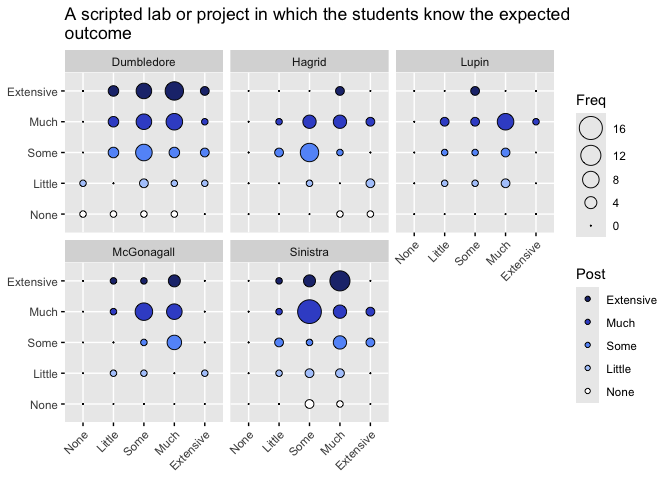<!-- -->

```
## [1] "Dumbledore" "Hagrid"     "Lupin"      "McGonagall" "Sinistra"
```

```
## 
## Call:
## glm(formula = Q9_1_post ~ Q10_1_pre + Instructor + Rookie, data = Q_1Clean)
## 
## Coefficients:
##                       Estimate Std. Error t value Pr(>|t|)    
## (Intercept)           3.542224   0.333345  10.626   <2e-16 ***
## Q10_1_pre             0.129947   0.086319   1.505   0.1337    
## InstructorHagrid     -0.545433   0.227678  -2.396   0.0175 *  
## InstructorLupin      -0.271429   0.256505  -1.058   0.2912    
## InstructorMcGonagall -0.003572   0.223378  -0.016   0.9873    
## InstructorSinistra    0.035753   0.186927   0.191   0.8485    
## RookieVeteran        -0.268776   0.170035  -1.581   0.1155    
## ---
## Signif. codes:  0 '***' 0.001 '**' 0.01 '*' 0.05 '.' 0.1 ' ' 1
## 
## (Dispersion parameter for gaussian family taken to be 1.091505)
## 
##     Null deviance: 238.49  on 214  degrees of freedom
## Residual deviance: 227.03  on 208  degrees of freedom
## AIC: 637.85
## 
## Number of Fisher Scoring iterations: 2
```

```
## Analysis of Deviance Table (Type III tests)
## 
## Response: Q9_1_post
## Error estimate based on Pearson residuals 
## 
##             Sum Sq  Df F values  Pr(>F)  
## Q10_1_pre    2.474   1   2.2663 0.13373  
## Instructor   8.682   4   1.9886 0.09749 .
## Rookie       2.727   1   2.4987 0.11546  
## Residuals  227.033 208                   
## ---
## Signif. codes:  0 '***' 0.001 '**' 0.01 '*' 0.05 '.' 0.1 ' ' 1
```

```
## Linear mixed model fit by REML ['lmerMod']
## Formula: Q9_1_post ~ Q10_1_pre + Instructor + (1 | Classroom)
##    Data: Q_1Clean
## 
## REML criterion at convergence: 636.1
## 
## Scaled residuals: 
##     Min      1Q  Median      3Q     Max 
## -2.7499 -0.6531  0.2393  0.6828  1.6012 
## 
## Random effects:
##  Groups    Name        Variance Std.Dev.
##  Classroom (Intercept) 0.0172   0.1311  
##  Residual              1.0888   1.0435  
## Number of obs: 215, groups:  Classroom, 14
## 
## Fixed effects:
##                       Estimate Std. Error t value
## (Intercept)           3.382302   0.321527  10.519
## Q10_1_pre             0.119039   0.086429   1.377
## InstructorHagrid     -0.490587   0.250976  -1.955
## InstructorLupin      -0.220865   0.278068  -0.794
## InstructorMcGonagall -0.008985   0.254591  -0.035
## InstructorSinistra   -0.002286   0.210941  -0.011
## 
## Correlation of Fixed Effects:
##             (Intr) Q10_1_ InstrH InstrL InstMG
## Q10_1_pre   -0.892                            
## InstrctrHgr -0.213 -0.055                     
## InstrctrLpn -0.202 -0.038  0.305              
## InstrctrMcG -0.214 -0.050  0.334  0.301       
## InstrctrSns -0.262 -0.056  0.403  0.363  0.397
```

```
## Analysis of Deviance Table (Type III Wald F tests with Kenward-Roger df)
## 
## Response: Q9_1_post
##                    F Df  Df.res Pr(>F)    
## (Intercept) 108.1635  1  89.603 <2e-16 ***
## Q10_1_pre     1.8577  1 208.754 0.1744    
## Instructor    1.2264  4   7.459 0.3765    
## ---
## Signif. codes:  0 '***' 0.001 '**' 0.01 '*' 0.05 '.' 0.1 ' ' 1
```

```
## # Comparison of Model Performance Indices
## 
## Name               | Model | AIC (weights) | BIC (weights) |  RMSE | Sigma
## --------------------------------------------------------------------------
## imp_model_Q10_1_ml |   gls | 638.4 (0.730) | 662.0 (0.936) | 1.034 | 1.034
## lme_model_Q10_1_ml |   lme | 640.4 (0.270) | 667.4 (0.064) | 1.031 | 1.032
## 
## Name               |    R2 | AICc (weights) | R2 (cond.) | R2 (marg.) |   ICC
## -----------------------------------------------------------------------------
## imp_model_Q10_1_ml | 0.037 |        (>.999) |            |            |      
## lme_model_Q10_1_ml |       |  641.1 (>.999) |      0.039 |      0.037 | 0.003
```

```
##                    Model df      AIC      BIC    logLik   Test    L.Ratio
## imp_model_Q10_1_ml     1  7 638.4193 662.0138 -312.2097                  
## lme_model_Q10_1_ml     2  8 640.4066 667.3717 -312.2033 1 vs 2 0.01267876
##                    p-value
## imp_model_Q10_1_ml        
## lme_model_Q10_1_ml  0.9103
```

```
## Warning in model.matrix.default(mt, mf, contrasts): variable 'Rookie' is
## absent, its contrast will be ignored
```

```
## 
## Call:
## glm(formula = Q9_1_post ~ Q10_1_pre + Instructor, data = Q_1Clean, 
##     contrasts = type3)
## 
## Coefficients:
##             Estimate Std. Error t value Pr(>|t|)    
## (Intercept)  3.23259    0.30681  10.536   <2e-16 ***
## Q10_1_pre    0.11931    0.08636   1.381   0.1686    
## Instructor1  0.12911    0.12679   1.018   0.3097    
## Instructor2 -0.34532    0.16118  -2.142   0.0333 *  
## Instructor3 -0.07716    0.18616  -0.414   0.6790    
## Instructor4  0.13953    0.16118   0.866   0.3877    
## ---
## Signif. codes:  0 '***' 0.001 '**' 0.01 '*' 0.05 '.' 0.1 ' ' 1
## 
## (Dispersion parameter for gaussian family taken to be 1.099332)
## 
##     Null deviance: 238.49  on 214  degrees of freedom
## Residual deviance: 229.76  on 209  degrees of freedom
## AIC: 638.42
## 
## Number of Fisher Scoring iterations: 2
```

```
## Analysis of Deviance Table (Type III tests)
## 
## Response: Q9_1_post
## Error estimate based on Pearson residuals 
## 
##             Sum Sq  Df F values Pr(>F)
## Q10_1_pre    2.098   1   1.9083 0.1686
## Instructor   6.836   4   1.5546 0.1877
## Residuals  229.760 209
```

Nothing met the alpha cutoff of 0.05

### Q10_2

<!-- -->

```
## 
## Call:
## glm(formula = as.numeric(Q9_2_post) ~ as.numeric(Q10_2_pre) + 
##     Instructor + Rookie, data = Q_2Clean)
## 
## Coefficients:
##                        Estimate Std. Error t value Pr(>|t|)    
## (Intercept)            4.039253   0.312766  12.915   <2e-16 ***
## as.numeric(Q10_2_pre) -0.062860   0.080667  -0.779   0.4367    
## InstructorHagrid      -0.478091   0.215539  -2.218   0.0276 *  
## InstructorLupin        0.009228   0.239845   0.038   0.9693    
## InstructorMcGonagall  -0.055219   0.214384  -0.258   0.7970    
## InstructorSinistra     0.010218   0.177923   0.057   0.9543    
## RookieVeteran         -0.193220   0.159466  -1.212   0.2270    
## ---
## Signif. codes:  0 '***' 0.001 '**' 0.01 '*' 0.05 '.' 0.1 ' ' 1
## 
## (Dispersion parameter for gaussian family taken to be 0.9872623)
## 
##     Null deviance: 212.96  on 214  degrees of freedom
## Residual deviance: 205.35  on 208  degrees of freedom
## AIC: 616.27
## 
## Number of Fisher Scoring iterations: 2
```

```
## Analysis of Deviance Table (Type III tests)
## 
## Response: as.numeric(Q9_2_post)
## Error estimate based on Pearson residuals 
## 
##                        Sum Sq  Df F values Pr(>F)
## as.numeric(Q10_2_pre)   0.600   1   0.6072 0.4367
## Instructor              6.107   4   1.5464 0.1900
## Rookie                  1.449   1   1.4681 0.2270
## Residuals             205.351 208
```

```
## boundary (singular) fit: see help('isSingular')
```

```
## Linear mixed model fit by REML. t-tests use Satterthwaite's method [
## lmerModLmerTest]
## Formula: as.numeric(Q9_2_post) ~ as.numeric(Q10_2_pre) + Instructor +  
##     (1 | Classroom)
##    Data: Q_2Clean
## 
## REML criterion at convergence: 614.3
## 
## Scaled residuals: 
##     Min      1Q  Median      3Q     Max 
## -2.8339 -0.6401  0.3042  0.4198  1.7429 
## 
## Random effects:
##  Groups    Name        Variance Std.Dev.
##  Classroom (Intercept) 0.0000   0.0000  
##  Residual              0.9895   0.9947  
## Number of obs: 215, groups:  Classroom, 14
## 
## Fixed effects:
##                         Estimate Std. Error         df t value Pr(>|t|)    
## (Intercept)            3.880e+00  2.840e-01  2.090e+02  13.661   <2e-16 ***
## as.numeric(Q10_2_pre) -6.073e-02  8.074e-02  2.090e+02  -0.752   0.4528    
## InstructorHagrid      -4.311e-01  2.123e-01  2.090e+02  -2.031   0.0435 *  
## InstructorLupin        5.762e-02  2.368e-01  2.090e+02   0.243   0.8080    
## InstructorMcGonagall  -4.777e-02  2.145e-01  2.090e+02  -0.223   0.8240    
## InstructorSinistra    -9.499e-04  1.779e-01  2.090e+02  -0.005   0.9957    
## ---
## Signif. codes:  0 '***' 0.001 '**' 0.01 '*' 0.05 '.' 0.1 ' ' 1
## 
## Correlation of Fixed Effects:
##             (Intr) a.(Q10 InstrH InstrL InstMG
## as.(Q10_2_) -0.904                            
## InstrctrHgr -0.171 -0.082                     
## InstrctrLpn -0.249  0.033  0.291              
## InstrctrMcG -0.165 -0.085  0.331  0.288       
## InstrctrSns -0.241 -0.057  0.396  0.349  0.392
## optimizer (nloptwrap) convergence code: 0 (OK)
## boundary (singular) fit: see help('isSingular')
```

```
## Analysis of Deviance Table (Type III Wald F tests with Kenward-Roger df)
## 
## Response: as.numeric(Q9_2_post)
##                              F Df  Df.res Pr(>F)    
## (Intercept)           182.9253  1  96.284 <2e-16 ***
## as.numeric(Q10_2_pre)   0.5586  1 208.852 0.4557    
## Instructor              1.3140  4   6.917 0.3530    
## ---
## Signif. codes:  0 '***' 0.001 '**' 0.01 '*' 0.05 '.' 0.1 ' ' 1
```

```
## Random effect variances not available. Returned R2 does not account for random effects.
```

```
## # Comparison of Model Performance Indices
## 
## Name             |           Model | AIC (weights) | AICc (weights)
## -------------------------------------------------------------------
## imp_model_Q10_2  |             glm | 616.3 (0.681) |  617.0 (0.681)
## lmer_model_Q10_2 | lmerModLmerTest | 617.8 (0.319) |  618.5 (0.319)
## 
## Name             | BIC (weights) |  RMSE | Sigma |    R2 | R2 (cond.) | R2 (marg.)
## ----------------------------------------------------------------------------------
## imp_model_Q10_2  | 643.2 (0.681) | 0.977 | 0.994 | 0.036 |            |           
## lmer_model_Q10_2 | 644.7 (0.319) | 0.981 | 0.995 |       |            |      0.028
```

```
## Random effect variances not available. Returned R2 does not account for random effects.
```

```
## # Comparison of Model Performance Indices
## 
## Name               | Model | AIC (weights) | BIC (weights) |  RMSE | Sigma
## --------------------------------------------------------------------------
## imp_model_Q10_2_ml |   gls | 615.8 (0.731) | 639.4 (0.936) | 0.981 | 0.981
## lme_model_Q10_2_ml |   lme | 617.8 (0.269) | 644.7 (0.064) | 0.981 | 0.981
## 
## Name               |    R2 | AICc (weights) | R2 (cond.) | R2 (marg.)
## ---------------------------------------------------------------------
## imp_model_Q10_2_ml | 0.029 |        (>.999) |            |           
## lme_model_Q10_2_ml |       |  618.5 (>.999) |            |      0.029
```

```
##                    Model df      AIC      BIC    logLik   Test      L.Ratio
## imp_model_Q10_2_ml     1  7 615.7831 639.3776 -300.8915                    
## lme_model_Q10_2_ml     2  8 617.7831 644.7482 -300.8915 1 vs 2 1.283995e-07
##                    p-value
## imp_model_Q10_2_ml        
## lme_model_Q10_2_ml  0.9997
```

Nothing met the cutoff

### Q10_3

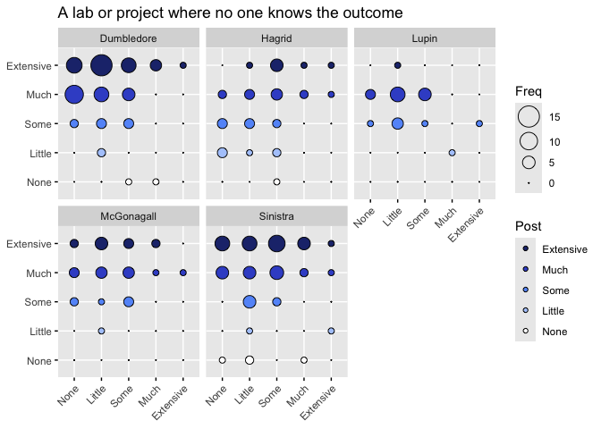<!-- -->

```
## 
## Call:
## glm(formula = as.numeric(Q9_3_post) ~ as.numeric(Q10_3_pre) + 
##     Instructor + Rookie, data = Q_3Clean)
## 
## Coefficients:
##                       Estimate Std. Error t value Pr(>|t|)    
## (Intercept)            4.24131    0.21269  19.942  < 2e-16 ***
## as.numeric(Q10_3_pre)  0.06987    0.06528   1.070 0.285616    
## InstructorHagrid      -0.74456    0.21278  -3.499 0.000567 ***
## InstructorLupin       -0.63399    0.24031  -2.638 0.008944 ** 
## InstructorMcGonagall  -0.14272    0.21437  -0.666 0.506279    
## InstructorSinistra    -0.16036    0.17696  -0.906 0.365830    
## RookieVeteran         -0.18606    0.15751  -1.181 0.238803    
## ---
## Signif. codes:  0 '***' 0.001 '**' 0.01 '*' 0.05 '.' 0.1 ' ' 1
## 
## (Dispersion parameter for gaussian family taken to be 1.00173)
## 
##     Null deviance: 231.93  on 221  degrees of freedom
## Residual deviance: 215.37  on 215  degrees of freedom
## AIC: 639.28
## 
## Number of Fisher Scoring iterations: 2
```

```
## Analysis of Deviance Table (Type III tests)
## 
## Response: as.numeric(Q9_3_post)
## Error estimate based on Pearson residuals 
## 
##                        Sum Sq  Df F values Pr(>F)   
## as.numeric(Q10_3_pre)   1.148   1   1.1459 0.2856   
## Instructor             16.135   4   4.0267 0.0036 **
## Rookie                  1.398   1   1.3954 0.2388   
## Residuals             215.372 215                   
## ---
## Signif. codes:  0 '***' 0.001 '**' 0.01 '*' 0.05 '.' 0.1 ' ' 1
```

```
## Linear mixed model fit by REML. t-tests use Satterthwaite's method [
## lmerModLmerTest]
## Formula: as.numeric(Q9_3_post) ~ as.numeric(Q10_3_pre) + Instructor +  
##     (1 | Classroom)
##    Data: Q_3Clean
## 
## REML criterion at convergence: 637.1
## 
## Scaled residuals: 
##     Min      1Q  Median      3Q     Max 
## -3.2734 -0.3908  0.2771  0.7754  1.4695 
## 
## Random effects:
##  Groups    Name        Variance Std.Dev.
##  Classroom (Intercept) 0.02507  0.1583  
##  Residual              0.98722  0.9936  
## Number of obs: 222, groups:  Classroom, 14
## 
## Fixed effects:
##                        Estimate Std. Error        df t value Pr(>|t|)    
## (Intercept)             4.12357    0.19955  27.77139  20.664   <2e-16 ***
## as.numeric(Q10_3_pre)   0.06363    0.06509 215.52523   0.978   0.3294    
## InstructorHagrid       -0.71202    0.24933   9.17555  -2.856   0.0186 *  
## InstructorLupin        -0.60202    0.27312  13.11694  -2.204   0.0460 *  
## InstructorMcGonagall   -0.14535    0.25818   8.87032  -0.563   0.5874    
## InstructorSinistra     -0.14116    0.21117   9.59654  -0.668   0.5196    
## ---
## Signif. codes:  0 '***' 0.001 '**' 0.01 '*' 0.05 '.' 0.1 ' ' 1
## 
## Correlation of Fixed Effects:
##             (Intr) a.(Q10 InstrH InstrL InstMG
## as.(Q10_3_) -0.692                            
## InstrctrHgr -0.347 -0.101                     
## InstrctrLpn -0.351 -0.042  0.309              
## InstrctrMcG -0.370 -0.046  0.327  0.296       
## InstrctrSns -0.417 -0.108  0.405  0.364  0.385
```

```
## Analysis of Deviance Table (Type III Wald F tests with Kenward-Roger df)
## 
## Response: as.numeric(Q9_3_post)
##                              F Df  Df.res    Pr(>F)    
## (Intercept)           416.3832  1  22.363 6.008e-16 ***
## as.numeric(Q10_3_pre)   0.9359  1 215.394    0.3344    
## Instructor              2.7789  4   8.040    0.1016    
## ---
## Signif. codes:  0 '***' 0.001 '**' 0.01 '*' 0.05 '.' 0.1 ' ' 1
```

```
## # Comparison of Model Performance Indices
## 
## Name             |           Model | AIC (weights) | AICc (weights)
## -------------------------------------------------------------------
## imp_model_Q10_3  |             glm | 639.3 (0.773) |  640.0 (0.773)
## lmer_model_Q10_3 | lmerModLmerTest | 641.7 (0.227) |  642.4 (0.227)
## 
## Name             | BIC (weights) |  RMSE | Sigma |    R2 | R2 (cond.)
## ---------------------------------------------------------------------
## imp_model_Q10_3  | 666.5 (0.773) | 0.985 | 1.001 | 0.071 |           
## lmer_model_Q10_3 | 669.0 (0.227) | 0.975 | 0.994 |       |      0.090
## 
## Name             | R2 (marg.) |   ICC
## -------------------------------------
## imp_model_Q10_3  |            |      
## lmer_model_Q10_3 |      0.067 | 0.025
```

```
## Random effect variances not available. Returned R2 does not account for random effects.
```

```
## # Comparison of Model Performance Indices
## 
## Name               | Model | AIC (weights) | BIC (weights) |  RMSE | Sigma
## --------------------------------------------------------------------------
## imp_model_Q10_3_ml |   gls | 638.7 (0.731) | 662.5 (0.937) | 0.988 | 0.988
## lme_model_Q10_3_ml |   lme | 640.7 (0.269) | 667.9 (0.063) | 0.988 | 0.988
## 
## Name               |    R2 | AICc (weights) | R2 (cond.) | R2 (marg.)
## ---------------------------------------------------------------------
## imp_model_Q10_3_ml | 0.065 |        (>.999) |            |           
## lme_model_Q10_3_ml |       |  641.4 (>.999) |            |      0.066
```

```
##                    Model df      AIC      BIC    logLik   Test      L.Ratio
## imp_model_Q10_3_ml     1  7 638.7158 662.5345 -312.3579                    
## lme_model_Q10_3_ml     2  8 640.7158 667.9372 -312.3579 1 vs 2 1.049937e-07
##                    p-value
## imp_model_Q10_3_ml        
## lme_model_Q10_3_ml  0.9997
```

Nothing meets alpha cutoff.

### Q10_4

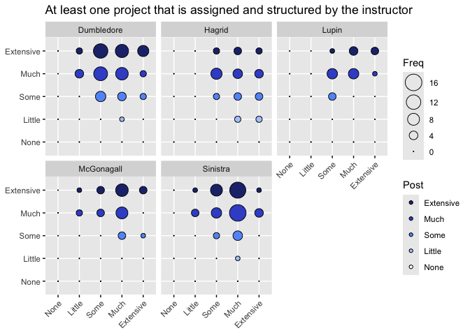<!-- -->

```
## 
## Call:
## glm(formula = Q9_4_post ~ Q10_4_pre + Instructor + Rookie, data = Q_4Clean)
## 
## Coefficients:
##                      Estimate Std. Error t value Pr(>|t|)    
## (Intercept)           4.30071    0.26422  16.277  < 2e-16 ***
## Q10_4_pre             0.01481    0.06583   0.225  0.82224    
## InstructorHagrid     -0.54058    0.16455  -3.285  0.00119 ** 
## InstructorLupin      -0.07156    0.18467  -0.388  0.69875    
## InstructorMcGonagall  0.11406    0.16282   0.701  0.48435    
## InstructorSinistra    0.02087    0.13442   0.155  0.87677    
## RookieVeteran        -0.14094    0.12047  -1.170  0.24331    
## ---
## Signif. codes:  0 '***' 0.001 '**' 0.01 '*' 0.05 '.' 0.1 ' ' 1
## 
## (Dispersion parameter for gaussian family taken to be 0.5907875)
## 
##     Null deviance: 137.5  on 223  degrees of freedom
## Residual deviance: 128.2  on 217  degrees of freedom
## AIC: 526.68
## 
## Number of Fisher Scoring iterations: 2
```

```
## Analysis of Deviance Table (Type III tests)
## 
## Response: Q9_4_post
## Error estimate based on Pearson residuals 
## 
##             Sum Sq  Df F values   Pr(>F)   
## Q10_4_pre    0.030   1   0.0506 0.822237   
## Instructor   9.121   4   3.8599 0.004736 **
## Rookie       0.809   1   1.3688 0.243307   
## Residuals  128.201 217                     
## ---
## Signif. codes:  0 '***' 0.001 '**' 0.01 '*' 0.05 '.' 0.1 ' ' 1
```

```
## Linear mixed model fit by REML. t-tests use Satterthwaite's method [
## lmerModLmerTest]
## Formula: as.numeric(Q9_4_post) ~ as.numeric(Q10_4_pre) + Instructor +  
##     (1 | Classroom)
##    Data: Q_4Clean
## 
## REML criterion at convergence: 526
## 
## Scaled residuals: 
##     Min      1Q  Median      3Q     Max 
## -2.9537 -0.4597 -0.1695  0.8743  1.8355 
## 
## Random effects:
##  Groups    Name        Variance Std.Dev.
##  Classroom (Intercept) 0.03145  0.1774  
##  Residual              0.57262  0.7567  
## Number of obs: 224, groups:  Classroom, 14
## 
## Fixed effects:
##                         Estimate Std. Error         df t value Pr(>|t|)    
## (Intercept)             4.240208   0.266192  89.958928  15.929   <2e-16 ***
## as.numeric(Q10_4_pre)   0.007135   0.065164 215.449594   0.109   0.9129    
## InstructorHagrid       -0.513533   0.221922   7.510318  -2.314   0.0514 .  
## InstructorLupin        -0.051191   0.236983   9.742345  -0.216   0.8334    
## InstructorMcGonagall    0.064197   0.228236   7.440698   0.281   0.7862    
## InstructorSinistra     -0.004807   0.185482   7.766280  -0.026   0.9800    
## ---
## Signif. codes:  0 '***' 0.001 '**' 0.01 '*' 0.05 '.' 0.1 ' ' 1
## 
## Correlation of Fixed Effects:
##             (Intr) a.(Q10 InstrH InstrL InstMG
## as.(Q10_4_) -0.877                            
## InstrctrHgr -0.171 -0.121                     
## InstrctrLpn -0.217 -0.048  0.317              
## InstrctrMcG -0.226 -0.050  0.329  0.305       
## InstrctrSns -0.298 -0.038  0.403  0.374  0.389
```

```
## Analysis of Deviance Table (Type III Wald F tests with Kenward-Roger df)
## 
## Response: as.numeric(Q9_4_post)
##                              F Df  Df.res Pr(>F)    
## (Intercept)           250.8967  1  91.787 <2e-16 ***
## as.numeric(Q10_4_pre)   0.0119  1 215.535 0.9133    
## Instructor              1.7590  4   8.464 0.2257    
## ---
## Signif. codes:  0 '***' 0.001 '**' 0.01 '*' 0.05 '.' 0.1 ' ' 1
```

```
## # Comparison of Model Performance Indices
## 
## Name             |           Model | AIC (weights) | AICc (weights)
## -------------------------------------------------------------------
## imp_model_Q10_4  |             glm | 526.7 (0.790) |  527.4 (0.790)
## lmer_model_Q10_4 | lmerModLmerTest | 529.3 (0.210) |  530.0 (0.210)
## 
## Name             | BIC (weights) |  RMSE | Sigma |    R2 | R2 (cond.)
## ---------------------------------------------------------------------
## imp_model_Q10_4  | 554.0 (0.790) | 0.757 | 0.769 | 0.068 |           
## lmer_model_Q10_4 | 556.6 (0.210) | 0.740 | 0.757 |       |      0.105
## 
## Name             | R2 (marg.) |   ICC
## -------------------------------------
## imp_model_Q10_4  |            |      
## lmer_model_Q10_4 |      0.056 | 0.052
```

```
## # Comparison of Model Performance Indices
## 
## Name               | Model | AIC (weights) | BIC (weights) |  RMSE | Sigma
## --------------------------------------------------------------------------
## imp_model_Q10_4_ml |   gls | 526.1 (0.724) | 550.0 (0.935) | 0.759 | 0.759
## lme_model_Q10_4_ml |   lme | 528.0 (0.276) | 555.3 (0.065) | 0.754 | 0.756
## 
## Name               |    R2 | AICc (weights) | R2 (cond.) | R2 (marg.) |   ICC
## -----------------------------------------------------------------------------
## imp_model_Q10_4_ml | 0.062 |        (>.999) |            |            |      
## lme_model_Q10_4_ml |       |  528.7 (>.999) |      0.068 |      0.061 | 0.007
```

```
##                    Model df      AIC      BIC    logLik   Test    L.Ratio
## imp_model_Q10_4_ml     1  7 526.0903 549.9718 -256.0451                  
## lme_model_Q10_4_ml     2  8 528.0207 555.3139 -256.0104 1 vs 2 0.06954208
##                    p-value
## imp_model_Q10_4_ml        
## lme_model_Q10_4_ml   0.792
```

*Instructor* meets alpha cutoff.

### Final Figure 3A Q10_5

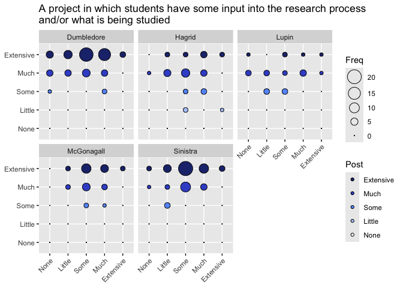<!-- -->

```
## 
## Call:
## glm(formula = as.numeric(Q9_5_post) ~ as.numeric(Q10_5_pre) + 
##     Instructor + Rookie, data = Q_5Clean)
## 
## Coefficients:
##                       Estimate Std. Error t value Pr(>|t|)    
## (Intercept)            4.48267    0.16707  26.832  < 2e-16 ***
## as.numeric(Q10_5_pre)  0.08996    0.04453   2.020   0.0446 *  
## InstructorHagrid      -0.73932    0.13828  -5.346 2.28e-07 ***
## InstructorLupin       -0.71325    0.15657  -4.556 8.73e-06 ***
## InstructorMcGonagall  -0.20793    0.13891  -1.497   0.1359    
## InstructorSinistra    -0.03650    0.11457  -0.319   0.7504    
## RookieVeteran         -0.11488    0.10259  -1.120   0.2640    
## ---
## Signif. codes:  0 '***' 0.001 '**' 0.01 '*' 0.05 '.' 0.1 ' ' 1
## 
## (Dispersion parameter for gaussian family taken to be 0.4266137)
## 
##     Null deviance: 112.933  on 222  degrees of freedom
## Residual deviance:  92.149  on 216  degrees of freedom
## AIC: 451.77
## 
## Number of Fisher Scoring iterations: 2
```

```
## Analysis of Deviance Table (Type III tests)
## 
## Response: as.numeric(Q9_5_post)
## Error estimate based on Pearson residuals 
## 
##                       Sum Sq  Df F values    Pr(>F)    
## as.numeric(Q10_5_pre)  1.741   1   4.0809    0.0446 *  
## Instructor            19.286   4  11.3015 2.405e-08 ***
## Rookie                 0.535   1   1.2541    0.2640    
## Residuals             92.149 216                       
## ---
## Signif. codes:  0 '***' 0.001 '**' 0.01 '*' 0.05 '.' 0.1 ' ' 1
```

```
## Linear mixed model fit by REML. t-tests use Satterthwaite's method [
## lmerModLmerTest]
## Formula: as.numeric(Q9_5_post) ~ as.numeric(Q10_5_pre) + Instructor +  
##     (1 | Classroom)
##    Data: Q_5Clean
## 
## REML criterion at convergence: 455.2
## 
## Scaled residuals: 
##     Min      1Q  Median      3Q     Max 
## -3.2520 -0.7846  0.3836  0.5865  1.8224 
## 
## Random effects:
##  Groups    Name        Variance  Std.Dev.
##  Classroom (Intercept) 0.0007832 0.02799 
##  Residual              0.4266299 0.65317 
## Number of obs: 223, groups:  Classroom, 14
## 
## Fixed effects:
##                        Estimate Std. Error        df t value Pr(>|t|)    
## (Intercept)             4.40715    0.15288  54.94041  28.827  < 2e-16 ***
## as.numeric(Q10_5_pre)   0.08535    0.04438 216.65771   1.923  0.05576 .  
## InstructorHagrid       -0.71118    0.13802   6.14101  -5.153  0.00197 ** 
## InstructorLupin        -0.68677    0.15659  10.13993  -4.386  0.00132 ** 
## InstructorMcGonagall   -0.20216    0.14135   5.02964  -1.430  0.21172    
## InstructorSinistra     -0.04194    0.11643   5.59770  -0.360  0.73189    
## ---
## Signif. codes:  0 '***' 0.001 '**' 0.01 '*' 0.05 '.' 0.1 ' ' 1
## 
## Correlation of Fixed Effects:
##             (Intr) a.(Q10 InstrH InstrL InstMG
## as.(Q10_5_) -0.855                            
## InstrctrHgr -0.221 -0.091                     
## InstrctrLpn -0.300  0.043  0.288              
## InstrctrMcG -0.196 -0.112  0.333  0.280       
## InstrctrSns -0.325 -0.034  0.395  0.344  0.387
```

```
## Analysis of Deviance Table (Type III Wald F tests with Kenward-Roger df)
## 
## Response: as.numeric(Q9_5_post)
##                              F Df  Df.res    Pr(>F)    
## (Intercept)           811.0698  1  59.289 < 2.2e-16 ***
## as.numeric(Q10_5_pre)   3.6531  1 216.691  0.057286 .  
## Instructor             10.5173  4   7.078  0.004235 ** 
## ---
## Signif. codes:  0 '***' 0.001 '**' 0.01 '*' 0.05 '.' 0.1 ' ' 1
```

```
## # Comparison of Model Performance Indices
## 
## Name             |           Model | AIC (weights) | AICc (weights)
## -------------------------------------------------------------------
## imp_model_Q10_5  |             glm | 451.8 (0.673) |  452.4 (0.673)
## lmer_model_Q10_5 | lmerModLmerTest | 453.2 (0.327) |  453.9 (0.327)
## 
## Name             | BIC (weights) |  RMSE | Sigma |    R2 | R2 (cond.)
## ---------------------------------------------------------------------
## imp_model_Q10_5  | 479.0 (0.673) | 0.643 | 0.653 | 0.184 |           
## lmer_model_Q10_5 | 480.5 (0.327) | 0.644 | 0.653 |       |      0.178
## 
## Name             | R2 (marg.) |   ICC
## -------------------------------------
## imp_model_Q10_5  |            |      
## lmer_model_Q10_5 |      0.176 | 0.002
```

```
## Random effect variances not available. Returned R2 does not account for random effects.
```

```
## # Comparison of Model Performance Indices
## 
## Name               | Model | AIC (weights) | BIC (weights) |  RMSE | Sigma
## --------------------------------------------------------------------------
## imp_model_Q10_5_ml |   gls | 451.1 (0.731) | 474.9 (0.937) | 0.645 | 0.645
## lme_model_Q10_5_ml |   lme | 453.1 (0.269) | 480.3 (0.063) | 0.645 | 0.645
## 
## Name               |     R2 | AICc (weights) | R2 (cond.) | R2 (marg.)
## ----------------------------------------------------------------------
## imp_model_Q10_5_ml | -1.795 |        (>.999) |            |           
## lme_model_Q10_5_ml |        |  453.7 (>.999) |            |      0.180
```

```
##                    Model df      AIC      BIC    logLik   Test      L.Ratio
## imp_model_Q10_5_ml     1  7 451.0569 474.9071 -218.5285                    
## lme_model_Q10_5_ml     2  8 453.0569 480.3143 -218.5285 1 vs 2 1.322632e-07
##                    p-value
## imp_model_Q10_5_ml        
## lme_model_Q10_5_ml  0.9997
```

*Instructor* meets alpha cutoff.

### Q10_6

<!-- -->

```
## 
## Call:
## glm(formula = as.numeric(Q9_6_post) ~ as.numeric(Q10_6_pre) + 
##     Instructor + Rookie, data = Q_6Clean)
## 
## Coefficients:
##                       Estimate Std. Error t value Pr(>|t|)    
## (Intercept)            4.57550    0.14779  30.958  < 2e-16 ***
## as.numeric(Q10_6_pre)  0.03204    0.03911   0.819    0.414    
## InstructorHagrid      -1.05492    0.14538  -7.256 7.22e-12 ***
## InstructorLupin       -1.14523    0.16586  -6.905 5.64e-11 ***
## InstructorMcGonagall  -0.06972    0.14709  -0.474    0.636    
## InstructorSinistra     0.15575    0.12170   1.280    0.202    
## RookieVeteran         -0.11579    0.10939  -1.059    0.291    
## ---
## Signif. codes:  0 '***' 0.001 '**' 0.01 '*' 0.05 '.' 0.1 ' ' 1
## 
## (Dispersion parameter for gaussian family taken to be 0.4731961)
## 
##     Null deviance: 155.83  on 220  degrees of freedom
## Residual deviance: 101.26  on 214  degrees of freedom
## AIC: 470.7
## 
## Number of Fisher Scoring iterations: 2
```

```
## Analysis of Deviance Table (Type III tests)
## 
## Response: as.numeric(Q9_6_post)
## Error estimate based on Pearson residuals 
## 
##                        Sum Sq  Df F values Pr(>F)    
## as.numeric(Q10_6_pre)   0.318   1   0.6711 0.4136    
## Instructor             52.812   4  27.9020 <2e-16 ***
## Rookie                  0.530   1   1.1205 0.2910    
## Residuals             101.264 214                    
## ---
## Signif. codes:  0 '***' 0.001 '**' 0.01 '*' 0.05 '.' 0.1 ' ' 1
```

```
## boundary (singular) fit: see help('isSingular')
```

```
## Linear mixed model fit by REML. t-tests use Satterthwaite's method [
## lmerModLmerTest]
## Formula: as.numeric(Q9_6_post) ~ as.numeric(Q10_6_pre) + Instructor +  
##     (1 | Classroom)
##    Data: Q_6Clean
## 
## REML criterion at convergence: 473.7
## 
## Scaled residuals: 
##     Min      1Q  Median      3Q     Max 
## -3.7332 -0.8014  0.4362  0.6519  2.3130 
## 
## Random effects:
##  Groups    Name        Variance Std.Dev.
##  Classroom (Intercept) 0.0000   0.0000  
##  Residual              0.4735   0.6881  
## Number of obs: 221, groups:  Classroom, 14
## 
## Fixed effects:
##                        Estimate Std. Error        df t value Pr(>|t|)    
## (Intercept)             4.49700    0.12787 215.00000  35.167  < 2e-16 ***
## as.numeric(Q10_6_pre)   0.02721    0.03885 215.00000   0.700    0.485    
## InstructorHagrid       -1.02644    0.14291 215.00000  -7.182 1.10e-11 ***
## InstructorLupin        -1.11576    0.16355 215.00000  -6.822 8.98e-11 ***
## InstructorMcGonagall   -0.06430    0.14704 215.00000  -0.437    0.662    
## InstructorSinistra      0.14847    0.12154 215.00000   1.222    0.223    
## ---
## Signif. codes:  0 '***' 0.001 '**' 0.01 '*' 0.05 '.' 0.1 ' ' 1
## 
## Correlation of Fixed Effects:
##             (Intr) a.(Q10 InstrH InstrL InstMG
## as.(Q10_6_) -0.762                            
## InstrctrHgr -0.344 -0.041                     
## InstrctrLpn -0.269 -0.077  0.297              
## InstrctrMcG -0.260 -0.138  0.332  0.296       
## InstrctrSns -0.415 -0.035  0.396  0.348  0.389
## optimizer (nloptwrap) convergence code: 0 (OK)
## boundary (singular) fit: see help('isSingular')
```

```
## Analysis of Deviance Table (Type III Wald F tests with Kenward-Roger df)
## 
## Response: as.numeric(Q9_6_post)
##                              F Df  Df.res    Pr(>F)    
## (Intercept)           1199.713  1  29.405 < 2.2e-16 ***
## as.numeric(Q10_6_pre)    0.483  1 214.856 0.4878070    
## Instructor              27.513  4   6.854 0.0002536 ***
## ---
## Signif. codes:  0 '***' 0.001 '**' 0.01 '*' 0.05 '.' 0.1 ' ' 1
```

```
## Random effect variances not available. Returned R2 does not account for random effects.
```

```
## # Comparison of Model Performance Indices
## 
## Name             |           Model | AIC (weights) | AICc (weights)
## -------------------------------------------------------------------
## imp_model_Q10_6  |             glm | 470.7 (0.640) |  471.4 (0.640)
## lmer_model_Q10_6 | lmerModLmerTest | 471.8 (0.360) |  472.5 (0.360)
## 
## Name             | BIC (weights) |  RMSE | Sigma |    R2 | R2 (cond.) | R2 (marg.)
## ----------------------------------------------------------------------------------
## imp_model_Q10_6  | 497.9 (0.640) | 0.677 | 0.688 | 0.350 |            |           
## lmer_model_Q10_6 | 499.0 (0.360) | 0.679 | 0.688 |       |            |      0.342
```

```
## Random effect variances not available. Returned R2 does not account for random effects.
```

```
## # Comparison of Model Performance Indices
## 
## Name               | Model | AIC (weights) | BIC (weights) |  RMSE | Sigma
## --------------------------------------------------------------------------
## imp_model_Q10_6_ml |   gls | 469.8 (0.731) | 493.6 (0.937) | 0.679 | 0.679
## lme_model_Q10_6_ml |   lme | 471.8 (0.269) | 499.0 (0.063) | 0.679 | 0.679
## 
## Name               |     R2 | AICc (weights) | R2 (cond.) | R2 (marg.)
## ----------------------------------------------------------------------
## imp_model_Q10_6_ml | -1.071 |        (>.999) |            |           
## lme_model_Q10_6_ml |        |  472.5 (>.999) |            |      0.348
```

```
##                    Model df      AIC      BIC    logLik   Test      L.Ratio
## imp_model_Q10_6_ml     1  7 469.8494 493.6365 -227.9247                    
## lme_model_Q10_6_ml     2  8 471.8494 499.0347 -227.9247 1 vs 2 1.295091e-07
##                    p-value
## imp_model_Q10_6_ml        
## lme_model_Q10_6_ml  0.9997
```

*Instructor* meets alpha cutoff.

### Q10_7

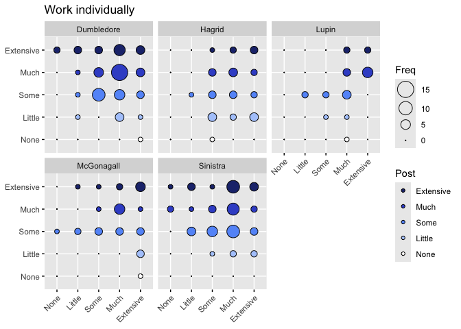<!-- -->

```
## 
## Call:
## glm(formula = as.numeric(Q9_7_post) ~ as.numeric(Q10_7_pre) + 
##     Instructor + Rookie, data = Q_7Clean)
## 
## Coefficients:
##                        Estimate Std. Error t value Pr(>|t|)    
## (Intercept)            3.774283   0.309431  12.197   <2e-16 ***
## as.numeric(Q10_7_pre)  0.020782   0.069579   0.299   0.7655    
## InstructorHagrid      -0.553463   0.218064  -2.538   0.0119 *  
## InstructorLupin       -0.271686   0.248829  -1.092   0.2761    
## InstructorMcGonagall  -0.157586   0.219074  -0.719   0.4727    
## InstructorSinistra    -0.009061   0.181243  -0.050   0.9602    
## RookieVeteran         -0.082937   0.161656  -0.513   0.6084    
## ---
## Signif. codes:  0 '***' 0.001 '**' 0.01 '*' 0.05 '.' 0.1 ' ' 1
## 
## (Dispersion parameter for gaussian family taken to be 1.067055)
## 
##     Null deviance: 238.72  on 222  degrees of freedom
## Residual deviance: 230.48  on 216  degrees of freedom
## AIC: 656.21
## 
## Number of Fisher Scoring iterations: 2
```

```
## Analysis of Deviance Table (Type III tests)
## 
## Response: as.numeric(Q9_7_post)
## Error estimate based on Pearson residuals 
## 
##                        Sum Sq  Df F values Pr(>F)
## as.numeric(Q10_7_pre)   0.095   1   0.0892 0.7655
## Instructor              8.209   4   1.9234 0.1076
## Rookie                  0.281   1   0.2632 0.6084
## Residuals             230.484 216
```

```
## boundary (singular) fit: see help('isSingular')
```

```
## Linear mixed model fit by REML. t-tests use Satterthwaite's method [
## lmerModLmerTest]
## Formula: as.numeric(Q9_7_post) ~ as.numeric(Q10_7_pre) + Instructor +  
##     (1 | Classroom)
##    Data: Q_7Clean
## 
## REML criterion at convergence: 653.2
## 
## Scaled residuals: 
##     Min      1Q  Median      3Q     Max 
## -2.7269 -0.7486  0.2017  0.9451  1.7078 
## 
## Random effects:
##  Groups    Name        Variance Std.Dev.
##  Classroom (Intercept) 0.000    0.000   
##  Residual              1.063    1.031   
## Number of obs: 223, groups:  Classroom, 14
## 
## Fixed effects:
##                        Estimate Std. Error        df t value Pr(>|t|)    
## (Intercept)             3.71193    0.28408 217.00000  13.066   <2e-16 ***
## as.numeric(Q10_7_pre)   0.02002    0.06944 217.00000   0.288   0.7734    
## InstructorHagrid       -0.53315    0.21407 217.00000  -2.490   0.0135 *  
## InstructorLupin        -0.25117    0.24518 217.00000  -1.024   0.3068    
## InstructorMcGonagall   -0.15504    0.21865 217.00000  -0.709   0.4790    
## InstructorSinistra     -0.01331    0.18075 217.00000  -0.074   0.9414    
## ---
## Signif. codes:  0 '***' 0.001 '**' 0.01 '*' 0.05 '.' 0.1 ' ' 1
## 
## Correlation of Fixed Effects:
##             (Intr) a.(Q10 InstrH InstrL InstMG
## as.(Q10_7_) -0.901                            
## InstrctrHgr -0.183 -0.074                     
## InstrctrLpn -0.127 -0.101  0.297              
## InstrctrMcG -0.163 -0.090  0.331  0.292       
## InstrctrSns -0.329  0.037  0.390  0.339  0.381
## optimizer (nloptwrap) convergence code: 0 (OK)
## boundary (singular) fit: see help('isSingular')
```

```
## Analysis of Deviance Table (Type III Wald F tests with Kenward-Roger df)
## 
## Response: as.numeric(Q9_7_post)
##                              F Df  Df.res Pr(>F)    
## (Intercept)           167.1234  1  98.596 <2e-16 ***
## as.numeric(Q10_7_pre)   0.0818  1 216.547 0.7751    
## Instructor              1.8192  4   7.017 0.2295    
## ---
## Signif. codes:  0 '***' 0.001 '**' 0.01 '*' 0.05 '.' 0.1 ' ' 1
```

```
## Random effect variances not available. Returned R2 does not account for random effects.
```

```
## # Comparison of Model Performance Indices
## 
## Name             |           Model | AIC (weights) | AICc (weights)
## -------------------------------------------------------------------
## imp_model_Q10_7  |             glm | 656.2 (0.534) |  656.9 (0.534)
## lmer_model_Q10_7 | lmerModLmerTest | 656.5 (0.466) |  657.2 (0.466)
## 
## Name             | BIC (weights) |  RMSE | Sigma |    R2 | R2 (cond.) | R2 (marg.)
## ----------------------------------------------------------------------------------
## imp_model_Q10_7  | 683.5 (0.534) | 1.017 | 1.033 | 0.034 |            |           
## lmer_model_Q10_7 | 683.7 (0.466) | 1.017 | 1.031 |       |            |      0.033
```

```
## Random effect variances not available. Returned R2 does not account for random effects.
```

```
## # Comparison of Model Performance Indices
## 
## Name               | Model | AIC (weights) | BIC (weights) |  RMSE | Sigma
## --------------------------------------------------------------------------
## imp_model_Q10_7_ml |   gls | 654.5 (0.731) | 678.3 (0.937) | 1.017 | 1.017
## lme_model_Q10_7_ml |   lme | 656.5 (0.269) | 683.7 (0.063) | 1.017 | 1.017
## 
## Name               |    R2 | AICc (weights) | R2 (cond.) | R2 (marg.)
## ---------------------------------------------------------------------
## imp_model_Q10_7_ml | 0.033 |        (>.999) |            |           
## lme_model_Q10_7_ml |       |  657.2 (>.999) |            |      0.033
```

```
##                    Model df      AIC      BIC    logLik   Test      L.Ratio
## imp_model_Q10_7_ml     1  7 654.4791 678.3293 -320.2396                    
## lme_model_Q10_7_ml     2  8 656.4791 683.7365 -320.2396 1 vs 2 1.293695e-07
##                    p-value
## imp_model_Q10_7_ml        
## lme_model_Q10_7_ml  0.9997
```

Nothing meets cutoff.

### Q10_8

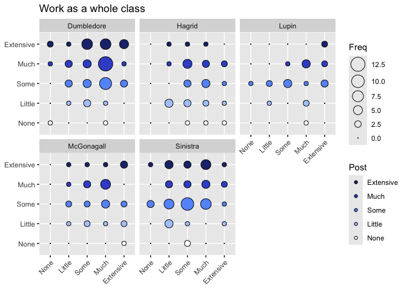<!-- -->

```
## 
## Call:
## glm(formula = Q9_8_post ~ Q10_8_pre + Instructor + Rookie, data = Q_8Clean)
## 
## Coefficients:
##                      Estimate Std. Error t value Pr(>|t|)    
## (Intercept)           3.70229    0.29263  12.652  < 2e-16 ***
## Q10_8_pre             0.11847    0.06808   1.740  0.08323 .  
## InstructorHagrid     -0.87314    0.22168  -3.939  0.00011 ***
## InstructorLupin      -0.68531    0.25300  -2.709  0.00729 ** 
## InstructorMcGonagall -0.42748    0.22299  -1.917  0.05655 .  
## InstructorSinistra   -0.22594    0.18637  -1.212  0.22671    
## RookieVeteran        -0.38091    0.16491  -2.310  0.02184 *  
## ---
## Signif. codes:  0 '***' 0.001 '**' 0.01 '*' 0.05 '.' 0.1 ' ' 1
## 
## (Dispersion parameter for gaussian family taken to be 1.109311)
## 
##     Null deviance: 265.98  on 223  degrees of freedom
## Residual deviance: 240.72  on 217  degrees of freedom
## AIC: 667.81
## 
## Number of Fisher Scoring iterations: 2
```

```
## Analysis of Deviance Table (Type III tests)
## 
## Response: Q9_8_post
## Error estimate based on Pearson residuals 
## 
##             Sum Sq  Df F values   Pr(>F)   
## Q10_8_pre    3.360   1   3.0286 0.083227 . 
## Instructor  20.721   4   4.6697 0.001234 **
## Rookie       5.918   1   5.3349 0.021843 * 
## Residuals  240.721 217                     
## ---
## Signif. codes:  0 '***' 0.001 '**' 0.01 '*' 0.05 '.' 0.1 ' ' 1
```

```
## Linear mixed model fit by REML. t-tests use Satterthwaite's method [
## lmerModLmerTest]
## Formula: as.numeric(Q9_8_post) ~ as.numeric(Q10_8_pre) + Instructor +  
##     (1 | Classroom)
##    Data: Q_8Clean
## 
## REML criterion at convergence: 669.6
## 
## Scaled residuals: 
##      Min       1Q   Median       3Q      Max 
## -2.70789 -0.64244  0.04477  0.81568  1.96894 
## 
## Random effects:
##  Groups    Name        Variance Std.Dev.
##  Classroom (Intercept) 0.006928 0.08323 
##  Residual              1.127055 1.06163 
## Number of obs: 224, groups:  Classroom, 14
## 
## Fixed effects:
##                        Estimate Std. Error        df t value Pr(>|t|)    
## (Intercept)             3.42978    0.27338  84.64200  12.546   <2e-16 ***
## as.numeric(Q10_8_pre)   0.11217    0.06867 217.99721   1.633   0.1038    
## InstructorHagrid       -0.78252    0.23163   7.80931  -3.378   0.0100 *  
## InstructorLupin        -0.59484    0.26206  12.71462  -2.270   0.0413 *  
## InstructorMcGonagall   -0.41334    0.23809   6.60289  -1.736   0.1287    
## InstructorSinistra     -0.25404    0.19781   7.78017  -1.284   0.2360    
## ---
## Signif. codes:  0 '***' 0.001 '**' 0.01 '*' 0.05 '.' 0.1 ' ' 1
## 
## Correlation of Fixed Effects:
##             (Intr) a.(Q10 InstrH InstrL InstMG
## as.(Q10_8_) -0.872                            
## InstrctrHgr -0.295  0.013                     
## InstrctrLpn -0.196 -0.063  0.295              
## InstrctrMcG -0.217 -0.068  0.325  0.292       
## InstrctrSns -0.465  0.152  0.394  0.337  0.371
```

```
## Analysis of Deviance Table (Type III Wald F tests with Kenward-Roger df)
## 
## Response: as.numeric(Q9_8_post)
##                              F Df  Df.res  Pr(>F)    
## (Intercept)           154.9332  1  77.449 < 2e-16 ***
## as.numeric(Q10_8_pre)   2.6259  1 217.997 0.10658    
## Instructor              3.3282  4   7.410 0.07485 .  
## ---
## Signif. codes:  0 '***' 0.001 '**' 0.01 '*' 0.05 '.' 0.1 ' ' 1
```

```
## # Comparison of Model Performance Indices
## 
## Name             |           Model | AIC (weights) | AICc (weights)
## -------------------------------------------------------------------
## imp_model_Q10_8  |             glm | 667.8 (0.950) |  668.5 (0.950)
## lmer_model_Q10_8 | lmerModLmerTest | 673.7 (0.050) |  674.4 (0.050)
## 
## Name             | BIC (weights) |  RMSE | Sigma |    R2 | R2 (cond.)
## ---------------------------------------------------------------------
## imp_model_Q10_8  | 695.1 (0.950) | 1.037 | 1.053 | 0.095 |           
## lmer_model_Q10_8 | 701.0 (0.050) | 1.045 | 1.062 |       |      0.077
## 
## Name             | R2 (marg.) |   ICC
## -------------------------------------
## imp_model_Q10_8  |            |      
## lmer_model_Q10_8 |      0.072 | 0.006
```

```
## Random effect variances not available. Returned R2 does not account for random effects.
```

```
## # Comparison of Model Performance Indices
## 
## Name               | Model | AIC (weights) | BIC (weights) |  RMSE | Sigma
## --------------------------------------------------------------------------
## imp_model_Q10_8_ml |   gls | 671.3 (0.731) | 695.1 (0.937) | 1.049 | 1.049
## lme_model_Q10_8_ml |   lme | 673.3 (0.269) | 700.5 (0.063) | 1.049 | 1.049
## 
## Name               |    R2 | AICc (weights) | R2 (cond.) | R2 (marg.)
## ---------------------------------------------------------------------
## imp_model_Q10_8_ml | 0.073 |        (>.999) |            |           
## lme_model_Q10_8_ml |       |  673.9 (>.999) |            |      0.073
```

```
##                    Model df      AIC      BIC    logLik   Test     L.Ratio
## imp_model_Q10_8_ml     1  7 671.2507 695.1323 -328.6254                   
## lme_model_Q10_8_ml     2  8 673.2507 700.5439 -328.6254 1 vs 2 1.43435e-07
##                    p-value
## imp_model_Q10_8_ml        
## lme_model_Q10_8_ml  0.9997
```

Nothing meets alpha cutoff.

### Q10_9

<!-- -->

```
## 
## Call:
## glm(formula = as.numeric(Q9_9_post) ~ as.numeric(Q10_9_pre) + 
##     Instructor + Rookie, data = Q_9Clean)
## 
## Coefficients:
##                       Estimate Std. Error t value Pr(>|t|)    
## (Intercept)            4.38943    0.26089  16.825  < 2e-16 ***
## as.numeric(Q10_9_pre)  0.08314    0.05955   1.396  0.16408    
## InstructorHagrid      -0.36545    0.13396  -2.728  0.00689 ** 
## InstructorLupin       -0.26498    0.15238  -1.739  0.08347 .  
## InstructorMcGonagall  -0.07334    0.13400  -0.547  0.58474    
## InstructorSinistra     0.02810    0.11082   0.254  0.80010    
## RookieVeteran         -0.11285    0.09890  -1.141  0.25510    
## ---
## Signif. codes:  0 '***' 0.001 '**' 0.01 '*' 0.05 '.' 0.1 ' ' 1
## 
## (Dispersion parameter for gaussian family taken to be 0.3991157)
## 
##     Null deviance: 91.049  on 222  degrees of freedom
## Residual deviance: 86.209  on 216  degrees of freedom
## AIC: 436.91
## 
## Number of Fisher Scoring iterations: 2
```

```
## Analysis of Deviance Table (Type III tests)
## 
## Response: as.numeric(Q9_9_post)
## Error estimate based on Pearson residuals 
## 
##                       Sum Sq  Df F values  Pr(>F)  
## as.numeric(Q10_9_pre)  0.778   1   1.9495 0.16408  
## Instructor             4.416   4   2.7662 0.02842 *
## Rookie                 0.520   1   1.3021 0.25510  
## Residuals             86.209 216                   
## ---
## Signif. codes:  0 '***' 0.001 '**' 0.01 '*' 0.05 '.' 0.1 ' ' 1
```

```
## boundary (singular) fit: see help('isSingular')
```

```
## Linear mixed model fit by REML. t-tests use Satterthwaite's method [
## lmerModLmerTest]
## Formula: as.numeric(Q9_9_post) ~ as.numeric(Q10_9_pre) + Instructor +  
##     (1 | Classroom)
##    Data: Q_9Clean
## 
## REML criterion at convergence: 440.1
## 
## Scaled residuals: 
##     Min      1Q  Median      3Q     Max 
## -4.1656 -0.7671  0.5446  0.6796  1.2506 
## 
## Random effects:
##  Groups    Name        Variance Std.Dev.
##  Classroom (Intercept) 0.0000   0.0000  
##  Residual              0.3997   0.6322  
## Number of obs: 223, groups:  Classroom, 14
## 
## Fixed effects:
##                        Estimate Std. Error        df t value Pr(>|t|)    
## (Intercept)             4.29193    0.24667 217.00000  17.399   <2e-16 ***
## as.numeric(Q10_9_pre)   0.08538    0.05955 217.00000   1.434    0.153    
## InstructorHagrid       -0.33868    0.13198 217.00000  -2.566    0.011 *  
## InstructorLupin        -0.23813    0.15066 217.00000  -1.581    0.115    
## InstructorMcGonagall   -0.07063    0.13407 217.00000  -0.527    0.599    
## InstructorSinistra      0.02229    0.11078 217.00000   0.201    0.841    
## ---
## Signif. codes:  0 '***' 0.001 '**' 0.01 '*' 0.05 '.' 0.1 ' ' 1
## 
## Correlation of Fixed Effects:
##             (Intr) a.(Q10 InstrH InstrL InstMG
## as.(Q10_9_) -0.952                            
## InstrctrHgr -0.053 -0.129                     
## InstrctrLpn -0.038 -0.121  0.303              
## InstrctrMcG -0.084 -0.093  0.335  0.294       
## InstrctrSns -0.180 -0.031  0.394  0.346  0.387
## optimizer (nloptwrap) convergence code: 0 (OK)
## boundary (singular) fit: see help('isSingular')
```

```
## Analysis of Deviance Table (Type III Wald F tests with Kenward-Roger df)
## 
## Response: as.numeric(Q9_9_post)
##                              F Df Df.res Pr(>F)    
## (Intercept)           297.5884  1 169.34 <2e-16 ***
## as.numeric(Q10_9_pre)   2.0349  1 215.45 0.1552    
## Instructor              2.3990  4   7.08 0.1463    
## ---
## Signif. codes:  0 '***' 0.001 '**' 0.01 '*' 0.05 '.' 0.1 ' ' 1
```

```
## Random effect variances not available. Returned R2 does not account for random effects.
```

```
## # Comparison of Model Performance Indices
## 
## Name             |           Model | AIC (weights) | AICc (weights)
## -------------------------------------------------------------------
## imp_model_Q10_9  |             glm | 436.9 (0.662) |  437.6 (0.662)
## lmer_model_Q10_9 | lmerModLmerTest | 438.2 (0.338) |  438.9 (0.338)
## 
## Name             | BIC (weights) |  RMSE | Sigma |    R2 | R2 (cond.) | R2 (marg.)
## ----------------------------------------------------------------------------------
## imp_model_Q10_9  | 464.2 (0.662) | 0.622 | 0.632 | 0.053 |            |           
## lmer_model_Q10_9 | 465.5 (0.338) | 0.624 | 0.632 |       |            |      0.046
```

```
## Random effect variances not available. Returned R2 does not account for random effects.
```

```
## # Comparison of Model Performance Indices
## 
## Name               | Model | AIC (weights) | BIC (weights) |  RMSE | Sigma
## --------------------------------------------------------------------------
## imp_model_Q10_9_ml |   gls | 436.2 (0.731) | 460.1 (0.937) | 0.624 | 0.624
## lme_model_Q10_9_ml |   lme | 438.2 (0.269) | 465.5 (0.063) | 0.624 | 0.624
## 
## Name               |     R2 | AICc (weights) | R2 (cond.) | R2 (marg.)
## ----------------------------------------------------------------------
## imp_model_Q10_9_ml | -2.001 |        (>.999) |            |           
## lme_model_Q10_9_ml |        |  438.9 (>.999) |            |      0.048
```

```
##                    Model df      AIC      BIC    logLik   Test      L.Ratio
## imp_model_Q10_9_ml     1  7 436.2482 460.0984 -211.1241                    
## lme_model_Q10_9_ml     2  8 438.2482 465.5056 -211.1241 1 vs 2 1.294571e-07
##                    p-value
## imp_model_Q10_9_ml        
## lme_model_Q10_9_ml  0.9997
```

Nothing meets cutoff.

### Q10_10

<!-- -->

```
## 
## Call:
## glm(formula = Q9_10_post ~ Q10_10_pre + Instructor + Rookie, 
##     data = Q_10Clean)
## 
## Coefficients:
##                      Estimate Std. Error t value Pr(>|t|)    
## (Intercept)           4.31532    0.21321  20.239  < 2e-16 ***
## Q10_10_pre            0.11776    0.05273   2.233 0.026550 *  
## InstructorHagrid     -0.46562    0.12918  -3.604 0.000389 ***
## InstructorLupin      -0.20946    0.14501  -1.444 0.150066    
## InstructorMcGonagall -0.12292    0.13053  -0.942 0.347413    
## InstructorSinistra    0.10861    0.10616   1.023 0.307423    
## RookieVeteran        -0.20079    0.09559  -2.101 0.036840 *  
## ---
## Signif. codes:  0 '***' 0.001 '**' 0.01 '*' 0.05 '.' 0.1 ' ' 1
## 
## (Dispersion parameter for gaussian family taken to be 0.3637216)
## 
##     Null deviance: 86.955  on 221  degrees of freedom
## Residual deviance: 78.200  on 215  degrees of freedom
## AIC: 414.37
## 
## Number of Fisher Scoring iterations: 2
```

```
## Analysis of Deviance Table (Type III tests)
## 
## Response: Q9_10_post
## Error estimate based on Pearson residuals 
## 
##            Sum Sq  Df F values   Pr(>F)    
## Q10_10_pre  1.814   1   4.9883 0.026550 *  
## Instructor  7.620   4   5.2374 0.000481 ***
## Rookie      1.605   1   4.4126 0.036840 *  
## Residuals  78.200 215                      
## ---
## Signif. codes:  0 '***' 0.001 '**' 0.01 '*' 0.05 '.' 0.1 ' ' 1
```

```
## boundary (singular) fit: see help('isSingular')
```

```
## Linear mixed model fit by REML. t-tests use Satterthwaite's method [
## lmerModLmerTest]
## Formula: as.numeric(Q9_10_post) ~ as.numeric(Q10_10_pre) + Instructor +  
##     (1 | Classroom)
##    Data: Q_10Clean
## 
## REML criterion at convergence: 421.4
## 
## Scaled residuals: 
##     Min      1Q  Median      3Q     Max 
## -3.6428 -0.8481  0.4504  0.6282  1.4582 
## 
## Random effects:
##  Groups    Name        Variance Std.Dev.
##  Classroom (Intercept) 0.0000   0.0000  
##  Residual              0.3695   0.6078  
## Number of obs: 222, groups:  Classroom, 14
## 
## Fixed effects:
##                        Estimate Std. Error       df t value Pr(>|t|)    
## (Intercept)              4.2222     0.2102 216.0000  20.087  < 2e-16 ***
## as.numeric(Q10_10_pre)   0.1006     0.0525 216.0000   1.916  0.05674 .  
## InstructorHagrid        -0.4102     0.1275 216.0000  -3.219  0.00149 ** 
## InstructorLupin         -0.1577     0.1440 216.0000  -1.095  0.27473    
## InstructorMcGonagall    -0.1089     0.1314 216.0000  -0.829  0.40818    
## InstructorSinistra       0.1018     0.1070 216.0000   0.952  0.34207    
## ---
## Signif. codes:  0 '***' 0.001 '**' 0.01 '*' 0.05 '.' 0.1 ' ' 1
## 
## Correlation of Fixed Effects:
##             (Intr) a.(Q10 InstrH InstrL InstMG
## a.(Q10_10_) -0.938                            
## InstrctrHgr -0.048 -0.159                     
## InstrctrLpn -0.120 -0.058  0.297              
## InstrctrMcG -0.041 -0.159  0.341  0.288       
## InstrctrSns -0.146 -0.095  0.402  0.348  0.391
## optimizer (nloptwrap) convergence code: 0 (OK)
## boundary (singular) fit: see help('isSingular')
```

```
## Analysis of Deviance Table (Type III Wald F tests with Kenward-Roger df)
## 
## Response: as.numeric(Q9_10_post)
##                               F Df  Df.res  Pr(>F)    
## (Intercept)            396.4334  1 144.574 < 2e-16 ***
## as.numeric(Q10_10_pre)   3.5919  1 215.584 0.05940 .  
## Instructor               4.1215  4   7.225 0.04798 *  
## ---
## Signif. codes:  0 '***' 0.001 '**' 0.01 '*' 0.05 '.' 0.1 ' ' 1
```

```
## Random effect variances not available. Returned R2 does not account for random effects.
```

```
## # Comparison of Model Performance Indices
## 
## Name              |           Model | AIC (weights) | AICc (weights)
## --------------------------------------------------------------------
## imp_model_Q10_10  |             glm | 414.4 (0.905) |  415.0 (0.905)
## lmer_model_Q10_10 | lmerModLmerTest | 418.9 (0.095) |  419.6 (0.095)
## 
## Name              | BIC (weights) |  RMSE | Sigma |    R2 | R2 (cond.) | R2 (marg.)
## -----------------------------------------------------------------------------------
## imp_model_Q10_10  | 441.6 (0.905) | 0.594 | 0.603 | 0.101 |            |           
## lmer_model_Q10_10 | 446.1 (0.095) | 0.600 | 0.608 |       |            |      0.081
```

```
## Random effect variances not available. Returned R2 does not account for random effects.
```

```
## # Comparison of Model Performance Indices
## 
## Name                | Model | AIC (weights) | BIC (weights) |  RMSE | Sigma
## ---------------------------------------------------------------------------
## imp_model_Q10_10_ml |   gls | 416.9 (0.731) | 440.7 (0.937) | 0.600 | 0.600
## lme_model_Q10_10_ml |   lme | 418.9 (0.269) | 446.1 (0.063) | 0.600 | 0.600
## 
## Name                |    R2 | AICc (weights) | R2 (cond.) | R2 (marg.)
## ----------------------------------------------------------------------
## imp_model_Q10_10_ml | 0.082 |        (>.999) |            |           
## lme_model_Q10_10_ml |       |  419.6 (>.999) |            |      0.083
```

```
##                     Model df      AIC      BIC    logLik   Test      L.Ratio
## imp_model_Q10_10_ml     1  7 416.8827 440.7014 -201.4413                    
## lme_model_Q10_10_ml     2  8 418.8827 446.1041 -201.4413 1 vs 2 1.294726e-07
##                     p-value
## imp_model_Q10_10_ml        
## lme_model_Q10_10_ml  0.9997
```

*Instructor* meets cutoff.

### Q10_11

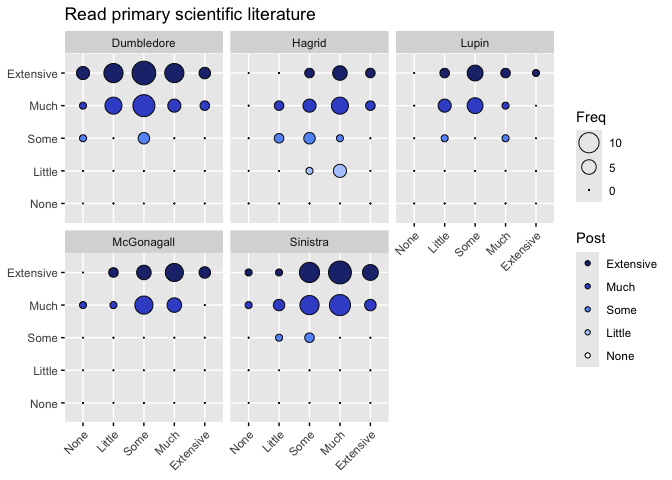<!-- -->

```
## 
## Call:
## glm(formula = as.numeric(Q9_11_post) ~ as.numeric(Q10_11_pre) + 
##     Instructor + Rookie, data = Q_11Clean)
## 
## Coefficients:
##                        Estimate Std. Error t value Pr(>|t|)    
## (Intercept)             4.17305    0.17426  23.947  < 2e-16 ***
## as.numeric(Q10_11_pre)  0.12238    0.04814   2.542   0.0117 *  
## InstructorHagrid       -0.79692    0.14457  -5.512 1.01e-07 ***
## InstructorLupin        -0.14343    0.15956  -0.899   0.3697    
## InstructorMcGonagall   -0.02335    0.14274  -0.164   0.8702    
## InstructorSinistra     -0.12116    0.12048  -1.006   0.3157    
## RookieVeteran          -0.03077    0.10565  -0.291   0.7712    
## ---
## Signif. codes:  0 '***' 0.001 '**' 0.01 '*' 0.05 '.' 0.1 ' ' 1
## 
## (Dispersion parameter for gaussian family taken to be 0.4416128)
## 
##     Null deviance: 111.968  on 221  degrees of freedom
## Residual deviance:  94.947  on 215  degrees of freedom
## AIC: 457.45
## 
## Number of Fisher Scoring iterations: 2
```

```
## 
## Call:
## glm(formula = as.numeric(Q9_11_post) ~ as.numeric(Q10_11_pre) + 
##     Instructor + Rookie, data = Q_11Clean)
## 
## Coefficients:
##                        Estimate Std. Error t value Pr(>|t|)    
## (Intercept)             4.17305    0.17426  23.947  < 2e-16 ***
## as.numeric(Q10_11_pre)  0.12238    0.04814   2.542   0.0117 *  
## InstructorHagrid       -0.79692    0.14457  -5.512 1.01e-07 ***
## InstructorLupin        -0.14343    0.15956  -0.899   0.3697    
## InstructorMcGonagall   -0.02335    0.14274  -0.164   0.8702    
## InstructorSinistra     -0.12116    0.12048  -1.006   0.3157    
## RookieVeteran          -0.03077    0.10565  -0.291   0.7712    
## ---
## Signif. codes:  0 '***' 0.001 '**' 0.01 '*' 0.05 '.' 0.1 ' ' 1
## 
## (Dispersion parameter for gaussian family taken to be 0.4416128)
## 
##     Null deviance: 111.968  on 221  degrees of freedom
## Residual deviance:  94.947  on 215  degrees of freedom
## AIC: 457.45
## 
## Number of Fisher Scoring iterations: 2
```

```
## Analysis of Deviance Table (Type III tests)
## 
## Response: as.numeric(Q9_11_post)
## Error estimate based on Pearson residuals 
## 
##                        Sum Sq  Df F values    Pr(>F)    
## as.numeric(Q10_11_pre)  2.854   1   6.4626   0.01172 *  
## Instructor             15.417   4   8.7278 1.513e-06 ***
## Rookie                  0.037   1   0.0848   0.77117    
## Residuals              94.947 215                       
## ---
## Signif. codes:  0 '***' 0.001 '**' 0.01 '*' 0.05 '.' 0.1 ' ' 1
```

```
## Linear mixed model fit by REML. t-tests use Satterthwaite's method [
## lmerModLmerTest]
## Formula: as.numeric(Q9_11_post) ~ as.numeric(Q10_11_pre) + Instructor +  
##     (1 | Classroom)
##    Data: Q_11Clean
## 
## REML criterion at convergence: 458.5
## 
## Scaled residuals: 
##     Min      1Q  Median      3Q     Max 
## -2.9116 -0.7089  0.3477  0.7589  2.0516 
## 
## Random effects:
##  Groups    Name        Variance Std.Dev.
##  Classroom (Intercept) 0.01373  0.1172  
##  Residual              0.43109  0.6566  
## Number of obs: 222, groups:  Classroom, 14
## 
## Fixed effects:
##                          Estimate Std. Error         df t value Pr(>|t|)    
## (Intercept)              4.186269   0.172543  49.053587  24.262  < 2e-16 ***
## as.numeric(Q10_11_pre)   0.115171   0.047829 215.245233   2.408  0.01688 *  
## InstructorHagrid        -0.807039   0.173266   8.530295  -4.658  0.00137 ** 
## InstructorLupin         -0.152327   0.186326  11.299348  -0.818  0.43053    
## InstructorMcGonagall    -0.002085   0.177697   7.970366  -0.012  0.99093    
## InstructorSinistra      -0.139271   0.146937   9.114517  -0.948  0.36767    
## ---
## Signif. codes:  0 '***' 0.001 '**' 0.01 '*' 0.05 '.' 0.1 ' ' 1
## 
## Correlation of Fixed Effects:
##             (Intr) a.(Q10 InstrH InstrL InstMG
## a.(Q10_11_) -0.818                            
## InstrctrHgr -0.184 -0.178                     
## InstrctrLpn -0.305 -0.002  0.306              
## InstrctrMcG -0.221 -0.123  0.342  0.298       
## InstrctrSns -0.242 -0.180  0.419  0.360  0.400
```

```
## Analysis of Deviance Table (Type III Wald F tests with Kenward-Roger df)
## 
## Response: as.numeric(Q9_11_post)
##                               F Df  Df.res  Pr(>F)    
## (Intercept)            570.9932  1  44.985 < 2e-16 ***
## as.numeric(Q10_11_pre)   5.6663  1 215.157 0.01817 *  
## Instructor               6.1839  4   8.189 0.01368 *  
## ---
## Signif. codes:  0 '***' 0.001 '**' 0.01 '*' 0.05 '.' 0.1 ' ' 1
```

```
## # Comparison of Model Performance Indices
## 
## Name              |           Model | AIC (weights) | AICc (weights)
## --------------------------------------------------------------------
## imp_model_Q10_11  |             glm | 457.5 (0.656) |  458.1 (0.656)
## lmer_model_Q10_11 | lmerModLmerTest | 458.7 (0.344) |  459.4 (0.344)
## 
## Name              | BIC (weights) |  RMSE | Sigma |    R2 | R2 (cond.)
## ----------------------------------------------------------------------
## imp_model_Q10_11  | 484.7 (0.656) | 0.654 | 0.665 | 0.152 |           
## lmer_model_Q10_11 | 486.0 (0.344) | 0.643 | 0.657 |       |      0.178
## 
## Name              | R2 (marg.) |   ICC
## --------------------------------------
## imp_model_Q10_11  |            |      
## lmer_model_Q10_11 |      0.152 | 0.031
```

```
## Random effect variances not available. Returned R2 does not account for random effects.
```

```
## # Comparison of Model Performance Indices
## 
## Name                | Model | AIC (weights) | BIC (weights) |  RMSE | Sigma
## ---------------------------------------------------------------------------
## imp_model_Q10_11_ml |   gls | 455.5 (0.731) | 479.4 (0.937) | 0.654 | 0.654
## lme_model_Q10_11_ml |   lme | 457.5 (0.269) | 484.8 (0.063) | 0.654 | 0.654
## 
## Name                |     R2 | AICc (weights) | R2 (cond.) | R2 (marg.)
## -----------------------------------------------------------------------
## imp_model_Q10_11_ml | -1.831 |        (>.999) |            |           
## lme_model_Q10_11_ml |        |  458.2 (>.999) |            |      0.152
```

```
##                     Model df      AIC      BIC   logLik   Test      L.Ratio
## imp_model_Q10_11_ml     1  7 455.5381 479.3568 -220.769                    
## lme_model_Q10_11_ml     2  8 457.5381 484.7595 -220.769 1 vs 2 1.089572e-07
##                     p-value
## imp_model_Q10_11_ml        
## lme_model_Q10_11_ml  0.9997
```

*Pre-survey* and *Instructor* meet cutoff.

### Q10_12

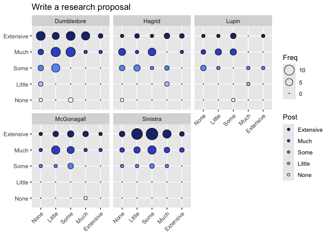<!-- -->

```
## 
## Call:
## glm(formula = as.numeric(Q9_12_post) ~ as.numeric(Q10_12_pre) + 
##     Instructor + Rookie, data = Q_12Clean)
## 
## Coefficients:
##                        Estimate Std. Error t value Pr(>|t|)    
## (Intercept)             3.75480    0.19708  19.052   <2e-16 ***
## as.numeric(Q10_12_pre)  0.10461    0.05521   1.895   0.0595 .  
## InstructorHagrid       -0.32318    0.19396  -1.666   0.0971 .  
## InstructorLupin        -0.29233    0.22010  -1.328   0.1855    
## InstructorMcGonagall   -0.01671    0.19514  -0.086   0.9318    
## InstructorSinistra      0.38299    0.16326   2.346   0.0199 *  
## RookieVeteran           0.12496    0.14572   0.858   0.3921    
## ---
## Signif. codes:  0 '***' 0.001 '**' 0.01 '*' 0.05 '.' 0.1 ' ' 1
## 
## (Dispersion parameter for gaussian family taken to be 0.8366148)
## 
##     Null deviance: 200.65  on 220  degrees of freedom
## Residual deviance: 179.04  on 214  degrees of freedom
## AIC: 596.63
## 
## Number of Fisher Scoring iterations: 2
```

```
## Single term deletions
## 
## Model:
## as.numeric(Q9_12_post) ~ as.numeric(Q10_12_pre) + Instructor + 
##     Rookie
##                        Df Deviance    AIC scaled dev. Pr(>Chi)   
## <none>                      179.04 596.63                        
## as.numeric(Q10_12_pre)  1   182.04 598.31      3.6764 0.055189 . 
## Instructor              4   192.65 604.83     16.1932 0.002771 **
## Rookie                  1   179.65 595.39      0.7582 0.383903   
## ---
## Signif. codes:  0 '***' 0.001 '**' 0.01 '*' 0.05 '.' 0.1 ' ' 1
```

```
## Analysis of Deviance Table (Type III tests)
## 
## Response: as.numeric(Q9_12_post)
## Error estimate based on Pearson residuals 
## 
##                         Sum Sq  Df F values   Pr(>F)   
## as.numeric(Q10_12_pre)   3.003   1   3.5897 0.059487 . 
## Instructor              13.611   4   4.0673 0.003369 **
## Rookie                   0.615   1   0.7354 0.392093   
## Residuals              179.036 214                     
## ---
## Signif. codes:  0 '***' 0.001 '**' 0.01 '*' 0.05 '.' 0.1 ' ' 1
```

```
## Linear mixed model fit by REML. t-tests use Satterthwaite's method [
## lmerModLmerTest]
## Formula: as.numeric(Q9_12_post) ~ as.numeric(Q10_12_pre) + Instructor +  
##     (1 | Classroom)
##    Data: Q_12Clean
## 
## REML criterion at convergence: 595
## 
## Scaled residuals: 
##     Min      1Q  Median      3Q     Max 
## -3.5508 -0.5919  0.1498  0.6939  1.6375 
## 
## Random effects:
##  Groups    Name        Variance Std.Dev.
##  Classroom (Intercept) 0.02448  0.1565  
##  Residual              0.82037  0.9057  
## Number of obs: 221, groups:  Classroom, 14
## 
## Fixed effects:
##                         Estimate Std. Error        df t value Pr(>|t|)    
## (Intercept)              3.86044    0.18978  24.40766  20.342   <2e-16 ***
## as.numeric(Q10_12_pre)   0.10234    0.05490 213.62919   1.864   0.0637 .  
## InstructorHagrid        -0.36227    0.23324   7.56074  -1.553   0.1612    
## InstructorLupin         -0.32658    0.25512  10.78386  -1.280   0.2274    
## InstructorMcGonagall     0.01284    0.24172   7.30851   0.053   0.9591    
## InstructorSinistra       0.39284    0.19914   8.11866   1.973   0.0835 .  
## ---
## Signif. codes:  0 '***' 0.001 '**' 0.01 '*' 0.05 '.' 0.1 ' ' 1
## 
## Correlation of Fixed Effects:
##             (Intr) a.(Q10 InstrH InstrL InstMG
## a.(Q10_12_) -0.696                            
## InstrctrHgr -0.391 -0.042                     
## InstrctrLpn -0.368 -0.022  0.313              
## InstrctrMcG -0.349 -0.080  0.333  0.303       
## InstrctrSns -0.410 -0.117  0.405  0.368  0.395
```

```
## Analysis of Deviance Table (Type III Wald F tests with Kenward-Roger df)
## 
## Response: as.numeric(Q9_12_post)
##                               F Df  Df.res    Pr(>F)    
## (Intercept)            403.2337  1  23.014 4.368e-16 ***
## as.numeric(Q10_12_pre)   3.3867  1 213.536   0.06711 .  
## Instructor               3.2469  4   7.874   0.07447 .  
## ---
## Signif. codes:  0 '***' 0.001 '**' 0.01 '*' 0.05 '.' 0.1 ' ' 1
```

```
## # Comparison of Model Performance Indices
## 
## Name              |           Model | AIC (weights) | AICc (weights)
## --------------------------------------------------------------------
## imp_model_Q10_12  |             glm | 596.6 (0.731) |  597.3 (0.731)
## lmer_model_Q10_12 | lmerModLmerTest | 598.6 (0.269) |  599.3 (0.269)
## 
## Name              | BIC (weights) |  RMSE | Sigma |    R2 | R2 (cond.)
## ----------------------------------------------------------------------
## imp_model_Q10_12  | 623.8 (0.731) | 0.900 | 0.915 | 0.108 |           
## lmer_model_Q10_12 | 625.8 (0.269) | 0.888 | 0.906 |       |      0.127
## 
## Name              | R2 (marg.) |   ICC
## --------------------------------------
## imp_model_Q10_12  |            |      
## lmer_model_Q10_12 |      0.101 | 0.029
```

```
## Random effect variances not available. Returned R2 does not account for random effects.
```

```
## # Comparison of Model Performance Indices
## 
## Name                | Model | AIC (weights) | BIC (weights) |  RMSE | Sigma
## ---------------------------------------------------------------------------
## imp_model_Q10_12_ml |   gls | 595.4 (0.731) | 619.2 (0.937) | 0.902 | 0.902
## lme_model_Q10_12_ml |   lme | 597.4 (0.269) | 624.6 (0.063) | 0.902 | 0.902
## 
## Name                |    R2 | AICc (weights) | R2 (cond.) | R2 (marg.)
## ----------------------------------------------------------------------
## imp_model_Q10_12_ml | 0.105 |        (>.999) |            |           
## lme_model_Q10_12_ml |       |  598.1 (>.999) |            |      0.105
```

```
##                     Model df      AIC      BIC    logLik   Test      L.Ratio
## imp_model_Q10_12_ml     1  7 595.3912 619.1783 -290.6956                    
## lme_model_Q10_12_ml     2  8 597.3912 624.5765 -290.6956 1 vs 2 1.352623e-07
##                     p-value
## imp_model_Q10_12_ml        
## lme_model_Q10_12_ml  0.9997
```

Nothing meets cutoff.

### Q10_13

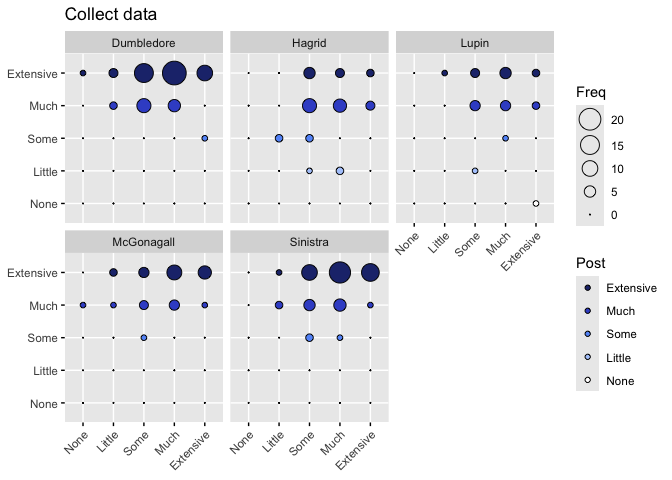<!-- -->

```
## 
## Call:
## glm(formula = as.numeric(Q9_13_post) ~ as.numeric(Q10_13_pre) + 
##     Instructor + Rookie, data = Q_13Clean)
## 
## Coefficients:
##                        Estimate Std. Error t value Pr(>|t|)    
## (Intercept)             4.47608    0.21579  20.743  < 2e-16 ***
## as.numeric(Q10_13_pre)  0.11686    0.04989   2.342 0.020076 *  
## InstructorHagrid       -0.78363    0.13645  -5.743 3.15e-08 ***
## InstructorLupin        -0.60128    0.15537  -3.870 0.000144 ***
## InstructorMcGonagall   -0.12205    0.13687  -0.892 0.373537    
## InstructorSinistra     -0.08739    0.11464  -0.762 0.446688    
## RookieVeteran          -0.20228    0.10231  -1.977 0.049301 *  
## ---
## Signif. codes:  0 '***' 0.001 '**' 0.01 '*' 0.05 '.' 0.1 ' ' 1
## 
## (Dispersion parameter for gaussian family taken to be 0.4195731)
## 
##     Null deviance: 111.279  on 221  degrees of freedom
## Residual deviance:  90.208  on 215  degrees of freedom
## AIC: 446.09
## 
## Number of Fisher Scoring iterations: 2
```

```
## Analysis of Deviance Table (Type III tests)
## 
## Response: as.numeric(Q9_13_post)
## Error estimate based on Pearson residuals 
## 
##                        Sum Sq  Df F values    Pr(>F)    
## as.numeric(Q10_13_pre)  2.302   1   5.4867   0.02008 *  
## Instructor             18.070   4  10.7670 5.663e-08 ***
## Rookie                  1.640   1   3.9092   0.04930 *  
## Residuals              90.208 215                       
## ---
## Signif. codes:  0 '***' 0.001 '**' 0.01 '*' 0.05 '.' 0.1 ' ' 1
```

```
## boundary (singular) fit: see help('isSingular')
```

```
## Linear mixed model fit by REML. t-tests use Satterthwaite's method [
## lmerModLmerTest]
## Formula: as.numeric(Q9_13_post) ~ as.numeric(Q10_13_pre) + Instructor +  
##     (1 | Classroom)
##    Data: Q_13Clean
## 
## REML criterion at convergence: 452
## 
## Scaled residuals: 
##     Min      1Q  Median      3Q     Max 
## -5.1434 -0.5251  0.3225  0.5131  1.6391 
## 
## Random effects:
##  Groups    Name        Variance Std.Dev.
##  Classroom (Intercept) 0.0000   0.0000  
##  Residual              0.4252   0.6521  
## Number of obs: 222, groups:  Classroom, 14
## 
## Fixed effects:
##                         Estimate Std. Error        df t value Pr(>|t|)    
## (Intercept)              4.30388    0.19876 216.00000  21.654  < 2e-16 ***
## as.numeric(Q10_13_pre)   0.12050    0.05019 216.00000   2.401 0.017204 *  
## InstructorHagrid        -0.73425    0.13504 216.00000  -5.437 1.46e-07 ***
## InstructorLupin         -0.55246    0.15443 216.00000  -3.577 0.000428 ***
## InstructorMcGonagall    -0.11667    0.13776 216.00000  -0.847 0.398005    
## InstructorSinistra      -0.10115    0.11519 216.00000  -0.878 0.380868    
## ---
## Signif. codes:  0 '***' 0.001 '**' 0.01 '*' 0.05 '.' 0.1 ' ' 1
## 
## Correlation of Fixed Effects:
##             (Intr) a.(Q10 InstrH InstrL InstMG
## a.(Q10_13_) -0.920                            
## InstrctrHgr -0.251  0.027                     
## InstrctrLpn -0.153 -0.048  0.290              
## InstrctrMcG -0.194 -0.031  0.326  0.287       
## InstrctrSns -0.182 -0.090  0.388  0.346  0.386
## optimizer (nloptwrap) convergence code: 0 (OK)
## boundary (singular) fit: see help('isSingular')
```

```
## Analysis of Deviance Table (Type III Wald F tests with Kenward-Roger df)
## 
## Response: as.numeric(Q9_13_post)
##                               F Df  Df.res    Pr(>F)    
## (Intercept)            455.2344  1 105.804 < 2.2e-16 ***
## as.numeric(Q10_13_pre)   5.6537  1 215.719  0.018292 *  
## Instructor               9.4511  4   6.817  0.006435 ** 
## ---
## Signif. codes:  0 '***' 0.001 '**' 0.01 '*' 0.05 '.' 0.1 ' ' 1
```

```
## Random effect variances not available. Returned R2 does not account for random effects.
```

```
## # Comparison of Model Performance Indices
## 
## Name              |           Model | AIC (weights) | AICc (weights)
## --------------------------------------------------------------------
## imp_model_Q10_13  |             glm | 446.1 (0.881) |  446.8 (0.881)
## lmer_model_Q10_13 | lmerModLmerTest | 450.1 (0.119) |  450.8 (0.119)
## 
## Name              | BIC (weights) |  RMSE | Sigma |    R2 | R2 (cond.) | R2 (marg.)
## -----------------------------------------------------------------------------------
## imp_model_Q10_13  | 473.3 (0.881) | 0.637 | 0.648 | 0.189 |            |           
## lmer_model_Q10_13 | 477.3 (0.119) | 0.643 | 0.652 |       |            |      0.171
```

```
## Random effect variances not available. Returned R2 does not account for random effects.
```

```
## # Comparison of Model Performance Indices
## 
## Name                | Model | AIC (weights) | BIC (weights) |  RMSE | Sigma
## ---------------------------------------------------------------------------
## imp_model_Q10_13_ml |   gls | 448.1 (0.731) | 471.9 (0.937) | 0.643 | 0.643
## lme_model_Q10_13_ml |   lme | 450.1 (0.269) | 477.3 (0.063) | 0.643 | 0.643
## 
## Name                |    R2 | AICc (weights) | R2 (cond.) | R2 (marg.)
## ----------------------------------------------------------------------
## imp_model_Q10_13_ml | 0.175 |        (>.999) |            |           
## lme_model_Q10_13_ml |       |  450.8 (>.999) |            |      0.175
```

```
##                     Model df      AIC      BIC    logLik   Test      L.Ratio
## imp_model_Q10_13_ml     1  7 448.0853 471.9040 -217.0426                    
## lme_model_Q10_13_ml     2  8 450.0853 477.3067 -217.0426 1 vs 2 1.296804e-07
##                     p-value
## imp_model_Q10_13_ml        
## lme_model_Q10_13_ml  0.9997
```

*Presurvey* and *Instructor* meet cutoff

### Q10_14

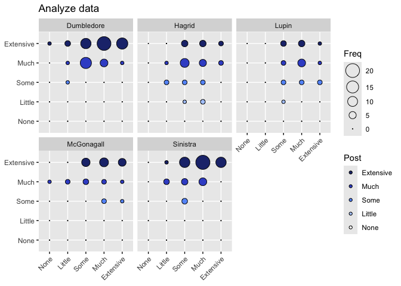<!-- -->

```
## 
## Call:
## glm(formula = as.numeric(Q9_14_post) ~ as.numeric(Q10_14_pre) + 
##     Instructor + Rookie, data = Q_14Clean)
## 
## Coefficients:
##                         Estimate Std. Error t value Pr(>|t|)    
## (Intercept)             4.076044   0.220608  18.476  < 2e-16 ***
## as.numeric(Q10_14_pre)  0.175277   0.050415   3.477 0.000614 ***
## InstructorHagrid       -0.715905   0.137369  -5.212 4.38e-07 ***
## InstructorLupin        -0.714757   0.156141  -4.578 7.95e-06 ***
## InstructorMcGonagall   -0.137486   0.137505  -1.000 0.318503    
## InstructorSinistra      0.002071   0.114792   0.018 0.985622    
## RookieVeteran          -0.061259   0.102929  -0.595 0.552367    
## ---
## Signif. codes:  0 '***' 0.001 '**' 0.01 '*' 0.05 '.' 0.1 ' ' 1
## 
## (Dispersion parameter for gaussian family taken to be 0.4237034)
## 
##     Null deviance: 117.279  on 221  degrees of freedom
## Residual deviance:  91.096  on 215  degrees of freedom
## AIC: 448.26
## 
## Number of Fisher Scoring iterations: 2
```

```
## Analysis of Deviance Table (Type III tests)
## 
## Response: as.numeric(Q9_14_post)
## Error estimate based on Pearson residuals 
## 
##                        Sum Sq  Df F values    Pr(>F)    
## as.numeric(Q10_14_pre)  5.121   1  12.0871 0.0006142 ***
## Instructor             19.508   4  11.5105 1.742e-08 ***
## Rookie                  0.150   1   0.3542 0.5523672    
## Residuals              91.096 215                       
## ---
## Signif. codes:  0 '***' 0.001 '**' 0.01 '*' 0.05 '.' 0.1 ' ' 1
```

```
## boundary (singular) fit: see help('isSingular')
```

```
## Linear mixed model fit by REML. t-tests use Satterthwaite's method [
## lmerModLmerTest]
## Formula: as.numeric(Q9_14_post) ~ as.numeric(Q10_14_pre) + Instructor +  
##     (1 | Classroom)
##    Data: Q_14Clean
## 
## REML criterion at convergence: 450.5
## 
## Scaled residuals: 
##     Min      1Q  Median      3Q     Max 
## -3.1216 -0.7955  0.2281  0.6250  1.7666 
## 
## Random effects:
##  Groups    Name        Variance Std.Dev.
##  Classroom (Intercept) 0.0000   0.00    
##  Residual              0.4224   0.65    
## Number of obs: 222, groups:  Classroom, 14
## 
## Fixed effects:
##                         Estimate Std. Error        df t value Pr(>|t|)    
## (Intercept)              4.02124    0.20017 216.00000  20.089  < 2e-16 ***
## as.numeric(Q10_14_pre)   0.17710    0.05025 216.00000   3.524 0.000518 ***
## InstructorHagrid        -0.70074    0.13478 216.00000  -5.199 4.64e-07 ***
## InstructorLupin         -0.70010    0.15396 216.00000  -4.547 9.05e-06 ***
## InstructorMcGonagall    -0.13586    0.13727 216.00000  -0.990 0.323411    
## InstructorSinistra      -0.00201    0.11442 216.00000  -0.018 0.986001    
## ---
## Signif. codes:  0 '***' 0.001 '**' 0.01 '*' 0.05 '.' 0.1 ' ' 1
## 
## Correlation of Fixed Effects:
##             (Intr) a.(Q10 InstrH InstrL InstMG
## a.(Q10_14_) -0.922                            
## InstrctrHgr -0.278  0.059                     
## InstrctrLpn -0.147 -0.053  0.288              
## InstrctrMcG -0.201 -0.020  0.325  0.287       
## InstrctrSns -0.232 -0.035  0.389  0.344  0.385
## optimizer (nloptwrap) convergence code: 0 (OK)
## boundary (singular) fit: see help('isSingular')
```

```
## Analysis of Deviance Table (Type III Wald F tests with Kenward-Roger df)
## 
## Response: as.numeric(Q9_14_post)
##                              F Df  Df.res    Pr(>F)    
## (Intercept)            389.874  1 101.401 < 2.2e-16 ***
## as.numeric(Q10_14_pre)  12.178  1 215.552 0.0005862 ***
## Instructor              11.498  4   6.783 0.0037611 ** 
## ---
## Signif. codes:  0 '***' 0.001 '**' 0.01 '*' 0.05 '.' 0.1 ' ' 1
```

```
## Random effect variances not available. Returned R2 does not account for random effects.
```

```
## # Comparison of Model Performance Indices
## 
## Name              |           Model | AIC (weights) | AICc (weights)
## --------------------------------------------------------------------
## imp_model_Q10_14  |             glm | 448.3 (0.546) |  448.9 (0.546)
## lmer_model_Q10_14 | lmerModLmerTest | 448.6 (0.454) |  449.3 (0.454)
## 
## Name              | BIC (weights) |  RMSE | Sigma |    R2 | R2 (cond.) | R2 (marg.)
## -----------------------------------------------------------------------------------
## imp_model_Q10_14  | 475.5 (0.546) | 0.641 | 0.651 | 0.223 |            |           
## lmer_model_Q10_14 | 475.8 (0.454) | 0.641 | 0.650 |       |            |      0.218
```

```
## Random effect variances not available. Returned R2 does not account for random effects.
```

```
## # Comparison of Model Performance Indices
## 
## Name                | Model | AIC (weights) | BIC (weights) |  RMSE | Sigma
## ---------------------------------------------------------------------------
## imp_model_Q10_14_ml |   gls | 446.6 (0.731) | 470.4 (0.937) | 0.641 | 0.641
## lme_model_Q10_14_ml |   lme | 448.6 (0.269) | 475.8 (0.063) | 0.641 | 0.641
## 
## Name                |     R2 | AICc (weights) | R2 (cond.) | R2 (marg.)
## -----------------------------------------------------------------------
## imp_model_Q10_14_ml | -1.671 |        (>.999) |            |           
## lme_model_Q10_14_ml |        |  449.3 (>.999) |            |      0.223
```

```
##                     Model df      AIC      BIC    logLik   Test      L.Ratio
## imp_model_Q10_14_ml     1  7 446.6252 470.4440 -216.3126                    
## lme_model_Q10_14_ml     2  8 448.6252 475.8466 -216.3126 1 vs 2 1.302021e-07
##                     p-value
## imp_model_Q10_14_ml        
## lme_model_Q10_14_ml  0.9997
```

*Presurvey* and *Instructor* meet cutoff

### Q10_15

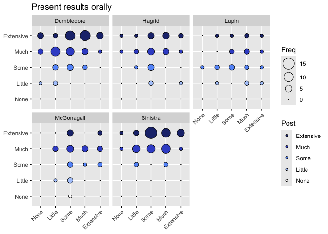<!-- -->

```
## 
## Call:
## glm(formula = as.numeric(Q9_15_post) ~ as.numeric(Q10_15_pre) + 
##     Instructor + Rookie, data = Q_15Clean)
## 
## Coefficients:
##                        Estimate Std. Error t value Pr(>|t|)    
## (Intercept)             3.79082    0.21241  17.847  < 2e-16 ***
## as.numeric(Q10_15_pre)  0.16235    0.05438   2.986 0.003159 ** 
## InstructorHagrid       -0.25371    0.18154  -1.398 0.163696    
## InstructorLupin        -0.84378    0.20525  -4.111 5.62e-05 ***
## InstructorMcGonagall   -0.68594    0.18324  -3.743 0.000233 ***
## InstructorSinistra      0.16942    0.14944   1.134 0.258192    
## RookieVeteran          -0.01573    0.13329  -0.118 0.906184    
## ---
## Signif. codes:  0 '***' 0.001 '**' 0.01 '*' 0.05 '.' 0.1 ' ' 1
## 
## (Dispersion parameter for gaussian family taken to be 0.7172459)
## 
##     Null deviance: 185.70  on 220  degrees of freedom
## Residual deviance: 153.49  on 214  degrees of freedom
## AIC: 562.61
## 
## Number of Fisher Scoring iterations: 2
```

```
## Analysis of Deviance Table (Type III tests)
## 
## Response: as.numeric(Q9_15_post)
## Error estimate based on Pearson residuals 
## 
##                         Sum Sq  Df F values    Pr(>F)    
## as.numeric(Q10_15_pre)   6.394   1   8.9145  0.003159 ** 
## Instructor              27.491   4   9.5821 3.808e-07 ***
## Rookie                   0.010   1   0.0139  0.906184    
## Residuals              153.491 214                       
## ---
## Signif. codes:  0 '***' 0.001 '**' 0.01 '*' 0.05 '.' 0.1 ' ' 1
```

```
## boundary (singular) fit: see help('isSingular')
```

```
## Linear mixed model fit by REML. t-tests use Satterthwaite's method [
## lmerModLmerTest]
## Formula: as.numeric(Q9_15_post) ~ as.numeric(Q10_15_pre) + Instructor +  
##     (1 | Classroom)
##    Data: Q_15Clean
## 
## REML criterion at convergence: 561.7
## 
## Scaled residuals: 
##     Min      1Q  Median      3Q     Max 
## -3.0538 -0.5139  0.1727  0.6776  2.0547 
## 
## Random effects:
##  Groups    Name        Variance Std.Dev.
##  Classroom (Intercept) 0.000    0.000   
##  Residual              0.714    0.845   
## Number of obs: 221, groups:  Classroom, 14
## 
## Fixed effects:
##                         Estimate Std. Error        df t value Pr(>|t|)    
## (Intercept)              3.77979    0.19029 215.00000  19.863  < 2e-16 ***
## as.numeric(Q10_15_pre)   0.16192    0.05413 215.00000   2.991 0.003101 ** 
## InstructorHagrid        -0.24960    0.17776 215.00000  -1.404 0.161717    
## InstructorLupin         -0.83978    0.20197 215.00000  -4.158 4.64e-05 ***
## InstructorMcGonagall    -0.68521    0.18271 215.00000  -3.750 0.000227 ***
## InstructorSinistra       0.16869    0.14897 215.00000   1.132 0.258751    
## ---
## Signif. codes:  0 '***' 0.001 '**' 0.01 '*' 0.05 '.' 0.1 ' ' 1
## 
## Correlation of Fixed Effects:
##             (Intr) a.(Q10 InstrH InstrL InstMG
## a.(Q10_15_) -0.845                            
## InstrctrHgr -0.230 -0.089                     
## InstrctrLpn -0.159 -0.131  0.300              
## InstrctrMcG -0.173 -0.147  0.332  0.300       
## InstrctrSns -0.262 -0.122  0.402  0.360  0.398
## optimizer (nloptwrap) convergence code: 0 (OK)
## boundary (singular) fit: see help('isSingular')
```

```
## Analysis of Deviance Table (Type III Wald F tests with Kenward-Roger df)
## 
## Response: as.numeric(Q9_15_post)
##                               F Df  Df.res    Pr(>F)    
## (Intercept)            382.4141  1  55.745 < 2.2e-16 ***
## as.numeric(Q10_15_pre)   8.7904  1 214.754  0.003370 ** 
## Instructor               9.2463  4   7.194  0.005862 ** 
## ---
## Signif. codes:  0 '***' 0.001 '**' 0.01 '*' 0.05 '.' 0.1 ' ' 1
```

```
## Random effect variances not available. Returned R2 does not account for random effects.
```

```
## # Comparison of Model Performance Indices
## 
## Name              |           Model | AIC (weights) | AICc (weights)
## --------------------------------------------------------------------
## imp_model_Q10_15  |             glm | 562.6 (0.502) |  563.3 (0.502)
## lmer_model_Q10_15 | lmerModLmerTest | 562.6 (0.498) |  563.3 (0.498)
## 
## Name              | BIC (weights) |  RMSE | Sigma |    R2 | R2 (cond.) | R2 (marg.)
## -----------------------------------------------------------------------------------
## imp_model_Q10_15  | 589.8 (0.502) | 0.833 | 0.847 | 0.173 |            |           
## lmer_model_Q10_15 | 589.8 (0.498) | 0.833 | 0.845 |       |            |      0.170
```

```
## Random effect variances not available. Returned R2 does not account for random effects.
```

```
## # Comparison of Model Performance Indices
## 
## Name                | Model | AIC (weights) | BIC (weights) |  RMSE | Sigma
## ---------------------------------------------------------------------------
## imp_model_Q10_15_ml |   gls | 560.6 (0.731) | 584.4 (0.937) | 0.833 | 0.833
## lme_model_Q10_15_ml |   lme | 562.6 (0.269) | 589.8 (0.063) | 0.833 | 0.833
## 
## Name                |    R2 | AICc (weights) | R2 (cond.) | R2 (marg.)
## ----------------------------------------------------------------------
## imp_model_Q10_15_ml | 0.173 |        (>.999) |            |           
## lme_model_Q10_15_ml |       |  563.3 (>.999) |            |      0.174
```

```
##                     Model df      AIC      BIC    logLik   Test      L.Ratio
## imp_model_Q10_15_ml     1  7 560.6256 584.4127 -273.3128                    
## lme_model_Q10_15_ml     2  8 562.6256 589.8109 -273.3128 1 vs 2 1.300787e-07
##                     p-value
## imp_model_Q10_15_ml        
## lme_model_Q10_15_ml  0.9997
```

*Presurvey* and *Instructor* meets cutoff

### Q10_16

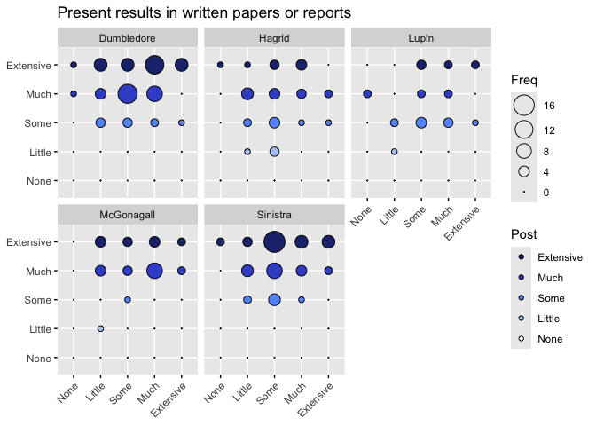<!-- -->

```
## 
## Call:
## glm(formula = as.numeric(Q9_16_post) ~ as.numeric(Q10_16_pre) + 
##     Instructor + Rookie, data = Q_16Clean)
## 
## Coefficients:
##                        Estimate Std. Error t value Pr(>|t|)    
## (Intercept)             3.97099    0.21420  18.539  < 2e-16 ***
## as.numeric(Q10_16_pre)  0.12244    0.05186   2.361  0.01913 *  
## InstructorHagrid       -0.51950    0.16241  -3.199  0.00159 ** 
## InstructorLupin        -0.54802    0.18443  -2.971  0.00330 ** 
## InstructorMcGonagall   -0.03891    0.16272  -0.239  0.81122    
## InstructorSinistra      0.10064    0.13475   0.747  0.45596    
## RookieVeteran          -0.05397    0.12032  -0.449  0.65422    
## ---
## Signif. codes:  0 '***' 0.001 '**' 0.01 '*' 0.05 '.' 0.1 ' ' 1
## 
## (Dispersion parameter for gaussian family taken to be 0.5906496)
## 
##     Null deviance: 145.09  on 222  degrees of freedom
## Residual deviance: 127.58  on 216  degrees of freedom
## AIC: 524.32
## 
## Number of Fisher Scoring iterations: 2
```

```
## Analysis of Deviance Table (Type III tests)
## 
## Response: as.numeric(Q9_16_post)
## Error estimate based on Pearson residuals 
## 
##                         Sum Sq  Df F values    Pr(>F)    
## as.numeric(Q10_16_pre)   3.292   1   5.5732 0.0191271 *  
## Instructor              13.217   4   5.5941 0.0002651 ***
## Rookie                   0.119   1   0.2012 0.6542240    
## Residuals              127.580 216                       
## ---
## Signif. codes:  0 '***' 0.001 '**' 0.01 '*' 0.05 '.' 0.1 ' ' 1
```

```
## boundary (singular) fit: see help('isSingular')
```

```
## Linear mixed model fit by REML. t-tests use Satterthwaite's method [
## lmerModLmerTest]
## Formula: as.numeric(Q9_16_post) ~ as.numeric(Q10_16_pre) + Instructor +  
##     (1 | Classroom)
##    Data: Q_16Clean
## 
## REML criterion at convergence: 524.7
## 
## Scaled residuals: 
##     Min      1Q  Median      3Q     Max 
## -2.7857 -0.5450  0.1156  0.7902  1.8954 
## 
## Random effects:
##  Groups    Name        Variance Std.Dev.
##  Classroom (Intercept) 0.0000   0.0000  
##  Residual              0.5885   0.7671  
## Number of obs: 223, groups:  Classroom, 14
## 
## Fixed effects:
##                         Estimate Std. Error        df t value Pr(>|t|)    
## (Intercept)              3.93094    0.19434 217.00000  20.228  < 2e-16 ***
## as.numeric(Q10_16_pre)   0.12178    0.05175 217.00000   2.353  0.01950 *  
## InstructorHagrid        -0.50671    0.15959 217.00000  -3.175  0.00172 ** 
## InstructorLupin         -0.53505    0.18181 217.00000  -2.943  0.00361 ** 
## InstructorMcGonagall    -0.03752    0.16239 217.00000  -0.231  0.81748    
## InstructorSinistra       0.09755    0.13433 217.00000   0.726  0.46850    
## ---
## Signif. codes:  0 '***' 0.001 '**' 0.01 '*' 0.05 '.' 0.1 ' ' 1
## 
## Correlation of Fixed Effects:
##             (Intr) a.(Q10 InstrH InstrL InstMG
## a.(Q10_16_) -0.880                            
## InstrctrHgr -0.337  0.071                     
## InstrctrLpn -0.255  0.015  0.295              
## InstrctrMcG -0.254 -0.019  0.328  0.289       
## InstrctrSns -0.359  0.036  0.400  0.350  0.390
## optimizer (nloptwrap) convergence code: 0 (OK)
## boundary (singular) fit: see help('isSingular')
```

```
## Analysis of Deviance Table (Type III Wald F tests with Kenward-Roger df)
## 
## Response: as.numeric(Q9_16_post)
##                               F Df  Df.res  Pr(>F)    
## (Intercept)            401.1950  1  86.083 < 2e-16 ***
## as.numeric(Q10_16_pre)   5.4833  1 214.343 0.02012 *  
## Instructor               5.5224  4   6.928 0.02547 *  
## ---
## Signif. codes:  0 '***' 0.001 '**' 0.01 '*' 0.05 '.' 0.1 ' ' 1
```

```
## Random effect variances not available. Returned R2 does not account for random effects.
```

```
## # Comparison of Model Performance Indices
## 
## Name              |           Model | AIC (weights) | AICc (weights)
## --------------------------------------------------------------------
## imp_model_Q10_16  |             glm | 524.3 (0.526) |  525.0 (0.526)
## lmer_model_Q10_16 | lmerModLmerTest | 524.5 (0.474) |  525.2 (0.474)
## 
## Name              | BIC (weights) |  RMSE | Sigma |    R2 | R2 (cond.) | R2 (marg.)
## -----------------------------------------------------------------------------------
## imp_model_Q10_16  | 551.6 (0.526) | 0.756 | 0.769 | 0.121 |            |           
## lmer_model_Q10_16 | 551.8 (0.474) | 0.757 | 0.767 |       |            |      0.118
```

```
## Random effect variances not available. Returned R2 does not account for random effects.
```

```
## # Comparison of Model Performance Indices
## 
## Name                | Model | AIC (weights) | BIC (weights) |  RMSE | Sigma
## ---------------------------------------------------------------------------
## imp_model_Q10_16_ml |   gls | 522.5 (0.731) | 546.4 (0.937) | 0.757 | 0.757
## lme_model_Q10_16_ml |   lme | 524.5 (0.269) | 551.8 (0.063) | 0.757 | 0.757
## 
## Name                |     R2 | AICc (weights) | R2 (cond.) | R2 (marg.)
## -----------------------------------------------------------------------
## imp_model_Q10_16_ml | -1.417 |        (>.999) |            |           
## lme_model_Q10_16_ml |        |  525.2 (>.999) |            |      0.120
```

```
##                     Model df      AIC      BIC    logLik   Test      L.Ratio
## imp_model_Q10_16_ml     1  7 522.5252 546.3754 -254.2626                    
## lme_model_Q10_16_ml     2  8 524.5252 551.7826 -254.2626 1 vs 2 1.314486e-07
##                     p-value
## imp_model_Q10_16_ml        
## lme_model_Q10_16_ml  0.9997
```

*Presurvey* and *Instructor* meet cutoff

### Q10_17

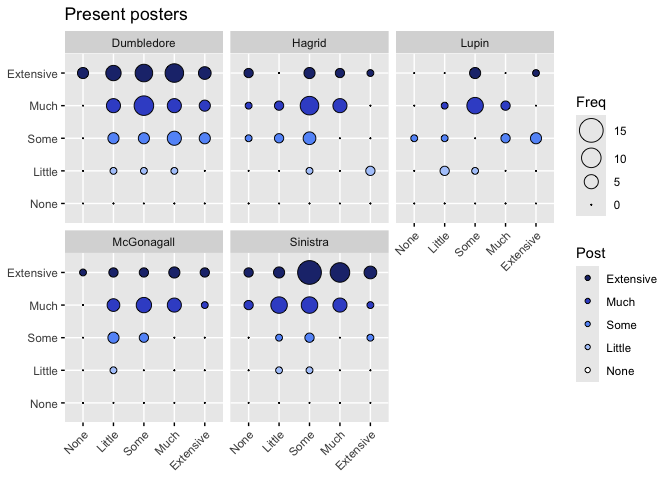<!-- -->

```
## 
## Call:
## glm(formula = as.numeric(Q9_17_post) ~ as.numeric(Q10_17_pre) + 
##     Instructor + Rookie, data = Q_17Clean)
## 
## Coefficients:
##                        Estimate Std. Error t value Pr(>|t|)    
## (Intercept)             4.06476    0.22142  18.358  < 2e-16 ***
## as.numeric(Q10_17_pre)  0.04555    0.05377   0.847  0.39780    
## InstructorHagrid       -0.29657    0.17776  -1.668  0.09668 .  
## InstructorLupin        -0.53891    0.20200  -2.668  0.00821 ** 
## InstructorMcGonagall   -0.04281    0.18029  -0.237  0.81251    
## InstructorSinistra      0.28850    0.14747   1.956  0.05172 .  
## RookieVeteran          -0.09027    0.13237  -0.682  0.49599    
## ---
## Signif. codes:  0 '***' 0.001 '**' 0.01 '*' 0.05 '.' 0.1 ' ' 1
## 
## (Dispersion parameter for gaussian family taken to be 0.7107257)
## 
##     Null deviance: 168.20  on 222  degrees of freedom
## Residual deviance: 153.52  on 216  degrees of freedom
## AIC: 565.59
## 
## Number of Fisher Scoring iterations: 2
```

```
## Analysis of Deviance Table (Type III tests)
## 
## Response: as.numeric(Q9_17_post)
## Error estimate based on Pearson residuals 
## 
##                         Sum Sq  Df F values    Pr(>F)    
## as.numeric(Q10_17_pre)   0.510   1   0.7178 0.3978039    
## Instructor              14.143   4   4.9748 0.0007435 ***
## Rookie                   0.331   1   0.4651 0.4959934    
## Residuals              153.517 216                       
## ---
## Signif. codes:  0 '***' 0.001 '**' 0.01 '*' 0.05 '.' 0.1 ' ' 1
```

```
## Linear mixed model fit by REML. t-tests use Satterthwaite's method [
## lmerModLmerTest]
## Formula: as.numeric(Q9_17_post) ~ as.numeric(Q10_17_pre) + Instructor +  
##     (1 | Classroom)
##    Data: Q_17Clean
## 
## REML criterion at convergence: 565.3
## 
## Scaled residuals: 
##     Min      1Q  Median      3Q     Max 
## -2.8691 -0.4927  0.1189  0.7448  1.6469 
## 
## Random effects:
##  Groups    Name        Variance  Std.Dev.
##  Classroom (Intercept) 0.0004916 0.02217 
##  Residual              0.7086692 0.84182 
## Number of obs: 223, groups:  Classroom, 14
## 
## Fixed effects:
##                         Estimate Std. Error        df t value Pr(>|t|)    
## (Intercept)              4.00447    0.20231  60.07458  19.794   <2e-16 ***
## as.numeric(Q10_17_pre)   0.04254    0.05354 215.63391   0.795   0.4277    
## InstructorHagrid        -0.27631    0.17584   5.97519  -1.571   0.1674    
## InstructorLupin         -0.51766    0.20008  10.07662  -2.587   0.0269 *  
## InstructorMcGonagall    -0.04094    0.18120   5.08174  -0.226   0.8301    
## InstructorSinistra       0.28274    0.14802   5.43496   1.910   0.1097    
## ---
## Signif. codes:  0 '***' 0.001 '**' 0.01 '*' 0.05 '.' 0.1 ' ' 1
## 
## Correlation of Fixed Effects:
##             (Intr) a.(Q10 InstrH InstrL InstMG
## a.(Q10_17_) -0.866                            
## InstrctrHgr -0.352  0.074                     
## InstrctrLpn -0.258  0.006  0.292              
## InstrctrMcG -0.333  0.062  0.326  0.283       
## InstrctrSns -0.392  0.057  0.398  0.347  0.386
```

```
## Analysis of Deviance Table (Type III Wald F tests with Kenward-Roger df)
## 
## Response: as.numeric(Q9_17_post)
##                               F Df  Df.res  Pr(>F)    
## (Intercept)            379.8763  1  65.312 < 2e-16 ***
## as.numeric(Q10_17_pre)   0.6154  1 215.785 0.43363    
## Instructor               4.6079  4   7.105 0.03786 *  
## ---
## Signif. codes:  0 '***' 0.001 '**' 0.01 '*' 0.05 '.' 0.1 ' ' 1
```

```
## # Comparison of Model Performance Indices
## 
## Name              |           Model | AIC (weights) | AICc (weights)
## --------------------------------------------------------------------
## imp_model_Q10_17  |             glm | 565.6 (0.567) |  566.3 (0.567)
## lmer_model_Q10_17 | lmerModLmerTest | 566.1 (0.433) |  566.8 (0.433)
## 
## Name              | BIC (weights) |  RMSE | Sigma |    R2 | R2 (cond.)
## ----------------------------------------------------------------------
## imp_model_Q10_17  | 592.8 (0.567) | 0.830 | 0.843 | 0.087 |           
## lmer_model_Q10_17 | 593.4 (0.433) | 0.830 | 0.842 |       |      0.084
## 
## Name              | R2 (marg.) |       ICC
## ------------------------------------------
## imp_model_Q10_17  |            |          
## lmer_model_Q10_17 |      0.084 | 6.933e-04
```

```
## Random effect variances not available. Returned R2 does not account for random effects.
```

```
## # Comparison of Model Performance Indices
## 
## Name                | Model | AIC (weights) | BIC (weights) |  RMSE | Sigma
## ---------------------------------------------------------------------------
## imp_model_Q10_17_ml |   gls | 564.1 (0.731) | 587.9 (0.937) | 0.831 | 0.831
## lme_model_Q10_17_ml |   lme | 566.1 (0.269) | 593.3 (0.063) | 0.831 | 0.831
## 
## Name                |     R2 | AICc (weights) | R2 (cond.) | R2 (marg.)
## -----------------------------------------------------------------------
## imp_model_Q10_17_ml | -1.241 |        (>.999) |            |           
## lme_model_Q10_17_ml |        |  566.7 (>.999) |            |      0.086
```

```
##                     Model df      AIC      BIC    logLik   Test      L.Ratio
## imp_model_Q10_17_ml     1  7 564.0665 587.9167 -275.0332                    
## lme_model_Q10_17_ml     2  8 566.0665 593.3239 -275.0332 1 vs 2 1.312596e-07
##                     p-value
## imp_model_Q10_17_ml        
## lme_model_Q10_17_ml  0.9997
```

*Instructor* meets cutoff.

### Q10_18

<!-- -->

```
## 
## Call:
## glm(formula = as.numeric(Q9_18_post) ~ as.numeric(Q10_18_pre) + 
##     Instructor + Rookie, data = Q_18Clean)
## 
## Coefficients:
##                        Estimate Std. Error t value Pr(>|t|)    
## (Intercept)             3.96202    0.19471  20.348  < 2e-16 ***
## as.numeric(Q10_18_pre)  0.13812    0.05454   2.533    0.012 *  
## InstructorHagrid       -0.94203    0.17924  -5.256 3.56e-07 ***
## InstructorLupin        -0.91211    0.19959  -4.570 8.24e-06 ***
## InstructorMcGonagall   -0.10211    0.17794  -0.574    0.567    
## InstructorSinistra     -0.20153    0.14736  -1.368    0.173    
## RookieVeteran          -0.02412    0.13131  -0.184    0.854    
## ---
## Signif. codes:  0 '***' 0.001 '**' 0.01 '*' 0.05 '.' 0.1 ' ' 1
## 
## (Dispersion parameter for gaussian family taken to be 0.6880384)
## 
##     Null deviance: 180.78  on 220  degrees of freedom
## Residual deviance: 147.24  on 214  degrees of freedom
## AIC: 553.42
## 
## Number of Fisher Scoring iterations: 2
```

```
## Analysis of Deviance Table (Type III tests)
## 
## Response: as.numeric(Q9_18_post)
## Error estimate based on Pearson residuals 
## 
##                         Sum Sq  Df F values    Pr(>F)    
## as.numeric(Q10_18_pre)   4.413   1   6.4139   0.01204 *  
## Instructor              29.076   4  10.5647 7.874e-08 ***
## Rookie                   0.023   1   0.0337   0.85445    
## Residuals              147.240 214                       
## ---
## Signif. codes:  0 '***' 0.001 '**' 0.01 '*' 0.05 '.' 0.1 ' ' 1
```

```
## boundary (singular) fit: see help('isSingular')
```

```
## Linear mixed model fit by REML. t-tests use Satterthwaite's method [
## lmerModLmerTest]
## Formula: as.numeric(Q9_18_post) ~ as.numeric(Q10_18_pre) + Instructor +  
##     (1 | Classroom)
##    Data: Q_18Clean
## 
## REML criterion at convergence: 552.8
## 
## Scaled residuals: 
##     Min      1Q  Median      3Q     Max 
## -2.9253 -0.4749 -0.1007  0.7768  2.0733 
## 
## Random effects:
##  Groups    Name        Variance Std.Dev.
##  Classroom (Intercept) 0.0000   0.0000  
##  Residual              0.6849   0.8276  
## Number of obs: 221, groups:  Classroom, 14
## 
## Fixed effects:
##                         Estimate Std. Error        df t value Pr(>|t|)    
## (Intercept)              3.94638    0.17471 215.00000  22.588  < 2e-16 ***
## as.numeric(Q10_18_pre)   0.13692    0.05403 215.00000   2.534    0.012 *  
## InstructorHagrid        -0.93611    0.17592 215.00000  -5.321 2.58e-07 ***
## InstructorLupin         -0.90625    0.19658 215.00000  -4.610 6.90e-06 ***
## InstructorMcGonagall    -0.10102    0.17744 215.00000  -0.569    0.570    
## InstructorSinistra      -0.20248    0.14694 215.00000  -1.378    0.170    
## ---
## Signif. codes:  0 '***' 0.001 '**' 0.01 '*' 0.05 '.' 0.1 ' ' 1
## 
## Correlation of Fixed Effects:
##             (Intr) a.(Q10 InstrH InstrL InstMG
## a.(Q10_18_) -0.819                            
## InstrctrHgr -0.202 -0.154                     
## InstrctrLpn -0.270 -0.028  0.296              
## InstrctrMcG -0.207 -0.144  0.345  0.293       
## InstrctrSns -0.272 -0.148  0.412  0.353  0.408
## optimizer (nloptwrap) convergence code: 0 (OK)
## boundary (singular) fit: see help('isSingular')
```

```
## Analysis of Deviance Table (Type III Wald F tests with Kenward-Roger df)
## 
## Response: as.numeric(Q9_18_post)
##                               F Df  Df.res    Pr(>F)    
## (Intercept)            490.2738  1  39.479 < 2.2e-16 ***
## as.numeric(Q10_18_pre)   6.2615  1 212.786  0.013091 *  
## Instructor              10.8478  4   7.025  0.003965 ** 
## ---
## Signif. codes:  0 '***' 0.001 '**' 0.01 '*' 0.05 '.' 0.1 ' ' 1
```

```
## Random effect variances not available. Returned R2 does not account for random effects.
```

```
## # Comparison of Model Performance Indices
## 
## Name              |           Model | AIC (weights) | AICc (weights)
## --------------------------------------------------------------------
## imp_model_Q10_18  |             glm | 553.4 (0.504) |  554.1 (0.504)
## lmer_model_Q10_18 | lmerModLmerTest | 553.5 (0.496) |  554.1 (0.496)
## 
## Name              | BIC (weights) |  RMSE | Sigma |    R2 | R2 (cond.) | R2 (marg.)
## -----------------------------------------------------------------------------------
## imp_model_Q10_18  | 580.6 (0.504) | 0.816 | 0.829 | 0.186 |            |           
## lmer_model_Q10_18 | 580.6 (0.496) | 0.816 | 0.828 |       |            |      0.182
```

```
## Random effect variances not available. Returned R2 does not account for random effects.
```

```
## # Comparison of Model Performance Indices
## 
## Name                | Model | AIC (weights) | BIC (weights) |  RMSE | Sigma
## ---------------------------------------------------------------------------
## imp_model_Q10_18_ml |   gls | 551.5 (0.731) | 575.2 (0.937) | 0.816 | 0.816
## lme_model_Q10_18_ml |   lme | 553.5 (0.269) | 580.6 (0.063) | 0.816 | 0.816
## 
## Name                |    R2 | AICc (weights) | R2 (cond.) | R2 (marg.)
## ----------------------------------------------------------------------
## imp_model_Q10_18_ml | 0.185 |        (>.999) |            |           
## lme_model_Q10_18_ml |       |  554.1 (>.999) |            |      0.186
```

```
##                     Model df      AIC      BIC    logLik   Test      L.Ratio
## imp_model_Q10_18_ml     1  7 551.4582 575.2453 -268.7291                    
## lme_model_Q10_18_ml     2  8 553.4582 580.6435 -268.7291 1 vs 2 1.279138e-07
##                     p-value
## imp_model_Q10_18_ml        
## lme_model_Q10_18_ml  0.9997
```

*Presurvey* and *Instructor* meets cutoff.

### Q10_19

<!-- -->

```
## 
## Call:
## glm(formula = as.numeric(Q9_19_post) ~ as.numeric(Q10_19_pre) + 
##     Instructor + Rookie, data = Q_19Clean)
## 
## Coefficients:
##                         Estimate Std. Error t value Pr(>|t|)    
## (Intercept)             2.986703   0.327333   9.124  < 2e-16 ***
## as.numeric(Q10_19_pre)  0.058648   0.072600   0.808 0.420101    
## InstructorHagrid        0.029507   0.242674   0.122 0.903340    
## InstructorLupin         0.250393   0.271019   0.924 0.356602    
## InstructorMcGonagall   -0.002791   0.247064  -0.011 0.990998    
## InstructorSinistra      0.672033   0.199586   3.367 0.000903 ***
## RookieVeteran          -0.146923   0.179929  -0.817 0.415103    
## ---
## Signif. codes:  0 '***' 0.001 '**' 0.01 '*' 0.05 '.' 0.1 ' ' 1
## 
## (Dispersion parameter for gaussian family taken to be 1.266436)
## 
##     Null deviance: 285.77  on 216  degrees of freedom
## Residual deviance: 265.95  on 210  degrees of freedom
## AIC: 675.96
## 
## Number of Fisher Scoring iterations: 2
```

```
## Analysis of Deviance Table (Type III tests)
## 
## Response: as.numeric(Q9_19_post)
## Error estimate based on Pearson residuals 
## 
##                         Sum Sq  Df F values Pr(>F)   
## as.numeric(Q10_19_pre)   0.826   1   0.6526 0.4201   
## Instructor              18.243   4   3.6013 0.0073 **
## Rookie                   0.844   1   0.6668 0.4151   
## Residuals              265.952 210                   
## ---
## Signif. codes:  0 '***' 0.001 '**' 0.01 '*' 0.05 '.' 0.1 ' ' 1
```

```
## boundary (singular) fit: see help('isSingular')
```

```
## Linear mixed model fit by REML. t-tests use Satterthwaite's method [
## lmerModLmerTest]
## Formula: as.numeric(Q9_19_post) ~ as.numeric(Q10_19_pre) + Instructor +  
##     (1 | Classroom)
##    Data: Q_19Clean
## 
## REML criterion at convergence: 672.2
## 
## Scaled residuals: 
##      Min       1Q   Median       3Q      Max 
## -2.41498 -0.88374 -0.09211  0.79719  1.83302 
## 
## Random effects:
##  Groups    Name        Variance Std.Dev.
##  Classroom (Intercept) 0.000    0.000   
##  Residual              1.264    1.124   
## Number of obs: 217, groups:  Classroom, 14
## 
## Fixed effects:
##                         Estimate Std. Error        df t value Pr(>|t|)    
## (Intercept)            2.884e+00  3.019e-01 2.110e+02   9.552  < 2e-16 ***
## as.numeric(Q10_19_pre) 5.492e-02  7.240e-02 2.110e+02   0.759 0.448950    
## InstructorHagrid       6.966e-02  2.375e-01 2.110e+02   0.293 0.769534    
## InstructorLupin        2.874e-01  2.670e-01 2.110e+02   1.077 0.282883    
## InstructorMcGonagall   1.911e-03  2.468e-01 2.110e+02   0.008 0.993828    
## InstructorSinistra     6.669e-01  1.993e-01 2.110e+02   3.346 0.000971 ***
## ---
## Signif. codes:  0 '***' 0.001 '**' 0.01 '*' 0.05 '.' 0.1 ' ' 1
## 
## Correlation of Fixed Effects:
##             (Intr) a.(Q10 InstrH InstrL InstMG
## a.(Q10_19_) -0.892                            
## InstrctrHgr -0.167 -0.103                     
## InstrctrLpn -0.234  0.003  0.293              
## InstrctrMcG -0.203 -0.053  0.323  0.282       
## InstrctrSns -0.218 -0.101  0.403  0.349  0.383
## optimizer (nloptwrap) convergence code: 0 (OK)
## boundary (singular) fit: see help('isSingular')
```

```
## Analysis of Deviance Table (Type III Wald F tests with Kenward-Roger df)
## 
## Response: as.numeric(Q9_19_post)
##                              F Df  Df.res   Pr(>F)    
## (Intercept)            86.9619  1  70.027 6.69e-14 ***
## as.numeric(Q10_19_pre)  0.5525  1 204.120  0.45816    
## Instructor              3.1585  4   6.992  0.08809 .  
## ---
## Signif. codes:  0 '***' 0.001 '**' 0.01 '*' 0.05 '.' 0.1 ' ' 1
```

```
## Random effect variances not available. Returned R2 does not account for random effects.
```

```
## # Comparison of Model Performance Indices
## 
## Name              |           Model | AIC (weights) | AICc (weights)
## --------------------------------------------------------------------
## imp_model_Q10_19  |             glm | 676.0 (0.585) |  676.7 (0.585)
## lmer_model_Q10_19 | lmerModLmerTest | 676.6 (0.415) |  677.3 (0.415)
## 
## Name              | BIC (weights) |  RMSE | Sigma |    R2 | R2 (cond.) | R2 (marg.)
## -----------------------------------------------------------------------------------
## imp_model_Q10_19  | 703.0 (0.585) | 1.107 | 1.125 | 0.069 |            |           
## lmer_model_Q10_19 | 703.7 (0.415) | 1.109 | 1.124 |       |            |      0.065
```

```
## Random effect variances not available. Returned R2 does not account for random effects.
```

```
## # Comparison of Model Performance Indices
## 
## Name                | Model | AIC (weights) | BIC (weights) |  RMSE | Sigma
## ---------------------------------------------------------------------------
## imp_model_Q10_19_ml |   gls | 674.6 (0.731) | 698.3 (0.936) | 1.109 | 1.109
## lme_model_Q10_19_ml |   lme | 676.6 (0.269) | 703.7 (0.064) | 1.109 | 1.109
## 
## Name                |    R2 | AICc (weights) | R2 (cond.) | R2 (marg.)
## ----------------------------------------------------------------------
## imp_model_Q10_19_ml | 0.066 |        (>.999) |            |           
## lme_model_Q10_19_ml |       |  677.3 (>.999) |            |      0.067
```

```
##                     Model df      AIC      BIC    logLik   Test     L.Ratio
## imp_model_Q10_19_ml     1  7 674.6487 698.3080 -330.3244                   
## lme_model_Q10_19_ml     2  8 676.6487 703.6879 -330.3244 1 vs 2 1.32377e-07
##                     p-value
## imp_model_Q10_19_ml        
## lme_model_Q10_19_ml  0.9997
```

Nothing meets cutoff.

### Q10_20

<!-- -->

```
## 
## Call:
## glm(formula = as.numeric(Q9_20_post) ~ as.numeric(Q10_20_pre) + 
##     Instructor + Rookie, data = Q_20Clean)
## 
## Coefficients:
##                         Estimate Std. Error t value Pr(>|t|)    
## (Intercept)             1.928903   0.382953   5.037 1.11e-06 ***
## as.numeric(Q10_20_pre)  0.015416   0.079076   0.195   0.8456    
## InstructorHagrid        0.279209   0.277501   1.006   0.3156    
## InstructorLupin        -0.128520   0.307085  -0.419   0.6761    
## InstructorMcGonagall   -0.005815   0.285295  -0.020   0.9838    
## InstructorSinistra      0.518071   0.224456   2.308   0.0221 *  
## RookieVeteran           0.071371   0.211078   0.338   0.7356    
## ---
## Signif. codes:  0 '***' 0.001 '**' 0.01 '*' 0.05 '.' 0.1 ' ' 1
## 
## (Dispersion parameter for gaussian family taken to be 1.469149)
## 
##     Null deviance: 286.34  on 193  degrees of freedom
## Residual deviance: 274.73  on 187  degrees of freedom
## AIC: 634.05
## 
## Number of Fisher Scoring iterations: 2
```

```
## Analysis of Deviance Table (Type III tests)
## 
## Response: as.numeric(Q9_20_post)
## Error estimate based on Pearson residuals 
## 
##                         Sum Sq  Df F values Pr(>F)
## as.numeric(Q10_20_pre)   0.056   1   0.0380 0.8456
## Instructor              11.276   4   1.9188 0.1090
## Rookie                   0.168   1   0.1143 0.7356
## Residuals              274.731 187
```

```
## boundary (singular) fit: see help('isSingular')
```

```
## Linear mixed model fit by REML. t-tests use Satterthwaite's method [
## lmerModLmerTest]
## Formula: as.numeric(Q9_20_post) ~ as.numeric(Q10_20_pre) + Instructor +  
##     (1 | Classroom)
##    Data: Q_20Clean
## 
## REML criterion at convergence: 628.2
## 
## Scaled residuals: 
##      Min       1Q   Median       3Q      Max 
## -1.30979 -0.86578 -0.05241  0.58863  2.44638 
## 
## Random effects:
##  Groups    Name        Variance Std.Dev.
##  Classroom (Intercept) 0.000    0.000   
##  Residual              1.462    1.209   
## Number of obs: 194, groups:  Classroom, 14
## 
## Fixed effects:
##                          Estimate Std. Error         df t value Pr(>|t|)    
## (Intercept)              1.989718   0.337291 188.000000   5.899 1.67e-08 ***
## as.numeric(Q10_20_pre)   0.014732   0.078864 188.000000   0.187   0.8520    
## InstructorHagrid         0.254299   0.266913 188.000000   0.953   0.3419    
## InstructorLupin         -0.142482   0.303578 188.000000  -0.469   0.6394    
## InstructorMcGonagall    -0.006879   0.284605 188.000000  -0.024   0.9807    
## InstructorSinistra       0.520448   0.223817 188.000000   2.325   0.0211 *  
## ---
## Signif. codes:  0 '***' 0.001 '**' 0.01 '*' 0.05 '.' 0.1 ' ' 1
## 
## Correlation of Fixed Effects:
##             (Intr) a.(Q10 InstrH InstrL InstMG
## a.(Q10_20_) -0.896                            
## InstrctrHgr -0.258  0.009                     
## InstrctrLpn -0.202 -0.019  0.277              
## InstrctrMcG -0.222 -0.014  0.296  0.261       
## InstrctrSns -0.310  0.014  0.377  0.331  0.353
## optimizer (nloptwrap) convergence code: 0 (OK)
## boundary (singular) fit: see help('isSingular')
```

```
## Analysis of Deviance Table (Type III Wald F tests with Kenward-Roger df)
## 
## Response: as.numeric(Q9_20_post)
##                              F Df  Df.res    Pr(>F)    
## (Intercept)            33.3033  1  68.367 2.099e-07 ***
## as.numeric(Q10_20_pre)  0.0339  1 187.311    0.8540    
## Instructor              1.7792  4   6.900    0.2386    
## ---
## Signif. codes:  0 '***' 0.001 '**' 0.01 '*' 0.05 '.' 0.1 ' ' 1
```

```
## Random effect variances not available. Returned R2 does not account for random effects.
```

```
## # Comparison of Model Performance Indices
## 
## Name              |           Model | AIC (weights) | AICc (weights)
## --------------------------------------------------------------------
## imp_model_Q10_20  |             glm | 634.0 (0.515) |  634.8 (0.515)
## lmer_model_Q10_20 | lmerModLmerTest | 634.2 (0.485) |  634.9 (0.485)
## 
## Name              | BIC (weights) |  RMSE | Sigma |    R2 | R2 (cond.) | R2 (marg.)
## -----------------------------------------------------------------------------------
## imp_model_Q10_20  | 660.2 (0.515) | 1.190 | 1.212 | 0.041 |            |           
## lmer_model_Q10_20 | 660.3 (0.485) | 1.190 | 1.209 |       |            |      0.039
```

```
## Random effect variances not available. Returned R2 does not account for random effects.
```

```
## # Comparison of Model Performance Indices
## 
## Name                | Model | AIC (weights) | BIC (weights) |  RMSE | Sigma
## ---------------------------------------------------------------------------
## imp_model_Q10_20_ml |   gls | 632.2 (0.731) | 655.0 (0.933) | 1.190 | 1.190
## lme_model_Q10_20_ml |   lme | 634.2 (0.269) | 660.3 (0.067) | 1.190 | 1.190
## 
## Name                |    R2 | AICc (weights) | R2 (cond.) | R2 (marg.)
## ----------------------------------------------------------------------
## imp_model_Q10_20_ml | 0.040 |        (>.999) |            |           
## lme_model_Q10_20_ml |       |  634.9 (>.999) |            |      0.040
```

```
##                     Model df      AIC      BIC   logLik   Test      L.Ratio
## imp_model_Q10_20_ml     1  7 632.1659 655.0409 -309.083                    
## lme_model_Q10_20_ml     2  8 634.1659 660.3088 -309.083 1 vs 2 1.305691e-07
##                     p-value
## imp_model_Q10_20_ml        
## lme_model_Q10_20_ml  0.9997
```

Nothing meets cutoff.

### Q10_21

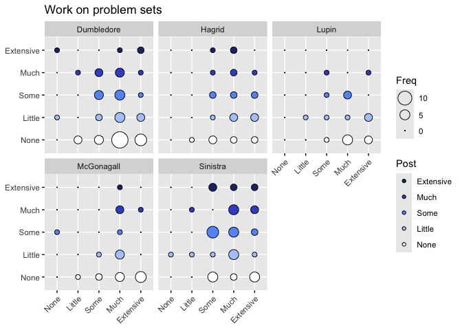<!-- -->

```
## 
## Call:
## glm(formula = as.numeric(Q9_21_post) ~ as.numeric(Q10_21_pre) + 
##     Instructor + Rookie, data = Q_21Clean)
## 
## Coefficients:
##                        Estimate Std. Error t value Pr(>|t|)    
## (Intercept)             2.50078    0.47387   5.277 3.74e-07 ***
## as.numeric(Q10_21_pre) -0.07181    0.10367  -0.693   0.4894    
## InstructorHagrid        0.33877    0.30662   1.105   0.2707    
## InstructorLupin        -0.23084    0.33437  -0.690   0.4909    
## InstructorMcGonagall   -0.18164    0.31079  -0.584   0.5596    
## InstructorSinistra      0.61294    0.24775   2.474   0.0143 *  
## RookieVeteran          -0.04347    0.23052  -0.189   0.8506    
## ---
## Signif. codes:  0 '***' 0.001 '**' 0.01 '*' 0.05 '.' 0.1 ' ' 1
## 
## (Dispersion parameter for gaussian family taken to be 1.715395)
## 
##     Null deviance: 328.99  on 186  degrees of freedom
## Residual deviance: 308.77  on 180  degrees of freedom
## AIC: 640.46
## 
## Number of Fisher Scoring iterations: 2
```

```
## Analysis of Deviance Table (Type III tests)
## 
## Response: as.numeric(Q9_21_post)
## Error estimate based on Pearson residuals 
## 
##                         Sum Sq  Df F values  Pr(>F)  
## as.numeric(Q10_21_pre)   0.823   1   0.4798 0.48941  
## Instructor              18.993   4   2.7680 0.02886 *
## Rookie                   0.061   1   0.0356 0.85064  
## Residuals              308.771 180                   
## ---
## Signif. codes:  0 '***' 0.001 '**' 0.01 '*' 0.05 '.' 0.1 ' ' 1
```

```
## boundary (singular) fit: see help('isSingular')
```

```
## Linear mixed model fit by REML. t-tests use Satterthwaite's method [
## lmerModLmerTest]
## Formula: as.numeric(Q9_21_post) ~ as.numeric(Q10_21_pre) + Instructor +  
##     (1 | Classroom)
##    Data: Q_21Clean
## 
## REML criterion at convergence: 633.1
## 
## Scaled residuals: 
##     Min      1Q  Median      3Q     Max 
## -1.4245 -0.8482 -0.1368  0.7565  2.2988 
## 
## Random effects:
##  Groups    Name        Variance Std.Dev.
##  Classroom (Intercept) 0.000    0.000   
##  Residual              1.706    1.306   
## Number of obs: 187, groups:  Classroom, 14
## 
## Fixed effects:
##                         Estimate Std. Error        df t value Pr(>|t|)    
## (Intercept)              2.46171    0.42503 181.00000   5.792 3.03e-08 ***
## as.numeric(Q10_21_pre)  -0.07075    0.10324 181.00000  -0.685   0.4940    
## InstructorHagrid         0.35195    0.29776 181.00000   1.182   0.2388    
## InstructorLupin         -0.22296    0.33087 181.00000  -0.674   0.5013    
## InstructorMcGonagall    -0.18154    0.30996 181.00000  -0.586   0.5588    
## InstructorSinistra       0.61134    0.24694 181.00000   2.476   0.0142 *  
## ---
## Signif. codes:  0 '***' 0.001 '**' 0.01 '*' 0.05 '.' 0.1 ' ' 1
## 
## Correlation of Fixed Effects:
##             (Intr) a.(Q10 InstrH InstrL InstMG
## a.(Q10_21_) -0.921                            
## InstrctrHgr -0.173 -0.048                     
## InstrctrLpn -0.122 -0.080  0.283              
## InstrctrMcG -0.157 -0.057  0.301  0.273       
## InstrctrSns -0.257 -0.006  0.375  0.337  0.360
## optimizer (nloptwrap) convergence code: 0 (OK)
## boundary (singular) fit: see help('isSingular')
```

```
## Analysis of Deviance Table (Type III Wald F tests with Kenward-Roger df)
## 
## Response: as.numeric(Q9_21_post)
##                              F Df  Df.res    Pr(>F)    
## (Intercept)            31.0371  1  65.458 5.125e-07 ***
## as.numeric(Q10_21_pre)  0.4455  1 166.946    0.5054    
## Instructor              2.5359  4   6.717    0.1373    
## ---
## Signif. codes:  0 '***' 0.001 '**' 0.01 '*' 0.05 '.' 0.1 ' ' 1
```

```
## Random effect variances not available. Returned R2 does not account for random effects.
```

```
## # Comparison of Model Performance Indices
## 
## Name              |           Model | AIC (weights) | AICc (weights)
## --------------------------------------------------------------------
## imp_model_Q10_21  |             glm | 640.5 (0.505) |  641.3 (0.505)
## lmer_model_Q10_21 | lmerModLmerTest | 640.5 (0.495) |  641.3 (0.495)
## 
## Name              | BIC (weights) |  RMSE | Sigma |    R2 | R2 (cond.) | R2 (marg.)
## -----------------------------------------------------------------------------------
## imp_model_Q10_21  | 666.3 (0.505) | 1.285 | 1.310 | 0.061 |            |           
## lmer_model_Q10_21 | 666.3 (0.495) | 1.285 | 1.306 |       |            |      0.060
```

```
## Random effect variances not available. Returned R2 does not account for random effects.
```

```
## # Comparison of Model Performance Indices
## 
## Name                | Model | AIC (weights) | BIC (weights) |  RMSE | Sigma
## ---------------------------------------------------------------------------
## imp_model_Q10_21_ml |   gls | 638.5 (0.731) | 661.1 (0.932) | 1.285 | 1.285
## lme_model_Q10_21_ml |   lme | 640.5 (0.269) | 666.3 (0.068) | 1.285 | 1.285
## 
## Name                |    R2 | AICc (weights) | R2 (cond.) | R2 (marg.)
## ----------------------------------------------------------------------
## imp_model_Q10_21_ml | 0.061 |        (>.999) |            |           
## lme_model_Q10_21_ml |       |  641.3 (>.999) |            |      0.062
```

```
##                     Model df      AIC      BIC    logLik   Test      L.Ratio
## imp_model_Q10_21_ml     1  7 638.4988 661.1166 -312.2494                    
## lme_model_Q10_21_ml     2  8 640.4988 666.3477 -312.2494 1 vs 2 1.308881e-07
##                     p-value
## imp_model_Q10_21_ml        
## lme_model_Q10_21_ml  0.9997
```

Nothing meets cutoff.

### Q10_22

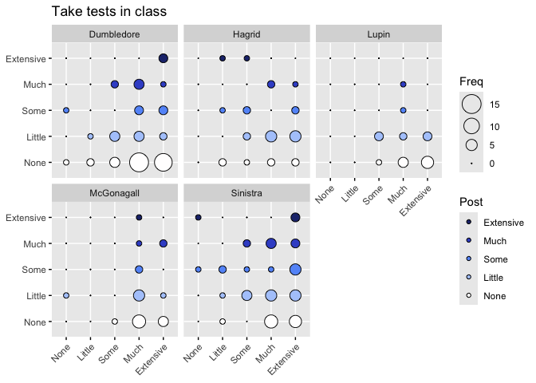<!-- -->

```
## 
## Call:
## glm(formula = as.numeric(Q9_22_post) ~ as.numeric(Q10_22_pre) + 
##     Instructor + Rookie, data = Q_22Clean)
## 
## Coefficients:
##                        Estimate Std. Error t value Pr(>|t|)    
## (Intercept)             2.02841    0.41057   4.940 1.75e-06 ***
## as.numeric(Q10_22_pre) -0.04083    0.08893  -0.459   0.6467    
## InstructorHagrid        0.44098    0.27907   1.580   0.1158    
## InstructorLupin        -0.27880    0.30722  -0.908   0.3653    
## InstructorMcGonagall    0.04492    0.28500   0.158   0.8749    
## InstructorSinistra      0.57764    0.22587   2.557   0.0114 *  
## RookieVeteran           0.06859    0.21153   0.324   0.7461    
## ---
## Signif. codes:  0 '***' 0.001 '**' 0.01 '*' 0.05 '.' 0.1 ' ' 1
## 
## (Dispersion parameter for gaussian family taken to be 1.451597)
## 
##     Null deviance: 283.45  on 189  degrees of freedom
## Residual deviance: 265.64  on 183  degrees of freedom
## AIC: 618.87
## 
## Number of Fisher Scoring iterations: 2
```

```
## Analysis of Deviance Table (Type III tests)
## 
## Response: as.numeric(Q9_22_post)
## Error estimate based on Pearson residuals 
## 
##                         Sum Sq  Df F values  Pr(>F)  
## as.numeric(Q10_22_pre)   0.306   1   0.2108 0.64672  
## Instructor              16.964   4   2.9216 0.02252 *
## Rookie                   0.153   1   0.1052 0.74610  
## Residuals              265.642 183                   
## ---
## Signif. codes:  0 '***' 0.001 '**' 0.01 '*' 0.05 '.' 0.1 ' ' 1
```

```
## boundary (singular) fit: see help('isSingular')
```

```
## Linear mixed model fit by REML. t-tests use Satterthwaite's method [
## lmerModLmerTest]
## Formula: as.numeric(Q9_22_post) ~ as.numeric(Q10_22_pre) + Instructor +  
##     (1 | Classroom)
##    Data: Q_22Clean
## 
## REML criterion at convergence: 612.8
## 
## Scaled residuals: 
##     Min      1Q  Median      3Q     Max 
## -1.3125 -0.7660 -0.3144  0.4761  2.5940 
## 
## Random effects:
##  Groups    Name        Variance Std.Dev.
##  Classroom (Intercept) 0.000    0.000   
##  Residual              1.445    1.202   
## Number of obs: 190, groups:  Classroom, 14
## 
## Fixed effects:
##                         Estimate Std. Error        df t value Pr(>|t|)    
## (Intercept)              2.07416    0.38464 184.00000   5.393 2.11e-07 ***
## as.numeric(Q10_22_pre)  -0.03838    0.08839 184.00000  -0.434   0.6646    
## InstructorHagrid         0.41890    0.26998 184.00000   1.552   0.1225    
## InstructorLupin         -0.29245    0.30358 184.00000  -0.963   0.3366    
## InstructorMcGonagall     0.04397    0.28429 184.00000   0.155   0.8773    
## InstructorSinistra       0.58010    0.22519 184.00000   2.576   0.0108 *  
## ---
## Signif. codes:  0 '***' 0.001 '**' 0.01 '*' 0.05 '.' 0.1 ' ' 1
## 
## Correlation of Fixed Effects:
##             (Intr) a.(Q10 InstrH InstrL InstMG
## a.(Q10_22_) -0.919                            
## InstrctrHgr -0.262  0.045                     
## InstrctrLpn -0.133 -0.069  0.277              
## InstrctrMcG -0.175 -0.037  0.297  0.268       
## InstrctrSns -0.258 -0.008  0.377  0.336  0.358
## optimizer (nloptwrap) convergence code: 0 (OK)
## boundary (singular) fit: see help('isSingular')
```

```
## Analysis of Deviance Table (Type III Wald F tests with Kenward-Roger df)
## 
## Response: as.numeric(Q9_22_post)
##                              F Df  Df.res    Pr(>F)    
## (Intercept)            28.4770  1 108.097 5.269e-07 ***
## as.numeric(Q10_22_pre)  0.1835  1 183.477    0.6688    
## Instructor              2.7482  4   6.878    0.1168    
## ---
## Signif. codes:  0 '***' 0.001 '**' 0.01 '*' 0.05 '.' 0.1 ' ' 1
```

```
## Random effect variances not available. Returned R2 does not account for random effects.
```

```
## # Comparison of Model Performance Indices
## 
## Name              |           Model | AIC (weights) | AICc (weights)
## --------------------------------------------------------------------
## imp_model_Q10_22  |             glm | 618.9 (0.514) |  619.7 (0.514)
## lmer_model_Q10_22 | lmerModLmerTest | 619.0 (0.486) |  619.8 (0.486)
## 
## Name              | BIC (weights) |  RMSE | Sigma |    R2 | R2 (cond.) | R2 (marg.)
## -----------------------------------------------------------------------------------
## imp_model_Q10_22  | 644.8 (0.514) | 1.182 | 1.205 | 0.063 |            |           
## lmer_model_Q10_22 | 645.0 (0.486) | 1.183 | 1.202 |       |            |      0.061
```

```
## Random effect variances not available. Returned R2 does not account for random effects.
```

```
## # Comparison of Model Performance Indices
## 
## Name                | Model | AIC (weights) | BIC (weights) |  RMSE | Sigma
## ---------------------------------------------------------------------------
## imp_model_Q10_22_ml |   gls | 617.0 (0.731) | 639.7 (0.932) | 1.183 | 1.183
## lme_model_Q10_22_ml |   lme | 619.0 (0.269) | 645.0 (0.068) | 1.183 | 1.183
## 
## Name                |    R2 | AICc (weights) | R2 (cond.) | R2 (marg.)
## ----------------------------------------------------------------------
## imp_model_Q10_22_ml | 0.062 |        (>.999) |            |           
## lme_model_Q10_22_ml |       |  619.8 (>.999) |            |      0.063
```

```
##                     Model df      AIC     BIC    logLik   Test      L.Ratio
## imp_model_Q10_22_ml     1  7 616.9798 639.709 -301.4899                    
## lme_model_Q10_22_ml     2  8 618.9798 644.956 -301.4899 1 vs 2 1.298185e-07
##                     p-value
## imp_model_Q10_22_ml        
## lme_model_Q10_22_ml  0.9997
```

Nothing meets cutoff.

### Q10_23

<!-- -->

```
## 
## Call:
## glm(formula = Q9_23_post ~ Q10_23_pre + Instructor + Rookie, 
##     data = Q_23Clean)
## 
## Coefficients:
##                      Estimate Std. Error t value Pr(>|t|)    
## (Intercept)           3.63363    0.31031  11.710  < 2e-16 ***
## Q10_23_pre            0.16734    0.06837   2.448   0.0152 *  
## InstructorHagrid     -1.43674    0.18925  -7.592  9.5e-13 ***
## InstructorLupin      -0.16943    0.21316  -0.795   0.4276    
## InstructorMcGonagall -0.10361    0.18986  -0.546   0.5858    
## InstructorSinistra   -0.06658    0.15531  -0.429   0.6686    
## RookieVeteran        -0.18250    0.13957  -1.308   0.1924    
## ---
## Signif. codes:  0 '***' 0.001 '**' 0.01 '*' 0.05 '.' 0.1 ' ' 1
## 
## (Dispersion parameter for gaussian family taken to be 0.7900713)
## 
##     Null deviance: 227.41  on 221  degrees of freedom
## Residual deviance: 169.87  on 215  degrees of freedom
## AIC: 586.59
## 
## Number of Fisher Scoring iterations: 2
```

```
## Analysis of Deviance Table (Type III tests)
## 
## Response: Q9_23_post
## Error estimate based on Pearson residuals 
## 
##             Sum Sq  Df F values    Pr(>F)    
## Q10_23_pre   4.733   1   5.9911   0.01518 *  
## Instructor  52.781   4  16.7013 6.175e-12 ***
## Rookie       1.351   1   1.7098   0.19241    
## Residuals  169.865 215                       
## ---
## Signif. codes:  0 '***' 0.001 '**' 0.01 '*' 0.05 '.' 0.1 ' ' 1
```

```
## Linear mixed model fit by REML. t-tests use Satterthwaite's method [
## lmerModLmerTest]
## Formula: as.numeric(Q9_23_post) ~ as.numeric(Q10_23_pre) + Instructor +  
##     (1 | Classroom)
##    Data: Q_23Clean
## 
## REML criterion at convergence: 584.6
## 
## Scaled residuals: 
##     Min      1Q  Median      3Q     Max 
## -3.4693 -0.7166 -0.0808  0.8643  3.1035 
## 
## Random effects:
##  Groups    Name        Variance Std.Dev.
##  Classroom (Intercept) 0.04174  0.2043  
##  Residual              0.76673  0.8756  
## Number of obs: 222, groups:  Classroom, 14
## 
## Fixed effects:
##                         Estimate Std. Error        df t value Pr(>|t|)    
## (Intercept)              3.49240    0.30287  91.58264  11.531  < 2e-16 ***
## as.numeric(Q10_23_pre)   0.17250    0.06783 213.27587   2.543 0.011694 *  
## InstructorHagrid        -1.40374    0.25557   7.68437  -5.493 0.000665 ***
## InstructorLupin         -0.14490    0.27357  10.06319  -0.530 0.607837    
## InstructorMcGonagall    -0.12814    0.26432   7.82782  -0.485 0.641089    
## InstructorSinistra      -0.07702    0.21406   8.01341  -0.360 0.728281    
## ---
## Signif. codes:  0 '***' 0.001 '**' 0.01 '*' 0.05 '.' 0.1 ' ' 1
## 
## Correlation of Fixed Effects:
##             (Intr) a.(Q10 InstrH InstrL InstMG
## a.(Q10_23_) -0.873                            
## InstrctrHgr -0.264 -0.020                     
## InstrctrLpn -0.231 -0.037  0.313              
## InstrctrMcG -0.250 -0.026  0.324  0.303       
## InstrctrSns -0.319 -0.021  0.400  0.374  0.386
```

```
## Analysis of Deviance Table (Type III Wald F tests with Kenward-Roger df)
## 
## Response: as.numeric(Q9_23_post)
##                               F Df  Df.res    Pr(>F)    
## (Intercept)            131.8051  1  91.249 < 2.2e-16 ***
## as.numeric(Q10_23_pre)   6.4123  1 213.259  0.012053 *  
## Instructor               8.7623  4   8.470  0.004308 ** 
## ---
## Signif. codes:  0 '***' 0.001 '**' 0.01 '*' 0.05 '.' 0.1 ' ' 1
```

```
## # Comparison of Model Performance Indices
## 
## Name              |           Model | AIC (weights) | AICc (weights)
## --------------------------------------------------------------------
## imp_model_Q10_23  |             glm | 586.6 (0.809) |  587.3 (0.809)
## lmer_model_Q10_23 | lmerModLmerTest | 589.5 (0.191) |  590.1 (0.191)
## 
## Name              | BIC (weights) |  RMSE | Sigma |    R2 | R2 (cond.)
## ----------------------------------------------------------------------
## imp_model_Q10_23  | 613.8 (0.809) | 0.875 | 0.889 | 0.253 |           
## lmer_model_Q10_23 | 616.7 (0.191) | 0.856 | 0.876 |       |      0.281
## 
## Name              | R2 (marg.) |   ICC
## --------------------------------------
## imp_model_Q10_23  |            |      
## lmer_model_Q10_23 |      0.242 | 0.052
```

```
## # Comparison of Model Performance Indices
## 
## Name                | Model | AIC (weights) | BIC (weights) |  RMSE | Sigma
## ---------------------------------------------------------------------------
## imp_model_Q10_23_ml |   gls | 586.3 (0.720) | 610.2 (0.934) | 0.878 | 0.878
## lme_model_Q10_23_ml |   lme | 588.2 (0.280) | 615.5 (0.066) | 0.871 | 0.874
## 
## Name                |    R2 | AICc (weights) | R2 (cond.) | R2 (marg.) |   ICC
## ------------------------------------------------------------------------------
## imp_model_Q10_23_ml | 0.247 |        (>.999) |            |            |      
## lme_model_Q10_23_ml |       |  588.9 (>.999) |      0.255 |      0.249 | 0.009
```

```
##                     Model df      AIC      BIC    logLik   Test   L.Ratio
## imp_model_Q10_23_ml     1  7 586.3441 610.1628 -286.1721                 
## lme_model_Q10_23_ml     2  8 588.2337 615.4551 -286.1168 1 vs 2 0.1104052
##                     p-value
## imp_model_Q10_23_ml        
## lme_model_Q10_23_ml  0.7397
```

*Presurvey* and *Instructor* meet cutoff.

### Final Figure 3B Q10_24

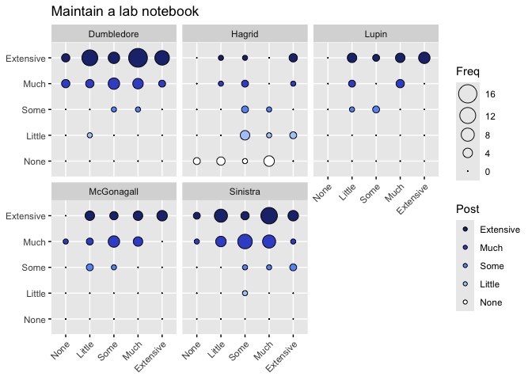<!-- -->

```
## 
## Call:
## glm(formula = as.numeric(Q9_24_post) ~ as.numeric(Q10_24_pre) + 
##     Instructor + Rookie, data = Q_24Clean)
## 
## Coefficients:
##                        Estimate Std. Error t value Pr(>|t|)    
## (Intercept)             4.32854    0.20561  21.052  < 2e-16 ***
## as.numeric(Q10_24_pre)  0.13282    0.04868   2.728  0.00691 ** 
## InstructorHagrid       -2.17999    0.18290 -11.919  < 2e-16 ***
## InstructorLupin        -0.15903    0.19801  -0.803  0.42279    
## InstructorMcGonagall   -0.22559    0.17586  -1.283  0.20098    
## InstructorSinistra     -0.21544    0.14445  -1.491  0.13735    
## RookieVeteran          -0.17115    0.13170  -1.300  0.19520    
## ---
## Signif. codes:  0 '***' 0.001 '**' 0.01 '*' 0.05 '.' 0.1 ' ' 1
## 
## (Dispersion parameter for gaussian family taken to be 0.6786781)
## 
##     Null deviance: 254.48  on 216  degrees of freedom
## Residual deviance: 142.52  on 210  degrees of freedom
## AIC: 540.59
## 
## Number of Fisher Scoring iterations: 2
```

```
## Analysis of Deviance Table (Type III tests)
## 
## Response: as.numeric(Q9_24_post)
## Error estimate based on Pearson residuals 
## 
##                         Sum Sq  Df F values    Pr(>F)    
## as.numeric(Q10_24_pre)   5.051   1   7.4427  0.006909 ** 
## Instructor             107.039   4  39.4291 < 2.2e-16 ***
## Rookie                   1.146   1   1.6887  0.195196    
## Residuals              142.522 210                       
## ---
## Signif. codes:  0 '***' 0.001 '**' 0.01 '*' 0.05 '.' 0.1 ' ' 1
```

```
## boundary (singular) fit: see help('isSingular')
```

```
## Linear mixed model fit by REML. t-tests use Satterthwaite's method [
## lmerModLmerTest]
## Formula: as.numeric(Q9_24_post) ~ as.numeric(Q10_24_pre) + Instructor +  
##     (1 | Classroom)
##    Data: Q_24Clean
## 
## REML criterion at convergence: 541.8
## 
## Scaled residuals: 
##     Min      1Q  Median      3Q     Max 
## -2.9912 -0.6019  0.3262  0.6100  3.2335 
## 
## Random effects:
##  Groups    Name        Variance Std.Dev.
##  Classroom (Intercept) 0.0000   0.0000  
##  Residual              0.6809   0.8252  
## Number of obs: 217, groups:  Classroom, 14
## 
## Fixed effects:
##                         Estimate Std. Error        df t value Pr(>|t|)    
## (Intercept)              4.21601    0.18679 211.00000  22.571  < 2e-16 ***
## as.numeric(Q10_24_pre)   0.12611    0.04849 211.00000   2.601  0.00996 ** 
## InstructorHagrid        -2.13638    0.18009 211.00000 -11.863  < 2e-16 ***
## InstructorLupin         -0.11573    0.19550 211.00000  -0.592  0.55451    
## InstructorMcGonagall    -0.21962    0.17609 211.00000  -1.247  0.21370    
## InstructorSinistra      -0.22379    0.14454 211.00000  -1.548  0.12307    
## ---
## Signif. codes:  0 '***' 0.001 '**' 0.01 '*' 0.05 '.' 0.1 ' ' 1
## 
## Correlation of Fixed Effects:
##             (Intr) a.(Q10 InstrH InstrL InstMG
## a.(Q10_24_) -0.849                            
## InstrctrHgr -0.275 -0.017                     
## InstrctrLpn -0.218 -0.057  0.277              
## InstrctrMcG -0.301  0.006  0.307  0.282       
## InstrctrSns -0.349 -0.013  0.374  0.345  0.382
## optimizer (nloptwrap) convergence code: 0 (OK)
## boundary (singular) fit: see help('isSingular')
```

```
## Analysis of Deviance Table (Type III Wald F tests with Kenward-Roger df)
## 
## Response: as.numeric(Q9_24_post)
##                               F Df  Df.res    Pr(>F)    
## (Intercept)            495.8044  1  54.592 < 2.2e-16 ***
## as.numeric(Q10_24_pre)   6.6591  1 210.939   0.01054 *  
## Instructor              38.5962  4   7.195 6.105e-05 ***
## ---
## Signif. codes:  0 '***' 0.001 '**' 0.01 '*' 0.05 '.' 0.1 ' ' 1
```

```
## Random effect variances not available. Returned R2 does not account for random effects.
```

```
## # Comparison of Model Performance Indices
## 
## Name              |           Model | AIC (weights) | AICc (weights)
## --------------------------------------------------------------------
## imp_model_Q10_24  |             glm | 540.6 (0.705) |  541.3 (0.705)
## lmer_model_Q10_24 | lmerModLmerTest | 542.3 (0.295) |  543.0 (0.295)
## 
## Name              | BIC (weights) |  RMSE | Sigma |    R2 | R2 (cond.) | R2 (marg.)
## -----------------------------------------------------------------------------------
## imp_model_Q10_24  | 567.6 (0.705) | 0.810 | 0.824 | 0.440 |            |           
## lmer_model_Q10_24 | 569.4 (0.295) | 0.814 | 0.825 |       |            |      0.430
```

```
## Random effect variances not available. Returned R2 does not account for random effects.
```

```
## # Comparison of Model Performance Indices
## 
## Name                | Model | AIC (weights) | BIC (weights) |  RMSE | Sigma
## ---------------------------------------------------------------------------
## imp_model_Q10_24_ml |   gls | 540.3 (0.731) | 564.0 (0.936) | 0.814 | 0.814
## lme_model_Q10_24_ml |   lme | 542.3 (0.269) | 569.4 (0.064) | 0.814 | 0.814
## 
## Name                |    R2 | AICc (weights) | R2 (cond.) | R2 (marg.)
## ----------------------------------------------------------------------
## imp_model_Q10_24_ml | 0.435 |        (>.999) |            |           
## lme_model_Q10_24_ml |       |  543.0 (>.999) |            |      0.437
```

```
##                     Model df      AIC      BIC    logLik   Test      L.Ratio
## imp_model_Q10_24_ml     1  7 540.3309 563.9902 -263.1655                    
## lme_model_Q10_24_ml     2  8 542.3309 569.3701 -263.1655 1 vs 2 1.300614e-07
##                     p-value
## imp_model_Q10_24_ml        
## lme_model_Q10_24_ml  0.9997
```

*Presurvey* and *Instructor* meet cutoff.

### Q10_25

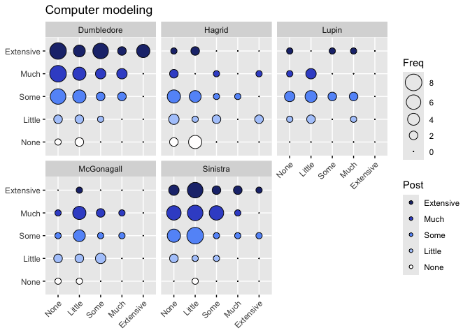<!-- -->

```
## 
## Call:
## glm(formula = as.numeric(Q9_25_post) ~ as.numeric(Q10_25_pre) + 
##     Instructor + Rookie, data = Q_25Clean)
## 
## Coefficients:
##                        Estimate Std. Error t value Pr(>|t|)    
## (Intercept)             3.72720    0.23574  15.810  < 2e-16 ***
## as.numeric(Q10_25_pre)  0.16325    0.06696   2.438 0.015646 *  
## InstructorHagrid       -1.28376    0.23174  -5.540 9.52e-08 ***
## InstructorLupin        -0.65351    0.26402  -2.475 0.014152 *  
## InstructorMcGonagall   -0.83873    0.24615  -3.407 0.000794 ***
## InstructorSinistra     -0.05260    0.19240  -0.273 0.784856    
## RookieVeteran          -0.27850    0.18345  -1.518 0.130569    
## ---
## Signif. codes:  0 '***' 0.001 '**' 0.01 '*' 0.05 '.' 0.1 ' ' 1
## 
## (Dispersion parameter for gaussian family taken to be 1.138992)
## 
##     Null deviance: 281.38  on 205  degrees of freedom
## Residual deviance: 226.66  on 199  degrees of freedom
## AIC: 620.29
## 
## Number of Fisher Scoring iterations: 2
```

```
## Analysis of Deviance Table (Type III tests)
## 
## Response: as.numeric(Q9_25_post)
## Error estimate based on Pearson residuals 
## 
##                         Sum Sq  Df F values    Pr(>F)    
## as.numeric(Q10_25_pre)   6.770   1   5.9439   0.01565 *  
## Instructor              47.560   4  10.4390 1.072e-07 ***
## Rookie                   2.625   1   2.3047   0.13057    
## Residuals              226.659 199                       
## ---
## Signif. codes:  0 '***' 0.001 '**' 0.01 '*' 0.05 '.' 0.1 ' ' 1
```

```
## Linear mixed model fit by REML. t-tests use Satterthwaite's method [
## lmerModLmerTest]
## Formula: as.numeric(Q9_25_post) ~ as.numeric(Q10_25_pre) + Instructor +  
##     (1 | Classroom)
##    Data: Q_25Clean
## 
## REML criterion at convergence: 615.2
## 
## Scaled residuals: 
##      Min       1Q   Median       3Q      Max 
## -2.70872 -0.70488  0.07973  0.75345  2.50771 
## 
## Random effects:
##  Groups    Name        Variance Std.Dev.
##  Classroom (Intercept) 0.08512  0.2918  
##  Residual              1.09267  1.0453  
## Number of obs: 206, groups:  Classroom, 14
## 
## Fixed effects:
##                         Estimate Std. Error        df t value Pr(>|t|)    
## (Intercept)              3.54553    0.24640  18.62408  14.389 1.55e-11 ***
## as.numeric(Q10_25_pre)   0.16725    0.06677 199.99996   2.505  0.01304 *  
## InstructorHagrid        -1.24607    0.33738   8.08907  -3.693  0.00598 ** 
## InstructorLupin         -0.66041    0.36185  10.56715  -1.825  0.09635 .  
## InstructorMcGonagall    -0.95050    0.37467   8.60271  -2.537  0.03297 *  
## InstructorSinistra      -0.13038    0.28473   8.77550  -0.458  0.65815    
## ---
## Signif. codes:  0 '***' 0.001 '**' 0.01 '*' 0.05 '.' 0.1 ' ' 1
## 
## Correlation of Fixed Effects:
##             (Intr) a.(Q10 InstrH InstrL InstMG
## a.(Q10_25_) -0.613                            
## InstrctrHgr -0.482  0.042                     
## InstrctrLpn -0.427  0.002  0.311              
## InstrctrMcG -0.421  0.016  0.301  0.280       
## InstrctrSns -0.552  0.018  0.396  0.368  0.356
```

```
## Analysis of Deviance Table (Type III Wald F tests with Kenward-Roger df)
## 
## Response: as.numeric(Q9_25_post)
##                               F Df  Df.res    Pr(>F)    
## (Intercept)            203.3414  1  16.399 1.151e-10 ***
## as.numeric(Q10_25_pre)   6.1455  1 200.000   0.01400 *  
## Instructor               4.6674  4   8.052   0.03047 *  
## ---
## Signif. codes:  0 '***' 0.001 '**' 0.01 '*' 0.05 '.' 0.1 ' ' 1
```

```
## # Comparison of Model Performance Indices
## 
## Name              |           Model | AIC (weights) | AICc (weights)
## --------------------------------------------------------------------
## imp_model_Q10_25  |             glm | 620.3 (0.800) |  621.0 (0.800)
## lmer_model_Q10_25 | lmerModLmerTest | 623.1 (0.200) |  623.8 (0.200)
## 
## Name              | BIC (weights) |  RMSE | Sigma |    R2 | R2 (cond.)
## ----------------------------------------------------------------------
## imp_model_Q10_25  | 646.9 (0.800) | 1.049 | 1.067 | 0.194 |           
## lmer_model_Q10_25 | 649.7 (0.200) | 1.019 | 1.045 |       |      0.248
## 
## Name              | R2 (marg.) |   ICC
## --------------------------------------
## imp_model_Q10_25  |            |      
## lmer_model_Q10_25 |      0.189 | 0.072
```

```
## # Comparison of Model Performance Indices
## 
## Name                | Model | AIC (weights) | BIC (weights) |  RMSE | Sigma
## ---------------------------------------------------------------------------
## imp_model_Q10_25_ml |   gls | 620.7 (0.653) | 644.0 (0.909) | 1.055 | 1.055
## lme_model_Q10_25_ml |   lme | 621.9 (0.347) | 648.6 (0.091) | 1.033 | 1.042
## 
## Name                |    R2 | AICc (weights) | R2 (cond.) | R2 (marg.) |   ICC
## ------------------------------------------------------------------------------
## imp_model_Q10_25_ml | 0.185 |        (>.999) |            |            |      
## lme_model_Q10_25_ml |       |  622.7 (>.999) |      0.212 |      0.192 | 0.025
```

```
##                     Model df      AIC      BIC    logLik   Test   L.Ratio
## imp_model_Q10_25_ml     1  7 620.6627 643.9579 -303.3314                 
## lme_model_Q10_25_ml     2  8 621.9276 648.5506 -302.9638 1 vs 2 0.7351088
##                     p-value
## imp_model_Q10_25_ml        
## lme_model_Q10_25_ml  0.3912
```

*Presurvey* and *Instructor* meet cutoff.

## Summary

For each question, a generalized mixed effects model with a Gaussian linking function determined if the student's post-survey response was dependent on (1) that student's pre-survey response and (2) which instructor they had, after controlling for the random effect of which class they were in.
An alpha value of 0.05 using Type III Wald F tests with Kenward-Roger df was used to define statistical significance.

Removing "Q10_02", "Q10_19", "Q10_20", "Q10_21", "Q10_22", "Q10_25" *See below (not emphasized by any instructors)


The following questions showed dependence on *pre-survey response* and *instructor*:

11, 13, 14, 15, 16, 18, 23, 24, -25-

- [11] "Read primary scientific literature" 
- [13] "Collect data" 
- [14] "Analyze data" 
- [15] "Present results orally"
- [16] "Present results in written papers or reports"
- [18] "Critique the work of other students"
- [23] "Discuss reading materials in class"  
-  [24] "Maintain a lab notebook"   
-  [25] "Computer modeling" *Removed 

The following questions showed dependence on *instructor*, but not pre-survey response:

4, 5, 6, 10, 17

- [4] "At least one project that is assigned and structured by the instructor" 
- [5] "A project in which students have some input into the research process and/or what is being studied"
- [6] "A project entirely of student design"  
- [10] "Become responsible for a part of the project"  
- [17] "Present posters"


And the responses to these survey questions were independent of pre-survey responses and the instructor:

1, -2-, 3, 7, 8, 9, 12, -19-, -20-, 21

- [1] "A scripted lab or project in which the students know the expected outcome" 
- [2] "A lab or project in which only the instructor knows the outcome" *Removed   
- [3] "A lab or project where no one knows the outcome"   
- [7] "Work individually" 
- [8] "Work as a whole class" 
- [9] "Work in small groups"  
- [12] "Write a research proposal" 
- [19] "Listen to lectures" *Removed     
- [20] "Read a textbook" *Removed 
- [21] "Work on problem sets" *Removed  
- [22] "Take tests in class" *Removed 


## Figures

For questions 4 and 23 we want to show the interaction between instructor and rookie.
Although for 4, the presurvey response wasn't important, so we will use a cat plot.

### Figure 4A 4B and 4C

Questions 8, 10, and 13 need a cat plot showing Instructor and Rookie


```
## Warning: Instructor and Rookie are not included in an interaction with one another
## in the model.
```

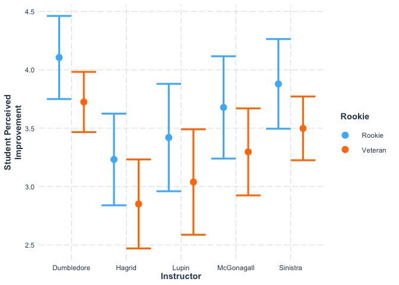<!-- -->

```
## Warning: Instructor and Rookie are not included in an interaction with one another
## in the model.
```


```
## Warning: Instructor and Rookie are not included in an interaction with one another
## in the model.
```

<!-- -->

```
## Warning: Instructor and Rookie are not included in an interaction with one another
## in the model.
```


```
## Using data Q_13Clean from global environment. This could cause incorrect
## results if Q_13Clean has been altered since the model was fit. You can
## manually provide the data to the "data =" argument.
```

```
## Warning: Instructor and Rookie are not included in an interaction with one another
## in the model.
```

<!-- -->

```
## Using data Q_13Clean from global environment. This could cause incorrect
## results if Q_13Clean has been altered since the model was fit. You can
## manually provide the data to the "data =" argument.
```

```
## Warning: Instructor and Rookie are not included in an interaction with one another
## in the model.
```


### Removed Figure Q10_2

This was not emphasized

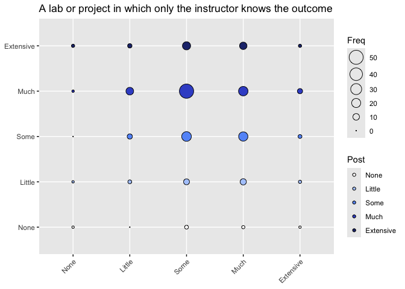<!-- -->

### Removed Figure Q10_21

This was not emphasized.

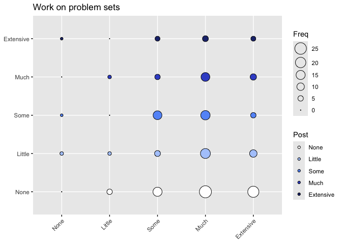<!-- -->

For questions where the instructor was included in the final model, but not Rookie status or the pre-survey response (3, 6, and 17) and ALSO the question where it did not depend on any of the variables (7):


### Final Figure 2 v 2026.lmer

Depend on Instructor only:

WAS: 3, 4, 6, 9, 12, 17

NOW: 5,6,10,17

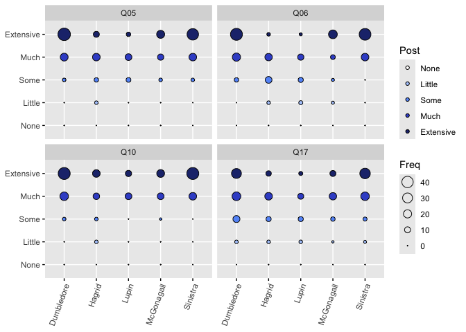<!-- -->

```
## [1] "A project in which students have some input into the research process and/or what is being studied"
## [2] "A project entirely of student design"                                                              
## [3] "Become responsible for a part of the project"                                                      
## [4] "Present posters"
```

Note that we lost "Figure 4" because it is now incorporated into Figure 2. 
I am instead going to convert Figure 3B (with 9 parts!) into Figure 4.

### Final Figure 4 v 2026

Figure 4 is the combined Cat plots.

-  [8] "Work as a whole class"   
-  [10] "Become responsible for a part of the project"  
-  [13] "Collect data" 

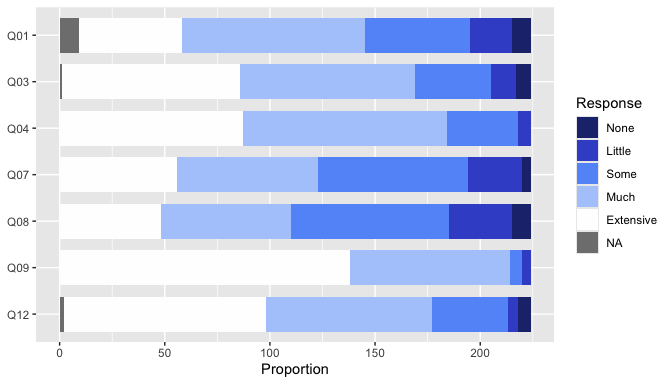<!-- -->


``` r
catplot8c
```

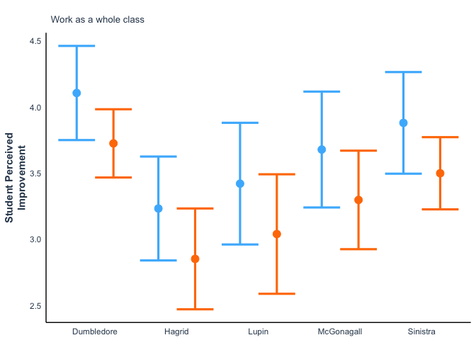<!-- -->


## Instructor Survey Results

We will now examine how the responses to the CURE Instructor Survey might correlate with the student perceptions of gain corresponding to each course element. 
We predict that instructors who placed a greater emphasis on a course element will demonstrate greater perceived gains due to that element.

The five instructors filled out the forms in the summer of 2022. 
Note that it is possible that instructor emphasis shifted slightly in later years, but none of those shifts were dramatic enough to affect these results. 
The forms were PDFs that were sent by email, so I will manually enter the results here.


First to visualize how much variability there is in each question.

<!-- -->

I want to see if certain questions and instructors cluster together to help decide if there are questions that are more interesting to look at than others.

### Final Figure 5A

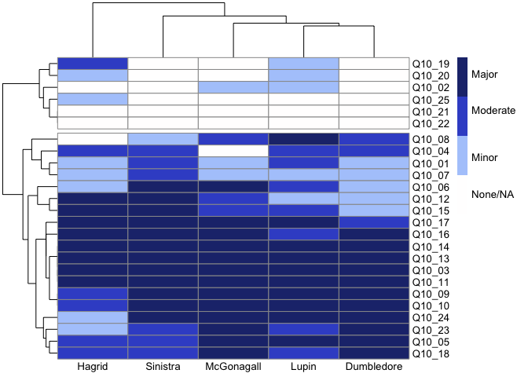<!-- -->

The following six questions have at least three instructors who selected NA/None for the Emphasis:


```
## # A tibble: 6 × 1
##   Question                                                       
##   <chr>                                                          
## 1 A lab or project in which only the instructor knows the outcome
## 2 Listen to lectures                                             
## 3 Read a textbook                                                
## 4 Work on problem sets                                           
## 5 Take tests in class                                            
## 6 Computer modeling
```

It is also interesting to note that the following four questions had Major Emphasis in all five sections:


```
## # A tibble: 4 × 1
##   Question                                       
##   <chr>                                          
## 1 A lab or project where no one knows the outcome
## 2 Read primary scientific literature             
## 3 Collect data                                   
## 4 Analyze data
```

Now to test whether student-perceived gains are correlated with instructor emphasis on each course element.

Looking at all the questions together, including those in the previous list where we did not emphasize them.


```
## tibble [5,433 × 4] (S3: tbl_df/tbl/data.frame)
##  $ Instructor: chr [1:5433] "McGonagall" "McGonagall" "McGonagall" "McGonagall" ...
##  $ Question  : chr [1:5433] "Q10_01" "Q10_02" "Q10_03" "Q10_04" ...
##  $ Gain      : Ord.factor w/ 5 levels "None"<"Little"<..: 4 4 3 4 5 5 3 2 4 5 ...
##  $ Emphasis  : num [1:5433] 1 1 3 0 3 3 1 2 3 3 ...
```

```
##      Instructor        Question           Gain         Emphasis    
##  Length   :5433   Length   :5433   None     : 304   Min.   :0.000  
##  N.unique :   5   N.unique :  25   Little   : 446   1st Qu.:1.000  
##  N.blank  :   0   N.blank  :   0   Some     : 893   Median :2.000  
##  Min.nchar:   5   Min.nchar:   6   Much     :1773   Mean   :1.896  
##  Max.nchar:  10   Max.nchar:   6   Extensive:2017   3rd Qu.:3.000  
##                                                     Max.   :3.000
```

```
## 
## Call:
## glm(formula = as.numeric(Gain) ~ Emphasis, data = Q10_post_merged)
## 
## Coefficients:
##             Estimate Std. Error t value Pr(>|t|)    
## (Intercept)  2.99042    0.02630  113.71   <2e-16 ***
## Emphasis     0.46651    0.01178   39.61   <2e-16 ***
## ---
## Signif. codes:  0 '***' 0.001 '**' 0.01 '*' 0.05 '.' 0.1 ' ' 1
## 
## (Dispersion parameter for gaussian family taken to be 1.049255)
## 
##     Null deviance: 7344.9  on 5432  degrees of freedom
## Residual deviance: 5698.5  on 5431  degrees of freedom
## AIC: 15683
## 
## Number of Fisher Scoring iterations: 2
```

```
## Single term deletions
## 
## Model:
## as.numeric(Gain) ~ Emphasis
##          Df Deviance   AIC scaled dev.  Pr(>Chi)    
## <none>        5698.5 15683                          
## Emphasis  1   7344.9 17060      1378.9 < 2.2e-16 ***
## ---
## Signif. codes:  0 '***' 0.001 '**' 0.01 '*' 0.05 '.' 0.1 ' ' 1
```

```
## Analysis of Deviance Table (Type III tests)
## 
## Response: as.numeric(Gain)
## Error estimate based on Pearson residuals 
## 
##           Sum Sq   Df F values    Pr(>F)    
## Emphasis  1646.4    1   1569.1 < 2.2e-16 ***
## Residuals 5698.5 5431                       
## ---
## Signif. codes:  0 '***' 0.001 '**' 0.01 '*' 0.05 '.' 0.1 ' ' 1
```

Self-reported gain in these skills is highly dependent on the emphasis placed by the instructor (p < 2e-16).

Now to explore whether this also depended on the instructor.

### Final Figure 5B


```
## Analysis of Deviance Table (Type III tests)
## 
## Response: as.numeric(Gain)
## Error estimate based on Pearson residuals 
## 
##                     Sum Sq   Df F values    Pr(>F)    
## Emphasis             612.3    1 611.3496 < 2.2e-16 ***
## Instructor            61.9    4  15.4565 1.412e-12 ***
## Emphasis:Instructor    7.9    4   1.9623   0.09743 .  
## Residuals           5431.4 5423                       
## ---
## Signif. codes:  0 '***' 0.001 '**' 0.01 '*' 0.05 '.' 0.1 ' ' 1
```

```
## Analysis of Deviance Table (Type III tests)
## 
## Response: as.numeric(Gain)
## Error estimate based on Pearson residuals 
## 
##            Sum Sq   Df F values    Pr(>F)    
## Emphasis   1612.9    1 1609.288 < 2.2e-16 ***
## Instructor  259.2    4   64.662 < 2.2e-16 ***
## Residuals  5439.3 5427                       
## ---
## Signif. codes:  0 '***' 0.001 '**' 0.01 '*' 0.05 '.' 0.1 ' ' 1
```

```
## Using data Q10_post_merged from global environment. This could cause
## incorrect results if Q10_post_merged has been altered since the model was
## fit. You can manually provide the data to the "data =" argument.
```

```
## Warning: Emphasis and Instructor are not included in an interaction with one another
## in the model.
```

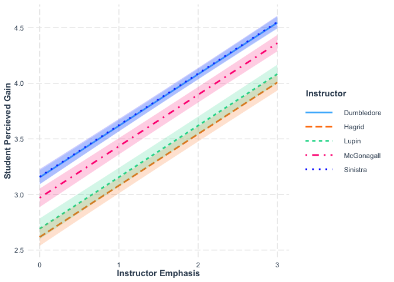<!-- -->

```
## 
## Call:
## glm(formula = Gain ~ Emphasis + Instructor, data = Q10_post_refactored)
## 
## Coefficients:
##                      Estimate Std. Error t value Pr(>|t|)    
## (Intercept)           3.02666    0.03567  84.862  < 2e-16 ***
## Emphasis1             0.79693    0.04651  17.135  < 2e-16 ***
## Emphasis2             1.11544    0.04367  25.540  < 2e-16 ***
## Emphasis3             1.47465    0.03643  40.479  < 2e-16 ***
## InstructorHagrid     -0.57495    0.04227 -13.601  < 2e-16 ***
## InstructorLupin      -0.48829    0.04800 -10.174  < 2e-16 ***
## InstructorMcGonagall -0.16679    0.04301  -3.878 0.000107 ***
## InstructorSinistra    0.03248    0.03586   0.906 0.365155    
## ---
## Signif. codes:  0 '***' 0.001 '**' 0.01 '*' 0.05 '.' 0.1 ' ' 1
## 
## (Dispersion parameter for gaussian family taken to be 0.9916936)
## 
##     Null deviance: 7344.9  on 5432  degrees of freedom
## Residual deviance: 5379.9  on 5425  degrees of freedom
## AIC: 15383
## 
## Number of Fisher Scoring iterations: 2
```

```
## Analysis of Deviance Table (Type III tests)
## 
## Response: Gain
## Error estimate based on Pearson residuals 
## 
##            Sum Sq   Df F values    Pr(>F)    
## Emphasis   1672.3    3  562.090 < 2.2e-16 ***
## Instructor  297.0    4   74.867 < 2.2e-16 ***
## Residuals  5379.9 5425                       
## ---
## Signif. codes:  0 '***' 0.001 '**' 0.01 '*' 0.05 '.' 0.1 ' ' 1
```

```
## Warning: Emphasis and Instructor are not included in an interaction with one another
## in the model.
## Emphasis and Instructor are not included in an interaction with one another
## in the model.
```

<!-- -->

Just to show the interaction:


``` r
interact_plot(model = interact_model, pred = Emphasis, modx = Instructor, 
              interval = TRUE, x.label = "Instructor Emphasis",  
              y.label = "Student Percieved Gain")
```

```
## Using data Q10_post_merged from global environment. This could cause
## incorrect results if Q10_post_merged has been altered since the model was
## fit. You can manually provide the data to the "data =" argument.
```

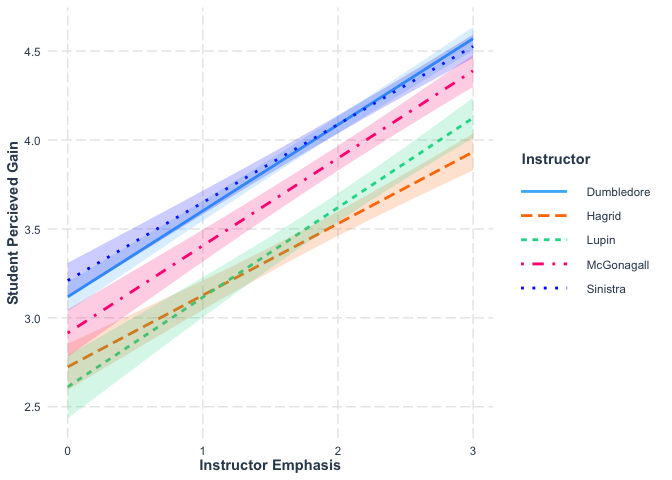<!-- -->

## Presurvey by Semester

Responses on the presurvey had an effect on the student perceived gain for several questions.
We want to check to see if the presurvey responses were significantly different in the two semesters,
because that could be a confounding factor.


```
## 
## Call:
## glm(formula = as.numeric(Q10_1_pre) ~ FallSpring, data = Q_1Clean_Semester)
## 
## Coefficients:
##                  Estimate Std. Error t value Pr(>|t|)    
## (Intercept)       3.29897    0.08399  39.278   <2e-16 ***
## FallSpringSpring  0.22645    0.11337   1.997   0.0471 *  
## ---
## Signif. codes:  0 '***' 0.001 '**' 0.01 '*' 0.05 '.' 0.1 ' ' 1
## 
## (Dispersion parameter for gaussian family taken to be 0.6842893)
## 
##     Null deviance: 148.48  on 214  degrees of freedom
## Residual deviance: 145.75  on 213  degrees of freedom
## AIC: 532.57
## 
## Number of Fisher Scoring iterations: 2
```


```
## 
## Call:
## glm(formula = as.numeric(Q10_2_pre) ~ FallSpring, data = Q_2Clean_Semester)
## 
## Coefficients:
##                  Estimate Std. Error t value Pr(>|t|)    
## (Intercept)       3.15152    0.08484  37.146   <2e-16 ***
## FallSpringSpring  0.21917    0.11551   1.898   0.0591 .  
## ---
## Signif. codes:  0 '***' 0.001 '**' 0.01 '*' 0.05 '.' 0.1 ' ' 1
## 
## (Dispersion parameter for gaussian family taken to be 0.7126179)
## 
##     Null deviance: 154.35  on 214  degrees of freedom
## Residual deviance: 151.79  on 213  degrees of freedom
## AIC: 541.29
## 
## Number of Fisher Scoring iterations: 2
```


```
## 
## Call:
## glm(formula = as.numeric(Q10_3_pre) ~ FallSpring, data = Q_3Clean_Semester)
## 
## Coefficients:
##                  Estimate Std. Error t value Pr(>|t|)    
## (Intercept)        2.0792     0.1020  20.376  < 2e-16 ***
## FallSpringSpring   0.4662     0.1382   3.373 0.000878 ***
## ---
## Signif. codes:  0 '***' 0.001 '**' 0.01 '*' 0.05 '.' 0.1 ' ' 1
## 
## (Dispersion parameter for gaussian family taken to be 1.051665)
## 
##     Null deviance: 243.33  on 221  degrees of freedom
## Residual deviance: 231.37  on 220  degrees of freedom
## AIC: 645.18
## 
## Number of Fisher Scoring iterations: 2
```


```
## 
## Call:
## glm(formula = as.numeric(Q10_4_pre) ~ FallSpring, data = Q_4Clean_Semester)
## 
## Coefficients:
##                  Estimate Std. Error t value Pr(>|t|)    
## (Intercept)       3.62376    0.07891  45.922   <2e-16 ***
## FallSpringSpring  0.17299    0.10649   1.624    0.106    
## ---
## Signif. codes:  0 '***' 0.001 '**' 0.01 '*' 0.05 '.' 0.1 ' ' 1
## 
## (Dispersion parameter for gaussian family taken to be 0.6289264)
## 
##     Null deviance: 141.28  on 223  degrees of freedom
## Residual deviance: 139.62  on 222  degrees of freedom
## AIC: 535.8
## 
## Number of Fisher Scoring iterations: 2
```


```
## 
## Call:
## glm(formula = as.numeric(Q10_5_pre) ~ FallSpring, data = Q_5Clean_Semester)
## 
## Coefficients:
##                  Estimate Std. Error t value Pr(>|t|)    
## (Intercept)       2.88119    0.09865  29.205   <2e-16 ***
## FallSpringSpring  0.30734    0.13338   2.304   0.0221 *  
## ---
## Signif. codes:  0 '***' 0.001 '**' 0.01 '*' 0.05 '.' 0.1 ' ' 1
## 
## (Dispersion parameter for gaussian family taken to be 0.9829782)
## 
##     Null deviance: 222.46  on 222  degrees of freedom
## Residual deviance: 217.24  on 221  degrees of freedom
## AIC: 633.01
## 
## Number of Fisher Scoring iterations: 2
```


```
## 
## Call:
## glm(formula = as.numeric(Q10_6_pre) ~ FallSpring, data = Q_6Clean_Semester)
## 
## Coefficients:
##                  Estimate Std. Error t value Pr(>|t|)    
## (Intercept)        2.5300     0.1203  21.037   <2e-16 ***
## FallSpringSpring   0.2634     0.1625   1.621    0.107    
## ---
## Signif. codes:  0 '***' 0.001 '**' 0.01 '*' 0.05 '.' 0.1 ' ' 1
## 
## (Dispersion parameter for gaussian family taken to be 1.446323)
## 
##     Null deviance: 320.54  on 220  degrees of freedom
## Residual deviance: 316.74  on 219  degrees of freedom
## AIC: 712.72
## 
## Number of Fisher Scoring iterations: 2
```


```
## 
## Call:
## glm(formula = as.numeric(Q10_7_pre) ~ FallSpring, data = Q_7Clean_Semester)
## 
## Coefficients:
##                  Estimate Std. Error t value Pr(>|t|)    
## (Intercept)       3.75248    0.10078  37.236   <2e-16 ***
## FallSpringSpring  0.04261    0.13625   0.313    0.755    
## ---
## Signif. codes:  0 '***' 0.001 '**' 0.01 '*' 0.05 '.' 0.1 ' ' 1
## 
## (Dispersion parameter for gaussian family taken to be 1.025742)
## 
##     Null deviance: 226.79  on 222  degrees of freedom
## Residual deviance: 226.69  on 221  degrees of freedom
## AIC: 642.51
## 
## Number of Fisher Scoring iterations: 2
```


```
## 
## Call:
## glm(formula = as.numeric(Q10_8_pre) ~ FallSpring, data = Q_8Clean_Semester)
## 
## Coefficients:
##                  Estimate Std. Error t value Pr(>|t|)    
## (Intercept)        3.5545     0.1055  33.692   <2e-16 ***
## FallSpringSpring  -0.2780     0.1424  -1.953   0.0521 .  
## ---
## Signif. codes:  0 '***' 0.001 '**' 0.01 '*' 0.05 '.' 0.1 ' ' 1
## 
## (Dispersion parameter for gaussian family taken to be 1.124109)
## 
##     Null deviance: 253.84  on 223  degrees of freedom
## Residual deviance: 249.55  on 222  degrees of freedom
## AIC: 665.88
## 
## Number of Fisher Scoring iterations: 2
```


```
## 
## Call:
## glm(formula = as.numeric(Q10_9_pre) ~ FallSpring, data = Q_9Clean_Semester)
## 
## Coefficients:
##                  Estimate Std. Error t value Pr(>|t|)    
## (Intercept)       4.03960    0.07204  56.072   <2e-16 ***
## FallSpringSpring  0.05056    0.09740   0.519    0.604    
## ---
## Signif. codes:  0 '***' 0.001 '**' 0.01 '*' 0.05 '.' 0.1 ' ' 1
## 
## (Dispersion parameter for gaussian family taken to be 0.5242072)
## 
##     Null deviance: 115.99  on 222  degrees of freedom
## Residual deviance: 115.85  on 221  degrees of freedom
## AIC: 492.81
## 
## Number of Fisher Scoring iterations: 2
```


```
## 
## Call:
## glm(formula = as.numeric(Q10_10_pre) ~ FallSpring, data = Q_10Clean_Semester)
## 
## Coefficients:
##                  Estimate Std. Error t value Pr(>|t|)    
## (Intercept)       3.82178    0.07838  48.762   <2e-16 ***
## FallSpringSpring  0.22780    0.10616   2.146    0.033 *  
## ---
## Signif. codes:  0 '***' 0.001 '**' 0.01 '*' 0.05 '.' 0.1 ' ' 1
## 
## (Dispersion parameter for gaussian family taken to be 0.6204298)
## 
##     Null deviance: 139.35  on 221  degrees of freedom
## Residual deviance: 136.49  on 220  degrees of freedom
## AIC: 528.03
## 
## Number of Fisher Scoring iterations: 2
```


```
## 
## Call:
## glm(formula = as.numeric(Q10_11_pre) ~ FallSpring, data = Q_11Clean_Semester)
## 
## Coefficients:
##                  Estimate Std. Error t value Pr(>|t|)    
## (Intercept)       2.89000    0.09173  31.506  < 2e-16 ***
## FallSpringSpring  0.70836    0.12374   5.725 3.37e-08 ***
## ---
## Signif. codes:  0 '***' 0.001 '**' 0.01 '*' 0.05 '.' 0.1 ' ' 1
## 
## (Dispersion parameter for gaussian family taken to be 0.8414076)
## 
##     Null deviance: 212.68  on 221  degrees of freedom
## Residual deviance: 185.11  on 220  degrees of freedom
## AIC: 595.66
## 
## Number of Fisher Scoring iterations: 2
```


```
## 
## Call:
## glm(formula = as.numeric(Q10_12_pre) ~ FallSpring, data = Q_12Clean_Semester)
## 
## Coefficients:
##                  Estimate Std. Error t value Pr(>|t|)    
## (Intercept)        2.4100     0.1128  21.367   <2e-16 ***
## FallSpringSpring   0.3751     0.1524   2.461   0.0146 *  
## ---
## Signif. codes:  0 '***' 0.001 '**' 0.01 '*' 0.05 '.' 0.1 ' ' 1
## 
## (Dispersion parameter for gaussian family taken to be 1.272161)
## 
##     Null deviance: 286.31  on 220  degrees of freedom
## Residual deviance: 278.60  on 219  degrees of freedom
## AIC: 684.36
## 
## Number of Fisher Scoring iterations: 2
```


```
## 
## Call:
## glm(formula = as.numeric(Q10_13_pre) ~ FallSpring, data = Q_13Clean_Semester)
## 
## Coefficients:
##                  Estimate Std. Error t value Pr(>|t|)    
## (Intercept)       3.73267    0.08774  42.541   <2e-16 ***
## FallSpringSpring -0.03019    0.11885  -0.254      0.8    
## ---
## Signif. codes:  0 '***' 0.001 '**' 0.01 '*' 0.05 '.' 0.1 ' ' 1
## 
## (Dispersion parameter for gaussian family taken to be 0.7775974)
## 
##     Null deviance: 171.12  on 221  degrees of freedom
## Residual deviance: 171.07  on 220  degrees of freedom
## AIC: 578.16
## 
## Number of Fisher Scoring iterations: 2
```


```
## 
## Call:
## glm(formula = as.numeric(Q10_14_pre) ~ FallSpring, data = Q_14Clean_Semester)
## 
## Coefficients:
##                  Estimate Std. Error t value Pr(>|t|)    
## (Intercept)       3.71287    0.08724  42.560   <2e-16 ***
## FallSpringSpring -0.03519    0.11816  -0.298    0.766    
## ---
## Signif. codes:  0 '***' 0.001 '**' 0.01 '*' 0.05 '.' 0.1 ' ' 1
## 
## (Dispersion parameter for gaussian family taken to be 0.7686501)
## 
##     Null deviance: 169.17  on 221  degrees of freedom
## Residual deviance: 169.10  on 220  degrees of freedom
## AIC: 575.59
## 
## Number of Fisher Scoring iterations: 2
```


```
## 
## Call:
## glm(formula = as.numeric(Q10_15_pre) ~ FallSpring, data = Q_15Clean_Semester)
## 
## Coefficients:
##                  Estimate Std. Error t value Pr(>|t|)    
## (Intercept)        3.1600     0.1070  29.533   <2e-16 ***
## FallSpringSpring   0.1375     0.1446   0.951    0.343    
## ---
## Signif. codes:  0 '***' 0.001 '**' 0.01 '*' 0.05 '.' 0.1 ' ' 1
## 
## (Dispersion parameter for gaussian family taken to be 1.144882)
## 
##     Null deviance: 251.76  on 220  degrees of freedom
## Residual deviance: 250.73  on 219  degrees of freedom
## AIC: 661.06
## 
## Number of Fisher Scoring iterations: 2
```


```
## 
## Call:
## glm(formula = as.numeric(Q10_16_pre) ~ FallSpring, data = Q_16Clean_Semester)
## 
## Coefficients:
##                  Estimate Std. Error t value Pr(>|t|)    
## (Intercept)       3.32000    0.09988  33.241   <2e-16 ***
## FallSpringSpring -0.13301    0.13448  -0.989    0.324    
## ---
## Signif. codes:  0 '***' 0.001 '**' 0.01 '*' 0.05 '.' 0.1 ' ' 1
## 
## (Dispersion parameter for gaussian family taken to be 0.9975529)
## 
##     Null deviance: 221.43  on 222  degrees of freedom
## Residual deviance: 220.46  on 221  degrees of freedom
## AIC: 636.29
## 
## Number of Fisher Scoring iterations: 2
```


```
## 
## Call:
## glm(formula = as.numeric(Q10_17_pre) ~ FallSpring, data = Q_17Clean_Semester)
## 
## Coefficients:
##                  Estimate Std. Error t value Pr(>|t|)    
## (Intercept)        3.3069     0.1048  31.542   <2e-16 ***
## FallSpringSpring  -0.2741     0.1417  -1.934   0.0544 .  
## ---
## Signif. codes:  0 '***' 0.001 '**' 0.01 '*' 0.05 '.' 0.1 ' ' 1
## 
## (Dispersion parameter for gaussian family taken to be 1.110199)
## 
##     Null deviance: 249.51  on 222  degrees of freedom
## Residual deviance: 245.35  on 221  degrees of freedom
## AIC: 660.15
## 
## Number of Fisher Scoring iterations: 2
```


```
## 
## Call:
## glm(formula = as.numeric(Q10_18_pre) ~ FallSpring, data = Q_18Clean_Semester)
## 
## Coefficients:
##                  Estimate Std. Error t value Pr(>|t|)    
## (Intercept)        2.6263     0.1028  25.542  < 2e-16 ***
## FallSpringSpring   0.5295     0.1384   3.826  0.00017 ***
## ---
## Signif. codes:  0 '***' 0.001 '**' 0.01 '*' 0.05 '.' 0.1 ' ' 1
## 
## (Dispersion parameter for gaussian family taken to be 1.046633)
## 
##     Null deviance: 244.53  on 220  degrees of freedom
## Residual deviance: 229.21  on 219  degrees of freedom
## AIC: 641.23
## 
## Number of Fisher Scoring iterations: 2
```


```
## 
## Call:
## glm(formula = as.numeric(Q10_19_pre) ~ FallSpring, data = Q_19Clean_Semester)
## 
## Coefficients:
##                  Estimate Std. Error t value Pr(>|t|)    
## (Intercept)        3.6837     0.1065  34.583   <2e-16 ***
## FallSpringSpring   0.3499     0.1438   2.433   0.0158 *  
## ---
## Signif. codes:  0 '***' 0.001 '**' 0.01 '*' 0.05 '.' 0.1 ' ' 1
## 
## (Dispersion parameter for gaussian family taken to be 1.111904)
## 
##     Null deviance: 245.64  on 216  degrees of freedom
## Residual deviance: 239.06  on 215  degrees of freedom
## AIC: 642.83
## 
## Number of Fisher Scoring iterations: 2
```


```
## 
## Call:
## glm(formula = as.numeric(Q10_20_pre) ~ FallSpring, data = Q_20Clean_Semester)
## 
## Coefficients:
##                   Estimate Std. Error t value Pr(>|t|)    
## (Intercept)       3.835165   0.116069  33.042   <2e-16 ***
## FallSpringSpring -0.009922   0.159293  -0.062     0.95    
## ---
## Signif. codes:  0 '***' 0.001 '**' 0.01 '*' 0.05 '.' 0.1 ' ' 1
## 
## (Dispersion parameter for gaussian family taken to be 1.225947)
## 
##     Null deviance: 235.39  on 193  degrees of freedom
## Residual deviance: 235.38  on 192  degrees of freedom
## AIC: 594.06
## 
## Number of Fisher Scoring iterations: 2
```


```
## 
## Call:
## glm(formula = as.numeric(Q10_21_pre) ~ FallSpring, data = Q_21Clean_Semester)
## 
## Coefficients:
##                  Estimate Std. Error t value Pr(>|t|)    
## (Intercept)       3.87500    0.09964   38.89   <2e-16 ***
## FallSpringSpring -0.01641    0.13695   -0.12    0.905    
## ---
## Signif. codes:  0 '***' 0.001 '**' 0.01 '*' 0.05 '.' 0.1 ' ' 1
## 
## (Dispersion parameter for gaussian family taken to be 0.8737578)
## 
##     Null deviance: 161.66  on 186  degrees of freedom
## Residual deviance: 161.65  on 185  degrees of freedom
## AIC: 509.44
## 
## Number of Fisher Scoring iterations: 2
```


```
## 
## Call:
## glm(formula = as.numeric(Q10_22_pre) ~ FallSpring, data = Q_22Clean_Semester)
## 
## Coefficients:
##                  Estimate Std. Error t value Pr(>|t|)    
## (Intercept)        4.1236     0.1052  39.186   <2e-16 ***
## FallSpringSpring  -0.1830     0.1443  -1.268    0.206    
## ---
## Signif. codes:  0 '***' 0.001 '**' 0.01 '*' 0.05 '.' 0.1 ' ' 1
## 
## (Dispersion parameter for gaussian family taken to be 0.9855533)
## 
##     Null deviance: 186.87  on 189  degrees of freedom
## Residual deviance: 185.28  on 188  degrees of freedom
## AIC: 540.42
## 
## Number of Fisher Scoring iterations: 2
```


```
## 
## Call:
## glm(formula = as.numeric(Q10_23_pre) ~ FallSpring, data = Q_23Clean_Semester)
## 
## Coefficients:
##                  Estimate Std. Error t value Pr(>|t|)    
## (Intercept)       3.95050    0.08739  45.208   <2e-16 ***
## FallSpringSpring  0.02471    0.11837   0.209    0.835    
## ---
## Signif. codes:  0 '***' 0.001 '**' 0.01 '*' 0.05 '.' 0.1 ' ' 1
## 
## (Dispersion parameter for gaussian family taken to be 0.7712641)
## 
##     Null deviance: 169.71  on 221  degrees of freedom
## Residual deviance: 169.68  on 220  degrees of freedom
## AIC: 576.34
## 
## Number of Fisher Scoring iterations: 2
```


```
## 
## Call:
## glm(formula = as.numeric(Q10_24_pre) ~ FallSpring, data = Q_24Clean_Semester)
## 
## Coefficients:
##                  Estimate Std. Error t value Pr(>|t|)    
## (Intercept)       3.32673    0.11569  28.755   <2e-16 ***
## FallSpringSpring -0.02501    0.15824  -0.158    0.875    
## ---
## Signif. codes:  0 '***' 0.001 '**' 0.01 '*' 0.05 '.' 0.1 ' ' 1
## 
## (Dispersion parameter for gaussian family taken to be 1.351895)
## 
##     Null deviance: 290.69  on 216  degrees of freedom
## Residual deviance: 290.66  on 215  degrees of freedom
## AIC: 685.24
## 
## Number of Fisher Scoring iterations: 2
```


```
## 
## Call:
## glm(formula = as.numeric(Q10_25_pre) ~ FallSpring, data = Q_25Clean_Semester)
## 
## Coefficients:
##                  Estimate Std. Error t value Pr(>|t|)    
## (Intercept)       2.15054    0.11653  18.455   <2e-16 ***
## FallSpringSpring  0.04415    0.15733   0.281    0.779    
## ---
## Signif. codes:  0 '***' 0.001 '**' 0.01 '*' 0.05 '.' 0.1 ' ' 1
## 
## (Dispersion parameter for gaussian family taken to be 1.262791)
## 
##     Null deviance: 257.71  on 205  degrees of freedom
## Residual deviance: 257.61  on 204  degrees of freedom
## AIC: 636.66
## 
## Number of Fisher Scoring iterations: 2
```


``` r
Q10TextClean$Question[3] # p = 0.000878, Estimate = 0.4662
```

```
## [1] "A lab or project where no one knows the outcome"
```

``` r
Q10TextClean$Question[4] # p = 0.106, Estimate = 0.17299
```

```
## [1] "At least one project that is assigned and structured by the instructor"
```

``` r
Q10TextClean$Question[6] # p = 0.107, Estimate = 0.2634
```

```
## [1] "A project entirely of student design"
```

``` r
Q10TextClean$Question[11] # p = 3.37e-08, Estimate = 0.70836
```

```
## [1] "Read primary scientific literature"
```

``` r
Q10TextClean$Question[12] # p = 0.0146, Estimate = 0.3751
```

```
## [1] "Write a research proposal"
```

``` r
Q10TextClean$Question[18] # p = 0.00017, Estimate = 0.5295
```

```
## [1] "Critique the work of other students"
```

``` r
Q10TextClean$Question[19] # p = 0.0158, Estimate =  0.3499
```

```
## [1] "Listen to lectures"
```

After discussion with Moria, we would like to show, as a supplemental table the questions that have p.adjust < 0.05.

## Table S4


``` r
stats_table <- tibble(Question = Q10TextClean$Question[11], 
                      Estimate = Q_11_pre_model$coefficients[[2]],
                      p = coef(summary(Q_11_pre_model))[,4][[2]],
                      `p.adj` = p.adjust(coef(summary(Q_11_pre_model))[,4][[2]], n = 25))
stats_table <- stats_table %>%
  add_row(Question = Q10TextClean$Question[18], 
          Estimate = Q_18_pre_model$coefficients[[2]], 
          p = coef(summary(Q_18_pre_model))[,4][[2]], 
          `p.adj` = p.adjust(coef(summary(Q_18_pre_model))[,4][[2]], n = 25))
stats_table <- stats_table %>%
  add_row(Question = Q10TextClean$Question[3], 
          Estimate = Q_3_pre_model$coefficients[[2]], 
          p = coef(summary(Q_3_pre_model))[,4][[2]], 
          `p.adj` = p.adjust(coef(summary(Q_3_pre_model))[,4][[2]], n = 25))

kable(stats_table, "simple")
```


Question                                            Estimate           p       p.adj
------------------------------------------------  ----------  ----------  ----------
Read primary scientific literature                 0.7083607   0.0000000   0.0000008
Critique the work of other students                0.5294751   0.0001699   0.0042470
A lab or project where no one knows the outcome    0.4662466   0.0008776   0.0219398


