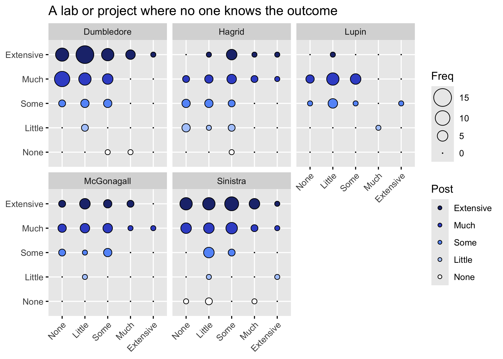
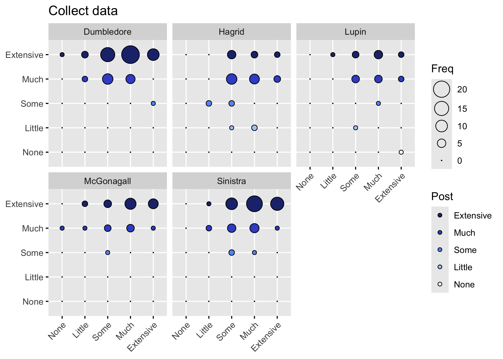
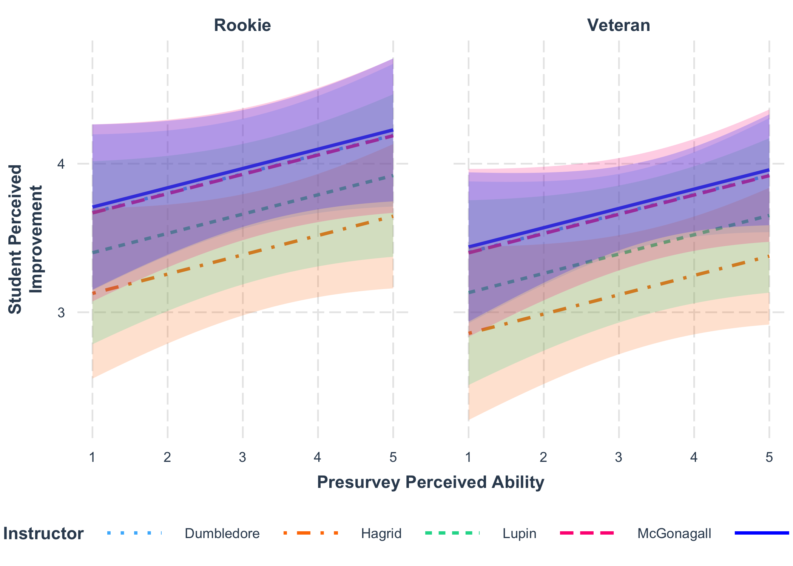
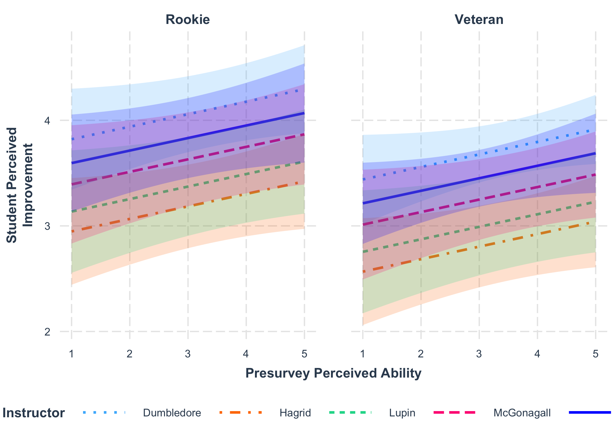
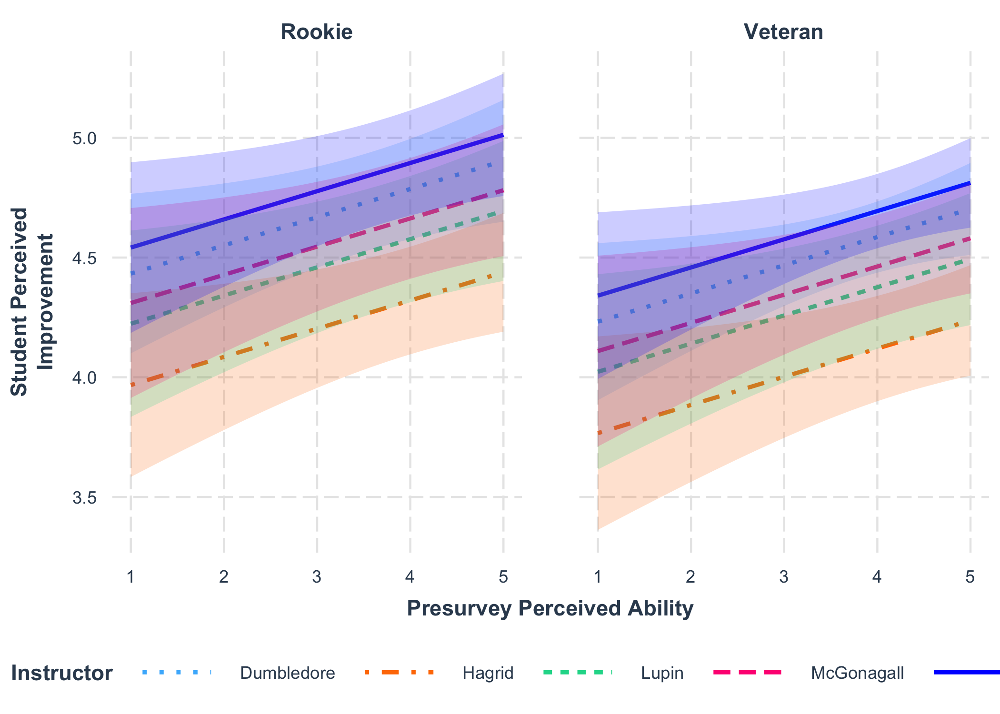
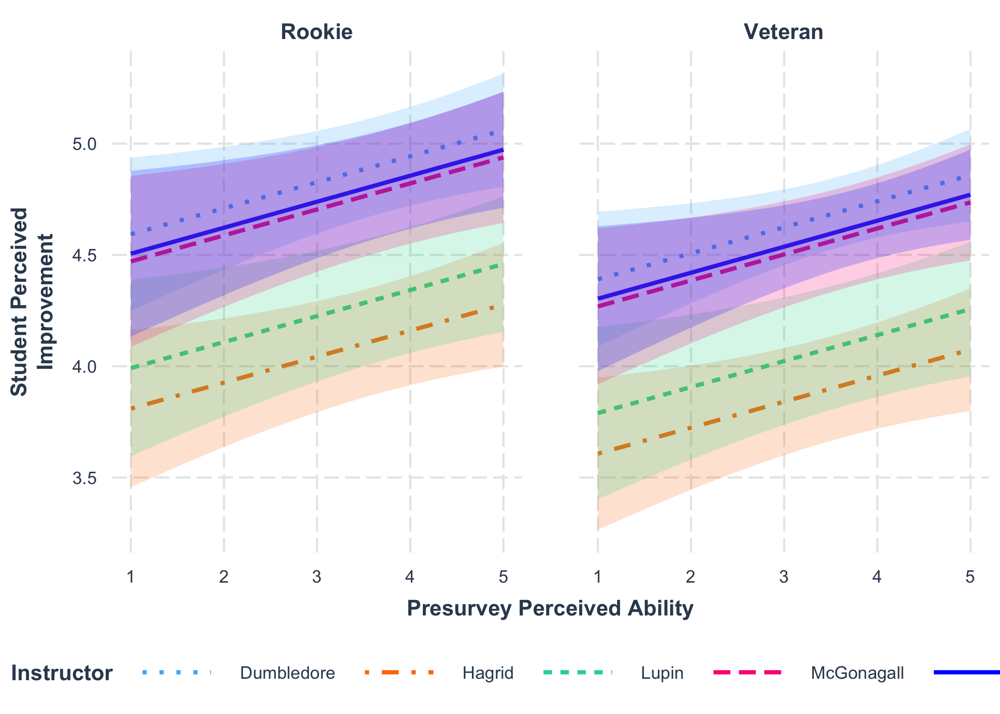
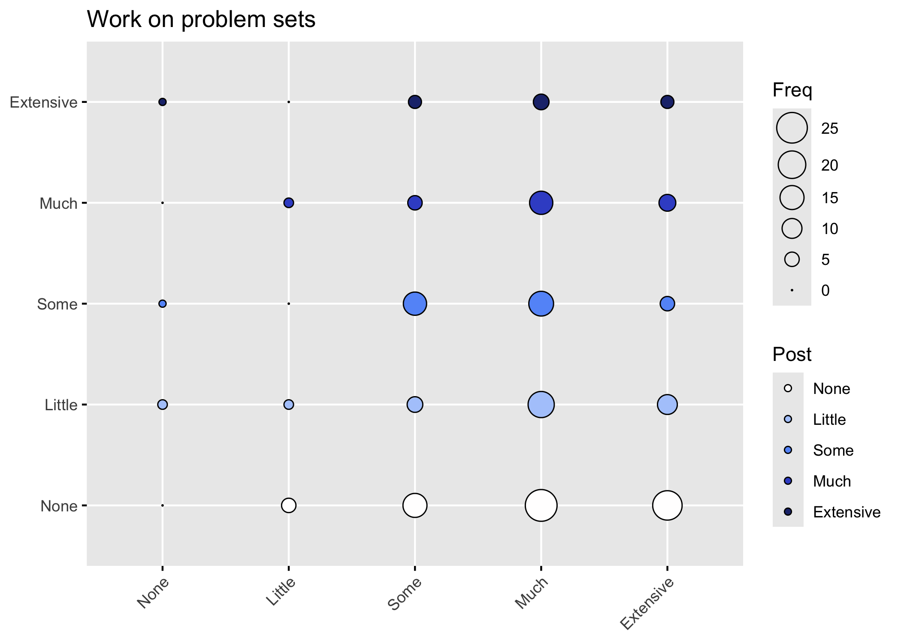
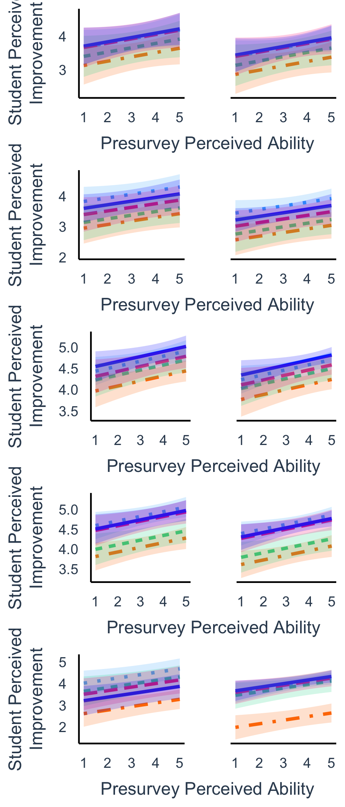

IMPORTANT NOTE

This Rmd uses the deidentified results and is safe to share.


## Loading Results

Loading in the results without instructor information:


``` r
NoDemographicsYear1 <- read_delim("Deidentified Surveys/Year1.NoDemographics.tsv", 
    delim = "\t", escape_double = FALSE, 
    trim_ws = TRUE) %>%
  rename(Semester = Semester_pre)
```

```
## Rows: 85 Columns: 151
## ── Column specification ────────────────────────────────────────────────────────
## Delimiter: "\t"
## chr (141): ResponseId_pre, Instructor, Semester_pre, Q1_pre, Q8_pre, Q9_1_pr...
## dbl  (10): Q19_1_pre, Q19_2_pre, Q19_3_pre, Q19_4_pre, Q19_5_pre, Q19_6_pre,...
## 
## ℹ Use `spec()` to retrieve the full column specification for this data.
## ℹ Specify the column types or set `show_col_types = FALSE` to quiet this message.
```

``` r
NoDemographicsYear2 <- read_delim("Deidentified Surveys/Year2.NoDemographics.tsv", 
    delim = "\t", escape_double = FALSE, 
    trim_ws = TRUE)
```

```
## Rows: 77 Columns: 151
## ── Column specification ────────────────────────────────────────────────────────
## Delimiter: "\t"
## chr (141): ResponseId_pre, Instructor, Semester, Q1_pre, Q8_pre, Q9_1_pre, Q...
## dbl  (10): Q19_1_pre, Q19_2_pre, Q19_3_pre, Q19_4_pre, Q19_5_pre, Q19_6_pre,...
## 
## ℹ Use `spec()` to retrieve the full column specification for this data.
## ℹ Specify the column types or set `show_col_types = FALSE` to quiet this message.
```

``` r
NoDemographicsYear3 <- read_delim("Deidentified Surveys/Year3.NoDemographics.tsv", 
    delim = "\t", escape_double = FALSE, 
    trim_ws = TRUE)
```

```
## Rows: 63 Columns: 151
## ── Column specification ────────────────────────────────────────────────────────
## Delimiter: "\t"
## chr (141): ResponseId_pre, Instructor, Semester, Q1_pre, Q8_pre, Q9_1_pre, Q...
## dbl  (10): Q19_1_pre, Q19_2_pre, Q19_3_pre, Q19_4_pre, Q19_5_pre, Q19_6_pre,...
## 
## ℹ Use `spec()` to retrieve the full column specification for this data.
## ℹ Specify the column types or set `show_col_types = FALSE` to quiet this message.
```

``` r
NoDemographics <- bind_rows(NoDemographicsYear1, NoDemographicsYear2, NoDemographicsYear3)

NoDemographicsQuestions <- read_delim("Deidentified Surveys/Year3.NoDemographicsQuestions.tsv", 
    delim = "\t", escape_double = FALSE, 
    trim_ws = TRUE)
```

```
## Rows: 151 Columns: 2
## ── Column specification ────────────────────────────────────────────────────────
## Delimiter: "\t"
## chr (2): value, Question
## 
## ℹ Use `spec()` to retrieve the full column specification for this data.
## ℹ Specify the column types or set `show_col_types = FALSE` to quiet this message.
```

Cleaning up the factors and removing anyone who did not agree to the informed consent.


``` r
NoDemographics <- NoDemographics %>%
  mutate(Semester = factor(Semester, levels = c("Fall 2021", "Spring 2022",
                                                "Fall 2022", "Spring 2023",
                                                "Fall 2023", "Spring 2024"))) %>%
  mutate(across(Instructor, str_replace, 'Prof. ', ''))
```

```
## Warning: There was 1 warning in `mutate()`.
## ℹ In argument: `across(Instructor, str_replace, "Prof. ", "")`.
## Caused by warning:
## ! The `...` argument of `across()` is deprecated as of dplyr 1.1.0.
## Supply arguments directly to `.fns` through an anonymous function instead.
## 
##   # Previously
##   across(a:b, mean, na.rm = TRUE)
## 
##   # Now
##   across(a:b, \(x) mean(x, na.rm = TRUE))
```

``` r
NoDemographics <- NoDemographics %>%
  filter(Q1_pre == "Agree")
```

We have hypothesized that instructors may be less successful in improving learning elements during the first time
that they have taught the class. To test this hypothesis, we will need to code a new variable, that I will call Rookie.
To do this, I logged into Cognos and ran a "Class Info by Term and Instructor" report. Note that I had to identify the 
instructor pseudonyms using the Deidentification Rmd, but I have not included that information here.

- 'McGonagall' 'Fall 2021'
- 'Dumbledore' 'Fall 2021'
- 'Hagrid' 'Spring 2022'
- 'Lupin' 'Fall 2021'
- 'Sinistra' 'Spring 2022'


``` r
NoDemographics <- NoDemographics %>%
  mutate(Rookie = case_when((Instructor == 'McGonagall') & (Semester == 'Fall 2021') ~ "Rookie", 
                     (Instructor == 'Dumbledore') & (Semester == 'Fall 2021') ~ "Rookie",
                     (Instructor == 'Hagrid') & (Semester == 'Spring 2022') ~ "Rookie",
                     (Instructor == 'Lupin') & (Semester == 'Fall 2021') ~ "Rookie",
                     (Instructor == 'Sinistra') & (Semester == 'Spring 2022') ~ "Rookie",
                     .default = "Veteran"))
```

## Improvement in learning elements

Comparing the responses to Pre10 and Post9:


```
## [1] "Please look over this inventory of elements that might be included in a course. For each element, give an estimate of your current level of ability before the course begins. Your current level of ability may be a result of courses in high school or college, or it may be a result of other experiences such as jobs or special programs. If students are expected to do the following course elements, what would be their level of expertise? - A scripted lab or project in which the students know the expected outcome"
```

```
##  [1] "A scripted lab or project in which the students know the expected outcome"                         
##  [2] "A lab or project in which only the instructor knows the outcome"                                   
##  [3] "A lab or project where no one knows the outcome"                                                   
##  [4] "At least one project that is assigned and structured by the instructor"                            
##  [5] "A project in which students have some input into the research process and/or what is being studied"
##  [6] "A project entirely of student design"                                                              
##  [7] "Work individually"                                                                                 
##  [8] "Work as a whole class"                                                                             
##  [9] "Work in small groups"                                                                              
## [10] "Become responsible for a part of the project"                                                      
## [11] "Read primary scientific literature"                                                                
## [12] "Write a research proposal"                                                                         
## [13] "Collect data"                                                                                      
## [14] "Analyze data"                                                                                      
## [15] "Present results orally"                                                                            
## [16] "Present results in written papers or reports"                                                      
## [17] "Present posters"                                                                                   
## [18] "Critique the work of other students"                                                               
## [19] "Listen to lectures"                                                                                
## [20] "Read a textbook"                                                                                   
## [21] "Work on problem sets"                                                                              
## [22] "Take tests in class"                                                                               
## [23] "Discuss reading materials in class"                                                                
## [24] "Maintain a lab notebook"                                                                           
## [25] "Computer modeling"
```


```
## [1] "Please rate how much learning you gained from each element you experienced in this course. The scale measuring your gain is from (no or very small gain) to (very large gain). Some elements may not have happened at all. If the item is not relevant or you prefer not to answer, please choose the \"\"not applicable\"\" option. If students were expected to do the following course elements, what would be their level of gained experience? - A scripted lab or project in which the students know the expected outcome"
```

```
##  [1] "A scripted lab or project in which the students know the expected outcome"                         
##  [2] "A lab or project in which only the instructor knows the outcome"                                   
##  [3] "A lab or project where no one knows the outcome"                                                   
##  [4] "At least one project that is assigned and structured by the instructor"                            
##  [5] "A project in which students have some input into the research process and/or what is being studied"
##  [6] "A project entirely of student design"                                                              
##  [7] "Work individually"                                                                                 
##  [8] "Work as a whole class"                                                                             
##  [9] "Work in small groups"                                                                              
## [10] "Become responsible for a part of the project"                                                      
## [11] "Read primary scientific literature"                                                                
## [12] "Write a research proposal"                                                                         
## [13] "Collect data"                                                                                      
## [14] "Analyze data"                                                                                      
## [15] "Present results orally"                                                                            
## [16] "Present results in written papers or reports"                                                      
## [17] "Present posters"                                                                                   
## [18] "Critique the work of other students"                                                               
## [19] "Listen to lectures"                                                                                
## [20] "Read a textbook"                                                                                   
## [21] "Work on problem sets"                                                                              
## [22] "Take tests in class"                                                                               
## [23] "Discuss reading materials in class"                                                                
## [24] "Maintain a lab notebook"                                                                           
## [25] "Computer modeling"
```

```
##  [1] TRUE TRUE TRUE TRUE TRUE TRUE TRUE TRUE TRUE TRUE TRUE TRUE TRUE TRUE TRUE
## [16] TRUE TRUE TRUE TRUE TRUE TRUE TRUE TRUE TRUE TRUE
```

Now to compare the pre and post responses for those questions:


```
## # A tibble: 6 × 53
##   Semester  Instructor Rookie Q10_1_pre Q10_2_pre Q10_3_pre Q10_4_pre Q10_5_pre
##   <fct>     <chr>      <chr>  <chr>     <chr>     <chr>     <chr>     <chr>    
## 1 Fall 2021 McGonagall Rookie Much      Some      None      Some      Extensive
## 2 Fall 2021 McGonagall Rookie Some      Much      None      Extensive Little   
## 3 Fall 2021 McGonagall Rookie Some      Much      None      Much      Some     
## 4 Fall 2021 McGonagall Rookie Little    Much      Little    Some      Some     
## 5 Fall 2021 McGonagall Rookie Some      Some      Little    Much      Much     
## 6 Fall 2021 McGonagall Rookie Some      Much      Little    Much      Some     
## # ℹ 45 more variables: Q10_6_pre <chr>, Q10_7_pre <chr>, Q10_8_pre <chr>,
## #   Q10_9_pre <chr>, Q10_10_pre <chr>, Q10_11_pre <chr>, Q10_12_pre <chr>,
## #   Q10_13_pre <chr>, Q10_14_pre <chr>, Q10_15_pre <chr>, Q10_16_pre <chr>,
## #   Q10_17_pre <chr>, Q10_18_pre <chr>, Q10_19_pre <chr>, Q10_20_pre <chr>,
## #   Q10_21_pre <chr>, Q10_22_pre <chr>, Q10_23_pre <chr>, Q10_24_pre <chr>,
## #   Q10_25_pre <chr>, Q9_1_post <chr>, Q9_2_post <chr>, Q9_3_post <chr>,
## #   Q9_4_post <chr>, Q9_5_post <chr>, Q9_6_post <chr>, Q9_7_post <chr>, …
```

```
## Warning: `funs()` was deprecated in dplyr 0.8.0.
## ℹ Please use a list of either functions or lambdas:
## 
## # Simple named list: list(mean = mean, median = median)
## 
## # Auto named with `tibble::lst()`: tibble::lst(mean, median)
## 
## # Using lambdas list(~ mean(., trim = .2), ~ median(., na.rm = TRUE))
## Call `lifecycle::last_lifecycle_warnings()` to see where this warning was
## generated.
```

## Sample Size

### Table S1


``` r
Q10Clean %>%
  group_by(Instructor, Semester) %>%
  count() %>%
  print()
```

```
## # A tibble: 14 × 3
## # Groups:   Instructor, Semester [14]
##    Instructor Semester        n
##    <chr>      <fct>       <int>
##  1 Dumbledore Fall 2021      15
##  2 Dumbledore Fall 2022      24
##  3 Dumbledore Spring 2023    11
##  4 Dumbledore Fall 2023      20
##  5 Hagrid     Spring 2022    16
##  6 Hagrid     Spring 2024    19
##  7 Lupin      Fall 2021      11
##  8 Lupin      Fall 2022      13
##  9 McGonagall Fall 2021       8
## 10 McGonagall Spring 2022    25
## 11 Sinistra   Spring 2022    10
## 12 Sinistra   Spring 2023    28
## 13 Sinistra   Fall 2023      10
## 14 Sinistra   Spring 2024    14
```

First let's just look at the contingency tables to see if everything looks right.


```
## [1] "Rows represents pre-survey response, Columns represent post-survey response."
```

```
## [1] "First for All sections then for then by Instructor."
```

```
## [1] "A scripted lab or project in which the students know the expected outcome"
```

```
##            
##             None Little Some Much Extensive
##   None         1      1    0    0         0
##   Little       1      3    8    8         5
##   Some         3      7   21   40        14
##   Much         3      5   17   33        28
##   Extensive    1      4    4    6         2
```

```
## [1] "By Instructor"
```

```
## [1] "A scripted lab or project in which the students know the expected outcome"
```

```
## , ,  = Dumbledore
## 
##            
##             None Little Some Much Extensive
##   None         1      1    0    0         0
##   Little       1      0    3    3         3
##   Some         1      2    8    7         7
##   Much         1      1    3    8        10
##   Extensive    0      1    2    1         2
## 
## , ,  = Hagrid
## 
##            
##             None Little Some Much Extensive
##   None         0      0    0    0         0
##   Little       0      0    2    1         0
##   Some         0      1   10    5         0
##   Much         1      0    1    5         2
##   Extensive    1      2    0    2         0
## 
## , ,  = Lupin
## 
##            
##             None Little Some Much Extensive
##   None         0      0    0    0         0
##   Little       0      1    1    2         0
##   Some         0      1    1    2         2
##   Much         0      2    2    8         0
##   Extensive    0      0    0    1         0
## 
## , ,  = McGonagall
## 
##            
##             None Little Some Much Extensive
##   None         0      0    0    0         0
##   Little       0      1    0    1         1
##   Some         0      1    1    9         1
##   Much         0      0    6    7         4
##   Extensive    0      1    0    0         0
## 
## , ,  = Sinistra
## 
##            
##             None Little Some Much Extensive
##   None         0      0    0    0         0
##   Little       0      1    2    1         1
##   Some         2      2    1   17         4
##   Much         1      2    5    5        12
##   Extensive    0      0    2    2         0
```

Balloon Plot

On these plots, the answers on the x axis are the pre-survey results and on the y-axis
are the post survey results. 
Responses above the "none" level indicate students who felt that they increased in this element.


The pre-survey questions were asked as:
Please look over this inventory of elements that might be included in a course. For each element, give an estimate of your current level of ability before the course begins. Your current level of ability may be a result of courses in high school or college, or it may be a result of other experiences such as jobs or special programs. If students are expected to do the following course elements, what would be their level of expertise? 


The post-survey questions were asked: 
Please rate how much learning you gained from each element you experienced in this course. The scale measuring your gain is from (no or very small gain) to (very large gain). Some elements may not have happened at all. If the item is not relevant or you prefer not to answer, please choose the "not applicable" option. If students were expected to do the following course elements, what would be their level of gained experience? 


```
## Dumbledore     Hagrid      Lupin McGonagall   Sinistra 
##         70         35         24         33         62
```

## Q10 Figures  {.tabset .tabset-pills}

### Q10_1

<!-- -->

```
## [1] "Dumbledore" "Hagrid"     "Lupin"      "McGonagall" "Sinistra"
```

```
## 
## Call:
## glm(formula = Q9_1_post ~ Q10_1_pre + Instructor * Rookie, data = Q_1Clean)
## 
## Coefficients:
##                                     Estimate Std. Error t value Pr(>|t|)    
## (Intercept)                         3.752964   0.407954   9.199   <2e-16 ***
## Q10_1_pre                           0.124083   0.088566   1.401   0.1627    
## InstructorHagrid                   -0.675089   0.397376  -1.699   0.0909 .  
## InstructorLupin                    -0.324478   0.443863  -0.731   0.4656    
## InstructorMcGonagall               -0.390722   0.471212  -0.829   0.4080    
## InstructorSinistra                 -0.513693   0.455021  -1.129   0.2602    
## RookieVeteran                      -0.506976   0.324632  -1.562   0.1199    
## InstructorHagrid:RookieVeteran      0.127011   0.491822   0.258   0.7965    
## InstructorLupin:RookieVeteran      -0.005156   0.551577  -0.009   0.9926    
## InstructorMcGonagall:RookieVeteran  0.498036   0.536388   0.929   0.3542    
## InstructorSinistra:RookieVeteran    0.660594   0.499031   1.324   0.1871    
## ---
## Signif. codes:  0 '***' 0.001 '**' 0.01 '*' 0.05 '.' 0.1 ' ' 1
## 
## (Dispersion parameter for gaussian family taken to be 1.099195)
## 
##     Null deviance: 238.49  on 214  degrees of freedom
## Residual deviance: 224.24  on 204  degrees of freedom
## AIC: 643.19
## 
## Number of Fisher Scoring iterations: 2
```

```
## Start:  AIC=643.19
## Q9_1_post ~ Q10_1_pre + Instructor * Rookie
## 
##                     Df Deviance    AIC
## - Instructor:Rookie  4   227.03 637.85
## <none>                   224.24 643.19
## - Q10_1_pre          1   226.39 643.25
## 
## Step:  AIC=637.85
## Q9_1_post ~ Q10_1_pre + Instructor + Rookie
## 
##              Df Deviance    AIC
## <none>            227.03 637.85
## - Instructor  4   235.72 637.92
## - Q10_1_pre   1   229.51 638.18
## - Rookie      1   229.76 638.42
```

```
## 
## Call:
## glm(formula = Q9_1_post ~ Q10_1_pre + Instructor + Rookie, data = Q_1Clean)
## 
## Coefficients:
##                       Estimate Std. Error t value Pr(>|t|)    
## (Intercept)           3.542224   0.333345  10.626   <2e-16 ***
## Q10_1_pre             0.129947   0.086319   1.505   0.1337    
## InstructorHagrid     -0.545433   0.227678  -2.396   0.0175 *  
## InstructorLupin      -0.271429   0.256505  -1.058   0.2912    
## InstructorMcGonagall -0.003572   0.223378  -0.016   0.9873    
## InstructorSinistra    0.035753   0.186927   0.191   0.8485    
## RookieVeteran        -0.268776   0.170035  -1.581   0.1155    
## ---
## Signif. codes:  0 '***' 0.001 '**' 0.01 '*' 0.05 '.' 0.1 ' ' 1
## 
## (Dispersion parameter for gaussian family taken to be 1.091505)
## 
##     Null deviance: 238.49  on 214  degrees of freedom
## Residual deviance: 227.03  on 208  degrees of freedom
## AIC: 637.85
## 
## Number of Fisher Scoring iterations: 2
```

### Q10_2

<!-- -->

```
## 
## Call:
## glm(formula = as.numeric(Q9_2_post) ~ as.numeric(Q10_2_pre) + 
##     Instructor * Rookie, data = Q_2Clean)
## 
## Coefficients:
##                                    Estimate Std. Error t value Pr(>|t|)    
## (Intercept)                         3.97313    0.36224  10.968   <2e-16 ***
## as.numeric(Q10_2_pre)              -0.08628    0.08212  -1.051    0.295    
## InstructorHagrid                   -0.14644    0.37070  -0.395    0.693    
## InstructorLupin                     0.42369    0.40284   1.052    0.294    
## InstructorMcGonagall               -0.04614    0.44229  -0.104    0.917    
## InstructorSinistra                 -0.14914    0.42462  -0.351    0.726    
## RookieVeteran                      -0.01550    0.29916  -0.052    0.959    
## InstructorHagrid:RookieVeteran     -0.51879    0.45848  -1.132    0.259    
## InstructorLupin:RookieVeteran      -0.68748    0.51255  -1.341    0.181    
## InstructorMcGonagall:RookieVeteran  0.00472    0.50451   0.009    0.993    
## InstructorSinistra:RookieVeteran    0.17970    0.46754   0.384    0.701    
## ---
## Signif. codes:  0 '***' 0.001 '**' 0.01 '*' 0.05 '.' 0.1 ' ' 1
## 
## (Dispersion parameter for gaussian family taken to be 0.9873036)
## 
##     Null deviance: 212.96  on 214  degrees of freedom
## Residual deviance: 201.41  on 204  degrees of freedom
## AIC: 620.1
## 
## Number of Fisher Scoring iterations: 2
```

```
## Start:  AIC=620.1
## as.numeric(Q9_2_post) ~ as.numeric(Q10_2_pre) + Instructor * 
##     Rookie
## 
##                         Df Deviance    AIC
## - Instructor:Rookie      4   205.35 616.27
## - as.numeric(Q10_2_pre)  1   202.50 619.27
## <none>                       201.41 620.10
## 
## Step:  AIC=616.27
## as.numeric(Q9_2_post) ~ as.numeric(Q10_2_pre) + Instructor + 
##     Rookie
## 
##                         Df Deviance    AIC
## - Instructor             4   211.46 614.57
## - as.numeric(Q10_2_pre)  1   205.95 614.90
## - Rookie                 1   206.80 615.78
## <none>                       205.35 616.27
## 
## Step:  AIC=614.57
## as.numeric(Q9_2_post) ~ as.numeric(Q10_2_pre) + Rookie
## 
##                         Df Deviance    AIC
## - Rookie                 1   212.09 613.21
## - as.numeric(Q10_2_pre)  1   212.36 613.49
## <none>                       211.46 614.57
## 
## Step:  AIC=613.21
## as.numeric(Q9_2_post) ~ as.numeric(Q10_2_pre)
## 
##                         Df Deviance    AIC
## - as.numeric(Q10_2_pre)  1   212.96 612.09
## <none>                       212.09 613.21
## 
## Step:  AIC=612.09
## as.numeric(Q9_2_post) ~ 1
```

```
## 
## Call:
## glm(formula = as.numeric(Q9_2_post) ~ 1, data = Q_2Clean)
## 
## Coefficients:
##             Estimate Std. Error t value Pr(>|t|)    
## (Intercept)  3.61395    0.06803   53.12   <2e-16 ***
## ---
## Signif. codes:  0 '***' 0.001 '**' 0.01 '*' 0.05 '.' 0.1 ' ' 1
## 
## (Dispersion parameter for gaussian family taken to be 0.9951315)
## 
##     Null deviance: 212.96  on 214  degrees of freedom
## Residual deviance: 212.96  on 214  degrees of freedom
## AIC: 612.09
## 
## Number of Fisher Scoring iterations: 2
```

### Q10_3

<!-- -->

```
## 
## Call:
## glm(formula = as.numeric(Q9_3_post) ~ as.numeric(Q10_3_pre) + 
##     Instructor * Rookie, data = Q_3Clean)
## 
## Coefficients:
##                                    Estimate Std. Error t value Pr(>|t|)    
## (Intercept)                         4.33994    0.28907  15.014   <2e-16 ***
## as.numeric(Q10_3_pre)               0.06789    0.06729   1.009   0.3142    
## InstructorHagrid                   -0.93443    0.36363  -2.570   0.0109 *  
## InstructorLupin                    -0.79165    0.40360  -1.961   0.0511 .  
## InstructorMcGonagall               -0.31677    0.44213  -0.716   0.4745    
## InstructorSinistra                 -0.10966    0.41385  -0.265   0.7913    
## RookieVeteran                      -0.30624    0.29448  -1.040   0.2996    
## InstructorHagrid:RookieVeteran      0.29746    0.45093   0.660   0.5102    
## InstructorLupin:RookieVeteran       0.23756    0.51089   0.465   0.6424    
## InstructorMcGonagall:RookieVeteran  0.22704    0.50893   0.446   0.6560    
## InstructorSinistra:RookieVeteran   -0.05254    0.45652  -0.115   0.9085    
## ---
## Signif. codes:  0 '***' 0.001 '**' 0.01 '*' 0.05 '.' 0.1 ' ' 1
## 
## (Dispersion parameter for gaussian family taken to be 1.016728)
## 
##     Null deviance: 231.93  on 221  degrees of freedom
## Residual deviance: 214.53  on 211  degrees of freedom
## AIC: 646.41
## 
## Number of Fisher Scoring iterations: 2
```

```
## Start:  AIC=646.41
## as.numeric(Q9_3_post) ~ as.numeric(Q10_3_pre) + Instructor * 
##     Rookie
## 
##                         Df Deviance    AIC
## - Instructor:Rookie      4   215.37 639.28
## - as.numeric(Q10_3_pre)  1   215.56 645.48
## <none>                       214.53 646.41
## 
## Step:  AIC=639.28
## as.numeric(Q9_3_post) ~ as.numeric(Q10_3_pre) + Instructor + 
##     Rookie
## 
##                         Df Deviance    AIC
## - as.numeric(Q10_3_pre)  1   216.52 638.46
## - Rookie                 1   216.77 638.72
## <none>                       215.37 639.28
## - Instructor             4   231.51 647.32
## 
## Step:  AIC=638.46
## as.numeric(Q9_3_post) ~ Instructor + Rookie
## 
##              Df Deviance    AIC
## - Rookie      1   217.69 637.65
## <none>            216.52 638.46
## - Instructor  4   231.91 645.70
## 
## Step:  AIC=637.65
## as.numeric(Q9_3_post) ~ Instructor
## 
##              Df Deviance    AIC
## <none>            217.69 637.65
## - Instructor  4   231.93 643.72
```

```
## 
## Call:
## glm(formula = as.numeric(Q9_3_post) ~ Instructor, data = Q_3Clean)
## 
## Coefficients:
##                      Estimate Std. Error t value Pr(>|t|)    
## (Intercept)            4.2429     0.1197  35.442  < 2e-16 ***
## InstructorHagrid      -0.6714     0.2073  -3.238  0.00139 ** 
## InstructorLupin       -0.5762     0.2369  -2.432  0.01582 *  
## InstructorMcGonagall  -0.1179     0.2137  -0.551  0.58190    
## InstructorSinistra    -0.1445     0.1754  -0.824  0.41103    
## ---
## Signif. codes:  0 '***' 0.001 '**' 0.01 '*' 0.05 '.' 0.1 ' ' 1
## 
## (Dispersion parameter for gaussian family taken to be 1.003161)
## 
##     Null deviance: 231.93  on 221  degrees of freedom
## Residual deviance: 217.69  on 217  degrees of freedom
## AIC: 637.65
## 
## Number of Fisher Scoring iterations: 2
```

### Q10_4

<!-- -->

```
## 
## Call:
## glm(formula = Q9_4_post ~ Q10_4_pre + Instructor * Rookie, data = Q_4Clean)
## 
## Coefficients:
##                                    Estimate Std. Error t value Pr(>|t|)    
## (Intercept)                         4.43056    0.29255  15.145   <2e-16 ***
## Q10_4_pre                           0.01083    0.06539   0.166   0.8686    
## InstructorHagrid                   -0.41003    0.27394  -1.497   0.1359    
## InstructorLupin                    -0.01934    0.30318  -0.064   0.9492    
## InstructorMcGonagall               -0.34618    0.33201  -1.043   0.2983    
## InstructorSinistra                 -0.56847    0.30875  -1.841   0.0670 .  
## RookieVeteran                      -0.28813    0.22105  -1.303   0.1938    
## InstructorHagrid:RookieVeteran     -0.30318    0.33803  -0.897   0.3708    
## InstructorLupin:RookieVeteran      -0.16141    0.38320  -0.421   0.6740    
## InstructorMcGonagall:RookieVeteran  0.60302    0.37828   1.594   0.1124    
## InstructorSinistra:RookieVeteran    0.71255    0.34147   2.087   0.0381 *  
## ---
## Signif. codes:  0 '***' 0.001 '**' 0.01 '*' 0.05 '.' 0.1 ' ' 1
## 
## (Dispersion parameter for gaussian family taken to be 0.5712601)
## 
##     Null deviance: 137.50  on 223  degrees of freedom
## Residual deviance: 121.68  on 213  degrees of freedom
## AIC: 522.99
## 
## Number of Fisher Scoring iterations: 2
```

```
## Start:  AIC=522.99
## Q9_4_post ~ Q10_4_pre + Instructor * Rookie
## 
##                     Df Deviance    AIC
## - Q10_4_pre          1   121.69 521.01
## <none>                   121.68 522.99
## - Instructor:Rookie  4   128.20 526.68
## 
## Step:  AIC=521.01
## Q9_4_post ~ Instructor + Rookie + Instructor:Rookie
## 
##                     Df Deviance    AIC
## <none>                   121.69 521.01
## - Instructor:Rookie  4   128.23 524.73
```

```
## 
## Call:
## glm(formula = Q9_4_post ~ Instructor + Rookie + Instructor:Rookie, 
##     data = Q_4Clean)
## 
## Coefficients:
##                                    Estimate Std. Error t value Pr(>|t|)    
## (Intercept)                         4.46667    0.19471  22.940   <2e-16 ***
## InstructorHagrid                   -0.40417    0.27102  -1.491   0.1374    
## InstructorLupin                    -0.01212    0.29935  -0.040   0.9677    
## InstructorMcGonagall               -0.34167    0.33014  -1.035   0.3019    
## InstructorSinistra                 -0.56667    0.30786  -1.841   0.0671 .  
## RookieVeteran                      -0.28485    0.21966  -1.297   0.1961    
## InstructorHagrid:RookieVeteran     -0.30397    0.33723  -0.901   0.3684    
## InstructorLupin:RookieVeteran      -0.16970    0.37907  -0.448   0.6548    
## InstructorMcGonagall:RookieVeteran  0.59985    0.37693   1.591   0.1130    
## InstructorSinistra:RookieVeteran    0.71177    0.34066   2.089   0.0379 *  
## ---
## Signif. codes:  0 '***' 0.001 '**' 0.01 '*' 0.05 '.' 0.1 ' ' 1
## 
## (Dispersion parameter for gaussian family taken to be 0.5686639)
## 
##     Null deviance: 137.50  on 223  degrees of freedom
## Residual deviance: 121.69  on 214  degrees of freedom
## AIC: 521.01
## 
## Number of Fisher Scoring iterations: 2
```

### Final Figure 3A Q10_5

<!-- -->

```
## 
## Call:
## glm(formula = as.numeric(Q9_5_post) ~ as.numeric(Q10_5_pre) + 
##     Instructor * Rookie, data = Q_5Clean)
## 
## Coefficients:
##                                    Estimate Std. Error t value Pr(>|t|)    
## (Intercept)                         4.44430    0.20738  21.431  < 2e-16 ***
## as.numeric(Q10_5_pre)               0.08339    0.04506   1.850  0.06564 .  
## InstructorHagrid                   -0.69446    0.23574  -2.946  0.00358 ** 
## InstructorLupin                    -0.52022    0.26055  -1.997  0.04714 *  
## InstructorMcGonagall                0.04511    0.28732   0.157  0.87538    
## InstructorSinistra                 -0.17778    0.26731  -0.665  0.50671    
## RookieVeteran                      -0.04143    0.19133  -0.217  0.82877    
## InstructorHagrid:RookieVeteran     -0.04631    0.29275  -0.158  0.87446    
## InstructorLupin:RookieVeteran      -0.32509    0.33156  -0.980  0.32797    
## InstructorMcGonagall:RookieVeteran -0.32816    0.32724  -1.003  0.31709    
## InstructorSinistra:RookieVeteran    0.16527    0.29601   0.558  0.57720    
## ---
## Signif. codes:  0 '***' 0.001 '**' 0.01 '*' 0.05 '.' 0.1 ' ' 1
## 
## (Dispersion parameter for gaussian family taken to be 0.4284952)
## 
##     Null deviance: 112.933  on 222  degrees of freedom
## Residual deviance:  90.841  on 212  degrees of freedom
## AIC: 456.58
## 
## Number of Fisher Scoring iterations: 2
```

```
## Start:  AIC=456.58
## as.numeric(Q9_5_post) ~ as.numeric(Q10_5_pre) + Instructor * 
##     Rookie
## 
##                         Df Deviance    AIC
## - Instructor:Rookie      4   92.149 451.77
## <none>                       90.841 456.58
## - as.numeric(Q10_5_pre)  1   92.308 458.15
## 
## Step:  AIC=451.77
## as.numeric(Q9_5_post) ~ as.numeric(Q10_5_pre) + Instructor + 
##     Rookie
## 
##                         Df Deviance    AIC
## - Rookie                 1   92.684 451.06
## <none>                       92.149 451.77
## - as.numeric(Q10_5_pre)  1   93.890 453.94
## - Instructor             4  111.434 486.14
## 
## Step:  AIC=451.06
## as.numeric(Q9_5_post) ~ as.numeric(Q10_5_pre) + Instructor
## 
##                         Df Deviance    AIC
## <none>                       92.684 451.06
## - as.numeric(Q10_5_pre)  1   94.271 452.85
## - Instructor             4  111.608 484.49
```

```
## 
## Call:
## glm(formula = as.numeric(Q9_5_post) ~ as.numeric(Q10_5_pre) + 
##     Instructor, data = Q_5Clean)
## 
## Coefficients:
##                       Estimate Std. Error t value Pr(>|t|)    
## (Intercept)            4.40529    0.15219  28.945  < 2e-16 ***
## as.numeric(Q10_5_pre)  0.08558    0.04439   1.928   0.0551 .  
## InstructorHagrid      -0.71017    0.13589  -5.226 4.06e-07 ***
## InstructorLupin       -0.68587    0.15474  -4.433 1.48e-05 ***
## InstructorMcGonagall  -0.20312    0.13892  -1.462   0.1452    
## InstructorSinistra    -0.04189    0.11454  -0.366   0.7149    
## ---
## Signif. codes:  0 '***' 0.001 '**' 0.01 '*' 0.05 '.' 0.1 ' ' 1
## 
## (Dispersion parameter for gaussian family taken to be 0.4271133)
## 
##     Null deviance: 112.933  on 222  degrees of freedom
## Residual deviance:  92.684  on 217  degrees of freedom
## AIC: 451.06
## 
## Number of Fisher Scoring iterations: 2
```

### Q10_6

<!-- -->

```
## 
## Call:
## glm(formula = as.numeric(Q9_6_post) ~ as.numeric(Q10_6_pre) + 
##     Instructor * Rookie, data = Q_6Clean)
## 
## Coefficients:
##                                    Estimate Std. Error t value Pr(>|t|)    
## (Intercept)                         4.59581    0.20125  22.836  < 2e-16 ***
## as.numeric(Q10_6_pre)               0.02952    0.03931   0.751    0.453    
## InstructorHagrid                   -1.22474    0.24752  -4.948 1.54e-06 ***
## InstructorLupin                    -1.22447    0.27381  -4.472 1.27e-05 ***
## InstructorMcGonagall                0.19800    0.30175   0.656    0.512    
## InstructorSinistra                  0.22419    0.29032   0.772    0.441    
## RookieVeteran                      -0.13368    0.20103  -0.665    0.507    
## InstructorHagrid:RookieVeteran      0.30561    0.30910   0.989    0.324    
## InstructorLupin:RookieVeteran       0.13984    0.34636   0.404    0.687    
## InstructorMcGonagall:RookieVeteran -0.35225    0.34451  -1.022    0.308    
## InstructorSinistra:RookieVeteran   -0.07878    0.32002  -0.246    0.806    
## ---
## Signif. codes:  0 '***' 0.001 '**' 0.01 '*' 0.05 '.' 0.1 ' ' 1
## 
## (Dispersion parameter for gaussian family taken to be 0.4740606)
## 
##     Null deviance: 155.828  on 220  degrees of freedom
## Residual deviance:  99.553  on 210  degrees of freedom
## AIC: 474.93
## 
## Number of Fisher Scoring iterations: 2
```

```
## Start:  AIC=474.93
## as.numeric(Q9_6_post) ~ as.numeric(Q10_6_pre) + Instructor * 
##     Rookie
## 
##                         Df Deviance    AIC
## - Instructor:Rookie      4  101.264 470.70
## - as.numeric(Q10_6_pre)  1   99.820 473.52
## <none>                       99.553 474.93
## 
## Step:  AIC=470.7
## as.numeric(Q9_6_post) ~ as.numeric(Q10_6_pre) + Instructor + 
##     Rookie
## 
##                         Df Deviance    AIC
## - as.numeric(Q10_6_pre)  1   101.58 469.39
## - Rookie                 1   101.79 469.85
## <none>                       101.26 470.70
## - Instructor             4   154.08 555.45
## 
## Step:  AIC=469.39
## as.numeric(Q9_6_post) ~ Instructor + Rookie
## 
##              Df Deviance    AIC
## - Rookie      1   102.03 468.35
## <none>            101.58 469.39
## - Instructor  4   154.08 553.46
## 
## Step:  AIC=468.35
## as.numeric(Q9_6_post) ~ Instructor
## 
##              Df Deviance    AIC
## <none>            102.03 468.35
## - Instructor  4   155.83 553.95
```

```
## 
## Call:
## glm(formula = as.numeric(Q9_6_post) ~ Instructor, data = Q_6Clean)
## 
## Coefficients:
##                      Estimate Std. Error t value Pr(>|t|)    
## (Intercept)           4.56522    0.08274  55.177  < 2e-16 ***
## InstructorHagrid     -1.02236    0.14262  -7.168 1.19e-11 ***
## InstructorLupin      -1.10688    0.16287  -6.796 1.03e-10 ***
## InstructorMcGonagall -0.05007    0.14546  -0.344    0.731    
## InstructorSinistra    0.15145    0.12132   1.248    0.213    
## ---
## Signif. codes:  0 '***' 0.001 '**' 0.01 '*' 0.05 '.' 0.1 ' ' 1
## 
## (Dispersion parameter for gaussian family taken to be 0.4723441)
## 
##     Null deviance: 155.83  on 220  degrees of freedom
## Residual deviance: 102.03  on 216  degrees of freedom
## AIC: 468.35
## 
## Number of Fisher Scoring iterations: 2
```

### Q10_7

<!-- -->

```
## 
## Call:
## glm(formula = as.numeric(Q9_7_post) ~ as.numeric(Q10_7_pre) + 
##     Instructor * Rookie, data = Q_7Clean)
## 
## Coefficients:
##                                    Estimate Std. Error t value Pr(>|t|)    
## (Intercept)                         3.63027    0.35560  10.209   <2e-16 ***
## as.numeric(Q10_7_pre)               0.01092    0.07027   0.155    0.877    
## InstructorHagrid                   -0.29826    0.37484  -0.796    0.427    
## InstructorLupin                     0.14225    0.41564   0.342    0.733    
## InstructorMcGonagall                0.19969    0.45706   0.437    0.663    
## InstructorSinistra                 -0.06958    0.42346  -0.164    0.870    
## RookieVeteran                       0.14662    0.30349   0.483    0.630    
## InstructorHagrid:RookieVeteran     -0.36326    0.46468  -0.782    0.435    
## InstructorLupin:RookieVeteran      -0.65428    0.52326  -1.250    0.213    
## InstructorMcGonagall:RookieVeteran -0.45938    0.52000  -0.883    0.378    
## InstructorSinistra:RookieVeteran    0.05743    0.46967   0.122    0.903    
## ---
## Signif. codes:  0 '***' 0.001 '**' 0.01 '*' 0.05 '.' 0.1 ' ' 1
## 
## (Dispersion parameter for gaussian family taken to be 1.073799)
## 
##     Null deviance: 238.72  on 222  degrees of freedom
## Residual deviance: 227.65  on 212  degrees of freedom
## AIC: 661.44
## 
## Number of Fisher Scoring iterations: 2
```

```
## Start:  AIC=661.44
## as.numeric(Q9_7_post) ~ as.numeric(Q10_7_pre) + Instructor * 
##     Rookie
## 
##                         Df Deviance    AIC
## - Instructor:Rookie      4   230.48 656.21
## - as.numeric(Q10_7_pre)  1   227.67 659.47
## <none>                       227.65 661.44
## 
## Step:  AIC=656.21
## as.numeric(Q9_7_post) ~ as.numeric(Q10_7_pre) + Instructor + 
##     Rookie
## 
##                         Df Deviance    AIC
## - as.numeric(Q10_7_pre)  1   230.58 654.30
## - Rookie                 1   230.76 654.48
## - Instructor             4   238.69 656.01
## <none>                       230.48 656.21
## 
## Step:  AIC=654.3
## as.numeric(Q9_7_post) ~ Instructor + Rookie
## 
##              Df Deviance    AIC
## - Rookie      1   230.85 652.56
## - Instructor  4   238.69 654.01
## <none>            230.58 654.30
## 
## Step:  AIC=652.56
## as.numeric(Q9_7_post) ~ Instructor
## 
##              Df Deviance    AIC
## - Instructor  4   238.72 652.03
## <none>            230.85 652.56
## 
## Step:  AIC=652.03
## as.numeric(Q9_7_post) ~ 1
```

```
## 
## Call:
## glm(formula = as.numeric(Q9_7_post) ~ 1, data = Q_7Clean)
## 
## Coefficients:
##             Estimate Std. Error t value Pr(>|t|)    
## (Intercept)  3.65022    0.06944   52.57   <2e-16 ***
## ---
## Signif. codes:  0 '***' 0.001 '**' 0.01 '*' 0.05 '.' 0.1 ' ' 1
## 
## (Dispersion parameter for gaussian family taken to be 1.075304)
## 
##     Null deviance: 238.72  on 222  degrees of freedom
## Residual deviance: 238.72  on 222  degrees of freedom
## AIC: 652.03
## 
## Number of Fisher Scoring iterations: 2
```

### Q10_8

<!-- -->

```
## 
## Call:
## glm(formula = Q9_8_post ~ Q10_8_pre + Instructor * Rookie, data = Q_8Clean)
## 
## Coefficients:
##                                     Estimate Std. Error t value Pr(>|t|)    
## (Intercept)                         3.691626   0.345846  10.674   <2e-16 ***
## Q10_8_pre                           0.122296   0.069264   1.766   0.0789 .  
## InstructorHagrid                   -0.651588   0.380116  -1.714   0.0880 .  
## InstructorLupin                    -0.726264   0.424558  -1.711   0.0886 .  
## InstructorMcGonagall               -0.430809   0.467271  -0.922   0.3576    
## InstructorSinistra                 -0.546284   0.431697  -1.265   0.2071    
## RookieVeteran                      -0.384213   0.309969  -1.240   0.2165    
## InstructorHagrid:RookieVeteran     -0.409305   0.472883  -0.866   0.3877    
## InstructorLupin:RookieVeteran       0.072442   0.536343   0.135   0.8927    
## InstructorMcGonagall:RookieVeteran  0.003131   0.532158   0.006   0.9953    
## InstructorSinistra:RookieVeteran    0.384159   0.478169   0.803   0.4226    
## ---
## Signif. codes:  0 '***' 0.001 '**' 0.01 '*' 0.05 '.' 0.1 ' ' 1
## 
## (Dispersion parameter for gaussian family taken to be 1.117372)
## 
##     Null deviance: 265.98  on 223  degrees of freedom
## Residual deviance: 238.00  on 213  degrees of freedom
## AIC: 673.26
## 
## Number of Fisher Scoring iterations: 2
```

```
## Start:  AIC=673.26
## Q9_8_post ~ Q10_8_pre + Instructor * Rookie
## 
##                     Df Deviance    AIC
## - Instructor:Rookie  4   240.72 667.81
## <none>                   238.00 673.26
## - Q10_8_pre          1   241.48 674.52
## 
## Step:  AIC=667.81
## Q9_8_post ~ Q10_8_pre + Instructor + Rookie
## 
##              Df Deviance    AIC
## <none>            240.72 667.81
## - Q10_8_pre   1   244.08 668.92
## - Rookie      1   246.64 671.25
## - Instructor  4   261.44 678.31
```

```
## 
## Call:
## glm(formula = Q9_8_post ~ Q10_8_pre + Instructor + Rookie, data = Q_8Clean)
## 
## Coefficients:
##                      Estimate Std. Error t value Pr(>|t|)    
## (Intercept)           3.70229    0.29263  12.652  < 2e-16 ***
## Q10_8_pre             0.11847    0.06808   1.740  0.08323 .  
## InstructorHagrid     -0.87314    0.22168  -3.939  0.00011 ***
## InstructorLupin      -0.68531    0.25300  -2.709  0.00729 ** 
## InstructorMcGonagall -0.42748    0.22299  -1.917  0.05655 .  
## InstructorSinistra   -0.22594    0.18637  -1.212  0.22671    
## RookieVeteran        -0.38091    0.16491  -2.310  0.02184 *  
## ---
## Signif. codes:  0 '***' 0.001 '**' 0.01 '*' 0.05 '.' 0.1 ' ' 1
## 
## (Dispersion parameter for gaussian family taken to be 1.109311)
## 
##     Null deviance: 265.98  on 223  degrees of freedom
## Residual deviance: 240.72  on 217  degrees of freedom
## AIC: 667.81
## 
## Number of Fisher Scoring iterations: 2
```

### Final Figure 3B Q10_9

<!-- -->

```
## 
## Call:
## glm(formula = as.numeric(Q9_9_post) ~ as.numeric(Q10_9_pre) + 
##     Instructor * Rookie, data = Q_9Clean)
## 
## Coefficients:
##                                     Estimate Std. Error t value Pr(>|t|)    
## (Intercept)                         4.281521   0.286801  14.929   <2e-16 ***
## as.numeric(Q10_9_pre)               0.080969   0.059918   1.351    0.178    
## InstructorHagrid                   -0.250640   0.228280  -1.098    0.273    
## InstructorLupin                    -0.005838   0.253199  -0.023    0.982    
## InstructorMcGonagall               -0.125640   0.277765  -0.452    0.651    
## InstructorSinistra                  0.302699   0.258419   1.171    0.243    
## RookieVeteran                       0.035382   0.184380   0.192    0.848    
## InstructorHagrid:RookieVeteran     -0.144028   0.283079  -0.509    0.611    
## InstructorLupin:RookieVeteran      -0.410401   0.319037  -1.286    0.200    
## InstructorMcGonagall:RookieVeteran  0.075144   0.316507   0.237    0.813    
## InstructorSinistra:RookieVeteran   -0.337224   0.286285  -1.178    0.240    
## ---
## Signif. codes:  0 '***' 0.001 '**' 0.01 '*' 0.05 '.' 0.1 ' ' 1
## 
## (Dispersion parameter for gaussian family taken to be 0.4006597)
## 
##     Null deviance: 91.049  on 222  degrees of freedom
## Residual deviance: 84.940  on 212  degrees of freedom
## AIC: 441.6
## 
## Number of Fisher Scoring iterations: 2
```

```
## Start:  AIC=441.6
## as.numeric(Q9_9_post) ~ as.numeric(Q10_9_pre) + Instructor * 
##     Rookie
## 
##                         Df Deviance    AIC
## - Instructor:Rookie      4   86.209 436.91
## - as.numeric(Q10_9_pre)  1   85.671 441.51
## <none>                       84.940 441.60
## 
## Step:  AIC=436.91
## as.numeric(Q9_9_post) ~ as.numeric(Q10_9_pre) + Instructor + 
##     Rookie
## 
##                         Df Deviance    AIC
## - Rookie                 1   86.729 436.25
## <none>                       86.209 436.91
## - as.numeric(Q10_9_pre)  1   86.987 436.91
## - Instructor             4   90.625 440.05
## 
## Step:  AIC=436.25
## as.numeric(Q9_9_post) ~ as.numeric(Q10_9_pre) + Instructor
## 
##                         Df Deviance    AIC
## <none>                       86.729 436.25
## - as.numeric(Q10_9_pre)  1   87.550 436.35
## - Instructor             4   90.667 438.15
```

```
## 
## Call:
## glm(formula = as.numeric(Q9_9_post) ~ as.numeric(Q10_9_pre) + 
##     Instructor, data = Q_9Clean)
## 
## Coefficients:
##                       Estimate Std. Error t value Pr(>|t|)    
## (Intercept)            4.29193    0.24667  17.399   <2e-16 ***
## as.numeric(Q10_9_pre)  0.08538    0.05955   1.434    0.153    
## InstructorHagrid      -0.33868    0.13198  -2.566    0.011 *  
## InstructorLupin       -0.23813    0.15066  -1.581    0.115    
## InstructorMcGonagall  -0.07063    0.13407  -0.527    0.599    
## InstructorSinistra     0.02229    0.11078   0.201    0.841    
## ---
## Signif. codes:  0 '***' 0.001 '**' 0.01 '*' 0.05 '.' 0.1 ' ' 1
## 
## (Dispersion parameter for gaussian family taken to be 0.3996713)
## 
##     Null deviance: 91.049  on 222  degrees of freedom
## Residual deviance: 86.729  on 217  degrees of freedom
## AIC: 436.25
## 
## Number of Fisher Scoring iterations: 2
```

### Q10_10

<!-- -->

```
## 
## Call:
## glm(formula = Q9_10_post ~ Q10_10_pre + Instructor * Rookie, 
##     data = Q_10Clean)
## 
## Coefficients:
##                                    Estimate Std. Error t value Pr(>|t|)    
## (Intercept)                         4.33982    0.23833  18.209   <2e-16 ***
## Q10_10_pre                          0.11805    0.05380   2.194   0.0293 *  
## InstructorHagrid                   -0.55466    0.22089  -2.511   0.0128 *  
## InstructorLupin                    -0.26658    0.24397  -1.093   0.2758    
## InstructorMcGonagall               -0.09155    0.27068  -0.338   0.7355    
## InstructorSinistra                  0.13519    0.24860   0.544   0.5872    
## RookieVeteran                      -0.23338    0.17945  -1.301   0.1948    
## InstructorHagrid:RookieVeteran      0.14924    0.27200   0.549   0.5838    
## InstructorLupin:RookieVeteran       0.09070    0.30786   0.295   0.7686    
## InstructorMcGonagall:RookieVeteran -0.04353    0.30697  -0.142   0.8874    
## InstructorSinistra:RookieVeteran   -0.02989    0.27496  -0.109   0.9135    
## ---
## Signif. codes:  0 '***' 0.001 '**' 0.01 '*' 0.05 '.' 0.1 ' ' 1
## 
## (Dispersion parameter for gaussian family taken to be 0.3695825)
## 
##     Null deviance: 86.955  on 221  degrees of freedom
## Residual deviance: 77.982  on 211  degrees of freedom
## AIC: 421.75
## 
## Number of Fisher Scoring iterations: 2
```

```
## Start:  AIC=421.75
## Q9_10_post ~ Q10_10_pre + Instructor * Rookie
## 
##                     Df Deviance    AIC
## - Instructor:Rookie  4   78.200 414.37
## <none>                   77.982 421.75
## - Q10_10_pre         1   79.761 424.76
## 
## Step:  AIC=414.37
## Q9_10_post ~ Q10_10_pre + Instructor + Rookie
## 
##              Df Deviance    AIC
## <none>            78.200 414.37
## - Rookie      1   79.805 416.88
## - Q10_10_pre  1   80.014 417.46
## - Instructor  4   85.820 427.01
```

```
## 
## Call:
## glm(formula = Q9_10_post ~ Q10_10_pre + Instructor + Rookie, 
##     data = Q_10Clean)
## 
## Coefficients:
##                      Estimate Std. Error t value Pr(>|t|)    
## (Intercept)           4.31532    0.21321  20.239  < 2e-16 ***
## Q10_10_pre            0.11776    0.05273   2.233 0.026550 *  
## InstructorHagrid     -0.46562    0.12918  -3.604 0.000389 ***
## InstructorLupin      -0.20946    0.14501  -1.444 0.150066    
## InstructorMcGonagall -0.12292    0.13053  -0.942 0.347413    
## InstructorSinistra    0.10861    0.10616   1.023 0.307423    
## RookieVeteran        -0.20079    0.09559  -2.101 0.036840 *  
## ---
## Signif. codes:  0 '***' 0.001 '**' 0.01 '*' 0.05 '.' 0.1 ' ' 1
## 
## (Dispersion parameter for gaussian family taken to be 0.3637216)
## 
##     Null deviance: 86.955  on 221  degrees of freedom
## Residual deviance: 78.200  on 215  degrees of freedom
## AIC: 414.37
## 
## Number of Fisher Scoring iterations: 2
```

### Final Figure 3C Q10_11

<!-- -->

```
## 
## Call:
## glm(formula = as.numeric(Q9_11_post) ~ as.numeric(Q10_11_pre) + 
##     Instructor * Rookie, data = Q_11Clean)
## 
## Coefficients:
##                                    Estimate Std. Error t value Pr(>|t|)    
## (Intercept)                         4.27965    0.21116  20.267  < 2e-16 ***
## as.numeric(Q10_11_pre)              0.12321    0.04795   2.570   0.0109 *  
## InstructorHagrid                   -1.14069    0.24062  -4.741 3.92e-06 ***
## InstructorLupin                    -0.28565    0.26274  -1.087   0.2782    
## InstructorMcGonagall                0.19491    0.29067   0.671   0.5032    
## InstructorSinistra                 -0.24591    0.28054  -0.877   0.3817    
## RookieVeteran                      -0.17009    0.19371  -0.878   0.3809    
## InstructorHagrid:RookieVeteran      0.57070    0.29550   1.931   0.0548 .  
## InstructorLupin:RookieVeteran       0.20054    0.33289   0.602   0.5475    
## InstructorMcGonagall:RookieVeteran -0.29325    0.33030  -0.888   0.3756    
## InstructorSinistra:RookieVeteran    0.15717    0.30657   0.513   0.6087    
## ---
## Signif. codes:  0 '***' 0.001 '**' 0.01 '*' 0.05 '.' 0.1 ' ' 1
## 
## (Dispersion parameter for gaussian family taken to be 0.4357529)
## 
##     Null deviance: 111.968  on 221  degrees of freedom
## Residual deviance:  91.944  on 211  degrees of freedom
## AIC: 458.32
## 
## Number of Fisher Scoring iterations: 2
```

```
## 
## Call:
## glm(formula = as.numeric(Q9_11_post) ~ as.numeric(Q10_11_pre) + 
##     Instructor * Rookie, data = Q_11Clean)
## 
## Coefficients:
##                                    Estimate Std. Error t value Pr(>|t|)    
## (Intercept)                         4.27965    0.21116  20.267  < 2e-16 ***
## as.numeric(Q10_11_pre)              0.12321    0.04795   2.570   0.0109 *  
## InstructorHagrid                   -1.14069    0.24062  -4.741 3.92e-06 ***
## InstructorLupin                    -0.28565    0.26274  -1.087   0.2782    
## InstructorMcGonagall                0.19491    0.29067   0.671   0.5032    
## InstructorSinistra                 -0.24591    0.28054  -0.877   0.3817    
## RookieVeteran                      -0.17009    0.19371  -0.878   0.3809    
## InstructorHagrid:RookieVeteran      0.57070    0.29550   1.931   0.0548 .  
## InstructorLupin:RookieVeteran       0.20054    0.33289   0.602   0.5475    
## InstructorMcGonagall:RookieVeteran -0.29325    0.33030  -0.888   0.3756    
## InstructorSinistra:RookieVeteran    0.15717    0.30657   0.513   0.6087    
## ---
## Signif. codes:  0 '***' 0.001 '**' 0.01 '*' 0.05 '.' 0.1 ' ' 1
## 
## (Dispersion parameter for gaussian family taken to be 0.4357529)
## 
##     Null deviance: 111.968  on 221  degrees of freedom
## Residual deviance:  91.944  on 211  degrees of freedom
## AIC: 458.32
## 
## Number of Fisher Scoring iterations: 2
```

```
## Start:  AIC=458.32
## as.numeric(Q9_11_post) ~ as.numeric(Q10_11_pre) + Instructor * 
##     Rookie
## 
##                          Df Deviance    AIC
## - Instructor:Rookie       4   94.947 457.45
## <none>                        91.944 458.32
## - as.numeric(Q10_11_pre)  1   94.822 463.16
## 
## Step:  AIC=457.45
## as.numeric(Q9_11_post) ~ as.numeric(Q10_11_pre) + Instructor + 
##     Rookie
## 
##                          Df Deviance    AIC
## - Rookie                  1   94.984 455.54
## <none>                        94.947 457.45
## - as.numeric(Q10_11_pre)  1   97.801 462.03
## - Instructor              4  110.364 482.85
## 
## Step:  AIC=455.54
## as.numeric(Q9_11_post) ~ as.numeric(Q10_11_pre) + Instructor
## 
##                          Df Deviance    AIC
## <none>                        94.984 455.54
## - as.numeric(Q10_11_pre)  1   97.801 460.03
## - Instructor              4  110.792 481.71
```

```
## 
## Call:
## glm(formula = as.numeric(Q9_11_post) ~ as.numeric(Q10_11_pre) + 
##     Instructor, data = Q_11Clean)
## 
## Coefficients:
##                        Estimate Std. Error t value Pr(>|t|)    
## (Intercept)             4.15378    0.16087  25.820  < 2e-16 ***
## as.numeric(Q10_11_pre)  0.12074    0.04771   2.531   0.0121 *  
## InstructorHagrid       -0.78844    0.14130  -5.580 7.17e-08 ***
## InstructorLupin        -0.13596    0.15716  -0.865   0.3879    
## InstructorMcGonagall   -0.02176    0.14234  -0.153   0.8786    
## InstructorSinistra     -0.12230    0.12016  -1.018   0.3099    
## ---
## Signif. codes:  0 '***' 0.001 '**' 0.01 '*' 0.05 '.' 0.1 ' ' 1
## 
## (Dispersion parameter for gaussian family taken to be 0.4397417)
## 
##     Null deviance: 111.968  on 221  degrees of freedom
## Residual deviance:  94.984  on 216  degrees of freedom
## AIC: 455.54
## 
## Number of Fisher Scoring iterations: 2
```

### Final Figure 3D Q10_12

<!-- -->

```
## 
## Call:
## glm(formula = as.numeric(Q9_12_post) ~ as.numeric(Q10_12_pre) + 
##     Instructor * Rookie, data = Q_12Clean)
## 
## Coefficients:
##                                    Estimate Std. Error t value Pr(>|t|)    
## (Intercept)                         3.68227    0.26299  14.001   <2e-16 ***
## as.numeric(Q10_12_pre)              0.08922    0.05643   1.581   0.1154    
## InstructorHagrid                   -0.41764    0.32819  -1.273   0.2046    
## InstructorLupin                    -0.20645    0.36487  -0.566   0.5721    
## InstructorMcGonagall                0.57236    0.40154   1.425   0.1555    
## InstructorSinistra                  0.63536    0.38642   1.644   0.1016    
## RookieVeteran                       0.26532    0.26807   0.990   0.3234    
## InstructorHagrid:RookieVeteran      0.24092    0.41142   0.586   0.5588    
## InstructorLupin:RookieVeteran      -0.09403    0.46306  -0.203   0.8393    
## InstructorMcGonagall:RookieVeteran -0.76622    0.45755  -1.675   0.0955 .  
## InstructorSinistra:RookieVeteran   -0.30015    0.42436  -0.707   0.4802    
## ---
## Signif. codes:  0 '***' 0.001 '**' 0.01 '*' 0.05 '.' 0.1 ' ' 1
## 
## (Dispersion parameter for gaussian family taken to be 0.8334572)
## 
##     Null deviance: 200.65  on 220  degrees of freedom
## Residual deviance: 175.03  on 210  degrees of freedom
## AIC: 599.63
## 
## Number of Fisher Scoring iterations: 2
```

```
## Start:  AIC=599.63
## as.numeric(Q9_12_post) ~ as.numeric(Q10_12_pre) + Instructor * 
##     Rookie
## 
##                          Df Deviance    AIC
## - Instructor:Rookie       4   179.04 596.63
## <none>                        175.03 599.63
## - as.numeric(Q10_12_pre)  1   177.11 600.24
## 
## Step:  AIC=596.63
## as.numeric(Q9_12_post) ~ as.numeric(Q10_12_pre) + Instructor + 
##     Rookie
## 
##                          Df Deviance    AIC
## - Rookie                  1   179.65 595.39
## <none>                        179.04 596.63
## - as.numeric(Q10_12_pre)  1   182.04 598.31
## - Instructor              4   192.65 604.83
## 
## Step:  AIC=595.39
## as.numeric(Q9_12_post) ~ as.numeric(Q10_12_pre) + Instructor
## 
##                          Df Deviance    AIC
## <none>                        179.65 595.39
## - as.numeric(Q10_12_pre)  1   183.07 597.56
## - Instructor              4   195.63 606.22
```

```
## 
## Call:
## glm(formula = as.numeric(Q9_12_post) ~ as.numeric(Q10_12_pre) + 
##     Instructor, data = Q_12Clean)
## 
## Coefficients:
##                        Estimate Std. Error t value Pr(>|t|)    
## (Intercept)             3.83756    0.17173  22.347   <2e-16 ***
## as.numeric(Q10_12_pre)  0.11071    0.05472   2.023   0.0443 *  
## InstructorHagrid       -0.35398    0.19049  -1.858   0.0645 .  
## InstructorLupin        -0.32267    0.21711  -1.486   0.1387    
## InstructorMcGonagall   -0.02164    0.19493  -0.111   0.9117    
## InstructorSinistra      0.38944    0.16298   2.389   0.0177 *  
## ---
## Signif. codes:  0 '***' 0.001 '**' 0.01 '*' 0.05 '.' 0.1 ' ' 1
## 
## (Dispersion parameter for gaussian family taken to be 0.8355852)
## 
##     Null deviance: 200.65  on 220  degrees of freedom
## Residual deviance: 179.65  on 215  degrees of freedom
## AIC: 595.39
## 
## Number of Fisher Scoring iterations: 2
```

### Q10_13

<!-- -->

```
## 
## Call:
## glm(formula = as.numeric(Q9_13_post) ~ as.numeric(Q10_13_pre) + 
##     Instructor * Rookie, data = Q_13Clean)
## 
## Coefficients:
##                                    Estimate Std. Error t value Pr(>|t|)    
## (Intercept)                         4.46594    0.25719  17.364  < 2e-16 ***
## as.numeric(Q10_13_pre)              0.10545    0.05128   2.056 0.040969 *  
## InstructorHagrid                   -0.81526    0.23498  -3.469 0.000632 ***
## InstructorLupin                    -0.35189    0.25850  -1.361 0.174878    
## InstructorMcGonagall               -0.03912    0.28555  -0.137 0.891160    
## InstructorSinistra                 -0.06311    0.27440  -0.230 0.818317    
## RookieVeteran                      -0.13648    0.18965  -0.720 0.472522    
## InstructorHagrid:RookieVeteran      0.08619    0.29279   0.294 0.768773    
## InstructorLupin:RookieVeteran      -0.42763    0.32730  -1.307 0.192781    
## InstructorMcGonagall:RookieVeteran -0.10575    0.32593  -0.324 0.745910    
## InstructorSinistra:RookieVeteran   -0.03076    0.30314  -0.101 0.919263    
## ---
## Signif. codes:  0 '***' 0.001 '**' 0.01 '*' 0.05 '.' 0.1 ' ' 1
## 
## (Dispersion parameter for gaussian family taken to be 0.422651)
## 
##     Null deviance: 111.279  on 221  degrees of freedom
## Residual deviance:  89.179  on 211  degrees of freedom
## AIC: 451.54
## 
## Number of Fisher Scoring iterations: 2
```

```
## Start:  AIC=451.54
## as.numeric(Q9_13_post) ~ as.numeric(Q10_13_pre) + Instructor * 
##     Rookie
## 
##                          Df Deviance    AIC
## - Instructor:Rookie       4   90.208 446.09
## <none>                        89.179 451.54
## - as.numeric(Q10_13_pre)  1   90.967 453.94
## 
## Step:  AIC=446.09
## as.numeric(Q9_13_post) ~ as.numeric(Q10_13_pre) + Instructor + 
##     Rookie
## 
##                          Df Deviance    AIC
## <none>                        90.208 446.09
## - Rookie                  1   91.848 448.09
## - as.numeric(Q10_13_pre)  1   92.510 449.68
## - Instructor              4  108.278 478.62
```

```
## 
## Call:
## glm(formula = as.numeric(Q9_13_post) ~ as.numeric(Q10_13_pre) + 
##     Instructor + Rookie, data = Q_13Clean)
## 
## Coefficients:
##                        Estimate Std. Error t value Pr(>|t|)    
## (Intercept)             4.47608    0.21579  20.743  < 2e-16 ***
## as.numeric(Q10_13_pre)  0.11686    0.04989   2.342 0.020076 *  
## InstructorHagrid       -0.78363    0.13645  -5.743 3.15e-08 ***
## InstructorLupin        -0.60128    0.15537  -3.870 0.000144 ***
## InstructorMcGonagall   -0.12205    0.13687  -0.892 0.373537    
## InstructorSinistra     -0.08739    0.11464  -0.762 0.446688    
## RookieVeteran          -0.20228    0.10231  -1.977 0.049301 *  
## ---
## Signif. codes:  0 '***' 0.001 '**' 0.01 '*' 0.05 '.' 0.1 ' ' 1
## 
## (Dispersion parameter for gaussian family taken to be 0.4195731)
## 
##     Null deviance: 111.279  on 221  degrees of freedom
## Residual deviance:  90.208  on 215  degrees of freedom
## AIC: 446.09
## 
## Number of Fisher Scoring iterations: 2
```

### Final Figure 3E Q10_14

<!-- -->

```
## 
## Call:
## glm(formula = as.numeric(Q9_14_post) ~ as.numeric(Q10_14_pre) + 
##     Instructor * Rookie, data = Q_14Clean)
## 
## Coefficients:
##                                    Estimate Std. Error t value Pr(>|t|)    
## (Intercept)                         4.06464    0.26191  15.519  < 2e-16 ***
## as.numeric(Q10_14_pre)              0.17294    0.05170   3.345 0.000973 ***
## InstructorHagrid                   -0.76250    0.23730  -3.213 0.001518 ** 
## InstructorLupin                    -0.59030    0.26044  -2.267 0.024432 *  
## InstructorMcGonagall               -0.17463    0.28763  -0.607 0.544424    
## InstructorSinistra                  0.09825    0.27682   0.355 0.723011    
## RookieVeteran                      -0.03582    0.19135  -0.187 0.851707    
## InstructorHagrid:RookieVeteran      0.09653    0.29485   0.327 0.743697    
## InstructorLupin:RookieVeteran      -0.21761    0.32968  -0.660 0.509926    
## InstructorMcGonagall:RookieVeteran  0.05014    0.32841   0.153 0.878794    
## InstructorSinistra:RookieVeteran   -0.11486    0.30531  -0.376 0.707149    
## ---
## Signif. codes:  0 '***' 0.001 '**' 0.01 '*' 0.05 '.' 0.1 ' ' 1
## 
## (Dispersion parameter for gaussian family taken to be 0.4295947)
## 
##     Null deviance: 117.279  on 221  degrees of freedom
## Residual deviance:  90.644  on 211  degrees of freedom
## AIC: 455.16
## 
## Number of Fisher Scoring iterations: 2
```

```
## Start:  AIC=455.16
## as.numeric(Q9_14_post) ~ as.numeric(Q10_14_pre) + Instructor * 
##     Rookie
## 
##                          Df Deviance    AIC
## - Instructor:Rookie       4   91.096 448.26
## <none>                        90.644 455.16
## - as.numeric(Q10_14_pre)  1   95.452 464.63
## 
## Step:  AIC=448.26
## as.numeric(Q9_14_post) ~ as.numeric(Q10_14_pre) + Instructor + 
##     Rookie
## 
##                          Df Deviance    AIC
## - Rookie                  1   91.246 446.63
## <none>                        91.096 448.26
## - as.numeric(Q10_14_pre)  1   96.218 458.40
## - Instructor              4  110.604 483.34
## 
## Step:  AIC=446.63
## as.numeric(Q9_14_post) ~ as.numeric(Q10_14_pre) + Instructor
## 
##                          Df Deviance    AIC
## <none>                        91.246 446.63
## - as.numeric(Q10_14_pre)  1   96.494 457.04
## - Instructor              4  111.281 482.69
```

```
## 
## Call:
## glm(formula = as.numeric(Q9_14_post) ~ as.numeric(Q10_14_pre) + 
##     Instructor, data = Q_14Clean)
## 
## Coefficients:
##                        Estimate Std. Error t value Pr(>|t|)    
## (Intercept)             4.02124    0.20017  20.089  < 2e-16 ***
## as.numeric(Q10_14_pre)  0.17710    0.05025   3.524 0.000518 ***
## InstructorHagrid       -0.70074    0.13478  -5.199 4.64e-07 ***
## InstructorLupin        -0.70010    0.15396  -4.547 9.05e-06 ***
## InstructorMcGonagall   -0.13586    0.13727  -0.990 0.323411    
## InstructorSinistra     -0.00201    0.11442  -0.018 0.986001    
## ---
## Signif. codes:  0 '***' 0.001 '**' 0.01 '*' 0.05 '.' 0.1 ' ' 1
## 
## (Dispersion parameter for gaussian family taken to be 0.4224366)
## 
##     Null deviance: 117.279  on 221  degrees of freedom
## Residual deviance:  91.246  on 216  degrees of freedom
## AIC: 446.63
## 
## Number of Fisher Scoring iterations: 2
```

### Final Figure 3F Q10_15

<!-- -->

```
## 
## Call:
## glm(formula = as.numeric(Q9_15_post) ~ as.numeric(Q10_15_pre) + 
##     Instructor * Rookie, data = Q_15Clean)
## 
## Coefficients:
##                                    Estimate Std. Error t value Pr(>|t|)    
## (Intercept)                         3.74613    0.26933  13.909   <2e-16 ***
## as.numeric(Q10_15_pre)              0.16210    0.05521   2.936   0.0037 ** 
## InstructorHagrid                   -0.22229    0.30708  -0.724   0.4699    
## InstructorLupin                    -0.77538    0.34155  -2.270   0.0242 *  
## InstructorMcGonagall               -0.70873    0.37671  -1.881   0.0613 .  
## InstructorSinistra                  0.33516    0.34941   0.959   0.3385    
## RookieVeteran                       0.04236    0.24959   0.170   0.8654    
## InstructorHagrid:RookieVeteran     -0.03143    0.38570  -0.081   0.9351    
## InstructorLupin:RookieVeteran      -0.10020    0.43016  -0.233   0.8160    
## InstructorMcGonagall:RookieVeteran  0.03308    0.42930   0.077   0.9387    
## InstructorSinistra:RookieVeteran   -0.20139    0.38622  -0.521   0.6026    
## ---
## Signif. codes:  0 '***' 0.001 '**' 0.01 '*' 0.05 '.' 0.1 ' ' 1
## 
## (Dispersion parameter for gaussian family taken to be 0.7295826)
## 
##     Null deviance: 185.70  on 220  degrees of freedom
## Residual deviance: 153.21  on 210  degrees of freedom
## AIC: 570.21
## 
## Number of Fisher Scoring iterations: 2
```

```
## Start:  AIC=570.21
## as.numeric(Q9_15_post) ~ as.numeric(Q10_15_pre) + Instructor * 
##     Rookie
## 
##                          Df Deviance    AIC
## - Instructor:Rookie       4   153.49 562.61
## <none>                        153.21 570.21
## - as.numeric(Q10_15_pre)  1   159.50 577.10
## 
## Step:  AIC=562.61
## as.numeric(Q9_15_post) ~ as.numeric(Q10_15_pre) + Instructor + 
##     Rookie
## 
##                          Df Deviance    AIC
## - Rookie                  1   153.50 560.63
## <none>                        153.49 562.61
## - as.numeric(Q10_15_pre)  1   159.88 569.63
## - Instructor              4   180.98 591.02
## 
## Step:  AIC=560.63
## as.numeric(Q9_15_post) ~ as.numeric(Q10_15_pre) + Instructor
## 
##                          Df Deviance    AIC
## <none>                        153.50 560.63
## - as.numeric(Q10_15_pre)  1   159.89 567.64
## - Instructor              4   181.72 589.93
```

```
## 
## Call:
## glm(formula = as.numeric(Q9_15_post) ~ as.numeric(Q10_15_pre) + 
##     Instructor, data = Q_15Clean)
## 
## Coefficients:
##                        Estimate Std. Error t value Pr(>|t|)    
## (Intercept)             3.77979    0.19029  19.863  < 2e-16 ***
## as.numeric(Q10_15_pre)  0.16192    0.05413   2.991 0.003101 ** 
## InstructorHagrid       -0.24960    0.17776  -1.404 0.161717    
## InstructorLupin        -0.83978    0.20197  -4.158 4.64e-05 ***
## InstructorMcGonagall   -0.68521    0.18271  -3.750 0.000227 ***
## InstructorSinistra      0.16869    0.14897   1.132 0.258751    
## ---
## Signif. codes:  0 '***' 0.001 '**' 0.01 '*' 0.05 '.' 0.1 ' ' 1
## 
## (Dispersion parameter for gaussian family taken to be 0.7139563)
## 
##     Null deviance: 185.7  on 220  degrees of freedom
## Residual deviance: 153.5  on 215  degrees of freedom
## AIC: 560.63
## 
## Number of Fisher Scoring iterations: 2
```

### Final Figure 3G Q10_16

<!-- -->

```
## 
## Call:
## glm(formula = as.numeric(Q9_16_post) ~ as.numeric(Q10_16_pre) + 
##     Instructor * Rookie, data = Q_16Clean)
## 
## Coefficients:
##                                    Estimate Std. Error t value Pr(>|t|)    
## (Intercept)                         4.05737    0.26301  15.426  < 2e-16 ***
## as.numeric(Q10_16_pre)              0.12279    0.05185   2.368  0.01878 *  
## InstructorHagrid                   -0.73824    0.27650  -2.670  0.00817 ** 
## InstructorLupin                    -0.53897    0.30490  -1.768  0.07855 .  
## InstructorMcGonagall                0.16857    0.33618   0.501  0.61660    
## InstructorSinistra                 -0.25029    0.31354  -0.798  0.42560    
## RookieVeteran                      -0.16582    0.22411  -0.740  0.46018    
## InstructorHagrid:RookieVeteran      0.35367    0.34381   1.029  0.30480    
## InstructorLupin:RookieVeteran      -0.06642    0.38632  -0.172  0.86366    
## InstructorMcGonagall:RookieVeteran -0.27760    0.38418  -0.723  0.47075    
## InstructorSinistra:RookieVeteran    0.42594    0.34717   1.227  0.22121    
## ---
## Signif. codes:  0 '***' 0.001 '**' 0.01 '*' 0.05 '.' 0.1 ' ' 1
## 
## (Dispersion parameter for gaussian family taken to be 0.5895735)
## 
##     Null deviance: 145.09  on 222  degrees of freedom
## Residual deviance: 124.99  on 212  degrees of freedom
## AIC: 527.74
## 
## Number of Fisher Scoring iterations: 2
```

```
## Start:  AIC=527.74
## as.numeric(Q9_16_post) ~ as.numeric(Q10_16_pre) + Instructor * 
##     Rookie
## 
##                          Df Deviance    AIC
## - Instructor:Rookie       4   127.58 524.32
## <none>                        124.99 527.74
## - as.numeric(Q10_16_pre)  1   128.30 531.57
## 
## Step:  AIC=524.32
## as.numeric(Q9_16_post) ~ as.numeric(Q10_16_pre) + Instructor + 
##     Rookie
## 
##                          Df Deviance    AIC
## - Rookie                  1   127.70 522.53
## <none>                        127.58 524.32
## - as.numeric(Q10_16_pre)  1   130.87 528.00
## - Instructor              4   140.80 538.30
## 
## Step:  AIC=522.53
## as.numeric(Q9_16_post) ~ as.numeric(Q10_16_pre) + Instructor
## 
##                          Df Deviance    AIC
## <none>                        127.70 522.53
## - as.numeric(Q10_16_pre)  1   130.96 526.15
## - Instructor              4   141.19 536.92
```

```
## 
## Call:
## glm(formula = as.numeric(Q9_16_post) ~ as.numeric(Q10_16_pre) + 
##     Instructor, data = Q_16Clean)
## 
## Coefficients:
##                        Estimate Std. Error t value Pr(>|t|)    
## (Intercept)             3.93094    0.19434  20.228  < 2e-16 ***
## as.numeric(Q10_16_pre)  0.12178    0.05175   2.353  0.01950 *  
## InstructorHagrid       -0.50671    0.15959  -3.175  0.00172 ** 
## InstructorLupin        -0.53505    0.18181  -2.943  0.00361 ** 
## InstructorMcGonagall   -0.03752    0.16239  -0.231  0.81748    
## InstructorSinistra      0.09755    0.13433   0.726  0.46850    
## ---
## Signif. codes:  0 '***' 0.001 '**' 0.01 '*' 0.05 '.' 0.1 ' ' 1
## 
## (Dispersion parameter for gaussian family taken to be 0.5884753)
## 
##     Null deviance: 145.09  on 222  degrees of freedom
## Residual deviance: 127.70  on 217  degrees of freedom
## AIC: 522.53
## 
## Number of Fisher Scoring iterations: 2
```

### Q10_17

<!-- -->

```
## 
## Call:
## glm(formula = as.numeric(Q9_17_post) ~ as.numeric(Q10_17_pre) + 
##     Instructor * Rookie, data = Q_17Clean)
## 
## Coefficients:
##                                    Estimate Std. Error t value Pr(>|t|)    
## (Intercept)                         4.15172    0.28469  14.583   <2e-16 ***
## as.numeric(Q10_17_pre)              0.03448    0.05478   0.629   0.5297    
## InstructorHagrid                   -0.55043    0.30744  -1.790   0.0748 .  
## InstructorLupin                    -0.53417    0.33591  -1.590   0.1133    
## InstructorMcGonagall               -0.13879    0.37038  -0.375   0.7082    
## InstructorSinistra                  0.44483    0.34584   1.286   0.1998    
## RookieVeteran                      -0.15486    0.24645  -0.628   0.5304    
## InstructorHagrid:RookieVeteran      0.43378    0.38267   1.134   0.2583    
## InstructorLupin:RookieVeteran      -0.03829    0.42538  -0.090   0.9284    
## InstructorMcGonagall:RookieVeteran  0.12181    0.42435   0.287   0.7744    
## InstructorSinistra:RookieVeteran   -0.18440    0.38233  -0.482   0.6301    
## ---
## Signif. codes:  0 '***' 0.001 '**' 0.01 '*' 0.05 '.' 0.1 ' ' 1
## 
## (Dispersion parameter for gaussian family taken to be 0.7156195)
## 
##     Null deviance: 168.20  on 222  degrees of freedom
## Residual deviance: 151.71  on 212  degrees of freedom
## AIC: 570.95
## 
## Number of Fisher Scoring iterations: 2
```

```
## Start:  AIC=570.95
## as.numeric(Q9_17_post) ~ as.numeric(Q10_17_pre) + Instructor * 
##     Rookie
## 
##                          Df Deviance    AIC
## - Instructor:Rookie       4   153.52 565.59
## - as.numeric(Q10_17_pre)  1   152.00 569.37
## <none>                        151.71 570.95
## 
## Step:  AIC=565.59
## as.numeric(Q9_17_post) ~ as.numeric(Q10_17_pre) + Instructor + 
##     Rookie
## 
##                          Df Deviance    AIC
## - Rookie                  1   153.85 564.07
## - as.numeric(Q10_17_pre)  1   154.03 564.33
## <none>                        153.52 565.59
## - Instructor              4   167.66 577.24
## 
## Step:  AIC=564.07
## as.numeric(Q9_17_post) ~ as.numeric(Q10_17_pre) + Instructor
## 
##                          Df Deviance    AIC
## - as.numeric(Q10_17_pre)  1   154.30 562.72
## <none>                        153.85 564.07
## - Instructor              4   167.79 575.41
## 
## Step:  AIC=562.72
## as.numeric(Q9_17_post) ~ Instructor
## 
##              Df Deviance    AIC
## <none>             154.3 562.72
## - Instructor  4    168.2 573.95
```

```
## 
## Call:
## glm(formula = as.numeric(Q9_17_post) ~ Instructor, data = Q_17Clean)
## 
## Coefficients:
##                      Estimate Std. Error t value Pr(>|t|)    
## (Intercept)           4.14286    0.10055  41.200   <2e-16 ***
## InstructorHagrid     -0.28571    0.17417  -1.640   0.1023    
## InstructorLupin      -0.51786    0.19900  -2.602   0.0099 ** 
## InstructorMcGonagall -0.04911    0.17953  -0.274   0.7847    
## InstructorSinistra    0.27650    0.14672   1.885   0.0608 .  
## ---
## Signif. codes:  0 '***' 0.001 '**' 0.01 '*' 0.05 '.' 0.1 ' ' 1
## 
## (Dispersion parameter for gaussian family taken to be 0.7077875)
## 
##     Null deviance: 168.2  on 222  degrees of freedom
## Residual deviance: 154.3  on 218  degrees of freedom
## AIC: 562.72
## 
## Number of Fisher Scoring iterations: 2
```

### Final Figure 3H Q10_18

<!-- -->

```
## 
## Call:
## glm(formula = as.numeric(Q9_18_post) ~ as.numeric(Q10_18_pre) + 
##     Instructor * Rookie, data = Q_18Clean)
## 
## Coefficients:
##                                    Estimate Std. Error t value Pr(>|t|)    
## (Intercept)                         4.03117    0.25434  15.850  < 2e-16 ***
## as.numeric(Q10_18_pre)              0.14559    0.05493   2.651 0.008649 ** 
## InstructorHagrid                   -1.15275    0.30117  -3.828 0.000171 ***
## InstructorLupin                    -1.15551    0.32748  -3.528 0.000513 ***
## InstructorMcGonagall                0.33665    0.36102   0.933 0.352142    
## InstructorSinistra                 -0.49706    0.33860  -1.468 0.143610    
## RookieVeteran                      -0.13822    0.24128  -0.573 0.567342    
## InstructorHagrid:RookieVeteran      0.32535    0.37523   0.867 0.386894    
## InstructorLupin:RookieVeteran       0.39785    0.41508   0.958 0.338915    
## InstructorMcGonagall:RookieVeteran -0.58714    0.41366  -1.419 0.157272    
## InstructorSinistra:RookieVeteran    0.35685    0.37355   0.955 0.340521    
## ---
## Signif. codes:  0 '***' 0.001 '**' 0.01 '*' 0.05 '.' 0.1 ' ' 1
## 
## (Dispersion parameter for gaussian family taken to be 0.6798709)
## 
##     Null deviance: 180.78  on 220  degrees of freedom
## Residual deviance: 142.77  on 210  degrees of freedom
## AIC: 554.61
## 
## Number of Fisher Scoring iterations: 2
```

```
## Start:  AIC=554.61
## as.numeric(Q9_18_post) ~ as.numeric(Q10_18_pre) + Instructor * 
##     Rookie
## 
##                          Df Deviance    AIC
## - Instructor:Rookie       4   147.24 553.42
## <none>                        142.77 554.61
## - as.numeric(Q10_18_pre)  1   147.55 559.89
## 
## Step:  AIC=553.42
## as.numeric(Q9_18_post) ~ as.numeric(Q10_18_pre) + Instructor + 
##     Rookie
## 
##                          Df Deviance    AIC
## - Rookie                  1   147.26 551.46
## <none>                        147.24 553.42
## - as.numeric(Q10_18_pre)  1   151.65 557.95
## - Instructor              4   176.32 585.25
## 
## Step:  AIC=551.46
## as.numeric(Q9_18_post) ~ as.numeric(Q10_18_pre) + Instructor
## 
##                          Df Deviance    AIC
## <none>                        147.26 551.46
## - as.numeric(Q10_18_pre)  1   151.66 555.96
## - Instructor              4   177.67 584.94
```

```
## 
## Call:
## glm(formula = as.numeric(Q9_18_post) ~ as.numeric(Q10_18_pre) + 
##     Instructor, data = Q_18Clean)
## 
## Coefficients:
##                        Estimate Std. Error t value Pr(>|t|)    
## (Intercept)             3.94638    0.17471  22.588  < 2e-16 ***
## as.numeric(Q10_18_pre)  0.13692    0.05403   2.534    0.012 *  
## InstructorHagrid       -0.93611    0.17592  -5.321 2.58e-07 ***
## InstructorLupin        -0.90625    0.19658  -4.610 6.90e-06 ***
## InstructorMcGonagall   -0.10102    0.17744  -0.569    0.570    
## InstructorSinistra     -0.20248    0.14694  -1.378    0.170    
## ---
## Signif. codes:  0 '***' 0.001 '**' 0.01 '*' 0.05 '.' 0.1 ' ' 1
## 
## (Dispersion parameter for gaussian family taken to be 0.6849462)
## 
##     Null deviance: 180.78  on 220  degrees of freedom
## Residual deviance: 147.26  on 215  degrees of freedom
## AIC: 551.46
## 
## Number of Fisher Scoring iterations: 2
```

### Q10_19

<!-- -->

```
## 
## Call:
## glm(formula = as.numeric(Q9_19_post) ~ as.numeric(Q10_19_pre) + 
##     Instructor * Rookie, data = Q_19Clean)
## 
## Coefficients:
##                                    Estimate Std. Error t value Pr(>|t|)    
## (Intercept)                         2.85246    0.41216   6.921 5.58e-11 ***
## as.numeric(Q10_19_pre)              0.05784    0.07378   0.784    0.434    
## InstructorHagrid                    0.28033    0.41607   0.674    0.501    
## InstructorLupin                     0.49318    0.45757   1.078    0.282    
## InstructorMcGonagall                0.09209    0.52561   0.175    0.861    
## InstructorSinistra                  0.73353    0.46957   1.562    0.120    
## RookieVeteran                       0.02591    0.34016   0.076    0.939    
## InstructorHagrid:RookieVeteran     -0.38685    0.51734  -0.748    0.455    
## InstructorLupin:RookieVeteran      -0.36769    0.57720  -0.637    0.525    
## InstructorMcGonagall:RookieVeteran -0.11738    0.59829  -0.196    0.845    
## InstructorSinistra:RookieVeteran   -0.08196    0.52014  -0.158    0.875    
## ---
## Signif. codes:  0 '***' 0.001 '**' 0.01 '*' 0.05 '.' 0.1 ' ' 1
## 
## (Dispersion parameter for gaussian family taken to be 1.286019)
## 
##     Null deviance: 285.77  on 216  degrees of freedom
## Residual deviance: 264.92  on 206  degrees of freedom
## AIC: 683.12
## 
## Number of Fisher Scoring iterations: 2
```

```
## Start:  AIC=683.12
## as.numeric(Q9_19_post) ~ as.numeric(Q10_19_pre) + Instructor * 
##     Rookie
## 
##                          Df Deviance    AIC
## - Instructor:Rookie       4   265.95 675.96
## - as.numeric(Q10_19_pre)  1   265.71 681.76
## <none>                        264.92 683.12
## 
## Step:  AIC=675.96
## as.numeric(Q9_19_post) ~ as.numeric(Q10_19_pre) + Instructor + 
##     Rookie
## 
##                          Df Deviance    AIC
## - as.numeric(Q10_19_pre)  1   266.78 674.63
## - Rookie                  1   266.80 674.65
## <none>                        265.95 675.96
## - Instructor              4   284.19 682.36
## 
## Step:  AIC=674.63
## as.numeric(Q9_19_post) ~ Instructor + Rookie
## 
##              Df Deviance    AIC
## - Rookie      1   267.52 673.24
## <none>            266.78 674.63
## - Instructor  4   285.56 681.39
## 
## Step:  AIC=673.24
## as.numeric(Q9_19_post) ~ Instructor
## 
##              Df Deviance    AIC
## <none>            267.52 673.24
## - Instructor  4   285.77 679.56
```

```
## 
## Call:
## glm(formula = as.numeric(Q9_19_post) ~ Instructor, data = Q_19Clean)
## 
## Coefficients:
##                      Estimate Std. Error t value Pr(>|t|)    
## (Intercept)           3.08824    0.13623  22.670  < 2e-16 ***
## InstructorHagrid      0.08824    0.23595   0.374 0.708809    
## InstructorLupin       0.28676    0.26671   1.075 0.283519    
## InstructorMcGonagall  0.01176    0.24621   0.048 0.961934    
## InstructorSinistra    0.68226    0.19810   3.444 0.000691 ***
## ---
## Signif. codes:  0 '***' 0.001 '**' 0.01 '*' 0.05 '.' 0.1 ' ' 1
## 
## (Dispersion parameter for gaussian family taken to be 1.261904)
## 
##     Null deviance: 285.77  on 216  degrees of freedom
## Residual deviance: 267.52  on 212  degrees of freedom
## AIC: 673.24
## 
## Number of Fisher Scoring iterations: 2
```

### Q10_20

<!-- -->

```
## 
## Call:
## glm(formula = as.numeric(Q9_20_post) ~ as.numeric(Q10_20_pre) + 
##     Instructor * Rookie, data = Q_20Clean)
## 
## Coefficients:
##                                     Estimate Std. Error t value Pr(>|t|)    
## (Intercept)                         2.053198   0.475795   4.315 2.61e-05 ***
## as.numeric(Q10_20_pre)              0.007534   0.079992   0.094    0.925    
## InstructorHagrid                    0.354167   0.465834   0.760    0.448    
## InstructorLupin                    -0.457392   0.556868  -0.821    0.413    
## InstructorMcGonagall               -0.080320   0.650097  -0.124    0.902    
## InstructorSinistra                  0.169492   0.557586   0.304    0.761    
## RookieVeteran                      -0.044034   0.390323  -0.113    0.910    
## InstructorHagrid:RookieVeteran     -0.247380   0.593023  -0.417    0.677    
## InstructorLupin:RookieVeteran       0.495595   0.673021   0.736    0.462    
## InstructorMcGonagall:RookieVeteran  0.091397   0.725305   0.126    0.900    
## InstructorSinistra:RookieVeteran    0.414770   0.610076   0.680    0.497    
## ---
## Signif. codes:  0 '***' 0.001 '**' 0.01 '*' 0.05 '.' 0.1 ' ' 1
## 
## (Dispersion parameter for gaussian family taken to be 1.488009)
## 
##     Null deviance: 286.34  on 193  degrees of freedom
## Residual deviance: 272.31  on 183  degrees of freedom
## AIC: 640.33
## 
## Number of Fisher Scoring iterations: 2
```

```
## Start:  AIC=640.33
## as.numeric(Q9_20_post) ~ as.numeric(Q10_20_pre) + Instructor * 
##     Rookie
## 
##                          Df Deviance    AIC
## - Instructor:Rookie       4   274.73 634.05
## - as.numeric(Q10_20_pre)  1   272.32 638.34
## <none>                        272.31 640.33
## 
## Step:  AIC=634.05
## as.numeric(Q9_20_post) ~ as.numeric(Q10_20_pre) + Instructor + 
##     Rookie
## 
##                          Df Deviance    AIC
## - as.numeric(Q10_20_pre)  1   274.79 632.09
## - Rookie                  1   274.90 632.17
## - Instructor              4   286.01 633.85
## <none>                        274.73 634.05
## 
## Step:  AIC=632.09
## as.numeric(Q9_20_post) ~ Instructor + Rookie
## 
##              Df Deviance    AIC
## - Rookie      1   274.95 630.20
## - Instructor  4   286.03 631.86
## <none>            274.79 632.09
## 
## Step:  AIC=630.2
## as.numeric(Q9_20_post) ~ Instructor
## 
##              Df Deviance    AIC
## - Instructor  4   286.33 630.07
## <none>            274.95 630.20
## 
## Step:  AIC=630.07
## as.numeric(Q9_20_post) ~ 1
```

```
## 
## Call:
## glm(formula = as.numeric(Q9_20_post) ~ 1, data = Q_20Clean)
## 
## Coefficients:
##             Estimate Std. Error t value Pr(>|t|)    
## (Intercept)  2.21134    0.08745   25.29   <2e-16 ***
## ---
## Signif. codes:  0 '***' 0.001 '**' 0.01 '*' 0.05 '.' 0.1 ' ' 1
## 
## (Dispersion parameter for gaussian family taken to be 1.483601)
## 
##     Null deviance: 286.34  on 193  degrees of freedom
## Residual deviance: 286.34  on 193  degrees of freedom
## AIC: 630.07
## 
## Number of Fisher Scoring iterations: 2
```

### Q10_21

<!-- -->

```
## 
## Call:
## glm(formula = as.numeric(Q9_21_post) ~ as.numeric(Q10_21_pre) + 
##     Instructor * Rookie, data = Q_21Clean)
## 
## Coefficients:
##                                    Estimate Std. Error t value Pr(>|t|)    
## (Intercept)                         2.42955    0.56458   4.303 2.79e-05 ***
## as.numeric(Q10_21_pre)             -0.04584    0.10647  -0.431    0.667    
## InstructorHagrid                    0.25709    0.51895   0.495    0.621    
## InstructorLupin                    -0.59826    0.60500  -0.989    0.324    
## InstructorMcGonagall               -0.23701    0.70246  -0.337    0.736    
## InstructorSinistra                  0.96944    0.60597   1.600    0.111    
## RookieVeteran                      -0.07718    0.42416  -0.182    0.856    
## InstructorHagrid:RookieVeteran      0.13551    0.65434   0.207    0.836    
## InstructorLupin:RookieVeteran       0.57253    0.73102   0.783    0.435    
## InstructorMcGonagall:RookieVeteran  0.06343    0.78388   0.081    0.936    
## InstructorSinistra:RookieVeteran   -0.42177    0.66698  -0.632    0.528    
## ---
## Signif. codes:  0 '***' 0.001 '**' 0.01 '*' 0.05 '.' 0.1 ' ' 1
## 
## (Dispersion parameter for gaussian family taken to be 1.738379)
## 
##     Null deviance: 328.99  on 186  degrees of freedom
## Residual deviance: 305.95  on 176  degrees of freedom
## AIC: 646.75
## 
## Number of Fisher Scoring iterations: 2
```

```
## Start:  AIC=646.75
## as.numeric(Q9_21_post) ~ as.numeric(Q10_21_pre) + Instructor * 
##     Rookie
## 
##                          Df Deviance    AIC
## - Instructor:Rookie       4   308.77 640.46
## - as.numeric(Q10_21_pre)  1   306.28 644.95
## <none>                        305.95 646.75
## 
## Step:  AIC=640.46
## as.numeric(Q9_21_post) ~ as.numeric(Q10_21_pre) + Instructor + 
##     Rookie
## 
##                          Df Deviance    AIC
## - Rookie                  1   308.83 638.50
## - as.numeric(Q10_21_pre)  1   309.59 638.96
## <none>                        308.77 640.46
## - Instructor              4   327.76 643.62
## 
## Step:  AIC=638.5
## as.numeric(Q9_21_post) ~ as.numeric(Q10_21_pre) + Instructor
## 
##                          Df Deviance    AIC
## - as.numeric(Q10_21_pre)  1   309.63 636.98
## <none>                        308.83 638.50
## - Instructor              4   327.77 641.63
## 
## Step:  AIC=636.98
## as.numeric(Q9_21_post) ~ Instructor
## 
##              Df Deviance    AIC
## <none>            309.63 636.98
## - Instructor  4   328.99 640.33
```

```
## 
## Call:
## glm(formula = as.numeric(Q9_21_post) ~ Instructor, data = Q_21Clean)
## 
## Coefficients:
##                      Estimate Std. Error t value Pr(>|t|)    
## (Intercept)            2.1935     0.1657  13.242   <2e-16 ***
## InstructorHagrid       0.3422     0.2970   1.152   0.2508    
## InstructorLupin       -0.2412     0.3293  -0.732   0.4649    
## InstructorMcGonagall  -0.1935     0.3090  -0.626   0.5319    
## InstructorSinistra     0.6104     0.2466   2.475   0.0142 *  
## ---
## Signif. codes:  0 '***' 0.001 '**' 0.01 '*' 0.05 '.' 0.1 ' ' 1
## 
## (Dispersion parameter for gaussian family taken to be 1.701282)
## 
##     Null deviance: 328.99  on 186  degrees of freedom
## Residual deviance: 309.63  on 182  degrees of freedom
## AIC: 636.98
## 
## Number of Fisher Scoring iterations: 2
```

### Q10_22

<!-- -->

```
## 
## Call:
## glm(formula = as.numeric(Q9_22_post) ~ as.numeric(Q10_22_pre) + 
##     Instructor * Rookie, data = Q_22Clean)
## 
## Coefficients:
##                                    Estimate Std. Error t value Pr(>|t|)    
## (Intercept)                         2.24233    0.48358   4.637  6.8e-06 ***
## as.numeric(Q10_22_pre)             -0.04336    0.09085  -0.477    0.634    
## InstructorHagrid                    0.26445    0.47129   0.561    0.575    
## InstructorLupin                    -0.68304    0.55680  -1.227    0.222    
## InstructorMcGonagall               -0.06021    0.64820  -0.093    0.926    
## InstructorSinistra                  0.15402    0.55491   0.278    0.782    
## RookieVeteran                      -0.18312    0.39141  -0.468    0.640    
## InstructorHagrid:RookieVeteran      0.19454    0.59955   0.324    0.746    
## InstructorLupin:RookieVeteran       0.57652    0.67164   0.858    0.392    
## InstructorMcGonagall:RookieVeteran  0.12879    0.72293   0.178    0.859    
## InstructorSinistra:RookieVeteran    0.51159    0.60882   0.840    0.402    
## ---
## Signif. codes:  0 '***' 0.001 '**' 0.01 '*' 0.05 '.' 0.1 ' ' 1
## 
## (Dispersion parameter for gaussian family taken to be 1.47466)
## 
##     Null deviance: 283.45  on 189  degrees of freedom
## Residual deviance: 263.96  on 179  degrees of freedom
## AIC: 625.67
## 
## Number of Fisher Scoring iterations: 2
```

```
## Start:  AIC=625.67
## as.numeric(Q9_22_post) ~ as.numeric(Q10_22_pre) + Instructor * 
##     Rookie
## 
##                          Df Deviance    AIC
## - Instructor:Rookie       4   265.64 618.87
## - as.numeric(Q10_22_pre)  1   264.30 623.91
## <none>                        263.96 625.67
## 
## Step:  AIC=618.87
## as.numeric(Q9_22_post) ~ as.numeric(Q10_22_pre) + Instructor + 
##     Rookie
## 
##                          Df Deviance    AIC
## - Rookie                  1   265.80 616.98
## - as.numeric(Q10_22_pre)  1   265.95 617.09
## <none>                        265.64 618.87
## - Instructor              4   282.61 622.63
## 
## Step:  AIC=616.98
## as.numeric(Q9_22_post) ~ as.numeric(Q10_22_pre) + Instructor
## 
##                          Df Deviance    AIC
## - as.numeric(Q10_22_pre)  1   266.07 615.17
## <none>                        265.80 616.98
## - Instructor              4   282.85 620.80
## 
## Step:  AIC=615.17
## as.numeric(Q9_22_post) ~ Instructor
## 
##              Df Deviance    AIC
## <none>            266.07 615.17
## - Instructor  4   283.45 619.20
```

```
## 
## Call:
## glm(formula = as.numeric(Q9_22_post) ~ Instructor, data = Q_22Clean)
## 
## Coefficients:
##                      Estimate Std. Error t value Pr(>|t|)    
## (Intercept)           1.92063    0.15109  12.712   <2e-16 ***
## InstructorHagrid      0.42419    0.26911   1.576   0.1167    
## InstructorLupin      -0.30159    0.30218  -0.998   0.3196    
## InstructorMcGonagall  0.03937    0.28347   0.139   0.8897    
## InstructorSinistra    0.57937    0.22469   2.578   0.0107 *  
## ---
## Signif. codes:  0 '***' 0.001 '**' 0.01 '*' 0.05 '.' 0.1 ' ' 1
## 
## (Dispersion parameter for gaussian family taken to be 1.438202)
## 
##     Null deviance: 283.45  on 189  degrees of freedom
## Residual deviance: 266.07  on 185  degrees of freedom
## AIC: 615.17
## 
## Number of Fisher Scoring iterations: 2
```

### Q10_23

<!-- -->

```
## 
## Call:
## glm(formula = Q9_23_post ~ Q10_23_pre + Instructor * Rookie, 
##     data = Q_23Clean)
## 
## Coefficients:
##                                    Estimate Std. Error t value Pr(>|t|)    
## (Intercept)                         3.84991    0.34111  11.286  < 2e-16 ***
## Q10_23_pre                          0.16520    0.06814   2.425   0.0162 *  
## InstructorHagrid                   -1.40637    0.31746  -4.430 1.51e-05 ***
## InstructorLupin                    -0.37396    0.35133  -1.064   0.2884    
## InstructorMcGonagall               -0.51072    0.38578  -1.324   0.1870    
## InstructorSinistra                 -0.81072    0.35980  -2.253   0.0253 *  
## RookieVeteran                      -0.44716    0.25680  -1.741   0.0831 .  
## InstructorHagrid:RookieVeteran     -0.18521    0.39797  -0.465   0.6421    
## InstructorLupin:RookieVeteran       0.25889    0.44459   0.582   0.5610    
## InstructorMcGonagall:RookieVeteran  0.53050    0.44167   1.201   0.2310    
## InstructorSinistra:RookieVeteran    0.90419    0.39794   2.272   0.0241 *  
## ---
## Signif. codes:  0 '***' 0.001 '**' 0.01 '*' 0.05 '.' 0.1 ' ' 1
## 
## (Dispersion parameter for gaussian family taken to be 0.7747479)
## 
##     Null deviance: 227.41  on 221  degrees of freedom
## Residual deviance: 163.47  on 211  degrees of freedom
## AIC: 586.07
## 
## Number of Fisher Scoring iterations: 2
```

```
## Start:  AIC=586.07
## Q9_23_post ~ Q10_23_pre + Instructor * Rookie
## 
##                     Df Deviance    AIC
## <none>                   163.47 586.07
## - Instructor:Rookie  4   169.87 586.59
## - Q10_23_pre         1   168.03 590.17
```

```
## 
## Call:
## glm(formula = Q9_23_post ~ Q10_23_pre + Instructor * Rookie, 
##     data = Q_23Clean)
## 
## Coefficients:
##                                    Estimate Std. Error t value Pr(>|t|)    
## (Intercept)                         3.84991    0.34111  11.286  < 2e-16 ***
## Q10_23_pre                          0.16520    0.06814   2.425   0.0162 *  
## InstructorHagrid                   -1.40637    0.31746  -4.430 1.51e-05 ***
## InstructorLupin                    -0.37396    0.35133  -1.064   0.2884    
## InstructorMcGonagall               -0.51072    0.38578  -1.324   0.1870    
## InstructorSinistra                 -0.81072    0.35980  -2.253   0.0253 *  
## RookieVeteran                      -0.44716    0.25680  -1.741   0.0831 .  
## InstructorHagrid:RookieVeteran     -0.18521    0.39797  -0.465   0.6421    
## InstructorLupin:RookieVeteran       0.25889    0.44459   0.582   0.5610    
## InstructorMcGonagall:RookieVeteran  0.53050    0.44167   1.201   0.2310    
## InstructorSinistra:RookieVeteran    0.90419    0.39794   2.272   0.0241 *  
## ---
## Signif. codes:  0 '***' 0.001 '**' 0.01 '*' 0.05 '.' 0.1 ' ' 1
## 
## (Dispersion parameter for gaussian family taken to be 0.7747479)
## 
##     Null deviance: 227.41  on 221  degrees of freedom
## Residual deviance: 163.47  on 211  degrees of freedom
## AIC: 586.07
## 
## Number of Fisher Scoring iterations: 2
```

### Final Figure 3I Q10_24

<!-- -->

```
## 
## Call:
## glm(formula = as.numeric(Q9_24_post) ~ as.numeric(Q10_24_pre) + 
##     Instructor * Rookie, data = Q_24Clean)
## 
## Coefficients:
##                                     Estimate Std. Error t value Pr(>|t|)    
## (Intercept)                         4.196899   0.274343  15.298  < 2e-16 ***
## as.numeric(Q10_24_pre)              0.135510   0.049514   2.737  0.00675 ** 
## InstructorHagrid                   -2.022321   0.309163  -6.541 4.73e-10 ***
## InstructorLupin                    -0.004022   0.329162  -0.012  0.99026    
## InstructorMcGonagall                0.129633   0.363266   0.357  0.72157    
## InstructorSinistra                 -0.176327   0.339986  -0.519  0.60458    
## RookieVeteran                      -0.014813   0.241749  -0.061  0.95120    
## InstructorHagrid:RookieVeteran     -0.221958   0.390883  -0.568  0.57076    
## InstructorLupin:RookieVeteran      -0.216870   0.417956  -0.519  0.60440    
## InstructorMcGonagall:RookieVeteran -0.466106   0.416191  -1.120  0.26405    
## InstructorSinistra:RookieVeteran   -0.056323   0.377196  -0.149  0.88145    
## ---
## Signif. codes:  0 '***' 0.001 '**' 0.01 '*' 0.05 '.' 0.1 ' ' 1
## 
## (Dispersion parameter for gaussian family taken to be 0.6870052)
## 
##     Null deviance: 254.48  on 216  degrees of freedom
## Residual deviance: 141.52  on 206  degrees of freedom
## AIC: 547.07
## 
## Number of Fisher Scoring iterations: 2
```

```
## Start:  AIC=547.07
## as.numeric(Q9_24_post) ~ as.numeric(Q10_24_pre) + Instructor * 
##     Rookie
## 
##                          Df Deviance    AIC
## - Instructor:Rookie       4   142.52 540.59
## <none>                        141.52 547.07
## - as.numeric(Q10_24_pre)  1   146.67 552.82
## 
## Step:  AIC=540.59
## as.numeric(Q9_24_post) ~ as.numeric(Q10_24_pre) + Instructor + 
##     Rookie
## 
##                          Df Deviance    AIC
## - Rookie                  1   143.67 540.33
## <none>                        142.52 540.59
## - as.numeric(Q10_24_pre)  1   147.57 546.15
## - Instructor              4   249.56 654.16
## 
## Step:  AIC=540.33
## as.numeric(Q9_24_post) ~ as.numeric(Q10_24_pre) + Instructor
## 
##                          Df Deviance    AIC
## <none>                        143.67 540.33
## - as.numeric(Q10_24_pre)  1   148.27 545.18
## - Instructor              4   250.19 652.70
```

```
## 
## Call:
## glm(formula = as.numeric(Q9_24_post) ~ as.numeric(Q10_24_pre) + 
##     Instructor, data = Q_24Clean)
## 
## Coefficients:
##                        Estimate Std. Error t value Pr(>|t|)    
## (Intercept)             4.21601    0.18679  22.571  < 2e-16 ***
## as.numeric(Q10_24_pre)  0.12611    0.04849   2.601  0.00996 ** 
## InstructorHagrid       -2.13638    0.18009 -11.863  < 2e-16 ***
## InstructorLupin        -0.11573    0.19550  -0.592  0.55451    
## InstructorMcGonagall   -0.21962    0.17609  -1.247  0.21370    
## InstructorSinistra     -0.22379    0.14454  -1.548  0.12307    
## ---
## Signif. codes:  0 '***' 0.001 '**' 0.01 '*' 0.05 '.' 0.1 ' ' 1
## 
## (Dispersion parameter for gaussian family taken to be 0.6808933)
## 
##     Null deviance: 254.48  on 216  degrees of freedom
## Residual deviance: 143.67  on 211  degrees of freedom
## AIC: 540.33
## 
## Number of Fisher Scoring iterations: 2
```

### Q10_25

<!-- -->

```
## 
## Call:
## glm(formula = as.numeric(Q9_25_post) ~ as.numeric(Q10_25_pre) + 
##     Instructor * Rookie, data = Q_25Clean)
## 
## Coefficients:
##                                    Estimate Std. Error t value Pr(>|t|)    
## (Intercept)                         3.80658    0.31626  12.036  < 2e-16 ***
## as.numeric(Q10_25_pre)              0.19682    0.06801   2.894  0.00424 ** 
## InstructorHagrid                   -1.08951    0.39011  -2.793  0.00575 ** 
## InstructorLupin                    -1.19846    0.45384  -2.641  0.00894 ** 
## InstructorMcGonagall               -1.53356    0.67405  -2.275  0.02398 *  
## InstructorSinistra                 -0.47483    0.46956  -1.011  0.31317    
## RookieVeteran                      -0.47209    0.31744  -1.487  0.13859    
## InstructorHagrid:RookieVeteran     -0.47186    0.49139  -0.960  0.33811    
## InstructorLupin:RookieVeteran       0.85494    0.56061   1.525  0.12888    
## InstructorMcGonagall:RookieVeteran  0.80611    0.72355   1.114  0.26661    
## InstructorSinistra:RookieVeteran    0.50965    0.51422   0.991  0.32285    
## ---
## Signif. codes:  0 '***' 0.001 '**' 0.01 '*' 0.05 '.' 0.1 ' ' 1
## 
## (Dispersion parameter for gaussian family taken to be 1.122431)
## 
##     Null deviance: 281.38  on 205  degrees of freedom
## Residual deviance: 218.87  on 195  degrees of freedom
## AIC: 621.09
## 
## Number of Fisher Scoring iterations: 2
```

```
## Start:  AIC=621.09
## as.numeric(Q9_25_post) ~ as.numeric(Q10_25_pre) + Instructor * 
##     Rookie
## 
##                          Df Deviance    AIC
## - Instructor:Rookie       4   226.66 620.29
## <none>                        218.87 621.09
## - as.numeric(Q10_25_pre)  1   228.27 627.75
## 
## Step:  AIC=620.29
## as.numeric(Q9_25_post) ~ as.numeric(Q10_25_pre) + Instructor + 
##     Rookie
## 
##                          Df Deviance    AIC
## <none>                        226.66 620.29
## - Rookie                  1   229.28 620.66
## - as.numeric(Q10_25_pre)  1   233.43 624.35
## - Instructor              4   274.22 651.53
```

```
## 
## Call:
## glm(formula = as.numeric(Q9_25_post) ~ as.numeric(Q10_25_pre) + 
##     Instructor + Rookie, data = Q_25Clean)
## 
## Coefficients:
##                        Estimate Std. Error t value Pr(>|t|)    
## (Intercept)             3.72720    0.23574  15.810  < 2e-16 ***
## as.numeric(Q10_25_pre)  0.16325    0.06696   2.438 0.015646 *  
## InstructorHagrid       -1.28376    0.23174  -5.540 9.52e-08 ***
## InstructorLupin        -0.65351    0.26402  -2.475 0.014152 *  
## InstructorMcGonagall   -0.83873    0.24615  -3.407 0.000794 ***
## InstructorSinistra     -0.05260    0.19240  -0.273 0.784856    
## RookieVeteran          -0.27850    0.18345  -1.518 0.130569    
## ---
## Signif. codes:  0 '***' 0.001 '**' 0.01 '*' 0.05 '.' 0.1 ' ' 1
## 
## (Dispersion parameter for gaussian family taken to be 1.138992)
## 
##     Null deviance: 281.38  on 205  degrees of freedom
## Residual deviance: 226.66  on 199  degrees of freedom
## AIC: 620.29
## 
## Number of Fisher Scoring iterations: 2
```

## Summary

For each question, generalized linear model selection using AIC determined if the student's post-survey response was dependent on (1) that student's pre-survey response, (2) which instructor they had, and (3) whether it was that instructor's first semester teaching in the CURE Lab (Rookie status).

Removing "Q10_02", "Q10_19", "Q10_20", "Q10_21", "Q10_22", "Q10_25" *See below (not emphasized by any instructors)

The glm was improved by including pre-survey response, instructor, rookie status, and the interaction for the following question:

23
                          
- [23] "Discuss reading materials in class"  

The glm was improved by including instructor, rookie status, and the interaction, but not pre-survey response, for the following question:
4

-  [4] "At least one project that is assigned and structured by the instructor"  


The glm was improved by including pre-survey response, instructor, and rookie status (but not the interaction) for the following questions:

1, 8, 10, 13, 25

-  [1] "A scripted lab or project in which the students know the expected outcome"                         
-  [8] "Work as a whole class"                                                                             
- [10] "Become responsible for a part of the project"                                                      
- [13] "Collect data"                                                                                      
- [25] "Computer modeling" *Removed    

The following questions showed dependence on pre-survey response and instructor, but not rookie status:

5, 9, 11, 12, 14, 15, 16, 18, 24

-  [5] "A project in which students have some input into the research process and/or what is being studied"
-  [9] "Work in small groups"                                                                              
- [11] "Read primary scientific literature"                                                                
- [12] "Write a research proposal"                                                                         
- [14] "Analyze data"                                                                                      
- [15] "Present results orally"                                                                            
- [16] "Present results in written papers or reports"                                                      
- [18] "Critique the work of other students"                                                               
- [24] "Maintain a lab notebook"                                                                           

The following questions showed dependence on instructor, but not pre-survey response or rookie status:

3, 6, 17, 19, 21, 22

- [3] "A lab or project where no one knows the outcome"                                                   
- [6] "A project entirely of student design"                                                              
- [17] "Present posters"                                                                                   
- [19] "Listen to lectures" *Removed                                                                                 
- [21] "Work on problem sets" *Removed                                                                               
- [22] "Take tests in class" *Removed                                                                                

And the responses to these survey questions were independent of pre-survey responses, the instructor, and the rookie status:

2, 7, 20

- [2] "A lab or project in which only the instructor knows the outcome" *Removed                               
- [7] "Work individually"                                                                                 
- [20] "Read a textbook" *Removed                                                                                    

It is interesting to note that for every question that was significantly impacted by rookie status, the veteran status had a negative estimate. 
This means that students in an instructor's first semester perceived large gains than in subsequent semesters. 
This does not support our hypothesis that experience would make the instructors more proficient at assisting student improvement in the learning elements.

## Figures

For questions 4 and 23 we want to show the interaction between instructor and rookie.
Although for 4, the presurvey response wasn't important, so we will use a cat plot.

<!-- -->


```
## Warning: Q10_23_pre and Instructor and Rookie are not included in an interaction
## with one another in the model.
```

<!-- -->

```
## Warning: Q10_23_pre and Instructor and Rookie are not included in an interaction
## with one another in the model.
```


```
## Warning: Q10_1_pre and Instructor and Rookie are not included in an interaction with
## one another in the model.
```

<!-- -->

```
## Warning: Q10_1_pre and Instructor and Rookie are not included in an interaction with
## one another in the model.
```


```
## Warning: Q10_8_pre and Instructor and Rookie are not included in an interaction with
## one another in the model.
```

<!-- -->

```
## Warning: Q10_8_pre and Instructor and Rookie are not included in an interaction with
## one another in the model.
```


```
## Warning: Q10_10_pre and Instructor and Rookie are not included in an interaction
## with one another in the model.
```

<!-- -->

```
## Warning: Q10_10_pre and Instructor and Rookie are not included in an interaction
## with one another in the model.
```


```
## Using data Q_13Clean from global environment. This could cause incorrect
## results if Q_13Clean has been altered since the model was fit. You can
## manually provide the data to the "data =" argument.
```

```
## Warning: Q10_13_pre and Instructor and Rookie are not included in an interaction
## with one another in the model.
```

<!-- -->

```
## Using data Q_13Clean from global environment. This could cause incorrect
## results if Q_13Clean has been altered since the model was fit. You can
## manually provide the data to the "data =" argument.
```

```
## Warning: Q10_13_pre and Instructor and Rookie are not included in an interaction
## with one another in the model.
```

### Removed Figure Q10_2

This was not emphasized

<!-- -->

### Removed Figure Q10_21

This was not emphasized.

<!-- -->

For questions where the instructor was included in the final model, but not Rookie status or the pre-survey response (3, 6, and 17) and ALSO the question where it did not depend on any of the variables (7):


### Final Figure 2

<!-- -->

```
## [1] "A lab or project where no one knows the outcome"
## [2] "A project entirely of student design"           
## [3] "Present posters"                                
## [4] "Work individually"
```

Note that we lost "Figure 4" because it is now incorporated into Figure 2. 
I am instead going to convert Figure 3B (with 9 parts!) into Figure 4.

### Final Figure 4

Figure 4 is the combined Cat and Interact plots.


```
## [1] "A scripted lab or project in which the students know the expected outcome"
## [2] "Work as a whole class"                                                    
## [3] "Become responsible for a part of the project"                             
## [4] "Collect data"                                                             
## [5] "Discuss reading materials in class"                                       
## [6] "At least one project that is assigned and structured by the instructor"
```

<!-- -->

### Figure 4A

Plotted separately.


```
## [1] "A scripted lab or project in which the students know the expected outcome"
## [2] "Work as a whole class"                                                    
## [3] "Become responsible for a part of the project"                             
## [4] "Collect data"                                                             
## [5] "Discuss reading materials in class"                                       
## [6] "At least one project that is assigned and structured by the instructor"
```

<!-- -->


## Instructor Survey Results

We will now examine how the responses to the CURE Instructor Survey might correlate with the student perceptions of gain corresponding to each course element. 
We predict that instructors who placed a greater emphasis on a course element will demonstrate greater perceived gains due to that element.

The five instructors filled out the forms in the summer of 2022. 
Note that it is possible that instructor emphasis shifted slightly in later years, but none of those shifts were dramatic enough to affect these results. 
The forms were PDFs that were sent by email, so I will manually enter the results here.


First to visualize how much variability there is in each question.

<!-- -->

I want to see if certain questions and instructors cluster together to help decide if there are questions that are more interesting to look at than others.

### Final Figure 5A

<!-- -->

The following six questions have at least three instructors who selected NA/None for the Emphasis:


```
## # A tibble: 6 × 1
##   Question                                                       
##   <chr>                                                          
## 1 A lab or project in which only the instructor knows the outcome
## 2 Listen to lectures                                             
## 3 Read a textbook                                                
## 4 Work on problem sets                                           
## 5 Take tests in class                                            
## 6 Computer modeling
```

It is also interesting to note that the following four questions had Major Emphasis in all five sections:


```
## # A tibble: 4 × 1
##   Question                                       
##   <chr>                                          
## 1 A lab or project where no one knows the outcome
## 2 Read primary scientific literature             
## 3 Collect data                                   
## 4 Analyze data
```

Now to test whether student-perceived gains are correlated with instructor emphasis on each course element.

Looking at all the questions together, including those in the previous list where we did not emphasize them.


```
## tibble [5,433 × 4] (S3: tbl_df/tbl/data.frame)
##  $ Instructor: chr [1:5433] "McGonagall" "McGonagall" "McGonagall" "McGonagall" ...
##  $ Question  : chr [1:5433] "Q10_01" "Q10_02" "Q10_03" "Q10_04" ...
##  $ Gain      : Ord.factor w/ 5 levels "None"<"Little"<..: 4 4 3 4 5 5 3 2 4 5 ...
##  $ Emphasis  : num [1:5433] 1 1 3 0 3 3 1 2 3 3 ...
```

```
##   Instructor          Question                Gain         Emphasis    
##  Length:5433        Length:5433        None     : 304   Min.   :0.000  
##  Class :character   Class :character   Little   : 446   1st Qu.:1.000  
##  Mode  :character   Mode  :character   Some     : 893   Median :2.000  
##                                        Much     :1773   Mean   :1.896  
##                                        Extensive:2017   3rd Qu.:3.000  
##                                                         Max.   :3.000
```

```
## 
## Call:
## glm(formula = as.numeric(Gain) ~ Emphasis, data = Q10_post_merged)
## 
## Coefficients:
##             Estimate Std. Error t value Pr(>|t|)    
## (Intercept)  2.99042    0.02630  113.71   <2e-16 ***
## Emphasis     0.46651    0.01178   39.61   <2e-16 ***
## ---
## Signif. codes:  0 '***' 0.001 '**' 0.01 '*' 0.05 '.' 0.1 ' ' 1
## 
## (Dispersion parameter for gaussian family taken to be 1.049255)
## 
##     Null deviance: 7344.9  on 5432  degrees of freedom
## Residual deviance: 5698.5  on 5431  degrees of freedom
## AIC: 15683
## 
## Number of Fisher Scoring iterations: 2
```

Self-reported gain in these skills is highly dependent on the emphasis placed by the instructor (p < 2e-16).

Now to explore whether this also depended on the instructor.

### Final Figure 5B


```
## Start:  AIC=15438.6
## as.numeric(Gain) ~ Emphasis * Instructor
## 
##                       Df Deviance   AIC
## - Emphasis:Instructor  4   5439.3 15438
## <none>                     5431.4 15439
## 
## Step:  AIC=15438.46
## as.numeric(Gain) ~ Emphasis + Instructor
## 
##              Df Deviance   AIC
## <none>            5439.3 15438
## - Instructor  4   5698.5 15683
## - Emphasis    1   7052.2 16847
```

```
## 
## Call:
## glm(formula = as.numeric(Gain) ~ Emphasis + Instructor, data = Q10_post_merged)
## 
## Coefficients:
##                       Estimate Std. Error t value Pr(>|t|)    
## (Intercept)           3.153854   0.031792  99.204  < 2e-16 ***
## Emphasis              0.463762   0.011561  40.116  < 2e-16 ***
## InstructorHagrid     -0.537189   0.042100 -12.760  < 2e-16 ***
## InstructorLupin      -0.461789   0.047890  -9.643  < 2e-16 ***
## InstructorMcGonagall -0.183935   0.043178  -4.260 2.08e-05 ***
## InstructorSinistra    0.006216   0.035478   0.175    0.861    
## ---
## Signif. codes:  0 '***' 0.001 '**' 0.01 '*' 0.05 '.' 0.1 ' ' 1
## 
## (Dispersion parameter for gaussian family taken to be 1.002262)
## 
##     Null deviance: 7344.9  on 5432  degrees of freedom
## Residual deviance: 5439.3  on 5427  degrees of freedom
## AIC: 15438
## 
## Number of Fisher Scoring iterations: 2
```

```
## Using data Q10_post_merged from global environment. This could cause
## incorrect results if Q10_post_merged has been altered since the model was
## fit. You can manually provide the data to the "data =" argument.
```

```
## Warning: Emphasis and Instructor are not included in an interaction with one another
## in the model.
```

<!-- -->

```
## Warning: Emphasis and Instructor are not included in an interaction with one another
## in the model.
```

<!-- -->

Just to show the interaction:


``` r
interact_plot(model = interact_model, pred = Emphasis, modx = Instructor, 
              interval = TRUE, x.label = "Instructor Emphasis",  
              y.label = "Student Percieved Gain")
```

```
## Using data Q10_post_merged from global environment. This could cause
## incorrect results if Q10_post_merged has been altered since the model was
## fit. You can manually provide the data to the "data =" argument.
```

<!-- -->


