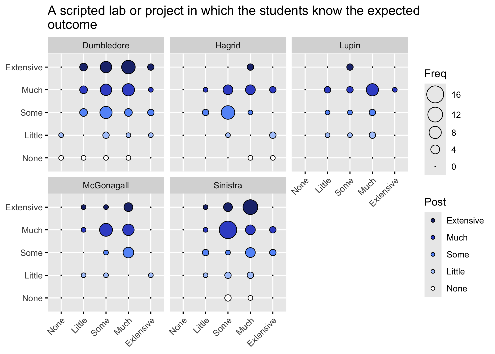
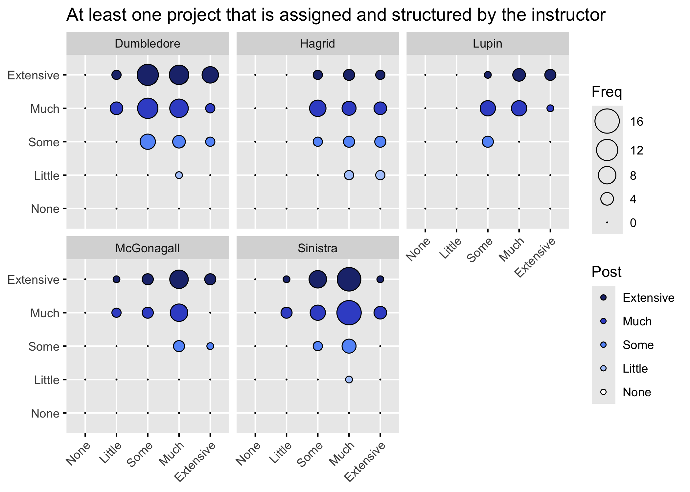
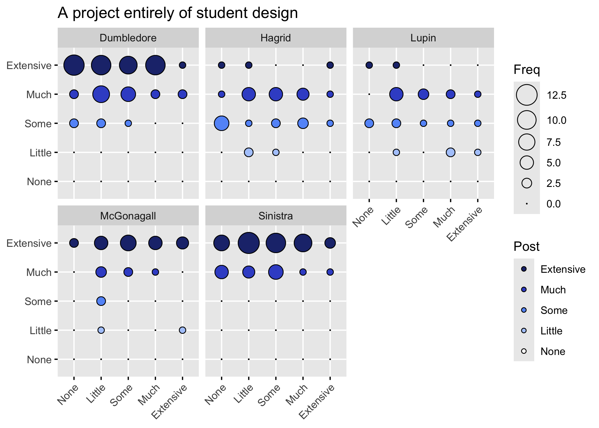
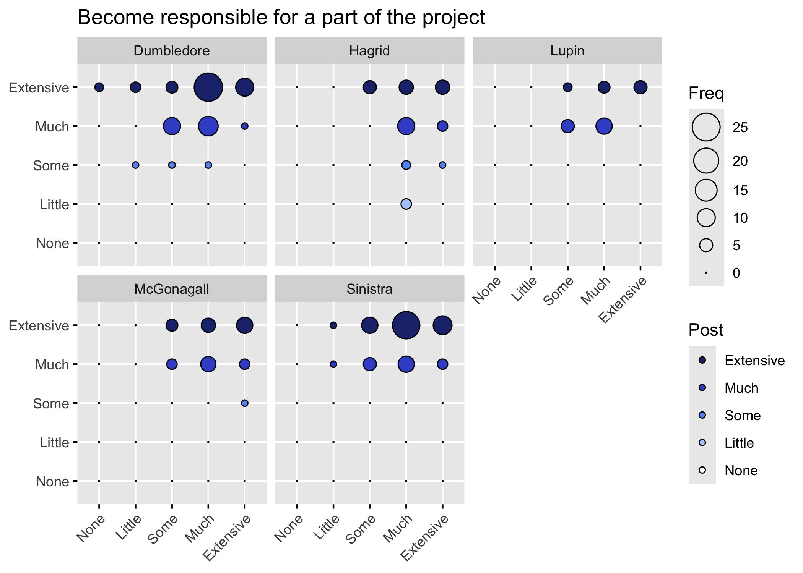
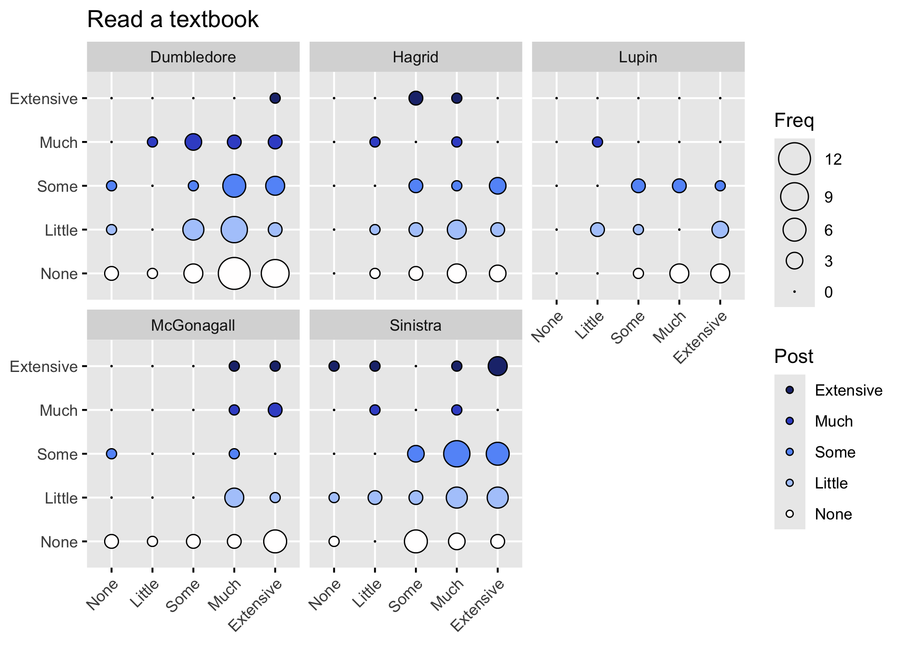

IMPORTANT NOTE

This Rmd uses the deidentified results and is safe to share.


## Loading Results

Loading in the results without instructor information:


```r
NoDemographics <- read_delim("Deidentified Surveys/NoDemographics.tsv", 
    delim = "\t", escape_double = FALSE, 
    trim_ws = TRUE)
```

```
## Rows: 85 Columns: 151
## ── Column specification ────────────────────────────────────────────────────────
## Delimiter: "\t"
## chr (141): ResponseId_pre, Instructor, Semester_pre, Q1_pre, Q8_pre, Q9_1_pr...
## dbl  (10): Q19_1_pre, Q19_2_pre, Q19_3_pre, Q19_4_pre, Q19_5_pre, Q19_6_pre,...
## 
## ℹ Use `spec()` to retrieve the full column specification for this data.
## ℹ Specify the column types or set `show_col_types = FALSE` to quiet this message.
```

```r
NoDemographicsQuestions <- read_delim("Deidentified Surveys/NoDemographicsQuestions.tsv", 
    delim = "\t", escape_double = FALSE, 
    trim_ws = TRUE)
```

```
## Rows: 151 Columns: 2
## ── Column specification ────────────────────────────────────────────────────────
## Delimiter: "\t"
## chr (2): value, Question
## 
## ℹ Use `spec()` to retrieve the full column specification for this data.
## ℹ Specify the column types or set `show_col_types = FALSE` to quiet this message.
```

## Improvement in learning elements

Comparing the responses to Pre10 and Post9:


```r
PreQ10 <- NoDemographics %>%
  select(Semester = Semester_pre, Instructor, starts_with("Q10")) %>%
  select(Semester, Instructor, ends_with("_pre"))
Q10Text <- NoDemographicsQuestions %>%
  filter(startsWith(value, "Q10")) %>%
  filter(endsWith(value, "_pre"))
Q10Text$Question[1]
```

```
## [1] "Please look over this inventory of elements that might be included in a course. For each element, give an estimate of your current level of ability before the course begins. Your current level of ability may be a result of courses in high school or college, or it may be a result of other experiences such as jobs or special programs. If students are expected to do the following course elements, what would be their level of expertise? - A scripted lab or project in which the students know the expected outcome"
```

```r
Q10TextClean <- Q10Text %>%
  mutate(Question = str_remove(Q10Text$Question, "Please look over this inventory of elements that might be included in a course. For each element, give an estimate of your current level of ability before the course begins. Your current level of ability may be a result of courses in high school or college, or it may be a result of other experiences such as jobs or special programs. If students are expected to do the following course elements, what would be their level of expertise\\? - "))
Q10TextClean$Question
```

```
##  [1] "A scripted lab or project in which the students know the expected outcome"                         
##  [2] "A lab or project in which only the instructor knows the outcome"                                   
##  [3] "A lab or project where no one knows the outcome"                                                   
##  [4] "At least one project that is assigned and structured by the instructor"                            
##  [5] "A project in which students have some input into the research process and/or what is being studied"
##  [6] "A project entirely of student design"                                                              
##  [7] "Work individually"                                                                                 
##  [8] "Work as a whole class"                                                                             
##  [9] "Work in small groups"                                                                              
## [10] "Become responsible for a part of the project"                                                      
## [11] "Read primary scientific literature"                                                                
## [12] "Write a research proposal"                                                                         
## [13] "Collect data"                                                                                      
## [14] "Analyze data"                                                                                      
## [15] "Present results orally"                                                                            
## [16] "Present results in written papers or reports"                                                      
## [17] "Present posters"                                                                                   
## [18] "Critique the work of other students"                                                               
## [19] "Listen to lectures"                                                                                
## [20] "Read a textbook"                                                                                   
## [21] "Work on problem sets"                                                                              
## [22] "Take tests in class"                                                                               
## [23] "Discuss reading materials in class"                                                                
## [24] "Maintain a lab notebook"                                                                           
## [25] "Computer modeling"
```


```r
PostQ9 <- NoDemographics %>%
  select(starts_with("Q9")) %>%
  select(ends_with("_post"))

Q9Text <- NoDemographicsQuestions %>%
  filter(startsWith(value, "Q9")) %>%
  filter(endsWith(value, "_post"))
Q9Text$Question[1]
```

```
## [1] "Please rate how much learning you gained from each element you experienced in this course. The scale measuring your gain is from (no or very small gain) to (very large gain). Some elements may not have happened at all. If the item is not relevant or you prefer not to answer, please choose the \"\"not applicable\"\" option. If students were expected to do the following course elements, what would be their level of gained experience? - A scripted lab or project in which the students know the expected outcome"
```

```r
Q9TextClean <- Q9Text %>%
  mutate(Question = str_remove(Q9Text$Question, "Please rate how much learning you gained from each element you experienced in this course. The scale measuring your gain is from \\(no or very small gain\\) to \\(very large gain\\). Some elements may not have happened at all. If the item is not relevant or you prefer not to answer, please choose the \"\"not applicable\"\" option. If students were expected to do the following course elements, what would be their level of gained experience\\? - "))
Q9TextClean$Question
```

```
##  [1] "A scripted lab or project in which the students know the expected outcome"                         
##  [2] "A lab or project in which only the instructor knows the outcome"                                   
##  [3] "A lab or project where no one knows the outcome"                                                   
##  [4] "At least one project that is assigned and structured by the instructor"                            
##  [5] "A project in which students have some input into the research process and/or what is being studied"
##  [6] "A project entirely of student design"                                                              
##  [7] "Work individually"                                                                                 
##  [8] "Work as a whole class"                                                                             
##  [9] "Work in small groups"                                                                              
## [10] "Become responsible for a part of the project"                                                      
## [11] "Read primary scientific literature"                                                                
## [12] "Write a research proposal"                                                                         
## [13] "Collect data"                                                                                      
## [14] "Analyze data"                                                                                      
## [15] "Present results orally"                                                                            
## [16] "Present results in written papers or reports"                                                      
## [17] "Present posters"                                                                                   
## [18] "Critique the work of other students"                                                               
## [19] "Listen to lectures"                                                                                
## [20] "Read a textbook"                                                                                   
## [21] "Work on problem sets"                                                                              
## [22] "Take tests in class"                                                                               
## [23] "Discuss reading materials in class"                                                                
## [24] "Maintain a lab notebook"                                                                           
## [25] "Computer modeling"
```

```r
Q9TextClean$Question == Q10TextClean$Question
```

```
##  [1] TRUE TRUE TRUE TRUE TRUE TRUE TRUE TRUE TRUE TRUE TRUE TRUE TRUE TRUE TRUE
## [16] TRUE TRUE TRUE TRUE TRUE TRUE TRUE TRUE TRUE TRUE
```

Now to compare the pre and post responses for those questions:


```r
MergedQ10 <- bind_cols(PreQ10, PostQ9)
head(MergedQ10)
```

```
## # A tibble: 6 × 52
##   Semester  Instructor Q10_1_pre Q10_2_pre Q10_3_pre Q10_4_pre Q10_5_pre
##   <chr>     <chr>      <chr>     <chr>     <chr>     <chr>     <chr>    
## 1 Fall 2021 McGonagall Much      Some      None      Some      Extensive
## 2 Fall 2021 McGonagall Some      Much      None      Extensive Little   
## 3 Fall 2021 McGonagall Some      Much      None      Much      Some     
## 4 Fall 2021 McGonagall Little    Much      Little    Some      Some     
## 5 Fall 2021 McGonagall Some      Some      Little    Much      Much     
## 6 Fall 2021 McGonagall Some      Much      Little    Much      Some     
## # ℹ 45 more variables: Q10_6_pre <chr>, Q10_7_pre <chr>, Q10_8_pre <chr>,
## #   Q10_9_pre <chr>, Q10_10_pre <chr>, Q10_11_pre <chr>, Q10_12_pre <chr>,
## #   Q10_13_pre <chr>, Q10_14_pre <chr>, Q10_15_pre <chr>, Q10_16_pre <chr>,
## #   Q10_17_pre <chr>, Q10_18_pre <chr>, Q10_19_pre <chr>, Q10_20_pre <chr>,
## #   Q10_21_pre <chr>, Q10_22_pre <chr>, Q10_23_pre <chr>, Q10_24_pre <chr>,
## #   Q10_25_pre <chr>, Q9_1_post <chr>, Q9_2_post <chr>, Q9_3_post <chr>,
## #   Q9_4_post <chr>, Q9_5_post <chr>, Q9_6_post <chr>, Q9_7_post <chr>, …
```

```r
Q10Factors <- MergedQ10 %>%
  select(starts_with("Q")) %>%
  mutate_all(funs(ordered(.,(levels = c("None", "Little", 
                                       "Some", "Much", "Extensive"))))) 
```

```
## Warning: `funs()` was deprecated in dplyr 0.8.0.
## ℹ Please use a list of either functions or lambdas:
## 
## # Simple named list: list(mean = mean, median = median)
## 
## # Auto named with `tibble::lst()`: tibble::lst(mean, median)
## 
## # Using lambdas list(~ mean(., trim = .2), ~ median(., na.rm = TRUE))
## Call `lifecycle::last_lifecycle_warnings()` to see where this warning was
## generated.
```

```r
Q10Clean <- MergedQ10 %>%
  select(-starts_with("Q")) %>%
  cbind(Q10Factors)
```

First let's just look at the contingency tables to see if everything looks right.


```r
print("Rows represents pre-survey response, Columns represent post-survey response.")
```

```
## [1] "Rows represents pre-survey response, Columns represent post-survey response."
```

```r
print("First for All sections then for then by Instructor.")
```

```
## [1] "First for All sections then for then by Instructor."
```

```r
Q10TextClean$Question[1]
```

```
## [1] "A scripted lab or project in which the students know the expected outcome"
```

```r
table(Q10Clean$Q10_1_pre, Q10Clean$Q9_1_post)
```

```
##            
##             None Little Some Much Extensive
##   None         0      1    0    0         0
##   Little       0      1    2    2         2
##   Some         0      2   10   15         6
##   Much         0      2    9   15        10
##   Extensive    0      1    0    2         0
```

```r
print("By Instructor")
```

```
## [1] "By Instructor"
```

```r
Q10TextClean$Question[1]
```

```
## [1] "A scripted lab or project in which the students know the expected outcome"
```

```r
table(Q10Clean$Q10_1_pre, Q10Clean$Q9_1_post, Q10Clean$Instructor)
```

```
## , ,  = Dumbledore
## 
##            
##             None Little Some Much Extensive
##   None         0      1    0    0         0
##   Little       0      0    1    0         1
##   Some         0      0    2    0         1
##   Much         0      0    0    2         5
##   Extensive    0      0    0    0         0
## 
## , ,  = Hagrid
## 
##            
##             None Little Some Much Extensive
##   None         0      0    0    0         0
##   Little       0      0    1    1         0
##   Some         0      0    7    3         0
##   Much         0      0    0    2         0
##   Extensive    0      0    0    1         0
## 
## , ,  = Lupin
## 
##            
##             None Little Some Much Extensive
##   None         0      0    0    0         0
##   Little       0      0    0    0         0
##   Some         0      0    0    1         2
##   Much         0      1    1    4         0
##   Extensive    0      0    0    1         0
## 
## , ,  = McGonagall
## 
##            
##             None Little Some Much Extensive
##   None         0      0    0    0         0
##   Little       0      1    0    1         1
##   Some         0      1    1    9         1
##   Much         0      0    6    7         4
##   Extensive    0      1    0    0         0
## 
## , ,  = Sinistra
## 
##            
##             None Little Some Much Extensive
##   None         0      0    0    0         0
##   Little       0      0    0    0         0
##   Some         0      1    0    2         2
##   Much         0      1    2    0         1
##   Extensive    0      0    0    0         0
```

Balloon Plot

On these plots, the answers on the x axis are the pre-survey results and on the y-axis
are the post survey results. 
Responses above the "none" level indicate students who felt that they increased in this element.


The pre-survey questions were asked as:
Please look over this inventory of elements that might be included in a course. For each element, give an estimate of your current level of ability before the course begins. Your current level of ability may be a result of courses in high school or college, or it may be a result of other experiences such as jobs or special programs. If students are expected to do the following course elements, what would be their level of expertise? 


The post-survey questions were asked: 
Please rate how much learning you gained from each element you experienced in this course. The scale measuring your gain is from (no or very small gain) to (very large gain). Some elements may not have happened at all. If the item is not relevant or you prefer not to answer, please choose the "not applicable" option. If students were expected to do the following course elements, what would be their level of gained experience? 


```r
colorcolumn <- rep.int(c(rep.int("None",5), rep.int("Little",5), rep.int("Some",5), 
                 rep.int("Much",5), rep.int("Extensive", 5)), 5)

colorcolumn <- factor(colorcolumn, 
                         levels = c("Extensive", "Much", "Some", "Little", "None"))
```


```r
Q10Clean %>%
  select(Q10_1_pre, Q9_1_post, Instructor) %>%
  table() %>%
  as.data.frame() %>%
  add_column(Post = colorcolumn) %>%
  ggballoonplot(x = "Q10_1_pre", y = "Q9_1_post", size = "Freq", 
                ggtheme = theme_gray(), facet.by = "Instructor",
                fill = "Post", size.range = c(0, 8),
                title = paste(strwrap(Q10TextClean$Question[1], 72), collapse = "\n")) + 
  fill_palette(c("#2171b5","#6baed6","#bdd7e7","#eff3ff","#FFFEFE"))
```

<!-- -->

```r
# Using glm() to determine if post response depends on pre response or on instructor:
levels(as.factor(Q10Clean$Instructor))
```

```
## [1] "Dumbledore" "Hagrid"     "Lupin"      "McGonagall" "Sinistra"
```

```r
imp_model_Q10_1 <- glm(as.numeric(Q10Clean$Q9_1_post) ~ 
                      as.numeric(Q10Clean$Q10_1_pre) + Q10Clean$Instructor)
summary(imp_model_Q10_1)
```

```
## 
## Call:
## glm(formula = as.numeric(Q10Clean$Q9_1_post) ~ as.numeric(Q10Clean$Q10_1_pre) + 
##     Q10Clean$Instructor)
## 
## Deviance Residuals: 
##     Min       1Q   Median       3Q      Max  
## -1.9726  -0.5200   0.1493   0.5496   1.3931  
## 
## Coefficients:
##                                Estimate Std. Error t value Pr(>|t|)    
## (Intercept)                      3.7600     0.5098   7.375 1.95e-10 ***
## as.numeric(Q10Clean$Q10_1_pre)   0.1219     0.1379   0.884   0.3795    
## Q10Clean$InstructorHagrid       -0.6753     0.3392  -1.991   0.0502 .  
## Q10Clean$InstructorLupin        -0.3232     0.3844  -0.841   0.4031    
## Q10Clean$InstructorMcGonagall   -0.3969     0.2950  -1.346   0.1826    
## Q10Clean$InstructorSinistra     -0.5132     0.3890  -1.319   0.1911    
## ---
## Signif. codes:  0 '***' 0.001 '**' 0.01 '*' 0.05 '.' 0.1 ' ' 1
## 
## (Dispersion parameter for gaussian family taken to be 0.8002052)
## 
##     Null deviance: 63.388  on 79  degrees of freedom
## Residual deviance: 59.215  on 74  degrees of freedom
##   (5 observations deleted due to missingness)
## AIC: 216.96
## 
## Number of Fisher Scoring iterations: 2
```

```r
# NA's are going to cause problems with the model selection, so I will prepare to remove them 
Q10Clean_withNA <- Q10Clean


step_imp_model_Q10_1 <- stepAIC(imp_model_Q10_1, direction = "backward")
```

```
## Start:  AIC=216.96
## as.numeric(Q10Clean$Q9_1_post) ~ as.numeric(Q10Clean$Q10_1_pre) + 
##     Q10Clean$Instructor
## 
##                                  Df Deviance    AIC
## - Q10Clean$Instructor             4   62.591 213.40
## - as.numeric(Q10Clean$Q10_1_pre)  1   59.841 215.80
## <none>                                59.215 216.96
## 
## Step:  AIC=213.4
## as.numeric(Q10Clean$Q9_1_post) ~ as.numeric(Q10Clean$Q10_1_pre)
## 
##                                  Df Deviance    AIC
## - as.numeric(Q10Clean$Q10_1_pre)  1   63.388 212.41
## <none>                                62.591 213.40
## 
## Step:  AIC=212.41
## as.numeric(Q10Clean$Q9_1_post) ~ 1
```

```r
summary(step_imp_model_Q10_1)
```

```
## 
## Call:
## glm(formula = as.numeric(Q10Clean$Q9_1_post) ~ 1)
## 
## Deviance Residuals: 
##     Min       1Q   Median       3Q      Max  
## -1.7875  -0.7875   0.2125   0.2125   1.2125  
## 
## Coefficients:
##             Estimate Std. Error t value Pr(>|t|)    
## (Intercept)   3.7875     0.1001   37.82   <2e-16 ***
## ---
## Signif. codes:  0 '***' 0.001 '**' 0.01 '*' 0.05 '.' 0.1 ' ' 1
## 
## (Dispersion parameter for gaussian family taken to be 0.8023734)
## 
##     Null deviance: 63.388  on 79  degrees of freedom
## Residual deviance: 63.388  on 79  degrees of freedom
##   (5 observations deleted due to missingness)
## AIC: 212.41
## 
## Number of Fisher Scoring iterations: 2
```


```r
Q10Clean_withNA %>%
  select(Q10_2_pre, Q9_2_post, Instructor) %>%
  table() %>%
  as.data.frame() %>%
  add_column(Post = colorcolumn) %>%
  ggballoonplot(x = "Q10_2_pre", y = "Q9_2_post", size = "Freq", 
                ggtheme = theme_gray(), facet.by = "Instructor",
                fill = "Post", size.range = c(0, 8),
                title = paste(strwrap(Q10TextClean$Question[2], 72), collapse = "\n")) + 
  fill_palette(c("#2171b5","#6baed6","#bdd7e7","#eff3ff","#FFFEFE"))
```

<!-- -->

```r
# Using glm() to determine if post response depends on pre response or on instructor:
levels(as.factor(Q10Clean$Instructor))
```

```
## [1] "Dumbledore" "Hagrid"     "Lupin"      "McGonagall" "Sinistra"
```

```r
imp_model_Q10_2 <- glm(as.numeric(Q10Clean$Q9_2_post) ~ 
                      as.numeric(Q10Clean$Q10_2_pre) + Q10Clean$Instructor)
summary(imp_model_Q10_2)
```

```
## 
## Call:
## glm(formula = as.numeric(Q10Clean$Q9_2_post) ~ as.numeric(Q10Clean$Q10_2_pre) + 
##     Q10Clean$Instructor)
## 
## Deviance Residuals: 
##      Min        1Q    Median        3Q       Max  
## -2.27590  -0.45827   0.03673   0.35434   1.69405  
## 
## Coefficients:
##                                Estimate Std. Error t value Pr(>|t|)    
## (Intercept)                     4.55670    0.39954  11.405   <2e-16 ***
## as.numeric(Q10Clean$Q10_2_pre) -0.28081    0.11114  -2.527   0.0136 *  
## Q10Clean$InstructorHagrid      -0.06863    0.30932  -0.222   0.8250    
## Q10Clean$InstructorLupin        0.52979    0.33738   1.570   0.1206    
## Q10Clean$InstructorMcGonagall   0.02479    0.26779   0.093   0.9265    
## Q10Clean$InstructorSinistra    -0.12753    0.35215  -0.362   0.7183    
## ---
## Signif. codes:  0 '***' 0.001 '**' 0.01 '*' 0.05 '.' 0.1 ' ' 1
## 
## (Dispersion parameter for gaussian family taken to be 0.6785345)
## 
##     Null deviance: 57.654  on 80  degrees of freedom
## Residual deviance: 50.890  on 75  degrees of freedom
##   (4 observations deleted due to missingness)
## AIC: 206.22
## 
## Number of Fisher Scoring iterations: 2
```

```r
step_imp_model_Q10_2 <- stepAIC(imp_model_Q10_2, direction = "backward")
```

```
## Start:  AIC=206.22
## as.numeric(Q10Clean$Q9_2_post) ~ as.numeric(Q10Clean$Q10_2_pre) + 
##     Q10Clean$Instructor
## 
##                                  Df Deviance    AIC
## - Q10Clean$Instructor             4   53.930 202.92
## <none>                                50.890 206.22
## - as.numeric(Q10Clean$Q10_2_pre)  1   55.222 210.84
## 
## Step:  AIC=202.92
## as.numeric(Q10Clean$Q9_2_post) ~ as.numeric(Q10Clean$Q10_2_pre)
## 
##                                  Df Deviance    AIC
## <none>                                53.930 202.92
## - as.numeric(Q10Clean$Q10_2_pre)  1   57.654 206.33
```

```r
summary(step_imp_model_Q10_2)
```

```
## 
## Call:
## glm(formula = as.numeric(Q10Clean$Q9_2_post) ~ as.numeric(Q10Clean$Q10_2_pre))
## 
## Deviance Residuals: 
##     Min       1Q   Median       3Q      Max  
## -2.2689  -0.5064   0.2394   0.4936   1.4936  
## 
## Coefficients:
##                                Estimate Std. Error t value Pr(>|t|)    
## (Intercept)                      4.5231     0.3728  12.131   <2e-16 ***
## as.numeric(Q10Clean$Q10_2_pre)  -0.2542     0.1088  -2.336    0.022 *  
## ---
## Signif. codes:  0 '***' 0.001 '**' 0.01 '*' 0.05 '.' 0.1 ' ' 1
## 
## (Dispersion parameter for gaussian family taken to be 0.6826525)
## 
##     Null deviance: 57.654  on 80  degrees of freedom
## Residual deviance: 53.930  on 79  degrees of freedom
##   (4 observations deleted due to missingness)
## AIC: 202.92
## 
## Number of Fisher Scoring iterations: 2
```

```r
Q10Clean_withNA %>%
  select(Q10_3_pre, Q9_3_post, Instructor) %>%
  table() %>%
  as.data.frame() %>%
  add_column(Post = colorcolumn) %>%
  ggballoonplot(x = "Q10_3_pre", y = "Q9_3_post", size = "Freq", 
                ggtheme = theme_gray(), facet.by = "Instructor",
                fill = "Post", size.range = c(0, 8),
                title = paste(strwrap(Q10TextClean$Question[3], 72), collapse = "\n")) + 
  fill_palette(c("#2171b5","#6baed6","#bdd7e7","#eff3ff","#FFFEFE"))
```

<!-- -->

```r
# Using glm() to determine if post response depends on pre response or on instructor:
Q10Clean_withNA %>%
  select(Q10_3_pre, Q9_3_post, Instructor) %>%
  na.omit() -> Q10Clean
# This was the first question with NA responses, so they had to be removed.

imp_model_Q10_3 <- glm(as.numeric(Q10Clean$Q9_3_post) ~ 
                      as.numeric(Q10Clean$Q10_3_pre) + Q10Clean$Instructor)
summary(imp_model_Q10_3)
```

```
## 
## Call:
## glm(formula = as.numeric(Q10Clean$Q9_3_post) ~ as.numeric(Q10Clean$Q10_3_pre) + 
##     Q10Clean$Instructor)
## 
## Deviance Residuals: 
##      Min        1Q    Median        3Q       Max  
## -2.61548  -0.44424  -0.01904   0.63853   1.46158  
## 
## Coefficients:
##                                Estimate Std. Error t value Pr(>|t|)    
## (Intercept)                     4.32282    0.28328  15.260   <2e-16 ***
## as.numeric(Q10Clean$Q10_3_pre)  0.07706    0.08959   0.860   0.3923    
## Q10Clean$InstructorHagrid      -0.93852    0.32077  -2.926   0.0045 ** 
## Q10Clean$InstructorLupin       -0.79871    0.35824  -2.230   0.0287 *  
## Q10Clean$InstructorMcGonagall  -0.38084    0.28083  -1.356   0.1790    
## Q10Clean$InstructorSinistra    -0.11547    0.36596  -0.316   0.7532    
## ---
## Signif. codes:  0 '***' 0.001 '**' 0.01 '*' 0.05 '.' 0.1 ' ' 1
## 
## (Dispersion parameter for gaussian family taken to be 0.7842616)
## 
##     Null deviance: 70.702  on 83  degrees of freedom
## Residual deviance: 61.172  on 78  degrees of freedom
## AIC: 225.74
## 
## Number of Fisher Scoring iterations: 2
```

```r
step_imp_model_Q10_3 <- stepAIC(imp_model_Q10_3, direction = "backward")
```

```
## Start:  AIC=225.74
## as.numeric(Q10Clean$Q9_3_post) ~ as.numeric(Q10Clean$Q10_3_pre) + 
##     Q10Clean$Instructor
## 
##                                  Df Deviance    AIC
## - as.numeric(Q10Clean$Q10_3_pre)  1   61.753 224.54
## <none>                                61.172 225.74
## - Q10Clean$Instructor             4   70.514 229.68
## 
## Step:  AIC=224.54
## as.numeric(Q10Clean$Q9_3_post) ~ Q10Clean$Instructor
## 
##                       Df Deviance    AIC
## <none>                     61.753 224.54
## - Q10Clean$Instructor  4   70.702 227.91
```

```r
summary(step_imp_model_Q10_3)
```

```
## 
## Call:
## glm(formula = as.numeric(Q10Clean$Q9_3_post) ~ Q10Clean$Instructor)
## 
## Deviance Residuals: 
##     Min       1Q   Median       3Q      Max  
## -2.5625  -0.4667  -0.1250   0.6000   1.4375  
## 
## Coefficients:
##                               Estimate Std. Error t value Pr(>|t|)    
## (Intercept)                    4.46667    0.22828  19.567  < 2e-16 ***
## Q10Clean$InstructorHagrid     -0.90417    0.31775  -2.846  0.00565 ** 
## Q10Clean$InstructorLupin      -0.73939    0.35096  -2.107  0.03831 *  
## Q10Clean$InstructorMcGonagall -0.34167    0.27666  -1.235  0.22050    
## Q10Clean$InstructorSinistra   -0.06667    0.36094  -0.185  0.85394    
## ---
## Signif. codes:  0 '***' 0.001 '**' 0.01 '*' 0.05 '.' 0.1 ' ' 1
## 
## (Dispersion parameter for gaussian family taken to be 0.7816791)
## 
##     Null deviance: 70.702  on 83  degrees of freedom
## Residual deviance: 61.753  on 79  degrees of freedom
## AIC: 224.54
## 
## Number of Fisher Scoring iterations: 2
```

```r
Q10Clean_withNA %>%
  select(Q10_4_pre, Q9_4_post, Instructor) %>%
  table() %>%
  as.data.frame() %>%
  add_column(Post = colorcolumn) %>%
  ggballoonplot(x = "Q10_4_pre", y = "Q9_4_post", size = "Freq", 
                ggtheme = theme_gray(), facet.by = "Instructor",
                fill = "Post", size.range = c(0, 8),
                title = paste(strwrap(Q10TextClean$Question[4], 72), collapse = "\n")) + 
  fill_palette(c("#2171b5","#6baed6","#bdd7e7","#eff3ff","#FFFEFE"))
```

<!-- -->

```r
# Using glm() to determine if post response depends on pre response or on instructor:
Q10Clean_withNA %>%
  select(Q10_4_pre, Q9_4_post, Instructor) %>%
  na.omit() -> Q10Clean

imp_model_Q10_4 <- glm(as.numeric(Q10Clean$Q9_4_post) ~ 
                      as.numeric(Q10Clean$Q10_4_pre) + Q10Clean$Instructor)
summary(imp_model_Q10_4)
```

```
## 
## Call:
## glm(formula = as.numeric(Q10Clean$Q9_4_post) ~ as.numeric(Q10Clean$Q10_4_pre) + 
##     Q10Clean$Instructor)
## 
## Deviance Residuals: 
##      Min        1Q    Median        3Q       Max  
## -1.44518  -0.39007   0.06776   0.55626   1.19671  
## 
## Coefficients:
##                                Estimate Std. Error t value Pr(>|t|)    
## (Intercept)                     4.25175    0.39171  10.854   <2e-16 ***
## as.numeric(Q10Clean$Q10_4_pre)  0.06447    0.10315   0.625   0.5337    
## Q10Clean$InstructorHagrid      -0.43909    0.26711  -1.644   0.1042    
## Q10Clean$InstructorLupin       -0.05510    0.29658  -0.186   0.8531    
## Q10Clean$InstructorMcGonagall  -0.13038    0.23051  -0.566   0.5732    
## Q10Clean$InstructorSinistra    -0.57741    0.29720  -1.943   0.0556 .  
## ---
## Signif. codes:  0 '***' 0.001 '**' 0.01 '*' 0.05 '.' 0.1 ' ' 1
## 
## (Dispersion parameter for gaussian family taken to be 0.5282038)
## 
##     Null deviance: 45.224  on 84  degrees of freedom
## Residual deviance: 41.728  on 79  degrees of freedom
## AIC: 194.74
## 
## Number of Fisher Scoring iterations: 2
```

```r
step_imp_model_Q10_4 <- stepAIC(imp_model_Q10_4, direction = "backward")
```

```
## Start:  AIC=194.74
## as.numeric(Q10Clean$Q9_4_post) ~ as.numeric(Q10Clean$Q10_4_pre) + 
##     Q10Clean$Instructor
## 
##                                  Df Deviance    AIC
## - as.numeric(Q10Clean$Q10_4_pre)  1   41.934 193.16
## - Q10Clean$Instructor             4   45.049 193.25
## <none>                                41.728 194.74
## 
## Step:  AIC=193.16
## as.numeric(Q10Clean$Q9_4_post) ~ Q10Clean$Instructor
## 
##                       Df Deviance    AIC
## - Q10Clean$Instructor  4   45.224 191.58
## <none>                     41.934 193.16
## 
## Step:  AIC=191.58
## as.numeric(Q10Clean$Q9_4_post) ~ 1
```

```r
summary(step_imp_model_Q10_4)
```

```
## 
## Call:
## glm(formula = as.numeric(Q10Clean$Q9_4_post) ~ 1)
## 
## Deviance Residuals: 
##     Min       1Q   Median       3Q      Max  
## -1.2824  -0.2823  -0.2823   0.7177   0.7177  
## 
## Coefficients:
##             Estimate Std. Error t value Pr(>|t|)    
## (Intercept)  4.28235    0.07959   53.81   <2e-16 ***
## ---
## Signif. codes:  0 '***' 0.001 '**' 0.01 '*' 0.05 '.' 0.1 ' ' 1
## 
## (Dispersion parameter for gaussian family taken to be 0.5383754)
## 
##     Null deviance: 45.224  on 84  degrees of freedom
## Residual deviance: 45.224  on 84  degrees of freedom
## AIC: 191.58
## 
## Number of Fisher Scoring iterations: 2
```

```r
Q10Clean_withNA %>%
  select(Q10_5_pre, Q9_5_post, Instructor) %>%
  table() %>%
  as.data.frame() %>%
  add_column(Post = colorcolumn) %>%
  ggballoonplot(x = "Q10_5_pre", y = "Q9_5_post", size = "Freq", 
                ggtheme = theme_gray(), facet.by = "Instructor",
                fill = "Post", size.range = c(0, 8),
                title = paste(strwrap(Q10TextClean$Question[5], 72), collapse = "\n")) + 
  fill_palette(c("#2171b5","#6baed6","#bdd7e7","#eff3ff","#FFFEFE"))
```

<!-- -->

```r
# Using glm() to determine if post response depends on pre response or on instructor:
Q10Clean_withNA %>%
  select(Q10_5_pre, Q9_5_post, Instructor) %>%
  na.omit() -> Q10Clean

imp_model_Q10_5 <- glm(as.numeric(Q10Clean$Q9_5_post) ~ 
                      as.numeric(Q10Clean$Q10_5_pre) + Q10Clean$Instructor)
summary(imp_model_Q10_5)
```

```
## 
## Call:
## glm(formula = as.numeric(Q10Clean$Q9_5_post) ~ as.numeric(Q10Clean$Q10_5_pre) + 
##     Q10Clean$Instructor)
## 
## Deviance Residuals: 
##     Min       1Q   Median       3Q      Max  
## -2.0779  -0.4731   0.2814   0.5270   1.0390  
## 
## Coefficients:
##                                Estimate Std. Error t value Pr(>|t|)    
## (Intercept)                     4.56281    0.28147  16.211   <2e-16 ***
## as.numeric(Q10Clean$Q10_5_pre)  0.03895    0.07878   0.494   0.6224    
## Q10Clean$InstructorHagrid      -0.67965    0.26207  -2.593   0.0113 *  
## Q10Clean$InstructorLupin       -0.50137    0.28993  -1.729   0.0877 .  
## Q10Clean$InstructorMcGonagall  -0.20660    0.23142  -0.893   0.3747    
## Q10Clean$InstructorSinistra    -0.17186    0.29638  -0.580   0.5637    
## ---
## Signif. codes:  0 '***' 0.001 '**' 0.01 '*' 0.05 '.' 0.1 ' ' 1
## 
## (Dispersion parameter for gaussian family taken to be 0.5263732)
## 
##     Null deviance: 46.188  on 84  degrees of freedom
## Residual deviance: 41.583  on 79  degrees of freedom
## AIC: 194.45
## 
## Number of Fisher Scoring iterations: 2
```

```r
step_imp_model_Q10_5 <- stepAIC(imp_model_Q10_5, direction = "backward")
```

```
## Start:  AIC=194.45
## as.numeric(Q10Clean$Q9_5_post) ~ as.numeric(Q10Clean$Q10_5_pre) + 
##     Q10Clean$Instructor
## 
##                                  Df Deviance    AIC
## - as.numeric(Q10Clean$Q10_5_pre)  1   41.712 192.71
## <none>                                41.583 194.45
## - Q10Clean$Instructor             4   46.122 195.25
## 
## Step:  AIC=192.71
## as.numeric(Q10Clean$Q9_5_post) ~ Q10Clean$Instructor
## 
##                       Df Deviance    AIC
## <none>                     41.712 192.71
## - Q10Clean$Instructor  4   46.188 193.38
```

```r
summary(step_imp_model_Q10_5)
```

```
## 
## Call:
## glm(formula = as.numeric(Q10Clean$Q9_5_post) ~ Q10Clean$Instructor)
## 
## Deviance Residuals: 
##     Min       1Q   Median       3Q      Max  
## -2.0000  -0.4849   0.3333   0.5151   1.0000  
## 
## Coefficients:
##                               Estimate Std. Error t value Pr(>|t|)    
## (Intercept)                     4.6667     0.1864  25.030   <2e-16 ***
## Q10Clean$InstructorHagrid      -0.6667     0.2595  -2.569   0.0121 *  
## Q10Clean$InstructorLupin       -0.4848     0.2866  -1.692   0.0946 .  
## Q10Clean$InstructorMcGonagall  -0.1818     0.2249  -0.809   0.4211    
## Q10Clean$InstructorSinistra    -0.1667     0.2948  -0.565   0.5734    
## ---
## Signif. codes:  0 '***' 0.001 '**' 0.01 '*' 0.05 '.' 0.1 ' ' 1
## 
## (Dispersion parameter for gaussian family taken to be 0.5214015)
## 
##     Null deviance: 46.188  on 84  degrees of freedom
## Residual deviance: 41.712  on 80  degrees of freedom
## AIC: 192.71
## 
## Number of Fisher Scoring iterations: 2
```

```r
Q10Clean_withNA %>%
  select(Q10_6_pre, Q9_6_post, Instructor) %>%
  table() %>%
  as.data.frame() %>%
  add_column(Post = colorcolumn) %>%
  ggballoonplot(x = "Q10_6_pre", y = "Q9_6_post", size = "Freq", 
                ggtheme = theme_gray(), facet.by = "Instructor",
                fill = "Post", size.range = c(0, 8),
                title = paste(strwrap(Q10TextClean$Question[6], 72), collapse = "\n")) + 
  fill_palette(c("#2171b5","#6baed6","#bdd7e7","#eff3ff","#FFFEFE"))
```

<!-- -->

```r
# Using glm() to determine if post response depends on pre response or on instructor:
Q10Clean_withNA %>%
  select(Q10_6_pre, Q9_6_post, Instructor) %>%
  na.omit() -> Q10Clean

imp_model_Q10_6 <- glm(as.numeric(Q10Clean$Q9_6_post) ~ 
                      as.numeric(Q10Clean$Q10_6_pre) + Q10Clean$Instructor)
summary(imp_model_Q10_6)
```

```
## 
## Call:
## glm(formula = as.numeric(Q10Clean$Q9_6_post) ~ as.numeric(Q10Clean$Q10_6_pre) + 
##     Q10Clean$Instructor)
## 
## Deviance Residuals: 
##     Min       1Q   Median       3Q      Max  
## -2.5620  -0.4791   0.3428   0.4856   1.5922  
## 
## Coefficients:
##                                Estimate Std. Error t value Pr(>|t|)    
## (Intercept)                     4.60960    0.27158  16.973  < 2e-16 ***
## as.numeric(Q10Clean$Q10_6_pre)  0.02378    0.07231   0.329 0.743138    
## Q10Clean$InstructorHagrid      -1.22560    0.29098  -4.212 6.73e-05 ***
## Q10Clean$InstructorLupin       -1.22207    0.32259  -3.788 0.000297 ***
## Q10Clean$InstructorMcGonagall  -0.16650    0.25603  -0.650 0.517398    
## Q10Clean$InstructorSinistra     0.22381    0.34117   0.656 0.513753    
## ---
## Signif. codes:  0 '***' 0.001 '**' 0.01 '*' 0.05 '.' 0.1 ' ' 1
## 
## (Dispersion parameter for gaussian family taken to be 0.6545977)
## 
##     Null deviance: 77.238  on 83  degrees of freedom
## Residual deviance: 51.059  on 78  degrees of freedom
## AIC: 210.56
## 
## Number of Fisher Scoring iterations: 2
```

```r
step_imp_model_Q10_6 <- stepAIC(imp_model_Q10_6, direction = "backward")
```

```
## Start:  AIC=210.56
## as.numeric(Q10Clean$Q9_6_post) ~ as.numeric(Q10Clean$Q10_6_pre) + 
##     Q10Clean$Instructor
## 
##                                  Df Deviance    AIC
## - as.numeric(Q10Clean$Q10_6_pre)  1   51.129 208.68
## <none>                                51.059 210.56
## - Q10Clean$Instructor             4   76.908 236.97
## 
## Step:  AIC=208.68
## as.numeric(Q10Clean$Q9_6_post) ~ Q10Clean$Instructor
## 
##                       Df Deviance    AIC
## <none>                     51.129 208.68
## - Q10Clean$Instructor  4   77.238 235.33
```

```r
summary(step_imp_model_Q10_6)
```

```
## 
## Call:
## glm(formula = as.numeric(Q10Clean$Q9_6_post) ~ Q10Clean$Instructor)
## 
## Deviance Residuals: 
##     Min       1Q   Median       3Q      Max  
## -2.5152  -0.4546   0.3333   0.4849   1.5625  
## 
## Coefficients:
##                               Estimate Std. Error t value Pr(>|t|)    
## (Intercept)                     4.6667     0.2077  22.466  < 2e-16 ***
## Q10Clean$InstructorHagrid      -1.2292     0.2891  -4.251 5.78e-05 ***
## Q10Clean$InstructorLupin       -1.2121     0.3193  -3.796 0.000287 ***
## Q10Clean$InstructorMcGonagall  -0.1515     0.2505  -0.605 0.547041    
## Q10Clean$InstructorSinistra     0.2222     0.3392   0.655 0.514288    
## ---
## Signif. codes:  0 '***' 0.001 '**' 0.01 '*' 0.05 '.' 0.1 ' ' 1
## 
## (Dispersion parameter for gaussian family taken to be 0.6472078)
## 
##     Null deviance: 77.238  on 83  degrees of freedom
## Residual deviance: 51.129  on 79  degrees of freedom
## AIC: 208.68
## 
## Number of Fisher Scoring iterations: 2
```

```r
Q10Clean_withNA %>%
  select(Q10_7_pre, Q9_7_post, Instructor) %>%
  table() %>%
  as.data.frame() %>%
  add_column(Post = colorcolumn) %>%
  ggballoonplot(x = "Q10_7_pre", y = "Q9_7_post", size = "Freq", 
                ggtheme = theme_gray(), facet.by = "Instructor",
                fill = "Post", size.range = c(0, 8),
                title = paste(strwrap(Q10TextClean$Question[7], 72), collapse = "\n")) + 
  fill_palette(c("#2171b5","#6baed6","#bdd7e7","#eff3ff","#FFFEFE"))
```

<!-- -->

```r
# Using glm() to determine if post response depends on pre response or on instructor:
Q10Clean_withNA %>%
  select(Q10_7_pre, Q9_7_post, Instructor) %>%
  na.omit() -> Q10Clean

imp_model_Q10_7 <- glm(as.numeric(Q10Clean$Q9_7_post) ~ 
                      as.numeric(Q10Clean$Q10_7_pre) + Q10Clean$Instructor)
summary(imp_model_Q10_7)
```

```
## 
## Call:
## glm(formula = as.numeric(Q10Clean$Q9_7_post) ~ as.numeric(Q10Clean$Q10_7_pre) + 
##     Q10Clean$Instructor)
## 
## Deviance Residuals: 
##     Min       1Q   Median       3Q      Max  
## -2.6530  -0.6530   0.1686   1.1686   1.6078  
## 
## Coefficients:
##                                Estimate Std. Error t value Pr(>|t|)    
## (Intercept)                     3.61284    0.48874   7.392 1.32e-10 ***
## as.numeric(Q10Clean$Q10_7_pre)  0.01615    0.11832   0.136    0.892    
## Q10Clean$InstructorHagrid      -0.30142    0.40809  -0.739    0.462    
## Q10Clean$InstructorLupin        0.13781    0.45499   0.303    0.763    
## Q10Clean$InstructorMcGonagall  -0.04058    0.35617  -0.114    0.910    
## Q10Clean$InstructorSinistra    -0.07097    0.45748  -0.155    0.877    
## ---
## Signif. codes:  0 '***' 0.001 '**' 0.01 '*' 0.05 '.' 0.1 ' ' 1
## 
## (Dispersion parameter for gaussian family taken to be 1.249782)
## 
##     Null deviance: 100.188  on 84  degrees of freedom
## Residual deviance:  98.733  on 79  degrees of freedom
## AIC: 267.95
## 
## Number of Fisher Scoring iterations: 2
```

```r
step_imp_model_Q10_7 <- stepAIC(imp_model_Q10_7, direction = "backward")
```

```
## Start:  AIC=267.95
## as.numeric(Q10Clean$Q9_7_post) ~ as.numeric(Q10Clean$Q10_7_pre) + 
##     Q10Clean$Instructor
## 
##                                  Df Deviance    AIC
## - Q10Clean$Instructor             4  100.163 261.17
## - as.numeric(Q10Clean$Q10_7_pre)  1   98.756 265.97
## <none>                                98.733 267.95
## 
## Step:  AIC=261.17
## as.numeric(Q10Clean$Q9_7_post) ~ as.numeric(Q10Clean$Q10_7_pre)
## 
##                                  Df Deviance    AIC
## - as.numeric(Q10Clean$Q10_7_pre)  1   100.19 259.19
## <none>                                100.16 261.17
## 
## Step:  AIC=259.19
## as.numeric(Q10Clean$Q9_7_post) ~ 1
```

```r
summary(step_imp_model_Q10_7)
```

```
## 
## Call:
## glm(formula = as.numeric(Q10Clean$Q9_7_post) ~ 1)
## 
## Deviance Residuals: 
##     Min       1Q   Median       3Q      Max  
## -2.6118  -0.6118   0.3882   1.3882   1.3882  
## 
## Coefficients:
##             Estimate Std. Error t value Pr(>|t|)    
## (Intercept)   3.6118     0.1185   30.49   <2e-16 ***
## ---
## Signif. codes:  0 '***' 0.001 '**' 0.01 '*' 0.05 '.' 0.1 ' ' 1
## 
## (Dispersion parameter for gaussian family taken to be 1.192717)
## 
##     Null deviance: 100.19  on 84  degrees of freedom
## Residual deviance: 100.19  on 84  degrees of freedom
## AIC: 259.19
## 
## Number of Fisher Scoring iterations: 2
```

```r
Q10Clean_withNA %>%
  select(Q10_8_pre, Q9_8_post, Instructor) %>%
  table() %>%
  as.data.frame() %>%
  add_column(Post = colorcolumn) %>%
  ggballoonplot(x = "Q10_8_pre", y = "Q9_8_post", size = "Freq", 
                ggtheme = theme_gray(), facet.by = "Instructor",
                fill = "Post", size.range = c(0, 8),
                title = paste(strwrap(Q10TextClean$Question[8], 72), collapse = "\n")) + 
  fill_palette(c("#2171b5","#6baed6","#bdd7e7","#eff3ff","#FFFEFE"))
```

<!-- -->

```r
# Using glm() to determine if post response depends on pre response or on instructor:
Q10Clean_withNA %>%
  select(Q10_8_pre, Q9_8_post, Instructor) %>%
  na.omit() -> Q10Clean

imp_model_Q10_8 <- glm(as.numeric(Q10Clean$Q9_8_post) ~ 
                      as.numeric(Q10Clean$Q10_8_pre) + Q10Clean$Instructor)
summary(imp_model_Q10_8)
```

```
## 
## Call:
## glm(formula = as.numeric(Q10Clean$Q9_8_post) ~ as.numeric(Q10Clean$Q10_8_pre) + 
##     Q10Clean$Instructor)
## 
## Deviance Residuals: 
##      Min        1Q    Median        3Q       Max  
## -2.37276  -0.49406  -0.02979   0.58773   1.62724  
## 
## Coefficients:
##                                Estimate Std. Error t value Pr(>|t|)    
## (Intercept)                     4.18784    0.43589   9.607 6.37e-15 ***
## as.numeric(Q10Clean$Q10_8_pre) -0.03951    0.11411  -0.346   0.7301    
## Q10Clean$InstructorHagrid      -0.62192    0.36235  -1.716   0.0900 .  
## Q10Clean$InstructorLupin       -0.57524    0.41351  -1.391   0.1681    
## Q10Clean$InstructorMcGonagall  -0.61752    0.32158  -1.920   0.0584 .  
## Q10Clean$InstructorSinistra    -0.57325    0.41136  -1.394   0.1674    
## ---
## Signif. codes:  0 '***' 0.001 '**' 0.01 '*' 0.05 '.' 0.1 ' ' 1
## 
## (Dispersion parameter for gaussian family taken to be 1.01313)
## 
##     Null deviance: 85.012  on 84  degrees of freedom
## Residual deviance: 80.037  on 79  degrees of freedom
## AIC: 250.11
## 
## Number of Fisher Scoring iterations: 2
```

```r
step_imp_model_Q10_8 <- stepAIC(imp_model_Q10_8, direction = "backward")
```

```
## Start:  AIC=250.11
## as.numeric(Q10Clean$Q9_8_post) ~ as.numeric(Q10Clean$Q10_8_pre) + 
##     Q10Clean$Instructor
## 
##                                  Df Deviance    AIC
## - Q10Clean$Instructor             4   84.459 246.68
## - as.numeric(Q10Clean$Q10_8_pre)  1   80.159 248.24
## <none>                                80.037 250.11
## 
## Step:  AIC=246.68
## as.numeric(Q10Clean$Q9_8_post) ~ as.numeric(Q10Clean$Q10_8_pre)
## 
##                                  Df Deviance    AIC
## - as.numeric(Q10Clean$Q10_8_pre)  1   85.012 245.23
## <none>                                84.459 246.68
## 
## Step:  AIC=245.23
## as.numeric(Q10Clean$Q9_8_post) ~ 1
```

```r
summary(step_imp_model_Q10_8)
```

```
## 
## Call:
## glm(formula = as.numeric(Q10Clean$Q9_8_post) ~ 1)
## 
## Deviance Residuals: 
##     Min       1Q   Median       3Q      Max  
## -2.5529  -0.5529   0.4471   0.4471   1.4471  
## 
## Coefficients:
##             Estimate Std. Error t value Pr(>|t|)    
## (Intercept)   3.5529     0.1091   32.56   <2e-16 ***
## ---
## Signif. codes:  0 '***' 0.001 '**' 0.01 '*' 0.05 '.' 0.1 ' ' 1
## 
## (Dispersion parameter for gaussian family taken to be 1.012045)
## 
##     Null deviance: 85.012  on 84  degrees of freedom
## Residual deviance: 85.012  on 84  degrees of freedom
## AIC: 245.23
## 
## Number of Fisher Scoring iterations: 2
```

```r
Q10Clean_withNA %>%
  select(Q10_9_pre, Q9_9_post, Instructor) %>%
  table() %>%
  as.data.frame() %>%
  add_column(Post = colorcolumn) %>%
  ggballoonplot(x = "Q10_9_pre", y = "Q9_9_post", size = "Freq", 
                ggtheme = theme_gray(), facet.by = "Instructor",
                fill = "Post", size.range = c(0, 8),
                title = paste(strwrap(Q10TextClean$Question[9], 72), collapse = "\n")) + 
  fill_palette(c("#2171b5","#6baed6","#bdd7e7","#eff3ff","#FFFEFE"))
```

<!-- -->

```r
# Using glm() to determine if post response depends on pre response or on instructor:
Q10Clean_withNA %>%
  select(Q10_9_pre, Q9_9_post, Instructor) %>%
  na.omit() -> Q10Clean

imp_model_Q10_9 <- glm(as.numeric(Q10Clean$Q9_9_post) ~ 
                      as.numeric(Q10Clean$Q10_9_pre) + Q10Clean$Instructor)
summary(imp_model_Q10_9)
```

```
## 
## Call:
## glm(formula = as.numeric(Q10Clean$Q9_9_post) ~ as.numeric(Q10Clean$Q10_9_pre) + 
##     Q10Clean$Instructor)
## 
## Deviance Residuals: 
##     Min       1Q   Median       3Q      Max  
## -2.6073  -0.4575   0.3036   0.4409   0.7625  
## 
## Coefficients:
##                                Estimate Std. Error t value Pr(>|t|)    
## (Intercept)                     4.16722    0.45245   9.210 3.78e-14 ***
## as.numeric(Q10Clean$Q10_9_pre)  0.11003    0.10707   1.028    0.307    
## Q10Clean$InstructorHagrid      -0.25984    0.23273  -1.117    0.268    
## Q10Clean$InstructorLupin       -0.02099    0.26036  -0.081    0.936    
## Q10Clean$InstructorMcGonagall  -0.04825    0.20086  -0.240    0.811    
## Q10Clean$InstructorSinistra     0.30367    0.26156   1.161    0.249    
## ---
## Signif. codes:  0 '***' 0.001 '**' 0.01 '*' 0.05 '.' 0.1 ' ' 1
## 
## (Dispersion parameter for gaussian family taken to be 0.4104128)
## 
##     Null deviance: 34.588  on 84  degrees of freedom
## Residual deviance: 32.423  on 79  degrees of freedom
## AIC: 173.3
## 
## Number of Fisher Scoring iterations: 2
```

```r
step_imp_model_Q10_9 <- stepAIC(imp_model_Q10_9, direction = "backward")
```

```
## Start:  AIC=173.3
## as.numeric(Q10Clean$Q9_9_post) ~ as.numeric(Q10Clean$Q10_9_pre) + 
##     Q10Clean$Instructor
## 
##                                  Df Deviance    AIC
## - Q10Clean$Instructor             4   34.362 170.24
## - as.numeric(Q10Clean$Q10_9_pre)  1   32.856 172.43
## <none>                                32.423 173.30
## 
## Step:  AIC=170.24
## as.numeric(Q10Clean$Q9_9_post) ~ as.numeric(Q10Clean$Q10_9_pre)
## 
##                                  Df Deviance    AIC
## - as.numeric(Q10Clean$Q10_9_pre)  1   34.588 168.79
## <none>                                34.362 170.24
## 
## Step:  AIC=168.79
## as.numeric(Q10Clean$Q9_9_post) ~ 1
```

```r
summary(step_imp_model_Q10_9)
```

```
## 
## Call:
## glm(formula = as.numeric(Q10Clean$Q9_9_post) ~ 1)
## 
## Deviance Residuals: 
##     Min       1Q   Median       3Q      Max  
## -2.5882  -0.5882   0.4118   0.4118   0.4118  
## 
## Coefficients:
##             Estimate Std. Error t value Pr(>|t|)    
## (Intercept)   4.5882     0.0696   65.92   <2e-16 ***
## ---
## Signif. codes:  0 '***' 0.001 '**' 0.01 '*' 0.05 '.' 0.1 ' ' 1
## 
## (Dispersion parameter for gaussian family taken to be 0.4117647)
## 
##     Null deviance: 34.588  on 84  degrees of freedom
## Residual deviance: 34.588  on 84  degrees of freedom
## AIC: 168.79
## 
## Number of Fisher Scoring iterations: 2
```

```r
Q10Clean_withNA %>%
  select(Q10_10_pre, Q9_10_post, Instructor) %>%
  table() %>%
  as.data.frame() %>%
  add_column(Post = colorcolumn) %>%
  ggballoonplot(x = "Q10_10_pre", y = "Q9_10_post", size = "Freq", 
                ggtheme = theme_gray(), facet.by = "Instructor",
                fill = "Post", size.range = c(0, 8),
                title = paste(strwrap(Q10TextClean$Question[10], 72), collapse = "\n")) + 
  fill_palette(c("#2171b5","#6baed6","#bdd7e7","#eff3ff","#FFFEFE"))
```

<!-- -->

```r
# Using glm() to determine if post response depends on pre response or on instructor:
Q10Clean_withNA %>%
  select(Q10_10_pre, Q9_10_post, Instructor) %>%
  na.omit() -> Q10Clean

imp_model_Q10_10 <- glm(as.numeric(Q10Clean$Q9_10_post) ~ 
                      as.numeric(Q10Clean$Q10_10_pre) + Q10Clean$Instructor)
summary(imp_model_Q10_10)
```

```
## 
## Call:
## glm(formula = as.numeric(Q10Clean$Q9_10_post) ~ as.numeric(Q10Clean$Q10_10_pre) + 
##     Q10Clean$Instructor)
## 
## Deviance Residuals: 
##     Min       1Q   Median       3Q      Max  
## -2.2518  -0.5166   0.2330   0.4444   0.7771  
## 
## Coefficients:
##                                 Estimate Std. Error t value Pr(>|t|)    
## (Intercept)                      4.63709    0.32344  14.337   <2e-16 ***
## as.numeric(Q10Clean$Q10_10_pre)  0.02887    0.08454   0.342   0.7336    
## Q10Clean$InstructorHagrid       -0.50078    0.22680  -2.208   0.0302 *  
## Q10Clean$InstructorLupin        -0.20713    0.25049  -0.827   0.4108    
## Q10Clean$InstructorMcGonagall   -0.22584    0.20458  -1.104   0.2730    
## Q10Clean$InstructorSinistra      0.15897    0.25201   0.631   0.5300    
## ---
## Signif. codes:  0 '***' 0.001 '**' 0.01 '*' 0.05 '.' 0.1 ' ' 1
## 
## (Dispersion parameter for gaussian family taken to be 0.3780162)
## 
##     Null deviance: 32.702  on 83  degrees of freedom
## Residual deviance: 29.485  on 78  degrees of freedom
## AIC: 164.44
## 
## Number of Fisher Scoring iterations: 2
```

```r
step_imp_model_Q10_10 <- stepAIC(imp_model_Q10_10, direction = "backward")
```

```
## Start:  AIC=164.44
## as.numeric(Q10Clean$Q9_10_post) ~ as.numeric(Q10Clean$Q10_10_pre) + 
##     Q10Clean$Instructor
## 
##                                   Df Deviance    AIC
## - as.numeric(Q10Clean$Q10_10_pre)  1   29.529 162.56
## <none>                                 29.485 164.44
## - Q10Clean$Instructor              4   32.670 165.06
## 
## Step:  AIC=162.57
## as.numeric(Q10Clean$Q9_10_post) ~ Q10Clean$Instructor
## 
##                       Df Deviance    AIC
## <none>                     29.529 162.56
## - Q10Clean$Instructor  4   32.702 163.14
```

```r
summary(step_imp_model_Q10_10)
```

```
## 
## Call:
## glm(formula = as.numeric(Q10Clean$Q9_10_post) ~ Q10Clean$Instructor)
## 
## Deviance Residuals: 
##     Min       1Q   Median       3Q      Max  
## -2.2500  -0.5312   0.2667   0.4688   0.7500  
## 
## Coefficients:
##                               Estimate Std. Error t value Pr(>|t|)    
## (Intercept)                     4.7333     0.1579  29.985   <2e-16 ***
## Q10Clean$InstructorHagrid      -0.4833     0.2197  -2.200   0.0308 *  
## Q10Clean$InstructorLupin       -0.1879     0.2427  -0.774   0.4412    
## Q10Clean$InstructorMcGonagall  -0.2021     0.1913  -1.056   0.2940    
## Q10Clean$InstructorSinistra     0.1667     0.2496   0.668   0.5062    
## ---
## Signif. codes:  0 '***' 0.001 '**' 0.01 '*' 0.05 '.' 0.1 ' ' 1
## 
## (Dispersion parameter for gaussian family taken to be 0.3737893)
## 
##     Null deviance: 32.702  on 83  degrees of freedom
## Residual deviance: 29.529  on 79  degrees of freedom
## AIC: 162.57
## 
## Number of Fisher Scoring iterations: 2
```

```r
Q10Clean_withNA %>%
  select(Q10_11_pre, Q9_11_post, Instructor) %>%
  table() %>%
  as.data.frame() %>%
  add_column(Post = colorcolumn) %>%
  ggballoonplot(x = "Q10_11_pre", y = "Q9_11_post", size = "Freq", 
                ggtheme = theme_gray(), facet.by = "Instructor",
                fill = "Post", size.range = c(0, 8),
                title = paste(strwrap(Q10TextClean$Question[11], 72), collapse = "\n")) + 
  fill_palette(c("#2171b5","#6baed6","#bdd7e7","#eff3ff","#FFFEFE"))
```

<!-- -->

```r
# Using glm() to determine if post response depends on pre response or on instructor:
Q10Clean_withNA %>%
  select(Q10_11_pre, Q9_11_post, Instructor) %>%
  na.omit() -> Q10Clean

imp_model_Q10_11 <- glm(as.numeric(Q10Clean$Q9_11_post) ~ 
                      as.numeric(Q10Clean$Q10_11_pre) + Q10Clean$Instructor)
summary(imp_model_Q10_11)
```

```
## 
## Call:
## glm(formula = as.numeric(Q10Clean$Q9_11_post) ~ as.numeric(Q10Clean$Q10_11_pre) + 
##     Q10Clean$Instructor)
## 
## Deviance Residuals: 
##     Min       1Q   Median       3Q      Max  
## -1.6201  -0.5242   0.3755   0.4758   1.4594  
## 
## Coefficients:
##                                 Estimate Std. Error t value Pr(>|t|)    
## (Intercept)                      4.46954    0.27162  16.455  < 2e-16 ***
## as.numeric(Q10Clean$Q10_11_pre)  0.05018    0.07952   0.631    0.530    
## Q10Clean$InstructorHagrid       -1.07952    0.25407  -4.249 5.89e-05 ***
## Q10Clean$InstructorLupin        -0.25643    0.27267  -0.940    0.350    
## Q10Clean$InstructorMcGonagall   -0.09590    0.22232  -0.431    0.667    
## Q10Clean$InstructorSinistra     -0.19235    0.29350  -0.655    0.514    
## ---
## Signif. codes:  0 '***' 0.001 '**' 0.01 '*' 0.05 '.' 0.1 ' ' 1
## 
## (Dispersion parameter for gaussian family taken to be 0.4654065)
## 
##     Null deviance: 48.667  on 83  degrees of freedom
## Residual deviance: 36.302  on 78  degrees of freedom
## AIC: 181.91
## 
## Number of Fisher Scoring iterations: 2
```

```r
imp_model_Q10_11 <- glm(as.numeric(Q10Clean$Q9_11_post) ~ 
                          as.numeric(Q10Clean$Q10_11_pre) + Q10Clean$Instructor)
summary(imp_model_Q10_11)
```

```
## 
## Call:
## glm(formula = as.numeric(Q10Clean$Q9_11_post) ~ as.numeric(Q10Clean$Q10_11_pre) + 
##     Q10Clean$Instructor)
## 
## Deviance Residuals: 
##     Min       1Q   Median       3Q      Max  
## -1.6201  -0.5242   0.3755   0.4758   1.4594  
## 
## Coefficients:
##                                 Estimate Std. Error t value Pr(>|t|)    
## (Intercept)                      4.46954    0.27162  16.455  < 2e-16 ***
## as.numeric(Q10Clean$Q10_11_pre)  0.05018    0.07952   0.631    0.530    
## Q10Clean$InstructorHagrid       -1.07952    0.25407  -4.249 5.89e-05 ***
## Q10Clean$InstructorLupin        -0.25643    0.27267  -0.940    0.350    
## Q10Clean$InstructorMcGonagall   -0.09590    0.22232  -0.431    0.667    
## Q10Clean$InstructorSinistra     -0.19235    0.29350  -0.655    0.514    
## ---
## Signif. codes:  0 '***' 0.001 '**' 0.01 '*' 0.05 '.' 0.1 ' ' 1
## 
## (Dispersion parameter for gaussian family taken to be 0.4654065)
## 
##     Null deviance: 48.667  on 83  degrees of freedom
## Residual deviance: 36.302  on 78  degrees of freedom
## AIC: 181.91
## 
## Number of Fisher Scoring iterations: 2
```

```r
step_imp_model_Q10_11 <- stepAIC(imp_model_Q10_11, direction = "backward")
```

```
## Start:  AIC=181.91
## as.numeric(Q10Clean$Q9_11_post) ~ as.numeric(Q10Clean$Q10_11_pre) + 
##     Q10Clean$Instructor
## 
##                                   Df Deviance    AIC
## - as.numeric(Q10Clean$Q10_11_pre)  1   36.487 180.34
## <none>                                 36.302 181.91
## - Q10Clean$Instructor              4   48.667 198.53
## 
## Step:  AIC=180.34
## as.numeric(Q10Clean$Q9_11_post) ~ Q10Clean$Instructor
## 
##                       Df Deviance    AIC
## <none>                     36.487 180.34
## - Q10Clean$Instructor  4   48.667 196.53
```

```r
summary(step_imp_model_Q10_11)
```

```
## 
## Call:
## glm(formula = as.numeric(Q10Clean$Q9_11_post) ~ Q10Clean$Instructor)
## 
## Deviance Residuals: 
##     Min       1Q   Median       3Q      Max  
## -1.6000  -0.5454   0.4000   0.4546   1.4375  
## 
## Coefficients:
##                               Estimate Std. Error t value Pr(>|t|)    
## (Intercept)                    4.60000    0.17547  26.215  < 2e-16 ***
## Q10Clean$InstructorHagrid     -1.03750    0.24425  -4.248 5.85e-05 ***
## Q10Clean$InstructorLupin      -0.23636    0.26977  -0.876    0.384    
## Q10Clean$InstructorMcGonagall -0.05455    0.21163  -0.258    0.797    
## Q10Clean$InstructorSinistra   -0.15556    0.28655  -0.543    0.589    
## ---
## Signif. codes:  0 '***' 0.001 '**' 0.01 '*' 0.05 '.' 0.1 ' ' 1
## 
## (Dispersion parameter for gaussian family taken to be 0.4618607)
## 
##     Null deviance: 48.667  on 83  degrees of freedom
## Residual deviance: 36.487  on 79  degrees of freedom
## AIC: 180.34
## 
## Number of Fisher Scoring iterations: 2
```

```r
Q10Clean_withNA %>%
  select(Q10_12_pre, Q9_12_post, Instructor) %>%
  table() %>%
  as.data.frame() %>%
  add_column(Post = colorcolumn) %>%
  ggballoonplot(x = "Q10_12_pre", y = "Q9_12_post", size = "Freq", 
                ggtheme = theme_gray(), facet.by = "Instructor",
                fill = "Post", size.range = c(0, 8),
                title = paste(strwrap(Q10TextClean$Question[12], 72), collapse = "\n")) + 
  fill_palette(c("#2171b5","#6baed6","#bdd7e7","#eff3ff","#FFFEFE"))
```

<!-- -->

```r
# Using glm() to determine if post response depends on pre response or on instructor:
Q10Clean_withNA %>%
  select(Q10_12_pre, Q9_12_post, Instructor) %>%
  na.omit() -> Q10Clean

imp_model_Q10_12 <- glm(as.numeric(Q10Clean$Q9_12_post) ~ 
                      as.numeric(Q10Clean$Q10_12_pre) + Q10Clean$Instructor)
summary(imp_model_Q10_12)
```

```
## 
## Call:
## glm(formula = as.numeric(Q10Clean$Q9_12_post) ~ as.numeric(Q10Clean$Q10_12_pre) + 
##     Q10Clean$Instructor)
## 
## Deviance Residuals: 
##      Min        1Q    Median        3Q       Max  
## -3.15377  -0.50974  -0.08826   0.84623   1.58707  
## 
## Coefficients:
##                                 Estimate Std. Error t value Pr(>|t|)    
## (Intercept)                      3.81251    0.32444  11.751   <2e-16 ***
## as.numeric(Q10Clean$Q10_12_pre)  0.02621    0.09764   0.268    0.789    
## Q10Clean$InstructorHagrid       -0.42578    0.35386  -1.203    0.233    
## Q10Clean$InstructorLupin        -0.15909    0.39743  -0.400    0.690    
## Q10Clean$InstructorMcGonagall    0.23644    0.31375   0.754    0.453    
## Q10Clean$InstructorSinistra      0.67316    0.41900   1.607    0.112    
## ---
## Signif. codes:  0 '***' 0.001 '**' 0.01 '*' 0.05 '.' 0.1 ' ' 1
## 
## (Dispersion parameter for gaussian family taken to be 0.9682086)
## 
##     Null deviance: 84.702  on 83  degrees of freedom
## Residual deviance: 75.520  on 78  degrees of freedom
## AIC: 243.44
## 
## Number of Fisher Scoring iterations: 2
```

```r
step_imp_model_Q10_12 <- stepAIC(imp_model_Q10_12, direction = "backward")
```

```
## Start:  AIC=243.44
## as.numeric(Q10Clean$Q9_12_post) ~ as.numeric(Q10Clean$Q10_12_pre) + 
##     Q10Clean$Instructor
## 
##                                   Df Deviance    AIC
## - as.numeric(Q10Clean$Q10_12_pre)  1   75.590 241.52
## <none>                                 75.520 243.44
## - Q10Clean$Instructor              4   83.923 244.31
## 
## Step:  AIC=241.52
## as.numeric(Q10Clean$Q9_12_post) ~ Q10Clean$Instructor
## 
##                       Df Deviance    AIC
## <none>                     75.590 241.52
## - Q10Clean$Instructor  4   84.702 243.08
```

```r
summary(step_imp_model_Q10_12)
```

```
## 
## Call:
## glm(formula = as.numeric(Q10Clean$Q9_12_post) ~ Q10Clean$Instructor)
## 
## Deviance Residuals: 
##     Min       1Q   Median       3Q      Max  
## -3.1212  -0.4670  -0.1212   0.8788   1.5625  
## 
## Coefficients:
##                               Estimate Std. Error t value Pr(>|t|)    
## (Intercept)                     3.8667     0.2526  15.310   <2e-16 ***
## Q10Clean$InstructorHagrid      -0.4292     0.3516  -1.221   0.2258    
## Q10Clean$InstructorLupin       -0.1394     0.3883  -0.359   0.7206    
## Q10Clean$InstructorMcGonagall   0.2545     0.3046   0.836   0.4059    
## Q10Clean$InstructorSinistra     0.6889     0.4124   1.670   0.0988 .  
## ---
## Signif. codes:  0 '***' 0.001 '**' 0.01 '*' 0.05 '.' 0.1 ' ' 1
## 
## (Dispersion parameter for gaussian family taken to be 0.9568358)
## 
##     Null deviance: 84.702  on 83  degrees of freedom
## Residual deviance: 75.590  on 79  degrees of freedom
## AIC: 241.52
## 
## Number of Fisher Scoring iterations: 2
```

### Final Figure 3B1


```r
Q10Clean_withNA %>%
  select(Q10_13_pre, Q9_13_post, Instructor) %>%
  table() %>%
  as.data.frame() %>%
  add_column(Post = colorcolumn) %>%
  ggballoonplot(x = "Q10_13_pre", y = "Q9_13_post", size = "Freq", 
                ggtheme = theme_gray(), facet.by = "Instructor",
                fill = "Post", size.range = c(0, 8),
                title = paste(strwrap(Q10TextClean$Question[13], 72), collapse = "\n")) + 
  fill_palette(c("#2171b5","#6baed6","#bdd7e7","#eff3ff","#FFFEFE"))
```

<!-- -->

```r
# Using glm() to determine if post response depends on pre response or on instructor:
Q10Clean_withNA %>%
  select(Q10_13_pre, Q9_13_post, Instructor) %>%
  na.omit() -> Q10Clean

imp_model_Q10_13 <- glm(as.numeric(Q10Clean$Q9_13_post) ~ 
                      as.numeric(Q10Clean$Q10_13_pre) + Q10Clean$Instructor)
summary(imp_model_Q10_13)
```

```
## 
## Call:
## glm(formula = as.numeric(Q10Clean$Q9_13_post) ~ as.numeric(Q10Clean$Q10_13_pre) + 
##     Q10Clean$Instructor)
## 
## Deviance Residuals: 
##     Min       1Q   Median       3Q      Max  
## -2.0933  -0.3985   0.1764   0.3266   1.0424  
## 
## Coefficients:
##                                 Estimate Std. Error t value Pr(>|t|)    
## (Intercept)                      4.35085    0.32356  13.447  < 2e-16 ***
## as.numeric(Q10Clean$Q10_13_pre)  0.13574    0.07461   1.819 0.072694 .  
## Q10Clean$InstructorHagrid       -0.80049    0.22006  -3.638 0.000492 ***
## Q10Clean$InstructorLupin        -0.36070    0.24070  -1.499 0.138028    
## Q10Clean$InstructorMcGonagall   -0.22043    0.18813  -1.172 0.244885    
## Q10Clean$InstructorSinistra     -0.05571    0.25528  -0.218 0.827822    
## ---
## Signif. codes:  0 '***' 0.001 '**' 0.01 '*' 0.05 '.' 0.1 ' ' 1
## 
## (Dispersion parameter for gaussian family taken to be 0.3646846)
## 
##     Null deviance: 36.702  on 83  degrees of freedom
## Residual deviance: 28.445  on 78  degrees of freedom
## AIC: 161.42
## 
## Number of Fisher Scoring iterations: 2
```

```r
step_imp_model_Q10_13 <- stepAIC(imp_model_Q10_13, direction = "backward")
```

```
## Start:  AIC=161.42
## as.numeric(Q10Clean$Q9_13_post) ~ as.numeric(Q10Clean$Q10_13_pre) + 
##     Q10Clean$Instructor
## 
##                                   Df Deviance    AIC
## <none>                                 28.445 161.42
## - as.numeric(Q10Clean$Q10_13_pre)  1   29.653 162.91
## - Q10Clean$Instructor              4   34.452 169.52
```

```r
summary(step_imp_model_Q10_13)
```

```
## 
## Call:
## glm(formula = as.numeric(Q10Clean$Q9_13_post) ~ as.numeric(Q10Clean$Q10_13_pre) + 
##     Q10Clean$Instructor)
## 
## Deviance Residuals: 
##     Min       1Q   Median       3Q      Max  
## -2.0933  -0.3985   0.1764   0.3266   1.0424  
## 
## Coefficients:
##                                 Estimate Std. Error t value Pr(>|t|)    
## (Intercept)                      4.35085    0.32356  13.447  < 2e-16 ***
## as.numeric(Q10Clean$Q10_13_pre)  0.13574    0.07461   1.819 0.072694 .  
## Q10Clean$InstructorHagrid       -0.80049    0.22006  -3.638 0.000492 ***
## Q10Clean$InstructorLupin        -0.36070    0.24070  -1.499 0.138028    
## Q10Clean$InstructorMcGonagall   -0.22043    0.18813  -1.172 0.244885    
## Q10Clean$InstructorSinistra     -0.05571    0.25528  -0.218 0.827822    
## ---
## Signif. codes:  0 '***' 0.001 '**' 0.01 '*' 0.05 '.' 0.1 ' ' 1
## 
## (Dispersion parameter for gaussian family taken to be 0.3646846)
## 
##     Null deviance: 36.702  on 83  degrees of freedom
## Residual deviance: 28.445  on 78  degrees of freedom
## AIC: 161.42
## 
## Number of Fisher Scoring iterations: 2
```

```r
Q10Clean_withNA %>%
  select(Q10_14_pre, Q9_14_post, Instructor) %>%
  table() %>%
  as.data.frame() %>%
  add_column(Post = colorcolumn) %>%
  ggballoonplot(x = "Q10_14_pre", y = "Q9_14_post", size = "Freq", 
                ggtheme = theme_gray(), facet.by = "Instructor",
                fill = "Post", size.range = c(0, 8),
                title = paste(strwrap(Q10TextClean$Question[14], 72), collapse = "\n")) + 
  fill_palette(c("#2171b5","#6baed6","#bdd7e7","#eff3ff","#FFFEFE"))
```

<!-- -->

```r
# Using glm() to determine if post response depends on pre response or on instructor:
Q10Clean_withNA %>%
  select(Q10_14_pre, Q9_14_post, Instructor) %>%
  na.omit() -> Q10Clean

imp_model_Q10_14 <- glm(as.numeric(Q10Clean$Q9_14_post) ~ 
                      as.numeric(Q10Clean$Q10_14_pre) + Q10Clean$Instructor)
summary(imp_model_Q10_14)
```

```
## 
## Call:
## glm(formula = as.numeric(Q10Clean$Q9_14_post) ~ as.numeric(Q10Clean$Q10_14_pre) + 
##     Q10Clean$Instructor)
## 
## Deviance Residuals: 
##     Min       1Q   Median       3Q      Max  
## -1.9399  -0.4768   0.1803   0.4288   1.1545  
## 
## Coefficients:
##                                 Estimate Std. Error t value Pr(>|t|)    
## (Intercept)                      4.36849    0.39271  11.124  < 2e-16 ***
## as.numeric(Q10Clean$Q10_14_pre)  0.09436    0.08976   1.051  0.29642    
## Q10Clean$InstructorHagrid       -0.80604    0.26054  -3.094  0.00274 ** 
## Q10Clean$InstructorLupin        -0.57267    0.28319  -2.022  0.04658 *  
## Q10Clean$InstructorMcGonagall   -0.17473    0.22195  -0.787  0.43352    
## Q10Clean$InstructorSinistra      0.07380    0.30133   0.245  0.80717    
## ---
## Signif. codes:  0 '***' 0.001 '**' 0.01 '*' 0.05 '.' 0.1 ' ' 1
## 
## (Dispersion parameter for gaussian family taken to be 0.5063786)
## 
##     Null deviance: 48.571  on 83  degrees of freedom
## Residual deviance: 39.498  on 78  degrees of freedom
## AIC: 189
## 
## Number of Fisher Scoring iterations: 2
```

```r
step_imp_model_Q10_14 <- stepAIC(imp_model_Q10_14, direction = "backward")
```

```
## Start:  AIC=189
## as.numeric(Q10Clean$Q9_14_post) ~ as.numeric(Q10Clean$Q10_14_pre) + 
##     Q10Clean$Instructor
## 
##                                   Df Deviance    AIC
## - as.numeric(Q10Clean$Q10_14_pre)  1   40.057 188.18
## <none>                                 39.498 189.00
## - Q10Clean$Instructor              4   47.447 196.40
## 
## Step:  AIC=188.18
## as.numeric(Q10Clean$Q9_14_post) ~ Q10Clean$Instructor
## 
##                       Df Deviance    AIC
## <none>                     40.057 188.18
## - Q10Clean$Instructor  4   48.571 196.37
```

```r
summary(step_imp_model_Q10_14)
```

```
## 
## Call:
## glm(formula = as.numeric(Q10Clean$Q9_14_post) ~ Q10Clean$Instructor)
## 
## Deviance Residuals: 
##     Min       1Q   Median       3Q      Max  
## -1.8750  -0.5454   0.2222   0.4546   1.1250  
## 
## Coefficients:
##                               Estimate Std. Error t value Pr(>|t|)    
## (Intercept)                    4.73333    0.18386  25.745  < 2e-16 ***
## Q10Clean$InstructorHagrid     -0.85833    0.25592  -3.354  0.00123 ** 
## Q10Clean$InstructorLupin      -0.55152    0.28266  -1.951  0.05459 .  
## Q10Clean$InstructorMcGonagall -0.18788    0.22174  -0.847  0.39939    
## Q10Clean$InstructorSinistra    0.04444    0.30024   0.148  0.88270    
## ---
## Signif. codes:  0 '***' 0.001 '**' 0.01 '*' 0.05 '.' 0.1 ' ' 1
## 
## (Dispersion parameter for gaussian family taken to be 0.5070515)
## 
##     Null deviance: 48.571  on 83  degrees of freedom
## Residual deviance: 40.057  on 79  degrees of freedom
## AIC: 188.18
## 
## Number of Fisher Scoring iterations: 2
```

```r
Q10Clean_withNA %>%
  select(Q10_15_pre, Q9_15_post, Instructor) %>%
  table() %>%
  as.data.frame() %>%
  add_column(Post = colorcolumn) %>%
  ggballoonplot(x = "Q10_15_pre", y = "Q9_15_post", size = "Freq", 
                ggtheme = theme_gray(), facet.by = "Instructor",
                fill = "Post", size.range = c(0, 8),
                title = paste(strwrap(Q10TextClean$Question[15], 72), collapse = "\n")) + 
  fill_palette(c("#2171b5","#6baed6","#bdd7e7","#eff3ff","#FFFEFE"))
```

<!-- -->

```r
# Using glm() to determine if post response depends on pre response or on instructor:
Q10Clean_withNA %>%
  select(Q10_15_pre, Q9_15_post, Instructor) %>%
  na.omit() -> Q10Clean

imp_model_Q10_15 <- glm(as.numeric(Q10Clean$Q9_15_post) ~ 
                      as.numeric(Q10Clean$Q10_15_pre) + Q10Clean$Instructor)
summary(imp_model_Q10_15)
```

```
## 
## Call:
## glm(formula = as.numeric(Q10Clean$Q9_15_post) ~ as.numeric(Q10Clean$Q10_15_pre) + 
##     Q10Clean$Instructor)
## 
## Deviance Residuals: 
##     Min       1Q   Median       3Q      Max  
## -2.5962  -0.5962   0.2757   0.5606   1.5245  
## 
## Coefficients:
##                                 Estimate Std. Error t value Pr(>|t|)    
## (Intercept)                      3.84110    0.36507  10.522   <2e-16 ***
## as.numeric(Q10Clean$Q10_15_pre)  0.12818    0.09506   1.348   0.1814    
## Q10Clean$InstructorHagrid       -0.21762    0.34804  -0.625   0.5336    
## Q10Clean$InstructorLupin        -0.75010    0.39062  -1.920   0.0585 .  
## Q10Clean$InstructorMcGonagall   -0.62947    0.30941  -2.034   0.0453 *  
## Q10Clean$InstructorSinistra      0.34873    0.39689   0.879   0.3823    
## ---
## Signif. codes:  0 '***' 0.001 '**' 0.01 '*' 0.05 '.' 0.1 ' ' 1
## 
## (Dispersion parameter for gaussian family taken to be 0.9364535)
## 
##     Null deviance: 84.417  on 83  degrees of freedom
## Residual deviance: 73.043  on 78  degrees of freedom
## AIC: 240.64
## 
## Number of Fisher Scoring iterations: 2
```

```r
step_imp_model_Q10_15 <- stepAIC(imp_model_Q10_15, direction = "backward")
```

```
## Start:  AIC=240.64
## as.numeric(Q10Clean$Q9_15_post) ~ as.numeric(Q10Clean$Q10_15_pre) + 
##     Q10Clean$Instructor
## 
##                                   Df Deviance    AIC
## - as.numeric(Q10Clean$Q10_15_pre)  1   74.746 240.58
## <none>                                 73.043 240.64
## - Q10Clean$Instructor              4   83.897 244.28
## 
## Step:  AIC=240.58
## as.numeric(Q10Clean$Q9_15_post) ~ Q10Clean$Instructor
## 
##                       Df Deviance    AIC
## <none>                     74.746 240.58
## - Q10Clean$Instructor  4   84.417 242.80
```

```r
summary(step_imp_model_Q10_15)
```

```
## 
## Call:
## glm(formula = as.numeric(Q10Clean$Q9_15_post) ~ Q10Clean$Instructor)
## 
## Deviance Residuals: 
##     Min       1Q   Median       3Q      Max  
## -2.6562  -0.6562   0.3438   0.5409   1.4546  
## 
## Coefficients:
##                               Estimate Std. Error t value Pr(>|t|)    
## (Intercept)                     4.2000     0.2512  16.723   <2e-16 ***
## Q10Clean$InstructorHagrid      -0.2000     0.3496  -0.572   0.5689    
## Q10Clean$InstructorLupin       -0.6545     0.3861  -1.695   0.0940 .  
## Q10Clean$InstructorMcGonagall  -0.5437     0.3044  -1.786   0.0779 .  
## Q10Clean$InstructorSinistra     0.4000     0.3971   1.007   0.3169    
## ---
## Signif. codes:  0 '***' 0.001 '**' 0.01 '*' 0.05 '.' 0.1 ' ' 1
## 
## (Dispersion parameter for gaussian family taken to be 0.9461522)
## 
##     Null deviance: 84.417  on 83  degrees of freedom
## Residual deviance: 74.746  on 79  degrees of freedom
## AIC: 240.58
## 
## Number of Fisher Scoring iterations: 2
```

### Final Figure 3B2


```r
Q10Clean_withNA %>%
  select(Q10_16_pre, Q9_16_post, Instructor) %>%
  table() %>%
  as.data.frame() %>%
  add_column(Post = colorcolumn) %>%
  ggballoonplot(x = "Q10_16_pre", y = "Q9_16_post", size = "Freq", 
                ggtheme = theme_gray(), facet.by = "Instructor",
                fill = "Post", size.range = c(0, 8),
                title = paste(strwrap(Q10TextClean$Question[16], 72), collapse = "\n")) + 
  fill_palette(c("#2171b5","#6baed6","#bdd7e7","#eff3ff","#FFFEFE"))
```

<!-- -->

```r
# Using glm() to determine if post response depends on pre response or on instructor:
Q10Clean_withNA %>%
  select(Q10_16_pre, Q9_16_post, Instructor) %>%
  na.omit() -> Q10Clean

imp_model_Q10_16 <- glm(as.numeric(Q10Clean$Q9_16_post) ~ 
                      as.numeric(Q10Clean$Q10_16_pre) + Q10Clean$Instructor)
summary(imp_model_Q10_16)
```

```
## 
## Call:
## glm(formula = as.numeric(Q10Clean$Q9_16_post) ~ as.numeric(Q10Clean$Q10_16_pre) + 
##     Q10Clean$Instructor)
## 
## Deviance Residuals: 
##     Min       1Q   Median       3Q      Max  
## -2.1136  -0.4204  -0.1135   0.6086   1.5904  
## 
## Coefficients:
##                                 Estimate Std. Error t value Pr(>|t|)    
## (Intercept)                      4.00350    0.33323  12.014   <2e-16 ***
## as.numeric(Q10Clean$Q10_16_pre)  0.13895    0.08021   1.732   0.0871 .  
## Q10Clean$InstructorHagrid       -0.73285    0.27811  -2.635   0.0101 *  
## Q10Clean$InstructorLupin        -0.53652    0.30600  -1.753   0.0834 .  
## Q10Clean$InstructorMcGonagall   -0.16785    0.23987  -0.700   0.4861    
## Q10Clean$InstructorSinistra     -0.24814    0.31463  -0.789   0.4327    
## ---
## Signif. codes:  0 '***' 0.001 '**' 0.01 '*' 0.05 '.' 0.1 ' ' 1
## 
## (Dispersion parameter for gaussian family taken to be 0.5932831)
## 
##     Null deviance: 55.012  on 84  degrees of freedom
## Residual deviance: 46.869  on 79  degrees of freedom
## AIC: 204.62
## 
## Number of Fisher Scoring iterations: 2
```

```r
step_imp_model_Q10_16 <- stepAIC(imp_model_Q10_16, direction = "backward")
```

```
## Start:  AIC=204.62
## as.numeric(Q10Clean$Q9_16_post) ~ as.numeric(Q10Clean$Q10_16_pre) + 
##     Q10Clean$Instructor
## 
##                                   Df Deviance    AIC
## <none>                                 46.869 204.62
## - as.numeric(Q10Clean$Q10_16_pre)  1   48.650 205.79
## - Q10Clean$Instructor              4   52.355 206.03
```

```r
summary(step_imp_model_Q10_16)
```

```
## 
## Call:
## glm(formula = as.numeric(Q10Clean$Q9_16_post) ~ as.numeric(Q10Clean$Q10_16_pre) + 
##     Q10Clean$Instructor)
## 
## Deviance Residuals: 
##     Min       1Q   Median       3Q      Max  
## -2.1136  -0.4204  -0.1135   0.6086   1.5904  
## 
## Coefficients:
##                                 Estimate Std. Error t value Pr(>|t|)    
## (Intercept)                      4.00350    0.33323  12.014   <2e-16 ***
## as.numeric(Q10Clean$Q10_16_pre)  0.13895    0.08021   1.732   0.0871 .  
## Q10Clean$InstructorHagrid       -0.73285    0.27811  -2.635   0.0101 *  
## Q10Clean$InstructorLupin        -0.53652    0.30600  -1.753   0.0834 .  
## Q10Clean$InstructorMcGonagall   -0.16785    0.23987  -0.700   0.4861    
## Q10Clean$InstructorSinistra     -0.24814    0.31463  -0.789   0.4327    
## ---
## Signif. codes:  0 '***' 0.001 '**' 0.01 '*' 0.05 '.' 0.1 ' ' 1
## 
## (Dispersion parameter for gaussian family taken to be 0.5932831)
## 
##     Null deviance: 55.012  on 84  degrees of freedom
## Residual deviance: 46.869  on 79  degrees of freedom
## AIC: 204.62
## 
## Number of Fisher Scoring iterations: 2
```

### Final Figure 3B3


```r
Q10Clean_withNA %>%
  select(Q10_17_pre, Q9_17_post, Instructor) %>%
  table() %>%
  as.data.frame() %>%
  add_column(Post = colorcolumn) %>%
  ggballoonplot(x = "Q10_17_pre", y = "Q9_17_post", size = "Freq", 
                ggtheme = theme_gray(), facet.by = "Instructor",
                fill = "Post", size.range = c(0, 8),
                title = paste(strwrap(Q10TextClean$Question[17], 72), collapse = "\n")) + 
  fill_palette(c("#2171b5","#6baed6","#bdd7e7","#eff3ff","#FFFEFE"))
```

<!-- -->

```r
# Using glm() to determine if post response depends on pre response or on instructor:
Q10Clean_withNA %>%
  select(Q10_17_pre, Q9_17_post, Instructor) %>%
  na.omit() -> Q10Clean

imp_model_Q10_17 <- glm(as.numeric(Q10Clean$Q9_17_post) ~ 
                      as.numeric(Q10Clean$Q10_17_pre) + Q10Clean$Instructor)
summary(imp_model_Q10_17)
```

```
## 
## Call:
## glm(formula = as.numeric(Q10Clean$Q9_17_post) ~ as.numeric(Q10Clean$Q10_17_pre) + 
##     Q10Clean$Instructor)
## 
## Deviance Residuals: 
##      Min        1Q    Median        3Q       Max  
## -1.95896  -0.57314   0.04104   0.64876   1.50279  
## 
## Coefficients:
##                                 Estimate Std. Error t value Pr(>|t|)    
## (Intercept)                      3.84380    0.34773  11.054   <2e-16 ***
## as.numeric(Q10Clean$Q10_17_pre)  0.12686    0.08393   1.512    0.135    
## Q10Clean$InstructorHagrid       -0.47345    0.29587  -1.600    0.114    
## Q10Clean$InstructorLupin        -0.52017    0.31779  -1.637    0.106    
## Q10Clean$InstructorMcGonagall   -0.13856    0.25134  -0.551    0.583    
## Q10Clean$InstructorSinistra      0.47562    0.32776   1.451    0.151    
## ---
## Signif. codes:  0 '***' 0.001 '**' 0.01 '*' 0.05 '.' 0.1 ' ' 1
## 
## (Dispersion parameter for gaussian family taken to be 0.6398638)
## 
##     Null deviance: 59.571  on 83  degrees of freedom
## Residual deviance: 49.909  on 78  degrees of freedom
## AIC: 208.65
## 
## Number of Fisher Scoring iterations: 2
```

```r
step_imp_model_Q10_17 <- stepAIC(imp_model_Q10_17, direction = "backward")
```

```
## Start:  AIC=208.65
## as.numeric(Q10Clean$Q9_17_post) ~ as.numeric(Q10Clean$Q10_17_pre) + 
##     Q10Clean$Instructor
## 
##                                   Df Deviance    AIC
## <none>                                 49.909 208.65
## - as.numeric(Q10Clean$Q10_17_pre)  1   51.371 209.08
## - Q10Clean$Instructor              4   57.274 212.21
```

```r
summary(step_imp_model_Q10_17)
```

```
## 
## Call:
## glm(formula = as.numeric(Q10Clean$Q9_17_post) ~ as.numeric(Q10Clean$Q10_17_pre) + 
##     Q10Clean$Instructor)
## 
## Deviance Residuals: 
##      Min        1Q    Median        3Q       Max  
## -1.95896  -0.57314   0.04104   0.64876   1.50279  
## 
## Coefficients:
##                                 Estimate Std. Error t value Pr(>|t|)    
## (Intercept)                      3.84380    0.34773  11.054   <2e-16 ***
## as.numeric(Q10Clean$Q10_17_pre)  0.12686    0.08393   1.512    0.135    
## Q10Clean$InstructorHagrid       -0.47345    0.29587  -1.600    0.114    
## Q10Clean$InstructorLupin        -0.52017    0.31779  -1.637    0.106    
## Q10Clean$InstructorMcGonagall   -0.13856    0.25134  -0.551    0.583    
## Q10Clean$InstructorSinistra      0.47562    0.32776   1.451    0.151    
## ---
## Signif. codes:  0 '***' 0.001 '**' 0.01 '*' 0.05 '.' 0.1 ' ' 1
## 
## (Dispersion parameter for gaussian family taken to be 0.6398638)
## 
##     Null deviance: 59.571  on 83  degrees of freedom
## Residual deviance: 49.909  on 78  degrees of freedom
## AIC: 208.65
## 
## Number of Fisher Scoring iterations: 2
```

```r
Q10Clean_withNA %>%
  select(Q10_18_pre, Q9_18_post, Instructor) %>%
  table() %>%
  as.data.frame() %>%
  add_column(Post = colorcolumn) %>%
  ggballoonplot(x = "Q10_18_pre", y = "Q9_18_post", size = "Freq", 
                ggtheme = theme_gray(), facet.by = "Instructor",
                fill = "Post", size.range = c(0, 8),
                title = paste(strwrap(Q10TextClean$Question[18], 72), collapse = "\n")) + 
  fill_palette(c("#2171b5","#6baed6","#bdd7e7","#eff3ff","#FFFEFE"))
```

<!-- -->

```r
# Using glm() to determine if post response depends on pre response or on instructor:
Q10Clean_withNA %>%
  select(Q10_18_pre, Q9_18_post, Instructor) %>%
  na.omit() -> Q10Clean

imp_model_Q10_18 <- glm(as.numeric(Q10Clean$Q9_18_post) ~ 
                      as.numeric(Q10Clean$Q10_18_pre) + Q10Clean$Instructor)
summary(imp_model_Q10_18)
```

```
## 
## Call:
## glm(formula = as.numeric(Q10Clean$Q9_18_post) ~ as.numeric(Q10Clean$Q10_18_pre) + 
##     Q10Clean$Instructor)
## 
## Deviance Residuals: 
##     Min       1Q   Median       3Q      Max  
## -2.3030  -0.3686  -0.1504   0.6582   1.8061  
## 
## Coefficients:
##                                 Estimate Std. Error t value Pr(>|t|)    
## (Intercept)                      4.12356    0.30351  13.586  < 2e-16 ***
## as.numeric(Q10Clean$Q10_18_pre)  0.10912    0.08605   1.268 0.208504    
## Q10Clean$InstructorHagrid       -1.14788    0.29889  -3.840 0.000248 ***
## Q10Clean$InstructorLupin        -1.14844    0.32512  -3.532 0.000695 ***
## Q10Clean$InstructorMcGonagall   -0.19142    0.25968  -0.737 0.463247    
## Q10Clean$InstructorSinistra     -0.47275    0.33882  -1.395 0.166887    
## ---
## Signif. codes:  0 '***' 0.001 '**' 0.01 '*' 0.05 '.' 0.1 ' ' 1
## 
## (Dispersion parameter for gaussian family taken to be 0.6690334)
## 
##     Null deviance: 71.810  on 83  degrees of freedom
## Residual deviance: 52.185  on 78  degrees of freedom
## AIC: 212.4
## 
## Number of Fisher Scoring iterations: 2
```

```r
step_imp_model_Q10_18 <- stepAIC(imp_model_Q10_18, direction = "backward")
```

```
## Start:  AIC=212.4
## as.numeric(Q10Clean$Q9_18_post) ~ as.numeric(Q10Clean$Q10_18_pre) + 
##     Q10Clean$Instructor
## 
##                                   Df Deviance    AIC
## - as.numeric(Q10Clean$Q10_18_pre)  1   53.261 212.11
## <none>                                 52.185 212.40
## - Q10Clean$Instructor              4   69.892 228.94
## 
## Step:  AIC=212.11
## as.numeric(Q10Clean$Q9_18_post) ~ Q10Clean$Instructor
## 
##                       Df Deviance    AIC
## <none>                     53.261 212.11
## - Q10Clean$Instructor  4   71.810 229.21
```

```r
summary(step_imp_model_Q10_18)
```

```
## 
## Call:
## glm(formula = as.numeric(Q10Clean$Q9_18_post) ~ Q10Clean$Instructor)
## 
## Deviance Residuals: 
##     Min       1Q   Median       3Q      Max  
## -2.2667  -0.4000  -0.2667   0.7273   1.7333  
## 
## Coefficients:
##                               Estimate Std. Error t value Pr(>|t|)    
## (Intercept)                     4.4000     0.2120  20.754  < 2e-16 ***
## Q10Clean$InstructorHagrid      -1.1333     0.2998  -3.780 0.000303 ***
## Q10Clean$InstructorLupin       -1.1273     0.3259  -3.459 0.000878 ***
## Q10Clean$InstructorMcGonagall  -0.1273     0.2557  -0.498 0.620030    
## Q10Clean$InstructorSinistra    -0.4000     0.3352  -1.193 0.236327    
## ---
## Signif. codes:  0 '***' 0.001 '**' 0.01 '*' 0.05 '.' 0.1 ' ' 1
## 
## (Dispersion parameter for gaussian family taken to be 0.6741849)
## 
##     Null deviance: 71.810  on 83  degrees of freedom
## Residual deviance: 53.261  on 79  degrees of freedom
## AIC: 212.11
## 
## Number of Fisher Scoring iterations: 2
```

```r
Q10Clean_withNA %>%
  select(Q10_19_pre, Q9_19_post, Instructor) %>%
  table() %>%
  as.data.frame() %>%
  add_column(Post = colorcolumn) %>%
  ggballoonplot(x = "Q10_19_pre", y = "Q9_19_post", size = "Freq", 
                ggtheme = theme_gray(), facet.by = "Instructor",
                fill = "Post", size.range = c(0, 8),
                title = paste(strwrap(Q10TextClean$Question[19], 72), collapse = "\n")) + 
  fill_palette(c("#2171b5","#6baed6","#bdd7e7","#eff3ff","#FFFEFE"))
```

<!-- -->

```r
# Using glm() to determine if post response depends on pre response or on instructor:
Q10Clean_withNA %>%
  select(Q10_19_pre, Q9_19_post, Instructor) %>%
  na.omit() -> Q10Clean

imp_model_Q10_19 <- glm(as.numeric(Q10Clean$Q9_19_post) ~ 
                      as.numeric(Q10Clean$Q10_19_pre) + Q10Clean$Instructor)
summary(imp_model_Q10_19)
```

```
## 
## Call:
## glm(formula = as.numeric(Q10Clean$Q9_19_post) ~ as.numeric(Q10Clean$Q10_19_pre) + 
##     Q10Clean$Instructor)
## 
## Deviance Residuals: 
##      Min        1Q    Median        3Q       Max  
## -2.56355  -1.03698  -0.07854   0.89668   1.92985  
## 
## Coefficients:
##                                 Estimate Std. Error t value Pr(>|t|)    
## (Intercept)                      2.94587    0.55414   5.316 1.05e-06 ***
## as.numeric(Q10Clean$Q10_19_pre)  0.03317    0.12114   0.274    0.785    
## Q10Clean$InstructorHagrid        0.29025    0.42872   0.677    0.500    
## Q10Clean$InstructorLupin         0.48501    0.47067   1.030    0.306    
## Q10Clean$InstructorMcGonagall    0.02478    0.37698   0.066    0.948    
## Q10Clean$InstructorSinistra      0.73141    0.48202   1.517    0.133    
## ---
## Signif. codes:  0 '***' 0.001 '**' 0.01 '*' 0.05 '.' 0.1 ' ' 1
## 
## (Dispersion parameter for gaussian family taken to be 1.354724)
## 
##     Null deviance: 106.89  on 80  degrees of freedom
## Residual deviance: 101.60  on 75  degrees of freedom
## AIC: 262.23
## 
## Number of Fisher Scoring iterations: 2
```

```r
step_imp_model_Q10_19 <- stepAIC(imp_model_Q10_19, direction = "backward")
```

```
## Start:  AIC=262.23
## as.numeric(Q10Clean$Q9_19_post) ~ as.numeric(Q10Clean$Q10_19_pre) + 
##     Q10Clean$Instructor
## 
##                                   Df Deviance    AIC
## - Q10Clean$Instructor              4   106.86 258.31
## - as.numeric(Q10Clean$Q10_19_pre)  1   101.71 260.31
## <none>                                 101.60 262.23
## 
## Step:  AIC=258.31
## as.numeric(Q10Clean$Q9_19_post) ~ as.numeric(Q10Clean$Q10_19_pre)
## 
##                                   Df Deviance    AIC
## - as.numeric(Q10Clean$Q10_19_pre)  1   106.89 256.33
## <none>                                 106.86 258.31
## 
## Step:  AIC=256.33
## as.numeric(Q10Clean$Q9_19_post) ~ 1
```

```r
summary(step_imp_model_Q10_19)
```

```
## 
## Call:
## glm(formula = as.numeric(Q10Clean$Q9_19_post) ~ 1)
## 
## Deviance Residuals: 
##     Min       1Q   Median       3Q      Max  
## -2.2963  -1.2963  -0.2963   0.7037   1.7037  
## 
## Coefficients:
##             Estimate Std. Error t value Pr(>|t|)    
## (Intercept)   3.2963     0.1284   25.66   <2e-16 ***
## ---
## Signif. codes:  0 '***' 0.001 '**' 0.01 '*' 0.05 '.' 0.1 ' ' 1
## 
## (Dispersion parameter for gaussian family taken to be 1.336111)
## 
##     Null deviance: 106.89  on 80  degrees of freedom
## Residual deviance: 106.89  on 80  degrees of freedom
## AIC: 256.33
## 
## Number of Fisher Scoring iterations: 2
```

```r
Q10Clean_withNA %>%
  select(Q10_20_pre, Q9_20_post, Instructor) %>%
  table() %>%
  as.data.frame() %>%
  add_column(Post = colorcolumn) %>%
  ggballoonplot(x = "Q10_20_pre", y = "Q9_20_post", size = "Freq", 
                ggtheme = theme_gray(), facet.by = "Instructor",
                fill = "Post", size.range = c(0, 8),
                title = paste(strwrap(Q10TextClean$Question[20], 72), collapse = "\n")) + 
  fill_palette(c("#2171b5","#6baed6","#bdd7e7","#eff3ff","#FFFEFE"))
```

<!-- -->

```r
# Using glm() to determine if post response depends on pre response or on instructor:
Q10Clean_withNA %>%
  select(Q10_20_pre, Q9_20_post, Instructor) %>%
  na.omit() -> Q10Clean

imp_model_Q10_20 <- glm(as.numeric(Q10Clean$Q9_20_post) ~ 
                      as.numeric(Q10Clean$Q10_20_pre) + Q10Clean$Instructor)
summary(imp_model_Q10_20)
```

```
## 
## Call:
## glm(formula = as.numeric(Q10Clean$Q9_20_post) ~ as.numeric(Q10Clean$Q10_20_pre) + 
##     Q10Clean$Instructor)
## 
## Deviance Residuals: 
##     Min       1Q   Median       3Q      Max  
## -1.4867  -1.0833  -0.1209   0.7807   2.9541  
## 
## Coefficients:
##                                 Estimate Std. Error t value Pr(>|t|)   
## (Intercept)                      1.88659    0.63713   2.961  0.00432 **
## as.numeric(Q10Clean$Q10_20_pre)  0.04918    0.13111   0.375  0.70881   
## Q10Clean$InstructorHagrid        0.35417    0.47864   0.740  0.46208   
## Q10Clean$InstructorLupin        -0.45219    0.57231  -0.790  0.43243   
## Q10Clean$InstructorMcGonagall   -0.03743    0.44045  -0.085  0.93254   
## Q10Clean$InstructorSinistra      0.18511    0.57419   0.322  0.74823   
## ---
## Signif. codes:  0 '***' 0.001 '**' 0.01 '*' 0.05 '.' 0.1 ' ' 1
## 
## (Dispersion parameter for gaussian family taken to be 1.570922)
## 
##     Null deviance: 103.072  on 68  degrees of freedom
## Residual deviance:  98.968  on 63  degrees of freedom
## AIC: 234.7
## 
## Number of Fisher Scoring iterations: 2
```

```r
step_imp_model_Q10_20 <- stepAIC(imp_model_Q10_20, direction = "backward")
```

```
## Start:  AIC=234.7
## as.numeric(Q10Clean$Q9_20_post) ~ as.numeric(Q10Clean$Q10_20_pre) + 
##     Q10Clean$Instructor
## 
##                                   Df Deviance    AIC
## - Q10Clean$Instructor              4  102.822 229.34
## - as.numeric(Q10Clean$Q10_20_pre)  1   99.189 232.85
## <none>                                 98.968 234.70
## 
## Step:  AIC=229.34
## as.numeric(Q10Clean$Q9_20_post) ~ as.numeric(Q10Clean$Q10_20_pre)
## 
##                                   Df Deviance    AIC
## - as.numeric(Q10Clean$Q10_20_pre)  1   103.07 227.50
## <none>                                 102.82 229.34
## 
## Step:  AIC=227.5
## as.numeric(Q10Clean$Q9_20_post) ~ 1
```

```r
summary(step_imp_model_Q10_20)
```

```
## 
## Call:
## glm(formula = as.numeric(Q10Clean$Q9_20_post) ~ 1)
## 
## Deviance Residuals: 
##     Min       1Q   Median       3Q      Max  
## -1.1159  -1.1159  -0.1159   0.8841   2.8841  
## 
## Coefficients:
##             Estimate Std. Error t value Pr(>|t|)    
## (Intercept)   2.1159     0.1482   14.28   <2e-16 ***
## ---
## Signif. codes:  0 '***' 0.001 '**' 0.01 '*' 0.05 '.' 0.1 ' ' 1
## 
## (Dispersion parameter for gaussian family taken to be 1.515772)
## 
##     Null deviance: 103.07  on 68  degrees of freedom
## Residual deviance: 103.07  on 68  degrees of freedom
## AIC: 227.5
## 
## Number of Fisher Scoring iterations: 2
```

```r
Q10Clean_withNA %>%
  select(Q10_21_pre, Q9_21_post, Instructor) %>%
  table() %>%
  as.data.frame() %>%
  add_column(Post = colorcolumn) %>%
  ggballoonplot(x = "Q10_21_pre", y = "Q9_21_post", size = "Freq", 
                ggtheme = theme_gray(), facet.by = "Instructor",
                fill = "Post", size.range = c(0, 8),
                title = paste(strwrap(Q10TextClean$Question[21], 72), collapse = "\n")) + 
  fill_palette(c("#2171b5","#6baed6","#bdd7e7","#eff3ff","#FFFEFE"))
```

<!-- -->

```r
# Using glm() to determine if post response depends on pre response or on instructor:
Q10Clean_withNA %>%
  select(Q10_21_pre, Q9_21_post, Instructor) %>%
  na.omit() -> Q10Clean

imp_model_Q10_21 <- glm(as.numeric(Q10Clean$Q9_21_post) ~ 
                      as.numeric(Q10Clean$Q10_21_pre) + Q10Clean$Instructor)
summary(imp_model_Q10_21)
```

```
## 
## Call:
## glm(formula = as.numeric(Q10Clean$Q9_21_post) ~ as.numeric(Q10Clean$Q10_21_pre) + 
##     Q10Clean$Instructor)
## 
## Deviance Residuals: 
##     Min       1Q   Median       3Q      Max  
## -1.9405  -0.9929  -0.2353   0.7647   3.0071  
## 
## Coefficients:
##                                 Estimate Std. Error t value Pr(>|t|)    
## (Intercept)                       2.9426     0.7916   3.717 0.000439 ***
## as.numeric(Q10Clean$Q10_21_pre)  -0.1768     0.1783  -0.992 0.325323    
## Q10Clean$InstructorHagrid         0.2774     0.5082   0.546 0.587189    
## Q10Clean$InstructorLupin         -0.5218     0.5979  -0.873 0.386172    
## Q10Clean$InstructorMcGonagall    -0.2423     0.4531  -0.535 0.594665    
## Q10Clean$InstructorSinistra       0.8821     0.6006   1.469 0.147070    
## ---
## Signif. codes:  0 '***' 0.001 '**' 0.01 '*' 0.05 '.' 0.1 ' ' 1
## 
## (Dispersion parameter for gaussian family taken to be 1.663757)
## 
##     Null deviance: 116.69  on 66  degrees of freedom
## Residual deviance: 101.49  on 61  degrees of freedom
## AIC: 231.96
## 
## Number of Fisher Scoring iterations: 2
```

```r
step_imp_model_Q10_21 <- stepAIC(imp_model_Q10_21, direction = "backward")
```

```
## Start:  AIC=231.96
## as.numeric(Q10Clean$Q9_21_post) ~ as.numeric(Q10Clean$Q10_21_pre) + 
##     Q10Clean$Instructor
## 
##                                   Df Deviance    AIC
## - Q10Clean$Instructor              4   111.64 230.35
## - as.numeric(Q10Clean$Q10_21_pre)  1   103.12 231.03
## <none>                                 101.49 231.96
## 
## Step:  AIC=230.35
## as.numeric(Q10Clean$Q9_21_post) ~ as.numeric(Q10Clean$Q10_21_pre)
## 
##                                   Df Deviance    AIC
## <none>                                 111.64 230.35
## - as.numeric(Q10Clean$Q10_21_pre)  1   116.69 231.31
```

```r
summary(step_imp_model_Q10_21)
```

```
## 
## Call:
## glm(formula = as.numeric(Q10Clean$Q9_21_post) ~ as.numeric(Q10Clean$Q10_21_pre))
## 
## Deviance Residuals: 
##     Min       1Q   Median       3Q      Max  
## -1.8263  -0.9478  -0.2406   0.7594   3.0522  
## 
## Coefficients:
##                                 Estimate Std. Error t value Pr(>|t|)    
## (Intercept)                       3.4120     0.6943   4.914 6.34e-06 ***
## as.numeric(Q10Clean$Q10_21_pre)  -0.2928     0.1708  -1.714   0.0912 .  
## ---
## Signif. codes:  0 '***' 0.001 '**' 0.01 '*' 0.05 '.' 0.1 ' ' 1
## 
## (Dispersion parameter for gaussian family taken to be 1.717511)
## 
##     Null deviance: 116.69  on 66  degrees of freedom
## Residual deviance: 111.64  on 65  degrees of freedom
## AIC: 230.35
## 
## Number of Fisher Scoring iterations: 2
```

```r
Q10Clean_withNA %>%
  select(Q10_22_pre, Q9_22_post, Instructor) %>%
  table() %>%
  as.data.frame() %>%
  add_column(Post = colorcolumn) %>%
  ggballoonplot(x = "Q10_22_pre", y = "Q9_22_post", size = "Freq", 
                ggtheme = theme_gray(), facet.by = "Instructor",
                fill = "Post", size.range = c(0, 8),
                title = paste(strwrap(Q10TextClean$Question[22], 72), collapse = "\n")) + 
  fill_palette(c("#2171b5","#6baed6","#bdd7e7","#eff3ff","#FFFEFE"))
```

<!-- -->

```r
# Using glm() to determine if post response depends on pre response or on instructor:
Q10Clean_withNA %>%
  select(Q10_22_pre, Q9_22_post, Instructor) %>%
  na.omit() -> Q10Clean

imp_model_Q10_22 <- glm(as.numeric(Q10Clean$Q9_22_post) ~ 
                      as.numeric(Q10Clean$Q10_22_pre) + Q10Clean$Instructor)
summary(imp_model_Q10_22)
```

```
## 
## Call:
## glm(formula = as.numeric(Q10Clean$Q9_22_post) ~ as.numeric(Q10Clean$Q10_22_pre) + 
##     Q10Clean$Instructor)
## 
## Deviance Residuals: 
##     Min       1Q   Median       3Q      Max  
## -1.4498  -0.9452  -0.2071   0.7592   3.0548  
## 
## Coefficients:
##                                 Estimate Std. Error t value Pr(>|t|)   
## (Intercept)                       1.6325     0.6037   2.704  0.00883 **
## as.numeric(Q10Clean$Q10_22_pre)   0.1230     0.1391   0.884  0.38016   
## Q10Clean$InstructorHagrid         0.2090     0.4358   0.480  0.63318   
## Q10Clean$InstructorLupin         -0.7801     0.5171  -1.509  0.13648   
## Q10Clean$InstructorMcGonagall    -0.1791     0.3979  -0.450  0.65428   
## Q10Clean$InstructorSinistra       0.2025     0.5123   0.395  0.69394   
## ---
## Signif. codes:  0 '***' 0.001 '**' 0.01 '*' 0.05 '.' 0.1 ' ' 1
## 
## (Dispersion parameter for gaussian family taken to be 1.251727)
## 
##     Null deviance: 83.941  on 67  degrees of freedom
## Residual deviance: 77.607  on 62  degrees of freedom
## AIC: 215.96
## 
## Number of Fisher Scoring iterations: 2
```

```r
step_imp_model_Q10_22 <- stepAIC(imp_model_Q10_22, direction = "backward")
```

```
## Start:  AIC=215.96
## as.numeric(Q10Clean$Q9_22_post) ~ as.numeric(Q10Clean$Q10_22_pre) + 
##     Q10Clean$Instructor
## 
##                                   Df Deviance    AIC
## - Q10Clean$Instructor              4   83.566 212.99
## - as.numeric(Q10Clean$Q10_22_pre)  1   78.585 214.81
## <none>                                 77.607 215.96
## 
## Step:  AIC=212.99
## as.numeric(Q10Clean$Q9_22_post) ~ as.numeric(Q10Clean$Q10_22_pre)
## 
##                                   Df Deviance    AIC
## - as.numeric(Q10Clean$Q10_22_pre)  1   83.941 211.30
## <none>                                 83.566 212.99
## 
## Step:  AIC=211.3
## as.numeric(Q10Clean$Q9_22_post) ~ 1
```

```r
summary(step_imp_model_Q10_22)
```

```
## 
## Call:
## glm(formula = as.numeric(Q10Clean$Q9_22_post) ~ 1)
## 
## Deviance Residuals: 
##      Min        1Q    Median        3Q       Max  
## -1.02941  -1.02941  -0.02941   0.97059   2.97059  
## 
## Coefficients:
##             Estimate Std. Error t value Pr(>|t|)    
## (Intercept)   2.0294     0.1357   14.95   <2e-16 ***
## ---
## Signif. codes:  0 '***' 0.001 '**' 0.01 '*' 0.05 '.' 0.1 ' ' 1
## 
## (Dispersion parameter for gaussian family taken to be 1.252853)
## 
##     Null deviance: 83.941  on 67  degrees of freedom
## Residual deviance: 83.941  on 67  degrees of freedom
## AIC: 211.3
## 
## Number of Fisher Scoring iterations: 2
```

```r
Q10Clean_withNA %>%
  select(Q10_23_pre, Q9_23_post, Instructor) %>%
  table() %>%
  as.data.frame() %>%
  add_column(Post = colorcolumn) %>%
  ggballoonplot(x = "Q10_23_pre", y = "Q9_23_post", size = "Freq", 
                ggtheme = theme_gray(), facet.by = "Instructor",
                fill = "Post", size.range = c(0, 8),
                title = paste(strwrap(Q10TextClean$Question[23], 72), collapse = "\n")) + 
  fill_palette(c("#2171b5","#6baed6","#bdd7e7","#eff3ff","#FFFEFE"))
```

<!-- -->

```r
# Using glm() to determine if post response depends on pre response or on instructor:
Q10Clean_withNA %>%
  select(Q10_23_pre, Q9_23_post, Instructor) %>%
  na.omit() -> Q10Clean

imp_model_Q10_23 <- glm(as.numeric(Q10Clean$Q9_23_post) ~ 
                      as.numeric(Q10Clean$Q10_23_pre) + Q10Clean$Instructor)
summary(imp_model_Q10_23)
```

```
## 
## Call:
## glm(formula = as.numeric(Q10Clean$Q9_23_post) ~ as.numeric(Q10Clean$Q10_23_pre) + 
##     Q10Clean$Instructor)
## 
## Deviance Residuals: 
##     Min       1Q   Median       3Q      Max  
## -3.0625  -0.4933  -0.0625   0.7562   1.8875  
## 
## Coefficients:
##                                 Estimate Std. Error t value Pr(>|t|)    
## (Intercept)                       4.0945     0.5473   7.481 9.47e-11 ***
## as.numeric(Q10Clean$Q10_23_pre)   0.0997     0.1315   0.758  0.45058    
## Q10Clean$InstructorHagrid        -1.3807     0.3409  -4.050  0.00012 ***
## Q10Clean$InstructorLupin         -0.3386     0.3789  -0.894  0.37428    
## Q10Clean$InstructorMcGonagall    -0.4308     0.2955  -1.458  0.14896    
## Q10Clean$InstructorSinistra      -0.7933     0.3844  -2.063  0.04240 *  
## ---
## Signif. codes:  0 '***' 0.001 '**' 0.01 '*' 0.05 '.' 0.1 ' ' 1
## 
## (Dispersion parameter for gaussian family taken to be 0.8793475)
## 
##     Null deviance: 85.571  on 83  degrees of freedom
## Residual deviance: 68.589  on 78  degrees of freedom
## AIC: 235.36
## 
## Number of Fisher Scoring iterations: 2
```

```r
step_imp_model_Q10_23 <- stepAIC(imp_model_Q10_23, direction = "backward")
```

```
## Start:  AIC=235.36
## as.numeric(Q10Clean$Q9_23_post) ~ as.numeric(Q10Clean$Q10_23_pre) + 
##     Q10Clean$Instructor
## 
##                                   Df Deviance    AIC
## - as.numeric(Q10Clean$Q10_23_pre)  1   69.095 233.97
## <none>                                 68.589 235.36
## - Q10Clean$Instructor              4   85.490 245.86
## 
## Step:  AIC=233.97
## as.numeric(Q10Clean$Q9_23_post) ~ Q10Clean$Instructor
## 
##                       Df Deviance    AIC
## <none>                     69.095 233.97
## - Q10Clean$Instructor  4   85.571 243.94
```

```r
summary(step_imp_model_Q10_23)
```

```
## 
## Call:
## glm(formula = as.numeric(Q10Clean$Q9_23_post) ~ Q10Clean$Instructor)
## 
## Deviance Residuals: 
##     Min       1Q   Median       3Q      Max  
## -3.0625  -0.4667  -0.0625   0.8182   1.8750  
## 
## Coefficients:
##                               Estimate Std. Error t value Pr(>|t|)    
## (Intercept)                     4.4667     0.2415  18.498  < 2e-16 ***
## Q10Clean$InstructorHagrid      -1.3417     0.3361  -3.992 0.000146 ***
## Q10Clean$InstructorLupin       -0.2848     0.3712  -0.767 0.445195    
## Q10Clean$InstructorMcGonagall  -0.4042     0.2926  -1.381 0.171144    
## Q10Clean$InstructorSinistra    -0.7667     0.3818  -2.008 0.048057 *  
## ---
## Signif. codes:  0 '***' 0.001 '**' 0.01 '*' 0.05 '.' 0.1 ' ' 1
## 
## (Dispersion parameter for gaussian family taken to be 0.8746164)
## 
##     Null deviance: 85.571  on 83  degrees of freedom
## Residual deviance: 69.095  on 79  degrees of freedom
## AIC: 233.97
## 
## Number of Fisher Scoring iterations: 2
```

```r
Q10Clean_withNA %>%
  select(Q10_24_pre, Q9_24_post, Instructor) %>%
  table() %>%
  as.data.frame() %>%
  add_column(Post = colorcolumn) %>%
  ggballoonplot(x = "Q10_24_pre", y = "Q9_24_post", size = "Freq", 
                ggtheme = theme_gray(), facet.by = "Instructor",
                fill = "Post", size.range = c(0, 8),
                title = paste(strwrap(Q10TextClean$Question[24], 72), collapse = "\n")) + 
  fill_palette(c("#2171b5","#6baed6","#bdd7e7","#eff3ff","#FFFEFE"))
```

<!-- -->

```r
# Using glm() to determine if post response depends on pre response or on instructor:
Q10Clean_withNA %>%
  select(Q10_24_pre, Q9_24_post, Instructor) %>%
  na.omit() -> Q10Clean

imp_model_Q10_24 <- glm(as.numeric(Q10Clean$Q9_24_post) ~ 
                      as.numeric(Q10Clean$Q10_24_pre) + Q10Clean$Instructor)
summary(imp_model_Q10_24)
```

```
## 
## Call:
## glm(formula = as.numeric(Q10Clean$Q9_24_post) ~ as.numeric(Q10Clean$Q10_24_pre) + 
##     Q10Clean$Instructor)
## 
## Deviance Residuals: 
##      Min        1Q    Median        3Q       Max  
## -1.86249  -0.42533  -0.03164   0.43058   2.40917  
## 
## Coefficients:
##                                 Estimate Std. Error t value Pr(>|t|)    
## (Intercept)                      3.72494    0.34831  10.694  < 2e-16 ***
## as.numeric(Q10Clean$Q10_24_pre)  0.27165    0.07885   3.445 0.000932 ***
## Q10Clean$InstructorHagrid       -1.94906    0.31359  -6.215 2.53e-08 ***
## Q10Clean$InstructorLupin         0.02238    0.33225   0.067 0.946470    
## Q10Clean$InstructorMcGonagall   -0.20156    0.26219  -0.769 0.444416    
## Q10Clean$InstructorSinistra     -0.08556    0.34536  -0.248 0.804991    
## ---
## Signif. codes:  0 '***' 0.001 '**' 0.01 '*' 0.05 '.' 0.1 ' ' 1
## 
## (Dispersion parameter for gaussian family taken to be 0.6990564)
## 
##     Null deviance: 105.610  on 81  degrees of freedom
## Residual deviance:  53.128  on 76  degrees of freedom
## AIC: 211.12
## 
## Number of Fisher Scoring iterations: 2
```

```r
step_imp_model_Q10_24 <- stepAIC(imp_model_Q10_24, direction = "backward")
```

```
## Start:  AIC=211.12
## as.numeric(Q10Clean$Q9_24_post) ~ as.numeric(Q10Clean$Q10_24_pre) + 
##     Q10Clean$Instructor
## 
##                                   Df Deviance    AIC
## <none>                                 53.128 211.12
## - as.numeric(Q10Clean$Q10_24_pre)  1   61.426 221.02
## - Q10Clean$Instructor              4   92.900 248.94
```

```r
summary(step_imp_model_Q10_24)
```

```
## 
## Call:
## glm(formula = as.numeric(Q10Clean$Q9_24_post) ~ as.numeric(Q10Clean$Q10_24_pre) + 
##     Q10Clean$Instructor)
## 
## Deviance Residuals: 
##      Min        1Q    Median        3Q       Max  
## -1.86249  -0.42533  -0.03164   0.43058   2.40917  
## 
## Coefficients:
##                                 Estimate Std. Error t value Pr(>|t|)    
## (Intercept)                      3.72494    0.34831  10.694  < 2e-16 ***
## as.numeric(Q10Clean$Q10_24_pre)  0.27165    0.07885   3.445 0.000932 ***
## Q10Clean$InstructorHagrid       -1.94906    0.31359  -6.215 2.53e-08 ***
## Q10Clean$InstructorLupin         0.02238    0.33225   0.067 0.946470    
## Q10Clean$InstructorMcGonagall   -0.20156    0.26219  -0.769 0.444416    
## Q10Clean$InstructorSinistra     -0.08556    0.34536  -0.248 0.804991    
## ---
## Signif. codes:  0 '***' 0.001 '**' 0.01 '*' 0.05 '.' 0.1 ' ' 1
## 
## (Dispersion parameter for gaussian family taken to be 0.6990564)
## 
##     Null deviance: 105.610  on 81  degrees of freedom
## Residual deviance:  53.128  on 76  degrees of freedom
## AIC: 211.12
## 
## Number of Fisher Scoring iterations: 2
```

```r
Q10Clean_withNA %>%
  select(Q10_25_pre, Q9_25_post, Instructor) %>%
  table() %>%
  as.data.frame() %>%
  add_column(Post = colorcolumn) %>%
  ggballoonplot(x = "Q10_25_pre", y = "Q9_25_post", size = "Freq", 
                ggtheme = theme_gray(), facet.by = "Instructor",
                fill = "Post", size.range = c(0, 8),
                title = paste(strwrap(Q10TextClean$Question[25], 72), collapse = "\n")) + 
  fill_palette(c("#2171b5","#6baed6","#bdd7e7","#eff3ff","#FFFEFE"))
```

<!-- -->

```r
# Using glm() to determine if post response depends on pre response or on instructor:
Q10Clean_withNA %>%
  select(Q10_25_pre, Q9_25_post, Instructor) %>%
  na.omit() -> Q10Clean

imp_model_Q10_25 <- glm(as.numeric(Q10Clean$Q9_25_post) ~ 
                      as.numeric(Q10Clean$Q10_25_pre) + Q10Clean$Instructor)
summary(imp_model_Q10_25)
```

```
## 
## Call:
## glm(formula = as.numeric(Q10Clean$Q9_25_post) ~ as.numeric(Q10Clean$Q10_25_pre) + 
##     Q10Clean$Instructor)
## 
## Deviance Residuals: 
##      Min        1Q    Median        3Q       Max  
## -1.97036  -0.81625  -0.02549   0.87552   2.06743  
## 
## Coefficients:
##                                 Estimate Std. Error t value Pr(>|t|)    
## (Intercept)                       3.8950     0.3671  10.609 5.53e-16 ***
## as.numeric(Q10Clean$Q10_25_pre)   0.1541     0.1214   1.270 0.208602    
## Q10Clean$InstructorHagrid        -1.1166     0.3743  -2.983 0.003978 ** 
## Q10Clean$InstructorLupin         -1.1778     0.4317  -2.728 0.008120 ** 
## Q10Clean$InstructorMcGonagall    -1.2329     0.3321  -3.712 0.000421 ***
## Q10Clean$InstructorSinistra      -0.4725     0.4437  -1.065 0.290679    
## ---
## Signif. codes:  0 '***' 0.001 '**' 0.01 '*' 0.05 '.' 0.1 ' ' 1
## 
## (Dispersion parameter for gaussian family taken to be 1.001953)
## 
##     Null deviance: 86.110  on 72  degrees of freedom
## Residual deviance: 67.131  on 67  degrees of freedom
## AIC: 215.05
## 
## Number of Fisher Scoring iterations: 2
```

```r
step_imp_model_Q10_25 <- stepAIC(imp_model_Q10_25, direction = "backward")
```

```
## Start:  AIC=215.05
## as.numeric(Q10Clean$Q9_25_post) ~ as.numeric(Q10Clean$Q10_25_pre) + 
##     Q10Clean$Instructor
## 
##                                   Df Deviance    AIC
## - as.numeric(Q10Clean$Q10_25_pre)  1   68.746 214.78
## <none>                                 67.131 215.05
## - Q10Clean$Instructor              4   84.232 223.61
## 
## Step:  AIC=214.78
## as.numeric(Q10Clean$Q9_25_post) ~ Q10Clean$Instructor
## 
##                       Df Deviance    AIC
## <none>                     68.746 214.78
## - Q10Clean$Instructor  4   86.110 223.22
```

```r
summary(step_imp_model_Q10_25)
```

```
## 
## Call:
## glm(formula = as.numeric(Q10Clean$Q9_25_post) ~ Q10Clean$Instructor)
## 
## Deviance Residuals: 
##     Min       1Q   Median       3Q      Max  
## -2.0000  -0.7500   0.0000   0.7857   2.0000  
## 
## Coefficients:
##                               Estimate Std. Error t value Pr(>|t|)    
## (Intercept)                     4.2143     0.2687  15.683  < 2e-16 ***
## Q10Clean$InstructorHagrid      -1.2143     0.3680  -3.300 0.001542 ** 
## Q10Clean$InstructorLupin       -1.1032     0.4296  -2.568 0.012430 *  
## Q10Clean$InstructorMcGonagall  -1.2143     0.3333  -3.643 0.000522 ***
## Q10Clean$InstructorSinistra    -0.4643     0.4456  -1.042 0.301162    
## ---
## Signif. codes:  0 '***' 0.001 '**' 0.01 '*' 0.05 '.' 0.1 ' ' 1
## 
## (Dispersion parameter for gaussian family taken to be 1.010971)
## 
##     Null deviance: 86.110  on 72  degrees of freedom
## Residual deviance: 68.746  on 68  degrees of freedom
## AIC: 214.78
## 
## Number of Fisher Scoring iterations: 2
```

## Summary

For each question, generalized linear model selection using AIC determined if the student's post-survey response was dependent on (1) that student's pre-survey response and (2) which instructor they had. 

The glm was improved by including both pre-survey response and instructor for the following questions:
13, 16, 17
[13] "Collect data"
[16] "Present results in written papers or reports"
[17] "Present posters"

The following questions showed dependence on pre-survey response, but not instructor:
2, 21
[2] "A lab or project in which only the instructor knows the outcome" 
[11] "Read primary scientific literature"

The following questions showed dependence on instructor, but not pre-survey response:
3, 5, 6, 10, 11, 12, 14, 15, 18, 23, 24, 25
[3] "A lab or project where no one knows the outcome" 
[5] "A project in which students have some input into the research process and/or what is being studied"
[6] "A project entirely of student design"
[10] "Become responsible for a part of the project"
[11] "Read primary scientific literature"
[12] "Write a research proposal"
[14] "Analyze data"
[15] "Present results orally"
[18] "Critique the work of other students"
[23] "Discuss reading materials in class"
[24] "Maintain a lab notebook"
[25] "Computer modeling"

And the responses to these survey questions were independent of both pre-survey responses and the instructor:
1, 4, 7, 8, 9, 19, 20, 22
[1] "A scripted lab or project in which the students know the expected outcome"         
[4] "At least one project that is assigned and structured by the instructor"
[7] "Work individually"
[8] "Work as a whole class"
[9] "Work in small groups"
[19] "Listen to lectures"
[20] "Read a textbook"
[22] "Take tests in class"
[24] "Maintain a lab notebook"
[25] "Computer modeling"

## Figures
For questions 13, 16, and 17 the figures from the main Rmd should be used because they show both presurvey and instructor. 

For the questions that show dependence on the presurvey response only  (2 and 21), we want to combine the sections. But we don't have to do that because both of these questions were not emphasized by any of the instructors. 

Removing "Q10_02", "Q10_19", "Q10_20", "Q10_21", "Q10_22", "Q10_25" *See below

### Final Figure 3A2


```r
Q10Clean_withNA %>%
  select(Q10_2_pre, Post = Q9_2_post) %>%
  table() %>%
  as.data.frame() %>%
  ggballoonplot(x = "Q10_2_pre", y = "Post", size = "Freq", 
                ggtheme = theme_gray(), 
                fill = "Post", size.range = c(0, 8),
                title = paste(strwrap(Q10TextClean$Question[2], 72), collapse = "\n")) + 
  fill_palette(c("#FFFEFE","#eff3ff","#bdd7e7","#6baed6","#2171b5"))
```

<!-- -->

### Final Figure 3A1


```r
Q10Clean_withNA %>%
  select(Q10_21_pre, Post=Q9_21_post) %>%
  table() %>%
  as.data.frame() %>%
  ggballoonplot(x = "Q10_21_pre", y = "Post", size = "Freq", 
                ggtheme = theme_gray(), 
                fill = "Post", size.range = c(0, 8),
                title = paste(strwrap(Q10TextClean$Question[21], 72), collapse = "\n")) + 
  fill_palette(c("#FFFEFE","#eff3ff","#bdd7e7","#6baed6","#2171b5"))
```

<!-- -->

For questions where the instructor was included in the final model, but not the pre-survey response (3, 5, 6, 10, 11, 12, 14, 15, 18, 23, 24, and 25):

Removing "Q10_02", "Q10_19", "Q10_20", "Q10_21", "Q10_22", "Q10_25" *See below

### Final Figure 2


```r
instructor_q <- Q10Clean_withNA %>%
  select(Instructor, Q03=Q9_3_post, Q05=Q9_5_post, Q06=Q9_6_post, Q9_10_post, Q9_11_post,
         Q9_12_post, Q9_14_post, Q9_15_post, Q9_18_post, Q9_23_post, Q9_24_post)
names(instructor_q) <- gsub("Q9_", "Q", names(instructor_q))
names(instructor_q) <- gsub("_post", "", names(instructor_q))
instructor_q_long <- instructor_q %>% 
  pivot_longer(cols = `Q03`:`Q24`, 
               names_to = c("Question"), 
               values_to = "Post")

instructor_q_long %>%
  table() %>%
  as.data.frame() %>%
  ggballoonplot(x = "Instructor", y = "Post", size = "Freq", 
                ggtheme = theme_gray(), facet.by = "Question",
                fill = "Post", 
                size.range = c(0, 6)) + 
  fill_palette(c("#FFFEFE","#eff3ff","#bdd7e7","#6baed6","#2171b5")) +
  scale_x_discrete(guide = guide_axis(angle=70))
```

<!-- -->

```r
print(Q10TextClean$Question[c(3, 5, 6, 10, 11, 12, 14, 15, 18, 23, 24)])
```

```
##  [1] "A lab or project where no one knows the outcome"                                                   
##  [2] "A project in which students have some input into the research process and/or what is being studied"
##  [3] "A project entirely of student design"                                                              
##  [4] "Become responsible for a part of the project"                                                      
##  [5] "Read primary scientific literature"                                                                
##  [6] "Write a research proposal"                                                                         
##  [7] "Analyze data"                                                                                      
##  [8] "Present results orally"                                                                            
##  [9] "Critique the work of other students"                                                               
## [10] "Discuss reading materials in class"                                                                
## [11] "Maintain a lab notebook"
```

And finally, for the post-survey responses that depended on neither the instructor or the pre-survey response, I will include the instructor because it makes the graphs easier to compare, but will group them separately.
Q: 1, 4, 7, 8, 9, 19, 20, and 22

Removing "Q10_02", "Q10_19", "Q10_20", "Q10_21", "Q10_22", "Q10_25" *See below

### Final Figure 4


```r
neither_q <- Q10Clean_withNA %>%
  select(Instructor, Q01=Q9_1_post, Q04=Q9_4_post, Q07=Q9_7_post, Q08=Q9_8_post, 
         Q09=Q9_9_post)
names(neither_q) <- gsub("Q9_", "Q", names(neither_q))
names(neither_q) <- gsub("_post", "", names(neither_q))
neither_q_long <- neither_q %>% 
  pivot_longer(cols = `Q01`:`Q09`, 
               names_to = c("Question"), 
               values_to = "Post")

neither_q_long %>%
  table() %>%
  as.data.frame() %>%
  ggballoonplot(x = "Instructor", y = "Post", size = "Freq", 
                ggtheme = theme_gray(), facet.by = "Question",
                fill = "Post", 
                size.range = c(0, 6)) + 
  fill_palette(c("#FFFEFE","#eff3ff","#bdd7e7","#6baed6","#2171b5")) +
  scale_x_discrete(guide = guide_axis(angle=68))
```

<!-- -->

```r
print(Q10TextClean$Question[c(1, 4, 7, 8, 9)])
```

```
## [1] "A scripted lab or project in which the students know the expected outcome"
## [2] "At least one project that is assigned and structured by the instructor"   
## [3] "Work individually"                                                        
## [4] "Work as a whole class"                                                    
## [5] "Work in small groups"
```

## Comparison to Benchmark

I have obtained the CURE Benchmark Statistics file, CUREBenchmarkStatistics2015-2108.pdf 
and I will compare our survey results for this question to those shown on Page 6 of this PDF.


```r
Q10Clean_withNA %>%
  select(-Semester, -Instructor) %>%
  mutate_if(is.factor, as.numeric) %>%
  summarize_all(., mean, na.rm=TRUE) %>%
  t()
```

```
##                [,1]
## Q10_1_pre  3.423529
## Q10_2_pre  3.317647
## Q10_3_pre  2.321429
## Q10_4_pre  3.705882
## Q10_5_pre  3.047059
## Q10_6_pre  2.658824
## Q10_7_pre  3.835294
## Q10_8_pre  3.447059
## Q10_9_pre  4.141176
## Q10_10_pre 3.894118
## Q10_11_pre 3.211765
## Q10_12_pre 2.470588
## Q10_13_pre 3.670588
## Q10_14_pre 3.694118
## Q10_15_pre 3.223529
## Q10_16_pre 3.247059
## Q10_17_pre 3.011765
## Q10_18_pre 2.870588
## Q10_19_pre 3.882353
## Q10_20_pre 3.917647
## Q10_21_pre 3.952941
## Q10_22_pre 3.929412
## Q10_23_pre 4.023529
## Q10_24_pre 3.188235
## Q10_25_pre 2.000000
## Q9_1_post  3.787500
## Q9_2_post  3.679012
## Q9_3_post  4.058824
## Q9_4_post  4.282353
## Q9_5_post  4.388235
## Q9_6_post  4.238095
## Q9_7_post  3.611765
## Q9_8_post  3.552941
## Q9_9_post  4.588235
## Q9_10_post 4.559524
## Q9_11_post 4.333333
## Q9_12_post 3.940476
## Q9_13_post 4.559524
## Q9_14_post 4.428571
## Q9_15_post 3.916667
## Q9_16_post 4.152941
## Q9_17_post 4.071429
## Q9_18_post 3.952381
## Q9_19_post 3.296296
## Q9_20_post 2.115942
## Q9_21_post 2.253731
## Q9_22_post 2.029412
## Q9_23_post 3.928571
## Q9_24_post 4.170732
## Q9_25_post 3.324324
```

```r
Q10Clean_withNA %>%
  select(-Semester, -Instructor) %>%
  mutate_if(is.factor, as.numeric) %>%
  summarize_all(., sd, na.rm=TRUE) %>%
  t()
```

```
##                 [,1]
## Q10_1_pre  0.7460447
## Q10_2_pre  0.8481319
## Q10_3_pre  1.1103100
## Q10_4_pre  0.7991592
## Q10_5_pre  1.0340153
## Q10_6_pre  1.2682284
## Q10_7_pre  1.0673405
## Q10_8_pre  1.0293998
## Q10_9_pre  0.6752943
## Q10_10_pre 0.8594507
## Q10_11_pre 0.9891569
## Q10_12_pre 1.1607493
## Q10_13_pre 0.9307989
## Q10_14_pre 0.9000467
## Q10_15_pre 1.1482541
## Q10_16_pre 1.0567908
## Q10_17_pre 1.0745333
## Q10_18_pre 1.0887765
## Q10_19_pre 1.0846523
## Q10_20_pre 1.1149607
## Q10_21_pre 0.9116427
## Q10_22_pre 0.9854686
## Q10_23_pre 0.8014343
## Q10_24_pre 1.2001400
## Q10_25_pre 1.0296800
## Q9_1_post  0.8957530
## Q9_2_post  0.8489282
## Q9_3_post  0.9174621
## Q9_4_post  0.7337407
## Q9_5_post  0.7415254
## Q9_6_post  0.9646655
## Q9_7_post  1.0921159
## Q9_8_post  1.0060044
## Q9_9_post  0.6416889
## Q9_10_post 0.6276978
## Q9_11_post 0.7657319
## Q9_12_post 1.0102033
## Q9_13_post 0.6649792
## Q9_14_post 0.7649823
## Q9_15_post 1.0084980
## Q9_16_post 0.8092601
## Q9_17_post 0.8471883
## Q9_18_post 0.9301478
## Q9_19_post 1.1559027
## Q9_20_post 1.2311667
## Q9_21_post 1.3296534
## Q9_22_post 1.1193093
## Q9_23_post 1.0153724
## Q9_24_post 1.1418512
## Q9_25_post 1.0867585
```

All values in the pre-survey are quite close to the benchmark, much less than one standard deviation. 

The post survey results are mostly higher in our survey, but certainly not significantly so because of the large standard deviations for both datasets. 

## Instructor Survey Results

We will now examine how the responses to the CURE Instructor Survey might predict the student perceptions of gain corresponding to each course element. 
We predict that instructors who placed a greater emphasis on a course element will demonstrate greater perceived gains due to that element. 

The forms were PDFs that were sent by email, so I will manually enter the results here.


```r
Instructor_survey <- Q10TextClean %>%
  rename(Q = value)
Instructor_survey$Q <- gsub("_pre", "", Instructor_survey$Q)
Instructor_survey$Q <- gsub("Q10_", "", Instructor_survey$Q)
Instructor_survey$Q <- paste0("Q10_", str_pad(Instructor_survey$Q, 2, side = "left", pad = "0"))
Instructor_survey_complete <- Instructor_survey %>%
  add_column(McGonagall = c(1, 1, 3, 0, 3, 3, 1, 2, 
                            3, 3, 3, 2, 3, 3, 2, 3, 3, 3, 0, 0, 0, 0, 3, 3, 0)) %>%
  add_column(Lupin = c(2, 1, 3, 2, 3, 2, 1, 3, 
                       3, 3, 3, 1, 3, 3, 2, 2, 3, 2, 1, 1, 0, 0, 2, 3, 0)) %>%
  add_column(Dumbledore = c(1, 0, 3, 2, 3, 1, 1, 2, 
                            3, 3, 3, 1, 3, 3, 1, 3, 2, 3, 0, 0, 0, 0, 3, 3, 0)) %>%
  add_column(Hagrid = c(1, 0, 3, 2, 2, 1, 1, 0, 
                        2, 2, 3, 3, 3, 3, 3, 3, 3, 2, 2, 1, 0, 0, 1, 1, 1)) %>%
  add_column(Sinistra = c(2, 0, 3, 2, 2, 3, 2, 1, 
                          3, 3, 3, 3, 3, 3, 3, 3, 3, 2, 0, 0, 0, 0, 2, 3, 0))
Instructor_long <- Instructor_survey_complete %>%
  select(-Question) %>%
  pivot_longer(!Q, names_to = "Instructor", values_to = "Emphasis")
```

First to visualize how much variability there is in each question.


```r
Instructor_recode <- Instructor_long 
Instructor_recode$Emphasis = recode(as.factor(Instructor_recode$Emphasis), 
                                    "0" = "None/NA", "1" = "Minor", "2" = "Moderate", "3"= "Major")

ggplot(Instructor_recode) +
  geom_bar(aes(x = Q, fill = Emphasis), width = 0.75) +
  coord_flip() +
  fill_palette(c("#FFFEFE", "#eff3ff", "#6baed6",  "#2171b5")) +
  scale_x_discrete(limits=rev) +
  xlab("Question") +
  ylab("Instructors") +
  theme_gray()
```

<!-- -->

I want to see if certain questions and instructors cluster together to help decide if there are questions that are more interesting to look at than others.

### Final Figure 5A


```r
Instructor_matrix <- Instructor_survey_complete %>%
  select(-Q, -Question) %>%
  as.matrix()
rownames(Instructor_matrix) <- Instructor_survey_complete$Q
pheatmap(Instructor_matrix, cutree_rows = 2, 
         color=c("#FFFEFE", "#eff3ff", "#6baed6",  "#2171b5"), 
         legend_breaks = c(0.4, 1.1, 2, 2.7),
         legend_labels = c("None/NA", "Minor", "Moderate", "Major"), 
         angle_col = 0)
```

<!-- -->

The following six questions have at least three instructors who selected NA/None for the Emphasis:


```r
Instructor_survey_complete %>%
  filter(Q %in% c("Q10_19", "Q10_20", "Q10_02", "Q10_25", "Q10_21", "Q10_22")) %>%
  select(Question) %>%
  print()
```

```
## # A tibble: 6 × 1
##   Question                                                       
##   <chr>                                                          
## 1 A lab or project in which only the instructor knows the outcome
## 2 Listen to lectures                                             
## 3 Read a textbook                                                
## 4 Work on problem sets                                           
## 5 Take tests in class                                            
## 6 Computer modeling
```

It is also interesting to note that the following four questions had Major Emphasis in all five sections:


```r
Instructor_survey_complete %>%
  filter(Q %in% c("Q10_14", "Q10_13", "Q10_03", "Q10_11")) %>%
  select(Question) %>%
  print()
```

```
## # A tibble: 4 × 1
##   Question                                       
##   <chr>                                          
## 1 A lab or project where no one knows the outcome
## 2 Read primary scientific literature             
## 3 Collect data                                   
## 4 Analyze data
```

Now to test whether student-perceived gains are correlated with instructor emphasis on each course element.

Looking at all the questions together, including those in the previous list where we did not emphasize them.


```r
Q10_post_long <- Q10Clean_withNA %>%
  select(Instructor, ends_with("_post")) %>%
  pivot_longer(!Instructor, names_to = "Question", values_to = "Gain")
Q10_post_long$Question <- gsub("_post", "", Q10_post_long$Question)
Q10_post_long$Question <- gsub("Q9_", "", Q10_post_long$Question)
Q10_post_long$Question <- paste0("Q10_", str_pad(Q10_post_long$Question, 2, side = "left", pad = "0"))

Q10_post_merged <- Q10_post_long %>%
  left_join(Instructor_long, by = c("Question" = "Q", "Instructor")) %>%
  drop_na()
str(Q10_post_merged)
```

```
## tibble [2,037 × 4] (S3: tbl_df/tbl/data.frame)
##  $ Instructor: chr [1:2037] "McGonagall" "McGonagall" "McGonagall" "McGonagall" ...
##  $ Question  : chr [1:2037] "Q10_01" "Q10_02" "Q10_03" "Q10_04" ...
##  $ Gain      : Ord.factor w/ 5 levels "None"<"Little"<..: 4 4 3 4 5 5 3 2 4 5 ...
##  $ Emphasis  : num [1:2037] 1 1 3 0 3 3 1 2 3 3 ...
```

```r
summary(Q10_post_merged)
```

```
##   Instructor          Question                Gain        Emphasis    
##  Length:2037        Length:2037        None     :112   Min.   :0.000  
##  Class :character   Class :character   Little   :165   1st Qu.:1.000  
##  Mode  :character   Mode  :character   Some     :362   Median :2.000  
##                                        Much     :671   Mean   :1.923  
##                                        Extensive:727   3rd Qu.:3.000  
##                                                        Max.   :3.000
```

```r
emphasis_model <- glm(as.numeric(Gain) ~ Emphasis ,data = Q10_post_merged)
summary(emphasis_model)
```

```
## 
## Call:
## glm(formula = as.numeric(Gain) ~ Emphasis, data = Q10_post_merged)
## 
## Deviance Residuals: 
##     Min       1Q   Median       3Q      Max  
## -3.3585  -0.4185   0.1115   0.6415   2.0516  
## 
## Coefficients:
##             Estimate Std. Error t value Pr(>|t|)    
## (Intercept)  2.94845    0.04326   68.15   <2e-16 ***
## Emphasis     0.47001    0.01922   24.45   <2e-16 ***
## ---
## Signif. codes:  0 '***' 0.001 '**' 0.01 '*' 0.05 '.' 0.1 ' ' 1
## 
## (Dispersion parameter for gaussian family taken to be 1.03019)
## 
##     Null deviance: 2712.5  on 2036  degrees of freedom
## Residual deviance: 2096.4  on 2035  degrees of freedom
## AIC: 5845.3
## 
## Number of Fisher Scoring iterations: 2
```

Self-reported gain in these skills is highly dependent on the emphasis placed by the instructor (p < 2e-16).

Now to explore whether this also depended on the instructor.

### Final Figure 5B


```r
interact_model <- glm(as.numeric(Gain) ~ Emphasis * Instructor, data = Q10_post_merged)
selected_model <- stepAIC(interact_model, direction = "backward", data = Q10_post_merged)
```

```
## Start:  AIC=5762.61
## as.numeric(Gain) ~ Emphasis * Instructor
## 
##                       Df Deviance    AIC
## <none>                     1997.2 5762.6
## - Emphasis:Instructor  4   2012.8 5770.4
```

```r
summary(selected_model)
```

```
## 
## Call:
## glm(formula = as.numeric(Gain) ~ Emphasis * Instructor, data = Q10_post_merged)
## 
## Deviance Residuals: 
##     Min       1Q   Median       3Q      Max  
## -3.3893  -0.5859   0.1507   0.6107   2.4071  
## 
## Coefficients:
##                                Estimate Std. Error t value Pr(>|t|)    
## (Intercept)                    3.225143   0.093844  34.367  < 2e-16 ***
## Emphasis                       0.484382   0.042770  11.325  < 2e-16 ***
## InstructorHagrid              -0.288187   0.133989  -2.151 0.031608 *  
## InstructorLupin               -0.632249   0.167546  -3.774 0.000166 ***
## InstructorMcGonagall          -0.311012   0.115669  -2.689 0.007229 ** 
## InstructorSinistra            -0.127893   0.158537  -0.807 0.419929    
## Emphasis:InstructorHagrid     -0.180263   0.063357  -2.845 0.004483 ** 
## Emphasis:InstructorLupin       0.081290   0.074790   1.087 0.277203    
## Emphasis:InstructorMcGonagall  0.007328   0.051596   0.142 0.887075    
## Emphasis:InstructorSinistra    0.004299   0.069459   0.062 0.950649    
## ---
## Signif. codes:  0 '***' 0.001 '**' 0.01 '*' 0.05 '.' 0.1 ' ' 1
## 
## (Dispersion parameter for gaussian family taken to be 0.9853243)
## 
##     Null deviance: 2712.5  on 2036  degrees of freedom
## Residual deviance: 1997.3  on 2027  degrees of freedom
## AIC: 5762.6
## 
## Number of Fisher Scoring iterations: 2
```

```r
interact_plot(model = selected_model, pred = Emphasis, modx = Instructor, 
              interval = TRUE, x.label = "Instructor Emphasis",  
              y.label = "Student Percieved Gain")
```

```
## Using data Q10_post_merged from global environment. This could cause
## incorrect results if Q10_post_merged has been altered since the model was
## fit. You can manually provide the data to the "data =" argument.
```

<!-- -->

