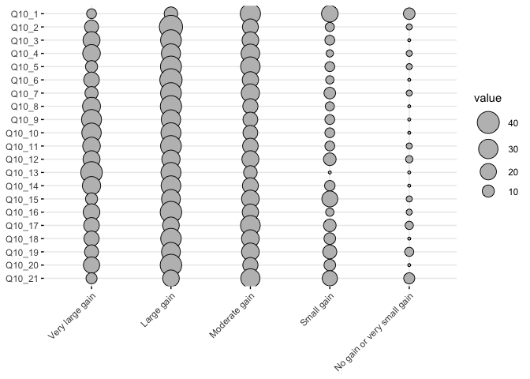
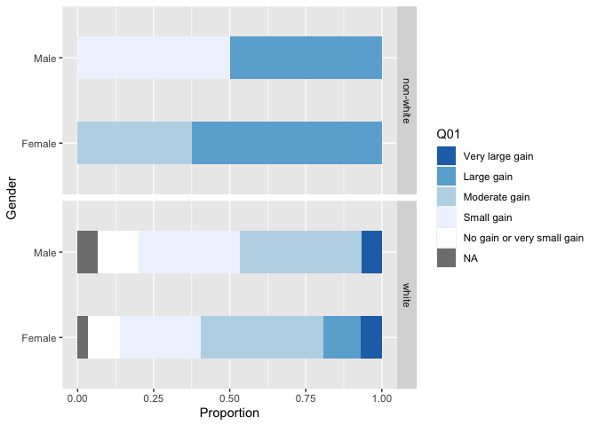
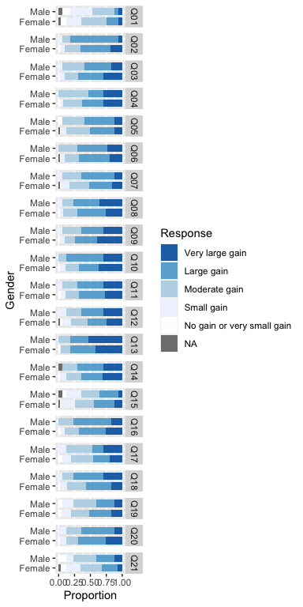
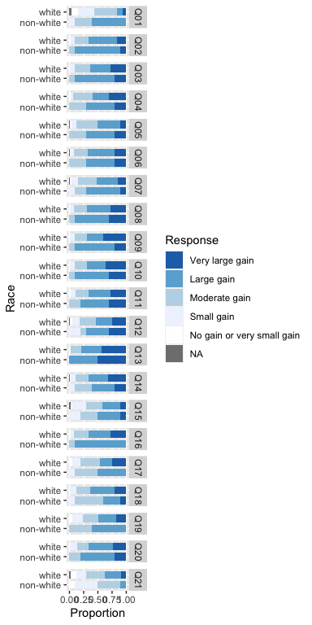
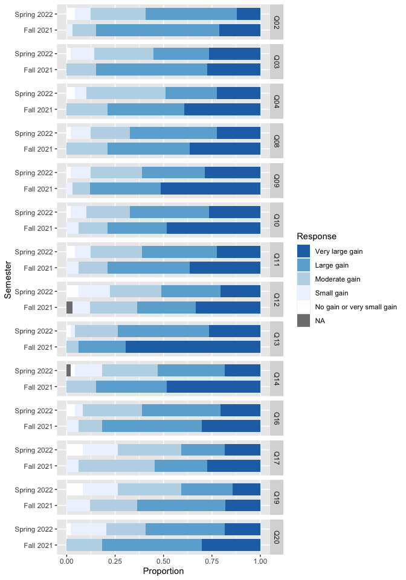
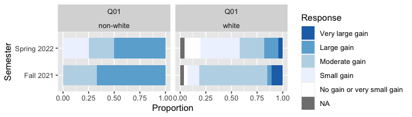
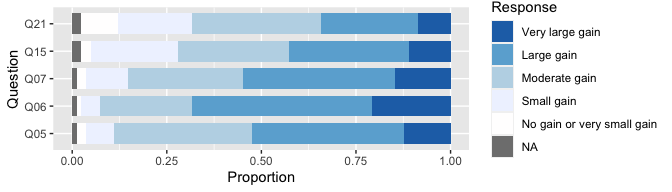
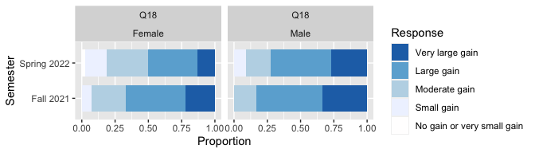
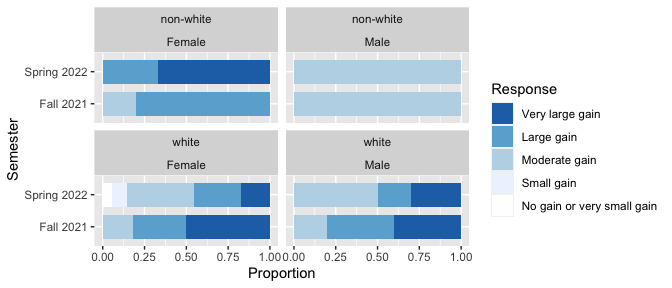

IMPORTANT NOTE

This Rmd uses the deidentified results and is safe to share.


## Loading Results

Loading in the results without instructor information. 
Note that because we want to analyze demographics for this question, we cannot look at instructor because that would lead to individuals being identifiable. 
We also need to be careful about looking at both gender and race at the same time.


```r
NoInstructor <- read_delim("Deidentified Surveys/NoInstructor.tsv", 
    delim = "\t", escape_double = FALSE, 
    trim_ws = TRUE)
```

```
## Rows: 85 Columns: 156
## ── Column specification ────────────────────────────────────────────────────────
## Delimiter: "\t"
## chr (146): ResponseId_pre, Semester_pre, Q1_pre, Q8_pre, Q9_1_pre, Q9_2_pre,...
## dbl  (10): Q19_1_pre, Q19_2_pre, Q19_3_pre, Q19_4_pre, Q19_5_pre, Q19_6_pre,...
## 
## ℹ Use `spec()` to retrieve the full column specification for this data.
## ℹ Specify the column types or set `show_col_types = FALSE` to quiet this message.
```

```r
NoInstructorQuestions <- read_delim("Deidentified Surveys/NoInstructorQuestions.tsv", 
    delim = "\t", escape_double = FALSE, 
    trim_ws = TRUE)
```

```
## Rows: 156 Columns: 2
## ── Column specification ────────────────────────────────────────────────────────
## Delimiter: "\t"
## chr (2): value, Question
## 
## ℹ Use `spec()` to retrieve the full column specification for this data.
## ℹ Specify the column types or set `show_col_types = FALSE` to quiet this message.
```

## Benefits of research experience

This question (post-survey question 10) was only in the post-survey.
I am going to try to keep the demographics for this analysis later.

Note that pre-survey question 10 matched with post-survey question 9, while pre-survey question 11 matched with post-survey question 13. Post-survey question 10 was not matched with a pre-survey question.


```r
PostQ10 <- NoInstructor %>%
  select(Semester_pre, ends_with("_post")) %>%
  select(Semester = Semester_pre, Gender = Q2_post, Ethnicity = Q3_post, starts_with("Q10"))

Q10Text <- NoInstructorQuestions %>%
  filter(startsWith(value, "Q10")) %>%
  filter(endsWith(value, "_post"))
Q10Text$Question[01]
```

```
## [1] "In this section of the survey you will be asked to consider a variety of possible benefits you may have gained from your research experience. If for any reason you prefer not to answer, or consider the question irrelevant to you, please choose the \"\"Not applicable / Prefer not to answer\"\" option - Clarification of a career path"
```

```r
Q10TextClean <- Q10Text %>%
  mutate(Question = str_remove(Q10Text$Question, "In this section of the survey you will be asked to consider a variety of possible benefits you may have gained from your research experience. If for any reason you prefer not to answer, or consider the question irrelevant to you, please choose the \"\"Not applicable / Prefer not to answer\"\" option - "))
Q10TextClean$Question
```

```
##  [1] "Clarification of a career path"                                      
##  [2] "Skill in the interpretation of results"                              
##  [3] "Tolerance for obstacles faced in the research process"               
##  [4] "Readiness for more demanding research"                               
##  [5] "Understanding how knowledge is constructed"                          
##  [6] "Understanding of the research process in your field"                 
##  [7] "Ability to integrate theory and practice"                            
##  [8] "Understanding of how scientists work on real problems"               
##  [9] "Understanding that scientific assertions require supporting evidence"
## [10] "Ability to analyze data and other information"                       
## [11] "Understanding science"                                               
## [12] "Learning ethical conduct in your field"                              
## [13] "Learning laboratory techniques"                                      
## [14] "Ability to read and understand primary literature"                   
## [15] "Skill in how to give an effective oral presentation"                 
## [16] "Skill in science writing"                                            
## [17] "Self-confidence"                                                     
## [18] "Understanding of how scientists think"                               
## [19] "Learning to work independently"                                      
## [20] "Becoming part of a learning community"                               
## [21] "Confidence in my potential to be a teacher of science"
```

Now to see the responses:


```r
head(PostQ10)
```

```
## # A tibble: 6 × 24
##   Semester  Gender Ethnicity      Q10_1_post    Q10_2_post Q10_3_post Q10_4_post
##   <chr>     <chr>  <chr>          <chr>         <chr>      <chr>      <chr>     
## 1 Fall 2021 Female White          Moderate gain Large gain Large gain Very larg…
## 2 Fall 2021 Female White          Very large g… Very larg… Very larg… Very larg…
## 3 Fall 2021 Female White          Small gain    Moderate … Moderate … Moderate …
## 4 Fall 2021 Female White          Moderate gain Very larg… Large gain Large gain
## 5 Fall 2021 Female Asian American Moderate gain Large gain Moderate … Large gain
## 6 Fall 2021 Female White          Moderate gain Large gain Moderate … Large gain
## # ℹ 17 more variables: Q10_5_post <chr>, Q10_6_post <chr>, Q10_7_post <chr>,
## #   Q10_8_post <chr>, Q10_9_post <chr>, Q10_10_post <chr>, Q10_11_post <chr>,
## #   Q10_12_post <chr>, Q10_13_post <chr>, Q10_14_post <chr>, Q10_15_post <chr>,
## #   Q10_16_post <chr>, Q10_17_post <chr>, Q10_18_post <chr>, Q10_19_post <chr>,
## #   Q10_20_post <chr>, Q10_21_post <chr>
```

```r
Q10Factors <- PostQ10 %>%
  select(starts_with("Q")) %>%
  mutate_all(funs(ordered(.,(levels = c("Very large gain", "Large gain", 
                                       "Moderate gain", "Small gain", 
                                       "No gain or very small gain"))))) 
```

```
## Warning: `funs()` was deprecated in dplyr 0.8.0.
## ℹ Please use a list of either functions or lambdas:
## 
## # Simple named list: list(mean = mean, median = median)
## 
## # Auto named with `tibble::lst()`: tibble::lst(mean, median)
## 
## # Using lambdas list(~ mean(., trim = .2), ~ median(., na.rm = TRUE))
## Call `lifecycle::last_lifecycle_warnings()` to see where this warning was
## generated.
```

```r
Q10Clean <- PostQ10 %>%
  select(-starts_with("Q")) %>%
  cbind(Q10Factors) %>%
  mutate(Gender = as.factor(Gender)) %>%
  mutate(Ethnicity = as.factor(Ethnicity))
summary(Q10Clean)
```

```
##    Semester                          Gender                       Ethnicity 
##  Length:85          Female              :66   Asian American           : 6  
##  Class :character   Male                :17   Black or African American: 1  
##  Mode  :character   Non-binary          : 1   Hispanic/Latino          : 2  
##                     Prefer not to answer: 1   Prefer not to answer     : 1  
##                                               Two or more races        : 3  
##                                               White                    :72  
##                       Q10_1_post                      Q10_2_post
##  Very large gain           : 6   Very large gain           :14  
##  Large gain                :13   Large gain                :45  
##  Moderate gain             :33   Moderate gain             :19  
##  Small gain                :21   Small gain                : 5  
##  No gain or very small gain: 9   No gain or very small gain: 2  
##  NA's                      : 3                                  
##                       Q10_3_post                      Q10_4_post
##  Very large gain           :22   Very large gain           :24  
##  Large gain                :35   Large gain                :29  
##  Moderate gain             :21   Moderate gain             :27  
##  Small gain                : 6   Small gain                : 3  
##  No gain or very small gain: 1   No gain or very small gain: 2  
##                                                                 
##                       Q10_5_post                      Q10_6_post
##  Very large gain           :10   Very large gain           :18  
##  Large gain                :36   Large gain                :41  
##  Moderate gain             :30   Moderate gain             :20  
##  Small gain                : 6   Small gain                : 4  
##  No gain or very small gain: 2   No gain or very small gain: 1  
##  NA's                      : 1   NA's                      : 1  
##                       Q10_7_post                      Q10_8_post
##  Very large gain           :12   Very large gain           :25  
##  Large gain                :35   Large gain                :37  
##  Moderate gain             :26   Moderate gain             :17  
##  Small gain                : 9   Small gain                : 5  
##  No gain or very small gain: 2   No gain or very small gain: 1  
##  NA's                      : 1                                  
##                       Q10_9_post                     Q10_10_post
##  Very large gain           :32   Very large gain           :30  
##  Large gain                :30   Large gain                :32  
##  Moderate gain             :16   Moderate gain             :16  
##  Small gain                : 6   Small gain                : 6  
##  No gain or very small gain: 1   No gain or very small gain: 1  
##                                                                 
##                      Q10_11_post                     Q10_12_post
##  Very large gain           :24   Very large gain           :22  
##  Large gain                :35   Large gain                :26  
##  Moderate gain             :18   Moderate gain             :22  
##  Small gain                : 6   Small gain                :11  
##  No gain or very small gain: 2   No gain or very small gain: 3  
##                                  NA's                      : 1  
##                      Q10_13_post                     Q10_14_post
##  Very large gain           :38   Very large gain           :26  
##  Large gain                :32   Large gain                :31  
##  Moderate gain             :13   Moderate gain             :19  
##  Small gain                : 1   Small gain                : 7  
##  No gain or very small gain: 1   No gain or very small gain: 1  
##                                  NA's                      : 1  
##                      Q10_15_post                     Q10_16_post
##  Very large gain           :10   Very large gain           :21  
##  Large gain                :28   Large gain                :38  
##  Moderate gain             :24   Moderate gain             :20  
##  Small gain                :19   Small gain                : 4  
##  No gain or very small gain: 2   No gain or very small gain: 2  
##  NA's                      : 2                                  
##                      Q10_17_post                     Q10_18_post
##  Very large gain           :18   Very large gain           :17  
##  Large gain                :21   Large gain                :34  
##  Moderate gain             :31   Moderate gain             :24  
##  Small gain                :11   Small gain                : 9  
##  No gain or very small gain: 4   No gain or very small gain: 1  
##                                                                 
##                      Q10_19_post                     Q10_20_post
##  Very large gain           :14   Very large gain           :20  
##  Large gain                :28   Large gain                :38  
##  Moderate gain             :24   Moderate gain             :17  
##  Small gain                :14   Small gain                : 9  
##  No gain or very small gain: 5   No gain or very small gain: 1  
##                                                                 
##                      Q10_21_post
##  Very large gain           : 8  
##  Large gain                :21  
##  Moderate gain             :29  
##  Small gain                :17  
##  No gain or very small gain: 8  
##  NA's                      : 2
```


```r
dataQ10 <- as.data.frame(table(Q10Clean$Q10_1_post)) %>%
  full_join(as.data.frame(table(Q10Clean$Q10_2_post)), by = "Var1") %>% 
  full_join(as.data.frame(table(Q10Clean$Q10_3_post)), by = "Var1") %>%
  full_join(as.data.frame(table(Q10Clean$Q10_4_post)), by = "Var1") %>%
  full_join(as.data.frame(table(Q10Clean$Q10_5_post)), by = "Var1") %>%
  full_join(as.data.frame(table(Q10Clean$Q10_6_post)), by = "Var1") %>%
  full_join(as.data.frame(table(Q10Clean$Q10_7_post)), by = "Var1") %>%
  full_join(as.data.frame(table(Q10Clean$Q10_8_post)), by = "Var1") %>%
  full_join(as.data.frame(table(Q10Clean$Q10_9_post)), by = "Var1") %>%
  full_join(as.data.frame(table(Q10Clean$Q10_10_post)), by = "Var1") %>%
  full_join(as.data.frame(table(Q10Clean$Q10_11_post)), by = "Var1") %>%
  full_join(as.data.frame(table(Q10Clean$Q10_12_post)), by = "Var1") %>%
  full_join(as.data.frame(table(Q10Clean$Q10_13_post)), by = "Var1") %>%
  full_join(as.data.frame(table(Q10Clean$Q10_14_post)), by = "Var1") %>%
  full_join(as.data.frame(table(Q10Clean$Q10_15_post)), by = "Var1") %>%
  full_join(as.data.frame(table(Q10Clean$Q10_16_post)), by = "Var1") %>%
  full_join(as.data.frame(table(Q10Clean$Q10_17_post)), by = "Var1") %>%
  full_join(as.data.frame(table(Q10Clean$Q10_18_post)), by = "Var1") %>%
  full_join(as.data.frame(table(Q10Clean$Q10_19_post)), by = "Var1") %>%
  full_join(as.data.frame(table(Q10Clean$Q10_20_post)), by = "Var1") %>%
  full_join(as.data.frame(table(Q10Clean$Q10_21_post)), by = "Var1") 

names(dataQ10) <- c("Var1", names(Q10Clean)[4:24])
names(dataQ10) <- gsub("_post", "", names(dataQ10))
rownames(dataQ10) <- dataQ10$Var1
dataQ10 <- dataQ10 %>%
  select(-Var1)

ggballoonplot(t(dataQ10))
```

<!-- -->

```r
print("In this section of the survey you will be asked to consider a variety of possible benefits you may have gained from your research experience. If for any reason you prefer not to answer, or consider the question irrelevant to you, please choose the Not applicable / Prefer not to answer option - ")
```

```
## [1] "In this section of the survey you will be asked to consider a variety of possible benefits you may have gained from your research experience. If for any reason you prefer not to answer, or consider the question irrelevant to you, please choose the Not applicable / Prefer not to answer option - "
```

```r
print(Q10TextClean)
```

```
## # A tibble: 21 × 2
##    value       Question                                                         
##    <chr>       <chr>                                                            
##  1 Q10_1_post  Clarification of a career path                                   
##  2 Q10_2_post  Skill in the interpretation of results                           
##  3 Q10_3_post  Tolerance for obstacles faced in the research process            
##  4 Q10_4_post  Readiness for more demanding research                            
##  5 Q10_5_post  Understanding how knowledge is constructed                       
##  6 Q10_6_post  Understanding of the research process in your field              
##  7 Q10_7_post  Ability to integrate theory and practice                         
##  8 Q10_8_post  Understanding of how scientists work on real problems            
##  9 Q10_9_post  Understanding that scientific assertions require supporting evid…
## 10 Q10_10_post Ability to analyze data and other information                    
## # ℹ 11 more rows
```

## Cleaning Demographics 


```r
Q10 <- Q10Clean 
names(Q10) <- gsub("Q10_", "Q", names(Q10))
names(Q10) <- gsub("_post", "", names(Q10))
# Remove two individuals to avoid identification
Q10_demo <- Q10 %>%
  filter(Gender %in% c("Male", "Female")) 
Q10_demo <- Q10_demo %>%
  filter(Ethnicity != "Prefer not to answer") %>% 
  mutate(Race = recode(Ethnicity, "White" = "white", .default = "non-white")) %>%
  select(-Ethnicity) %>%
  rename(Q01=Q1, Q02=Q2, Q03=Q3, Q04=Q4, Q05=Q5, Q06=Q6, Q07=Q7, Q08=Q8, Q09=Q9)
```

## Bar plots


```r
ggplot(Q10_demo) +
  geom_bar(aes(x = Gender, fill = Q01), position = 'fill', width = 0.5, na.rm = TRUE) +
  facet_grid(Q10_demo$Race) +
  coord_flip() +
  ylab('Proportion') +
  xlab('Gender') +
  fill_palette(c("#2171b5","#6baed6","#bdd7e7","#eff3ff","#FFFEFE")) +
  scale_x_discrete(na.translate = FALSE) +
  theme_gray()
```

<!-- -->

Because of the small numbers, we will not look at each question by both Gender and Race.

Instead I will prepare the data to look at all of the questions at once.


```r
Q10_demo_long <- Q10_demo %>% 
  pivot_longer(cols = `Q01`:`Q21`, 
               names_to = "Question", 
               values_to = "Response")
```


```r
ggplot(Q10_demo_long) +
  geom_bar(aes(x = Gender, fill = Response), position = 'fill', width = 0.75) +
  facet_grid(as.factor(Q10_demo_long$Question)) +
  coord_flip() +
  ylab('Proportion') +
  xlab('Gender') +
  fill_palette(c("#2171b5","#6baed6","#bdd7e7","#eff3ff","#FFFEFE")) +
  scale_x_discrete(na.translate = FALSE) +
  theme_gray()
```

<!-- -->


```r
ggplot(Q10_demo_long) +
  geom_bar(aes(x = Race, fill = Response), position = 'fill', width = 0.75) +
  facet_grid(as.factor(Q10_demo_long$Question)) +
  coord_flip() +
  ylab('Proportion') +
  xlab('Race') +
  fill_palette(c("#2171b5","#6baed6","#bdd7e7","#eff3ff","#FFFEFE")) +
  scale_x_discrete(na.translate = FALSE) +
  theme_gray()
```

<!-- -->

## Statistical models

For each question, testing whether gender or race were significant.
I am also including semester because we expect students who have had a prior semester of the new Biology core to also have had some influence on their responses.

Note that the dependent variable in the model is calculated as "5-as.numeric(Response)" because the responses range from 1=Very large gain to 5=No gain or very small gain. 
This converts the response variable into a numeric value from 0 to 4 with a positive estimate meaning an improvement in the response on the qualitative scale.


```r
print(Q10TextClean$Question[01])
```

```
## [1] "Clarification of a career path"
```

```r
Q01_select <- Q10_demo_long %>%
  filter(Question == "Q01") %>%
  na.omit() 
Q01_model <- glm(data = Q01_select, 
                 5-as.numeric(Response) ~ Semester + Gender * Race) %>%
  stepAIC(direction = "backward")
```

```
## Start:  AIC=228.51
## 5 - as.numeric(Response) ~ Semester + Gender * Race
## 
##               Df Deviance    AIC
## - Gender:Race  1   71.838 226.68
## <none>             71.678 228.51
## - Semester     1   76.757 231.92
## 
## Step:  AIC=226.68
## 5 - as.numeric(Response) ~ Semester + Gender + Race
## 
##            Df Deviance    AIC
## - Gender    1   72.720 225.65
## <none>          71.838 226.68
## - Race      1   75.526 228.64
## - Semester  1   76.922 230.09
## 
## Step:  AIC=225.65
## 5 - as.numeric(Response) ~ Semester + Race
## 
##            Df Deviance    AIC
## <none>          72.720 225.65
## - Race      1   76.364 227.51
## - Semester  1   78.268 229.46
```

```r
summary(Q01_model)
```

```
## 
## Call:
## glm(formula = 5 - as.numeric(Response) ~ Semester + Race, data = Q01_select)
## 
## Deviance Residuals: 
##      Min        1Q    Median        3Q       Max  
## -2.06497  -0.51885  -0.06497   0.48115   2.48115  
## 
## Coefficients:
##                     Estimate Std. Error t value Pr(>|t|)    
## (Intercept)           2.7184     0.3224   8.433 1.63e-12 ***
## SemesterSpring 2022  -0.5461     0.2268  -2.408   0.0185 *  
## Racewhite            -0.6535     0.3348  -1.952   0.0547 .  
## ---
## Signif. codes:  0 '***' 0.001 '**' 0.01 '*' 0.05 '.' 0.1 ' ' 1
## 
## (Dispersion parameter for gaussian family taken to be 0.9568401)
## 
##     Null deviance: 83.519  on 78  degrees of freedom
## Residual deviance: 72.720  on 76  degrees of freedom
## AIC: 225.65
## 
## Number of Fisher Scoring iterations: 2
```


```r
print(Q10TextClean$Question[02])
```

```
## [1] "Skill in the interpretation of results"
```

```r
Q02_select <- Q10_demo_long %>%
  filter(Question == "Q02") %>%
  na.omit() 
Q02_model <- glm(data = Q02_select, 
                 5-as.numeric(Response) ~ Semester + Gender * Race) %>%
  stepAIC(direction = "backward")
```

```
## Start:  AIC=217.09
## 5 - as.numeric(Response) ~ Semester + Gender * Race
## 
##               Df Deviance    AIC
## - Gender:Race  1   58.559 215.10
## <none>             58.550 217.09
## - Semester     1   62.716 220.72
## 
## Step:  AIC=215.1
## 5 - as.numeric(Response) ~ Semester + Gender + Race
## 
##            Df Deviance    AIC
## - Gender    1   58.789 213.42
## - Race      1   58.862 213.52
## <none>          58.559 215.10
## - Semester  1   62.735 218.75
## 
## Step:  AIC=213.42
## 5 - as.numeric(Response) ~ Semester + Race
## 
##            Df Deviance    AIC
## - Race      1   59.092 211.84
## <none>          58.789 213.42
## - Semester  1   62.875 216.93
## 
## Step:  AIC=211.84
## 5 - as.numeric(Response) ~ Semester
## 
##            Df Deviance    AIC
## <none>          59.092 211.84
## - Semester  1   63.622 215.90
```

```r
summary(Q02_model)
```

```
## 
## Call:
## glm(formula = 5 - as.numeric(Response) ~ Semester, data = Q02_select)
## 
## Deviance Residuals: 
##     Min       1Q   Median       3Q      Max  
## -2.5510  -0.5510  -0.0303   0.4490   1.4490  
## 
## Coefficients:
##                     Estimate Std. Error t value Pr(>|t|)    
## (Intercept)           3.0303     0.1496  20.255   <2e-16 ***
## SemesterSpring 2022  -0.4793     0.1935  -2.476   0.0154 *  
## ---
## Signif. codes:  0 '***' 0.001 '**' 0.01 '*' 0.05 '.' 0.1 ' ' 1
## 
## (Dispersion parameter for gaussian family taken to be 0.7386518)
## 
##     Null deviance: 63.622  on 81  degrees of freedom
## Residual deviance: 59.092  on 80  degrees of freedom
## AIC: 211.84
## 
## Number of Fisher Scoring iterations: 2
```


```r
print(Q10TextClean$Question[03])
```

```
## [1] "Tolerance for obstacles faced in the research process"
```

```r
Q03_select <- Q10_demo_long %>%
  filter(Question == "Q03") %>%
  na.omit() 
Q03_model <- glm(data = Q03_select, 
                 5-as.numeric(Response) ~ Semester + Gender * Race) %>%
  stepAIC(direction = "backward")
```

```
## Start:  AIC=229.37
## 5 - as.numeric(Response) ~ Semester + Gender * Race
## 
##               Df Deviance    AIC
## - Gender:Race  1   68.024 227.38
## <none>             68.014 229.37
## - Semester     1   71.787 231.80
## 
## Step:  AIC=227.38
## 5 - as.numeric(Response) ~ Semester + Gender + Race
## 
##            Df Deviance    AIC
## - Gender    1   68.296 225.71
## - Race      1   68.345 225.77
## <none>          68.024 227.38
## - Semester  1   71.791 229.80
## 
## Step:  AIC=225.71
## 5 - as.numeric(Response) ~ Semester + Race
## 
##            Df Deviance    AIC
## - Race      1   68.617 224.09
## <none>          68.296 225.71
## - Semester  1   72.178 228.24
## 
## Step:  AIC=224.1
## 5 - as.numeric(Response) ~ Semester
## 
##            Df Deviance    AIC
## <none>          68.617 224.09
## - Semester  1   72.939 227.10
```

```r
summary(Q03_model)
```

```
## 
## Call:
## glm(formula = 5 - as.numeric(Response) ~ Semester, data = Q03_select)
## 
## Deviance Residuals: 
##     Min       1Q   Median       3Q      Max  
## -2.6531  -0.6531  -0.1212   0.8788   1.3469  
## 
## Coefficients:
##                     Estimate Std. Error t value Pr(>|t|)    
## (Intercept)           3.1212     0.1612  19.360   <2e-16 ***
## SemesterSpring 2022  -0.4682     0.2086  -2.245   0.0275 *  
## ---
## Signif. codes:  0 '***' 0.001 '**' 0.01 '*' 0.05 '.' 0.1 ' ' 1
## 
## (Dispersion parameter for gaussian family taken to be 0.8577149)
## 
##     Null deviance: 72.939  on 81  degrees of freedom
## Residual deviance: 68.617  on 80  degrees of freedom
## AIC: 224.1
## 
## Number of Fisher Scoring iterations: 2
```

```r
Q03_select %>% group_by(Response) %>% tally()
```

```
## # A tibble: 5 × 2
##   Response                       n
##   <ord>                      <int>
## 1 Very large gain               22
## 2 Large gain                    33
## 3 Moderate gain                 20
## 4 Small gain                     6
## 5 No gain or very small gain     1
```


```r
print(Q10TextClean$Question[04])
```

```
## [1] "Readiness for more demanding research"
```

```r
Q04_select <- Q10_demo_long %>%
  filter(Question == "Q04") %>%
  na.omit() 
Q04_model <- glm(data = Q04_select, 
                 5-as.numeric(Response) ~ Semester + Gender * Race) %>%
  stepAIC(direction = "backward")
```

```
## Start:  AIC=230.18
## 5 - as.numeric(Response) ~ Semester + Gender * Race
## 
##               Df Deviance    AIC
## <none>             68.689 230.18
## - Gender:Race  1   70.864 230.74
## - Semester     1   75.843 236.31
```

```r
summary(Q04_model)
```

```
## 
## Call:
## glm(formula = 5 - as.numeric(Response) ~ Semester + Gender * 
##     Race, data = Q04_select)
## 
## Deviance Residuals: 
##     Min       1Q   Median       3Q      Max  
## -2.5364  -0.5364  -0.1466   0.8534   1.4636  
## 
## Coefficients:
##                      Estimate Std. Error t value Pr(>|t|)    
## (Intercept)            3.3538     0.3436   9.762 4.12e-15 ***
## SemesterSpring 2022   -0.6102     0.2155  -2.832   0.0059 ** 
## GenderMale            -1.0487     0.7472  -1.404   0.1645    
## Racewhite             -0.2072     0.3603  -0.575   0.5669    
## GenderMale:Racewhite   1.2422     0.7956   1.561   0.1225    
## ---
## Signif. codes:  0 '***' 0.001 '**' 0.01 '*' 0.05 '.' 0.1 ' ' 1
## 
## (Dispersion parameter for gaussian family taken to be 0.8920589)
## 
##     Null deviance: 78.256  on 81  degrees of freedom
## Residual deviance: 68.689  on 77  degrees of freedom
## AIC: 230.18
## 
## Number of Fisher Scoring iterations: 2
```


```r
print(Q10TextClean$Question[05])
```

```
## [1] "Understanding how knowledge is constructed"
```

```r
Q05_select <- Q10_demo_long %>%
  filter(Question == "Q05") %>%
  na.omit() 
Q05_model <- glm(data = Q05_select, 
                 5-as.numeric(Response) ~ Semester + Gender * Race) %>%
  stepAIC(direction = "backward")
```

```
## Start:  AIC=219.64
## 5 - as.numeric(Response) ~ Semester + Gender * Race
## 
##               Df Deviance    AIC
## - Semester     1   61.939 218.14
## - Gender:Race  1   62.148 218.41
## <none>             61.563 219.64
## 
## Step:  AIC=218.14
## 5 - as.numeric(Response) ~ Gender + Race + Gender:Race
## 
##               Df Deviance    AIC
## - Gender:Race  1   62.541 216.92
## <none>             61.939 218.14
## 
## Step:  AIC=216.92
## 5 - as.numeric(Response) ~ Gender + Race
## 
##          Df Deviance    AIC
## - Gender  1   62.618 215.02
## - Race    1   64.102 216.92
## <none>        62.541 216.92
## 
## Step:  AIC=215.02
## 5 - as.numeric(Response) ~ Race
## 
##        Df Deviance    AIC
## - Race  1   64.173 215.01
## <none>      62.618 215.02
## 
## Step:  AIC=215.01
## 5 - as.numeric(Response) ~ 1
```

```r
summary(Q05_model)
```

```
## 
## Call:
## glm(formula = 5 - as.numeric(Response) ~ 1, data = Q05_select)
## 
## Deviance Residuals: 
##     Min       1Q   Median       3Q      Max  
## -2.5309  -0.5309   0.4691   0.4691   1.4691  
## 
## Coefficients:
##             Estimate Std. Error t value Pr(>|t|)    
## (Intercept)  2.53086    0.09951   25.43   <2e-16 ***
## ---
## Signif. codes:  0 '***' 0.001 '**' 0.01 '*' 0.05 '.' 0.1 ' ' 1
## 
## (Dispersion parameter for gaussian family taken to be 0.8021605)
## 
##     Null deviance: 64.173  on 80  degrees of freedom
## Residual deviance: 64.173  on 80  degrees of freedom
## AIC: 215.01
## 
## Number of Fisher Scoring iterations: 2
```


```r
print(Q10TextClean$Question[06])
```

```
## [1] "Understanding of the research process in your field"
```

```r
Q06_select <- Q10_demo_long %>%
  filter(Question == "Q06") %>%
  na.omit() 
Q06_model <- glm(data = Q06_select, 
                 5-as.numeric(Response) ~ Semester + Gender * Race) %>%
  stepAIC(direction = "backward")
```

```
## Start:  AIC=215.46
## 5 - as.numeric(Response) ~ Semester + Gender * Race
## 
##               Df Deviance    AIC
## - Semester     1   58.482 213.48
## - Gender:Race  1   59.214 214.49
## <none>             58.463 215.46
## 
## Step:  AIC=213.48
## 5 - as.numeric(Response) ~ Gender + Race + Gender:Race
## 
##               Df Deviance    AIC
## - Gender:Race  1   59.238 212.52
## <none>             58.482 213.48
## 
## Step:  AIC=212.52
## 5 - as.numeric(Response) ~ Gender + Race
## 
##          Df Deviance    AIC
## - Race    1   59.301 210.61
## - Gender  1   59.520 210.91
## <none>        59.238 212.52
## 
## Step:  AIC=210.61
## 5 - as.numeric(Response) ~ Gender
## 
##          Df Deviance    AIC
## - Gender  1   59.580 208.99
## <none>        59.301 210.61
## 
## Step:  AIC=208.99
## 5 - as.numeric(Response) ~ 1
```

```r
summary(Q06_model)
```

```
## 
## Call:
## glm(formula = 5 - as.numeric(Response) ~ 1, data = Q06_select)
## 
## Deviance Residuals: 
##     Min       1Q   Median       3Q      Max  
## -2.8272  -0.8272   0.1728   0.1728   1.1728  
## 
## Coefficients:
##             Estimate Std. Error t value Pr(>|t|)    
## (Intercept)  2.82716    0.09589   29.48   <2e-16 ***
## ---
## Signif. codes:  0 '***' 0.001 '**' 0.01 '*' 0.05 '.' 0.1 ' ' 1
## 
## (Dispersion parameter for gaussian family taken to be 0.7447531)
## 
##     Null deviance: 59.58  on 80  degrees of freedom
## Residual deviance: 59.58  on 80  degrees of freedom
## AIC: 208.99
## 
## Number of Fisher Scoring iterations: 2
```


```r
print(Q10TextClean$Question[07])
```

```
## [1] "Ability to integrate theory and practice"
```

```r
Q07_select <- Q10_demo_long %>%
  filter(Question == "Q07") %>%
  na.omit() 
Q07_model <- glm(data = Q07_select, 
                 5-as.numeric(Response) ~ Semester + Gender * Race) %>%
  stepAIC(direction = "backward")
```

```
## Start:  AIC=233.09
## 5 - as.numeric(Response) ~ Semester + Gender * Race
## 
##               Df Deviance    AIC
## - Semester     1   72.862 231.29
## - Gender:Race  1   73.049 231.50
## <none>             72.679 233.09
## 
## Step:  AIC=231.29
## 5 - as.numeric(Response) ~ Gender + Race + Gender:Race
## 
##               Df Deviance    AIC
## - Gender:Race  1   73.242 229.71
## <none>             72.862 231.29
## 
## Step:  AIC=229.71
## 5 - as.numeric(Response) ~ Gender + Race
## 
##          Df Deviance    AIC
## - Race    1   73.529 228.03
## - Gender  1   73.818 228.35
## <none>        73.242 229.71
## 
## Step:  AIC=228.03
## 5 - as.numeric(Response) ~ Gender
## 
##          Df Deviance    AIC
## - Gender  1   74.099 226.66
## <none>        73.529 228.03
## 
## Step:  AIC=226.65
## 5 - as.numeric(Response) ~ 1
```

```r
summary(Q07_model)
```

```
## 
## Call:
## glm(formula = 5 - as.numeric(Response) ~ 1, data = Q07_select)
## 
## Deviance Residuals: 
##     Min       1Q   Median       3Q      Max  
## -2.5432  -0.5432   0.4568   0.4568   1.4568  
## 
## Coefficients:
##             Estimate Std. Error t value Pr(>|t|)    
## (Intercept)   2.5432     0.1069   23.78   <2e-16 ***
## ---
## Signif. codes:  0 '***' 0.001 '**' 0.01 '*' 0.05 '.' 0.1 ' ' 1
## 
## (Dispersion parameter for gaussian family taken to be 0.9262346)
## 
##     Null deviance: 74.099  on 80  degrees of freedom
## Residual deviance: 74.099  on 80  degrees of freedom
## AIC: 226.65
## 
## Number of Fisher Scoring iterations: 2
```


```r
print(Q10TextClean$Question[08])
```

```
## [1] "Understanding of how scientists work on real problems"
```

```r
Q08_select <- Q10_demo_long %>%
  filter(Question == "Q08") %>%
  na.omit() 
Q08_model <- glm(data = Q08_select, 
                 5-as.numeric(Response) ~ Semester + Gender * Race) %>%
  stepAIC(direction = "backward")
```

```
## Start:  AIC=223.02
## 5 - as.numeric(Response) ~ Semester + Gender * Race
## 
##               Df Deviance    AIC
## - Gender:Race  1   64.228 222.68
## <none>             62.945 223.02
## - Semester     1   65.811 224.67
## 
## Step:  AIC=222.68
## 5 - as.numeric(Response) ~ Semester + Gender + Race
## 
##            Df Deviance    AIC
## - Race      1   64.727 221.31
## - Gender    1   64.804 221.41
## <none>          64.228 222.68
## - Semester  1   67.020 224.16
## 
## Step:  AIC=221.31
## 5 - as.numeric(Response) ~ Semester + Gender
## 
##            Df Deviance    AIC
## - Gender    1   65.304 220.04
## <none>          64.727 221.31
## - Semester  1   67.957 223.30
## 
## Step:  AIC=220.04
## 5 - as.numeric(Response) ~ Semester
## 
##            Df Deviance    AIC
## <none>          65.304 220.04
## - Semester  1   68.402 221.84
```

```r
summary(Q08_model)
```

```
## 
## Call:
## glm(formula = 5 - as.numeric(Response) ~ Semester, data = Q08_select)
## 
## Deviance Residuals: 
##     Min       1Q   Median       3Q      Max  
## -2.7551  -0.7551   0.2449   0.8485   1.2449  
## 
## Coefficients:
##                     Estimate Std. Error t value Pr(>|t|)    
## (Intercept)           3.1515     0.1573  20.038   <2e-16 ***
## SemesterSpring 2022  -0.3964     0.2035  -1.948   0.0549 .  
## ---
## Signif. codes:  0 '***' 0.001 '**' 0.01 '*' 0.05 '.' 0.1 ' ' 1
## 
## (Dispersion parameter for gaussian family taken to be 0.8162956)
## 
##     Null deviance: 68.402  on 81  degrees of freedom
## Residual deviance: 65.304  on 80  degrees of freedom
## AIC: 220.04
## 
## Number of Fisher Scoring iterations: 2
```


```r
print(Q10TextClean$Question[09])
```

```
## [1] "Understanding that scientific assertions require supporting evidence"
```

```r
Q09_select <- Q10_demo_long %>%
  filter(Question == "Q09") %>%
  na.omit() 
Q09_model <- glm(data = Q09_select, 
                 5-as.numeric(Response) ~ Semester + Gender * Race) %>%
  stepAIC(direction = "backward")
```

```
## Start:  AIC=233.99
## 5 - as.numeric(Response) ~ Semester + Gender * Race
## 
##               Df Deviance    AIC
## - Gender:Race  1   72.528 232.64
## <none>             71.951 233.99
## - Semester     1   78.933 239.58
## 
## Step:  AIC=232.64
## 5 - as.numeric(Response) ~ Semester + Gender + Race
## 
##            Df Deviance    AIC
## - Race      1   72.533 230.65
## - Gender    1   72.693 230.83
## <none>          72.528 232.64
## - Semester  1   79.592 238.26
## 
## Step:  AIC=230.65
## 5 - as.numeric(Response) ~ Semester + Gender
## 
##            Df Deviance    AIC
## - Gender    1   72.698 228.83
## <none>          72.533 230.65
## - Semester  1   79.703 236.38
## 
## Step:  AIC=228.83
## 5 - as.numeric(Response) ~ Semester
## 
##            Df Deviance    AIC
## <none>          72.698 228.83
## - Semester  1   80.000 234.68
```

```r
summary(Q09_model)
```

```
## 
## Call:
## glm(formula = 5 - as.numeric(Response) ~ Semester, data = Q09_select)
## 
## Deviance Residuals: 
##     Min       1Q   Median       3Q      Max  
## -2.7551  -0.7551   0.2449   0.6364   1.2449  
## 
## Coefficients:
##                     Estimate Std. Error t value Pr(>|t|)    
## (Intercept)           3.3636     0.1659  20.270   <2e-16 ***
## SemesterSpring 2022  -0.6085     0.2147  -2.835   0.0058 ** 
## ---
## Signif. codes:  0 '***' 0.001 '**' 0.01 '*' 0.05 '.' 0.1 ' ' 1
## 
## (Dispersion parameter for gaussian family taken to be 0.9087199)
## 
##     Null deviance: 80.000  on 81  degrees of freedom
## Residual deviance: 72.698  on 80  degrees of freedom
## AIC: 228.83
## 
## Number of Fisher Scoring iterations: 2
```


```r
print(Q10TextClean$Question[10])
```

```
## [1] "Ability to analyze data and other information"
```

```r
Q10_select <- Q10_demo_long %>%
  filter(Question == "Q10") %>%
  na.omit() 
Q10_model <- glm(data = Q10_select, 
                 5-as.numeric(Response) ~ Semester + Gender * Race) %>%
  stepAIC(direction = "backward")
```

```
## Start:  AIC=235.34
## 5 - as.numeric(Response) ~ Semester + Gender * Race
## 
##               Df Deviance    AIC
## - Gender:Race  1   73.569 233.81
## <none>             73.151 235.34
## - Semester     1   76.040 236.52
## 
## Step:  AIC=233.81
## 5 - as.numeric(Response) ~ Semester + Gender + Race
## 
##            Df Deviance    AIC
## - Race      1   73.817 232.09
## - Gender    1   74.613 232.97
## <none>          73.569 233.81
## - Semester  1   76.503 235.02
## 
## Step:  AIC=232.09
## 5 - as.numeric(Response) ~ Semester + Gender
## 
##            Df Deviance    AIC
## - Gender    1   74.862 231.24
## <none>          73.817 232.09
## - Semester  1   77.086 233.64
## 
## Step:  AIC=231.24
## 5 - as.numeric(Response) ~ Semester
## 
##            Df Deviance    AIC
## <none>          74.862 231.24
## - Semester  1   77.951 232.55
```

```r
summary(Q10_model)
```

```
## 
## Call:
## glm(formula = 5 - as.numeric(Response) ~ Semester, data = Q10_select)
## 
## Deviance Residuals: 
##     Min       1Q   Median       3Q      Max  
## -2.8163  -0.8163   0.1837   0.7879   1.1837  
## 
## Coefficients:
##                     Estimate Std. Error t value Pr(>|t|)    
## (Intercept)           3.2121     0.1684  19.075   <2e-16 ***
## SemesterSpring 2022  -0.3958     0.2178  -1.817    0.073 .  
## ---
## Signif. codes:  0 '***' 0.001 '**' 0.01 '*' 0.05 '.' 0.1 ' ' 1
## 
## (Dispersion parameter for gaussian family taken to be 0.9357761)
## 
##     Null deviance: 77.951  on 81  degrees of freedom
## Residual deviance: 74.862  on 80  degrees of freedom
## AIC: 231.24
## 
## Number of Fisher Scoring iterations: 2
```


```r
print(Q10TextClean$Question[11])
```

```
## [1] "Understanding science"
```

```r
Q11_select <- Q10_demo_long %>%
  filter(Question == "Q11") %>%
  na.omit() 
Q11_model <- glm(data = Q11_select, 
                 5-as.numeric(Response) ~ Semester + Gender * Race) %>%
  stepAIC(direction = "backward")
```

```
## Start:  AIC=239.27
## 5 - as.numeric(Response) ~ Semester + Gender * Race
## 
##               Df Deviance    AIC
## - Gender:Race  1   76.831 237.37
## <none>             76.737 239.27
## - Semester     1   79.843 240.52
## 
## Step:  AIC=237.37
## 5 - as.numeric(Response) ~ Semester + Gender + Race
## 
##            Df Deviance    AIC
## - Gender    1   77.142 235.70
## - Race      1   77.191 235.75
## <none>          76.831 237.37
## - Semester  1   79.959 238.64
## 
## Step:  AIC=235.7
## 5 - as.numeric(Response) ~ Semester + Race
## 
##            Df Deviance    AIC
## - Race      1   77.503 234.08
## <none>          77.142 235.70
## - Semester  1   80.178 236.86
## 
## Step:  AIC=234.08
## 5 - as.numeric(Response) ~ Semester
## 
##            Df Deviance    AIC
## <none>          77.503 234.08
## - Semester  1   80.939 235.64
```

```r
summary(Q11_model)
```

```
## 
## Call:
## glm(formula = 5 - as.numeric(Response) ~ Semester, data = Q11_select)
## 
## Deviance Residuals: 
##     Min       1Q   Median       3Q      Max  
## -2.6735  -0.6735   0.3265   0.9091   1.3265  
## 
## Coefficients:
##                     Estimate Std. Error t value Pr(>|t|)    
## (Intercept)           3.0909     0.1713  18.040   <2e-16 ***
## SemesterSpring 2022  -0.4174     0.2216  -1.883   0.0633 .  
## ---
## Signif. codes:  0 '***' 0.001 '**' 0.01 '*' 0.05 '.' 0.1 ' ' 1
## 
## (Dispersion parameter for gaussian family taken to be 0.9687848)
## 
##     Null deviance: 80.939  on 81  degrees of freedom
## Residual deviance: 77.503  on 80  degrees of freedom
## AIC: 234.08
## 
## Number of Fisher Scoring iterations: 2
```


```r
print(Q10TextClean$Question[12])
```

```
## [1] "Learning ethical conduct in your field"
```

```r
Q12_select <- Q10_demo_long %>%
  filter(Question == "Q12") %>%
  na.omit() 
Q12_model <- glm(data = Q12_select, 
                 5-as.numeric(Response) ~ Semester + Gender * Race) %>%
  stepAIC(direction = "backward")
```

```
## Start:  AIC=254.58
## 5 - as.numeric(Response) ~ Semester + Gender * Race
## 
##               Df Deviance    AIC
## - Gender:Race  1   95.529 253.23
## <none>             94.767 254.58
## - Semester     1   99.148 256.24
## 
## Step:  AIC=253.23
## 5 - as.numeric(Response) ~ Semester + Gender + Race
## 
##            Df Deviance    AIC
## - Race      1   95.614 251.30
## - Gender    1   96.635 252.16
## <none>          95.529 253.23
## - Semester  1   99.829 254.80
## 
## Step:  AIC=251.3
## 5 - as.numeric(Response) ~ Semester + Gender
## 
##            Df Deviance    AIC
## - Gender    1   96.719 250.23
## <none>          95.614 251.30
## - Semester  1  100.221 253.12
## 
## Step:  AIC=250.23
## 5 - as.numeric(Response) ~ Semester
## 
##            Df Deviance    AIC
## <none>          96.719 250.23
## - Semester  1  101.136 251.85
```

```r
summary(Q12_model)
```

```
## 
## Call:
## glm(formula = 5 - as.numeric(Response) ~ Semester, data = Q12_select)
## 
## Deviance Residuals: 
##      Min        1Q    Median        3Q       Max  
## -2.42857  -0.90625   0.09375   1.09375   1.57143  
## 
## Coefficients:
##                     Estimate Std. Error t value Pr(>|t|)    
## (Intercept)           2.9062     0.1956  14.858   <2e-16 ***
## SemesterSpring 2022  -0.4777     0.2515  -1.899   0.0612 .  
## ---
## Signif. codes:  0 '***' 0.001 '**' 0.01 '*' 0.05 '.' 0.1 ' ' 1
## 
## (Dispersion parameter for gaussian family taken to be 1.224288)
## 
##     Null deviance: 101.136  on 80  degrees of freedom
## Residual deviance:  96.719  on 79  degrees of freedom
## AIC: 250.23
## 
## Number of Fisher Scoring iterations: 2
```


```r
print(Q10TextClean$Question[13])
```

```
## [1] "Learning laboratory techniques"
```

```r
Q13_select <- Q10_demo_long %>%
  filter(Question == "Q13") %>%
  na.omit() 
Q13_model <- glm(data = Q13_select, 
                 5-as.numeric(Response) ~ Semester + Gender * Race) %>%
  stepAIC(direction = "backward")
```

```
## Start:  AIC=199.34
## 5 - as.numeric(Response) ~ Semester + Gender * Race
## 
##               Df Deviance    AIC
## - Gender:Race  1   47.610 198.12
## <none>             47.158 199.34
## - Semester     1   56.387 212.00
## 
## Step:  AIC=198.12
## 5 - as.numeric(Response) ~ Semester + Gender + Race
## 
##            Df Deviance    AIC
## - Race      1   47.846 196.53
## - Gender    1   48.216 197.16
## <none>          47.610 198.12
## - Semester  1   56.763 210.54
## 
## Step:  AIC=196.53
## 5 - as.numeric(Response) ~ Semester + Gender
## 
##            Df Deviance    AIC
## - Gender    1   48.453 195.56
## <none>          47.846 196.53
## - Semester  1   57.667 209.84
## 
## Step:  AIC=195.56
## 5 - as.numeric(Response) ~ Semester
## 
##            Df Deviance    AIC
## <none>          48.453 195.56
## - Semester  1   58.049 208.38
```

```r
summary(Q13_model)
```

```
## 
## Call:
## glm(formula = 5 - as.numeric(Response) ~ Semester, data = Q13_select)
## 
## Deviance Residuals: 
##      Min        1Q    Median        3Q       Max  
## -2.93878  -0.63636   0.06122   0.36364   1.06122  
## 
## Coefficients:
##                     Estimate Std. Error t value Pr(>|t|)    
## (Intercept)           3.6364     0.1355   26.84  < 2e-16 ***
## SemesterSpring 2022  -0.6976     0.1753   -3.98  0.00015 ***
## ---
## Signif. codes:  0 '***' 0.001 '**' 0.01 '*' 0.05 '.' 0.1 ' ' 1
## 
## (Dispersion parameter for gaussian family taken to be 0.6056586)
## 
##     Null deviance: 58.049  on 81  degrees of freedom
## Residual deviance: 48.453  on 80  degrees of freedom
## AIC: 195.56
## 
## Number of Fisher Scoring iterations: 2
```


```r
print(Q10TextClean$Question[14])
```

```
## [1] "Ability to read and understand primary literature"
```

```r
Q14_select <- Q10_demo_long %>%
  filter(Question == "Q14") %>%
  na.omit() 
Q14_model <- glm(data = Q14_select, 
                 5-as.numeric(Response) ~ Semester + Gender * Race) %>%
  stepAIC(direction = "backward")
```

```
## Start:  AIC=224.03
## 5 - as.numeric(Response) ~ Semester + Gender * Race
## 
##               Df Deviance    AIC
## - Gender:Race  1   65.064 222.12
## <none>             64.992 224.03
## - Semester     1   78.383 237.21
## 
## Step:  AIC=222.12
## 5 - as.numeric(Response) ~ Semester + Gender + Race
## 
##            Df Deviance    AIC
## - Gender    1   66.081 221.38
## - Race      1   66.249 221.59
## <none>          65.064 222.12
## - Semester  1   78.412 235.24
## 
## Step:  AIC=221.38
## 5 - as.numeric(Response) ~ Semester + Race
## 
##            Df Deviance    AIC
## - Race      1   67.250 220.80
## <none>          66.081 221.38
## - Semester  1   79.199 234.05
## 
## Step:  AIC=220.8
## 5 - as.numeric(Response) ~ Semester
## 
##            Df Deviance    AIC
## <none>          67.250 220.80
## - Semester  1   79.506 232.36
```

```r
summary(Q14_model)
```

```
## 
## Call:
## glm(formula = 5 - as.numeric(Response) ~ Semester, data = Q14_select)
## 
## Deviance Residuals: 
##     Min       1Q   Median       3Q      Max  
## -2.5417  -0.5417   0.4583   0.6667   1.4583  
## 
## Coefficients:
##                     Estimate Std. Error t value Pr(>|t|)    
## (Intercept)           3.3333     0.1606  20.754  < 2e-16 ***
## SemesterSpring 2022  -0.7917     0.2086  -3.794 0.000288 ***
## ---
## Signif. codes:  0 '***' 0.001 '**' 0.01 '*' 0.05 '.' 0.1 ' ' 1
## 
## (Dispersion parameter for gaussian family taken to be 0.8512658)
## 
##     Null deviance: 79.506  on 80  degrees of freedom
## Residual deviance: 67.250  on 79  degrees of freedom
## AIC: 220.8
## 
## Number of Fisher Scoring iterations: 2
```


```r
print(Q10TextClean$Question[15])
```

```
## [1] "Skill in how to give an effective oral presentation"
```

```r
Q15_select <- Q10_demo_long %>%
  filter(Question == "Q15") %>%
  na.omit() 
Q15_model <- glm(data = Q15_select, 
                 5-as.numeric(Response) ~ Semester + Gender * Race) %>%
  stepAIC(direction = "backward")
```

```
## Start:  AIC=239.55
## 5 - as.numeric(Response) ~ Semester + Gender * Race
## 
##               Df Deviance    AIC
## - Semester     1   81.071 238.09
## - Gender:Race  1   81.962 238.97
## <none>             80.520 239.55
## 
## Step:  AIC=238.09
## 5 - as.numeric(Response) ~ Gender + Race + Gender:Race
## 
##               Df Deviance    AIC
## - Gender:Race  1   82.471 237.46
## <none>             81.071 238.09
## 
## Step:  AIC=237.46
## 5 - as.numeric(Response) ~ Gender + Race
## 
##          Df Deviance    AIC
## - Race    1   82.688 235.67
## - Gender  1   83.271 236.24
## <none>        82.471 237.46
## 
## Step:  AIC=235.67
## 5 - as.numeric(Response) ~ Gender
## 
##          Df Deviance    AIC
## - Gender  1   83.488 234.44
## <none>        82.688 235.67
## 
## Step:  AIC=234.44
## 5 - as.numeric(Response) ~ 1
```

```r
summary(Q15_model)
```

```
## 
## Call:
## glm(formula = 5 - as.numeric(Response) ~ 1, data = Q15_select)
## 
## Deviance Residuals: 
##     Min       1Q   Median       3Q      Max  
## -2.2625  -1.2625  -0.2625   0.7375   1.7375  
## 
## Coefficients:
##             Estimate Std. Error t value Pr(>|t|)    
## (Intercept)   2.2625     0.1149   19.68   <2e-16 ***
## ---
## Signif. codes:  0 '***' 0.001 '**' 0.01 '*' 0.05 '.' 0.1 ' ' 1
## 
## (Dispersion parameter for gaussian family taken to be 1.056804)
## 
##     Null deviance: 83.487  on 79  degrees of freedom
## Residual deviance: 83.487  on 79  degrees of freedom
## AIC: 234.44
## 
## Number of Fisher Scoring iterations: 2
```


```r
print(Q10TextClean$Question[16])
```

```
## [1] "Skill in science writing"
```

```r
Q16_select <- Q10_demo_long %>%
  filter(Question == "Q16") %>%
  na.omit() 
Q16_model <- glm(data = Q16_select, 
                 5-as.numeric(Response) ~ Semester + Gender * Race) %>%
  stepAIC(direction = "backward")
```

```
## Start:  AIC=228.54
## 5 - as.numeric(Response) ~ Semester + Gender * Race
## 
##               Df Deviance    AIC
## - Gender:Race  1   67.986 227.34
## <none>             67.327 228.54
## - Semester     1   69.974 229.70
## 
## Step:  AIC=227.34
## 5 - as.numeric(Response) ~ Semester + Gender + Race
## 
##            Df Deviance    AIC
## - Race      1   67.988 225.34
## - Gender    1   68.285 225.70
## <none>          67.986 227.34
## - Semester  1   70.686 228.53
## 
## Step:  AIC=225.34
## 5 - as.numeric(Response) ~ Semester + Gender
## 
##            Df Deviance    AIC
## - Gender    1   68.287 223.70
## <none>          67.988 225.34
## - Semester  1   70.726 226.58
## 
## Step:  AIC=223.7
## 5 - as.numeric(Response) ~ Semester
## 
##            Df Deviance    AIC
## <none>          68.287 223.70
## - Semester  1   70.939 224.82
```

```r
summary(Q16_model)
```

```
## 
## Call:
## glm(formula = 5 - as.numeric(Response) ~ Semester, data = Q16_select)
## 
## Deviance Residuals: 
##      Min        1Q    Median        3Q       Max  
## -2.69388  -0.69388  -0.06061   0.30612   1.30612  
## 
## Coefficients:
##                     Estimate Std. Error t value Pr(>|t|)    
## (Intercept)           3.0606     0.1608  19.030   <2e-16 ***
## SemesterSpring 2022  -0.3667     0.2081  -1.763   0.0818 .  
## ---
## Signif. codes:  0 '***' 0.001 '**' 0.01 '*' 0.05 '.' 0.1 ' ' 1
## 
## (Dispersion parameter for gaussian family taken to be 0.8535869)
## 
##     Null deviance: 70.939  on 81  degrees of freedom
## Residual deviance: 68.287  on 80  degrees of freedom
## AIC: 223.7
## 
## Number of Fisher Scoring iterations: 2
```


```r
print(Q10TextClean$Question[17])
```

```
## [1] "Self-confidence"
```

```r
Q17_select <- Q10_demo_long %>%
  filter(Question == "Q17") %>%
  na.omit() 
Q17_model <- glm(data = Q17_select, 
                 5-as.numeric(Response) ~ Semester + Gender * Race) %>%
  stepAIC(direction = "backward")
```

```
## Start:  AIC=256.67
## 5 - as.numeric(Response) ~ Semester + Gender * Race
## 
##               Df Deviance    AIC
## - Gender:Race  1   95.797 255.46
## <none>             94.876 256.67
## - Semester     1  100.442 259.34
## 
## Step:  AIC=255.46
## 5 - as.numeric(Response) ~ Semester + Gender + Race
## 
##            Df Deviance    AIC
## - Race      1   96.070 253.69
## - Gender    1   96.851 254.35
## <none>          95.797 255.46
## - Semester  1  101.455 258.16
## 
## Step:  AIC=253.69
## 5 - as.numeric(Response) ~ Semester + Gender
## 
##            Df Deviance    AIC
## - Gender    1   97.122 252.58
## <none>          96.070 253.69
## - Semester  1  101.482 256.19
## 
## Step:  AIC=252.58
## 5 - as.numeric(Response) ~ Semester
## 
##            Df Deviance    AIC
## <none>          97.122 252.58
## - Semester  1  102.305 254.85
```

```r
summary(Q17_model)
```

```
## 
## Call:
## glm(formula = 5 - as.numeric(Response) ~ Semester, data = Q17_select)
## 
## Deviance Residuals: 
##     Min       1Q   Median       3Q      Max  
## -2.2449  -0.7576  -0.2449   0.7551   1.7551  
## 
## Coefficients:
##                     Estimate Std. Error t value Pr(>|t|)    
## (Intercept)           2.7576     0.1918  14.377   <2e-16 ***
## SemesterSpring 2022  -0.5127     0.2481  -2.066    0.042 *  
## ---
## Signif. codes:  0 '***' 0.001 '**' 0.01 '*' 0.05 '.' 0.1 ' ' 1
## 
## (Dispersion parameter for gaussian family taken to be 1.214023)
## 
##     Null deviance: 102.305  on 81  degrees of freedom
## Residual deviance:  97.122  on 80  degrees of freedom
## AIC: 252.58
## 
## Number of Fisher Scoring iterations: 2
```


```r
print(Q10TextClean$Question[18])
```

```
## [1] "Understanding of how scientists think"
```

```r
Q18_select <- Q10_demo_long %>%
  filter(Question == "Q18") %>%
  na.omit() 
Q18_model <- glm(data = Q18_select, 
                 5-as.numeric(Response) ~ Semester + Gender * Race) %>%
  stepAIC(direction = "backward")
```

```
## Start:  AIC=228.95
## 5 - as.numeric(Response) ~ Semester + Gender * Race
## 
##               Df Deviance    AIC
## - Gender:Race  1   67.790 227.10
## <none>             67.665 228.95
## - Semester     1   70.817 230.68
## 
## Step:  AIC=227.1
## 5 - as.numeric(Response) ~ Semester + Gender + Race
## 
##            Df Deviance    AIC
## - Race      1   69.137 226.72
## <none>          67.790 227.10
## - Gender    1   70.376 228.17
## - Semester  1   70.968 228.86
## 
## Step:  AIC=226.71
## 5 - as.numeric(Response) ~ Semester + Gender
## 
##            Df Deviance    AIC
## <none>          69.137 226.72
## - Gender    1   71.719 227.72
## - Semester  1   71.785 227.80
```

```r
summary(Q18_model)
```

```
## 
## Call:
## glm(formula = 5 - as.numeric(Response) ~ Semester + Gender, data = Q18_select)
## 
## Deviance Residuals: 
##     Min       1Q   Median       3Q      Max  
## -2.4322  -0.4322   0.2009   0.5678   1.5678  
## 
## Coefficients:
##                     Estimate Std. Error t value Pr(>|t|)    
## (Intercept)           2.7991     0.1693  16.530   <2e-16 ***
## SemesterSpring 2022  -0.3669     0.2109  -1.739   0.0859 .  
## GenderMale            0.4383     0.2552   1.718   0.0898 .  
## ---
## Signif. codes:  0 '***' 0.001 '**' 0.01 '*' 0.05 '.' 0.1 ' ' 1
## 
## (Dispersion parameter for gaussian family taken to be 0.8751576)
## 
##     Null deviance: 74.110  on 81  degrees of freedom
## Residual deviance: 69.137  on 79  degrees of freedom
## AIC: 226.71
## 
## Number of Fisher Scoring iterations: 2
```


```r
print(Q10TextClean$Question[19])
```

```
## [1] "Learning to work independently"
```

```r
Q19_select <- Q10_demo_long %>%
  filter(Question == "Q19") %>%
  na.omit() 
Q19_model <- glm(data = Q19_select, 
                 5-as.numeric(Response) ~ Semester + Gender * Race) %>%
  stepAIC(direction = "backward")
```

```
## Start:  AIC=252.66
## 5 - as.numeric(Response) ~ Semester + Gender * Race
## 
##               Df Deviance    AIC
## - Gender:Race  1   90.373 250.68
## <none>             90.349 252.66
## - Semester     1   94.670 254.49
## 
## Step:  AIC=250.68
## 5 - as.numeric(Response) ~ Semester + Gender + Race
## 
##            Df Deviance    AIC
## - Race      1   90.491 248.78
## - Gender    1   90.812 249.08
## <none>          90.373 250.68
## - Semester  1   94.683 252.50
## 
## Step:  AIC=248.79
## 5 - as.numeric(Response) ~ Semester + Gender
## 
##            Df Deviance    AIC
## - Gender    1   90.929 247.18
## <none>          90.491 248.78
## - Semester  1   95.120 250.88
## 
## Step:  AIC=247.18
## 5 - as.numeric(Response) ~ Semester
## 
##            Df Deviance    AIC
## <none>          90.929 247.18
## - Semester  1   95.720 249.39
```

```r
summary(Q19_model)
```

```
## 
## Call:
## glm(formula = 5 - as.numeric(Response) ~ Semester, data = Q19_select)
## 
## Deviance Residuals: 
##      Min        1Q    Median        3Q       Max  
## -2.20408  -0.69697   0.04947   0.79592   1.79592  
## 
## Coefficients:
##                     Estimate Std. Error t value Pr(>|t|)    
## (Intercept)           2.6970     0.1856  14.532   <2e-16 ***
## SemesterSpring 2022  -0.4929     0.2401  -2.053   0.0433 *  
## ---
## Signif. codes:  0 '***' 0.001 '**' 0.01 '*' 0.05 '.' 0.1 ' ' 1
## 
## (Dispersion parameter for gaussian family taken to be 1.136611)
## 
##     Null deviance: 95.720  on 81  degrees of freedom
## Residual deviance: 90.929  on 80  degrees of freedom
## AIC: 247.18
## 
## Number of Fisher Scoring iterations: 2
```


```r
print(Q10TextClean$Question[20])
```

```
## [1] "Becoming part of a learning community"
```

```r
Q20_select <- Q10_demo_long %>%
  filter(Question == "Q20") %>%
  na.omit() 
Q20_model <- glm(data = Q20_select, 
                 5-as.numeric(Response) ~ Semester + Gender * Race) %>%
  stepAIC(direction = "backward")
```

```
## Start:  AIC=230.78
## 5 - as.numeric(Response) ~ Semester + Gender * Race
## 
##               Df Deviance    AIC
## - Gender:Race  1   69.266 228.87
## <none>             69.192 230.78
## - Semester     1   75.074 235.47
## 
## Step:  AIC=228.87
## 5 - as.numeric(Response) ~ Semester + Gender + Race
## 
##            Df Deviance    AIC
## - Race      1   69.400 227.03
## - Gender    1   69.505 227.15
## <none>          69.266 228.87
## - Semester  1   75.124 233.53
## 
## Step:  AIC=227.03
## 5 - as.numeric(Response) ~ Semester + Gender
## 
##            Df Deviance    AIC
## - Gender    1   69.638 225.31
## <none>          69.400 227.03
## - Semester  1   75.667 232.12
## 
## Step:  AIC=225.31
## 5 - as.numeric(Response) ~ Semester
## 
##            Df Deviance    AIC
## <none>          69.638 225.31
## - Semester  1   76.049 230.53
```

```r
summary(Q20_model)
```

```
## 
## Call:
## glm(formula = 5 - as.numeric(Response) ~ Semester, data = Q20_select)
## 
## Deviance Residuals: 
##     Min       1Q   Median       3Q      Max  
## -2.5510  -0.5510  -0.1212   0.4490   1.4490  
## 
## Coefficients:
##                     Estimate Std. Error t value Pr(>|t|)    
## (Intercept)           3.1212     0.1624  19.218  < 2e-16 ***
## SemesterSpring 2022  -0.5702     0.2101  -2.714  0.00814 ** 
## ---
## Signif. codes:  0 '***' 0.001 '**' 0.01 '*' 0.05 '.' 0.1 ' ' 1
## 
## (Dispersion parameter for gaussian family taken to be 0.87047)
## 
##     Null deviance: 76.049  on 81  degrees of freedom
## Residual deviance: 69.638  on 80  degrees of freedom
## AIC: 225.31
## 
## Number of Fisher Scoring iterations: 2
```


```r
print(Q10TextClean$Question[21])
```

```
## [1] "Confidence in my potential to be a teacher of science"
```

```r
Q21_select <- Q10_demo_long %>%
  filter(Question == "Q21") %>%
  na.omit() 
Q21_model <- glm(data = Q21_select, 
                 5-as.numeric(Response) ~ Semester + Gender * Race) %>%
  stepAIC(direction = "backward")
```

```
## Start:  AIC=250.06
## 5 - as.numeric(Response) ~ Semester + Gender * Race
## 
##               Df Deviance    AIC
## - Semester     1   92.045 248.25
## - Gender:Race  1   92.966 249.05
## <none>             91.831 250.06
## 
## Step:  AIC=248.25
## 5 - as.numeric(Response) ~ Gender + Race + Gender:Race
## 
##               Df Deviance    AIC
## - Gender:Race  1   93.195 247.24
## <none>             92.045 248.25
## 
## Step:  AIC=247.24
## 5 - as.numeric(Response) ~ Gender + Race
## 
##          Df Deviance    AIC
## - Gender  1   93.586 245.58
## <none>        93.195 247.24
## - Race    1   96.471 248.01
## 
## Step:  AIC=245.58
## 5 - as.numeric(Response) ~ Race
## 
##        Df Deviance    AIC
## <none>      93.586 245.58
## - Race  1   96.888 246.35
```

```r
summary(Q21_model)
```

```
## 
## Call:
## glm(formula = 5 - as.numeric(Response) ~ Race, data = Q21_select)
## 
## Deviance Residuals: 
##     Min       1Q   Median       3Q      Max  
## -2.1143  -0.6536  -0.1143   0.8857   1.8857  
## 
## Coefficients:
##             Estimate Std. Error t value Pr(>|t|)    
## (Intercept)   1.5000     0.3464   4.330 4.38e-05 ***
## Racewhite     0.6143     0.3703   1.659    0.101    
## ---
## Signif. codes:  0 '***' 0.001 '**' 0.01 '*' 0.05 '.' 0.1 ' ' 1
## 
## (Dispersion parameter for gaussian family taken to be 1.199817)
## 
##     Null deviance: 96.888  on 79  degrees of freedom
## Residual deviance: 93.586  on 78  degrees of freedom
## AIC: 245.58
## 
## Number of Fisher Scoring iterations: 2
```

## Summary

Most of the responses showed a dependence on the semester, although the significance was sometimes marginal. 
This needs to be interpretted carefully as the responses in the Spring semester, if different, were always less positive than in the Fall. 
That is, the students in the Spring percieved less of a gain in these measures due to the CURE Lab than those in the Fall semester. 
This is consistent with the hypothesis that BIO Seminar provided some gain in these measures and, therefore, the gains due to the CURE Lab were smaller. 

Questions that showed dependence on the Semester, but not Race or Gender:

2  3  8  9 10 11 12 13 14 16 17 19 20

Question that showed dependence on Semester and Race, but not Gender: 

1

Question that showed dependence on Semester and Gender, but not Race: 

18

Question that showed dependence on Race, but not Semester or Gender:

21

Question that showed dependence on the Semester, Race, Gender, and the interaction between Race and Gender:

4

Questions that did not depend on Semester, Race, or Gender:

5  6  7 15

Here is the list of questions for reference:

Preface: In this section of the survey you will be asked to consider a variety of possible benefits you may have gained from your research experience. If for any reason you prefer not to answer, or consider the question irrelevant to you, please choose the "Not applicable / Prefer not to answer" option 

 [1] "Clarification of a career path"                                      
 [2] "Skill in the interpretation of results"                              
 [3] "Tolerance for obstacles faced in the research process"               
 [4] "Readiness for more demanding research"                               
 [5] "Understanding how knowledge is constructed"                          
 [6] "Understanding of the research process in your field"                 
 [7] "Ability to integrate theory and practice"                            
 [8] "Understanding of how scientists work on real problems"               
 [9] "Understanding that scientific assertions require supporting evidence"
[10] "Ability to analyze data and other information"                       
[11] "Understanding science"                                               
[12] "Learning ethical conduct in your field"                              
[13] "Learning laboratory techniques"                                      
[14] "Ability to read and understand primary literature"                   
[15] "Skill in how to give an effective oral presentation"                 
[16] "Skill in science writing"                                            
[17] "Self-confidence"                                                     
[18] "Understanding of how scientists think"                               
[19] "Learning to work independently"                                      
[20] "Becoming part of a learning community"                               
[21] "Confidence in my potential to be a teacher of science"

## Final Figures

Added Q04 back to this figure.

### Final Figure 6


```r
Q10_demo_semester <- Q10_demo_long %>%
  filter(Question %in% c('Q02','Q03','Q04', 'Q08','Q09','Q10','Q11','Q12','Q13','Q14',
                         'Q16','Q17','Q19','Q20'))
ggplot(Q10_demo_semester) +
  geom_bar(aes(x = Semester, fill = Response), position = 'fill', width = 0.75) +
  facet_grid(as.factor(Q10_demo_semester$Question)) +
  coord_flip() +
  ylab('Proportion') +
  xlab('Semester') +
  fill_palette(c("#2171b5","#6baed6","#bdd7e7","#eff3ff","#FFFEFE")) +
  scale_x_discrete(na.translate = FALSE) +
  theme_gray()
```

<!-- -->

### Final Figure 7A


```r
Q10_demo_semester_race <- Q10_demo_long %>%
  filter(Question == 'Q01')
ggplot(Q10_demo_semester_race) +
  geom_bar(aes(x = Semester, fill = Response), position = 'fill', width = 0.75) +
  facet_wrap(~ as.factor(Q10_demo_semester_race$Question) + Q10_demo_semester_race$Race) +
  coord_flip() +
  ylab('Proportion') +
  xlab('Semester') +
  fill_palette(c("#2171b5","#6baed6","#bdd7e7","#eff3ff","#FFFEFE")) +
  scale_x_discrete(na.translate = FALSE) +
  theme_gray()
```

<!-- -->

### Final Figure 7C


```r
Q10_demo_none <- Q10_demo_long %>%
  filter(Question %in% c('Q05','Q06','Q07','Q15', 'Q21'))
ggplot(Q10_demo_none) +
  geom_bar(aes(x = Question, fill = Response), position = 'fill', width = 0.75) +
  coord_flip() +
  ylab('Proportion') +
  xlab('Question') +
  fill_palette(c("#2171b5","#6baed6","#bdd7e7","#eff3ff","#FFFEFE")) +
  scale_x_discrete(na.translate = FALSE) +
  theme_gray()
```

<!-- -->

### Final Figure 7B


```r
Q10_demo_semester_gender <- Q10_demo_long %>%
  filter(Question == 'Q18')
ggplot(Q10_demo_semester_gender) +
  geom_bar(aes(x = Semester, fill = Response), position = 'fill', width = 0.75) +
  facet_wrap(~ as.factor(Q10_demo_semester_gender$Question) + Q10_demo_semester_gender$Gender) +
  coord_flip() +
  ylab('Proportion') +
  xlab('Semester') +
  fill_palette(c("#2171b5","#6baed6","#bdd7e7","#eff3ff","#FFFEFE")) +
  scale_x_discrete(na.translate = FALSE) +
  theme_gray()
```

<!-- -->


```r
Q10_demo_all <- Q10_demo_long %>%
  filter(Question == 'Q04')
ggplot(Q10_demo_all) +
  geom_bar(aes(x = Semester, fill = Response), position = 'fill', width = 0.75) +
  facet_wrap(~ Q10_demo_all$Race + Q10_demo_all$Gender) +
  coord_flip() +
  ylab('Proportion') +
  xlab('Semester') +
  fill_palette(c("#2171b5","#6baed6","#bdd7e7","#eff3ff","#FFFEFE")) +
  scale_x_discrete(na.translate = FALSE) +
  theme_gray()
```

<!-- -->

Now that I look at this figure, we should not include it because of the ability to identify students. 
Instead I will add this question to the semester-only question (Figure 6) because even though the interaction was included in the model, it had a high p value (>0.1) and none of the other variables were significant either. 
