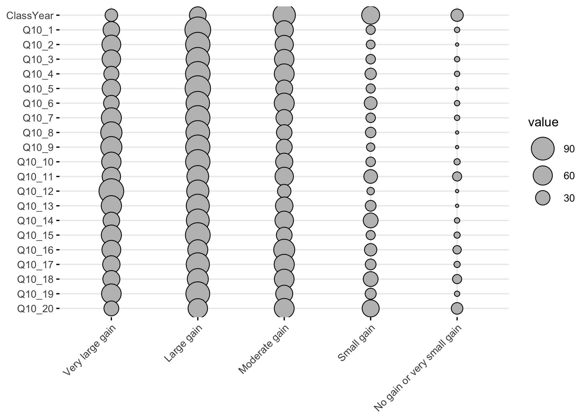
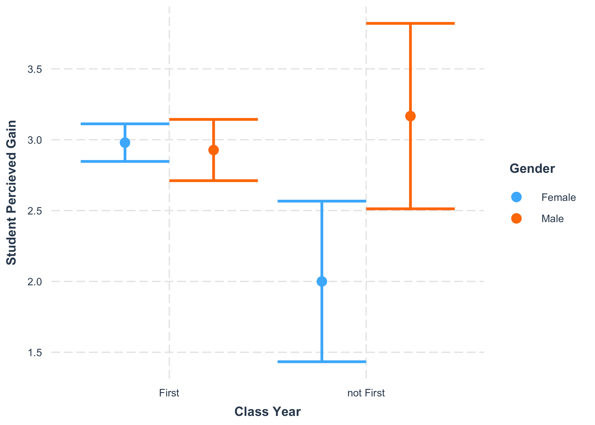
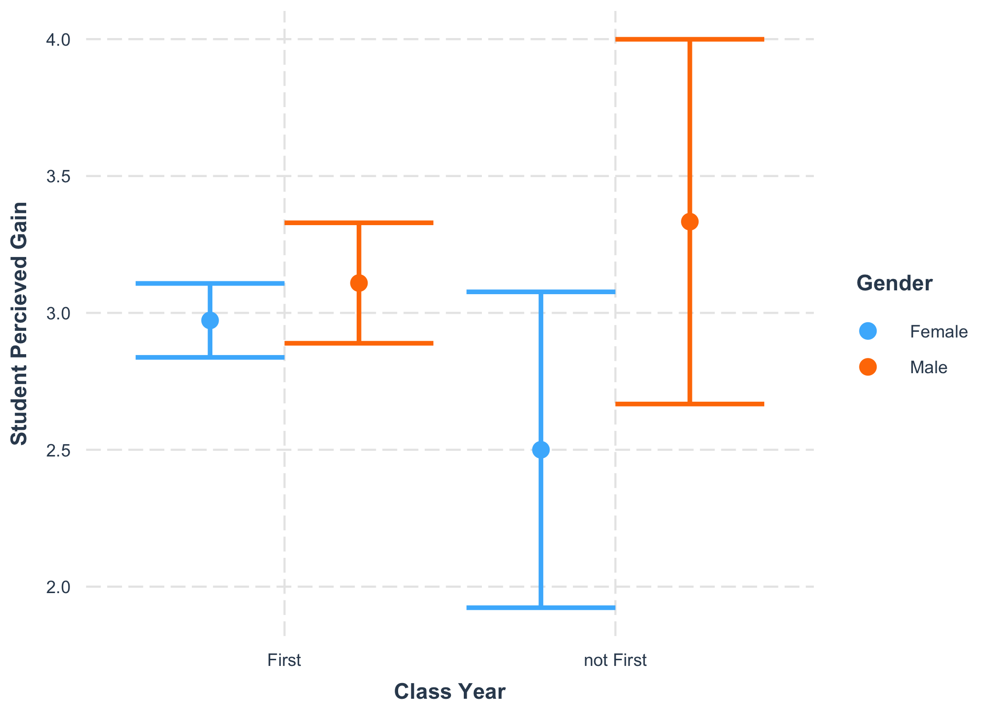
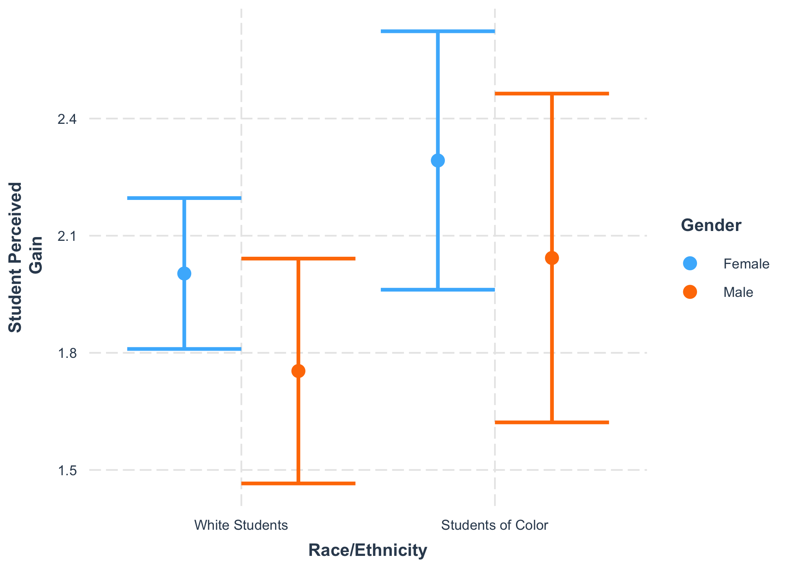

IMPORTANT NOTE

This Rmd uses the deidentified results and is safe to share.


## Loading Results

Loading in the results without instructor information. 
Note that because we want to analyze demographics for this question, we cannot look at instructor because that would lead to individuals being identifiable. 
We also need to be careful about looking at both gender and race at the same time.


``` r
NoInstructorYear1 <- read_delim("Deidentified Surveys/Year1.NoInstructor.tsv", 
    delim = "\t", escape_double = FALSE, 
    trim_ws = TRUE) %>%
  rename(Semester = Semester_pre)
```

```
## Rows: 85 Columns: 156
## ── Column specification ────────────────────────────────────────────────────────
## Delimiter: "\t"
## chr (146): ResponseId_pre, Semester_pre, Q1_pre, Q8_pre, Q9_1_pre, Q9_2_pre,...
## dbl  (10): Q19_1_pre, Q19_2_pre, Q19_3_pre, Q19_4_pre, Q19_5_pre, Q19_6_pre,...
## 
## ℹ Use `spec()` to retrieve the full column specification for this data.
## ℹ Specify the column types or set `show_col_types = FALSE` to quiet this message.
```

``` r
NoInstructorYear2 <- read_delim("Deidentified Surveys/Year2.NoInstructor.tsv", 
    delim = "\t", escape_double = FALSE, 
    trim_ws = TRUE)
```

```
## Rows: 77 Columns: 156
## ── Column specification ────────────────────────────────────────────────────────
## Delimiter: "\t"
## chr (146): ResponseId_pre, Semester, Q1_pre, Q8_pre, Q9_1_pre, Q9_2_pre, Q9_...
## dbl  (10): Q19_1_pre, Q19_2_pre, Q19_3_pre, Q19_4_pre, Q19_5_pre, Q19_6_pre,...
## 
## ℹ Use `spec()` to retrieve the full column specification for this data.
## ℹ Specify the column types or set `show_col_types = FALSE` to quiet this message.
```

``` r
NoInstructorYear3 <- read_delim("Deidentified Surveys/Year3.NoInstructor.tsv", 
    delim = "\t", escape_double = FALSE, 
    trim_ws = TRUE)
```

```
## Rows: 63 Columns: 156
## ── Column specification ────────────────────────────────────────────────────────
## Delimiter: "\t"
## chr (146): ResponseId_pre, Semester, Q1_pre, Q8_pre, Q9_1_pre, Q9_2_pre, Q9_...
## dbl  (10): Q19_1_pre, Q19_2_pre, Q19_3_pre, Q19_4_pre, Q19_5_pre, Q19_6_pre,...
## 
## ℹ Use `spec()` to retrieve the full column specification for this data.
## ℹ Specify the column types or set `show_col_types = FALSE` to quiet this message.
```

``` r
NoInstructor <- bind_rows(NoInstructorYear1, NoInstructorYear2, NoInstructorYear3)

NoInstructorQuestions <- read_delim("Deidentified Surveys/Year3.NoInstructorQuestions.tsv", 
    delim = "\t", escape_double = FALSE, 
    trim_ws = TRUE)
```

```
## Rows: 156 Columns: 2
## ── Column specification ────────────────────────────────────────────────────────
## Delimiter: "\t"
## chr (2): value, Question
## 
## ℹ Use `spec()` to retrieve the full column specification for this data.
## ℹ Specify the column types or set `show_col_types = FALSE` to quiet this message.
```

Removing any student who did not agree with the informed consent question:


## Benefits of research experience

This question (post-survey question 10) was only in the post-survey.
I am going to try to keep the demographics for this analysis later.

Note that pre-survey question 10 matched with post-survey question 9, while pre-survey question 11 matched with post-survey question 13. Post-survey question 10 was not matched with a pre-survey question.


```
## [1] "In this section of the survey you will be asked to consider a variety of possible benefits you may have gained from your research experience. If for any reason you prefer not to answer, or consider the question irrelevant to you, please choose the \"\"Not applicable / Prefer not to answer\"\" option - Clarification of a career path"
```

```
##  [1] "Clarification of a career path"                                      
##  [2] "Skill in the interpretation of results"                              
##  [3] "Tolerance for obstacles faced in the research process"               
##  [4] "Readiness for more demanding research"                               
##  [5] "Understanding how knowledge is constructed"                          
##  [6] "Understanding of the research process in your field"                 
##  [7] "Ability to integrate theory and practice"                            
##  [8] "Understanding of how scientists work on real problems"               
##  [9] "Understanding that scientific assertions require supporting evidence"
## [10] "Ability to analyze data and other information"                       
## [11] "Understanding science"                                               
## [12] "Learning ethical conduct in your field"                              
## [13] "Learning laboratory techniques"                                      
## [14] "Ability to read and understand primary literature"                   
## [15] "Skill in how to give an effective oral presentation"                 
## [16] "Skill in science writing"                                            
## [17] "Self-confidence"                                                     
## [18] "Understanding of how scientists think"                               
## [19] "Learning to work independently"                                      
## [20] "Becoming part of a learning community"                               
## [21] "Confidence in my potential to be a teacher of science"
```

Now to see the responses:


```
## # A tibble: 6 × 25
##   Semester  Gender Ethnicity      ClassYear Q10_1_post     Q10_2_post Q10_3_post
##   <chr>     <chr>  <chr>          <chr>     <chr>          <chr>      <chr>     
## 1 Fall 2021 Female White          First     Moderate gain  Large gain Large gain
## 2 Fall 2021 Female White          First     Very large ga… Very larg… Very larg…
## 3 Fall 2021 Female White          First     Small gain     Moderate … Moderate …
## 4 Fall 2021 Female White          First     Moderate gain  Very larg… Large gain
## 5 Fall 2021 Female Asian American First     Moderate gain  Large gain Moderate …
## 6 Fall 2021 Female White          First     Moderate gain  Large gain Moderate …
## # ℹ 18 more variables: Q10_4_post <chr>, Q10_5_post <chr>, Q10_6_post <chr>,
## #   Q10_7_post <chr>, Q10_8_post <chr>, Q10_9_post <chr>, Q10_10_post <chr>,
## #   Q10_11_post <chr>, Q10_12_post <chr>, Q10_13_post <chr>, Q10_14_post <chr>,
## #   Q10_15_post <chr>, Q10_16_post <chr>, Q10_17_post <chr>, Q10_18_post <chr>,
## #   Q10_19_post <chr>, Q10_20_post <chr>, Q10_21_post <chr>
```

```
## Warning: `funs()` was deprecated in dplyr 0.8.0.
## ℹ Please use a list of either functions or lambdas:
## 
## # Simple named list: list(mean = mean, median = median)
## 
## # Auto named with `tibble::lst()`: tibble::lst(mean, median)
## 
## # Using lambdas list(~ mean(., trim = .2), ~ median(., na.rm = TRUE))
## Call `lifecycle::last_lifecycle_warnings()` to see where this warning was
## generated.
```

```
##    Semester                          Gender                        Ethnicity  
##  Length:224         Female              :158   White                    :171  
##  Class :character   Male                : 64   Asian American           : 15  
##  Mode  :character   Non-binary          :  1   Two or more races        : 11  
##                     Prefer not to answer:  1   Black or African American:  8  
##                                                Hispanic/Latino          :  8  
##                                                Prefer not to answer     :  7  
##                                                (Other)                  :  4  
##   ClassYear                        Q10_1_post                      Q10_2_post 
##  First :209   Very large gain           :21   Very large gain           : 42  
##  Second: 14   Large gain                :43   Large gain                :118  
##  Third :  1   Moderate gain             :85   Moderate gain             : 53  
##               Small gain                :51   Small gain                :  9  
##               No gain or very small gain:20   No gain or very small gain:  2  
##               NA's                      : 4                                   
##                                                                               
##                       Q10_3_post                       Q10_4_post
##  Very large gain           : 57   Very large gain           :55  
##  Large gain                :104   Large gain                :95  
##  Moderate gain             : 53   Moderate gain             :62  
##  Small gain                :  8   Small gain                :10  
##  No gain or very small gain:  1   No gain or very small gain: 2  
##  NA's                      :  1                                  
##                                                                  
##                       Q10_5_post                       Q10_6_post 
##  Very large gain           : 33   Very large gain           : 54  
##  Large gain                :106   Large gain                :115  
##  Moderate gain             : 65   Moderate gain             : 44  
##  Small gain                : 16   Small gain                :  9  
##  No gain or very small gain:  2   No gain or very small gain:  1  
##  NA's                      :  2   NA's                      :  1  
##                                                                   
##                       Q10_7_post                      Q10_8_post 
##  Very large gain           :36   Very large gain           : 66  
##  Large gain                :96   Large gain                :104  
##  Moderate gain             :66   Moderate gain             : 42  
##  Small gain                :22   Small gain                : 10  
##  No gain or very small gain: 2   No gain or very small gain:  2  
##  NA's                      : 2                                   
##                                                                  
##                       Q10_9_post                     Q10_10_post 
##  Very large gain           :76   Very large gain           : 75  
##  Large gain                :98   Large gain                :103  
##  Moderate gain             :36   Moderate gain             : 38  
##  Small gain                :13   Small gain                :  7  
##  No gain or very small gain: 1   No gain or very small gain:  1  
##                                                                  
##                                                                  
##                      Q10_11_post                      Q10_12_post
##  Very large gain           : 61   Very large gain           :54  
##  Large gain                :104   Large gain                :80  
##  Moderate gain             : 46   Moderate gain             :54  
##  Small gain                : 10   Small gain                :26  
##  No gain or very small gain:  3   No gain or very small gain: 9  
##                                   NA's                      : 1  
##                                                                  
##                      Q10_13_post                      Q10_14_post
##  Very large gain           :108   Very large gain           :68  
##  Large gain                : 84   Large gain                :92  
##  Moderate gain             : 25   Moderate gain             :48  
##  Small gain                :  5   Small gain                :14  
##  No gain or very small gain:  1   No gain or very small gain: 1  
##  NA's                      :  1   NA's                      : 1  
##                                                                  
##                      Q10_15_post                     Q10_16_post 
##  Very large gain           :42   Very large gain           : 67  
##  Large gain                :90   Large gain                :108  
##  Moderate gain             :55   Moderate gain             : 37  
##  Small gain                :32   Small gain                :  9  
##  No gain or very small gain: 2   No gain or very small gain:  3  
##  NA's                      : 3                                   
##                                                                  
##                      Q10_17_post                     Q10_18_post
##  Very large gain           :57   Very large gain           :47  
##  Large gain                :66   Large gain                :93  
##  Moderate gain             :74   Moderate gain             :67  
##  Small gain                :20   Small gain                :14  
##  No gain or very small gain: 7   No gain or very small gain: 3  
##                                                                 
##                                                                 
##                      Q10_19_post                     Q10_20_post
##  Very large gain           :45   Very large gain           :63  
##  Large gain                :74   Large gain                :99  
##  Moderate gain             :64   Moderate gain             :45  
##  Small gain                :32   Small gain                :15  
##  No gain or very small gain: 9   No gain or very small gain: 2  
##                                                                 
##                                                                 
##                      Q10_21_post
##  Very large gain           :32  
##  Large gain                :62  
##  Moderate gain             :65  
##  Small gain                :45  
##  No gain or very small gain:17  
##  NA's                      : 3  
## 
```

<!-- -->

```
## [1] "In this section of the survey you will be asked to consider a variety of possible benefits you may have gained from your research experience. If for any reason you prefer not to answer, or consider the question irrelevant to you, please choose the Not applicable / Prefer not to answer option - "
```

```
## # A tibble: 21 × 2
##    value       Question                                                         
##    <chr>       <chr>                                                            
##  1 Q10_1_post  Clarification of a career path                                   
##  2 Q10_2_post  Skill in the interpretation of results                           
##  3 Q10_3_post  Tolerance for obstacles faced in the research process            
##  4 Q10_4_post  Readiness for more demanding research                            
##  5 Q10_5_post  Understanding how knowledge is constructed                       
##  6 Q10_6_post  Understanding of the research process in your field              
##  7 Q10_7_post  Ability to integrate theory and practice                         
##  8 Q10_8_post  Understanding of how scientists work on real problems            
##  9 Q10_9_post  Understanding that scientific assertions require supporting evid…
## 10 Q10_10_post Ability to analyze data and other information                    
## # ℹ 11 more rows
```

## Cleaning Demographics 

Note that we decided to simplify the race/ethnicity variable in the hopes of keeping a large enough
sample size for analysis. This is probably still necessary even though we have 3 years of results.


``` r
Q10 <- Q10Clean 
names(Q10) <- gsub("Q10_", "Q", names(Q10))
names(Q10) <- gsub("_post", "", names(Q10))

# Remove Prefer not to answer and recode to white and other race/ethnicity.
Q10_demo <- Q10 %>%
  filter(Ethnicity != "Prefer not to answer") %>% 
  mutate(`Race/Ethnicity` = recode(Ethnicity, 
                                   "White" = "White Students", .default = "Students of Color")) %>%
  mutate(`Race/Ethnicity` = factor(`Race/Ethnicity`, levels = c("White Students", "Students of Color"))) %>%
  mutate(ClassYear = as.factor(recode(ClassYear, 
                                      "First" = "First", "Second" = "not First", "Third" = "not First"))) %>%
  select(-Ethnicity) %>%
  rename(Q01=Q1, Q02=Q2, Q03=Q3, Q04=Q4, Q05=Q5, Q06=Q6, Q07=Q7, Q08=Q8, Q09=Q9)

table(Q10$Ethnicity, Q10$Gender)
```

```
##                            
##                             Female Male Non-binary Prefer not to answer
##   Asian American                12    3          0                    0
##   Black or African American      6    2          0                    0
##   Filipino                       1    0          0                    0
##   Hispanic/Latino                5    1          1                    1
##   Other                          2    1          0                    0
##   Prefer not to answer           4    3          0                    0
##   Two or more races              9    2          0                    0
##   White                        119   52          0                    0
```

``` r
table(Q10$Ethnicity)
```

```
## 
##            Asian American Black or African American                  Filipino 
##                        15                         8                         1 
##           Hispanic/Latino                     Other      Prefer not to answer 
##                         8                         3                         7 
##         Two or more races                     White 
##                        11                       171
```

``` r
table(Q10$Gender)
```

```
## 
##               Female                 Male           Non-binary 
##                  158                   64                    1 
## Prefer not to answer 
##                    1
```

## Bar plots

<!-- -->

Because of the small numbers, we will not look at each question by both Gender and Race. 
This needs to be revisited now that we have more data.


```
##                    
##                     Female Male Non-binary Prefer not to answer
##   White Students       119   52          0                    0
##   Students of Color     35    9          1                    1
```

We will need to remove the Non-binary and Prefer not to answer students, but we can keep 
the Male and Female students separate.


```
##                    
##                     Female Male Non-binary Prefer not to answer
##   White Students       119   52          0                    0
##   Students of Color     35    9          0                    0
```

The numbers of non-white students who are not first years is quite small (only 3).
We should not look at both class year and race together.


```
##                    
##                     First not First
##   White Students      160        11
##   Students of Color    41         3
```

Prepare the data to look at all of the questions at once.


<!-- -->

<!-- -->

<!-- -->

<!-- -->

Simplifying the semesters to compare Fall to Spring.


```
## Warning: There was 1 warning in `mutate()`.
## ℹ In argument: `across(Semester, str_replace, " 2021| 2022| 2023| 2024", "")`.
## Caused by warning:
## ! The `...` argument of `across()` is deprecated as of dplyr 1.1.0.
## Supply arguments directly to `.fns` through an anonymous function instead.
## 
##   # Previously
##   across(a:b, mean, na.rm = TRUE)
## 
##   # Now
##   across(a:b, \(x) mean(x, na.rm = TRUE))
```


<!-- -->

## Statistical models 

For each question, testing whether gender or race were significant.
I am also including semester because we expect students who have had a prior semester of the new Biology core to also have had some influence on their responses.

For this analysis we will consider all Fall and Spring semesters together.
We will also look at the first-year students versus the others. 

Should the sophomores and junior  be put into "Spring" for the previous experience analysis? 
(probably, but just leaving them out of the semester analysis is much easier)

Note that the dependent variable in the model is calculated as "5-as.numeric(Response)" because the responses range from 1=Very large gain to 5=No gain or very small gain. 
This converts the response variable into a numeric value from 0 to 4 with a positive estimate meaning an improvement in the response on the qualitative scale.

## Analysis by ClassYear and Gender {.tabset .tabset-pills}

### Q10_01


```
## [1] "Clarification of a career path"
```

```
## Start:  AIC=633.22
## 5 - as.numeric(Response) ~ ClassYear * Gender
## 
##                    Df Deviance    AIC
## - ClassYear:Gender  1   238.06 632.25
## <none>                  236.89 633.22
## 
## Step:  AIC=632.25
## 5 - as.numeric(Response) ~ ClassYear + Gender
## 
##             Df Deviance    AIC
## - ClassYear  1   239.36 631.40
## - Gender     1   240.21 632.15
## <none>           238.06 632.25
## 
## Step:  AIC=631.4
## 5 - as.numeric(Response) ~ Gender
## 
##          Df Deviance    AIC
## <none>        239.36 631.40
## - Gender  1   241.83 631.57
```

```
## 
## Call:
## glm(formula = 5 - as.numeric(Response) ~ Gender, data = Q01_select)
## 
## Coefficients:
##             Estimate Std. Error t value Pr(>|t|)    
## (Intercept)  2.03974    0.08709  23.421   <2e-16 ***
## GenderMale  -0.23974    0.16332  -1.468    0.144    
## ---
## Signif. codes:  0 '***' 0.001 '**' 0.01 '*' 0.05 '.' 0.1 ' ' 1
## 
## (Dispersion parameter for gaussian family taken to be 1.145271)
## 
##     Null deviance: 241.83  on 210  degrees of freedom
## Residual deviance: 239.36  on 209  degrees of freedom
## AIC: 631.4
## 
## Number of Fisher Scoring iterations: 2
```

### Q10_02


```
## [1] "Skill in the interpretation of results"
```

```
## Start:  AIC=516.77
## 5 - as.numeric(Response) ~ ClassYear * Gender
## 
##                    Df Deviance    AIC
## - ClassYear:Gender  1   132.93 514.77
## <none>                  132.93 516.77
## 
## Step:  AIC=514.77
## 5 - as.numeric(Response) ~ ClassYear + Gender
## 
##             Df Deviance    AIC
## - ClassYear  1   133.28 513.34
## <none>           132.93 514.77
## - Gender     1   134.38 515.10
## 
## Step:  AIC=513.34
## 5 - as.numeric(Response) ~ Gender
## 
##          Df Deviance    AIC
## <none>        133.28 513.34
## - Gender  1   134.62 513.49
```

```
## 
## Call:
## glm(formula = 5 - as.numeric(Response) ~ Gender, data = Q02_select)
## 
## Coefficients:
##             Estimate Std. Error t value Pr(>|t|)    
## (Intercept)  2.79221    0.06374  43.803   <2e-16 ***
## GenderMale   0.17501    0.11967   1.462    0.145    
## ---
## Signif. codes:  0 '***' 0.001 '**' 0.01 '*' 0.05 '.' 0.1 ' ' 1
## 
## (Dispersion parameter for gaussian family taken to be 0.6257515)
## 
##     Null deviance: 134.62  on 214  degrees of freedom
## Residual deviance: 133.29  on 213  degrees of freedom
## AIC: 513.34
## 
## Number of Fisher Scoring iterations: 2
```

### Q10_03


```
## [1] "Tolerance for obstacles faced in the research process"
```

```
## Start:  AIC=527.11
## 5 - as.numeric(Response) ~ ClassYear * Gender
## 
##                    Df Deviance    AIC
## <none>                  139.48 527.11
## - ClassYear:Gender  1   144.17 532.22
```

```
## 
## Call:
## glm(formula = 5 - as.numeric(Response) ~ ClassYear * Gender, 
##     data = Q03_select)
## 
## Coefficients:
##                               Estimate Std. Error t value Pr(>|t|)    
## (Intercept)                    2.97945    0.06729  44.279  < 2e-16 ***
## ClassYearnot First            -0.97945    0.29523  -3.318  0.00107 ** 
## GenderMale                    -0.05218    0.12863  -0.406  0.68542    
## ClassYearnot First:GenderMale  1.21885    0.45755   2.664  0.00832 ** 
## ---
## Signif. codes:  0 '***' 0.001 '**' 0.01 '*' 0.05 '.' 0.1 ' ' 1
## 
## (Dispersion parameter for gaussian family taken to be 0.6610464)
## 
##     Null deviance: 147.09  on 214  degrees of freedom
## Residual deviance: 139.48  on 211  degrees of freedom
## AIC: 527.11
## 
## Number of Fisher Scoring iterations: 2
```

```
## # A tibble: 5 × 2
##   Response                       n
##   <ord>                      <int>
## 1 Very large gain               56
## 2 Large gain                    99
## 3 Moderate gain                 51
## 4 Small gain                     8
## 5 No gain or very small gain     1
```

### Q10_04


```
## [1] "Readiness for more demanding research"
```

```
## Start:  AIC=559.56
## 5 - as.numeric(Response) ~ ClassYear * Gender
## 
##                    Df Deviance    AIC
## - ClassYear:Gender  1   162.52 557.97
## <none>                  162.20 559.56
## 
## Step:  AIC=557.97
## 5 - as.numeric(Response) ~ ClassYear + Gender
## 
##             Df Deviance    AIC
## - Gender     1   162.59 556.07
## <none>           162.52 557.97
## - ClassYear  1   165.79 560.27
## 
## Step:  AIC=556.07
## 5 - as.numeric(Response) ~ ClassYear
## 
##             Df Deviance    AIC
## <none>           162.59 556.07
## - ClassYear  1   165.97 558.50
```

```
## 
## Call:
## glm(formula = 5 - as.numeric(Response) ~ ClassYear, data = Q04_select)
## 
## Coefficients:
##                    Estimate Std. Error t value Pr(>|t|)    
## (Intercept)         2.86567    0.06162  46.502   <2e-16 ***
## ClassYearnot First -0.50853    0.24150  -2.106   0.0364 *  
## ---
## Signif. codes:  0 '***' 0.001 '**' 0.01 '*' 0.05 '.' 0.1 ' ' 1
## 
## (Dispersion parameter for gaussian family taken to be 0.7633212)
## 
##     Null deviance: 165.97  on 214  degrees of freedom
## Residual deviance: 162.59  on 213  degrees of freedom
## AIC: 556.07
## 
## Number of Fisher Scoring iterations: 2
```

### Q10_05


```
## [1] "Understanding how knowledge is constructed"
```

```
## Start:  AIC=544.13
## 5 - as.numeric(Response) ~ ClassYear * Gender
## 
##                    Df Deviance    AIC
## - ClassYear:Gender  1   153.88 543.21
## <none>                  153.10 544.13
## 
## Step:  AIC=543.21
## 5 - as.numeric(Response) ~ ClassYear + Gender
## 
##             Df Deviance    AIC
## - ClassYear  1   154.41 541.95
## - Gender     1   154.56 542.15
## <none>           153.88 543.21
## 
## Step:  AIC=541.95
## 5 - as.numeric(Response) ~ Gender
## 
##          Df Deviance    AIC
## - Gender  1   155.00 540.76
## <none>        154.41 541.95
## 
## Step:  AIC=540.76
## 5 - as.numeric(Response) ~ 1
```

```
## 
## Call:
## glm(formula = 5 - as.numeric(Response) ~ 1, data = Q05_select)
## 
## Coefficients:
##             Estimate Std. Error t value Pr(>|t|)    
## (Intercept)  2.67136    0.05859    45.6   <2e-16 ***
## ---
## Signif. codes:  0 '***' 0.001 '**' 0.01 '*' 0.05 '.' 0.1 ' ' 1
## 
## (Dispersion parameter for gaussian family taken to be 0.7311099)
## 
##     Null deviance: 155  on 212  degrees of freedom
## Residual deviance: 155  on 212  degrees of freedom
## AIC: 540.76
## 
## Number of Fisher Scoring iterations: 2
```

### Q10_06


```
## [1] "Understanding of the research process in your field"
```

```
## Start:  AIC=521.98
## 5 - as.numeric(Response) ~ ClassYear * Gender
## 
##                    Df Deviance    AIC
## - ClassYear:Gender  1   137.12 520.04
## <none>                  137.08 521.98
## 
## Step:  AIC=520.04
## 5 - as.numeric(Response) ~ ClassYear + Gender
## 
##             Df Deviance    AIC
## - Gender     1   137.61 518.82
## - ClassYear  1   138.04 519.48
## <none>           137.12 520.04
## 
## Step:  AIC=518.82
## 5 - as.numeric(Response) ~ ClassYear
## 
##             Df Deviance    AIC
## - ClassYear  1   138.44 518.09
## <none>           137.61 518.82
## 
## Step:  AIC=518.09
## 5 - as.numeric(Response) ~ 1
```

```
## 
## Call:
## glm(formula = 5 - as.numeric(Response) ~ 1, data = Q06_select)
## 
## Coefficients:
##             Estimate Std. Error t value Pr(>|t|)    
## (Intercept)  2.94860    0.05511    53.5   <2e-16 ***
## ---
## Signif. codes:  0 '***' 0.001 '**' 0.01 '*' 0.05 '.' 0.1 ' ' 1
## 
## (Dispersion parameter for gaussian family taken to be 0.6499276)
## 
##     Null deviance: 138.43  on 213  degrees of freedom
## Residual deviance: 138.43  on 213  degrees of freedom
## AIC: 518.09
## 
## Number of Fisher Scoring iterations: 2
```

### Q10_07


```
## [1] "Ability to integrate theory and practice"
```

```
## Start:  AIC=566.68
## 5 - as.numeric(Response) ~ ClassYear * Gender
## 
##                    Df Deviance    AIC
## - ClassYear:Gender  1   170.22 564.72
## <none>                  170.20 566.68
## 
## Step:  AIC=564.72
## 5 - as.numeric(Response) ~ ClassYear + Gender
## 
##             Df Deviance    AIC
## - ClassYear  1   171.12 563.83
## <none>           170.22 564.72
## - Gender     1   172.19 565.17
## 
## Step:  AIC=563.83
## 5 - as.numeric(Response) ~ Gender
## 
##          Df Deviance    AIC
## <none>        171.12 563.83
## - Gender  1   172.88 564.02
```

```
## 
## Call:
## glm(formula = 5 - as.numeric(Response) ~ Gender, data = Q07_select)
## 
## Coefficients:
##             Estimate Std. Error t value Pr(>|t|)    
## (Intercept)  2.58553    0.07304  35.397   <2e-16 ***
## GenderMale   0.20136    0.13649   1.475    0.142    
## ---
## Signif. codes:  0 '***' 0.001 '**' 0.01 '*' 0.05 '.' 0.1 ' ' 1
## 
## (Dispersion parameter for gaussian family taken to be 0.8109842)
## 
##     Null deviance: 172.88  on 212  degrees of freedom
## Residual deviance: 171.12  on 211  degrees of freedom
## AIC: 563.83
## 
## Number of Fisher Scoring iterations: 2
```

### Q10_08


```
## [1] "Understanding of how scientists work on real problems"
```

```
## Start:  AIC=534.81
## 5 - as.numeric(Response) ~ ClassYear * Gender
## 
##                    Df Deviance    AIC
## <none>                  144.57 534.81
## - ClassYear:Gender  1   146.10 535.08
```

```
## 
## Call:
## glm(formula = 5 - as.numeric(Response) ~ ClassYear * Gender, 
##     data = Q08_select)
## 
## Coefficients:
##                               Estimate Std. Error t value Pr(>|t|)    
## (Intercept)                     2.9726     0.0685  43.393   <2e-16 ***
## ClassYearnot First             -0.4726     0.3006  -1.572    0.117    
## GenderMale                      0.1365     0.1310   1.042    0.299    
## ClassYearnot First:GenderMale   0.6968     0.4658   1.496    0.136    
## ---
## Signif. codes:  0 '***' 0.001 '**' 0.01 '*' 0.05 '.' 0.1 ' ' 1
## 
## (Dispersion parameter for gaussian family taken to be 0.6851621)
## 
##     Null deviance: 148.00  on 214  degrees of freedom
## Residual deviance: 144.57  on 211  degrees of freedom
## AIC: 534.81
## 
## Number of Fisher Scoring iterations: 2
```

### Q10_09


```
## [1] "Understanding that scientific assertions require supporting evidence"
```

```
## Start:  AIC=560.45
## 5 - as.numeric(Response) ~ ClassYear * Gender
## 
##                    Df Deviance    AIC
## - ClassYear:Gender  1   163.56 559.36
## <none>                  162.88 560.45
## 
## Step:  AIC=559.36
## 5 - as.numeric(Response) ~ ClassYear + Gender
## 
##             Df Deviance    AIC
## - ClassYear  1   163.58 557.38
## - Gender     1   164.40 558.45
## <none>           163.56 559.36
## 
## Step:  AIC=557.38
## 5 - as.numeric(Response) ~ Gender
## 
##          Df Deviance    AIC
## - Gender  1   164.44 556.50
## <none>        163.58 557.38
## 
## Step:  AIC=556.5
## 5 - as.numeric(Response) ~ 1
```

```
## 
## Call:
## glm(formula = 5 - as.numeric(Response) ~ 1, data = Q09_select)
## 
## Coefficients:
##             Estimate Std. Error t value Pr(>|t|)    
## (Intercept)  3.05116    0.05978   51.04   <2e-16 ***
## ---
## Signif. codes:  0 '***' 0.001 '**' 0.01 '*' 0.05 '.' 0.1 ' ' 1
## 
## (Dispersion parameter for gaussian family taken to be 0.7683982)
## 
##     Null deviance: 164.44  on 214  degrees of freedom
## Residual deviance: 164.44  on 214  degrees of freedom
## AIC: 556.5
## 
## Number of Fisher Scoring iterations: 2
```

### Q10_10


```
## [1] "Ability to analyze data and other information"
```

```
## Start:  AIC=531.57
## 5 - as.numeric(Response) ~ ClassYear * Gender
## 
##                    Df Deviance    AIC
## - ClassYear:Gender  1   143.06 530.55
## <none>                  142.41 531.57
## 
## Step:  AIC=530.55
## 5 - as.numeric(Response) ~ ClassYear + Gender
## 
##             Df Deviance    AIC
## - Gender     1   143.72 529.55
## - ClassYear  1   143.94 529.88
## <none>           143.06 530.55
## 
## Step:  AIC=529.55
## 5 - as.numeric(Response) ~ ClassYear
## 
##             Df Deviance    AIC
## - ClassYear  1   144.49 528.70
## <none>           143.72 529.55
## 
## Step:  AIC=528.7
## 5 - as.numeric(Response) ~ 1
```

```
## 
## Call:
## glm(formula = 5 - as.numeric(Response) ~ 1, data = Q10_select)
## 
## Coefficients:
##             Estimate Std. Error t value Pr(>|t|)    
## (Intercept)  3.08372    0.05604   55.03   <2e-16 ***
## ---
## Signif. codes:  0 '***' 0.001 '**' 0.01 '*' 0.05 '.' 0.1 ' ' 1
## 
## (Dispersion parameter for gaussian family taken to be 0.675201)
## 
##     Null deviance: 144.49  on 214  degrees of freedom
## Residual deviance: 144.49  on 214  degrees of freedom
## AIC: 528.7
## 
## Number of Fisher Scoring iterations: 2
```

### Q10_11


```
## [1] "Understanding science"
```

```
## Start:  AIC=563.44
## 5 - as.numeric(Response) ~ ClassYear * Gender
## 
##                    Df Deviance    AIC
## <none>                  165.16 563.44
## - ClassYear:Gender  1   167.23 564.12
```

```
## 
## Call:
## glm(formula = 5 - as.numeric(Response) ~ ClassYear * Gender, 
##     data = Q11_select)
## 
## Coefficients:
##                               Estimate Std. Error t value Pr(>|t|)    
## (Intercept)                    2.91096    0.07322  39.756   <2e-16 ***
## ClassYearnot First            -0.66096    0.32125  -2.057   0.0409 *  
## GenderMale                     0.10722    0.13997   0.766   0.4445    
## ClassYearnot First:GenderMale  0.80944    0.49789   1.626   0.1055    
## ---
## Signif. codes:  0 '***' 0.001 '**' 0.01 '*' 0.05 '.' 0.1 ' ' 1
## 
## (Dispersion parameter for gaussian family taken to be 0.7827375)
## 
##     Null deviance: 169.66  on 214  degrees of freedom
## Residual deviance: 165.16  on 211  degrees of freedom
## AIC: 563.44
## 
## Number of Fisher Scoring iterations: 2
```

### Q10_12


```
## [1] "Learning ethical conduct in your field"
```

```
## Start:  AIC=650.67
## 5 - as.numeric(Response) ~ ClassYear * Gender
## 
##                    Df Deviance    AIC
## - ClassYear:Gender  1   251.18 649.59
## <none>                  250.11 650.67
## 
## Step:  AIC=649.59
## 5 - as.numeric(Response) ~ ClassYear + Gender
## 
##             Df Deviance    AIC
## - Gender     1   251.24 647.64
## <none>           251.18 649.59
## - ClassYear  1   253.69 649.72
## 
## Step:  AIC=647.64
## 5 - as.numeric(Response) ~ ClassYear
## 
##             Df Deviance    AIC
## <none>           251.24 647.64
## - ClassYear  1   253.84 647.84
```

```
## 
## Call:
## glm(formula = 5 - as.numeric(Response) ~ ClassYear, data = Q12_select)
## 
## Coefficients:
##                    Estimate Std. Error t value Pr(>|t|)    
## (Intercept)         2.66000    0.07698  34.556   <2e-16 ***
## ClassYearnot First -0.44571    0.30096  -1.481     0.14    
## ---
## Signif. codes:  0 '***' 0.001 '**' 0.01 '*' 0.05 '.' 0.1 ' ' 1
## 
## (Dispersion parameter for gaussian family taken to be 1.185081)
## 
##     Null deviance: 253.84  on 213  degrees of freedom
## Residual deviance: 251.24  on 212  degrees of freedom
## AIC: 647.64
## 
## Number of Fisher Scoring iterations: 2
```

### Q10_13


```
## [1] "Learning laboratory techniques"
```

```
## Start:  AIC=522.77
## 5 - as.numeric(Response) ~ ClassYear * Gender
## 
##                    Df Deviance    AIC
## - ClassYear:Gender  1   137.59 522.18
## <none>                  136.69 522.77
## 
## Step:  AIC=522.18
## 5 - as.numeric(Response) ~ ClassYear + Gender
## 
##             Df Deviance    AIC
## - ClassYear  1   137.62 520.22
## - Gender     1   137.70 520.35
## <none>           137.59 522.18
## 
## Step:  AIC=520.22
## 5 - as.numeric(Response) ~ Gender
## 
##          Df Deviance    AIC
## - Gender  1   137.74 518.41
## <none>        137.62 520.22
## 
## Step:  AIC=518.41
## 5 - as.numeric(Response) ~ 1
```

```
## 
## Call:
## glm(formula = 5 - as.numeric(Response) ~ 1, data = Q13_select)
## 
## Coefficients:
##             Estimate Std. Error t value Pr(>|t|)    
## (Intercept)  3.30698    0.05471   60.44   <2e-16 ***
## ---
## Signif. codes:  0 '***' 0.001 '**' 0.01 '*' 0.05 '.' 0.1 ' ' 1
## 
## (Dispersion parameter for gaussian family taken to be 0.6436427)
## 
##     Null deviance: 137.74  on 214  degrees of freedom
## Residual deviance: 137.74  on 214  degrees of freedom
## AIC: 518.41
## 
## Number of Fisher Scoring iterations: 2
```

### Q10_14


```
## [1] "Ability to read and understand primary literature"
```

```
## Start:  AIC=567.52
## 5 - as.numeric(Response) ~ ClassYear * Gender
## 
##                    Df Deviance    AIC
## - ClassYear:Gender  1   169.59 565.53
## <none>                  169.58 567.52
## 
## Step:  AIC=565.53
## 5 - as.numeric(Response) ~ ClassYear + Gender
## 
##             Df Deviance    AIC
## - Gender     1   169.97 564.01
## - ClassYear  1   171.06 565.38
## <none>           169.59 565.53
## 
## Step:  AIC=564.01
## 5 - as.numeric(Response) ~ ClassYear
## 
##             Df Deviance    AIC
## - ClassYear  1   171.33 563.71
## <none>           169.97 564.01
## 
## Step:  AIC=563.71
## 5 - as.numeric(Response) ~ 1
```

```
## 
## Call:
## glm(formula = 5 - as.numeric(Response) ~ 1, data = Q14_select)
## 
## Coefficients:
##             Estimate Std. Error t value Pr(>|t|)    
## (Intercept)  2.94393    0.06131   48.02   <2e-16 ***
## ---
## Signif. codes:  0 '***' 0.001 '**' 0.01 '*' 0.05 '.' 0.1 ' ' 1
## 
## (Dispersion parameter for gaussian family taken to be 0.8043526)
## 
##     Null deviance: 171.33  on 213  degrees of freedom
## Residual deviance: 171.33  on 213  degrees of freedom
## AIC: 563.71
## 
## Number of Fisher Scoring iterations: 2
```

### Q10_15


```
## [1] "Skill in how to give an effective oral presentation"
```

```
## Start:  AIC=598.9
## 5 - as.numeric(Response) ~ ClassYear * Gender
## 
##                    Df Deviance    AIC
## - ClassYear:Gender  1   201.17 598.52
## <none>                  199.64 598.90
## 
## Step:  AIC=598.52
## 5 - as.numeric(Response) ~ ClassYear + Gender
## 
##             Df Deviance    AIC
## - Gender     1   201.20 596.55
## - ClassYear  1   202.71 598.13
## <none>           201.17 598.52
## 
## Step:  AIC=596.55
## 5 - as.numeric(Response) ~ ClassYear
## 
##             Df Deviance    AIC
## - ClassYear  1   202.72 596.14
## <none>           201.20 596.55
## 
## Step:  AIC=596.14
## 5 - as.numeric(Response) ~ 1
```

```
## 
## Call:
## glm(formula = 5 - as.numeric(Response) ~ 1, data = Q15_select)
## 
## Coefficients:
##             Estimate Std. Error t value Pr(>|t|)    
## (Intercept)  2.60377    0.06732   38.68   <2e-16 ***
## ---
## Signif. codes:  0 '***' 0.001 '**' 0.01 '*' 0.05 '.' 0.1 ' ' 1
## 
## (Dispersion parameter for gaussian family taken to be 0.960744)
## 
##     Null deviance: 202.72  on 211  degrees of freedom
## Residual deviance: 202.72  on 211  degrees of freedom
## AIC: 596.14
## 
## Number of Fisher Scoring iterations: 2
```

### Q10_16


```
## [1] "Skill in science writing"
```

```
## Start:  AIC=557.17
## 5 - as.numeric(Response) ~ ClassYear * Gender
## 
##                    Df Deviance    AIC
## - ClassYear:Gender  1   160.85 555.75
## <none>                  160.41 557.17
## 
## Step:  AIC=555.75
## 5 - as.numeric(Response) ~ ClassYear + Gender
## 
##             Df Deviance    AIC
## - ClassYear  1   160.85 553.76
## - Gender     1   160.96 553.90
## <none>           160.85 555.75
## 
## Step:  AIC=553.76
## 5 - as.numeric(Response) ~ Gender
## 
##          Df Deviance    AIC
## - Gender  1   160.96 551.90
## <none>        160.85 553.76
## 
## Step:  AIC=551.9
## 5 - as.numeric(Response) ~ 1
```

```
## 
## Call:
## glm(formula = 5 - as.numeric(Response) ~ 1, data = Q16_select)
## 
## Coefficients:
##             Estimate Std. Error t value Pr(>|t|)    
## (Intercept)  3.01395    0.05915   50.96   <2e-16 ***
## ---
## Signif. codes:  0 '***' 0.001 '**' 0.01 '*' 0.05 '.' 0.1 ' ' 1
## 
## (Dispersion parameter for gaussian family taken to be 0.7521408)
## 
##     Null deviance: 160.96  on 214  degrees of freedom
## Residual deviance: 160.96  on 214  degrees of freedom
## AIC: 551.9
## 
## Number of Fisher Scoring iterations: 2
```

### Q10_17


```
## [1] "Self-confidence"
```

```
## Start:  AIC=642.23
## 5 - as.numeric(Response) ~ ClassYear * Gender
## 
##                    Df Deviance    AIC
## - ClassYear:Gender  1   238.31 640.28
## <none>                  238.26 642.23
## 
## Step:  AIC=640.28
## 5 - as.numeric(Response) ~ ClassYear + Gender
## 
##             Df Deviance    AIC
## - Gender     1   238.42 638.38
## - ClassYear  1   238.44 638.39
## <none>           238.31 640.28
## 
## Step:  AIC=638.38
## 5 - as.numeric(Response) ~ ClassYear
## 
##             Df Deviance    AIC
## - ClassYear  1   238.53 636.47
## <none>           238.42 638.38
## 
## Step:  AIC=636.47
## 5 - as.numeric(Response) ~ 1
```

```
## 
## Call:
## glm(formula = 5 - as.numeric(Response) ~ 1, data = Q17_select)
## 
## Coefficients:
##             Estimate Std. Error t value Pr(>|t|)    
## (Intercept)    2.656      0.072   36.88   <2e-16 ***
## ---
## Signif. codes:  0 '***' 0.001 '**' 0.01 '*' 0.05 '.' 0.1 ' ' 1
## 
## (Dispersion parameter for gaussian family taken to be 1.114627)
## 
##     Null deviance: 238.53  on 214  degrees of freedom
## Residual deviance: 238.53  on 214  degrees of freedom
## AIC: 636.47
## 
## Number of Fisher Scoring iterations: 2
```

### Q10_18


```
## [1] "Understanding of how scientists think"
```

```
## Start:  AIC=562.6
## 5 - as.numeric(Response) ~ ClassYear * Gender
## 
##                    Df Deviance    AIC
## <none>                  164.51 562.60
## - ClassYear:Gender  1   166.43 563.08
```

```
## 
## Call:
## glm(formula = 5 - as.numeric(Response) ~ ClassYear * Gender, 
##     data = Q18_select)
## 
## Coefficients:
##                               Estimate Std. Error t value Pr(>|t|)    
## (Intercept)                    2.73973    0.07308  37.491   <2e-16 ***
## ClassYearnot First            -0.61473    0.32062  -1.917   0.0566 .  
## GenderMale                     0.09664    0.13970   0.692   0.4899    
## ClassYearnot First:GenderMale  0.77836    0.49691   1.566   0.1188    
## ---
## Signif. codes:  0 '***' 0.001 '**' 0.01 '*' 0.05 '.' 0.1 ' ' 1
## 
## (Dispersion parameter for gaussian family taken to be 0.7796771)
## 
##     Null deviance: 168.44  on 214  degrees of freedom
## Residual deviance: 164.51  on 211  degrees of freedom
## AIC: 562.6
## 
## Number of Fisher Scoring iterations: 2
```

### Q10_19


```
## [1] "Learning to work independently"
```

```
## Start:  AIC=646.04
## 5 - as.numeric(Response) ~ ClassYear * Gender
## 
##                    Df Deviance    AIC
## - ClassYear:Gender  1   242.60 644.11
## <none>                  242.51 646.04
## 
## Step:  AIC=644.11
## 5 - as.numeric(Response) ~ ClassYear + Gender
## 
##             Df Deviance    AIC
## - ClassYear  1   242.60 642.11
## - Gender     1   243.65 643.04
## <none>           242.60 644.11
## 
## Step:  AIC=642.11
## 5 - as.numeric(Response) ~ Gender
## 
##          Df Deviance    AIC
## - Gender  1   243.66 641.04
## <none>        242.60 642.11
## 
## Step:  AIC=641.04
## 5 - as.numeric(Response) ~ 1
```

```
## 
## Call:
## glm(formula = 5 - as.numeric(Response) ~ 1, data = Q19_select)
## 
## Coefficients:
##             Estimate Std. Error t value Pr(>|t|)    
## (Intercept)  2.52093    0.07277   34.64   <2e-16 ***
## ---
## Signif. codes:  0 '***' 0.001 '**' 0.01 '*' 0.05 '.' 0.1 ' ' 1
## 
## (Dispersion parameter for gaussian family taken to be 1.138579)
## 
##     Null deviance: 243.66  on 214  degrees of freedom
## Residual deviance: 243.66  on 214  degrees of freedom
## AIC: 641.04
## 
## Number of Fisher Scoring iterations: 2
```

### Q10_20


```
## [1] "Becoming part of a learning community"
```

```
## Start:  AIC=569.69
## 5 - as.numeric(Response) ~ ClassYear * Gender
## 
##                    Df Deviance    AIC
## - ClassYear:Gender  1   170.50 568.28
## <none>                  170.03 569.69
## 
## Step:  AIC=568.28
## 5 - as.numeric(Response) ~ ClassYear + Gender
## 
##             Df Deviance    AIC
## - Gender     1   170.52 566.31
## - ClassYear  1   170.80 566.67
## <none>           170.50 568.28
## 
## Step:  AIC=566.31
## 5 - as.numeric(Response) ~ ClassYear
## 
##             Df Deviance    AIC
## - ClassYear  1   170.81 564.67
## <none>           170.52 566.31
## 
## Step:  AIC=564.67
## 5 - as.numeric(Response) ~ 1
```

```
## 
## Call:
## glm(formula = 5 - as.numeric(Response) ~ 1, data = Q20_select)
## 
## Coefficients:
##             Estimate Std. Error t value Pr(>|t|)    
## (Intercept)  2.92558    0.06093   48.02   <2e-16 ***
## ---
## Signif. codes:  0 '***' 0.001 '**' 0.01 '*' 0.05 '.' 0.1 ' ' 1
## 
## (Dispersion parameter for gaussian family taken to be 0.7981743)
## 
##     Null deviance: 170.81  on 214  degrees of freedom
## Residual deviance: 170.81  on 214  degrees of freedom
## AIC: 564.67
## 
## Number of Fisher Scoring iterations: 2
```

### Q10_21


```
## [1] "Confidence in my potential to be a teacher of science"
```

```
## Start:  AIC=660.7
## 5 - as.numeric(Response) ~ ClassYear * Gender
## 
##                    Df Deviance    AIC
## <none>                  267.21 660.70
## - ClassYear:Gender  1   274.02 664.03
```

```
## 
## Call:
## glm(formula = 5 - as.numeric(Response) ~ ClassYear * Gender, 
##     data = Q21_select)
## 
## Coefficients:
##                               Estimate Std. Error t value Pr(>|t|)    
## (Intercept)                    2.20979    0.09478  23.314   <2e-16 ***
## ClassYearnot First            -0.83479    0.41179  -2.027   0.0439 *  
## GenderMale                    -0.00979    0.17984  -0.054   0.9566    
## ClassYearnot First:GenderMale  1.46812    0.63800   2.301   0.0224 *  
## ---
## Signif. codes:  0 '***' 0.001 '**' 0.01 '*' 0.05 '.' 0.1 ' ' 1
## 
## (Dispersion parameter for gaussian family taken to be 1.284686)
## 
##     Null deviance: 275.07  on 211  degrees of freedom
## Residual deviance: 267.21  on 208  degrees of freedom
## AIC: 660.7
## 
## Number of Fisher Scoring iterations: 2
```

## Summary of Analysis by ClassYear and Gender

Most of the questions depended on Gender alone, but that question is better dealt in Model 2.

The following questions showed dependence on Class Year alone:

- Q10_04: "Readiness for more demanding research" Estimate -0.506 for not First Year.
- Q10_12: "Learning ethical conduct in your field" Estimate -0.446 for not First Year.

The following questions showed dependence on Class Year and also an interaction with Gender:

- Q10_03: "Tolerance for obstacles faced in the research process" Estimate -0.979 for not First Year.
- Q10_08: "Understanding of how scientists work on real problems" Estimate -0.473 for not First Year.
- Q10_11: "Understanding science" Estimate -0.660 for not First Year.
- Q10_18: "Understanding of how scientists think" Estimate -0.615 for not First Year.
- Q10_21: "Confidence in my potential to be a teacher of science" Estimate -0.835 for not First Year.

For each of these questions that maintained the interaction during model selection, 
the effect size of the interaction was always at least as large (and usually larger) than that of Class Year alone. 
This means that male students who were not first-year students showed similar perceived benefits as first-year students, 
while female students showed significantly less perceived benefits. 

Here are the cat_plots showing these interactions:


```
## Using data Q03_select from global environment. This could cause incorrect
## results if Q03_select has been altered since the model was fit. You can
## manually provide the data to the "data =" argument.
```

<!-- -->


```
## Using data Q08_select from global environment. This could cause incorrect
## results if Q08_select has been altered since the model was fit. You can
## manually provide the data to the "data =" argument.
```

<!-- -->


```
## Using data Q11_select from global environment. This could cause incorrect
## results if Q11_select has been altered since the model was fit. You can
## manually provide the data to the "data =" argument.
```

<!-- -->


```
## Using data Q18_select from global environment. This could cause incorrect
## results if Q18_select has been altered since the model was fit. You can
## manually provide the data to the "data =" argument.
```

<!-- -->


```
## Using data Q21_select from global environment. This could cause incorrect
## results if Q21_select has been altered since the model was fit. You can
## manually provide the data to the "data =" argument.
```

<!-- -->


## Analysis by Semester and Demo {.tabset .tabset-pills}

### Q10_01


```
## [1] "Clarification of a career path"
```

```
## Start:  AIC=587.68
## 5 - as.numeric(Response) ~ Semester + Gender * `Race/Ethnicity`
## 
##                           Df Deviance    AIC
## - Semester                 1   214.34 585.68
## - Gender:`Race/Ethnicity`  1   215.36 586.62
## <none>                         214.34 587.68
## 
## Step:  AIC=585.68
## 5 - as.numeric(Response) ~ Gender + `Race/Ethnicity` + Gender:`Race/Ethnicity`
## 
##                           Df Deviance    AIC
## - Gender:`Race/Ethnicity`  1   215.36 584.62
## <none>                         214.34 585.68
## 
## Step:  AIC=584.62
## 5 - as.numeric(Response) ~ Gender + `Race/Ethnicity`
## 
##                    Df Deviance    AIC
## <none>                  215.36 584.62
## - Gender            1   217.78 584.82
## - `Race/Ethnicity`  1   218.06 585.07
```

```
## 
## Call:
## glm(formula = 5 - as.numeric(Response) ~ Gender + `Race/Ethnicity`, 
##     data = Q01_select)
## 
## Coefficients:
##                                   Estimate Std. Error t value Pr(>|t|)    
## (Intercept)                        2.00312    0.09797  20.445   <2e-16 ***
## GenderMale                        -0.24971    0.16898  -1.478    0.141    
## `Race/Ethnicity`Students of Color  0.28951    0.18568   1.559    0.121    
## ---
## Signif. codes:  0 '***' 0.001 '**' 0.01 '*' 0.05 '.' 0.1 ' ' 1
## 
## (Dispersion parameter for gaussian family taken to be 1.110109)
## 
##     Null deviance: 220.99  on 196  degrees of freedom
## Residual deviance: 215.36  on 194  degrees of freedom
## AIC: 584.62
## 
## Number of Fisher Scoring iterations: 2
```

### Q10_02


```
## [1] "Skill in the interpretation of results"
```

```
## Start:  AIC=478.48
## 5 - as.numeric(Response) ~ Semester + Gender * `Race/Ethnicity`
## 
##                           Df Deviance    AIC
## - Gender:`Race/Ethnicity`  1   120.52 477.61
## <none>                         119.85 478.48
## - Semester                 1   122.95 481.61
## 
## Step:  AIC=477.61
## 5 - as.numeric(Response) ~ Semester + Gender + `Race/Ethnicity`
## 
##                    Df Deviance    AIC
## - Gender            1   121.33 476.95
## - `Race/Ethnicity`  1   121.48 477.20
## <none>                  120.52 477.61
## - Semester          1   123.65 480.76
## 
## Step:  AIC=476.95
## 5 - as.numeric(Response) ~ Semester + `Race/Ethnicity`
## 
##                    Df Deviance    AIC
## - `Race/Ethnicity`  1   122.48 476.85
## <none>                  121.33 476.95
## - Semester          1   124.79 480.61
## 
## Step:  AIC=476.85
## 5 - as.numeric(Response) ~ Semester
## 
##            Df Deviance    AIC
## <none>          122.48 476.85
## - Semester  1   125.52 479.78
```

```
## 
## Call:
## glm(formula = 5 - as.numeric(Response) ~ Semester, data = Q02_select)
## 
## Coefficients:
##                Estimate Std. Error t value Pr(>|t|)    
## (Intercept)     2.98876    0.08316  35.940   <2e-16 ***
## SemesterSpring -0.24769    0.11140  -2.223   0.0273 *  
## ---
## Signif. codes:  0 '***' 0.001 '**' 0.01 '*' 0.05 '.' 0.1 ' ' 1
## 
## (Dispersion parameter for gaussian family taken to be 0.6154766)
## 
##     Null deviance: 125.52  on 200  degrees of freedom
## Residual deviance: 122.48  on 199  degrees of freedom
## AIC: 476.85
## 
## Number of Fisher Scoring iterations: 2
```

### Q10_03


```
## [1] "Tolerance for obstacles faced in the research process"
```

```
## Start:  AIC=503.92
## 5 - as.numeric(Response) ~ Semester + Gender * `Race/Ethnicity`
## 
##                           Df Deviance    AIC
## - Gender:`Race/Ethnicity`  1   136.08 502.01
## - Semester                 1   136.59 502.77
## <none>                         136.02 503.92
## 
## Step:  AIC=502.01
## 5 - as.numeric(Response) ~ Semester + Gender + `Race/Ethnicity`
## 
##                    Df Deviance    AIC
## - `Race/Ethnicity`  1   136.08 500.01
## - Gender            1   136.23 500.23
## - Semester          1   136.65 500.84
## <none>                  136.08 502.01
## 
## Step:  AIC=500.01
## 5 - as.numeric(Response) ~ Semester + Gender
## 
##            Df Deviance    AIC
## - Gender    1   136.23 498.23
## - Semester  1   136.65 498.85
## <none>          136.08 500.01
## 
## Step:  AIC=498.23
## 5 - as.numeric(Response) ~ Semester
## 
##            Df Deviance    AIC
## - Semester  1   136.76 497.01
## <none>          136.23 498.23
## 
## Step:  AIC=497.01
## 5 - as.numeric(Response) ~ 1
```

```
## 
## Call:
## glm(formula = 5 - as.numeric(Response) ~ 1, data = Q03_select)
## 
## Coefficients:
##             Estimate Std. Error t value Pr(>|t|)    
## (Intercept)  2.96517    0.05833   50.84   <2e-16 ***
## ---
## Signif. codes:  0 '***' 0.001 '**' 0.01 '*' 0.05 '.' 0.1 ' ' 1
## 
## (Dispersion parameter for gaussian family taken to be 0.6837811)
## 
##     Null deviance: 136.76  on 200  degrees of freedom
## Residual deviance: 136.76  on 200  degrees of freedom
## AIC: 497.01
## 
## Number of Fisher Scoring iterations: 2
```

```
## # A tibble: 5 × 2
##   Response                       n
##   <ord>                      <int>
## 1 Very large gain               54
## 2 Large gain                    96
## 3 Moderate gain                 42
## 4 Small gain                     8
## 5 No gain or very small gain     1
```

### Q10_04


```
## [1] "Readiness for more demanding research"
```

```
## Start:  AIC=520.02
## 5 - as.numeric(Response) ~ Semester + Gender * `Race/Ethnicity`
## 
##                           Df Deviance    AIC
## - Gender:`Race/Ethnicity`  1   147.91 518.77
## <none>                         147.36 520.02
## - Semester                 1   150.20 521.86
## 
## Step:  AIC=518.77
## 5 - as.numeric(Response) ~ Semester + Gender + `Race/Ethnicity`
## 
##                    Df Deviance    AIC
## - Gender            1   148.31 517.30
## - `Race/Ethnicity`  1   148.66 517.78
## <none>                  147.91 518.77
## - Semester          1   150.78 520.63
## 
## Step:  AIC=517.3
## 5 - as.numeric(Response) ~ Semester + `Race/Ethnicity`
## 
##                    Df Deviance    AIC
## - `Race/Ethnicity`  1   148.95 516.18
## <none>                  148.31 517.30
## - Semester          1   151.00 518.92
## 
## Step:  AIC=516.18
## 5 - as.numeric(Response) ~ Semester
## 
##            Df Deviance    AIC
## <none>          148.95 516.18
## - Semester  1   151.37 517.42
```

```
## 
## Call:
## glm(formula = 5 - as.numeric(Response) ~ Semester, data = Q04_select)
## 
## Coefficients:
##                Estimate Std. Error t value Pr(>|t|)    
## (Intercept)     2.98876    0.09171  32.590   <2e-16 ***
## SemesterSpring -0.22091    0.12285  -1.798   0.0737 .  
## ---
## Signif. codes:  0 '***' 0.001 '**' 0.01 '*' 0.05 '.' 0.1 ' ' 1
## 
## (Dispersion parameter for gaussian family taken to be 0.7485078)
## 
##     Null deviance: 151.37  on 200  degrees of freedom
## Residual deviance: 148.95  on 199  degrees of freedom
## AIC: 516.18
## 
## Number of Fisher Scoring iterations: 2
```

### Q10_05


```
## [1] "Understanding how knowledge is constructed"
```

```
## Start:  AIC=505.81
## 5 - as.numeric(Response) ~ Semester + Gender * `Race/Ethnicity`
## 
##                           Df Deviance    AIC
## - Semester                 1   139.55 504.12
## - Gender:`Race/Ethnicity`  1   139.99 504.75
## <none>                         139.34 505.81
## 
## Step:  AIC=504.12
## 5 - as.numeric(Response) ~ Gender + `Race/Ethnicity` + Gender:`Race/Ethnicity`
## 
##                           Df Deviance    AIC
## - Gender:`Race/Ethnicity`  1   140.20 503.04
## <none>                         139.55 504.12
## 
## Step:  AIC=503.04
## 5 - as.numeric(Response) ~ Gender + `Race/Ethnicity`
## 
##                    Df Deviance    AIC
## - Gender            1   140.57 501.56
## - `Race/Ethnicity`  1   140.76 501.84
## <none>                  140.20 503.04
## 
## Step:  AIC=501.56
## 5 - as.numeric(Response) ~ `Race/Ethnicity`
## 
##                    Df Deviance    AIC
## - `Race/Ethnicity`  1   141.06 500.25
## <none>                  140.57 501.56
## 
## Step:  AIC=500.25
## 5 - as.numeric(Response) ~ 1
```

```
## 
## Call:
## glm(formula = 5 - as.numeric(Response) ~ 1, data = Q05_select)
## 
## Coefficients:
##             Estimate Std. Error t value Pr(>|t|)    
## (Intercept)  2.68342    0.05983   44.85   <2e-16 ***
## ---
## Signif. codes:  0 '***' 0.001 '**' 0.01 '*' 0.05 '.' 0.1 ' ' 1
## 
## (Dispersion parameter for gaussian family taken to be 0.7124004)
## 
##     Null deviance: 141.06  on 198  degrees of freedom
## Residual deviance: 141.06  on 198  degrees of freedom
## AIC: 500.25
## 
## Number of Fisher Scoring iterations: 2
```

### Q10_06


```
## [1] "Understanding of the research process in your field"
```

```
## Start:  AIC=482
## 5 - as.numeric(Response) ~ Semester + Gender * `Race/Ethnicity`
## 
##                           Df Deviance    AIC
## - Semester                 1   122.78 480.00
## <none>                         122.78 482.00
## - Gender:`Race/Ethnicity`  1   124.04 482.04
## 
## Step:  AIC=480
## 5 - as.numeric(Response) ~ Gender + `Race/Ethnicity` + Gender:`Race/Ethnicity`
## 
##                           Df Deviance    AIC
## <none>                         122.78 480.00
## - Gender:`Race/Ethnicity`  1   124.04 480.04
```

```
## 
## Call:
## glm(formula = 5 - as.numeric(Response) ~ Gender + `Race/Ethnicity` + 
##     Gender:`Race/Ethnicity`, data = Q06_select)
## 
## Coefficients:
##                                               Estimate Std. Error t value
## (Intercept)                                   2.937500   0.074788  39.277
## GenderMale                                    0.168883   0.137557   1.228
## `Race/Ethnicity`Students of Color             0.001894   0.156769   0.012
## GenderMale:`Race/Ethnicity`Students of Color -0.483277   0.340898  -1.418
##                                              Pr(>|t|)    
## (Intercept)                                    <2e-16 ***
## GenderMale                                      0.221    
## `Race/Ethnicity`Students of Color               0.990    
## GenderMale:`Race/Ethnicity`Students of Color    0.158    
## ---
## Signif. codes:  0 '***' 0.001 '**' 0.01 '*' 0.05 '.' 0.1 ' ' 1
## 
## (Dispersion parameter for gaussian family taken to be 0.6264509)
## 
##     Null deviance: 124.76  on 199  degrees of freedom
## Residual deviance: 122.78  on 196  degrees of freedom
## AIC: 480
## 
## Number of Fisher Scoring iterations: 2
```

### Q10_07


```
## [1] "Ability to integrate theory and practice"
```

```
## Start:  AIC=526.7
## 5 - as.numeric(Response) ~ Semester + Gender * `Race/Ethnicity`
## 
##                           Df Deviance    AIC
## - Gender:`Race/Ethnicity`  1   156.31 526.69
## <none>                         154.76 526.70
## - Semester                 1   156.98 527.54
## 
## Step:  AIC=526.69
## 5 - as.numeric(Response) ~ Semester + Gender + `Race/Ethnicity`
## 
##                    Df Deviance    AIC
## - `Race/Ethnicity`  1   156.45 524.87
## <none>                  156.31 526.69
## - Gender            1   158.47 527.42
## - Semester          1   158.49 527.45
## 
## Step:  AIC=524.87
## 5 - as.numeric(Response) ~ Semester + Gender
## 
##            Df Deviance    AIC
## <none>          156.45 524.87
## - Gender    1   158.75 525.78
## - Semester  1   158.82 525.86
```

```
## 
## Call:
## glm(formula = 5 - as.numeric(Response) ~ Semester + Gender, data = Q07_select)
## 
## Coefficients:
##                Estimate Std. Error t value Pr(>|t|)    
## (Intercept)      2.4687     0.1054  23.415   <2e-16 ***
## SemesterSpring   0.2204     0.1280   1.722   0.0866 .  
## GenderMale       0.2413     0.1421   1.698   0.0911 .  
## ---
## Signif. codes:  0 '***' 0.001 '**' 0.01 '*' 0.05 '.' 0.1 ' ' 1
## 
## (Dispersion parameter for gaussian family taken to be 0.7982312)
## 
##     Null deviance: 160.76  on 198  degrees of freedom
## Residual deviance: 156.45  on 196  degrees of freedom
## AIC: 524.87
## 
## Number of Fisher Scoring iterations: 2
```

### Q10_08


```
## [1] "Understanding of how scientists work on real problems"
```

```
## Start:  AIC=502.59
## 5 - as.numeric(Response) ~ Semester + Gender * `Race/Ethnicity`
## 
##                           Df Deviance    AIC
## - Gender:`Race/Ethnicity`  1   135.14 500.62
## - Semester                 1   135.19 500.69
## <none>                         135.12 502.59
## 
## Step:  AIC=500.62
## 5 - as.numeric(Response) ~ Semester + Gender + `Race/Ethnicity`
## 
##                    Df Deviance    AIC
## - `Race/Ethnicity`  1   135.18 498.68
## - Semester          1   135.21 498.72
## - Gender            1   135.81 499.61
## <none>                  135.14 500.62
## 
## Step:  AIC=498.68
## 5 - as.numeric(Response) ~ Semester + Gender
## 
##            Df Deviance    AIC
## - Semester  1   135.24 496.76
## - Gender    1   135.89 497.73
## <none>          135.18 498.68
## 
## Step:  AIC=496.76
## 5 - as.numeric(Response) ~ Gender
## 
##          Df Deviance    AIC
## - Gender  1   135.98 495.86
## <none>        135.24 496.76
## 
## Step:  AIC=495.86
## 5 - as.numeric(Response) ~ 1
```

```
## 
## Call:
## glm(formula = 5 - as.numeric(Response) ~ 1, data = Q08_select)
## 
## Coefficients:
##             Estimate Std. Error t value Pr(>|t|)    
## (Intercept)  3.00995    0.05816   51.75   <2e-16 ***
## ---
## Signif. codes:  0 '***' 0.001 '**' 0.01 '*' 0.05 '.' 0.1 ' ' 1
## 
## (Dispersion parameter for gaussian family taken to be 0.6799005)
## 
##     Null deviance: 135.98  on 200  degrees of freedom
## Residual deviance: 135.98  on 200  degrees of freedom
## AIC: 495.86
## 
## Number of Fisher Scoring iterations: 2
```

### Q10_09


```
## [1] "Understanding that scientific assertions require supporting evidence"
```

```
## Start:  AIC=518.29
## 5 - as.numeric(Response) ~ Semester + Gender * `Race/Ethnicity`
## 
##                           Df Deviance    AIC
## - Semester                 1   146.24 516.48
## <none>                         146.10 518.29
## - Gender:`Race/Ethnicity`  1   147.98 518.86
## 
## Step:  AIC=516.48
## 5 - as.numeric(Response) ~ Gender + `Race/Ethnicity` + Gender:`Race/Ethnicity`
## 
##                           Df Deviance    AIC
## <none>                         146.24 516.48
## - Gender:`Race/Ethnicity`  1   148.13 517.06
```

```
## 
## Call:
## glm(formula = 5 - as.numeric(Response) ~ Gender + `Race/Ethnicity` + 
##     Gender:`Race/Ethnicity`, data = Q09_select)
## 
## Coefficients:
##                                              Estimate Std. Error t value
## (Intercept)                                   3.11504    0.08105  38.433
## GenderMale                                   -0.09377    0.14954  -0.627
## `Race/Ethnicity`Students of Color            -0.05444    0.17048  -0.319
## GenderMale:`Race/Ethnicity`Students of Color -0.59184    0.37101  -1.595
##                                              Pr(>|t|)    
## (Intercept)                                    <2e-16 ***
## GenderMale                                      0.531    
## `Race/Ethnicity`Students of Color               0.750    
## GenderMale:`Race/Ethnicity`Students of Color    0.112    
## ---
## Signif. codes:  0 '***' 0.001 '**' 0.01 '*' 0.05 '.' 0.1 ' ' 1
## 
## (Dispersion parameter for gaussian family taken to be 0.7423195)
## 
##     Null deviance: 150.40  on 200  degrees of freedom
## Residual deviance: 146.24  on 197  degrees of freedom
## AIC: 516.48
## 
## Number of Fisher Scoring iterations: 2
```

### Q10_10


```
## [1] "Ability to analyze data and other information"
```

```
## Start:  AIC=505.31
## 5 - as.numeric(Response) ~ Semester + Gender * `Race/Ethnicity`
## 
##                           Df Deviance    AIC
## - Semester                 1   136.96 503.31
## - Gender:`Race/Ethnicity`  1   137.54 504.16
## <none>                         136.96 505.31
## 
## Step:  AIC=503.31
## 5 - as.numeric(Response) ~ Gender + `Race/Ethnicity` + Gender:`Race/Ethnicity`
## 
##                           Df Deviance    AIC
## - Gender:`Race/Ethnicity`  1   137.55 502.17
## <none>                         136.96 503.31
## 
## Step:  AIC=502.17
## 5 - as.numeric(Response) ~ Gender + `Race/Ethnicity`
## 
##                    Df Deviance    AIC
## - `Race/Ethnicity`  1   137.70 500.39
## - Gender            1   137.90 500.68
## <none>                  137.55 502.17
## 
## Step:  AIC=500.39
## 5 - as.numeric(Response) ~ Gender
## 
##          Df Deviance    AIC
## - Gender  1   138.01 498.84
## <none>        137.70 500.39
## 
## Step:  AIC=498.84
## 5 - as.numeric(Response) ~ 1
```

```
## 
## Call:
## glm(formula = 5 - as.numeric(Response) ~ 1, data = Q10_select)
## 
## Coefficients:
##             Estimate Std. Error t value Pr(>|t|)    
## (Intercept)  3.09950    0.05859    52.9   <2e-16 ***
## ---
## Signif. codes:  0 '***' 0.001 '**' 0.01 '*' 0.05 '.' 0.1 ' ' 1
## 
## (Dispersion parameter for gaussian family taken to be 0.6900498)
## 
##     Null deviance: 138.01  on 200  degrees of freedom
## Residual deviance: 138.01  on 200  degrees of freedom
## AIC: 498.84
## 
## Number of Fisher Scoring iterations: 2
```

### Q10_11


```
## [1] "Understanding science"
```

```
## Start:  AIC=528.38
## 5 - as.numeric(Response) ~ Semester + Gender * `Race/Ethnicity`
## 
##                           Df Deviance    AIC
## - Gender:`Race/Ethnicity`  1   153.76 526.56
## - Semester                 1   153.98 526.85
## <none>                         153.62 528.38
## 
## Step:  AIC=526.56
## 5 - as.numeric(Response) ~ Semester + Gender + `Race/Ethnicity`
## 
##                    Df Deviance    AIC
## - Semester          1   154.12 525.03
## - Gender            1   154.23 525.18
## - `Race/Ethnicity`  1   154.33 525.31
## <none>                  153.76 526.56
## 
## Step:  AIC=525.03
## 5 - as.numeric(Response) ~ Gender + `Race/Ethnicity`
## 
##                    Df Deviance    AIC
## - Gender            1   154.68 523.76
## - `Race/Ethnicity`  1   154.82 523.95
## <none>                  154.12 525.03
## 
## Step:  AIC=523.76
## 5 - as.numeric(Response) ~ `Race/Ethnicity`
## 
##                    Df Deviance    AIC
## - `Race/Ethnicity`  1   155.28 522.54
## <none>                  154.68 523.76
## 
## Step:  AIC=522.54
## 5 - as.numeric(Response) ~ 1
```

```
## 
## Call:
## glm(formula = 5 - as.numeric(Response) ~ 1, data = Q11_select)
## 
## Coefficients:
##             Estimate Std. Error t value Pr(>|t|)    
## (Intercept)  2.94030    0.06215   47.31   <2e-16 ***
## ---
## Signif. codes:  0 '***' 0.001 '**' 0.01 '*' 0.05 '.' 0.1 ' ' 1
## 
## (Dispersion parameter for gaussian family taken to be 0.7764179)
## 
##     Null deviance: 155.28  on 200  degrees of freedom
## Residual deviance: 155.28  on 200  degrees of freedom
## AIC: 522.54
## 
## Number of Fisher Scoring iterations: 2
```

### Q10_12


```
## [1] "Learning ethical conduct in your field"
```

```
## Start:  AIC=604.18
## 5 - as.numeric(Response) ~ Semester + Gender * `Race/Ethnicity`
## 
##                           Df Deviance    AIC
## - Semester                 1   226.31 602.29
## <none>                         226.18 604.18
## - Gender:`Race/Ethnicity`  1   230.05 605.57
## 
## Step:  AIC=602.29
## 5 - as.numeric(Response) ~ Gender + `Race/Ethnicity` + Gender:`Race/Ethnicity`
## 
##                           Df Deviance    AIC
## <none>                         226.31 602.29
## - Gender:`Race/Ethnicity`  1   230.19 603.69
```

```
## 
## Call:
## glm(formula = 5 - as.numeric(Response) ~ Gender + `Race/Ethnicity` + 
##     Gender:`Race/Ethnicity`, data = Q12_select)
## 
## Coefficients:
##                                              Estimate Std. Error t value
## (Intercept)                                   2.61607    0.10153  25.765
## GenderMale                                    0.06478    0.18675   0.347
## `Race/Ethnicity`Students of Color             0.29302    0.21283   1.377
## GenderMale:`Race/Ethnicity`Students of Color -0.84887    0.46281  -1.834
##                                              Pr(>|t|)    
## (Intercept)                                    <2e-16 ***
## GenderMale                                     0.7291    
## `Race/Ethnicity`Students of Color              0.1702    
## GenderMale:`Race/Ethnicity`Students of Color   0.0681 .  
## ---
## Signif. codes:  0 '***' 0.001 '**' 0.01 '*' 0.05 '.' 0.1 ' ' 1
## 
## (Dispersion parameter for gaussian family taken to be 1.154623)
## 
##     Null deviance: 230.88  on 199  degrees of freedom
## Residual deviance: 226.31  on 196  degrees of freedom
## AIC: 602.29
## 
## Number of Fisher Scoring iterations: 2
```

### Q10_13


```
## [1] "Learning laboratory techniques"
```

```
## Start:  AIC=476.43
## 5 - as.numeric(Response) ~ Semester + Gender * `Race/Ethnicity`
## 
##                           Df Deviance    AIC
## - Gender:`Race/Ethnicity`  1   118.64 474.45
## <none>                         118.63 476.43
## - Semester                 1   124.40 483.97
## 
## Step:  AIC=474.45
## 5 - as.numeric(Response) ~ Semester + Gender + `Race/Ethnicity`
## 
##                    Df Deviance    AIC
## - `Race/Ethnicity`  1   118.64 472.45
## - Gender            1   118.67 472.49
## <none>                  118.64 474.45
## - Semester          1   124.41 481.99
## 
## Step:  AIC=472.45
## 5 - as.numeric(Response) ~ Semester + Gender
## 
##            Df Deviance    AIC
## - Gender    1   118.67 470.49
## <none>          118.64 472.45
## - Semester  1   124.48 480.11
## 
## Step:  AIC=470.49
## 5 - as.numeric(Response) ~ Semester
## 
##            Df Deviance    AIC
## <none>          118.67 470.49
## - Semester  1   124.49 478.11
```

```
## 
## Call:
## glm(formula = 5 - as.numeric(Response) ~ Semester, data = Q13_select)
## 
## Coefficients:
##                Estimate Std. Error t value Pr(>|t|)    
## (Intercept)     3.49438    0.08185  42.690  < 2e-16 ***
## SemesterSpring -0.34260    0.10966  -3.124  0.00205 ** 
## ---
## Signif. codes:  0 '***' 0.001 '**' 0.01 '*' 0.05 '.' 0.1 ' ' 1
## 
## (Dispersion parameter for gaussian family taken to be 0.5963157)
## 
##     Null deviance: 124.49  on 200  degrees of freedom
## Residual deviance: 118.67  on 199  degrees of freedom
## AIC: 470.49
## 
## Number of Fisher Scoring iterations: 2
```

### Q10_14


```
## [1] "Ability to read and understand primary literature"
```

```
## Start:  AIC=522.54
## 5 - as.numeric(Response) ~ Semester + Gender * `Race/Ethnicity`
## 
##                           Df Deviance    AIC
## - Gender:`Race/Ethnicity`  1   150.90 521.23
## <none>                         150.38 522.54
## - Semester                 1   155.33 527.03
## 
## Step:  AIC=521.23
## 5 - as.numeric(Response) ~ Semester + Gender + `Race/Ethnicity`
## 
##                    Df Deviance    AIC
## - Gender            1   151.00 519.37
## - `Race/Ethnicity`  1   151.95 520.62
## <none>                  150.90 521.23
## - Semester          1   155.81 525.64
## 
## Step:  AIC=519.37
## 5 - as.numeric(Response) ~ Semester + `Race/Ethnicity`
## 
##                    Df Deviance    AIC
## - `Race/Ethnicity`  1   152.13 518.86
## <none>                  151.00 519.37
## - Semester          1   156.12 524.03
## 
## Step:  AIC=518.86
## 5 - as.numeric(Response) ~ Semester
## 
##            Df Deviance    AIC
## <none>          152.13 518.86
## - Semester  1   156.75 522.85
```

```
## 
## Call:
## glm(formula = 5 - as.numeric(Response) ~ Semester, data = Q14_select)
## 
## Coefficients:
##                Estimate Std. Error t value Pr(>|t|)    
## (Intercept)     3.13483    0.09291  33.739   <2e-16 ***
## SemesterSpring -0.30600    0.12472  -2.454    0.015 *  
## ---
## Signif. codes:  0 '***' 0.001 '**' 0.01 '*' 0.05 '.' 0.1 ' ' 1
## 
## (Dispersion parameter for gaussian family taken to be 0.7683322)
## 
##     Null deviance: 156.76  on 199  degrees of freedom
## Residual deviance: 152.13  on 198  degrees of freedom
## AIC: 518.86
## 
## Number of Fisher Scoring iterations: 2
```

### Q10_15


```
## [1] "Skill in how to give an effective oral presentation"
```

```
## Start:  AIC=555.35
## 5 - as.numeric(Response) ~ Semester + Gender * `Race/Ethnicity`
## 
##                           Df Deviance    AIC
## - Gender:`Race/Ethnicity`  1   180.40 553.46
## <none>                         180.29 555.35
## - Semester                 1   183.66 557.01
## 
## Step:  AIC=553.46
## 5 - as.numeric(Response) ~ Semester + Gender + `Race/Ethnicity`
## 
##                    Df Deviance    AIC
## - Gender            1   180.40 551.46
## - `Race/Ethnicity`  1   181.34 552.50
## <none>                  180.40 553.46
## - Semester          1   183.75 555.11
## 
## Step:  AIC=551.46
## 5 - as.numeric(Response) ~ Semester + `Race/Ethnicity`
## 
##                    Df Deviance    AIC
## - `Race/Ethnicity`  1   181.34 550.50
## <none>                  180.40 551.46
## - Semester          1   183.77 553.13
## 
## Step:  AIC=550.5
## 5 - as.numeric(Response) ~ Semester
## 
##            Df Deviance    AIC
## <none>          181.34 550.50
## - Semester  1   184.34 551.75
```

```
## 
## Call:
## glm(formula = 5 - as.numeric(Response) ~ Semester, data = Q15_select)
## 
## Coefficients:
##                Estimate Std. Error t value Pr(>|t|)    
## (Intercept)      2.4886     0.1025  24.271   <2e-16 ***
## SemesterSpring   0.2477     0.1376   1.801   0.0733 .  
## ---
## Signif. codes:  0 '***' 0.001 '**' 0.01 '*' 0.05 '.' 0.1 ' ' 1
## 
## (Dispersion parameter for gaussian family taken to be 0.9252203)
## 
##     Null deviance: 184.34  on 197  degrees of freedom
## Residual deviance: 181.34  on 196  degrees of freedom
## AIC: 550.5
## 
## Number of Fisher Scoring iterations: 2
```

### Q10_16


```
## [1] "Skill in science writing"
```

```
## Start:  AIC=517.02
## 5 - as.numeric(Response) ~ Semester + Gender * `Race/Ethnicity`
## 
##                           Df Deviance    AIC
## - Gender:`Race/Ethnicity`  1   145.18 515.02
## - Semester                 1   146.48 516.82
## <none>                         145.18 517.02
## 
## Step:  AIC=515.02
## 5 - as.numeric(Response) ~ Semester + Gender + `Race/Ethnicity`
## 
##                    Df Deviance    AIC
## - `Race/Ethnicity`  1   145.28 513.15
## - Gender            1   145.37 513.28
## - Semester          1   146.49 514.82
## <none>                  145.18 515.02
## 
## Step:  AIC=513.15
## 5 - as.numeric(Response) ~ Semester + Gender
## 
##            Df Deviance    AIC
## - Gender    1   145.44 511.38
## - Semester  1   146.70 513.12
## <none>          145.28 513.15
## 
## Step:  AIC=511.38
## 5 - as.numeric(Response) ~ Semester
## 
##            Df Deviance    AIC
## <none>          145.44 511.38
## - Semester  1   146.96 511.46
```

```
## 
## Call:
## glm(formula = 5 - as.numeric(Response) ~ Semester, data = Q16_select)
## 
## Coefficients:
##                Estimate Std. Error t value Pr(>|t|)    
## (Intercept)     3.11236    0.09062   34.35   <2e-16 ***
## SemesterSpring -0.17486    0.12140   -1.44    0.151    
## ---
## Signif. codes:  0 '***' 0.001 '**' 0.01 '*' 0.05 '.' 0.1 ' ' 1
## 
## (Dispersion parameter for gaussian family taken to be 0.7308488)
## 
##     Null deviance: 146.96  on 200  degrees of freedom
## Residual deviance: 145.44  on 199  degrees of freedom
## AIC: 511.38
## 
## Number of Fisher Scoring iterations: 2
```

### Q10_17


```
## [1] "Self-confidence"
```

```
## Start:  AIC=589.75
## 5 - as.numeric(Response) ~ Semester + Gender * `Race/Ethnicity`
## 
##                           Df Deviance    AIC
## - Gender:`Race/Ethnicity`  1   208.88 588.14
## - Semester                 1   210.50 589.69
## <none>                         208.47 589.75
## 
## Step:  AIC=588.14
## 5 - as.numeric(Response) ~ Semester + Gender + `Race/Ethnicity`
## 
##                    Df Deviance    AIC
## - Gender            1   208.90 586.16
## - `Race/Ethnicity`  1   208.91 586.18
## - Semester          1   210.93 588.11
## <none>                  208.88 588.14
## 
## Step:  AIC=586.16
## 5 - as.numeric(Response) ~ Semester + `Race/Ethnicity`
## 
##                    Df Deviance    AIC
## - `Race/Ethnicity`  1   208.93 584.19
## <none>                  208.90 586.16
## - Semester          1   211.00 586.17
## 
## Step:  AIC=584.19
## 5 - as.numeric(Response) ~ Semester
## 
##            Df Deviance    AIC
## - Semester  1   211.00 584.17
## <none>          208.93 584.19
## 
## Step:  AIC=584.17
## 5 - as.numeric(Response) ~ 1
```

```
## 
## Call:
## glm(formula = 5 - as.numeric(Response) ~ 1, data = Q17_select)
## 
## Coefficients:
##             Estimate Std. Error t value Pr(>|t|)    
## (Intercept)  2.66169    0.07245   36.74   <2e-16 ***
## ---
## Signif. codes:  0 '***' 0.001 '**' 0.01 '*' 0.05 '.' 0.1 ' ' 1
## 
## (Dispersion parameter for gaussian family taken to be 1.054975)
## 
##     Null deviance: 211  on 200  degrees of freedom
## Residual deviance: 211  on 200  degrees of freedom
## AIC: 584.17
## 
## Number of Fisher Scoring iterations: 2
```

### Q10_18


```
## [1] "Understanding of how scientists think"
```

```
## Start:  AIC=527.6
## 5 - as.numeric(Response) ~ Semester + Gender * `Race/Ethnicity`
## 
##                           Df Deviance    AIC
## - Gender:`Race/Ethnicity`  1   153.03 525.60
## - Semester                 1   153.61 526.37
## <none>                         153.03 527.60
## 
## Step:  AIC=525.6
## 5 - as.numeric(Response) ~ Semester + Gender + `Race/Ethnicity`
## 
##                    Df Deviance    AIC
## - `Race/Ethnicity`  1   153.03 523.61
## - Gender            1   153.33 524.00
## - Semester          1   153.61 524.37
## <none>                  153.03 525.60
## 
## Step:  AIC=523.61
## 5 - as.numeric(Response) ~ Semester + Gender
## 
##            Df Deviance    AIC
## - Gender    1   153.33 522.00
## - Semester  1   153.64 522.40
## <none>          153.03 523.61
## 
## Step:  AIC=522
## 5 - as.numeric(Response) ~ Semester
## 
##            Df Deviance    AIC
## - Semester  1   154.01 520.89
## <none>          153.33 522.00
## 
## Step:  AIC=520.89
## 5 - as.numeric(Response) ~ 1
```

```
## 
## Call:
## glm(formula = 5 - as.numeric(Response) ~ 1, data = Q18_select)
## 
## Coefficients:
##             Estimate Std. Error t value Pr(>|t|)    
## (Intercept)   2.7662     0.0619   44.69   <2e-16 ***
## ---
## Signif. codes:  0 '***' 0.001 '**' 0.01 '*' 0.05 '.' 0.1 ' ' 1
## 
## (Dispersion parameter for gaussian family taken to be 0.7700498)
## 
##     Null deviance: 154.01  on 200  degrees of freedom
## Residual deviance: 154.01  on 200  degrees of freedom
## AIC: 520.89
## 
## Number of Fisher Scoring iterations: 2
```

### Q10_19


```
## [1] "Learning to work independently"
```

```
## Start:  AIC=598.49
## 5 - as.numeric(Response) ~ Semester + Gender * `Race/Ethnicity`
## 
##                           Df Deviance    AIC
## - Gender:`Race/Ethnicity`  1   217.84 596.59
## - Semester                 1   218.13 596.85
## <none>                         217.74 598.49
## 
## Step:  AIC=596.59
## 5 - as.numeric(Response) ~ Semester + Gender + `Race/Ethnicity`
## 
##                    Df Deviance    AIC
## - Semester          1   218.23 594.95
## - `Race/Ethnicity`  1   218.48 595.18
## - Gender            1   218.92 595.58
## <none>                  217.84 596.59
## 
## Step:  AIC=594.95
## 5 - as.numeric(Response) ~ Gender + `Race/Ethnicity`
## 
##                    Df Deviance    AIC
## - `Race/Ethnicity`  1   219.01 593.67
## - Gender            1   219.19 593.83
## <none>                  218.23 594.95
## 
## Step:  AIC=593.67
## 5 - as.numeric(Response) ~ Gender
## 
##          Df Deviance    AIC
## - Gender  1   220.15 592.70
## <none>        219.01 593.67
## 
## Step:  AIC=592.7
## 5 - as.numeric(Response) ~ 1
```

```
## 
## Call:
## glm(formula = 5 - as.numeric(Response) ~ 1, data = Q19_select)
## 
## Coefficients:
##             Estimate Std. Error t value Pr(>|t|)    
## (Intercept)    2.522      0.074   34.09   <2e-16 ***
## ---
## Signif. codes:  0 '***' 0.001 '**' 0.01 '*' 0.05 '.' 0.1 ' ' 1
## 
## (Dispersion parameter for gaussian family taken to be 1.100746)
## 
##     Null deviance: 220.15  on 200  degrees of freedom
## Residual deviance: 220.15  on 200  degrees of freedom
## AIC: 592.7
## 
## Number of Fisher Scoring iterations: 2
```

### Q10_20


```
## [1] "Becoming part of a learning community"
```

```
## Start:  AIC=532.59
## 5 - as.numeric(Response) ~ Semester + Gender * `Race/Ethnicity`
## 
##                           Df Deviance    AIC
## - Semester                 1   157.14 530.94
## - Gender:`Race/Ethnicity`  1   157.81 531.80
## <none>                         156.87 532.59
## 
## Step:  AIC=530.94
## 5 - as.numeric(Response) ~ Gender + `Race/Ethnicity` + Gender:`Race/Ethnicity`
## 
##                           Df Deviance    AIC
## - Gender:`Race/Ethnicity`  1   158.07 530.12
## <none>                         157.14 530.94
## 
## Step:  AIC=530.12
## 5 - as.numeric(Response) ~ Gender + `Race/Ethnicity`
## 
##                    Df Deviance    AIC
## - Gender            1   158.08 528.13
## - `Race/Ethnicity`  1   158.15 528.23
## <none>                  158.07 530.12
## 
## Step:  AIC=528.13
## 5 - as.numeric(Response) ~ `Race/Ethnicity`
## 
##                    Df Deviance    AIC
## - `Race/Ethnicity`  1   158.16 526.23
## <none>                  158.08 528.13
## 
## Step:  AIC=526.23
## 5 - as.numeric(Response) ~ 1
```

```
## 
## Call:
## glm(formula = 5 - as.numeric(Response) ~ 1, data = Q20_select)
## 
## Coefficients:
##             Estimate Std. Error t value Pr(>|t|)    
## (Intercept)  2.93532    0.06272    46.8   <2e-16 ***
## ---
## Signif. codes:  0 '***' 0.001 '**' 0.01 '*' 0.05 '.' 0.1 ' ' 1
## 
## (Dispersion parameter for gaussian family taken to be 0.790796)
## 
##     Null deviance: 158.16  on 200  degrees of freedom
## Residual deviance: 158.16  on 200  degrees of freedom
## AIC: 526.23
## 
## Number of Fisher Scoring iterations: 2
```

### Q10_21


```
## [1] "Confidence in my potential to be a teacher of science"
```

```
## Start:  AIC=609.41
## 5 - as.numeric(Response) ~ Semester + Gender * `Race/Ethnicity`
## 
##                           Df Deviance    AIC
## - Gender:`Race/Ethnicity`  1   238.16 608.47
## <none>                         236.90 609.41
## - Semester                 1   239.78 609.81
## 
## Step:  AIC=608.47
## 5 - as.numeric(Response) ~ Semester + Gender + `Race/Ethnicity`
## 
##                    Df Deviance    AIC
## - Gender            1   238.17 606.47
## <none>                  238.16 608.47
## - `Race/Ethnicity`  1   240.82 608.67
## - Semester          1   241.07 608.87
## 
## Step:  AIC=606.47
## 5 - as.numeric(Response) ~ Semester + `Race/Ethnicity`
## 
##                    Df Deviance    AIC
## <none>                  238.17 606.47
## - `Race/Ethnicity`  1   240.83 606.67
## - Semester          1   241.12 606.92
```

```
## 
## Call:
## glm(formula = 5 - as.numeric(Response) ~ Semester + `Race/Ethnicity`, 
##     data = Q21_select)
## 
## Coefficients:
##                                   Estimate Std. Error t value Pr(>|t|)    
## (Intercept)                         2.1306     0.1275  16.706   <2e-16 ***
## SemesterSpring                      0.2472     0.1589   1.556    0.121    
## `Race/Ethnicity`Students of Color  -0.2879     0.1951  -1.476    0.142    
## ---
## Signif. codes:  0 '***' 0.001 '**' 0.01 '*' 0.05 '.' 0.1 ' ' 1
## 
## (Dispersion parameter for gaussian family taken to be 1.221383)
## 
##     Null deviance: 244.51  on 197  degrees of freedom
## Residual deviance: 238.17  on 195  degrees of freedom
## AIC: 606.47
## 
## Number of Fisher Scoring iterations: 2
```


## Summary

Note that only first-year students are included in this analysis.

Most of the responses showed a dependence on the semester, although the significance was sometimes marginal. 
This needs to be interpreted carefully as the responses in the Spring semester, if different, were always less positive than in the Fall. 
That is, the students in the Spring perceived less of a gain in these measures due to the CURE Lab than those in the Fall semester. 
This is consistent with the hypothesis that BIO Seminar provided some gain in these measures and, therefore, the gains due to the CURE Lab were smaller. 

Questions that showed dependence on the Semester, but not Race or Gender:

2   4   13    14    15    16    

Question that showed dependence on Gender and Race, but not Semester:

1

Question that showed dependence on Semester and Race, but not Gender: 

21

Question that showed dependence on Semester and Gender, but not Race: 

7

Questions that showed dependence on Race, Gender, and the interaction between Race and Gender, but not Semester:

6   9   12

Questions that did not depend on Semester, Race, or Gender:

3   5   8   10    11    17    18    19    20

Here is the list of questions for reference:

Preface: In this section of the survey you will be asked to consider a variety of possible benefits you may have gained from your research experience. If for any reason you prefer not to answer, or consider the question irrelevant to you, please choose the "Not applicable / Prefer not to answer" option 

 [1] "Clarification of a career path"                                      
 [2] "Skill in the interpretation of results"                              
 [3] "Tolerance for obstacles faced in the research process"               
 [4] "Readiness for more demanding research"                               
 [5] "Understanding how knowledge is constructed"                          
 [6] "Understanding of the research process in your field"                 
 [7] "Ability to integrate theory and practice"                            
 [8] "Understanding of how scientists work on real problems"               
 [9] "Understanding that scientific assertions require supporting evidence"
[10] "Ability to analyze data and other information"                       
[11] "Understanding science"                                               
[12] "Learning ethical conduct in your field"                              
[13] "Learning laboratory techniques"                                      
[14] "Ability to read and understand primary literature"                   
[15] "Skill in how to give an effective oral presentation"                 
[16] "Skill in science writing"                                            
[17] "Self-confidence"                                                     
[18] "Understanding of how scientists think"                               
[19] "Learning to work independently"                                      
[20] "Becoming part of a learning community"                               
[21] "Confidence in my potential to be a teacher of science"

## Final Figures


### New Final Figure 6

2   4   13    14    15    16

<!-- -->

### New Final Figure 7A

21

<!-- -->

### New Final Figure 7C

3   5   8   10    11    17    18    19    20

<!-- -->

### New Final Figure 7B

7

<!-- -->


### New Final Figure 7D

1

<!-- -->


### New Figure 7E

For this I need some cat plots.

Question that showed dependence on Gender and Race, but not Semester: 1
Questions that showed dependence on Race, Gender, and the interaction between Race and Gender, but not Semester: 6   9   12

<!-- -->


```
## Using data Q01_select from global environment. This could cause incorrect
## results if Q01_select has been altered since the model was fit. You can
## manually provide the data to the "data =" argument.
```

```
## Warning: Race/Ethnicity and Gender are not included in an interaction with one
## another in the model.
```

<!-- -->

```
## Using data Q01_select from global environment. This could cause incorrect
## results if Q01_select has been altered since the model was fit. You can
## manually provide the data to the "data =" argument.
```

```
## Warning: Race/Ethnicity and Gender are not included in an interaction with one
## another in the model.
```


```
## Using data Q06_select from global environment. This could cause incorrect
## results if Q06_select has been altered since the model was fit. You can
## manually provide the data to the "data =" argument.
```

<!-- -->

```
## Using data Q06_select from global environment. This could cause incorrect
## results if Q06_select has been altered since the model was fit. You can
## manually provide the data to the "data =" argument.
```


```
## Using data Q09_select from global environment. This could cause incorrect
## results if Q09_select has been altered since the model was fit. You can
## manually provide the data to the "data =" argument.
```

<!-- -->

```
## Using data Q09_select from global environment. This could cause incorrect
## results if Q09_select has been altered since the model was fit. You can
## manually provide the data to the "data =" argument.
```


```
## Using data Q12_select from global environment. This could cause incorrect
## results if Q12_select has been altered since the model was fit. You can
## manually provide the data to the "data =" argument.
```

<!-- -->

```
## Using data Q12_select from global environment. This could cause incorrect
## results if Q12_select has been altered since the model was fit. You can
## manually provide the data to the "data =" argument.
```

<!-- --><!-- -->

